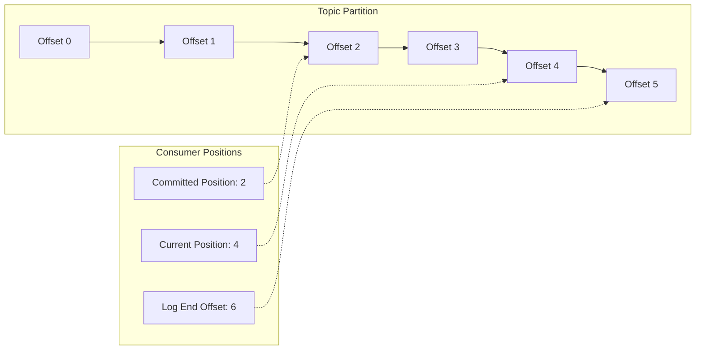
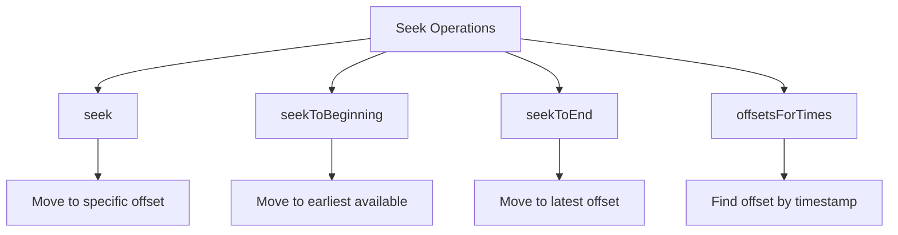
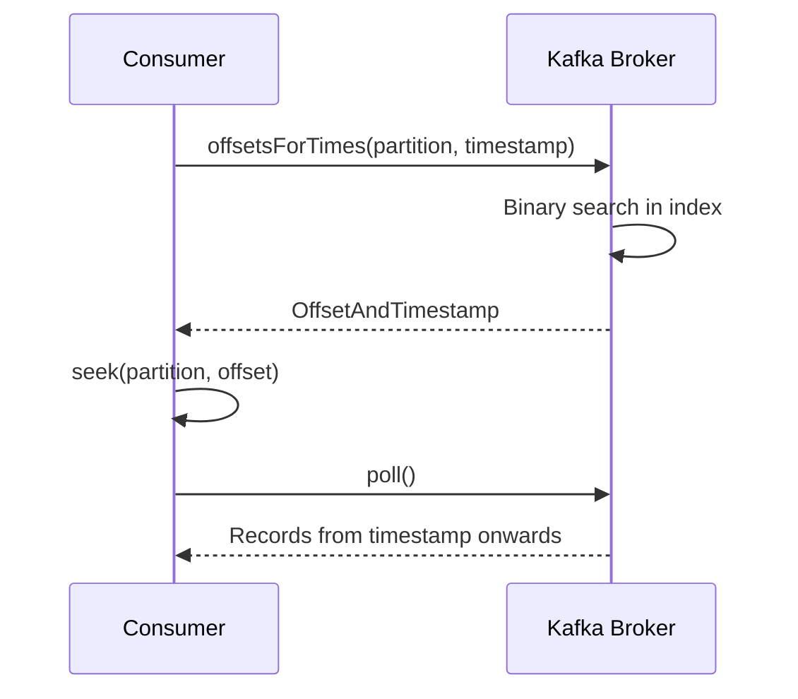
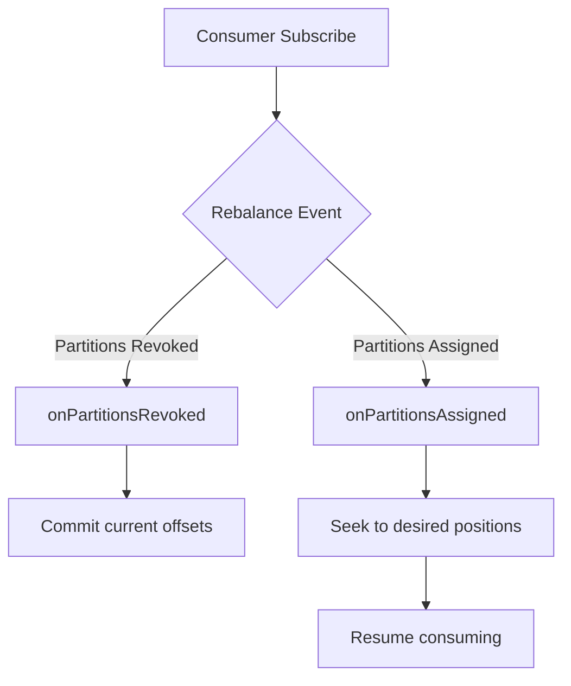
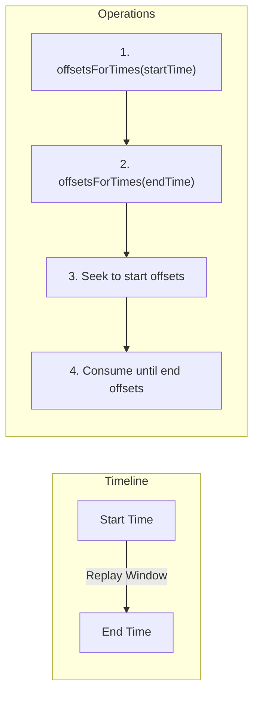
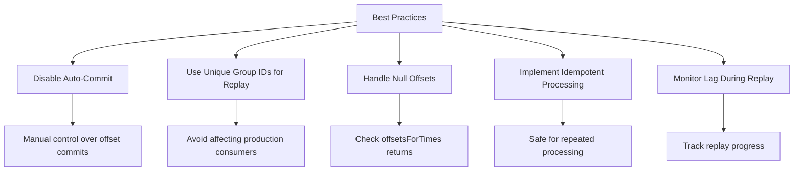

# How to Build Kafka Consumer Seek Operations

Author: [nawazdhandala](https://github.com/nawazdhandala)

Tags: Kafka, Consumer Seek, Offset Management, Replay

Description: Learn to implement Kafka consumer seek operations for offset repositioning with timestamp-based seek, beginning/end seek, and replay patterns.

---

## Introduction

Kafka consumers typically read messages sequentially from where they last committed their offset. However, there are scenarios where you need more control over where a consumer starts reading - whether it is replaying historical data, skipping corrupted messages, or synchronizing consumers across systems. This is where **consumer seek operations** become essential.

In this guide, we will explore how to implement Kafka consumer seek operations for precise offset management, covering practical patterns you can use in production systems.

## Understanding Kafka Offset Management

Before diving into seek operations, let us understand how Kafka manages offsets:



- **Committed Offset**: The last offset that has been persisted (survives consumer restarts)
- **Current Position**: Where the consumer is currently reading from
- **Log End Offset**: The offset of the next message to be written

## Core Seek Methods

Kafka provides several methods for repositioning consumers. Here is an overview of the available seek operations:



### 1. Basic Seek to Specific Offset

The `seek()` method allows you to move to a specific offset within a partition:

```java
import org.apache.kafka.clients.consumer.*;
import org.apache.kafka.common.TopicPartition;
import java.time.Duration;
import java.util.*;

public class BasicSeekExample {

    public static void main(String[] args) {
        Properties props = new Properties();
        props.put(ConsumerConfig.BOOTSTRAP_SERVERS_CONFIG, "localhost:9092");
        props.put(ConsumerConfig.GROUP_ID_CONFIG, "seek-demo-group");
        props.put(ConsumerConfig.KEY_DESERIALIZER_CLASS_CONFIG,
            "org.apache.kafka.common.serialization.StringDeserializer");
        props.put(ConsumerConfig.VALUE_DESERIALIZER_CLASS_CONFIG,
            "org.apache.kafka.common.serialization.StringDeserializer");
        props.put(ConsumerConfig.ENABLE_AUTO_COMMIT_CONFIG, "false");

        KafkaConsumer<String, String> consumer = new KafkaConsumer<>(props);

        String topic = "events-topic";
        TopicPartition partition0 = new TopicPartition(topic, 0);

        // Manually assign partitions (required for seek without subscribe)
        consumer.assign(Arrays.asList(partition0));

        // Seek to offset 100
        consumer.seek(partition0, 100);

        System.out.println("Seeked to offset 100 on partition 0");

        // Now consume from offset 100 onwards
        while (true) {
            ConsumerRecords<String, String> records = consumer.poll(Duration.ofMillis(1000));
            for (ConsumerRecord<String, String> record : records) {
                System.out.printf("Offset: %d, Key: %s, Value: %s%n",
                    record.offset(), record.key(), record.value());
            }
            consumer.commitSync();
        }
    }
}
```

**Key Points:**
- Disable auto-commit when using seek operations to maintain control over offset management
- Use `assign()` instead of `subscribe()` when you need partition-level control
- The seek takes effect on the next `poll()` call

### 2. Seek to Beginning

To replay all messages from the start of a partition:

```java
public class SeekToBeginningExample {

    public void replayFromBeginning(KafkaConsumer<String, String> consumer,
                                     String topic) {
        // Get all partitions for the topic
        List<PartitionInfo> partitionInfos = consumer.partitionsFor(topic);
        List<TopicPartition> partitions = new ArrayList<>();

        for (PartitionInfo info : partitionInfos) {
            partitions.add(new TopicPartition(topic, info.partition()));
        }

        // Assign all partitions
        consumer.assign(partitions);

        // Seek to the beginning of all assigned partitions
        consumer.seekToBeginning(partitions);

        System.out.println("Reset to beginning of all partitions");

        // Verify positions
        for (TopicPartition partition : partitions) {
            long position = consumer.position(partition);
            System.out.printf("Partition %d position: %d%n",
                partition.partition(), position);
        }
    }
}
```

### 3. Seek to End

To skip all existing messages and only consume new ones:

```java
public class SeekToEndExample {

    public void startFromLatest(KafkaConsumer<String, String> consumer,
                                 String topic) {
        List<PartitionInfo> partitionInfos = consumer.partitionsFor(topic);
        List<TopicPartition> partitions = new ArrayList<>();

        for (PartitionInfo info : partitionInfos) {
            partitions.add(new TopicPartition(topic, info.partition()));
        }

        consumer.assign(partitions);

        // Seek to the end of all partitions
        consumer.seekToEnd(partitions);

        System.out.println("Moved to end of all partitions - will only receive new messages");

        // Get the actual end offsets for logging
        Map<TopicPartition, Long> endOffsets = consumer.endOffsets(partitions);
        endOffsets.forEach((tp, offset) ->
            System.out.printf("Partition %d end offset: %d%n",
                tp.partition(), offset));
    }
}
```

## Timestamp-Based Seek Operations

One of the most powerful features is seeking by timestamp - useful for replaying events from a specific point in time:



### Implementation

```java
import org.apache.kafka.clients.consumer.OffsetAndTimestamp;
import java.time.Instant;
import java.time.temporal.ChronoUnit;

public class TimestampSeekExample {

    public void seekToTimestamp(KafkaConsumer<String, String> consumer,
                                 String topic,
                                 Instant targetTime) {

        List<PartitionInfo> partitionInfos = consumer.partitionsFor(topic);
        List<TopicPartition> partitions = new ArrayList<>();

        for (PartitionInfo info : partitionInfos) {
            partitions.add(new TopicPartition(topic, info.partition()));
        }

        consumer.assign(partitions);

        // Create a map of partitions to timestamps
        Map<TopicPartition, Long> timestampsToSearch = new HashMap<>();
        long targetTimestampMs = targetTime.toEpochMilli();

        for (TopicPartition partition : partitions) {
            timestampsToSearch.put(partition, targetTimestampMs);
        }

        // Get offsets for the specified timestamps
        Map<TopicPartition, OffsetAndTimestamp> offsetsForTimes =
            consumer.offsetsForTimes(timestampsToSearch);

        // Seek to the returned offsets
        for (Map.Entry<TopicPartition, OffsetAndTimestamp> entry :
             offsetsForTimes.entrySet()) {

            TopicPartition partition = entry.getKey();
            OffsetAndTimestamp offsetAndTimestamp = entry.getValue();

            if (offsetAndTimestamp != null) {
                consumer.seek(partition, offsetAndTimestamp.offset());
                System.out.printf("Partition %d: seeking to offset %d (timestamp: %d)%n",
                    partition.partition(),
                    offsetAndTimestamp.offset(),
                    offsetAndTimestamp.timestamp());
            } else {
                // No messages at or after the timestamp - seek to end
                consumer.seekToEnd(Collections.singleton(partition));
                System.out.printf("Partition %d: no messages after timestamp, seeking to end%n",
                    partition.partition());
            }
        }
    }

    // Usage example - seek to 24 hours ago
    public void replayLast24Hours(KafkaConsumer<String, String> consumer,
                                   String topic) {
        Instant twentyFourHoursAgo = Instant.now().minus(24, ChronoUnit.HOURS);
        seekToTimestamp(consumer, topic, twentyFourHoursAgo);
    }
}
```

**Important Considerations:**
- `offsetsForTimes()` returns the earliest offset whose timestamp is >= the target timestamp
- If no message exists at or after the timestamp, null is returned
- Timestamp indexing must be enabled on the broker (default since Kafka 0.10.1)

## Handling Partition Assignment with ConsumerRebalanceListener

When using `subscribe()` instead of `assign()`, you need to handle partition reassignments properly:



### Implementation with Rebalance Listener

```java
public class SeekOnRebalanceExample {

    private final Map<TopicPartition, Long> seekPositions = new ConcurrentHashMap<>();

    public void consumeWithSeekOnAssignment(String topic,
                                             Map<Integer, Long> partitionOffsets) {
        Properties props = createConsumerProperties();
        KafkaConsumer<String, String> consumer = new KafkaConsumer<>(props);

        // Store desired seek positions
        partitionOffsets.forEach((partition, offset) ->
            seekPositions.put(new TopicPartition(topic, partition), offset));

        // Subscribe with rebalance listener
        consumer.subscribe(Collections.singletonList(topic),
            new ConsumerRebalanceListener() {

                @Override
                public void onPartitionsRevoked(Collection<TopicPartition> partitions) {
                    System.out.println("Partitions revoked: " + partitions);
                    // Commit offsets before losing partition ownership
                    consumer.commitSync();
                }

                @Override
                public void onPartitionsAssigned(Collection<TopicPartition> partitions) {
                    System.out.println("Partitions assigned: " + partitions);

                    for (TopicPartition partition : partitions) {
                        Long seekOffset = seekPositions.get(partition);
                        if (seekOffset != null) {
                            consumer.seek(partition, seekOffset);
                            System.out.printf("Seeked partition %d to offset %d%n",
                                partition.partition(), seekOffset);
                        }
                    }
                }
            });

        // Consume loop
        try {
            while (true) {
                ConsumerRecords<String, String> records =
                    consumer.poll(Duration.ofMillis(1000));
                processRecords(records);
                consumer.commitSync();
            }
        } finally {
            consumer.close();
        }
    }

    private void processRecords(ConsumerRecords<String, String> records) {
        for (ConsumerRecord<String, String> record : records) {
            System.out.printf("Processing: partition=%d, offset=%d, value=%s%n",
                record.partition(), record.offset(), record.value());
        }
    }

    private Properties createConsumerProperties() {
        Properties props = new Properties();
        props.put(ConsumerConfig.BOOTSTRAP_SERVERS_CONFIG, "localhost:9092");
        props.put(ConsumerConfig.GROUP_ID_CONFIG, "seek-rebalance-group");
        props.put(ConsumerConfig.KEY_DESERIALIZER_CLASS_CONFIG,
            "org.apache.kafka.common.serialization.StringDeserializer");
        props.put(ConsumerConfig.VALUE_DESERIALIZER_CLASS_CONFIG,
            "org.apache.kafka.common.serialization.StringDeserializer");
        props.put(ConsumerConfig.ENABLE_AUTO_COMMIT_CONFIG, "false");
        props.put(ConsumerConfig.AUTO_OFFSET_RESET_CONFIG, "earliest");
        return props;
    }
}
```

## Replay Strategies

### Strategy 1: Full Topic Replay

Replay the entire topic for data reprocessing or backfilling:

```java
public class FullReplayStrategy {

    public void executeFullReplay(String topic,
                                   Consumer<ConsumerRecord<String, String>> processor) {
        Properties props = createConsumerProperties();
        // Use unique group ID for replay to avoid affecting production consumers
        props.put(ConsumerConfig.GROUP_ID_CONFIG,
            "replay-" + System.currentTimeMillis());

        try (KafkaConsumer<String, String> consumer = new KafkaConsumer<>(props)) {
            List<TopicPartition> partitions = getTopicPartitions(consumer, topic);
            consumer.assign(partitions);
            consumer.seekToBeginning(partitions);

            Map<TopicPartition, Long> endOffsets = consumer.endOffsets(partitions);
            Map<TopicPartition, Boolean> partitionComplete = new HashMap<>();
            partitions.forEach(p -> partitionComplete.put(p, false));

            while (partitionComplete.containsValue(false)) {
                ConsumerRecords<String, String> records =
                    consumer.poll(Duration.ofMillis(1000));

                for (ConsumerRecord<String, String> record : records) {
                    processor.accept(record);

                    // Check if we have reached the end
                    TopicPartition tp = new TopicPartition(record.topic(),
                        record.partition());
                    if (record.offset() >= endOffsets.get(tp) - 1) {
                        partitionComplete.put(tp, true);
                    }
                }
            }

            System.out.println("Full replay completed");
        }
    }

    private List<TopicPartition> getTopicPartitions(
            KafkaConsumer<String, String> consumer, String topic) {
        return consumer.partitionsFor(topic).stream()
            .map(info -> new TopicPartition(topic, info.partition()))
            .collect(Collectors.toList());
    }
}
```

### Strategy 2: Time-Window Replay

Replay messages within a specific time window:



```java
public class TimeWindowReplayStrategy {

    public void replayTimeWindow(String topic,
                                  Instant startTime,
                                  Instant endTime,
                                  Consumer<ConsumerRecord<String, String>> processor) {

        Properties props = createConsumerProperties();
        props.put(ConsumerConfig.GROUP_ID_CONFIG,
            "time-replay-" + System.currentTimeMillis());

        try (KafkaConsumer<String, String> consumer = new KafkaConsumer<>(props)) {
            List<TopicPartition> partitions = getTopicPartitions(consumer, topic);
            consumer.assign(partitions);

            // Get start offsets
            Map<TopicPartition, Long> startTimestamps = new HashMap<>();
            partitions.forEach(p -> startTimestamps.put(p, startTime.toEpochMilli()));
            Map<TopicPartition, OffsetAndTimestamp> startOffsets =
                consumer.offsetsForTimes(startTimestamps);

            // Get end offsets
            Map<TopicPartition, Long> endTimestamps = new HashMap<>();
            partitions.forEach(p -> endTimestamps.put(p, endTime.toEpochMilli()));
            Map<TopicPartition, OffsetAndTimestamp> endOffsets =
                consumer.offsetsForTimes(endTimestamps);

            // Build end offset map for checking completion
            Map<TopicPartition, Long> endOffsetValues = new HashMap<>();
            for (TopicPartition partition : partitions) {
                OffsetAndTimestamp endOt = endOffsets.get(partition);
                if (endOt != null) {
                    endOffsetValues.put(partition, endOt.offset());
                } else {
                    // No messages after end time - use current end offset
                    endOffsetValues.put(partition, consumer.endOffsets(
                        Collections.singleton(partition)).get(partition));
                }
            }

            // Seek to start positions
            for (TopicPartition partition : partitions) {
                OffsetAndTimestamp startOt = startOffsets.get(partition);
                if (startOt != null) {
                    consumer.seek(partition, startOt.offset());
                } else {
                    // No messages at or after start time - pause this partition
                    consumer.pause(Collections.singleton(partition));
                }
            }

            // Consume within the time window
            Set<TopicPartition> completedPartitions = new HashSet<>();

            while (completedPartitions.size() < partitions.size()) {
                ConsumerRecords<String, String> records =
                    consumer.poll(Duration.ofMillis(1000));

                for (ConsumerRecord<String, String> record : records) {
                    TopicPartition tp = new TopicPartition(record.topic(),
                        record.partition());

                    // Check if we have passed the end offset
                    if (record.offset() >= endOffsetValues.get(tp)) {
                        completedPartitions.add(tp);
                        consumer.pause(Collections.singleton(tp));
                        continue;
                    }

                    processor.accept(record);
                }

                // Check for empty polls on remaining partitions
                if (records.isEmpty()) {
                    for (TopicPartition tp : partitions) {
                        if (!completedPartitions.contains(tp)) {
                            long position = consumer.position(tp);
                            if (position >= endOffsetValues.get(tp)) {
                                completedPartitions.add(tp);
                            }
                        }
                    }
                }
            }

            System.out.println("Time window replay completed");
        }
    }
}
```

### Strategy 3: Selective Partition Replay

Replay specific partitions while others continue normal operation:

```java
public class SelectivePartitionReplay {

    public void replaySpecificPartitions(String topic,
                                          Set<Integer> partitionsToReplay,
                                          Map<Integer, Long> replayOffsets) {
        Properties props = createConsumerProperties();

        try (KafkaConsumer<String, String> consumer = new KafkaConsumer<>(props)) {
            // Get all partitions
            List<TopicPartition> allPartitions = getTopicPartitions(consumer, topic);
            consumer.assign(allPartitions);

            // For partitions to replay, seek to specified offsets
            // For others, resume from committed offset
            for (TopicPartition partition : allPartitions) {
                if (partitionsToReplay.contains(partition.partition())) {
                    Long replayOffset = replayOffsets.get(partition.partition());
                    if (replayOffset != null) {
                        consumer.seek(partition, replayOffset);
                        System.out.printf("Partition %d: replaying from offset %d%n",
                            partition.partition(), replayOffset);
                    } else {
                        consumer.seekToBeginning(Collections.singleton(partition));
                        System.out.printf("Partition %d: replaying from beginning%n",
                            partition.partition());
                    }
                } else {
                    // Let it resume from committed offset (default behavior)
                    System.out.printf("Partition %d: continuing from committed offset%n",
                        partition.partition());
                }
            }

            // Consume
            consumeLoop(consumer);
        }
    }
}
```

## Best Practices and Common Pitfalls

### Best Practices



### Common Pitfalls to Avoid

1. **Seeking before partition assignment**
   ```java
   // WRONG - seek before poll/assignment
   consumer.subscribe(topics);
   consumer.seek(partition, offset);  // Will throw exception!

   // CORRECT - use rebalance listener or assign
   consumer.assign(partitions);
   consumer.seek(partition, offset);
   ```

2. **Forgetting to handle rebalances**
   ```java
   // WRONG - seek positions lost on rebalance
   consumer.subscribe(topics);
   // ... later
   consumer.seek(partition, offset);  // Lost if rebalance happens

   // CORRECT - use ConsumerRebalanceListener
   consumer.subscribe(topics, new ConsumerRebalanceListener() {
       @Override
       public void onPartitionsAssigned(Collection<TopicPartition> partitions) {
           for (TopicPartition p : partitions) {
               consumer.seek(p, desiredOffset);
           }
       }
       // ... onPartitionsRevoked
   });
   ```

3. **Not checking for null in offsetsForTimes**
   ```java
   // WRONG - potential NPE
   Map<TopicPartition, OffsetAndTimestamp> offsets =
       consumer.offsetsForTimes(timestamps);
   consumer.seek(partition, offsets.get(partition).offset());

   // CORRECT - check for null
   OffsetAndTimestamp ot = offsets.get(partition);
   if (ot != null) {
       consumer.seek(partition, ot.offset());
   } else {
       consumer.seekToEnd(Collections.singleton(partition));
   }
   ```

## Monitoring Seek Operations

Track seek operations and replay progress with metrics:

```java
public class SeekMetrics {

    private final MeterRegistry registry;
    private final Counter seekOperations;
    private final Timer seekLatency;
    private final Gauge replayProgress;
    private final AtomicLong messagesReplayed = new AtomicLong(0);
    private final AtomicLong totalToReplay = new AtomicLong(0);

    public SeekMetrics(MeterRegistry registry) {
        this.registry = registry;

        this.seekOperations = Counter.builder("kafka.consumer.seek.operations")
            .description("Number of seek operations performed")
            .register(registry);

        this.seekLatency = Timer.builder("kafka.consumer.seek.latency")
            .description("Time taken to perform seek operations")
            .register(registry);

        this.replayProgress = Gauge.builder("kafka.consumer.replay.progress",
            this, SeekMetrics::calculateProgress)
            .description("Replay progress percentage")
            .register(registry);
    }

    public void recordSeek(Runnable seekOperation) {
        seekLatency.record(() -> {
            seekOperation.run();
            seekOperations.increment();
        });
    }

    public void recordReplayedMessage() {
        messagesReplayed.incrementAndGet();
    }

    public void setTotalToReplay(long total) {
        totalToReplay.set(total);
    }

    private double calculateProgress() {
        long total = totalToReplay.get();
        if (total == 0) return 0.0;
        return (double) messagesReplayed.get() / total * 100;
    }
}
```

## Conclusion

Kafka consumer seek operations provide powerful capabilities for controlling where your consumers read from. Key takeaways:

- Use `seek()` for precise offset control
- Use `seekToBeginning()` and `seekToEnd()` for boundary operations
- Use `offsetsForTimes()` for timestamp-based positioning
- Always handle partition rebalances when using `subscribe()`
- Implement idempotent processing for safe replay operations
- Use unique consumer group IDs for replay operations to avoid affecting production consumers

By mastering these seek operations, you gain the flexibility to handle data replay, recovery scenarios, and advanced offset management patterns in your Kafka-based systems.

## Further Reading

- [Kafka Consumer Documentation](https://kafka.apache.org/documentation/#consumerapi)
- [Kafka Consumer Configurations](https://kafka.apache.org/documentation/#consumerconfigs)
- [Kafka Offset Management](https://kafka.apache.org/documentation/#design_consumerposition)
