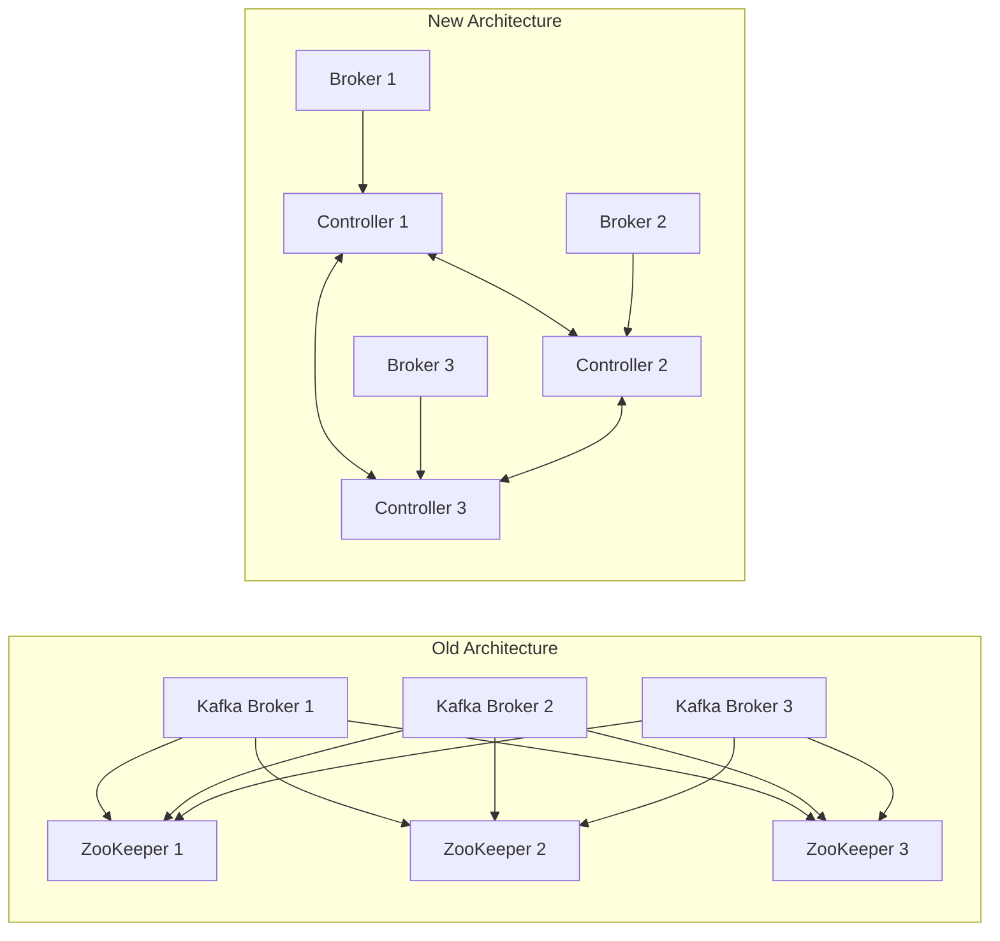
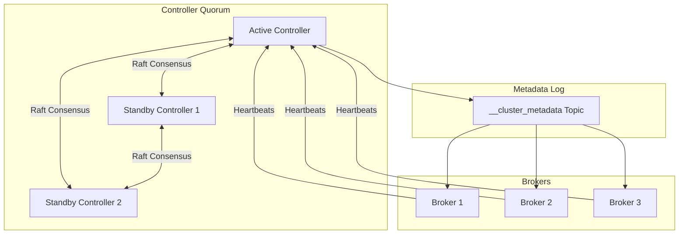
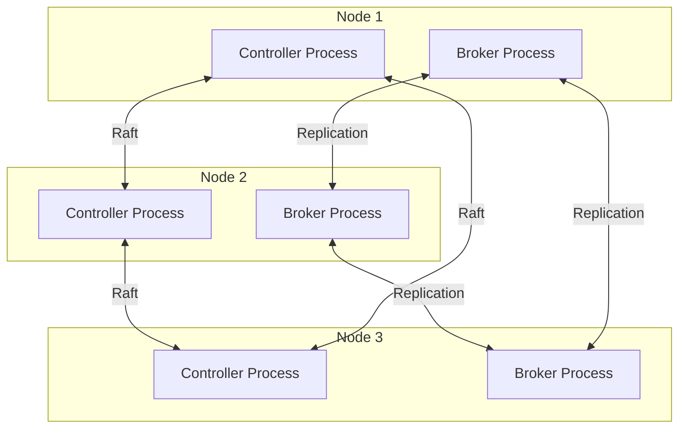
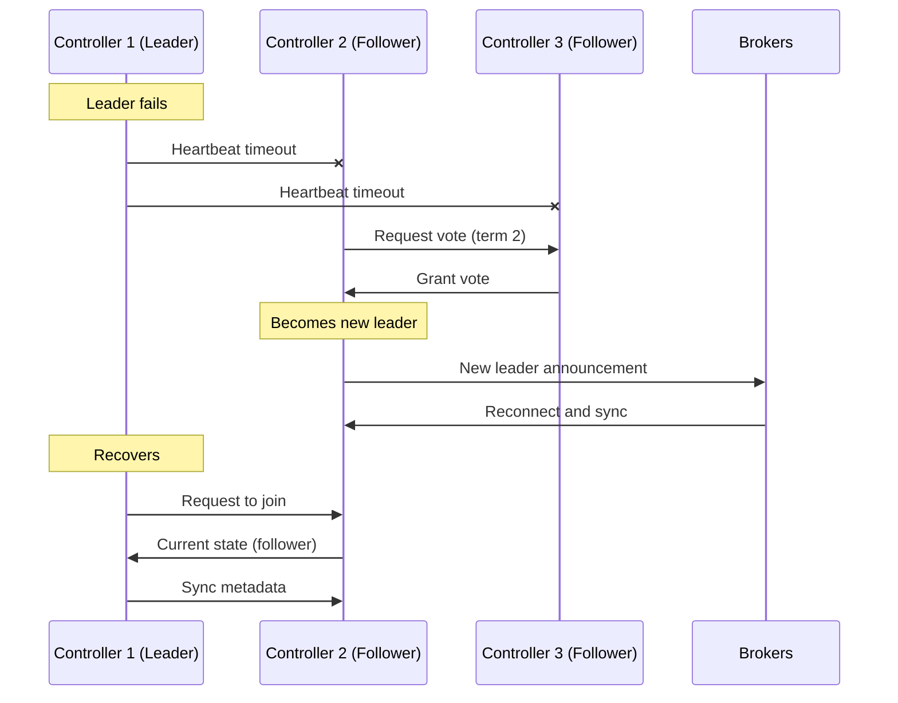

# How to Build Kafka Controller Quorum

Author: [nawazdhandala](https://github.com/nawazdhandala)

Tags: Kafka, KRaft, Controller, High Availability

Description: A comprehensive guide to building a Kafka Controller Quorum using KRaft mode, eliminating ZooKeeper dependency while achieving high availability and simplified operations.

---

Apache Kafka has undergone a fundamental architectural shift. The introduction of KRaft (Kafka Raft) mode eliminates the ZooKeeper dependency that has been part of Kafka since its inception. At the heart of this new architecture is the Controller Quorum - a self-managed consensus layer that handles metadata management. Here's how to build one.

## Why KRaft Replaces ZooKeeper



The benefits are significant:

- **Fewer moving parts**: No separate ZooKeeper cluster to manage
- **Faster failover**: Controller election happens in milliseconds, not seconds
- **Better scalability**: Supports millions of partitions without metadata bottlenecks
- **Simplified operations**: Single system to monitor, tune, and upgrade

## Understanding Controller Quorum Architecture



The Controller Quorum uses the Raft consensus protocol to:

1. Elect a single active controller
2. Replicate metadata changes across all controllers
3. Ensure consistency even during failures
4. Provide fast leader election on controller failure

## Prerequisites

Before building a Controller Quorum, ensure you have:

- Kafka 3.3+ (KRaft is production-ready from 3.3)
- Java 11 or later
- At least 3 nodes for high availability
- Dedicated storage for metadata logs

## Step 1: Generate a Cluster ID

Every KRaft cluster needs a unique identifier:

```bash
# Generate a new cluster ID
KAFKA_CLUSTER_ID=$(kafka-storage.sh random-uuid)
echo $KAFKA_CLUSTER_ID

# Example output: MkU3OEVBNTcwNTJENDM2Qk
```

Save this ID - you will need it for every node in the cluster.

## Step 2: Configure Controller Nodes

Create the configuration file for each controller. Here is the configuration for a 3-node controller quorum:

### Controller 1 Configuration

```properties
# /etc/kafka/controller-1.properties

# Node identity
node.id=1
process.roles=controller

# Controller quorum voters (id@host:port format)
controller.quorum.voters=1@controller-1:9093,2@controller-2:9093,3@controller-3:9093

# Listener configuration
listeners=CONTROLLER://controller-1:9093
controller.listener.names=CONTROLLER

# Inter-controller communication
listener.security.protocol.map=CONTROLLER:PLAINTEXT

# Metadata log directory (separate from broker logs)
log.dirs=/var/lib/kafka/controller-logs

# Cluster metadata settings
metadata.log.dir=/var/lib/kafka/metadata
metadata.log.segment.bytes=1073741824
metadata.log.segment.ms=604800000
metadata.max.retention.bytes=104857600
metadata.max.retention.ms=604800000

# Controller specific settings
controller.quorum.election.timeout.ms=1000
controller.quorum.fetch.timeout.ms=2000
controller.quorum.election.backoff.max.ms=1000
controller.quorum.request.timeout.ms=2000

# Performance tuning
num.io.threads=8
num.network.threads=3
socket.send.buffer.bytes=102400
socket.receive.buffer.bytes=102400
socket.request.max.bytes=104857600
```

### Controller 2 Configuration

```properties
# /etc/kafka/controller-2.properties

node.id=2
process.roles=controller

controller.quorum.voters=1@controller-1:9093,2@controller-2:9093,3@controller-3:9093

listeners=CONTROLLER://controller-2:9093
controller.listener.names=CONTROLLER
listener.security.protocol.map=CONTROLLER:PLAINTEXT

log.dirs=/var/lib/kafka/controller-logs
metadata.log.dir=/var/lib/kafka/metadata
metadata.log.segment.bytes=1073741824
metadata.log.segment.ms=604800000
metadata.max.retention.bytes=104857600
metadata.max.retention.ms=604800000

controller.quorum.election.timeout.ms=1000
controller.quorum.fetch.timeout.ms=2000
controller.quorum.election.backoff.max.ms=1000
controller.quorum.request.timeout.ms=2000

num.io.threads=8
num.network.threads=3
socket.send.buffer.bytes=102400
socket.receive.buffer.bytes=102400
socket.request.max.bytes=104857600
```

### Controller 3 Configuration

```properties
# /etc/kafka/controller-3.properties

node.id=3
process.roles=controller

controller.quorum.voters=1@controller-1:9093,2@controller-2:9093,3@controller-3:9093

listeners=CONTROLLER://controller-3:9093
controller.listener.names=CONTROLLER
listener.security.protocol.map=CONTROLLER:PLAINTEXT

log.dirs=/var/lib/kafka/controller-logs
metadata.log.dir=/var/lib/kafka/metadata
metadata.log.segment.bytes=1073741824
metadata.log.segment.ms=604800000
metadata.max.retention.bytes=104857600
metadata.max.retention.ms=604800000

controller.quorum.election.timeout.ms=1000
controller.quorum.fetch.timeout.ms=2000
controller.quorum.election.backoff.max.ms=1000
controller.quorum.request.timeout.ms=2000

num.io.threads=8
num.network.threads=3
socket.send.buffer.bytes=102400
socket.receive.buffer.bytes=102400
socket.request.max.bytes=104857600
```

## Step 3: Format Storage Directories

Before starting the controllers, format the storage directories with the cluster ID:

```bash
# On Controller 1
kafka-storage.sh format -t $KAFKA_CLUSTER_ID -c /etc/kafka/controller-1.properties

# On Controller 2
kafka-storage.sh format -t $KAFKA_CLUSTER_ID -c /etc/kafka/controller-2.properties

# On Controller 3
kafka-storage.sh format -t $KAFKA_CLUSTER_ID -c /etc/kafka/controller-3.properties
```

The output should show:

```
Formatting /var/lib/kafka/metadata with metadata.version 3.7-IV4.
```

## Step 4: Start the Controller Quorum

Start each controller node:

```bash
# On each controller node
kafka-server-start.sh /etc/kafka/controller-X.properties
```

For production, use systemd:

```ini
# /etc/systemd/system/kafka-controller.service

[Unit]
Description=Apache Kafka Controller
After=network.target

[Service]
Type=simple
User=kafka
Group=kafka
ExecStart=/opt/kafka/bin/kafka-server-start.sh /etc/kafka/controller.properties
ExecStop=/opt/kafka/bin/kafka-server-stop.sh
Restart=on-failure
RestartSec=10
LimitNOFILE=100000
Environment="KAFKA_HEAP_OPTS=-Xms2g -Xmx2g"
Environment="KAFKA_JVM_PERFORMANCE_OPTS=-XX:+UseG1GC -XX:MaxGCPauseMillis=20"

[Install]
WantedBy=multi-user.target
```

## Step 5: Configure Broker Nodes

Brokers need to know about the controller quorum:

```properties
# /etc/kafka/broker.properties

# Node identity
node.id=101
process.roles=broker

# Controller quorum connection
controller.quorum.voters=1@controller-1:9093,2@controller-2:9093,3@controller-3:9093
controller.listener.names=CONTROLLER

# Broker listeners
listeners=PLAINTEXT://broker-1:9092
advertised.listeners=PLAINTEXT://broker-1:9092
listener.security.protocol.map=CONTROLLER:PLAINTEXT,PLAINTEXT:PLAINTEXT

# Inter-broker communication
inter.broker.listener.name=PLAINTEXT

# Log directories
log.dirs=/var/lib/kafka/data

# Topic defaults
num.partitions=3
default.replication.factor=3
min.insync.replicas=2

# Performance tuning
num.io.threads=8
num.network.threads=3
num.replica.fetchers=4
socket.send.buffer.bytes=102400
socket.receive.buffer.bytes=102400
socket.request.max.bytes=104857600

# Log retention
log.retention.hours=168
log.segment.bytes=1073741824
log.retention.check.interval.ms=300000
```

## Step 6: Combined Mode (Development Only)

For development or small deployments, you can run controllers and brokers on the same nodes:

```properties
# /etc/kafka/combined.properties

node.id=1
process.roles=broker,controller

controller.quorum.voters=1@node-1:9093,2@node-2:9093,3@node-3:9093

listeners=PLAINTEXT://node-1:9092,CONTROLLER://node-1:9093
advertised.listeners=PLAINTEXT://node-1:9092
controller.listener.names=CONTROLLER
listener.security.protocol.map=CONTROLLER:PLAINTEXT,PLAINTEXT:PLAINTEXT

inter.broker.listener.name=PLAINTEXT

log.dirs=/var/lib/kafka/data
metadata.log.dir=/var/lib/kafka/metadata

num.partitions=3
default.replication.factor=3
min.insync.replicas=2
```



## Verifying the Controller Quorum

### Check Cluster Status

```bash
# Describe the metadata quorum
kafka-metadata.sh --snapshot /var/lib/kafka/metadata/__cluster_metadata-0/00000000000000000000.log --command "describe"

# Check active controller
kafka-metadata.sh --snapshot /var/lib/kafka/metadata/__cluster_metadata-0/00000000000000000000.log --command "node"
```

### Using kafka-metadata.sh

```bash
# Connect to the controller quorum
kafka-metadata.sh --connect controller-1:9093 --command "quorum-info"

# Example output:
# ClusterId:              MkU3OEVBNTcwNTJENDM2Qk
# LeaderId:               1
# LeaderEpoch:            5
# HighWatermark:          12847
# MaxFollowerLag:         0
# MaxFollowerLagTimeMs:   0
# CurrentVoters:          [1,2,3]
# CurrentObservers:       []
```

### Check Broker Registration

```bash
# List registered brokers
kafka-broker-api-versions.sh --bootstrap-server broker-1:9092

# Describe cluster
kafka-cluster.sh describe --bootstrap-server broker-1:9092
```

## Security Configuration

### TLS for Controller Communication

```properties
# Controller TLS configuration
listeners=CONTROLLER://controller-1:9093
controller.listener.names=CONTROLLER
listener.security.protocol.map=CONTROLLER:SSL

# SSL settings
ssl.keystore.location=/var/ssl/kafka/controller.keystore.jks
ssl.keystore.password=${KEYSTORE_PASSWORD}
ssl.key.password=${KEY_PASSWORD}
ssl.truststore.location=/var/ssl/kafka/controller.truststore.jks
ssl.truststore.password=${TRUSTSTORE_PASSWORD}

# Client authentication
ssl.client.auth=required
ssl.endpoint.identification.algorithm=HTTPS
```

### Generate Certificates

```bash
#!/bin/bash
# generate-controller-certs.sh

VALIDITY=365
KEYSTORE_PASSWORD="changeit"
KEY_PASSWORD="changeit"

# Generate CA
openssl req -new -x509 -keyout ca-key.pem -out ca-cert.pem -days $VALIDITY \
    -subj "/CN=Kafka-CA" -passout pass:$KEYSTORE_PASSWORD

# For each controller
for i in 1 2 3; do
    HOSTNAME="controller-$i"

    # Generate keystore
    keytool -keystore $HOSTNAME.keystore.jks -alias $HOSTNAME \
        -validity $VALIDITY -genkey -keyalg RSA -storepass $KEYSTORE_PASSWORD \
        -keypass $KEY_PASSWORD -dname "CN=$HOSTNAME"

    # Create certificate signing request
    keytool -keystore $HOSTNAME.keystore.jks -alias $HOSTNAME \
        -certreq -file $HOSTNAME.csr -storepass $KEYSTORE_PASSWORD

    # Sign with CA
    openssl x509 -req -CA ca-cert.pem -CAkey ca-key.pem \
        -in $HOSTNAME.csr -out $HOSTNAME-signed.crt \
        -days $VALIDITY -CAcreateserial -passin pass:$KEYSTORE_PASSWORD

    # Import CA and signed cert into keystore
    keytool -keystore $HOSTNAME.keystore.jks -alias CARoot \
        -import -file ca-cert.pem -storepass $KEYSTORE_PASSWORD -noprompt
    keytool -keystore $HOSTNAME.keystore.jks -alias $HOSTNAME \
        -import -file $HOSTNAME-signed.crt -storepass $KEYSTORE_PASSWORD

    # Create truststore
    keytool -keystore $HOSTNAME.truststore.jks -alias CARoot \
        -import -file ca-cert.pem -storepass $KEYSTORE_PASSWORD -noprompt
done
```

## Kubernetes Deployment

### StatefulSet for Controller Quorum

```yaml
apiVersion: apps/v1
kind: StatefulSet
metadata:
  name: kafka-controller
  namespace: kafka
spec:
  serviceName: kafka-controller-headless
  replicas: 3
  selector:
    matchLabels:
      app: kafka-controller
  template:
    metadata:
      labels:
        app: kafka-controller
    spec:
      affinity:
        podAntiAffinity:
          requiredDuringSchedulingIgnoredDuringExecution:
            - labelSelector:
                matchLabels:
                  app: kafka-controller
              topologyKey: kubernetes.io/hostname
      containers:
        - name: kafka-controller
          image: apache/kafka:3.7.0
          ports:
            - containerPort: 9093
              name: controller
          env:
            - name: KAFKA_NODE_ID
              valueFrom:
                fieldRef:
                  fieldPath: metadata.name
            - name: KAFKA_PROCESS_ROLES
              value: "controller"
            - name: KAFKA_CONTROLLER_QUORUM_VOTERS
              value: "0@kafka-controller-0.kafka-controller-headless:9093,1@kafka-controller-1.kafka-controller-headless:9093,2@kafka-controller-2.kafka-controller-headless:9093"
            - name: KAFKA_LISTENERS
              value: "CONTROLLER://:9093"
            - name: KAFKA_CONTROLLER_LISTENER_NAMES
              value: "CONTROLLER"
            - name: KAFKA_LISTENER_SECURITY_PROTOCOL_MAP
              value: "CONTROLLER:PLAINTEXT"
          volumeMounts:
            - name: data
              mountPath: /var/lib/kafka
          resources:
            requests:
              memory: "2Gi"
              cpu: "500m"
            limits:
              memory: "4Gi"
              cpu: "2000m"
          livenessProbe:
            tcpSocket:
              port: 9093
            initialDelaySeconds: 30
            periodSeconds: 10
          readinessProbe:
            tcpSocket:
              port: 9093
            initialDelaySeconds: 10
            periodSeconds: 5
  volumeClaimTemplates:
    - metadata:
        name: data
      spec:
        accessModes: ["ReadWriteOnce"]
        storageClassName: fast-ssd
        resources:
          requests:
            storage: 10Gi
---
apiVersion: v1
kind: Service
metadata:
  name: kafka-controller-headless
  namespace: kafka
spec:
  clusterIP: None
  selector:
    app: kafka-controller
  ports:
    - port: 9093
      name: controller
```

### Init Container for Storage Formatting

```yaml
initContainers:
  - name: format-storage
    image: apache/kafka:3.7.0
    command:
      - /bin/bash
      - -c
      - |
        # Extract node ID from pod name (kafka-controller-0 -> 0)
        NODE_ID=${HOSTNAME##*-}

        # Check if already formatted
        if [ ! -f /var/lib/kafka/metadata/meta.properties ]; then
          echo "Formatting storage for node $NODE_ID"
          /opt/kafka/bin/kafka-storage.sh format \
            -t ${CLUSTER_ID} \
            -c /etc/kafka/controller.properties \
            --node-id $NODE_ID
        else
          echo "Storage already formatted"
        fi
    env:
      - name: CLUSTER_ID
        valueFrom:
          configMapKeyRef:
            name: kafka-config
            key: cluster-id
    volumeMounts:
      - name: data
        mountPath: /var/lib/kafka
      - name: config
        mountPath: /etc/kafka
```

## Monitoring the Controller Quorum

### Key JMX Metrics

```bash
# Controller metrics to monitor
kafka.controller:type=KafkaController,name=ActiveControllerCount
kafka.controller:type=KafkaController,name=GlobalPartitionCount
kafka.controller:type=KafkaController,name=GlobalTopicCount
kafka.controller:type=KafkaController,name=OfflinePartitionsCount

# Raft metrics
kafka.server:type=raft-metrics,name=commit-latency-avg
kafka.server:type=raft-metrics,name=commit-latency-max
kafka.server:type=raft-metrics,name=current-leader
kafka.server:type=raft-metrics,name=high-watermark
kafka.server:type=raft-metrics,name=log-end-offset
```

### Prometheus Configuration

```yaml
# prometheus-jmx-config.yaml
rules:
  - pattern: "kafka.controller<type=KafkaController, name=(.+)><>Value"
    name: "kafka_controller_$1"
    type: GAUGE

  - pattern: "kafka.server<type=raft-metrics, name=(.+)><>Value"
    name: "kafka_raft_$1"
    type: GAUGE

  - pattern: "kafka.server<type=raft-metrics, name=(.+)><>Count"
    name: "kafka_raft_$1_total"
    type: COUNTER
```

### Alerting Rules

```yaml
groups:
  - name: kafka-controller-alerts
    rules:
      - alert: KafkaNoActiveController
        expr: sum(kafka_controller_ActiveControllerCount) == 0
        for: 1m
        labels:
          severity: critical
        annotations:
          summary: "No active Kafka controller"
          description: "The Kafka cluster has no active controller for over 1 minute"

      - alert: KafkaMultipleActiveControllers
        expr: sum(kafka_controller_ActiveControllerCount) > 1
        for: 30s
        labels:
          severity: critical
        annotations:
          summary: "Multiple active Kafka controllers detected"
          description: "Split brain condition - multiple controllers are active"

      - alert: KafkaControllerHighLatency
        expr: kafka_raft_commit_latency_avg > 100
        for: 5m
        labels:
          severity: warning
        annotations:
          summary: "High controller commit latency"
          description: "Controller commit latency is {{ $value }}ms"

      - alert: KafkaOfflinePartitions
        expr: kafka_controller_OfflinePartitionsCount > 0
        for: 1m
        labels:
          severity: critical
        annotations:
          summary: "Kafka offline partitions detected"
          description: "{{ $value }} partitions are offline"
```

## Handling Controller Failures



### Graceful Controller Shutdown

```bash
# Gracefully stop a controller
kafka-server-stop.sh

# The quorum will elect a new leader if needed
# Remaining controllers continue serving requests
```

### Adding a New Controller

```bash
# 1. Configure the new controller with the existing quorum voters
# 2. Format storage with the cluster ID
kafka-storage.sh format -t $KAFKA_CLUSTER_ID -c /etc/kafka/controller-4.properties

# 3. Start the new controller
kafka-server-start.sh /etc/kafka/controller-4.properties

# 4. Add to quorum voters (requires rolling restart of all controllers)
# Update controller.quorum.voters in all configs:
# controller.quorum.voters=1@c1:9093,2@c2:9093,3@c3:9093,4@c4:9093
```

### Removing a Controller

```bash
# 1. Ensure the controller to remove is not the leader
# 2. Stop the controller
kafka-server-stop.sh

# 3. Update controller.quorum.voters on remaining controllers
# Remove the node from the voters list

# 4. Rolling restart remaining controllers
```

## Performance Tuning

### Controller Memory Settings

```bash
# Recommended JVM settings for controllers
KAFKA_HEAP_OPTS="-Xms2g -Xmx2g"
KAFKA_JVM_PERFORMANCE_OPTS="-XX:+UseG1GC -XX:MaxGCPauseMillis=20 -XX:InitiatingHeapOccupancyPercent=35 -XX:+ExplicitGCInvokesConcurrent"
```

### Network Tuning

```properties
# Increase for high-throughput clusters
socket.send.buffer.bytes=1048576
socket.receive.buffer.bytes=1048576
socket.request.max.bytes=104857600

# Controller quorum timeouts
controller.quorum.election.timeout.ms=1000
controller.quorum.fetch.timeout.ms=2000
controller.quorum.append.linger.ms=25
```

### Storage Optimization

```properties
# Metadata log settings
metadata.log.segment.bytes=1073741824
metadata.log.segment.ms=604800000
metadata.max.retention.bytes=104857600
metadata.max.retention.ms=604800000

# Use fast SSD storage for metadata
# Separate metadata disk from broker data disk
```

## Common Issues and Solutions

### Issue: Controller Election Stuck

```bash
# Check controller logs for errors
grep -i "election" /var/log/kafka/controller.log

# Verify network connectivity between controllers
nc -zv controller-2 9093
nc -zv controller-3 9093

# Check if quorum voters are correctly configured
grep "controller.quorum.voters" /etc/kafka/controller.properties
```

### Issue: Metadata Sync Lag

```bash
# Check follower lag
kafka-metadata.sh --connect controller-1:9093 --command "quorum-info"

# If lag is high, check:
# 1. Network bandwidth between controllers
# 2. Disk I/O on follower controllers
# 3. Memory pressure causing GC pauses
```

### Issue: Split Brain

```bash
# If multiple controllers claim leadership:
# 1. Stop all controllers
# 2. Identify the controller with the highest epoch
# 3. Start that controller first
# 4. Start remaining controllers
```

## Migration from ZooKeeper

```mermaid
flowchart TB
    subgraph Phase 1
        ZK[ZooKeeper Mode]
        B1[Brokers]
        ZK --> B1
    end

    subgraph Phase 2
        ZK2[ZooKeeper]
        CQ[Controller Quorum]
        B2[Brokers]
        ZK2 --> B2
        CQ --> B2
    end

    subgraph Phase 3
        CQ2[Controller Quorum]
        B3[Brokers]
        CQ2 --> B3
    end

    Phase 1 -->|Deploy Controllers| Phase 2
    Phase 2 -->|Migrate Metadata| Phase 3
```

### Migration Steps

```bash
# 1. Deploy controller quorum alongside existing ZooKeeper cluster
# 2. Migrate metadata
kafka-metadata.sh --bootstrap-server broker-1:9092 \
    --command "migrate" \
    --controller-quorum-voters "1@c1:9093,2@c2:9093,3@c3:9093"

# 3. Reconfigure brokers to use KRaft mode
# 4. Restart brokers with new configuration
# 5. Decommission ZooKeeper cluster
```

## Best Practices

1. **Always use odd numbers**: Deploy 3 or 5 controllers for proper quorum
2. **Separate roles in production**: Run controllers on dedicated nodes
3. **Use fast storage**: SSDs are essential for metadata performance
4. **Monitor commit latency**: High latency indicates cluster health issues
5. **Plan for failure**: Test controller failover regularly
6. **Secure communication**: Use TLS between controllers
7. **Backup metadata**: Regularly snapshot the metadata log
8. **Avoid combined mode in production**: Separate controller and broker roles

---

The Kafka Controller Quorum represents a major step forward in Kafka's architecture. By eliminating ZooKeeper, you get a simpler, faster, and more scalable system. Start with a development cluster to understand the new architecture, then migrate your production clusters when you are ready. The investment in learning KRaft pays off with reduced operational complexity and better cluster performance.
