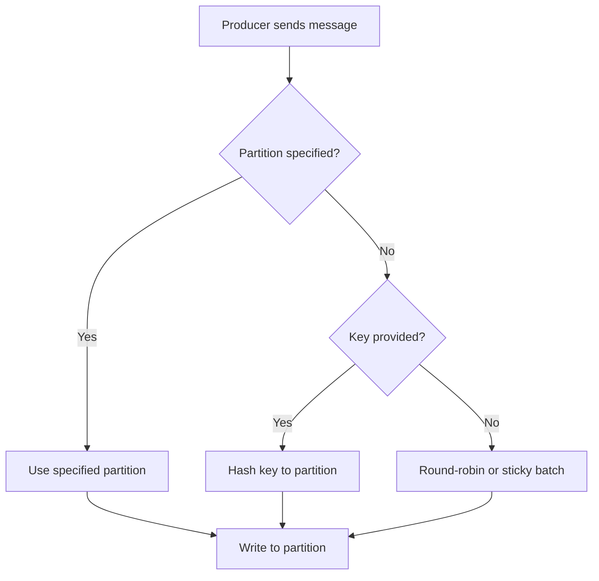
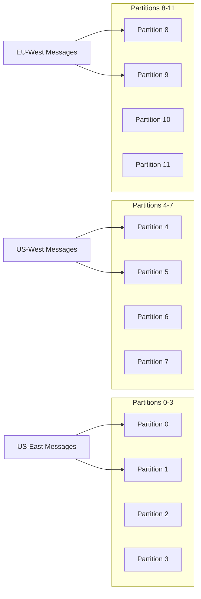

# How to Build Kafka Custom Partitioners

Author: [nawazdhandala](https://www.github.com/nawazdhandala)

Tags: Kafka, Partitioning, Java, Message Queue, Distributed Systems

Description: Create custom Kafka partitioners for intelligent message routing based on business logic, geographic location, or priority levels.

---

Kafka's default partitioner works well for most use cases, but sometimes you need more control over where messages land. Maybe you want high-priority orders processed first, or you need to keep EU customer data on specific partitions for compliance. Custom partitioners give you that control.

This guide walks through building custom partitioners from scratch, covering common patterns and production considerations.

## How Kafka Partitioning Works

When you send a message to Kafka, the partitioner decides which partition receives it. The default behavior follows these rules:



The default hash-based partitioner uses murmur2 hashing, which distributes keys evenly but does not understand your business logic. That is where custom partitioners come in.

## The Partitioner Interface

Every custom partitioner implements the `Partitioner` interface with three methods.

```java
import org.apache.kafka.clients.producer.Partitioner;
import org.apache.kafka.common.Cluster;
import java.util.Map;

public class MyCustomPartitioner implements Partitioner {

    @Override
    public void configure(Map<String, ?> configs) {
        // Called once at producer startup
        // Read configuration values here
    }

    @Override
    public int partition(String topic, Object key, byte[] keyBytes,
                         Object value, byte[] valueBytes, Cluster cluster) {
        // Called for every message
        // Return the partition number (0-indexed)
        return 0;
    }

    @Override
    public void close() {
        // Called when producer shuts down
        // Clean up resources here
    }
}
```

## Building a Priority-Based Partitioner

Let's build a partitioner that routes high-priority messages to dedicated partitions. This ensures critical messages get processed by dedicated consumers without waiting behind lower-priority traffic.

```java
import org.apache.kafka.clients.producer.Partitioner;
import org.apache.kafka.common.Cluster;
import org.apache.kafka.common.PartitionInfo;
import java.util.List;
import java.util.Map;

public class PriorityPartitioner implements Partitioner {

    // Number of partitions reserved for high-priority messages
    private int highPriorityPartitions;

    @Override
    public void configure(Map<String, ?> configs) {
        // Read custom configuration
        // Default to 2 high-priority partitions if not specified
        Object value = configs.get("partitioner.priority.high.count");
        this.highPriorityPartitions = value != null ? Integer.parseInt(value.toString()) : 2;
    }

    @Override
    public int partition(String topic, Object key, byte[] keyBytes,
                         Object value, byte[] valueBytes, Cluster cluster) {

        List<PartitionInfo> partitions = cluster.partitionsForTopic(topic);
        int numPartitions = partitions.size();

        // Key format expected: "priority:entityId" (e.g., "high:order-123")
        String keyStr = (String) key;

        if (keyStr == null) {
            // No key provided - use round-robin on normal partitions
            return highPriorityPartitions + (int)(Math.random() * (numPartitions - highPriorityPartitions));
        }

        String[] parts = keyStr.split(":", 2);
        String priority = parts[0].toLowerCase();
        String entityId = parts.length > 1 ? parts[1] : keyStr;

        if ("high".equals(priority) || "critical".equals(priority)) {
            // Route to high-priority partitions (0 to highPriorityPartitions-1)
            int hash = Math.abs(entityId.hashCode());
            return hash % highPriorityPartitions;
        }

        // Normal priority - distribute across remaining partitions
        int hash = Math.abs(entityId.hashCode());
        int normalPartitionCount = numPartitions - highPriorityPartitions;
        return highPriorityPartitions + (hash % normalPartitionCount);
    }

    @Override
    public void close() {
        // Nothing to clean up
    }
}
```

Register the partitioner with your producer configuration.

```java
Properties props = new Properties();
props.put(ProducerConfig.BOOTSTRAP_SERVERS_CONFIG, "kafka:9092");
props.put(ProducerConfig.KEY_SERIALIZER_CLASS_CONFIG, StringSerializer.class.getName());
props.put(ProducerConfig.VALUE_SERIALIZER_CLASS_CONFIG, StringSerializer.class.getName());

// Register the custom partitioner
props.put(ProducerConfig.PARTITIONER_CLASS_CONFIG, PriorityPartitioner.class.getName());

// Pass custom configuration to the partitioner
props.put("partitioner.priority.high.count", "3");

KafkaProducer<String, String> producer = new KafkaProducer<>(props);
```

## Building a Geographic Partitioner

For applications with data residency requirements, you might need messages from specific regions to land on specific partitions. This partitioner maps geographic regions to partition ranges.

```java
import org.apache.kafka.clients.producer.Partitioner;
import org.apache.kafka.common.Cluster;
import java.util.HashMap;
import java.util.Map;

public class GeoPartitioner implements Partitioner {

    // Maps region codes to their starting partition index
    private Map<String, Integer> regionToPartition;
    private int partitionsPerRegion;

    @Override
    public void configure(Map<String, ?> configs) {
        // Configure partitions per region (default: 4)
        Object ppr = configs.get("partitioner.geo.partitions.per.region");
        this.partitionsPerRegion = ppr != null ? Integer.parseInt(ppr.toString()) : 4;

        // Build region mapping
        // Regions get consecutive partition ranges
        regionToPartition = new HashMap<>();
        regionToPartition.put("us-east", 0);
        regionToPartition.put("us-west", partitionsPerRegion);
        regionToPartition.put("eu-west", partitionsPerRegion * 2);
        regionToPartition.put("ap-southeast", partitionsPerRegion * 3);
    }

    @Override
    public int partition(String topic, Object key, byte[] keyBytes,
                         Object value, byte[] valueBytes, Cluster cluster) {

        int numPartitions = cluster.partitionCountForTopic(topic);

        // Key format: "region:entityId" (e.g., "eu-west:customer-456")
        String keyStr = (String) key;

        if (keyStr == null || !keyStr.contains(":")) {
            // Fallback to hash-based distribution
            int hash = keyStr != null ? Math.abs(keyStr.hashCode()) : (int)(Math.random() * numPartitions);
            return hash % numPartitions;
        }

        String[] parts = keyStr.split(":", 2);
        String region = parts[0].toLowerCase();
        String entityId = parts[1];

        Integer basePartition = regionToPartition.get(region);

        if (basePartition == null) {
            // Unknown region - hash to available partitions
            return Math.abs(entityId.hashCode()) % numPartitions;
        }

        // Distribute within the region's partition range
        int offsetInRegion = Math.abs(entityId.hashCode()) % partitionsPerRegion;
        int targetPartition = basePartition + offsetInRegion;

        // Safety check - ensure we do not exceed available partitions
        return targetPartition < numPartitions ? targetPartition : (targetPartition % numPartitions);
    }

    @Override
    public void close() {}
}
```

The partition layout looks like this:



## Building a Weighted Partitioner

Sometimes you need to send more traffic to certain partitions, perhaps because those partitions are served by beefier brokers or you want to gradually migrate traffic.

```java
import org.apache.kafka.clients.producer.Partitioner;
import org.apache.kafka.common.Cluster;
import java.util.Map;
import java.util.concurrent.ThreadLocalRandom;

public class WeightedPartitioner implements Partitioner {

    // Weights for each partition (higher weight = more traffic)
    private int[] weights;
    private int totalWeight;

    @Override
    public void configure(Map<String, ?> configs) {
        // Configuration: "partitioner.weights" = "10,10,5,5,2"
        // Partitions 0-1 get 10 units, 2-3 get 5 units, 4 gets 2 units
        String weightConfig = (String) configs.get("partitioner.weights");

        if (weightConfig != null) {
            String[] parts = weightConfig.split(",");
            weights = new int[parts.length];
            totalWeight = 0;

            for (int i = 0; i < parts.length; i++) {
                weights[i] = Integer.parseInt(parts[i].trim());
                totalWeight += weights[i];
            }
        } else {
            // Default: equal weights for 8 partitions
            weights = new int[]{1, 1, 1, 1, 1, 1, 1, 1};
            totalWeight = 8;
        }
    }

    @Override
    public int partition(String topic, Object key, byte[] keyBytes,
                         Object value, byte[] valueBytes, Cluster cluster) {

        int numPartitions = cluster.partitionCountForTopic(topic);

        // Pick a random number in the weight range
        int random = ThreadLocalRandom.current().nextInt(totalWeight);

        // Find which partition this maps to
        int cumulative = 0;
        for (int i = 0; i < weights.length && i < numPartitions; i++) {
            cumulative += weights[i];
            if (random < cumulative) {
                return i;
            }
        }

        // Fallback to last partition
        return Math.min(weights.length - 1, numPartitions - 1);
    }

    @Override
    public void close() {}
}
```

## Testing Your Custom Partitioner

Always test partition distribution before deploying to production. Here is a simple test harness.

```java
import org.apache.kafka.common.Cluster;
import org.apache.kafka.common.Node;
import org.apache.kafka.common.PartitionInfo;
import java.util.*;

public class PartitionerTest {

    public static void main(String[] args) {
        // Create a mock cluster with 12 partitions
        List<PartitionInfo> partitions = new ArrayList<>();
        Node node = new Node(0, "localhost", 9092);

        for (int i = 0; i < 12; i++) {
            partitions.add(new PartitionInfo("test-topic", i, node,
                new Node[]{node}, new Node[]{node}));
        }

        Cluster cluster = new Cluster(
            "test-cluster",
            Collections.singletonList(node),
            partitions,
            Collections.emptySet(),
            Collections.emptySet()
        );

        // Initialize the partitioner
        PriorityPartitioner partitioner = new PriorityPartitioner();
        partitioner.configure(Map.of("partitioner.priority.high.count", "3"));

        // Track distribution
        Map<Integer, Integer> distribution = new HashMap<>();

        // Send test messages
        String[] testKeys = {
            "high:order-1", "high:order-2", "high:order-3",
            "normal:order-4", "normal:order-5", "low:order-6"
        };

        for (int i = 0; i < 10000; i++) {
            String key = testKeys[i % testKeys.length];
            int partition = partitioner.partition("test-topic", key, key.getBytes(),
                null, null, cluster);
            distribution.merge(partition, 1, Integer::sum);
        }

        // Print results
        System.out.println("Partition Distribution:");
        distribution.entrySet().stream()
            .sorted(Map.Entry.comparingByKey())
            .forEach(e -> System.out.printf("  Partition %d: %d messages%n",
                e.getKey(), e.getValue()));

        partitioner.close();
    }
}
```

## Production Considerations

A few things to keep in mind when running custom partitioners in production.

**Partition count changes** can break your partitioner logic. If your geographic partitioner expects 16 partitions and someone adds more, the region mapping might shift unexpectedly. Always validate partition counts match your expectations.

**Key format validation** prevents cryptic errors. If your partitioner expects "region:entityId" format but receives something else, fail fast with a clear error rather than silently misrouting messages.

**Thread safety** matters because Kafka producers are thread-safe and can call your partitioner from multiple threads simultaneously. Avoid mutable shared state, or protect it with synchronization.

**Monitoring** helps catch issues early. Track the distribution of messages across partitions using Kafka metrics or your own instrumentation. Uneven distribution often indicates a problem with the partitioner logic.

---

Custom partitioners unlock powerful routing capabilities in Kafka, from priority lanes to geographic compliance to weighted traffic distribution. The key is matching your partition strategy to your actual business requirements. Start with the simplest approach that works, test thoroughly, and monitor the distribution in production. When the default partitioner does the job, use it. When it does not, now you know how to build your own.
