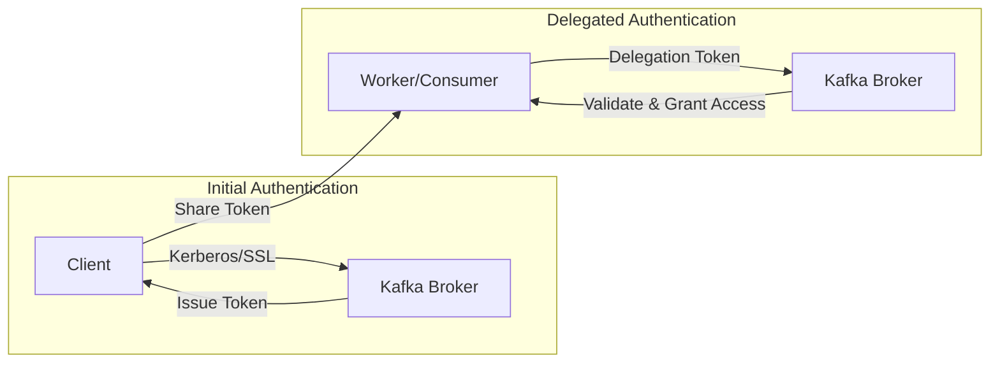
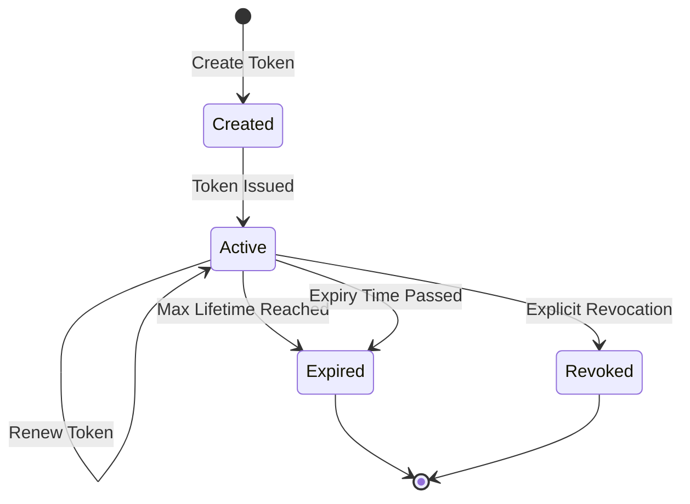
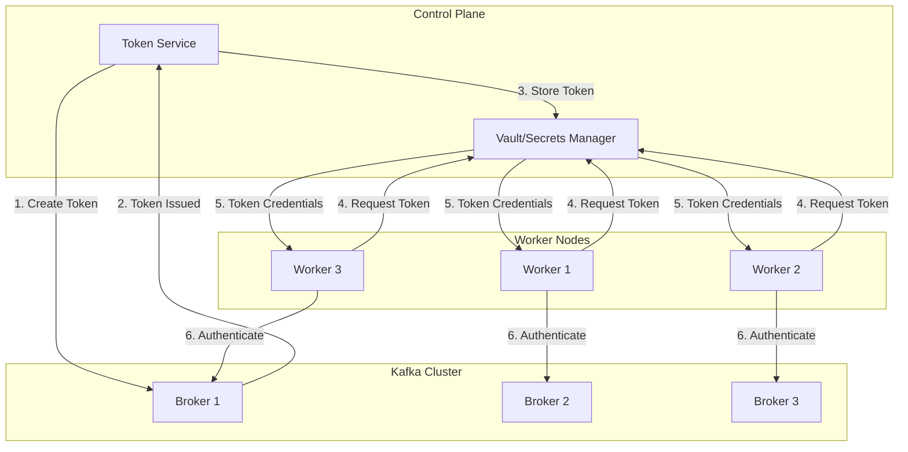
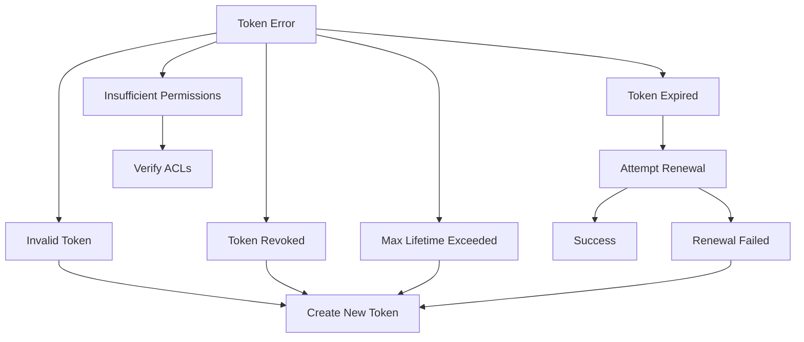
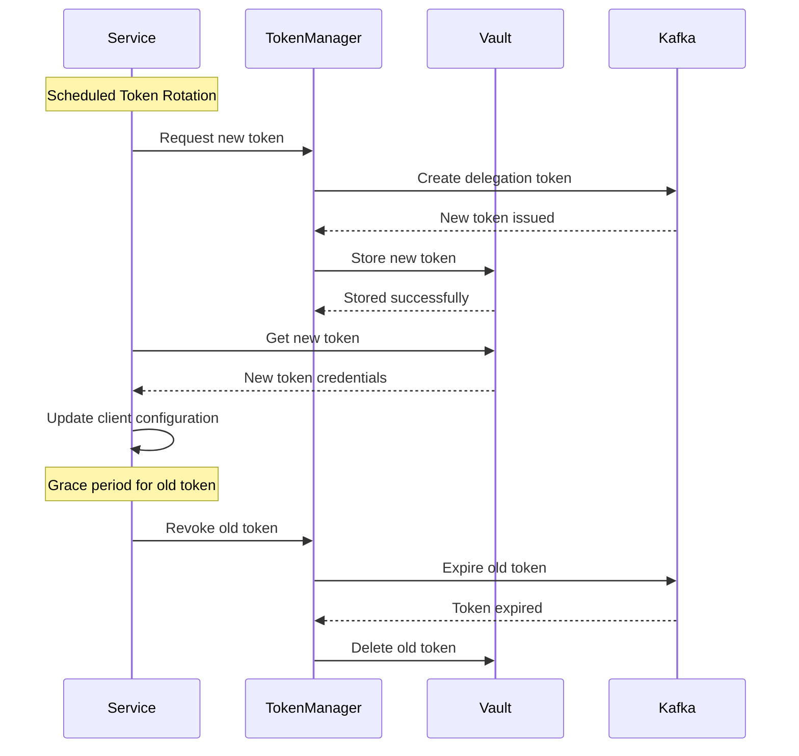

# How to Implement Kafka Delegation Tokens

Author: [nawazdhandala](https://github.com/nawazdhandala)

Tags: Kafka, Security, Authentication, Tokens

Description: A comprehensive guide to implementing Kafka delegation tokens for secure, scalable authentication in distributed environments. Learn token creation, renewal, expiration handling, and production best practices.

---

> Kafka delegation tokens provide a lightweight authentication mechanism that reduces the overhead of distributing Kerberos credentials or SSL certificates across large clusters. They enable secure, short-lived access to Kafka resources without requiring each client to manage complex authentication infrastructure.

Managing authentication in large Kafka deployments is challenging. Delegation tokens offer a practical solution for secure, scalable access control.

---

## What Are Kafka Delegation Tokens?

Kafka delegation tokens are authentication tokens that allow clients to authenticate with Kafka brokers without requiring direct access to the underlying authentication credentials (such as Kerberos tickets or SSL certificates). They act as a proxy for the original credentials, enabling secure delegation of access rights.



---

## Why Use Delegation Tokens?

Delegation tokens solve several common problems in distributed Kafka deployments:

1. **Simplified Credential Distribution** - No need to distribute Kerberos keytabs or SSL certificates to every worker node
2. **Enhanced Security** - Tokens are short-lived and can be revoked without affecting the master credentials
3. **Scalability** - Ideal for dynamic environments where workers are created and destroyed frequently
4. **Reduced Overhead** - Lower computational cost compared to full Kerberos authentication per request

---

## Prerequisites

Before implementing delegation tokens, ensure your Kafka cluster meets these requirements:

- Kafka version 1.1.0 or later
- SASL authentication enabled (SASL/SCRAM, SASL/PLAIN, or Kerberos)
- Proper ACLs configured for token operations
- Secure inter-broker communication

### Broker Configuration

Enable delegation tokens in your Kafka broker configuration:

```properties
# server.properties

# Enable delegation token authentication
delegation.token.master.key=your-secret-master-key
delegation.token.max.lifetime.ms=604800000
delegation.token.expiry.time.ms=86400000
delegation.token.expiry.check.interval.ms=3600000

# SASL configuration
sasl.enabled.mechanisms=SCRAM-SHA-256,SCRAM-SHA-512
sasl.mechanism.inter.broker.protocol=SCRAM-SHA-256

# Security protocol
security.inter.broker.protocol=SASL_SSL
listeners=SASL_SSL://0.0.0.0:9093
advertised.listeners=SASL_SSL://broker1.example.com:9093
```

---

## Token Lifecycle

Understanding the delegation token lifecycle is crucial for proper implementation:



### Key Lifecycle Parameters

| Parameter | Description | Default |
|-----------|-------------|---------|
| `delegation.token.max.lifetime.ms` | Maximum time a token can exist | 7 days |
| `delegation.token.expiry.time.ms` | Time until token expires (renewable) | 24 hours |
| `delegation.token.expiry.check.interval.ms` | How often to check for expired tokens | 1 hour |

---

## Creating Delegation Tokens

### Using the Kafka CLI

The simplest way to create a delegation token is using the Kafka command-line tools:

```bash
# Create a delegation token for a user
kafka-delegation-tokens.sh --bootstrap-server kafka:9093 \
    --command-config client.properties \
    --create \
    --max-life-time-period -1 \
    --renewer-principal User:worker-service

# Output will include:
# Token ID: xyz123
# HMAC: abc456...
# Owner: User:admin
# Renewers: [User:worker-service]
# Issue Timestamp: 2026-01-30T10:00:00Z
# Expiry Timestamp: 2026-01-31T10:00:00Z
# Max Timestamp: 2026-02-06T10:00:00Z
```

### Using Java Admin Client

For programmatic token management, use the Kafka Admin Client:

```java
// DelegationTokenManager.java
import org.apache.kafka.clients.admin.*;
import org.apache.kafka.common.security.token.delegation.DelegationToken;
import org.apache.kafka.common.security.auth.KafkaPrincipal;

import java.util.*;
import java.util.concurrent.ExecutionException;

public class DelegationTokenManager {

    private final AdminClient adminClient;

    public DelegationTokenManager(Properties props) {
        // Create AdminClient with authentication configured
        this.adminClient = AdminClient.create(props);
    }

    /**
     * Creates a new delegation token with specified renewers.
     * The token owner is determined by the authenticated principal.
     */
    public DelegationToken createToken(List<String> renewerPrincipals)
            throws ExecutionException, InterruptedException {

        // Convert string principals to KafkaPrincipal objects
        List<KafkaPrincipal> renewers = new ArrayList<>();
        for (String principal : renewerPrincipals) {
            renewers.add(new KafkaPrincipal("User", principal));
        }

        // Create token options with renewers list
        CreateDelegationTokenOptions options = new CreateDelegationTokenOptions()
            .renewers(renewers);

        // Execute token creation and wait for result
        CreateDelegationTokenResult result = adminClient.createDelegationToken(options);
        DelegationToken token = result.delegationToken().get();

        System.out.println("Token created successfully:");
        System.out.println("  Token ID: " + token.tokenInfo().tokenId());
        System.out.println("  Owner: " + token.tokenInfo().owner());
        System.out.println("  Expiry: " + new Date(token.tokenInfo().expiryTimestamp()));

        return token;
    }

    /**
     * Creates a token with a custom maximum lifetime.
     * Useful for long-running batch jobs or scheduled tasks.
     */
    public DelegationToken createTokenWithLifetime(
            List<String> renewerPrincipals,
            long maxLifetimeMs) throws ExecutionException, InterruptedException {

        List<KafkaPrincipal> renewers = new ArrayList<>();
        for (String principal : renewerPrincipals) {
            renewers.add(new KafkaPrincipal("User", principal));
        }

        CreateDelegationTokenOptions options = new CreateDelegationTokenOptions()
            .renewers(renewers)
            .maxlifeTimeMs(maxLifetimeMs);

        CreateDelegationTokenResult result = adminClient.createDelegationToken(options);
        return result.delegationToken().get();
    }

    public void close() {
        adminClient.close();
    }
}
```

### Using Python (confluent-kafka)

For Python applications, use the confluent-kafka library:

```python
# delegation_token_manager.py
from confluent_kafka.admin import AdminClient, NewTopic
from confluent_kafka import KafkaException
import base64
import json

class DelegationTokenManager:
    """
    Manages Kafka delegation tokens for Python applications.
    Handles creation, renewal, and expiration of tokens.
    """

    def __init__(self, bootstrap_servers: str, sasl_config: dict):
        """
        Initialize the token manager with SASL authentication.

        Args:
            bootstrap_servers: Comma-separated list of broker addresses
            sasl_config: Dictionary containing SASL configuration
        """
        self.config = {
            'bootstrap.servers': bootstrap_servers,
            'security.protocol': 'SASL_SSL',
            'sasl.mechanisms': sasl_config.get('mechanism', 'SCRAM-SHA-256'),
            'sasl.username': sasl_config['username'],
            'sasl.password': sasl_config['password'],
            'ssl.ca.location': sasl_config.get('ssl_ca_location', '/etc/kafka/certs/ca.crt')
        }
        self.admin_client = AdminClient(self.config)

    def create_token(self, renewers: list = None, max_lifetime_ms: int = None) -> dict:
        """
        Create a new delegation token.

        Args:
            renewers: List of principal names allowed to renew the token
            max_lifetime_ms: Maximum token lifetime in milliseconds

        Returns:
            Dictionary containing token information
        """
        # Note: confluent-kafka has limited delegation token support
        # For full functionality, use the Java AdminClient or CLI

        # This example shows the expected token structure
        # In production, call the Kafka protocol directly or use subprocess
        token_info = {
            'token_id': None,
            'hmac': None,
            'owner': self.config['sasl.username'],
            'renewers': renewers or [],
            'issue_timestamp': None,
            'expiry_timestamp': None,
            'max_timestamp': None
        }

        return token_info

    def get_token_auth_config(self, token_id: str, hmac: str) -> dict:
        """
        Generate client configuration for delegation token authentication.

        Args:
            token_id: The delegation token ID
            hmac: The token HMAC (secret)

        Returns:
            Dictionary with client configuration for token auth
        """
        return {
            'bootstrap.servers': self.config['bootstrap.servers'],
            'security.protocol': 'SASL_SSL',
            'sasl.mechanisms': 'SCRAM-SHA-256',
            'sasl.username': token_id,
            'sasl.password': hmac,
            'ssl.ca.location': self.config.get('ssl.ca.location', '/etc/kafka/certs/ca.crt')
        }
```

---

## Renewing Delegation Tokens

Tokens must be renewed before expiration to maintain access. Only the token owner or designated renewers can perform renewal.

### Java Implementation

```java
// TokenRenewalService.java
import org.apache.kafka.clients.admin.*;
import org.apache.kafka.common.security.token.delegation.DelegationToken;

import java.util.concurrent.*;
import java.util.logging.Logger;

public class TokenRenewalService implements AutoCloseable {

    private static final Logger logger = Logger.getLogger(TokenRenewalService.class.getName());

    private final AdminClient adminClient;
    private final ScheduledExecutorService scheduler;
    private final long renewalIntervalMs;

    public TokenRenewalService(Properties props, long renewalIntervalMs) {
        this.adminClient = AdminClient.create(props);
        this.scheduler = Executors.newSingleThreadScheduledExecutor();
        this.renewalIntervalMs = renewalIntervalMs;
    }

    /**
     * Renews a delegation token, extending its expiry time.
     * The new expiry is calculated from the current time.
     */
    public long renewToken(byte[] hmac, long renewTimePeriodMs)
            throws ExecutionException, InterruptedException {

        RenewDelegationTokenOptions options = new RenewDelegationTokenOptions()
            .renewTimePeriodMs(renewTimePeriodMs);

        RenewDelegationTokenResult result = adminClient.renewDelegationToken(hmac, options);
        long newExpiryTime = result.expiryTimestamp().get();

        logger.info("Token renewed. New expiry: " + new java.util.Date(newExpiryTime));
        return newExpiryTime;
    }

    /**
     * Starts automatic token renewal at the configured interval.
     * Renews the token before it expires to ensure continuous access.
     */
    public void startAutoRenewal(byte[] hmac, long renewTimePeriodMs) {
        // Schedule renewal to run periodically
        // Run at 80% of the renewal interval to ensure renewal happens before expiry
        long initialDelay = (long) (renewalIntervalMs * 0.8);

        scheduler.scheduleAtFixedRate(() -> {
            try {
                renewToken(hmac, renewTimePeriodMs);
                logger.info("Automatic token renewal successful");
            } catch (Exception e) {
                logger.severe("Token renewal failed: " + e.getMessage());
                // Consider implementing retry logic or alerting here
            }
        }, initialDelay, renewalIntervalMs, TimeUnit.MILLISECONDS);

        logger.info("Auto-renewal scheduled every " + renewalIntervalMs + "ms");
    }

    /**
     * Stops the automatic renewal scheduler.
     */
    public void stopAutoRenewal() {
        scheduler.shutdown();
        try {
            if (!scheduler.awaitTermination(5, TimeUnit.SECONDS)) {
                scheduler.shutdownNow();
            }
        } catch (InterruptedException e) {
            scheduler.shutdownNow();
            Thread.currentThread().interrupt();
        }
    }

    @Override
    public void close() {
        stopAutoRenewal();
        adminClient.close();
    }
}
```

### CLI Renewal

```bash
# Renew a token using the CLI
kafka-delegation-tokens.sh --bootstrap-server kafka:9093 \
    --command-config client.properties \
    --renew \
    --renew-time-period -1 \
    --hmac "base64-encoded-hmac-here"
```

---

## Using Delegation Tokens for Authentication

Once you have a token, configure clients to authenticate using it:

### Java Consumer Example

```java
// TokenAuthenticatedConsumer.java
import org.apache.kafka.clients.consumer.*;
import org.apache.kafka.common.serialization.StringDeserializer;

import java.time.Duration;
import java.util.*;

public class TokenAuthenticatedConsumer {

    /**
     * Creates a Kafka consumer that authenticates using a delegation token.
     * The token ID and HMAC are used as SASL credentials.
     */
    public static Consumer<String, String> createConsumer(
            String bootstrapServers,
            String tokenId,
            String tokenHmac,
            String groupId) {

        Properties props = new Properties();

        // Basic consumer configuration
        props.put(ConsumerConfig.BOOTSTRAP_SERVERS_CONFIG, bootstrapServers);
        props.put(ConsumerConfig.GROUP_ID_CONFIG, groupId);
        props.put(ConsumerConfig.KEY_DESERIALIZER_CLASS_CONFIG, StringDeserializer.class.getName());
        props.put(ConsumerConfig.VALUE_DESERIALIZER_CLASS_CONFIG, StringDeserializer.class.getName());
        props.put(ConsumerConfig.AUTO_OFFSET_RESET_CONFIG, "earliest");

        // Security configuration for delegation token authentication
        props.put("security.protocol", "SASL_SSL");
        props.put("sasl.mechanism", "SCRAM-SHA-256");

        // JAAS configuration using the delegation token
        // The tokenID is used as username, HMAC as password
        String jaasConfig = String.format(
            "org.apache.kafka.common.security.scram.ScramLoginModule required " +
            "username=\"%s\" " +
            "password=\"%s\" " +
            "tokenauth=\"true\";",
            tokenId,
            tokenHmac
        );
        props.put("sasl.jaas.config", jaasConfig);

        // SSL configuration for secure communication
        props.put("ssl.truststore.location", "/etc/kafka/certs/truststore.jks");
        props.put("ssl.truststore.password", System.getenv("TRUSTSTORE_PASSWORD"));

        return new KafkaConsumer<>(props);
    }

    public static void main(String[] args) {
        // Token credentials would typically come from a secure source
        String tokenId = System.getenv("KAFKA_TOKEN_ID");
        String tokenHmac = System.getenv("KAFKA_TOKEN_HMAC");

        try (Consumer<String, String> consumer = createConsumer(
                "kafka:9093",
                tokenId,
                tokenHmac,
                "my-consumer-group")) {

            consumer.subscribe(Collections.singletonList("my-topic"));

            while (true) {
                ConsumerRecords<String, String> records = consumer.poll(Duration.ofMillis(1000));
                for (ConsumerRecord<String, String> record : records) {
                    System.out.printf("Received: key=%s, value=%s, partition=%d, offset=%d%n",
                        record.key(), record.value(), record.partition(), record.offset());
                }
            }
        }
    }
}
```

### Java Producer Example

```java
// TokenAuthenticatedProducer.java
import org.apache.kafka.clients.producer.*;
import org.apache.kafka.common.serialization.StringSerializer;

import java.util.*;
import java.util.concurrent.ExecutionException;

public class TokenAuthenticatedProducer {

    /**
     * Creates a Kafka producer that authenticates using a delegation token.
     */
    public static Producer<String, String> createProducer(
            String bootstrapServers,
            String tokenId,
            String tokenHmac) {

        Properties props = new Properties();

        // Basic producer configuration
        props.put(ProducerConfig.BOOTSTRAP_SERVERS_CONFIG, bootstrapServers);
        props.put(ProducerConfig.KEY_SERIALIZER_CLASS_CONFIG, StringSerializer.class.getName());
        props.put(ProducerConfig.VALUE_SERIALIZER_CLASS_CONFIG, StringSerializer.class.getName());
        props.put(ProducerConfig.ACKS_CONFIG, "all");
        props.put(ProducerConfig.RETRIES_CONFIG, 3);

        // Security configuration for delegation token authentication
        props.put("security.protocol", "SASL_SSL");
        props.put("sasl.mechanism", "SCRAM-SHA-256");

        // JAAS configuration with delegation token
        String jaasConfig = String.format(
            "org.apache.kafka.common.security.scram.ScramLoginModule required " +
            "username=\"%s\" " +
            "password=\"%s\" " +
            "tokenauth=\"true\";",
            tokenId,
            tokenHmac
        );
        props.put("sasl.jaas.config", jaasConfig);

        // SSL configuration
        props.put("ssl.truststore.location", "/etc/kafka/certs/truststore.jks");
        props.put("ssl.truststore.password", System.getenv("TRUSTSTORE_PASSWORD"));

        return new KafkaProducer<>(props);
    }

    public static void main(String[] args) throws ExecutionException, InterruptedException {
        String tokenId = System.getenv("KAFKA_TOKEN_ID");
        String tokenHmac = System.getenv("KAFKA_TOKEN_HMAC");

        try (Producer<String, String> producer = createProducer(
                "kafka:9093",
                tokenId,
                tokenHmac)) {

            // Send a message using the token-authenticated producer
            ProducerRecord<String, String> record = new ProducerRecord<>(
                "my-topic",
                "key-1",
                "Hello from delegation token authenticated producer!"
            );

            RecordMetadata metadata = producer.send(record).get();
            System.out.printf("Message sent to partition %d at offset %d%n",
                metadata.partition(), metadata.offset());
        }
    }
}
```

---

## Token Distribution Architecture

In a production environment, you need a secure way to distribute tokens to workers:



### Token Service Implementation

```java
// TokenDistributionService.java
import org.apache.kafka.clients.admin.*;
import org.apache.kafka.common.security.token.delegation.DelegationToken;

import java.util.*;
import java.util.concurrent.*;

public class TokenDistributionService {

    private final AdminClient adminClient;
    private final SecretsManager secretsManager;
    private final Map<String, TokenInfo> activeTokens;

    public TokenDistributionService(Properties kafkaProps, SecretsManager secretsManager) {
        this.adminClient = AdminClient.create(kafkaProps);
        this.secretsManager = secretsManager;
        this.activeTokens = new ConcurrentHashMap<>();
    }

    /**
     * Creates a token for a service and stores it in the secrets manager.
     * Returns the secret path where the token is stored.
     */
    public String provisionToken(String serviceName, List<String> renewers)
            throws ExecutionException, InterruptedException {

        // Create renewal principals
        List<org.apache.kafka.common.security.auth.KafkaPrincipal> renewerPrincipals =
            new ArrayList<>();
        for (String renewer : renewers) {
            renewerPrincipals.add(
                new org.apache.kafka.common.security.auth.KafkaPrincipal("User", renewer)
            );
        }

        // Create the delegation token
        CreateDelegationTokenOptions options = new CreateDelegationTokenOptions()
            .renewers(renewerPrincipals);

        CreateDelegationTokenResult result = adminClient.createDelegationToken(options);
        DelegationToken token = result.delegationToken().get();

        // Store token in secrets manager
        String secretPath = String.format("kafka/tokens/%s", serviceName);
        Map<String, String> tokenData = new HashMap<>();
        tokenData.put("token_id", token.tokenInfo().tokenId());
        tokenData.put("hmac", Base64.getEncoder().encodeToString(token.hmac()));
        tokenData.put("expiry_timestamp", String.valueOf(token.tokenInfo().expiryTimestamp()));
        tokenData.put("max_timestamp", String.valueOf(token.tokenInfo().maxTimestamp()));

        secretsManager.storeSecret(secretPath, tokenData);

        // Track active token for management
        activeTokens.put(serviceName, new TokenInfo(
            token.tokenInfo().tokenId(),
            token.hmac(),
            token.tokenInfo().expiryTimestamp()
        ));

        return secretPath;
    }

    /**
     * Retrieves token credentials for a service from the secrets manager.
     */
    public TokenCredentials getTokenForService(String serviceName) {
        String secretPath = String.format("kafka/tokens/%s", serviceName);
        Map<String, String> tokenData = secretsManager.getSecret(secretPath);

        if (tokenData == null) {
            throw new IllegalStateException("No token found for service: " + serviceName);
        }

        return new TokenCredentials(
            tokenData.get("token_id"),
            tokenData.get("hmac")
        );
    }

    /**
     * Revokes all tokens for a service.
     * Use when decommissioning a service or in case of security breach.
     */
    public void revokeTokensForService(String serviceName)
            throws ExecutionException, InterruptedException {

        TokenInfo tokenInfo = activeTokens.get(serviceName);
        if (tokenInfo != null) {
            ExpireDelegationTokenOptions options = new ExpireDelegationTokenOptions()
                .expiryTimePeriodMs(0);

            adminClient.expireDelegationToken(tokenInfo.hmac(), options).expiryTimestamp().get();
            activeTokens.remove(serviceName);

            // Remove from secrets manager
            String secretPath = String.format("kafka/tokens/%s", serviceName);
            secretsManager.deleteSecret(secretPath);
        }
    }

    // Helper classes
    public static class TokenInfo {
        final String tokenId;
        final byte[] hmac;
        final long expiryTimestamp;

        TokenInfo(String tokenId, byte[] hmac, long expiryTimestamp) {
            this.tokenId = tokenId;
            this.hmac = hmac;
            this.expiryTimestamp = expiryTimestamp;
        }
    }

    public static class TokenCredentials {
        public final String tokenId;
        public final String hmac;

        TokenCredentials(String tokenId, String hmac) {
            this.tokenId = tokenId;
            this.hmac = hmac;
        }
    }
}
```

---

## Listing and Describing Tokens

Monitor and audit active tokens in your cluster:

### Java Implementation

```java
// TokenAuditService.java
import org.apache.kafka.clients.admin.*;
import org.apache.kafka.common.security.token.delegation.DelegationToken;
import org.apache.kafka.common.security.auth.KafkaPrincipal;

import java.util.*;
import java.util.concurrent.ExecutionException;

public class TokenAuditService {

    private final AdminClient adminClient;

    public TokenAuditService(Properties props) {
        this.adminClient = AdminClient.create(props);
    }

    /**
     * Lists all delegation tokens owned by specific principals.
     * Returns empty list if principals is null (returns all tokens).
     */
    public List<DelegationToken> listTokens(List<String> ownerPrincipals)
            throws ExecutionException, InterruptedException {

        DescribeDelegationTokenOptions options = new DescribeDelegationTokenOptions();

        if (ownerPrincipals != null && !ownerPrincipals.isEmpty()) {
            List<KafkaPrincipal> owners = new ArrayList<>();
            for (String principal : ownerPrincipals) {
                owners.add(new KafkaPrincipal("User", principal));
            }
            options.owners(owners);
        }

        DescribeDelegationTokenResult result = adminClient.describeDelegationToken(options);
        return result.delegationTokens().get();
    }

    /**
     * Generates an audit report of all active tokens.
     * Useful for security reviews and compliance.
     */
    public void generateAuditReport() throws ExecutionException, InterruptedException {
        List<DelegationToken> tokens = listTokens(null);

        System.out.println("=== Delegation Token Audit Report ===");
        System.out.println("Total tokens: " + tokens.size());
        System.out.println();

        long now = System.currentTimeMillis();
        int expiredCount = 0;
        int expiringCount = 0;
        long oneDayMs = 24 * 60 * 60 * 1000;

        for (DelegationToken token : tokens) {
            var info = token.tokenInfo();

            System.out.println("Token ID: " + info.tokenId());
            System.out.println("  Owner: " + info.owner());
            System.out.println("  Renewers: " + info.renewers());
            System.out.println("  Issue Time: " + new Date(info.issueTimestamp()));
            System.out.println("  Expiry Time: " + new Date(info.expiryTimestamp()));
            System.out.println("  Max Lifetime: " + new Date(info.maxTimestamp()));

            if (info.expiryTimestamp() < now) {
                System.out.println("  Status: EXPIRED");
                expiredCount++;
            } else if (info.expiryTimestamp() - now < oneDayMs) {
                System.out.println("  Status: EXPIRING SOON");
                expiringCount++;
            } else {
                System.out.println("  Status: ACTIVE");
            }
            System.out.println();
        }

        System.out.println("=== Summary ===");
        System.out.println("Active tokens: " + (tokens.size() - expiredCount));
        System.out.println("Expired tokens: " + expiredCount);
        System.out.println("Expiring within 24h: " + expiringCount);
    }

    public void close() {
        adminClient.close();
    }
}
```

### CLI Commands

```bash
# List all delegation tokens
kafka-delegation-tokens.sh --bootstrap-server kafka:9093 \
    --command-config client.properties \
    --describe

# List tokens for a specific owner
kafka-delegation-tokens.sh --bootstrap-server kafka:9093 \
    --command-config client.properties \
    --describe \
    --owner-principal User:admin
```

---

## Revoking Delegation Tokens

Revoke tokens when they are no longer needed or in case of a security incident:

### Java Implementation

```java
// TokenRevocationService.java
import org.apache.kafka.clients.admin.*;

import java.util.*;
import java.util.concurrent.ExecutionException;
import java.util.logging.Logger;

public class TokenRevocationService {

    private static final Logger logger = Logger.getLogger(TokenRevocationService.class.getName());

    private final AdminClient adminClient;

    public TokenRevocationService(Properties props) {
        this.adminClient = AdminClient.create(props);
    }

    /**
     * Immediately expires a delegation token, revoking all access.
     * The HMAC is used to identify the token to revoke.
     */
    public void revokeToken(byte[] hmac) throws ExecutionException, InterruptedException {
        // Setting expiryTimePeriodMs to 0 immediately expires the token
        ExpireDelegationTokenOptions options = new ExpireDelegationTokenOptions()
            .expiryTimePeriodMs(0);

        ExpireDelegationTokenResult result = adminClient.expireDelegationToken(hmac, options);
        long newExpiry = result.expiryTimestamp().get();

        logger.info("Token revoked. Expiry set to: " + new Date(newExpiry));
    }

    /**
     * Expires a token with a grace period, allowing in-flight operations to complete.
     * Useful for graceful service shutdown.
     */
    public void revokeTokenWithGrace(byte[] hmac, long gracePeriodMs)
            throws ExecutionException, InterruptedException {

        ExpireDelegationTokenOptions options = new ExpireDelegationTokenOptions()
            .expiryTimePeriodMs(gracePeriodMs);

        ExpireDelegationTokenResult result = adminClient.expireDelegationToken(hmac, options);
        long newExpiry = result.expiryTimestamp().get();

        logger.info("Token will expire at: " + new Date(newExpiry) +
            " (grace period: " + gracePeriodMs + "ms)");
    }

    /**
     * Revokes all tokens owned by a specific principal.
     * Use in case of compromised credentials.
     */
    public int revokeAllTokensForOwner(String ownerPrincipal)
            throws ExecutionException, InterruptedException {

        // First, describe all tokens for the owner
        List<org.apache.kafka.common.security.auth.KafkaPrincipal> owners =
            Collections.singletonList(
                new org.apache.kafka.common.security.auth.KafkaPrincipal("User", ownerPrincipal)
            );

        DescribeDelegationTokenOptions describeOptions = new DescribeDelegationTokenOptions()
            .owners(owners);

        DescribeDelegationTokenResult describeResult =
            adminClient.describeDelegationToken(describeOptions);
        var tokens = describeResult.delegationTokens().get();

        // Revoke each token
        int revokedCount = 0;
        for (var token : tokens) {
            try {
                revokeToken(token.hmac());
                revokedCount++;
                logger.info("Revoked token: " + token.tokenInfo().tokenId());
            } catch (Exception e) {
                logger.warning("Failed to revoke token " + token.tokenInfo().tokenId() +
                    ": " + e.getMessage());
            }
        }

        logger.info("Revoked " + revokedCount + " tokens for owner: " + ownerPrincipal);
        return revokedCount;
    }

    public void close() {
        adminClient.close();
    }
}
```

### CLI Revocation

```bash
# Expire a token immediately
kafka-delegation-tokens.sh --bootstrap-server kafka:9093 \
    --command-config client.properties \
    --expire \
    --expiry-time-period -1 \
    --hmac "base64-encoded-hmac-here"

# Expire a token with a 1-hour grace period
kafka-delegation-tokens.sh --bootstrap-server kafka:9093 \
    --command-config client.properties \
    --expire \
    --expiry-time-period 3600000 \
    --hmac "base64-encoded-hmac-here"
```

---

## ACL Configuration for Tokens

Proper ACL configuration is essential for delegation token security:

```bash
# Allow a user to create delegation tokens
kafka-acls.sh --bootstrap-server kafka:9093 \
    --command-config admin.properties \
    --add \
    --allow-principal User:token-admin \
    --operation CreateTokens \
    --cluster

# Allow a service to use tokens (authenticate with tokens)
kafka-acls.sh --bootstrap-server kafka:9093 \
    --command-config admin.properties \
    --add \
    --allow-principal User:worker-service \
    --operation DescribeTokens \
    --cluster

# Grant topic-level permissions (tokens inherit these from the token owner)
kafka-acls.sh --bootstrap-server kafka:9093 \
    --command-config admin.properties \
    --add \
    --allow-principal User:token-admin \
    --operation Read --operation Write --operation Describe \
    --topic my-topic
```

---

## Error Handling and Monitoring

### Common Token Errors



### Java Error Handling

```java
// TokenErrorHandler.java
import org.apache.kafka.common.errors.*;
import org.apache.kafka.common.security.token.delegation.DelegationToken;

import java.util.logging.Logger;

public class TokenErrorHandler {

    private static final Logger logger = Logger.getLogger(TokenErrorHandler.class.getName());

    private final DelegationTokenManager tokenManager;
    private final TokenRenewalService renewalService;

    public TokenErrorHandler(DelegationTokenManager tokenManager,
                            TokenRenewalService renewalService) {
        this.tokenManager = tokenManager;
        this.renewalService = renewalService;
    }

    /**
     * Handles authentication errors related to delegation tokens.
     * Attempts recovery by renewing or recreating the token.
     */
    public TokenCredentials handleTokenError(Exception e, TokenCredentials currentToken) {
        if (e instanceof SaslAuthenticationException) {
            String message = e.getMessage();

            if (message.contains("Token has expired")) {
                logger.warning("Token expired, attempting renewal");
                return attemptRenewalOrRecreate(currentToken);

            } else if (message.contains("Token is invalid") ||
                       message.contains("Token not found")) {
                logger.warning("Token invalid or revoked, creating new token");
                return createNewToken();

            } else if (message.contains("Delegation token authentication failed")) {
                logger.severe("Token authentication failed: " + message);
                // Log the error and create a new token
                return createNewToken();
            }
        }

        // For other errors, log and rethrow
        logger.severe("Unhandled authentication error: " + e.getMessage());
        throw new RuntimeException("Authentication failed", e);
    }

    private TokenCredentials attemptRenewalOrRecreate(TokenCredentials currentToken) {
        try {
            byte[] hmac = java.util.Base64.getDecoder().decode(currentToken.hmac);
            long newExpiry = renewalService.renewToken(hmac, 86400000); // 24 hours
            logger.info("Token renewed successfully, new expiry: " + new java.util.Date(newExpiry));
            return currentToken; // Same token, just renewed

        } catch (Exception renewalError) {
            logger.warning("Renewal failed, creating new token: " + renewalError.getMessage());
            return createNewToken();
        }
    }

    private TokenCredentials createNewToken() {
        try {
            DelegationToken token = tokenManager.createToken(
                java.util.Collections.singletonList("renewal-service")
            );

            return new TokenCredentials(
                token.tokenInfo().tokenId(),
                java.util.Base64.getEncoder().encodeToString(token.hmac())
            );

        } catch (Exception e) {
            logger.severe("Failed to create new token: " + e.getMessage());
            throw new RuntimeException("Token creation failed", e);
        }
    }

    public static class TokenCredentials {
        public final String tokenId;
        public final String hmac;

        public TokenCredentials(String tokenId, String hmac) {
            this.tokenId = tokenId;
            this.hmac = hmac;
        }
    }
}
```

### Monitoring Metrics

Track these key metrics for delegation token health:

```java
// TokenMetrics.java
import io.micrometer.core.instrument.*;

public class TokenMetrics {

    private final MeterRegistry registry;
    private final Counter tokenCreations;
    private final Counter tokenRenewals;
    private final Counter tokenRevocations;
    private final Counter tokenErrors;
    private final Gauge activeTokenCount;

    public TokenMetrics(MeterRegistry registry) {
        this.registry = registry;

        // Counter for token creation events
        this.tokenCreations = Counter.builder("kafka.delegation.tokens.created")
            .description("Number of delegation tokens created")
            .register(registry);

        // Counter for successful renewals
        this.tokenRenewals = Counter.builder("kafka.delegation.tokens.renewed")
            .description("Number of delegation tokens renewed")
            .register(registry);

        // Counter for revocations
        this.tokenRevocations = Counter.builder("kafka.delegation.tokens.revoked")
            .description("Number of delegation tokens revoked")
            .register(registry);

        // Counter for token-related errors
        this.tokenErrors = Counter.builder("kafka.delegation.tokens.errors")
            .description("Number of delegation token errors")
            .tag("error_type", "unknown")
            .register(registry);
    }

    public void recordTokenCreation() {
        tokenCreations.increment();
    }

    public void recordTokenRenewal() {
        tokenRenewals.increment();
    }

    public void recordTokenRevocation() {
        tokenRevocations.increment();
    }

    public void recordTokenError(String errorType) {
        Counter.builder("kafka.delegation.tokens.errors")
            .description("Number of delegation token errors")
            .tag("error_type", errorType)
            .register(registry)
            .increment();
    }

    public void registerActiveTokenGauge(java.util.function.Supplier<Number> countSupplier) {
        Gauge.builder("kafka.delegation.tokens.active", countSupplier)
            .description("Number of active delegation tokens")
            .register(registry);
    }
}
```

---

## Production Best Practices

### 1. Token Lifecycle Management

```java
// ProductionTokenConfig.java

public class ProductionTokenConfig {

    // Token expiry should be shorter than max lifetime
    // Allows for multiple renewal cycles before token must be recreated
    public static final long TOKEN_EXPIRY_MS = 4 * 60 * 60 * 1000; // 4 hours
    public static final long TOKEN_MAX_LIFETIME_MS = 7 * 24 * 60 * 60 * 1000; // 7 days

    // Renew at 75% of expiry time to allow buffer for failures
    public static final long TOKEN_RENEWAL_INTERVAL_MS = (long) (TOKEN_EXPIRY_MS * 0.75);

    // Check for expiring tokens every hour
    public static final long TOKEN_CHECK_INTERVAL_MS = 60 * 60 * 1000; // 1 hour
}
```

### 2. Secure Token Storage

Never store tokens in plain text. Use a secrets manager:

```java
// VaultTokenStorage.java
import com.bettercloud.vault.Vault;
import com.bettercloud.vault.VaultConfig;
import com.bettercloud.vault.response.LogicalResponse;

import java.util.*;

public class VaultTokenStorage implements SecretsManager {

    private final Vault vault;
    private final String basePath;

    public VaultTokenStorage(String vaultAddress, String vaultToken, String basePath)
            throws Exception {
        VaultConfig config = new VaultConfig()
            .address(vaultAddress)
            .token(vaultToken)
            .engineVersion(2)
            .build();

        this.vault = new Vault(config);
        this.basePath = basePath;
    }

    @Override
    public void storeSecret(String path, Map<String, String> data) {
        try {
            vault.logical().write(basePath + "/" + path, new HashMap<>(data));
        } catch (Exception e) {
            throw new RuntimeException("Failed to store secret", e);
        }
    }

    @Override
    public Map<String, String> getSecret(String path) {
        try {
            LogicalResponse response = vault.logical().read(basePath + "/" + path);
            return response.getData();
        } catch (Exception e) {
            throw new RuntimeException("Failed to retrieve secret", e);
        }
    }

    @Override
    public void deleteSecret(String path) {
        try {
            vault.logical().delete(basePath + "/" + path);
        } catch (Exception e) {
            throw new RuntimeException("Failed to delete secret", e);
        }
    }
}
```

### 3. Token Rotation Strategy



### 4. Kubernetes Deployment

```yaml
# kafka-token-sidecar.yaml
apiVersion: v1
kind: Pod
metadata:
  name: kafka-consumer-with-token
spec:
  serviceAccountName: kafka-consumer
  containers:
  - name: consumer
    image: my-kafka-consumer:latest
    env:
    - name: KAFKA_TOKEN_ID
      valueFrom:
        secretKeyRef:
          name: kafka-delegation-token
          key: token_id
    - name: KAFKA_TOKEN_HMAC
      valueFrom:
        secretKeyRef:
          name: kafka-delegation-token
          key: hmac
    volumeMounts:
    - name: kafka-certs
      mountPath: /etc/kafka/certs
      readOnly: true

  # Sidecar for automatic token renewal
  - name: token-renewer
    image: kafka-token-renewer:latest
    env:
    - name: KAFKA_BOOTSTRAP_SERVERS
      value: "kafka:9093"
    - name: RENEWAL_INTERVAL_MS
      value: "3600000"
    - name: VAULT_ADDR
      value: "http://vault:8200"
    - name: VAULT_ROLE
      value: "kafka-consumer"
    volumeMounts:
    - name: kafka-certs
      mountPath: /etc/kafka/certs
      readOnly: true

  volumes:
  - name: kafka-certs
    secret:
      secretName: kafka-tls-certs
```

---

## Troubleshooting Guide

### Common Issues and Solutions

| Issue | Cause | Solution |
|-------|-------|----------|
| `Token has expired` | Token not renewed before expiry | Implement automatic renewal |
| `Token not found` | Token was revoked or never created | Create a new token |
| `Delegation Token feature is not enabled` | Broker not configured | Set `delegation.token.master.key` |
| `Invalid HMAC` | Wrong token secret used | Verify token credentials |
| `Principal does not have permission` | Missing ACLs | Grant CreateTokens permission |

### Debug Logging

Enable debug logging to troubleshoot token issues:

```properties
# log4j.properties for Kafka clients
log4j.logger.org.apache.kafka.common.security=DEBUG
log4j.logger.org.apache.kafka.clients.admin=DEBUG
log4j.logger.org.apache.kafka.common.security.token=DEBUG
```

---

## Conclusion

Kafka delegation tokens provide a powerful mechanism for managing authentication in distributed environments. Key takeaways:

- **Simplified Authentication** - Tokens eliminate the need to distribute Kerberos keytabs or SSL certificates
- **Enhanced Security** - Short-lived tokens limit the blast radius of credential compromise
- **Scalability** - Ideal for dynamic environments with frequently created and destroyed workers
- **Proper Lifecycle Management** - Implement automatic renewal and secure storage

By following the patterns and best practices in this guide, you can implement a robust delegation token strategy that scales with your Kafka deployment while maintaining security.

---

*Need to monitor your Kafka cluster and token usage? [OneUptime](https://oneuptime.com) provides comprehensive monitoring for distributed systems with alerting and metrics visualization.*
