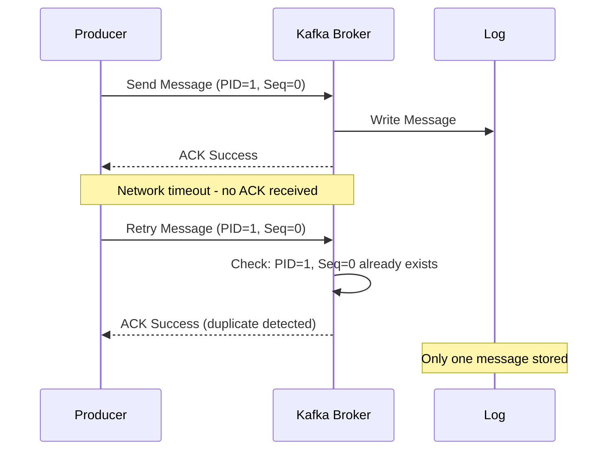
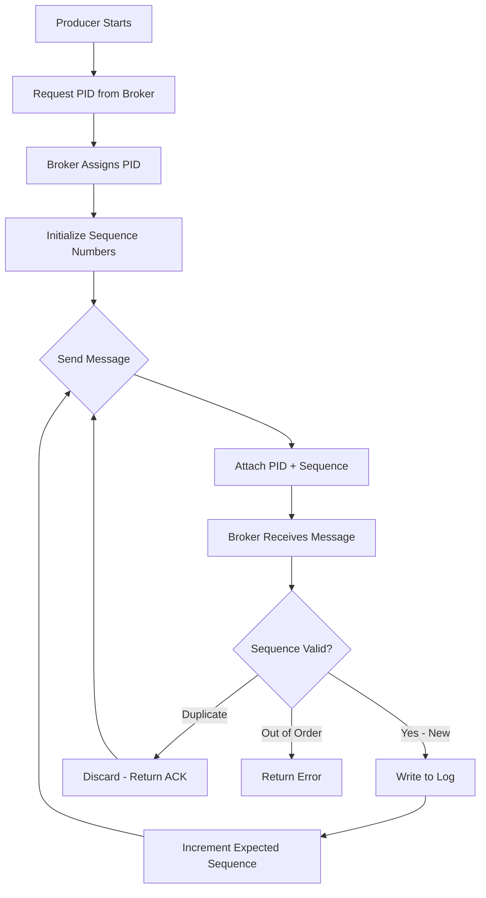
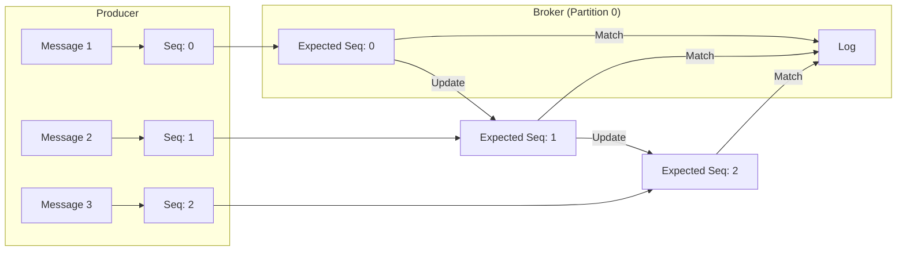
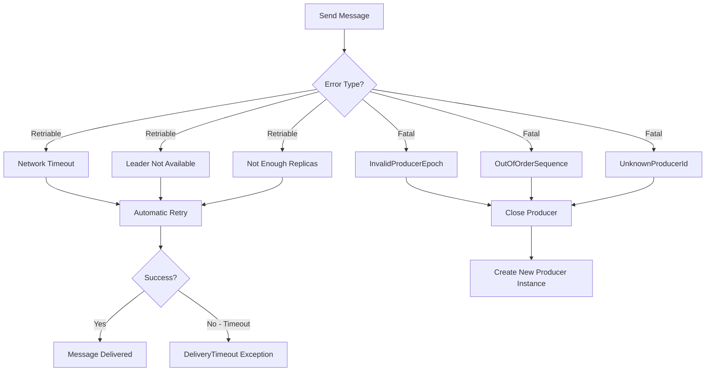
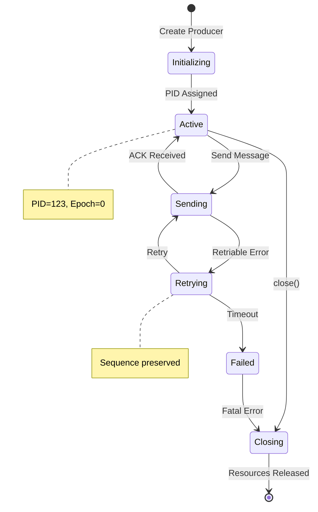

# How to Create Kafka Idempotent Producers

Author: [nawazdhandala](https://github.com/nawazdhandala)

Tags: Kafka, Idempotent Producer, Exactly-Once, Reliability

Description: Learn to implement Kafka idempotent producers with producer IDs, sequence numbers, and retry handling for exactly-once semantics.

---

## Introduction

In distributed systems, message delivery guarantees are critical for data integrity. Apache Kafka provides three delivery semantics: at-most-once, at-least-once, and exactly-once. Idempotent producers are the foundation for achieving exactly-once semantics in Kafka, ensuring that retries do not result in duplicate messages.

This guide walks you through creating Kafka idempotent producers, understanding the underlying mechanisms, and handling various error scenarios.

## Understanding Idempotence in Kafka

Idempotence means that producing the same message multiple times has the same effect as producing it once. Without idempotence, network failures or retries can cause duplicate messages in your Kafka topics.

### How Idempotent Producers Work

When you enable idempotence, Kafka assigns each producer a unique Producer ID (PID) and tracks sequence numbers for each message. The broker uses these to detect and discard duplicates.



### The Producer ID and Sequence Number Mechanism

Each producer instance receives a unique PID from the broker upon initialization. For each topic-partition, the producer maintains a monotonically increasing sequence number.



## Enabling Idempotent Producers

### Basic Configuration

The simplest way to enable idempotence is by setting `enable.idempotence=true`:

```java
import org.apache.kafka.clients.producer.KafkaProducer;
import org.apache.kafka.clients.producer.ProducerConfig;
import org.apache.kafka.clients.producer.ProducerRecord;
import org.apache.kafka.common.serialization.StringSerializer;

import java.util.Properties;

public class IdempotentProducerExample {

    public static KafkaProducer<String, String> createIdempotentProducer() {
        Properties props = new Properties();

        // Bootstrap servers
        props.put(ProducerConfig.BOOTSTRAP_SERVERS_CONFIG, "localhost:9092");

        // Serializers
        props.put(ProducerConfig.KEY_SERIALIZER_CLASS_CONFIG, StringSerializer.class.getName());
        props.put(ProducerConfig.VALUE_SERIALIZER_CLASS_CONFIG, StringSerializer.class.getName());

        // Enable idempotence - this is the key setting
        props.put(ProducerConfig.ENABLE_IDEMPOTENCE_CONFIG, true);

        return new KafkaProducer<>(props);
    }

    public static void main(String[] args) {
        try (KafkaProducer<String, String> producer = createIdempotentProducer()) {
            ProducerRecord<String, String> record = new ProducerRecord<>(
                "my-topic",
                "key-1",
                "Hello, Idempotent Kafka!"
            );

            producer.send(record, (metadata, exception) -> {
                if (exception != null) {
                    System.err.println("Failed to send: " + exception.getMessage());
                } else {
                    System.out.printf("Sent to partition %d at offset %d%n",
                        metadata.partition(), metadata.offset());
                }
            });
        }
    }
}
```

### Implicit Configuration Changes

When you enable idempotence, Kafka automatically adjusts several settings:

| Configuration | Required Value | Reason |
|--------------|----------------|--------|
| `acks` | `all` | Ensures all replicas acknowledge the write |
| `retries` | `Integer.MAX_VALUE` | Allows unlimited retries for transient failures |
| `max.in.flight.requests.per.connection` | `<= 5` | Maintains message ordering during retries |

```java
public static KafkaProducer<String, String> createFullyConfiguredIdempotentProducer() {
    Properties props = new Properties();

    props.put(ProducerConfig.BOOTSTRAP_SERVERS_CONFIG, "localhost:9092");
    props.put(ProducerConfig.KEY_SERIALIZER_CLASS_CONFIG, StringSerializer.class.getName());
    props.put(ProducerConfig.VALUE_SERIALIZER_CLASS_CONFIG, StringSerializer.class.getName());

    // Idempotence configuration
    props.put(ProducerConfig.ENABLE_IDEMPOTENCE_CONFIG, true);

    // These are set automatically but shown explicitly for clarity
    props.put(ProducerConfig.ACKS_CONFIG, "all");
    props.put(ProducerConfig.RETRIES_CONFIG, Integer.MAX_VALUE);
    props.put(ProducerConfig.MAX_IN_FLIGHT_REQUESTS_PER_CONNECTION, 5);

    // Additional recommended settings
    props.put(ProducerConfig.DELIVERY_TIMEOUT_MS_CONFIG, 120000); // 2 minutes
    props.put(ProducerConfig.REQUEST_TIMEOUT_MS_CONFIG, 30000);   // 30 seconds
    props.put(ProducerConfig.RETRY_BACKOFF_MS_CONFIG, 100);       // 100ms between retries

    return new KafkaProducer<>(props);
}
```

## Sequence Number Handling

### How Sequence Numbers Are Managed

The producer maintains sequence numbers internally. You do not need to manage them manually. Here is how the flow works:



### Batch Sequence Handling

When messages are batched, the sequence number corresponds to the last message in the batch:

```java
public class BatchedIdempotentProducer {

    public static void sendBatchedMessages(KafkaProducer<String, String> producer,
                                           String topic,
                                           List<String> messages) {
        // Configure batching
        // These settings control how messages are grouped
        Properties props = new Properties();
        props.put(ProducerConfig.BATCH_SIZE_CONFIG, 16384);        // 16KB batch size
        props.put(ProducerConfig.LINGER_MS_CONFIG, 10);            // Wait up to 10ms
        props.put(ProducerConfig.BUFFER_MEMORY_CONFIG, 33554432);  // 32MB buffer

        // Send multiple messages - they may be batched together
        List<Future<RecordMetadata>> futures = new ArrayList<>();

        for (int i = 0; i < messages.size(); i++) {
            ProducerRecord<String, String> record = new ProducerRecord<>(
                topic,
                "key-" + i,
                messages.get(i)
            );
            futures.add(producer.send(record));
        }

        // Wait for all sends to complete
        for (Future<RecordMetadata> future : futures) {
            try {
                RecordMetadata metadata = future.get();
                System.out.printf("Message sent to partition %d%n", metadata.partition());
            } catch (Exception e) {
                System.err.println("Send failed: " + e.getMessage());
            }
        }
    }
}
```

## Error Scenarios and Handling

### Types of Errors

Idempotent producers handle several error scenarios differently:



### Handling Retriable Errors

Retriable errors are handled automatically by the producer:

```java
public class RobustIdempotentProducer {

    private final KafkaProducer<String, String> producer;
    private final String topic;

    public RobustIdempotentProducer(String bootstrapServers, String topic) {
        this.topic = topic;

        Properties props = new Properties();
        props.put(ProducerConfig.BOOTSTRAP_SERVERS_CONFIG, bootstrapServers);
        props.put(ProducerConfig.KEY_SERIALIZER_CLASS_CONFIG, StringSerializer.class.getName());
        props.put(ProducerConfig.VALUE_SERIALIZER_CLASS_CONFIG, StringSerializer.class.getName());
        props.put(ProducerConfig.ENABLE_IDEMPOTENCE_CONFIG, true);

        // Configure retry behavior
        props.put(ProducerConfig.DELIVERY_TIMEOUT_MS_CONFIG, 300000);  // 5 minutes total
        props.put(ProducerConfig.REQUEST_TIMEOUT_MS_CONFIG, 30000);    // 30 seconds per request
        props.put(ProducerConfig.RETRY_BACKOFF_MS_CONFIG, 500);        // 500ms between retries
        props.put(ProducerConfig.RETRY_BACKOFF_MAX_MS_CONFIG, 10000);  // Max 10 seconds backoff

        this.producer = new KafkaProducer<>(props);
    }

    public void sendWithCallback(String key, String value) {
        ProducerRecord<String, String> record = new ProducerRecord<>(topic, key, value);

        producer.send(record, (metadata, exception) -> {
            if (exception != null) {
                handleSendError(exception, record);
            } else {
                System.out.printf("Success: topic=%s, partition=%d, offset=%d%n",
                    metadata.topic(), metadata.partition(), metadata.offset());
            }
        });
    }

    private void handleSendError(Exception exception, ProducerRecord<String, String> record) {
        if (exception instanceof TimeoutException) {
            // Delivery timeout - all retries exhausted
            System.err.println("Delivery timeout after all retries: " + exception.getMessage());
            // Log to dead letter queue or alert
        } else if (exception instanceof org.apache.kafka.common.errors.ProducerFencedException) {
            // Fatal - another producer with same transactional.id
            System.err.println("Producer fenced: " + exception.getMessage());
            // Must create new producer
        } else {
            System.err.println("Unexpected error: " + exception.getMessage());
        }
    }

    public void close() {
        producer.close();
    }
}
```

### Handling Fatal Errors

Fatal errors require creating a new producer instance:

```java
public class FatalErrorHandler {

    private KafkaProducer<String, String> producer;
    private final Properties baseProps;
    private final AtomicBoolean isHealthy = new AtomicBoolean(true);

    public FatalErrorHandler(Properties props) {
        this.baseProps = props;
        this.producer = new KafkaProducer<>(props);
    }

    public void sendMessage(String topic, String key, String value) {
        if (!isHealthy.get()) {
            recreateProducer();
        }

        ProducerRecord<String, String> record = new ProducerRecord<>(topic, key, value);

        try {
            RecordMetadata metadata = producer.send(record).get(30, TimeUnit.SECONDS);
            System.out.printf("Sent successfully to offset %d%n", metadata.offset());
        } catch (ExecutionException e) {
            Throwable cause = e.getCause();

            if (isFatalError(cause)) {
                System.err.println("Fatal error detected: " + cause.getClass().getSimpleName());
                isHealthy.set(false);
                // Rethrow or handle based on your requirements
                throw new RuntimeException("Fatal producer error", cause);
            } else {
                // Non-fatal errors should have been retried by the producer
                System.err.println("Send failed after retries: " + cause.getMessage());
            }
        } catch (InterruptedException | TimeoutException e) {
            Thread.currentThread().interrupt();
            throw new RuntimeException("Send interrupted or timed out", e);
        }
    }

    private boolean isFatalError(Throwable error) {
        return error instanceof org.apache.kafka.common.errors.InvalidProducerEpochException
            || error instanceof org.apache.kafka.common.errors.OutOfOrderSequenceException
            || error instanceof org.apache.kafka.common.errors.UnknownProducerIdException
            || error instanceof org.apache.kafka.common.errors.ProducerFencedException;
    }

    private synchronized void recreateProducer() {
        if (!isHealthy.get()) {
            try {
                producer.close(Duration.ofSeconds(10));
            } catch (Exception e) {
                System.err.println("Error closing old producer: " + e.getMessage());
            }
            producer = new KafkaProducer<>(baseProps);
            isHealthy.set(true);
            System.out.println("Producer recreated successfully");
        }
    }
}
```

## Producer Lifecycle and PID Management

### Understanding Producer Epochs

When a producer restarts, it gets a new PID. The broker tracks producer epochs to handle producer restarts:



### Thread Safety Considerations

The KafkaProducer is thread-safe and should be shared across threads:

```java
public class ThreadSafeIdempotentProducer {

    private final KafkaProducer<String, String> producer;
    private final ExecutorService executor;

    public ThreadSafeIdempotentProducer(String bootstrapServers, int numThreads) {
        Properties props = new Properties();
        props.put(ProducerConfig.BOOTSTRAP_SERVERS_CONFIG, bootstrapServers);
        props.put(ProducerConfig.KEY_SERIALIZER_CLASS_CONFIG, StringSerializer.class.getName());
        props.put(ProducerConfig.VALUE_SERIALIZER_CLASS_CONFIG, StringSerializer.class.getName());
        props.put(ProducerConfig.ENABLE_IDEMPOTENCE_CONFIG, true);

        // Single producer instance shared across all threads
        this.producer = new KafkaProducer<>(props);
        this.executor = Executors.newFixedThreadPool(numThreads);
    }

    public CompletableFuture<RecordMetadata> sendAsync(String topic, String key, String value) {
        CompletableFuture<RecordMetadata> future = new CompletableFuture<>();

        ProducerRecord<String, String> record = new ProducerRecord<>(topic, key, value);

        producer.send(record, (metadata, exception) -> {
            if (exception != null) {
                future.completeExceptionally(exception);
            } else {
                future.complete(metadata);
            }
        });

        return future;
    }

    public void sendFromMultipleThreads(String topic, List<String> messages) {
        List<CompletableFuture<RecordMetadata>> futures = new ArrayList<>();

        for (int i = 0; i < messages.size(); i++) {
            final int index = i;
            futures.add(sendAsync(topic, "key-" + index, messages.get(index)));
        }

        // Wait for all messages
        CompletableFuture.allOf(futures.toArray(new CompletableFuture[0]))
            .thenRun(() -> System.out.println("All messages sent successfully"))
            .exceptionally(ex -> {
                System.err.println("Some messages failed: " + ex.getMessage());
                return null;
            });
    }

    public void shutdown() {
        executor.shutdown();
        try {
            if (!executor.awaitTermination(30, TimeUnit.SECONDS)) {
                executor.shutdownNow();
            }
        } catch (InterruptedException e) {
            executor.shutdownNow();
        }
        producer.close();
    }
}
```

## Best Practices

### Configuration Checklist

```java
public class IdempotentProducerBestPractices {

    public static Properties getRecommendedConfig(String bootstrapServers) {
        Properties props = new Properties();

        // Required
        props.put(ProducerConfig.BOOTSTRAP_SERVERS_CONFIG, bootstrapServers);
        props.put(ProducerConfig.KEY_SERIALIZER_CLASS_CONFIG, StringSerializer.class.getName());
        props.put(ProducerConfig.VALUE_SERIALIZER_CLASS_CONFIG, StringSerializer.class.getName());

        // Enable idempotence
        props.put(ProducerConfig.ENABLE_IDEMPOTENCE_CONFIG, true);

        // Recommended for reliability
        props.put(ProducerConfig.ACKS_CONFIG, "all");
        props.put(ProducerConfig.MAX_IN_FLIGHT_REQUESTS_PER_CONNECTION, 5);

        // Timeout configuration
        props.put(ProducerConfig.DELIVERY_TIMEOUT_MS_CONFIG, 120000);
        props.put(ProducerConfig.REQUEST_TIMEOUT_MS_CONFIG, 30000);
        props.put(ProducerConfig.RETRY_BACKOFF_MS_CONFIG, 100);

        // Batching for throughput
        props.put(ProducerConfig.BATCH_SIZE_CONFIG, 16384);
        props.put(ProducerConfig.LINGER_MS_CONFIG, 5);

        // Compression
        props.put(ProducerConfig.COMPRESSION_TYPE_CONFIG, "snappy");

        // Memory management
        props.put(ProducerConfig.BUFFER_MEMORY_CONFIG, 33554432);
        props.put(ProducerConfig.MAX_BLOCK_MS_CONFIG, 60000);

        return props;
    }
}
```

### Monitoring Idempotent Producers

Key metrics to monitor for idempotent producers:

```java
public class ProducerMetricsMonitor {

    private final KafkaProducer<String, String> producer;

    public void printMetrics() {
        Map<MetricName, ? extends Metric> metrics = producer.metrics();

        // Key metrics for idempotent producers
        String[] importantMetrics = {
            "record-send-total",
            "record-retry-total",
            "record-error-total",
            "produce-throttle-time-avg",
            "batch-size-avg",
            "request-latency-avg",
            "outgoing-byte-rate"
        };

        for (String metricName : importantMetrics) {
            metrics.forEach((name, metric) -> {
                if (name.name().equals(metricName)) {
                    System.out.printf("%s: %.2f%n", name.name(), metric.metricValue());
                }
            });
        }
    }
}
```

## Common Pitfalls to Avoid

1. **Creating multiple producer instances unnecessarily** - Idempotence is per-producer instance. Share one instance across threads.

2. **Setting incompatible configurations** - Do not set `acks` to anything other than `all` or `max.in.flight.requests.per.connection` greater than 5.

3. **Ignoring fatal errors** - Always handle `OutOfOrderSequenceException` and `InvalidProducerEpochException` by recreating the producer.

4. **Not closing the producer properly** - Always call `close()` to ensure pending messages are flushed.

```java
// Wrong - do not do this
try {
    producer.send(record);
} finally {
    // Missing close - messages may be lost
}

// Correct
try (KafkaProducer<String, String> producer = createIdempotentProducer()) {
    producer.send(record).get();
} // Producer closed automatically, messages flushed
```

## Conclusion

Kafka idempotent producers provide a robust foundation for exactly-once message delivery. By understanding how Producer IDs and sequence numbers work, properly configuring your producer, and handling errors appropriately, you can build reliable streaming applications that guarantee no duplicate messages even in the face of network failures and retries.

Key takeaways:
- Enable idempotence with `enable.idempotence=true`
- Let Kafka manage sequence numbers automatically
- Handle fatal errors by recreating the producer
- Share a single producer instance across threads
- Monitor retry and error metrics in production

For applications requiring exactly-once semantics across multiple partitions or topics, consider using Kafka transactions, which build on top of idempotent producers to provide atomic writes.
