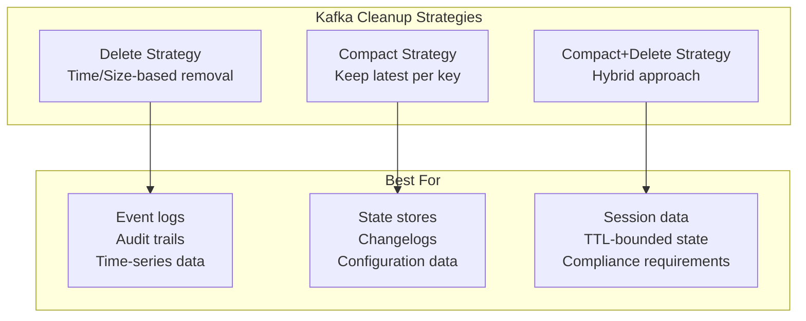
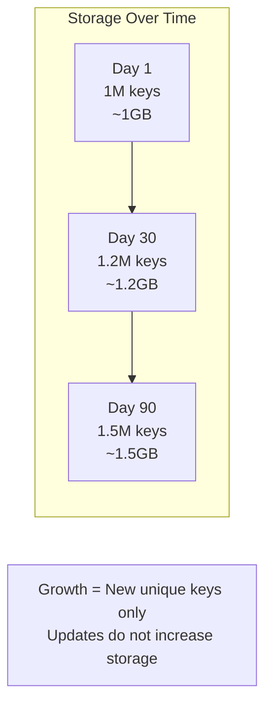
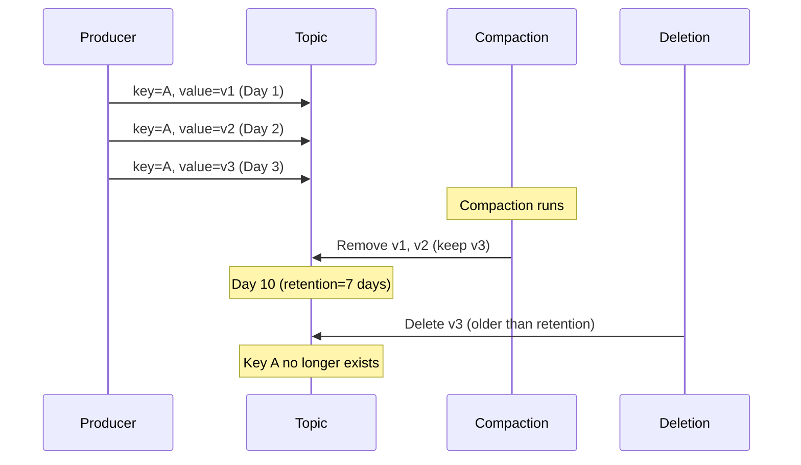
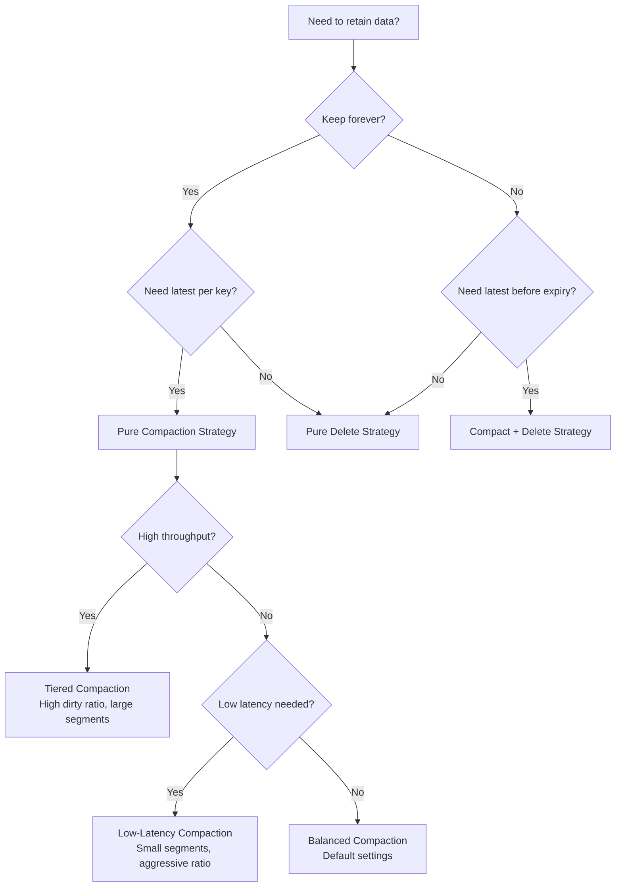

# How to Implement Kafka Log Compaction Strategies

Author: [nawazdhandala](https://github.com/nawazdhandala)

Tags: Kafka, Log Compaction, Storage, Performance

Description: A comprehensive guide to implementing Kafka log compaction strategies, including decision frameworks, advanced patterns, and production-ready configurations for different use cases.

---

Kafka log compaction is not a one-size-fits-all solution. Different workloads demand different strategies. This guide explores the various compaction strategies you can implement, when to use each one, and how to configure them for optimal performance in production environments.

## Understanding Compaction Strategy Options

Before diving into implementation, you need to understand the three fundamental cleanup policies Kafka offers and how they can be combined into effective strategies.



## Strategy 1: Pure Compaction for State Management

Pure compaction keeps only the latest value for each key indefinitely. This strategy is ideal when you need to maintain current state without any time-based expiration.

### When to Use Pure Compaction

- Database change data capture (CDC) streams
- User profile or preference stores
- Product catalog or inventory state
- Configuration management topics
- Kafka Streams changelog topics

### Implementation

```java
import org.apache.kafka.clients.admin.*;
import org.apache.kafka.common.config.TopicConfig;
import java.util.*;

public class PureCompactionStrategy {

    public static void createCompactedTopic(AdminClient admin, String topicName)
            throws Exception {

        Map<String, String> configs = new HashMap<>();

        // Enable pure compaction - no deletion
        configs.put(TopicConfig.CLEANUP_POLICY_CONFIG, "compact");

        // Trigger compaction when 30% of the log is dirty
        // Lower values mean more frequent compaction
        configs.put(TopicConfig.MIN_CLEANABLE_DIRTY_RATIO_CONFIG, "0.3");

        // Minimum time before a record can be compacted
        // Ensures consumers have time to read recent updates
        configs.put(TopicConfig.MIN_COMPACTION_LAG_MS_CONFIG, "3600000"); // 1 hour

        // Maximum time before forcing compaction
        // Guarantees compaction happens even with low write volume
        configs.put(TopicConfig.MAX_COMPACTION_LAG_MS_CONFIG, "86400000"); // 24 hours

        // Segment configuration for optimal compaction
        configs.put(TopicConfig.SEGMENT_BYTES_CONFIG, "104857600"); // 100MB segments
        configs.put(TopicConfig.SEGMENT_MS_CONFIG, "3600000"); // Roll segments hourly

        // Tombstone retention - how long delete markers are kept
        configs.put(TopicConfig.DELETE_RETENTION_MS_CONFIG, "86400000"); // 24 hours

        NewTopic topic = new NewTopic(topicName, 12, (short) 3)
            .configs(configs);

        admin.createTopics(Collections.singleton(topic)).all().get();
        System.out.println("Created pure compaction topic: " + topicName);
    }

    public static void main(String[] args) throws Exception {
        Properties props = new Properties();
        props.put(AdminClientConfig.BOOTSTRAP_SERVERS_CONFIG, "localhost:9092");

        try (AdminClient admin = AdminClient.create(props)) {
            createCompactedTopic(admin, "user-state-store");
        }
    }
}
```

### Storage Growth Pattern

With pure compaction, storage grows proportionally to the number of unique keys, not the number of messages.



## Strategy 2: Compact with Delete for Bounded State

This hybrid strategy combines compaction with time-based deletion. Records are compacted to keep the latest value per key, but eventually deleted after the retention period expires.

### When to Use Compact+Delete

- Session state with expiration
- Shopping cart data
- Temporary user data with compliance requirements
- Cache invalidation topics
- Rate limiting state

### Implementation

```java
import org.apache.kafka.clients.admin.*;
import org.apache.kafka.common.config.TopicConfig;
import java.util.*;

public class CompactDeleteStrategy {

    public static void createCompactDeleteTopic(AdminClient admin, String topicName,
            long retentionMs) throws Exception {

        Map<String, String> configs = new HashMap<>();

        // Enable both compaction and deletion
        configs.put(TopicConfig.CLEANUP_POLICY_CONFIG, "compact,delete");

        // Retention period - records older than this are deleted
        configs.put(TopicConfig.RETENTION_MS_CONFIG, String.valueOf(retentionMs));

        // Compaction settings
        configs.put(TopicConfig.MIN_CLEANABLE_DIRTY_RATIO_CONFIG, "0.5");
        configs.put(TopicConfig.MIN_COMPACTION_LAG_MS_CONFIG, "0");

        // Segment must be smaller than retention for deletion to work
        long segmentMs = Math.min(retentionMs / 7, 86400000L); // Max 1 day
        configs.put(TopicConfig.SEGMENT_MS_CONFIG, String.valueOf(segmentMs));

        // Tombstone retention should be less than overall retention
        long tombstoneRetention = Math.min(retentionMs / 2, 86400000L);
        configs.put(TopicConfig.DELETE_RETENTION_MS_CONFIG,
            String.valueOf(tombstoneRetention));

        NewTopic topic = new NewTopic(topicName, 12, (short) 3)
            .configs(configs);

        admin.createTopics(Collections.singleton(topic)).all().get();
        System.out.println("Created compact+delete topic: " + topicName);
    }

    public static void main(String[] args) throws Exception {
        Properties props = new Properties();
        props.put(AdminClientConfig.BOOTSTRAP_SERVERS_CONFIG, "localhost:9092");

        try (AdminClient admin = AdminClient.create(props)) {
            // 7-day retention with compaction
            createCompactDeleteTopic(admin, "user-sessions", 604800000L);

            // 30-day retention for shopping carts
            createCompactDeleteTopic(admin, "shopping-carts", 2592000000L);
        }
    }
}
```

### Data Lifecycle Visualization



## Strategy 3: Tiered Compaction for High-Throughput Topics

For topics with extremely high write volumes, implement a tiered compaction strategy that balances storage efficiency with compaction overhead.

### Configuration for High-Throughput Compaction

```java
import org.apache.kafka.clients.admin.*;
import org.apache.kafka.common.config.TopicConfig;
import java.util.*;

public class TieredCompactionStrategy {

    public static void createHighThroughputCompactedTopic(AdminClient admin,
            String topicName) throws Exception {

        Map<String, String> configs = new HashMap<>();

        configs.put(TopicConfig.CLEANUP_POLICY_CONFIG, "compact");

        // Higher dirty ratio reduces compaction frequency
        // Better for high-throughput as compaction is expensive
        configs.put(TopicConfig.MIN_CLEANABLE_DIRTY_RATIO_CONFIG, "0.7");

        // Larger segments mean less frequent compaction runs
        configs.put(TopicConfig.SEGMENT_BYTES_CONFIG, "1073741824"); // 1GB
        configs.put(TopicConfig.SEGMENT_MS_CONFIG, "86400000"); // 24 hours

        // Longer compaction lag for batching
        configs.put(TopicConfig.MIN_COMPACTION_LAG_MS_CONFIG, "21600000"); // 6 hours
        configs.put(TopicConfig.MAX_COMPACTION_LAG_MS_CONFIG, "604800000"); // 7 days

        // Larger index interval for fewer index entries
        configs.put(TopicConfig.INDEX_INTERVAL_BYTES_CONFIG, "8192");

        NewTopic topic = new NewTopic(topicName, 24, (short) 3)
            .configs(configs);

        admin.createTopics(Collections.singleton(topic)).all().get();
    }
}
```

### Broker-Level Tuning for High-Throughput Compaction

```properties
# server.properties - Broker configuration

# Increase cleaner threads for parallel compaction
log.cleaner.threads=4

# Larger dedupe buffer for better efficiency
log.cleaner.dedupe.buffer.size=268435456

# Higher IO buffer for throughput
log.cleaner.io.buffer.size=1048576

# Backoff when cleaner falls behind
log.cleaner.backoff.ms=30000

# IO throttling to prevent overwhelming disks
log.cleaner.io.max.bytes.per.second=52428800
```

## Strategy 4: Low-Latency Compaction for Real-Time State

When you need the compacted state to be available quickly, configure aggressive compaction settings.

### Implementation

```java
import org.apache.kafka.clients.admin.*;
import org.apache.kafka.common.config.TopicConfig;
import java.util.*;

public class LowLatencyCompactionStrategy {

    public static void createLowLatencyCompactedTopic(AdminClient admin,
            String topicName) throws Exception {

        Map<String, String> configs = new HashMap<>();

        configs.put(TopicConfig.CLEANUP_POLICY_CONFIG, "compact");

        // Very low dirty ratio triggers compaction aggressively
        configs.put(TopicConfig.MIN_CLEANABLE_DIRTY_RATIO_CONFIG, "0.1");

        // Small segments for fast rollover and quick compaction eligibility
        configs.put(TopicConfig.SEGMENT_BYTES_CONFIG, "52428800"); // 50MB
        configs.put(TopicConfig.SEGMENT_MS_CONFIG, "300000"); // 5 minutes

        // No compaction lag - compact as soon as possible
        configs.put(TopicConfig.MIN_COMPACTION_LAG_MS_CONFIG, "0");
        configs.put(TopicConfig.MAX_COMPACTION_LAG_MS_CONFIG, "3600000"); // 1 hour max

        // Short tombstone retention for quick key removal
        configs.put(TopicConfig.DELETE_RETENTION_MS_CONFIG, "3600000"); // 1 hour

        NewTopic topic = new NewTopic(topicName, 12, (short) 3)
            .configs(configs);

        admin.createTopics(Collections.singleton(topic)).all().get();
    }
}
```

### Broker Configuration for Low-Latency

```properties
# server.properties - Optimized for fast compaction

# More threads for parallel processing
log.cleaner.threads=8

# Smaller buffers for faster processing
log.cleaner.dedupe.buffer.size=134217728

# No IO throttling
log.cleaner.io.max.bytes.per.second=Infinity

# Minimal backoff
log.cleaner.backoff.ms=5000

# Check for compaction work frequently
log.cleaner.min.cleanable.ratio=0.1
```

## Strategy Decision Framework

Use this framework to select the right compaction strategy for your use case.



## Implementing a Multi-Topic Compaction Strategy

In production, you typically have multiple topics with different compaction requirements. Here is a comprehensive configuration manager.

```java
import org.apache.kafka.clients.admin.*;
import org.apache.kafka.common.config.TopicConfig;
import java.util.*;

public class CompactionStrategyManager {

    private final AdminClient admin;

    public CompactionStrategyManager(String bootstrapServers) {
        Properties props = new Properties();
        props.put(AdminClientConfig.BOOTSTRAP_SERVERS_CONFIG, bootstrapServers);
        this.admin = AdminClient.create(props);
    }

    public enum Strategy {
        PURE_COMPACTION,
        COMPACT_DELETE,
        HIGH_THROUGHPUT,
        LOW_LATENCY
    }

    public void createTopic(String topicName, int partitions, short replication,
            Strategy strategy, Map<String, Object> overrides) throws Exception {

        Map<String, String> configs = getBaseConfig(strategy);

        // Apply any custom overrides
        for (Map.Entry<String, Object> entry : overrides.entrySet()) {
            configs.put(entry.getKey(), String.valueOf(entry.getValue()));
        }

        NewTopic topic = new NewTopic(topicName, partitions, replication)
            .configs(configs);

        admin.createTopics(Collections.singleton(topic)).all().get();
        System.out.printf("Created topic '%s' with strategy: %s%n",
            topicName, strategy);
    }

    private Map<String, String> getBaseConfig(Strategy strategy) {
        Map<String, String> configs = new HashMap<>();

        switch (strategy) {
            case PURE_COMPACTION:
                configs.put(TopicConfig.CLEANUP_POLICY_CONFIG, "compact");
                configs.put(TopicConfig.MIN_CLEANABLE_DIRTY_RATIO_CONFIG, "0.5");
                configs.put(TopicConfig.SEGMENT_BYTES_CONFIG, "104857600");
                configs.put(TopicConfig.SEGMENT_MS_CONFIG, "3600000");
                configs.put(TopicConfig.DELETE_RETENTION_MS_CONFIG, "86400000");
                break;

            case COMPACT_DELETE:
                configs.put(TopicConfig.CLEANUP_POLICY_CONFIG, "compact,delete");
                configs.put(TopicConfig.MIN_CLEANABLE_DIRTY_RATIO_CONFIG, "0.5");
                configs.put(TopicConfig.RETENTION_MS_CONFIG, "604800000");
                configs.put(TopicConfig.SEGMENT_MS_CONFIG, "86400000");
                configs.put(TopicConfig.DELETE_RETENTION_MS_CONFIG, "86400000");
                break;

            case HIGH_THROUGHPUT:
                configs.put(TopicConfig.CLEANUP_POLICY_CONFIG, "compact");
                configs.put(TopicConfig.MIN_CLEANABLE_DIRTY_RATIO_CONFIG, "0.7");
                configs.put(TopicConfig.SEGMENT_BYTES_CONFIG, "1073741824");
                configs.put(TopicConfig.SEGMENT_MS_CONFIG, "86400000");
                configs.put(TopicConfig.MIN_COMPACTION_LAG_MS_CONFIG, "21600000");
                break;

            case LOW_LATENCY:
                configs.put(TopicConfig.CLEANUP_POLICY_CONFIG, "compact");
                configs.put(TopicConfig.MIN_CLEANABLE_DIRTY_RATIO_CONFIG, "0.1");
                configs.put(TopicConfig.SEGMENT_BYTES_CONFIG, "52428800");
                configs.put(TopicConfig.SEGMENT_MS_CONFIG, "300000");
                configs.put(TopicConfig.MIN_COMPACTION_LAG_MS_CONFIG, "0");
                break;
        }

        return configs;
    }

    public void updateTopicStrategy(String topicName, Strategy strategy)
            throws Exception {

        Map<String, String> configs = getBaseConfig(strategy);

        Collection<AlterConfigOp> ops = new ArrayList<>();
        for (Map.Entry<String, String> entry : configs.entrySet()) {
            ops.add(new AlterConfigOp(
                new ConfigEntry(entry.getKey(), entry.getValue()),
                AlterConfigOp.OpType.SET
            ));
        }

        ConfigResource resource = new ConfigResource(
            ConfigResource.Type.TOPIC, topicName);

        admin.incrementalAlterConfigs(Map.of(resource, ops)).all().get();
        System.out.printf("Updated topic '%s' to strategy: %s%n",
            topicName, strategy);
    }

    public void close() {
        admin.close();
    }

    public static void main(String[] args) throws Exception {
        CompactionStrategyManager manager =
            new CompactionStrategyManager("localhost:9092");

        try {
            // Create topics with different strategies
            manager.createTopic("user-profiles", 12, (short) 3,
                Strategy.PURE_COMPACTION, Map.of());

            manager.createTopic("user-sessions", 12, (short) 3,
                Strategy.COMPACT_DELETE,
                Map.of(TopicConfig.RETENTION_MS_CONFIG, 86400000L));

            manager.createTopic("event-stream", 24, (short) 3,
                Strategy.HIGH_THROUGHPUT, Map.of());

            manager.createTopic("realtime-state", 12, (short) 3,
                Strategy.LOW_LATENCY, Map.of());

        } finally {
            manager.close();
        }
    }
}
```

## Monitoring Compaction Strategy Effectiveness

Track these metrics to ensure your compaction strategy is working as expected.

### Key Metrics Dashboard

```yaml
# Prometheus alerting rules for compaction monitoring

groups:
  - name: kafka_compaction_alerts
    rules:
      # Alert when compaction is falling behind
      - alert: CompactionLagHigh
        expr: kafka_log_log_cleaner_manager_value{name="max-dirty-percent"} > 80
        for: 30m
        labels:
          severity: warning
        annotations:
          summary: "Kafka compaction lag is high"
          description: "Dirty log ratio exceeds 80% for 30 minutes"

      # Alert when compaction is too slow
      - alert: CompactionTooSlow
        expr: rate(kafka_log_log_cleaner_total_cleaned_bytes[1h]) < 1000000
        for: 1h
        labels:
          severity: warning
        annotations:
          summary: "Kafka compaction throughput is low"

      # Alert when cleaner threads are stuck
      - alert: CleanerThreadsStuck
        expr: kafka_log_log_cleaner_uncleanable_partitions_count > 0
        for: 15m
        labels:
          severity: critical
        annotations:
          summary: "Kafka log cleaner has uncleanable partitions"
```

### Compaction Metrics Collection Script

```python
#!/usr/bin/env python3
"""
Kafka compaction metrics collector using JMX.
"""

import subprocess
import json
import time

def get_compaction_metrics(broker_host, jmx_port):
    """Fetch compaction-related JMX metrics from a Kafka broker."""

    metrics = {
        "max_dirty_percent": None,
        "cleaner_recopy_percent": None,
        "total_cleaned_bytes": None,
        "max_clean_time_secs": None,
        "uncleanable_partitions": None
    }

    jmx_queries = [
        ("max_dirty_percent",
         "kafka.log:type=LogCleanerManager,name=max-dirty-percent"),
        ("cleaner_recopy_percent",
         "kafka.log:type=LogCleaner,name=cleaner-recopy-percent"),
        ("total_cleaned_bytes",
         "kafka.log:type=LogCleaner,name=total-cleaned-bytes-total"),
        ("max_clean_time_secs",
         "kafka.log:type=LogCleaner,name=max-clean-time-secs"),
        ("uncleanable_partitions",
         "kafka.log:type=LogCleanerManager,name=uncleanable-partitions-count")
    ]

    for metric_name, mbean in jmx_queries:
        try:
            # Using jmxterm or similar JMX client
            result = query_jmx(broker_host, jmx_port, mbean)
            metrics[metric_name] = result
        except Exception as e:
            print(f"Failed to fetch {metric_name}: {e}")

    return metrics

def analyze_compaction_health(metrics):
    """Analyze compaction metrics and provide recommendations."""

    issues = []
    recommendations = []

    if metrics["max_dirty_percent"] and metrics["max_dirty_percent"] > 70:
        issues.append("High dirty ratio detected")
        recommendations.append(
            "Consider lowering min.cleanable.dirty.ratio or adding cleaner threads"
        )

    if metrics["uncleanable_partitions"] and metrics["uncleanable_partitions"] > 0:
        issues.append("Uncleanable partitions found")
        recommendations.append(
            "Check for corrupt segments or insufficient disk space"
        )

    if metrics["max_clean_time_secs"] and metrics["max_clean_time_secs"] > 600:
        issues.append("Compaction taking too long")
        recommendations.append(
            "Consider smaller segment sizes or more cleaner threads"
        )

    return {
        "healthy": len(issues) == 0,
        "issues": issues,
        "recommendations": recommendations,
        "metrics": metrics
    }

def query_jmx(host, port, mbean):
    """Query a JMX MBean value. Implementation depends on your JMX client."""
    # Placeholder - implement with your JMX client of choice
    pass

if __name__ == "__main__":
    metrics = get_compaction_metrics("localhost", 9999)
    health = analyze_compaction_health(metrics)
    print(json.dumps(health, indent=2))
```

## Compaction Strategy Comparison

| Strategy | Dirty Ratio | Segment Size | Compaction Lag | Best For |
|----------|-------------|--------------|----------------|----------|
| Pure Compaction | 0.5 | 100MB | 1-24 hours | State stores, CDC |
| Compact+Delete | 0.5 | 100MB | 1 hour | Sessions, TTL data |
| High Throughput | 0.7 | 1GB | 6+ hours | High-volume streams |
| Low Latency | 0.1 | 50MB | 0 | Real-time state |

## Common Pitfalls and Solutions

### Pitfall 1: Null Keys Breaking Compaction

Records without keys cannot be compacted and will accumulate indefinitely.

```java
// Producer validation to prevent null keys on compacted topics
public class ValidatingProducer<K, V> {

    private final KafkaProducer<K, V> producer;
    private final Set<String> compactedTopics;

    public ValidatingProducer(KafkaProducer<K, V> producer,
            Set<String> compactedTopics) {
        this.producer = producer;
        this.compactedTopics = compactedTopics;
    }

    public Future<RecordMetadata> send(ProducerRecord<K, V> record) {
        if (compactedTopics.contains(record.topic()) && record.key() == null) {
            throw new IllegalArgumentException(
                "Cannot send null key to compacted topic: " + record.topic()
            );
        }
        return producer.send(record);
    }
}
```

### Pitfall 2: Segment Size Larger Than Retention

When using compact+delete, segments must be smaller than retention period.

```java
public static void validateCompactDeleteConfig(Map<String, String> configs) {
    String policy = configs.get(TopicConfig.CLEANUP_POLICY_CONFIG);

    if (policy != null && policy.contains("compact") && policy.contains("delete")) {
        long retentionMs = Long.parseLong(
            configs.getOrDefault(TopicConfig.RETENTION_MS_CONFIG, "604800000")
        );
        long segmentMs = Long.parseLong(
            configs.getOrDefault(TopicConfig.SEGMENT_MS_CONFIG, "604800000")
        );

        if (segmentMs >= retentionMs) {
            throw new IllegalArgumentException(
                "segment.ms must be less than retention.ms for compact,delete policy"
            );
        }
    }
}
```

### Pitfall 3: Compaction Lag Masking Data Loss

If compaction removes records before consumers process them, data appears lost.

```java
// Configure minimum compaction lag based on consumer SLA
public static long calculateMinCompactionLag(
        long consumerMaxDowntimeMs,
        long safetyMarginMs) {

    // Ensure records survive at least as long as max expected consumer downtime
    return consumerMaxDowntimeMs + safetyMarginMs;
}

// Example: Consumer can be down for 4 hours, add 2 hour safety margin
long minLag = calculateMinCompactionLag(
    4 * 60 * 60 * 1000L,  // 4 hours
    2 * 60 * 60 * 1000L   // 2 hours safety
);
// Result: 6 hours minimum compaction lag
```

## Best Practices Summary

1. **Match strategy to use case**: Use pure compaction for indefinite state, compact+delete for bounded retention, and tune aggressiveness based on throughput and latency needs.

2. **Size segments appropriately**: Smaller segments enable faster compaction but increase metadata overhead. Balance based on your compaction frequency requirements.

3. **Monitor compaction lag**: High dirty ratios indicate compaction cannot keep up. Add cleaner threads or adjust the dirty ratio threshold.

4. **Protect against data loss**: Set minimum compaction lag based on your longest expected consumer downtime plus a safety margin.

5. **Validate producer keys**: Implement validation to prevent null keys on compacted topics, which would cause unbounded growth.

6. **Test retention boundaries**: When using compact+delete, verify that segment configuration allows deletion to work correctly.

---

Selecting the right compaction strategy requires understanding your data lifecycle, access patterns, and operational constraints. Start with the decision framework to identify your base strategy, then tune the configuration parameters based on your throughput and latency requirements. Monitor compaction metrics continuously to ensure your strategy remains effective as your workload evolves.
