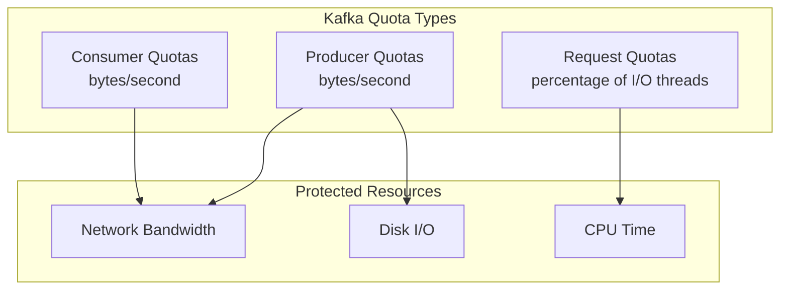
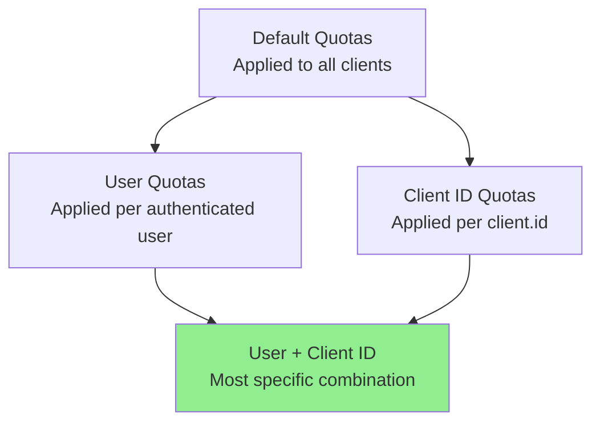
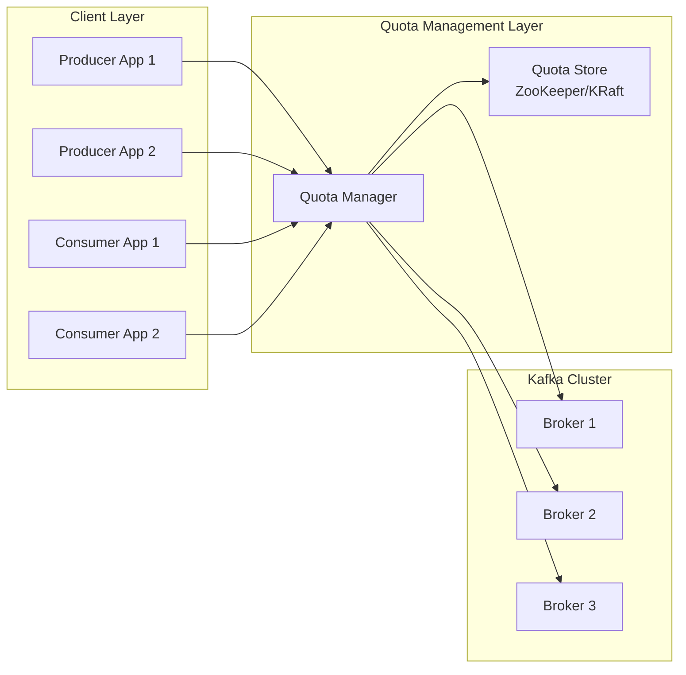
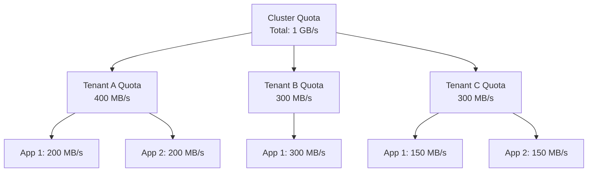
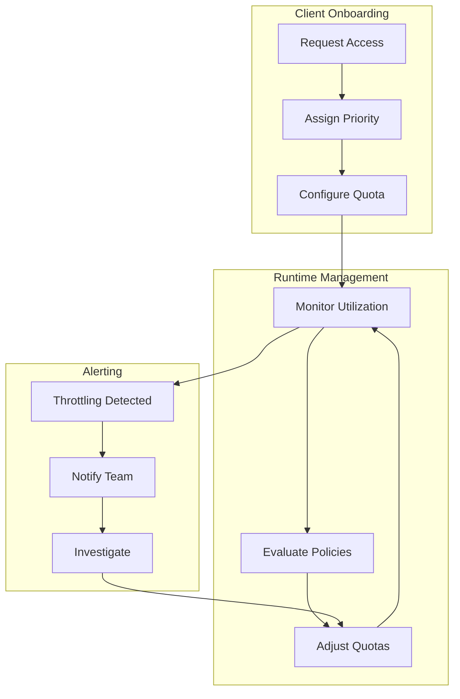

# How to Build Kafka Quota Management

Author: [nawazdhandala](https://github.com/nawazdhandala)

Tags: Kafka, Quotas, Rate Limiting, Performance

Description: Learn how to build a comprehensive Kafka quota management system that protects your cluster from resource exhaustion, ensures fair resource allocation in multi-tenant environments, and maintains predictable performance under varying workloads.

---

> Kafka quotas are your first line of defense against runaway clients and resource contention. Without proper quota management, a single misbehaving producer can bring your entire cluster to its knees. This guide shows you how to build a quota management system that keeps your Kafka infrastructure healthy and performant.

Building a Kafka quota management system involves understanding the different quota types, designing a strategy that fits your use case, implementing dynamic quota adjustments, and monitoring quota utilization. Let us dive into each of these aspects.

---

## Understanding Kafka Quota Types

Kafka supports three primary quota types, each protecting different resources:



| Quota Type | Metric | Default | Purpose |
|------------|--------|---------|---------|
| **Producer** | bytes/second | Unlimited | Limits write throughput |
| **Consumer** | bytes/second | Unlimited | Limits read throughput |
| **Request** | % of I/O threads | Unlimited | Limits request processing time |

### Quota Granularity

Kafka allows quotas at multiple levels of granularity:



The most specific quota always takes precedence. If a user has both a user-level quota and a user+client-id quota, the combination quota applies.

---

## Quota Architecture Design

Before implementing quotas, design your quota architecture based on your use case:



### Multi-Tenant Quota Strategy

For multi-tenant environments, implement a hierarchical quota structure:



---

## Implementing Quota Configuration

### Basic Quota Setup

Set default quotas that apply to all clients without specific overrides:

```bash
# Set default producer quota (10 MB/s)
kafka-configs.sh --bootstrap-server localhost:9092 \
  --alter --add-config 'producer_byte_rate=10485760' \
  --entity-type clients --entity-default

# Set default consumer quota (20 MB/s)
kafka-configs.sh --bootstrap-server localhost:9092 \
  --alter --add-config 'consumer_byte_rate=20971520' \
  --entity-type clients --entity-default

# Set default request quota (50% of I/O thread time)
kafka-configs.sh --bootstrap-server localhost:9092 \
  --alter --add-config 'request_percentage=50' \
  --entity-type clients --entity-default
```

### User-Level Quotas

For authenticated environments, set quotas per user:

```bash
# Set quota for user "analytics-team"
kafka-configs.sh --bootstrap-server localhost:9092 \
  --alter --add-config 'producer_byte_rate=52428800,consumer_byte_rate=104857600' \
  --entity-type users --entity-name analytics-team

# Set quota for user "data-pipeline"
kafka-configs.sh --bootstrap-server localhost:9092 \
  --alter --add-config 'producer_byte_rate=104857600,consumer_byte_rate=209715200' \
  --entity-type users --entity-name data-pipeline
```

### Client ID Quotas

For non-authenticated environments or additional granularity:

```bash
# Set quota for client.id "order-processor"
kafka-configs.sh --bootstrap-server localhost:9092 \
  --alter --add-config 'producer_byte_rate=20971520,consumer_byte_rate=41943040' \
  --entity-type clients --entity-name order-processor

# Combine user and client.id for specific application instance
kafka-configs.sh --bootstrap-server localhost:9092 \
  --alter --add-config 'producer_byte_rate=10485760' \
  --entity-type users --entity-name analytics-team \
  --entity-type clients --entity-name batch-loader
```

---

## Building a Quota Management Service

Here is a Python service that manages Kafka quotas programmatically:

```python
# quota_manager.py
# Kafka quota management service with dynamic quota adjustments
from dataclasses import dataclass
from typing import Dict, Optional, List
from enum import Enum
import json
from kafka.admin import KafkaAdminClient, ConfigResource, ConfigResourceType
from kafka import KafkaConsumer
import logging

logging.basicConfig(level=logging.INFO)
logger = logging.getLogger(__name__)

class QuotaType(Enum):
    """Types of Kafka quotas"""
    PRODUCER = "producer_byte_rate"
    CONSUMER = "consumer_byte_rate"
    REQUEST = "request_percentage"

@dataclass
class QuotaConfig:
    """Represents a quota configuration for a client or user"""
    producer_byte_rate: Optional[int] = None  # bytes per second
    consumer_byte_rate: Optional[int] = None  # bytes per second
    request_percentage: Optional[float] = None  # percentage of I/O threads

    def to_config_dict(self) -> Dict[str, str]:
        """Convert to Kafka config format"""
        config = {}
        if self.producer_byte_rate is not None:
            config["producer_byte_rate"] = str(self.producer_byte_rate)
        if self.consumer_byte_rate is not None:
            config["consumer_byte_rate"] = str(self.consumer_byte_rate)
        if self.request_percentage is not None:
            config["request_percentage"] = str(self.request_percentage)
        return config

class KafkaQuotaManager:
    """Manages Kafka quotas programmatically"""

    def __init__(self, bootstrap_servers: str):
        self.bootstrap_servers = bootstrap_servers
        self.admin_client = KafkaAdminClient(
            bootstrap_servers=bootstrap_servers,
            client_id="quota-manager"
        )
        # Cache for current quota configurations
        self._quota_cache: Dict[str, QuotaConfig] = {}

    def set_default_quotas(self, config: QuotaConfig) -> None:
        """Set default quotas for all clients without specific overrides"""
        logger.info(f"Setting default quotas: {config}")

        # Create config entries for default client quotas
        configs = config.to_config_dict()

        # Use alter_configs to set the quotas
        # Note: This uses the internal Kafka admin API
        self._set_quota_config(
            entity_type="clients",
            entity_name=None,  # None means default
            configs=configs
        )

    def set_user_quota(self, username: str, config: QuotaConfig) -> None:
        """Set quotas for a specific authenticated user"""
        logger.info(f"Setting quota for user '{username}': {config}")

        self._set_quota_config(
            entity_type="users",
            entity_name=username,
            configs=config.to_config_dict()
        )

        # Update cache
        self._quota_cache[f"user:{username}"] = config

    def set_client_quota(self, client_id: str, config: QuotaConfig) -> None:
        """Set quotas for a specific client.id"""
        logger.info(f"Setting quota for client '{client_id}': {config}")

        self._set_quota_config(
            entity_type="clients",
            entity_name=client_id,
            configs=config.to_config_dict()
        )

        # Update cache
        self._quota_cache[f"client:{client_id}"] = config

    def set_user_client_quota(
        self,
        username: str,
        client_id: str,
        config: QuotaConfig
    ) -> None:
        """Set quotas for a specific user and client.id combination"""
        logger.info(
            f"Setting quota for user '{username}' "
            f"with client '{client_id}': {config}"
        )

        # This requires setting both entity types
        self._set_quota_config(
            entity_type="users",
            entity_name=username,
            client_id=client_id,
            configs=config.to_config_dict()
        )

        # Update cache
        self._quota_cache[f"user:{username}:client:{client_id}"] = config

    def remove_quota(
        self,
        entity_type: str,
        entity_name: Optional[str] = None,
        client_id: Optional[str] = None
    ) -> None:
        """Remove quotas for an entity"""
        logger.info(
            f"Removing quota for {entity_type}:{entity_name}"
            f"{f':client:{client_id}' if client_id else ''}"
        )

        # Set empty config to remove quotas
        self._set_quota_config(
            entity_type=entity_type,
            entity_name=entity_name,
            client_id=client_id,
            configs={},
            remove=True
        )

    def _set_quota_config(
        self,
        entity_type: str,
        entity_name: Optional[str],
        configs: Dict[str, str],
        client_id: Optional[str] = None,
        remove: bool = False
    ) -> None:
        """Internal method to set quota configuration via Kafka Admin API"""
        # Build the command for kafka-configs
        # In production, you would use the AdminClient API directly
        import subprocess

        cmd = [
            "kafka-configs.sh",
            "--bootstrap-server", self.bootstrap_servers,
            "--alter"
        ]

        # Build config string
        if remove:
            config_str = ",".join(
                ["producer_byte_rate", "consumer_byte_rate", "request_percentage"]
            )
            cmd.extend(["--delete-config", config_str])
        else:
            config_str = ",".join([f"{k}={v}" for k, v in configs.items()])
            if config_str:
                cmd.extend(["--add-config", config_str])

        # Add entity specification
        if entity_name:
            cmd.extend(["--entity-type", entity_type, "--entity-name", entity_name])
        else:
            cmd.extend(["--entity-type", entity_type, "--entity-default"])

        # Add client ID if specified
        if client_id:
            cmd.extend(["--entity-type", "clients", "--entity-name", client_id])

        # Execute command
        result = subprocess.run(cmd, capture_output=True, text=True)
        if result.returncode != 0:
            raise Exception(f"Failed to set quota: {result.stderr}")

    def get_quota(
        self,
        entity_type: str,
        entity_name: Optional[str] = None
    ) -> Optional[QuotaConfig]:
        """Retrieve current quota configuration for an entity"""
        cache_key = f"{entity_type}:{entity_name or 'default'}"
        return self._quota_cache.get(cache_key)

    def close(self) -> None:
        """Clean up resources"""
        self.admin_client.close()
```

### Quota Policy Engine

Build a policy engine that automatically adjusts quotas based on rules:

```python
# quota_policy_engine.py
# Automatic quota adjustment based on policies
from dataclasses import dataclass
from typing import Dict, List, Callable
from enum import Enum
import time

class PolicyAction(Enum):
    """Actions that can be taken by quota policies"""
    INCREASE = "increase"
    DECREASE = "decrease"
    RESET = "reset"
    ALERT = "alert"

@dataclass
class QuotaPolicy:
    """Defines a quota adjustment policy"""
    name: str
    entity_pattern: str  # Regex pattern for matching entities
    condition: Callable[[Dict], bool]  # Function that evaluates metrics
    action: PolicyAction
    adjustment_factor: float = 1.0  # Multiplier for INCREASE/DECREASE
    min_quota: int = 1048576  # 1 MB/s minimum
    max_quota: int = 1073741824  # 1 GB/s maximum
    cooldown_seconds: int = 300  # Time between adjustments

class QuotaPolicyEngine:
    """Evaluates and applies quota policies automatically"""

    def __init__(self, quota_manager: KafkaQuotaManager):
        self.quota_manager = quota_manager
        self.policies: List[QuotaPolicy] = []
        self.last_adjustment: Dict[str, float] = {}  # Track cooldowns

    def register_policy(self, policy: QuotaPolicy) -> None:
        """Register a new quota policy"""
        self.policies.append(policy)
        logger.info(f"Registered policy: {policy.name}")

    def evaluate_policies(self, metrics: Dict[str, Dict]) -> List[Dict]:
        """Evaluate all policies against current metrics"""
        actions = []

        for entity, entity_metrics in metrics.items():
            for policy in self.policies:
                # Check if entity matches policy pattern
                import re
                if not re.match(policy.entity_pattern, entity):
                    continue

                # Check cooldown
                last_adj = self.last_adjustment.get(f"{entity}:{policy.name}", 0)
                if time.time() - last_adj < policy.cooldown_seconds:
                    continue

                # Evaluate condition
                if policy.condition(entity_metrics):
                    action = {
                        "entity": entity,
                        "policy": policy.name,
                        "action": policy.action,
                        "adjustment_factor": policy.adjustment_factor
                    }
                    actions.append(action)

        return actions

    def apply_action(self, action: Dict) -> None:
        """Apply a quota adjustment action"""
        entity = action["entity"]
        policy_action = action["action"]
        factor = action["adjustment_factor"]

        # Get current quota
        entity_type, entity_name = entity.split(":", 1)
        current = self.quota_manager.get_quota(entity_type, entity_name)

        if current is None:
            logger.warning(f"No current quota found for {entity}")
            return

        # Calculate new quota based on action
        if policy_action == PolicyAction.INCREASE:
            new_producer = int(current.producer_byte_rate * factor)
            new_consumer = int(current.consumer_byte_rate * factor)
        elif policy_action == PolicyAction.DECREASE:
            new_producer = int(current.producer_byte_rate / factor)
            new_consumer = int(current.consumer_byte_rate / factor)
        elif policy_action == PolicyAction.RESET:
            # Reset to default values
            new_producer = 10485760  # 10 MB/s
            new_consumer = 20971520  # 20 MB/s
        else:
            # ALERT action - just log
            logger.warning(f"ALERT: Policy triggered for {entity}")
            return

        # Apply the new quota
        new_config = QuotaConfig(
            producer_byte_rate=new_producer,
            consumer_byte_rate=new_consumer
        )

        if entity_type == "users":
            self.quota_manager.set_user_quota(entity_name, new_config)
        else:
            self.quota_manager.set_client_quota(entity_name, new_config)

        # Update cooldown tracker
        self.last_adjustment[f"{entity}:{action['policy']}"] = time.time()

        logger.info(
            f"Applied {policy_action.value} for {entity}: "
            f"producer={new_producer}, consumer={new_consumer}"
        )


# Example policies
def create_default_policies() -> List[QuotaPolicy]:
    """Create default quota policies"""
    return [
        # Increase quota when utilization is consistently high
        QuotaPolicy(
            name="high-utilization-increase",
            entity_pattern=r".*",
            condition=lambda m: m.get("quota_utilization", 0) > 0.9,
            action=PolicyAction.INCREASE,
            adjustment_factor=1.5,
            cooldown_seconds=600
        ),

        # Decrease quota when utilization is very low
        QuotaPolicy(
            name="low-utilization-decrease",
            entity_pattern=r".*",
            condition=lambda m: m.get("quota_utilization", 0) < 0.1,
            action=PolicyAction.DECREASE,
            adjustment_factor=2.0,
            cooldown_seconds=3600
        ),

        # Alert when throttling is excessive
        QuotaPolicy(
            name="excessive-throttling-alert",
            entity_pattern=r".*",
            condition=lambda m: m.get("throttle_time_ms", 0) > 10000,
            action=PolicyAction.ALERT,
            cooldown_seconds=300
        )
    ]
```

---

## Monitoring Quota Utilization

Build a monitoring system to track quota usage:

```python
# quota_monitor.py
# Monitor Kafka quota utilization with Prometheus metrics
from prometheus_client import Gauge, Counter, start_http_server
from kafka import KafkaConsumer, KafkaAdminClient
from typing import Dict
import threading
import time

# Prometheus metrics
QUOTA_UTILIZATION = Gauge(
    "kafka_quota_utilization_ratio",
    "Current quota utilization (0-1)",
    ["entity_type", "entity_name", "quota_type"]
)

THROTTLE_TIME = Gauge(
    "kafka_throttle_time_ms",
    "Current throttle time in milliseconds",
    ["entity_type", "entity_name"]
)

QUOTA_VIOLATIONS = Counter(
    "kafka_quota_violations_total",
    "Total number of quota violations",
    ["entity_type", "entity_name", "quota_type"]
)

class QuotaMonitor:
    """Monitors Kafka quota utilization and exposes Prometheus metrics"""

    def __init__(
        self,
        bootstrap_servers: str,
        jmx_port: int = 9999,
        scrape_interval: int = 15
    ):
        self.bootstrap_servers = bootstrap_servers
        self.jmx_port = jmx_port
        self.scrape_interval = scrape_interval
        self._running = False
        self._thread: threading.Thread = None

    def start(self, metrics_port: int = 8000) -> None:
        """Start the monitoring service"""
        # Start Prometheus HTTP server
        start_http_server(metrics_port)
        logger.info(f"Prometheus metrics available on port {metrics_port}")

        # Start the scraping thread
        self._running = True
        self._thread = threading.Thread(target=self._scrape_loop, daemon=True)
        self._thread.start()

    def stop(self) -> None:
        """Stop the monitoring service"""
        self._running = False
        if self._thread:
            self._thread.join(timeout=10)

    def _scrape_loop(self) -> None:
        """Main loop for scraping quota metrics"""
        while self._running:
            try:
                metrics = self._collect_quota_metrics()
                self._update_prometheus_metrics(metrics)
            except Exception as e:
                logger.error(f"Error collecting quota metrics: {e}")

            time.sleep(self.scrape_interval)

    def _collect_quota_metrics(self) -> Dict:
        """Collect quota metrics from Kafka brokers via JMX"""
        # In production, use a JMX client library
        # This is a simplified example using kafka-jmx
        metrics = {}

        # Query JMX for quota metrics
        # Metrics are exposed under:
        # kafka.server:type=ClientQuotaManager,name=*

        # Example metric names:
        # - ProduceThrottleTime
        # - FetchThrottleTime
        # - RequestThrottleTime

        return metrics

    def _update_prometheus_metrics(self, metrics: Dict) -> None:
        """Update Prometheus metrics from collected data"""
        for entity, entity_metrics in metrics.items():
            entity_type, entity_name = entity.split(":", 1)

            # Update utilization gauge
            if "producer_utilization" in entity_metrics:
                QUOTA_UTILIZATION.labels(
                    entity_type=entity_type,
                    entity_name=entity_name,
                    quota_type="producer"
                ).set(entity_metrics["producer_utilization"])

            if "consumer_utilization" in entity_metrics:
                QUOTA_UTILIZATION.labels(
                    entity_type=entity_type,
                    entity_name=entity_name,
                    quota_type="consumer"
                ).set(entity_metrics["consumer_utilization"])

            # Update throttle time gauge
            if "throttle_time_ms" in entity_metrics:
                THROTTLE_TIME.labels(
                    entity_type=entity_type,
                    entity_name=entity_name
                ).set(entity_metrics["throttle_time_ms"])
```

### Grafana Dashboard Configuration

Create a dashboard to visualize quota metrics:

```json
{
  "dashboard": {
    "title": "Kafka Quota Management",
    "panels": [
      {
        "title": "Quota Utilization by Client",
        "type": "timeseries",
        "targets": [
          {
            "expr": "kafka_quota_utilization_ratio",
            "legendFormat": "{{entity_type}}:{{entity_name}} ({{quota_type}})"
          }
        ],
        "fieldConfig": {
          "defaults": {
            "unit": "percentunit",
            "max": 1
          }
        }
      },
      {
        "title": "Throttle Time",
        "type": "timeseries",
        "targets": [
          {
            "expr": "kafka_throttle_time_ms",
            "legendFormat": "{{entity_type}}:{{entity_name}}"
          }
        ],
        "fieldConfig": {
          "defaults": {
            "unit": "ms"
          }
        }
      },
      {
        "title": "Quota Violations (Rate)",
        "type": "timeseries",
        "targets": [
          {
            "expr": "rate(kafka_quota_violations_total[5m])",
            "legendFormat": "{{entity_type}}:{{entity_name}} ({{quota_type}})"
          }
        ]
      }
    ]
  }
}
```

---

## Advanced Quota Strategies

### Burst Allowance

Implement burst capacity for handling temporary spikes:

```python
# burst_quota_manager.py
# Quota management with burst capacity support
from dataclasses import dataclass
from typing import Dict
import time

@dataclass
class BurstConfig:
    """Configuration for burst quota allowance"""
    base_rate: int  # Normal quota in bytes/second
    burst_rate: int  # Maximum burst rate in bytes/second
    burst_duration: int  # How long burst can last in seconds
    recovery_rate: float  # How fast burst capacity recovers

class BurstQuotaManager:
    """Manages quotas with burst capacity"""

    def __init__(self, quota_manager: KafkaQuotaManager):
        self.quota_manager = quota_manager
        self.burst_configs: Dict[str, BurstConfig] = {}
        self.burst_state: Dict[str, Dict] = {}  # Track burst usage

    def configure_burst(self, entity: str, config: BurstConfig) -> None:
        """Configure burst capacity for an entity"""
        self.burst_configs[entity] = config
        self.burst_state[entity] = {
            "burst_remaining": config.burst_duration,
            "last_update": time.time(),
            "in_burst": False
        }

        # Set initial quota to base rate
        self._apply_quota(entity, config.base_rate)

    def request_burst(self, entity: str) -> bool:
        """Request burst mode for an entity"""
        if entity not in self.burst_configs:
            return False

        config = self.burst_configs[entity]
        state = self.burst_state[entity]

        # Update burst remaining based on recovery
        self._update_burst_state(entity)

        if state["burst_remaining"] <= 0:
            logger.warning(f"Burst capacity exhausted for {entity}")
            return False

        # Enable burst mode
        state["in_burst"] = True
        state["burst_start"] = time.time()

        # Apply burst quota
        self._apply_quota(entity, config.burst_rate)

        logger.info(f"Burst mode enabled for {entity}")
        return True

    def end_burst(self, entity: str) -> None:
        """End burst mode for an entity"""
        if entity not in self.burst_configs:
            return

        config = self.burst_configs[entity]
        state = self.burst_state[entity]

        if state["in_burst"]:
            # Calculate burst duration used
            burst_used = time.time() - state["burst_start"]
            state["burst_remaining"] -= burst_used
            state["in_burst"] = False

            # Restore base quota
            self._apply_quota(entity, config.base_rate)

            logger.info(
                f"Burst mode ended for {entity}, "
                f"{state['burst_remaining']:.1f}s remaining"
            )

    def _update_burst_state(self, entity: str) -> None:
        """Update burst state with recovery"""
        config = self.burst_configs[entity]
        state = self.burst_state[entity]

        now = time.time()
        elapsed = now - state["last_update"]

        # Recover burst capacity
        if not state["in_burst"]:
            recovery = elapsed * config.recovery_rate
            state["burst_remaining"] = min(
                config.burst_duration,
                state["burst_remaining"] + recovery
            )

        state["last_update"] = now

    def _apply_quota(self, entity: str, rate: int) -> None:
        """Apply quota rate to an entity"""
        entity_type, entity_name = entity.split(":", 1)
        config = QuotaConfig(producer_byte_rate=rate, consumer_byte_rate=rate * 2)

        if entity_type == "user":
            self.quota_manager.set_user_quota(entity_name, config)
        else:
            self.quota_manager.set_client_quota(entity_name, config)
```

### Priority-Based Quotas

Implement different quota tiers based on client priority:

```python
# priority_quota_manager.py
# Priority-based quota allocation
from enum import IntEnum
from dataclasses import dataclass
from typing import Dict, List

class Priority(IntEnum):
    """Client priority levels"""
    CRITICAL = 1  # Highest priority - mission critical
    HIGH = 2  # High priority - important workloads
    NORMAL = 3  # Normal priority - standard workloads
    LOW = 4  # Low priority - batch jobs, backfills
    BEST_EFFORT = 5  # Lowest priority - opportunistic

@dataclass
class PriorityQuotaConfig:
    """Quota configuration per priority level"""
    producer_rate: int
    consumer_rate: int
    request_percentage: float
    can_be_throttled: bool = True

class PriorityQuotaManager:
    """Manages quotas based on client priority"""

    # Default quota allocations per priority
    DEFAULT_CONFIGS = {
        Priority.CRITICAL: PriorityQuotaConfig(
            producer_rate=104857600,  # 100 MB/s
            consumer_rate=209715200,  # 200 MB/s
            request_percentage=30,
            can_be_throttled=False
        ),
        Priority.HIGH: PriorityQuotaConfig(
            producer_rate=52428800,  # 50 MB/s
            consumer_rate=104857600,  # 100 MB/s
            request_percentage=25,
            can_be_throttled=True
        ),
        Priority.NORMAL: PriorityQuotaConfig(
            producer_rate=20971520,  # 20 MB/s
            consumer_rate=41943040,  # 40 MB/s
            request_percentage=15,
            can_be_throttled=True
        ),
        Priority.LOW: PriorityQuotaConfig(
            producer_rate=10485760,  # 10 MB/s
            consumer_rate=20971520,  # 20 MB/s
            request_percentage=10,
            can_be_throttled=True
        ),
        Priority.BEST_EFFORT: PriorityQuotaConfig(
            producer_rate=5242880,  # 5 MB/s
            consumer_rate=10485760,  # 10 MB/s
            request_percentage=5,
            can_be_throttled=True
        )
    }

    def __init__(self, quota_manager: KafkaQuotaManager):
        self.quota_manager = quota_manager
        self.entity_priorities: Dict[str, Priority] = {}
        self.priority_configs = self.DEFAULT_CONFIGS.copy()

    def set_priority(self, entity: str, priority: Priority) -> None:
        """Set priority for an entity and apply corresponding quota"""
        self.entity_priorities[entity] = priority
        config = self.priority_configs[priority]

        quota_config = QuotaConfig(
            producer_byte_rate=config.producer_rate,
            consumer_byte_rate=config.consumer_rate,
            request_percentage=config.request_percentage
        )

        entity_type, entity_name = entity.split(":", 1)
        if entity_type == "user":
            self.quota_manager.set_user_quota(entity_name, quota_config)
        else:
            self.quota_manager.set_client_quota(entity_name, quota_config)

        logger.info(f"Set priority {priority.name} for {entity}")

    def handle_resource_pressure(self, pressure_level: float) -> None:
        """Adjust quotas based on cluster resource pressure"""
        if pressure_level < 0.7:
            return  # No action needed

        # Reduce quotas for lower priority clients
        reduction_factor = 1 - ((pressure_level - 0.7) / 0.3)  # 0.7-1.0 maps to 1.0-0.0

        for entity, priority in self.entity_priorities.items():
            config = self.priority_configs[priority]

            if not config.can_be_throttled:
                continue  # Skip critical clients

            # Calculate reduced quota
            reduced_producer = int(config.producer_rate * reduction_factor)
            reduced_consumer = int(config.consumer_rate * reduction_factor)

            # Apply minimum quotas
            reduced_producer = max(reduced_producer, 1048576)  # 1 MB/s min
            reduced_consumer = max(reduced_consumer, 2097152)  # 2 MB/s min

            # Apply reduced quota
            quota_config = QuotaConfig(
                producer_byte_rate=reduced_producer,
                consumer_byte_rate=reduced_consumer
            )

            entity_type, entity_name = entity.split(":", 1)
            if entity_type == "user":
                self.quota_manager.set_user_quota(entity_name, quota_config)
            else:
                self.quota_manager.set_client_quota(entity_name, quota_config)

        logger.warning(
            f"Applied pressure-based quota reduction: "
            f"factor={reduction_factor:.2f}"
        )
```

---

## Quota Management Workflow

Here is the complete workflow for quota management:



---

## Best Practices

### 1. Start Conservative

Begin with conservative quotas and increase based on actual usage:

```bash
# Start with modest defaults
kafka-configs.sh --bootstrap-server localhost:9092 \
  --alter --add-config 'producer_byte_rate=5242880,consumer_byte_rate=10485760' \
  --entity-type clients --entity-default
```

### 2. Monitor Before Enforcing

Run quotas in monitoring-only mode before enforcing:

```python
def monitoring_mode_quotas(
    quota_manager: KafkaQuotaManager,
    dry_run: bool = True
) -> None:
    """Apply quotas with optional dry-run mode"""
    # Calculate what quotas would be applied
    planned_quotas = calculate_quotas()

    for entity, quota in planned_quotas.items():
        logger.info(f"Would apply to {entity}: {quota}")

        if not dry_run:
            apply_quota(entity, quota)
```

### 3. Use Meaningful Client IDs

Ensure applications use descriptive client IDs:

```java
// Good: Descriptive client ID
Properties props = new Properties();
props.put("client.id", "order-service-producer-us-east-1");

// Bad: Generic or random client ID
props.put("client.id", "producer-1");
```

### 4. Implement Graceful Degradation

Handle quota throttling gracefully in applications:

```python
# Client-side throttle handling
from kafka import KafkaProducer
from kafka.errors import KafkaError

class ThrottleAwareProducer:
    """Producer that handles quota throttling gracefully"""

    def __init__(self, bootstrap_servers: str, client_id: str):
        self.producer = KafkaProducer(
            bootstrap_servers=bootstrap_servers,
            client_id=client_id,
            # Increase timeout to handle throttling
            request_timeout_ms=60000,
            # Use larger batches to be more efficient
            batch_size=65536,
            linger_ms=100
        )
        self.throttle_count = 0

    def send(self, topic: str, value: bytes) -> None:
        """Send message with throttle awareness"""
        try:
            future = self.producer.send(topic, value)
            # Check for throttle time in metadata
            metadata = future.get(timeout=30)

        except KafkaError as e:
            if "throttle" in str(e).lower():
                self.throttle_count += 1
                logger.warning(
                    f"Throttled by broker, count: {self.throttle_count}"
                )
                # Implement backoff
                time.sleep(min(self.throttle_count * 0.1, 5))
            else:
                raise
```

### 5. Document Quota Allocations

Maintain a registry of quota allocations:

```yaml
# quota-registry.yaml
quotas:
  defaults:
    producer_byte_rate: 10485760  # 10 MB/s
    consumer_byte_rate: 20971520  # 20 MB/s

  users:
    analytics-team:
      producer_byte_rate: 52428800  # 50 MB/s
      consumer_byte_rate: 104857600  # 100 MB/s
      justification: "Heavy batch processing workloads"
      approved_by: "platform-team"
      expires: "2026-12-31"

    real-time-pipeline:
      producer_byte_rate: 104857600  # 100 MB/s
      consumer_byte_rate: 209715200  # 200 MB/s
      justification: "Mission-critical real-time processing"
      approved_by: "platform-team"
      expires: null  # No expiration
```

---

## Troubleshooting Common Issues

### Client Not Seeing Expected Quota

```bash
# Check effective quota for a client
kafka-configs.sh --bootstrap-server localhost:9092 \
  --describe \
  --entity-type users --entity-name myuser \
  --entity-type clients --entity-name myclient
```

### Excessive Throttling

```bash
# Check throttle metrics
kafka-run-class.sh kafka.tools.JmxTool \
  --object-name 'kafka.server:type=ClientQuotaManager,name=*' \
  --jmx-url service:jmx:rmi:///jndi/rmi://localhost:9999/jmxrmi
```

### Quota Not Taking Effect

Verify the quota is configured at the correct level:

```bash
# List all quotas
kafka-configs.sh --bootstrap-server localhost:9092 \
  --describe --entity-type users

kafka-configs.sh --bootstrap-server localhost:9092 \
  --describe --entity-type clients
```

---

## Conclusion

Building a Kafka quota management system requires understanding quota types and their impacts, designing a quota strategy that fits your multi-tenancy model, implementing dynamic quota adjustments based on policies, and monitoring quota utilization and throttling.

Key takeaways:

- Start with conservative quotas and adjust based on actual usage
- Use priority-based quotas for multi-tenant environments
- Implement burst capacity for handling traffic spikes
- Monitor quota utilization continuously
- Build automation for quota adjustments

---

*Need to monitor your Kafka quota utilization? [OneUptime](https://oneuptime.com) provides comprehensive Kafka monitoring with quota tracking, throttle alerts, and performance dashboards.*

**Related Reading:**
- [How to Configure Kafka Quotas for Rate Limiting](https://oneuptime.com/blog/post/kafka-quotas-rate-limiting/view)
- [How to Monitor Kafka with Prometheus](https://oneuptime.com/blog/post/2026-01-26-kafka-prometheus-monitoring/view)
