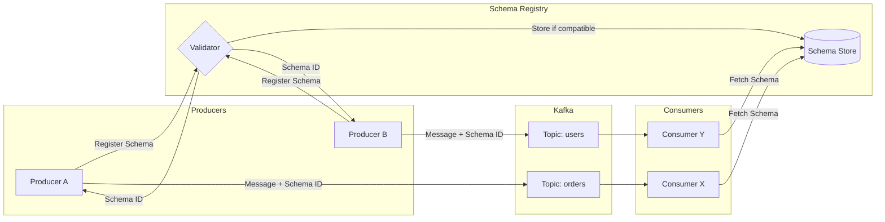
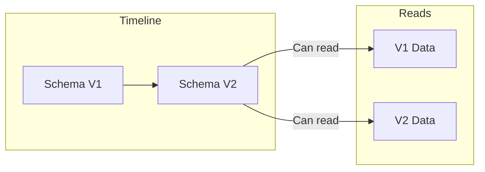
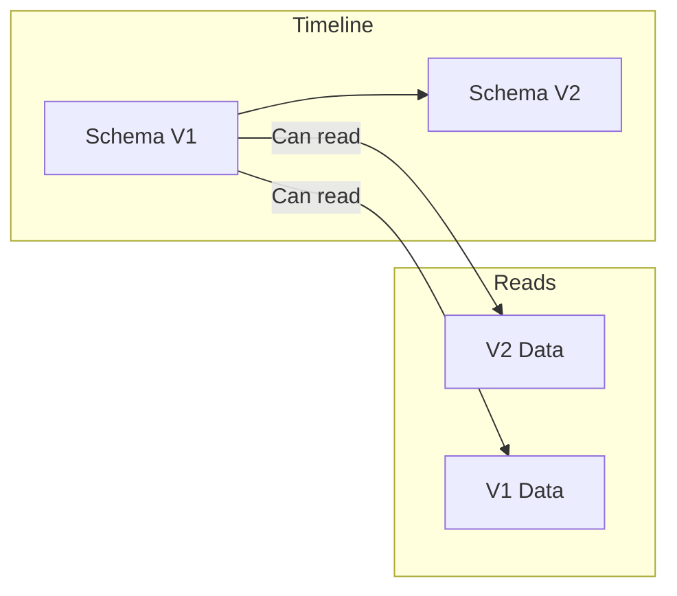
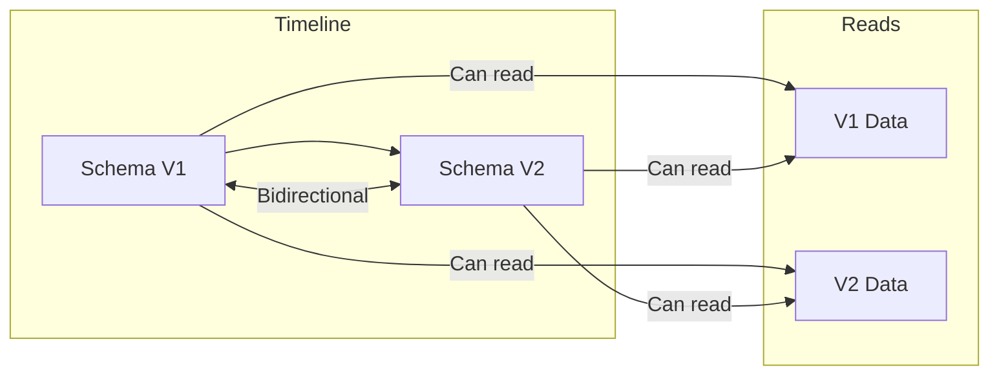
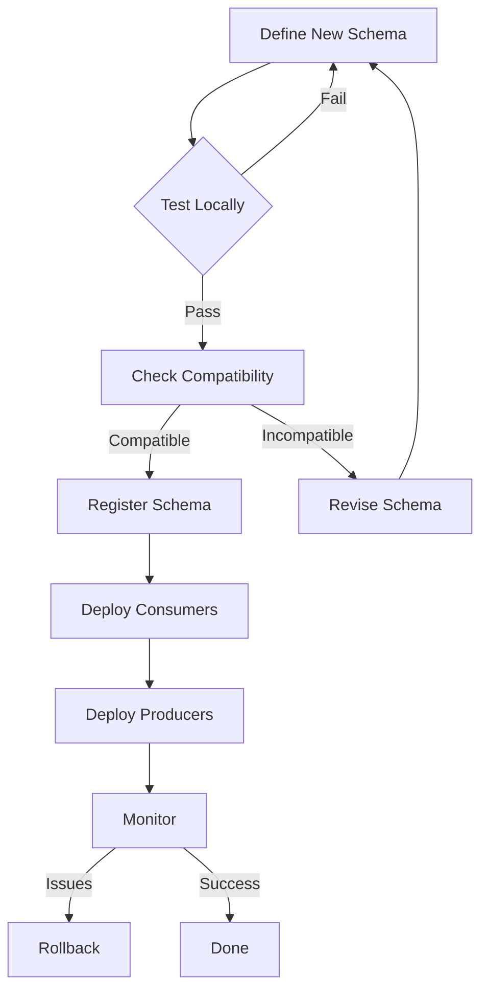
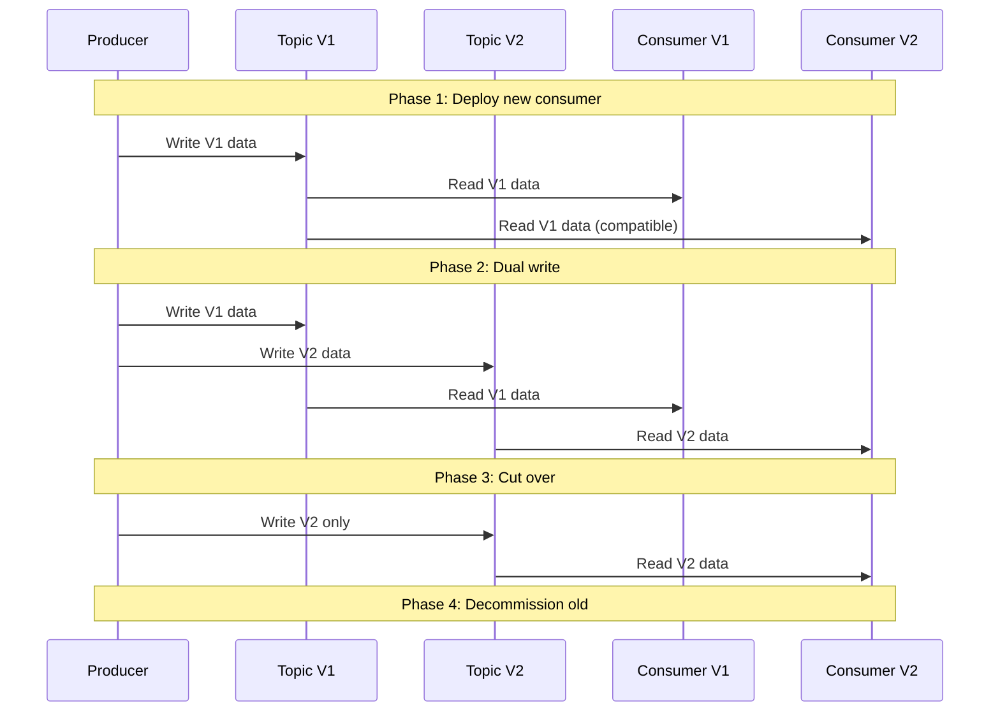

# How to Build Kafka Schema Registry Evolution

Author: [nawazdhandala](https://github.com/nawazdhandala)

Tags: Kafka, Schema Registry, Avro, Data Evolution

Description: A practical guide to implementing schema evolution in Apache Kafka using Schema Registry with compatibility modes, migration strategies, and real-world examples.

---

Data schemas change over time. Fields get added, renamed, or removed. Types evolve. Requirements shift. In streaming systems like Kafka, managing these changes without breaking producers or consumers is critical. Schema Registry provides the infrastructure to handle this, but understanding how to use it effectively requires knowing the rules of schema evolution.

This guide walks through compatibility modes, configuration patterns, evolution strategies, and practical examples you can apply to production Kafka deployments.

---

## Table of Contents

1. Why Schema Evolution Matters
2. Schema Registry Fundamentals
3. Compatibility Modes Explained
4. Configuration and Setup
5. Schema Evolution Workflow
6. Practical Evolution Examples
7. Migration Strategies
8. Testing Schema Changes
9. Common Pitfalls
10. Best Practices

---

## 1. Why Schema Evolution Matters

In a distributed system with multiple producers and consumers, schema changes create coordination challenges:

| Problem | Impact |
|---------|--------|
| Adding a field | Old consumers fail to deserialize new messages |
| Removing a field | New consumers expect data that no longer exists |
| Changing field type | Serialization errors on both sides |
| Renaming a field | Treated as deletion + addition |
| Uncoordinated deployment | Message loss, processing failures, downtime |

Schema Registry solves this by acting as a central authority that validates schema changes before they reach Kafka. It enforces compatibility rules so producers cannot publish incompatible schemas, and consumers always know what to expect.

---

## 2. Schema Registry Fundamentals

Schema Registry stores versioned schemas and validates compatibility. Here is how it fits into the Kafka ecosystem:



Key concepts:

| Concept | Description |
|---------|-------------|
| Subject | A namespace for schemas, typically `<topic>-key` or `<topic>-value` |
| Schema ID | Unique identifier assigned when a schema is registered |
| Version | Sequential number within a subject (v1, v2, v3...) |
| Compatibility | Rules governing what changes are allowed between versions |

---

## 3. Compatibility Modes Explained

Schema Registry supports several compatibility modes. Each defines what schema changes are permitted.

### BACKWARD (Default)

New schema can read data written by the old schema. Consumers can be upgraded first.

**Allowed changes:**
- Delete fields (with defaults in old schema)
- Add optional fields with defaults

**Not allowed:**
- Add required fields
- Delete fields without defaults
- Change field types



### FORWARD

Old schema can read data written by the new schema. Producers can be upgraded first.

**Allowed changes:**
- Add fields (with defaults)
- Delete optional fields

**Not allowed:**
- Delete required fields
- Add fields without defaults



### FULL

Both BACKWARD and FORWARD compatible. Either producers or consumers can be upgraded first.

**Allowed changes:**
- Add optional fields with defaults
- Delete optional fields with defaults

**Not allowed:**
- Any required field changes
- Type changes



### BACKWARD_TRANSITIVE / FORWARD_TRANSITIVE / FULL_TRANSITIVE

Same as above but checked against ALL previous versions, not just the latest.

### NONE

No compatibility checking. Use only for development or when you control the entire pipeline.

### Comparison Table

| Mode | New reads Old | Old reads New | Check Against |
|------|---------------|---------------|---------------|
| BACKWARD | Yes | No | Latest |
| FORWARD | No | Yes | Latest |
| FULL | Yes | Yes | Latest |
| BACKWARD_TRANSITIVE | Yes | No | All versions |
| FORWARD_TRANSITIVE | No | Yes | All versions |
| FULL_TRANSITIVE | Yes | Yes | All versions |
| NONE | No check | No check | Nothing |

---

## 4. Configuration and Setup

### Installing Schema Registry

Using Docker Compose:

```yaml
version: '3.8'
services:
  zookeeper:
    image: confluentinc/cp-zookeeper:7.5.0
    environment:
      ZOOKEEPER_CLIENT_PORT: 2181

  kafka:
    image: confluentinc/cp-kafka:7.5.0
    depends_on:
      - zookeeper
    ports:
      - "9092:9092"
    environment:
      KAFKA_BROKER_ID: 1
      KAFKA_ZOOKEEPER_CONNECT: zookeeper:2181
      KAFKA_ADVERTISED_LISTENERS: PLAINTEXT://localhost:9092
      KAFKA_OFFSETS_TOPIC_REPLICATION_FACTOR: 1

  schema-registry:
    image: confluentinc/cp-schema-registry:7.5.0
    depends_on:
      - kafka
    ports:
      - "8081:8081"
    environment:
      SCHEMA_REGISTRY_HOST_NAME: schema-registry
      SCHEMA_REGISTRY_KAFKASTORE_BOOTSTRAP_SERVERS: kafka:9092
      SCHEMA_REGISTRY_LISTENERS: http://0.0.0.0:8081
```

### Setting Global Compatibility

```bash
# Set global compatibility to BACKWARD (default)
curl -X PUT -H "Content-Type: application/vnd.schemaregistry.v1+json" \
  --data '{"compatibility": "BACKWARD"}' \
  http://localhost:8081/config

# Check current global compatibility
curl http://localhost:8081/config
```

### Setting Subject-Level Compatibility

```bash
# Set compatibility for a specific subject
curl -X PUT -H "Content-Type: application/vnd.schemaregistry.v1+json" \
  --data '{"compatibility": "FULL"}' \
  http://localhost:8081/config/orders-value

# Check subject compatibility
curl http://localhost:8081/config/orders-value
```

### Schema Registry Client Configuration (Java)

```java
Properties props = new Properties();
props.put("bootstrap.servers", "localhost:9092");
props.put("key.serializer", "org.apache.kafka.common.serialization.StringSerializer");
props.put("value.serializer", "io.confluent.kafka.serializers.KafkaAvroSerializer");
props.put("schema.registry.url", "http://localhost:8081");

// Optional: Auto-register schemas (disable in production)
props.put("auto.register.schemas", "false");

// Optional: Use specific schema ID
props.put("use.latest.version", "true");
```

### Schema Registry Client Configuration (Python)

```python
from confluent_kafka import Producer
from confluent_kafka.schema_registry import SchemaRegistryClient
from confluent_kafka.schema_registry.avro import AvroSerializer

schema_registry_conf = {'url': 'http://localhost:8081'}
schema_registry_client = SchemaRegistryClient(schema_registry_conf)

avro_serializer = AvroSerializer(
    schema_registry_client,
    schema_str,
    conf={'auto.register.schemas': False}
)

producer_conf = {
    'bootstrap.servers': 'localhost:9092',
    'value.serializer': avro_serializer
}
```

---

## 5. Schema Evolution Workflow

A typical schema evolution workflow involves these steps:



### Step 1: Define the New Schema

Start with your existing schema and make changes according to compatibility rules.

### Step 2: Test Compatibility Locally

```bash
# Test if a schema is compatible before registering
curl -X POST -H "Content-Type: application/vnd.schemaregistry.v1+json" \
  --data '{"schema": "{\"type\":\"record\",\"name\":\"Order\",\"fields\":[{\"name\":\"id\",\"type\":\"string\"},{\"name\":\"amount\",\"type\":\"double\"},{\"name\":\"currency\",\"type\":{\"type\":\"string\",\"default\":\"USD\"}}]}"}' \
  http://localhost:8081/compatibility/subjects/orders-value/versions/latest
```

Response:
```json
{"is_compatible": true}
```

### Step 3: Register the Schema

```bash
# Register the new schema version
curl -X POST -H "Content-Type: application/vnd.schemaregistry.v1+json" \
  --data '{"schema": "{\"type\":\"record\",\"name\":\"Order\",\"fields\":[{\"name\":\"id\",\"type\":\"string\"},{\"name\":\"amount\",\"type\":\"double\"},{\"name\":\"currency\",\"type\":{\"type\":\"string\",\"default\":\"USD\"}}]}"}' \
  http://localhost:8081/subjects/orders-value/versions
```

Response:
```json
{"id": 2}
```

### Step 4: Deploy in the Correct Order

For BACKWARD compatibility:
1. Deploy consumers first (they can read old and new)
2. Deploy producers second

For FORWARD compatibility:
1. Deploy producers first
2. Deploy consumers second

For FULL compatibility:
1. Deploy in any order

---

## 6. Practical Evolution Examples

### Example 1: Adding an Optional Field (BACKWARD Compatible)

Original schema (v1):

```json
{
  "type": "record",
  "name": "User",
  "namespace": "com.example",
  "fields": [
    {"name": "id", "type": "string"},
    {"name": "email", "type": "string"}
  ]
}
```

New schema (v2) with optional field:

```json
{
  "type": "record",
  "name": "User",
  "namespace": "com.example",
  "fields": [
    {"name": "id", "type": "string"},
    {"name": "email", "type": "string"},
    {"name": "phone", "type": ["null", "string"], "default": null}
  ]
}
```

This is BACKWARD compatible because:
- New consumers can read old messages (phone will be null)
- Old consumers ignore the new field

### Example 2: Removing an Optional Field (FORWARD Compatible)

Original schema (v1):

```json
{
  "type": "record",
  "name": "Order",
  "fields": [
    {"name": "id", "type": "string"},
    {"name": "amount", "type": "double"},
    {"name": "notes", "type": ["null", "string"], "default": null}
  ]
}
```

New schema (v2) without the field:

```json
{
  "type": "record",
  "name": "Order",
  "fields": [
    {"name": "id", "type": "string"},
    {"name": "amount", "type": "double"}
  ]
}
```

This is FORWARD compatible because:
- Old consumers can read new messages (notes will be null from default)
- New consumers simply do not use the field

### Example 3: Adding a Required Field (Breaking Change)

Original schema:

```json
{
  "type": "record",
  "name": "Payment",
  "fields": [
    {"name": "id", "type": "string"},
    {"name": "amount", "type": "double"}
  ]
}
```

Attempting to add a required field:

```json
{
  "type": "record",
  "name": "Payment",
  "fields": [
    {"name": "id", "type": "string"},
    {"name": "amount", "type": "double"},
    {"name": "currency", "type": "string"}  // No default - INCOMPATIBLE
  ]
}
```

This breaks BACKWARD compatibility. The fix:

```json
{
  "type": "record",
  "name": "Payment",
  "fields": [
    {"name": "id", "type": "string"},
    {"name": "amount", "type": "double"},
    {"name": "currency", "type": "string", "default": "USD"}
  ]
}
```

### Example 4: Evolving Enum Types

Original schema with enum:

```json
{
  "type": "record",
  "name": "Order",
  "fields": [
    {"name": "id", "type": "string"},
    {
      "name": "status",
      "type": {
        "type": "enum",
        "name": "OrderStatus",
        "symbols": ["PENDING", "SHIPPED", "DELIVERED"]
      }
    }
  ]
}
```

Adding a new enum value (BACKWARD compatible):

```json
{
  "type": "record",
  "name": "Order",
  "fields": [
    {"name": "id", "type": "string"},
    {
      "name": "status",
      "type": {
        "type": "enum",
        "name": "OrderStatus",
        "symbols": ["PENDING", "SHIPPED", "DELIVERED", "CANCELLED"],
        "default": "PENDING"
      }
    }
  ]
}
```

Note: The default is required for new enum values to maintain BACKWARD compatibility.

### Example 5: Widening Numeric Types

Original schema:

```json
{
  "type": "record",
  "name": "Metric",
  "fields": [
    {"name": "name", "type": "string"},
    {"name": "value", "type": "int"}
  ]
}
```

Widening int to long (FULL compatible):

```json
{
  "type": "record",
  "name": "Metric",
  "fields": [
    {"name": "name", "type": "string"},
    {"name": "value", "type": "long"}
  ]
}
```

Avro allows these promotions:
- int to long, float, or double
- long to float or double
- float to double

---

## 7. Migration Strategies

### Strategy 1: Dual-Write Migration

When you need to make breaking changes, use a transition period with dual writes.



### Strategy 2: Topic Migration

Create a new topic with the new schema and migrate consumers.

```bash
# 1. Create new topic
kafka-topics --create --topic orders-v2 --bootstrap-server localhost:9092

# 2. Register new schema
curl -X POST -H "Content-Type: application/vnd.schemaregistry.v1+json" \
  --data @new-schema.json \
  http://localhost:8081/subjects/orders-v2-value/versions

# 3. Deploy transformer service to copy and transform
# 4. Deploy consumers on new topic
# 5. Switch producers to new topic
# 6. Decommission old topic
```

### Strategy 3: Schema Aliasing

Use schema references to create compatibility layers.

```json
{
  "type": "record",
  "name": "OrderV2",
  "aliases": ["Order"],
  "fields": [
    {"name": "orderId", "type": "string", "aliases": ["id"]},
    {"name": "totalAmount", "type": "double", "aliases": ["amount"]},
    {"name": "currency", "type": "string", "default": "USD"}
  ]
}
```

### Strategy 4: Union Types for Gradual Migration

Use union types to support multiple versions in the same field.

```json
{
  "type": "record",
  "name": "Event",
  "fields": [
    {"name": "id", "type": "string"},
    {
      "name": "payload",
      "type": [
        "com.example.PayloadV1",
        "com.example.PayloadV2"
      ]
    }
  ]
}
```

---

## 8. Testing Schema Changes

### Unit Testing with Avro Tools

```java
import org.apache.avro.Schema;
import org.apache.avro.SchemaCompatibility;
import org.apache.avro.SchemaCompatibility.SchemaCompatibilityType;

@Test
void testBackwardCompatibility() {
    Schema oldSchema = new Schema.Parser().parse(oldSchemaJson);
    Schema newSchema = new Schema.Parser().parse(newSchemaJson);

    SchemaCompatibility.SchemaPairCompatibility compatibility =
        SchemaCompatibility.checkReaderWriterCompatibility(newSchema, oldSchema);

    assertEquals(
        SchemaCompatibilityType.COMPATIBLE,
        compatibility.getType(),
        "New schema should be backward compatible"
    );
}
```

### Integration Testing

```python
import pytest
from confluent_kafka.schema_registry import SchemaRegistryClient

def test_schema_compatibility():
    client = SchemaRegistryClient({'url': 'http://localhost:8081'})

    new_schema = """
    {
        "type": "record",
        "name": "User",
        "fields": [
            {"name": "id", "type": "string"},
            {"name": "email", "type": "string"},
            {"name": "name", "type": ["null", "string"], "default": null}
        ]
    }
    """

    is_compatible = client.test_compatibility(
        subject_name='users-value',
        schema=Schema(new_schema, schema_type='AVRO')
    )

    assert is_compatible, "Schema should be compatible"
```

### CI/CD Pipeline Integration

```yaml
# .github/workflows/schema-check.yml
name: Schema Compatibility Check

on:
  pull_request:
    paths:
      - 'schemas/**'

jobs:
  compatibility:
    runs-on: ubuntu-latest
    steps:
      - uses: actions/checkout@v4

      - name: Start Schema Registry
        run: docker-compose up -d schema-registry

      - name: Wait for Schema Registry
        run: |
          until curl -s http://localhost:8081/subjects; do
            sleep 2
          done

      - name: Check compatibility
        run: |
          for schema in schemas/*.avsc; do
            subject=$(basename "$schema" .avsc)-value
            curl -f -X POST \
              -H "Content-Type: application/vnd.schemaregistry.v1+json" \
              --data "{\"schema\": $(cat "$schema" | jq -Rs .)}" \
              "http://localhost:8081/compatibility/subjects/$subject/versions/latest"
          done
```

---

## 9. Common Pitfalls

### Pitfall 1: Forgetting Defaults

```json
// WRONG: No default for optional field
{"name": "nickname", "type": ["null", "string"]}

// CORRECT: Include default
{"name": "nickname", "type": ["null", "string"], "default": null}
```

### Pitfall 2: Changing Field Order in Unions

```json
// V1
{"name": "value", "type": ["null", "string"], "default": null}

// V2 - BREAKING: null is no longer first
{"name": "value", "type": ["string", "null"], "default": ""}
```

The first type in a union determines the default type.

### Pitfall 3: Namespace Changes

```json
// V1
{"namespace": "com.example", "name": "User"}

// V2 - BREAKING: Different fully qualified name
{"namespace": "com.example.v2", "name": "User"}
```

### Pitfall 4: Logical Type Mismatches

```json
// V1
{"name": "timestamp", "type": "long"}

// V2 - May cause issues
{"name": "timestamp", "type": {"type": "long", "logicalType": "timestamp-millis"}}
```

Some clients handle logical types differently.

### Pitfall 5: Auto-Registration in Production

```java
// DANGEROUS in production
props.put("auto.register.schemas", "true");

// SAFE: Require explicit registration
props.put("auto.register.schemas", "false");
```

---

## 10. Best Practices

### Schema Design

1. **Always include defaults for optional fields**
   ```json
   {"name": "optional_field", "type": ["null", "string"], "default": null}
   ```

2. **Use semantic versioning in namespaces only for major breaks**
   ```json
   {"namespace": "com.example.orders.v2", "name": "Order"}
   ```

3. **Document fields**
   ```json
   {"name": "amount", "type": "double", "doc": "Order total in cents"}
   ```

4. **Use logical types for clarity**
   ```json
   {"name": "created_at", "type": {"type": "long", "logicalType": "timestamp-millis"}}
   ```

### Operational Practices

1. **Disable auto-registration in production**
2. **Use FULL_TRANSITIVE for critical topics**
3. **Test compatibility in CI before deployment**
4. **Keep schema history** (do not delete versions)
5. **Monitor schema registration failures**

### Deployment Checklist

```markdown
- [ ] Schema tested locally with Avro tools
- [ ] Compatibility checked against Schema Registry
- [ ] Integration tests pass
- [ ] Deployment order documented (consumers vs producers)
- [ ] Rollback plan prepared
- [ ] Monitoring alerts configured
- [ ] Team notified of schema change
```

---

## Summary

| Task | How To |
|------|--------|
| Add optional field | Use union with null, include default |
| Remove field | Ensure field had a default in previous version |
| Change field type | Use Avro type promotions or migrate topics |
| Rename field | Use aliases or treat as remove + add |
| Breaking change | Use dual-write or topic migration strategy |

Schema evolution is not just about making changes work. It is about making changes safe. Schema Registry enforces compatibility rules so you can evolve data contracts without coordinating deployments or risking message loss.

Start with BACKWARD compatibility (the default), use FULL when you need flexibility, and only use NONE in development. Test compatibility before registering. Deploy in the correct order. Monitor after changes.

---

*Managing Kafka at scale? [OneUptime](https://oneuptime.com) provides unified observability for your streaming infrastructure, including Kafka broker monitoring, consumer lag tracking, and schema registry health checks.*

---

### See Also

- [Traces and Spans in OpenTelemetry](/blog/post/2025-08-27-traces-and-spans-in-opentelemetry/) - Understand distributed tracing to debug your Kafka consumers
- [How to Structure Logs Properly in OpenTelemetry](/blog/post/2025-08-28-how-to-structure-logs-properly-in-opentelemetry/) - Correlate Kafka processing logs with traces
