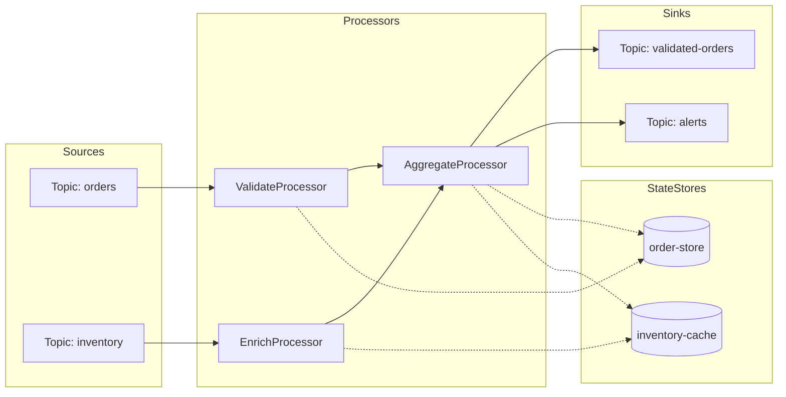
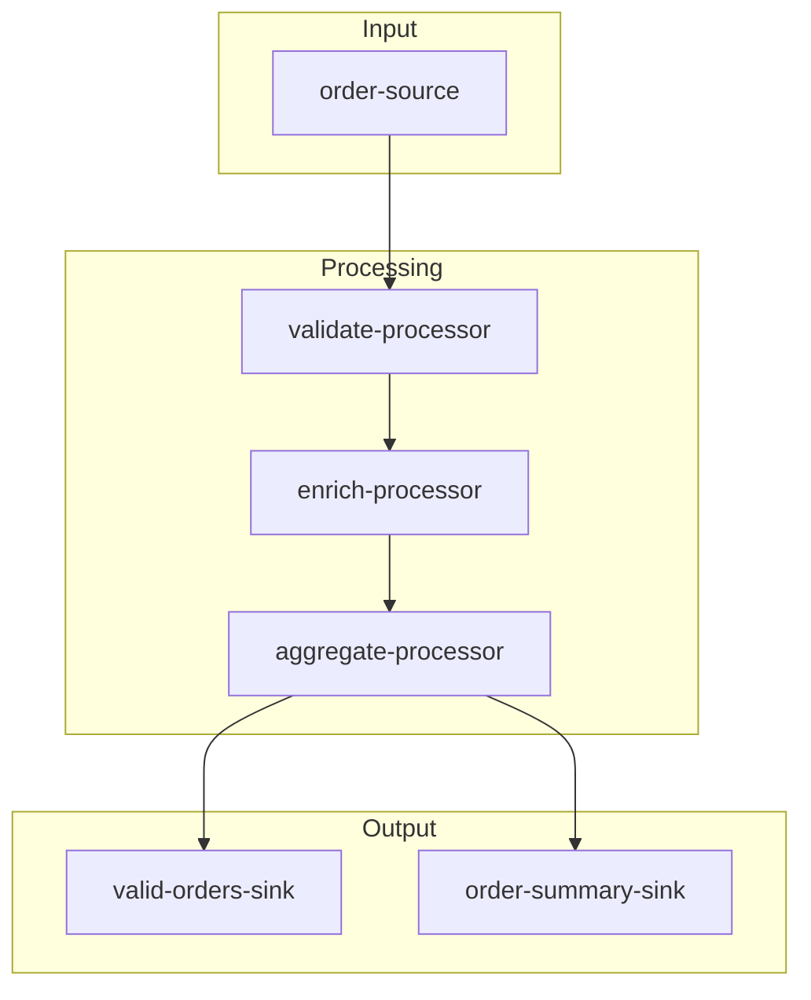
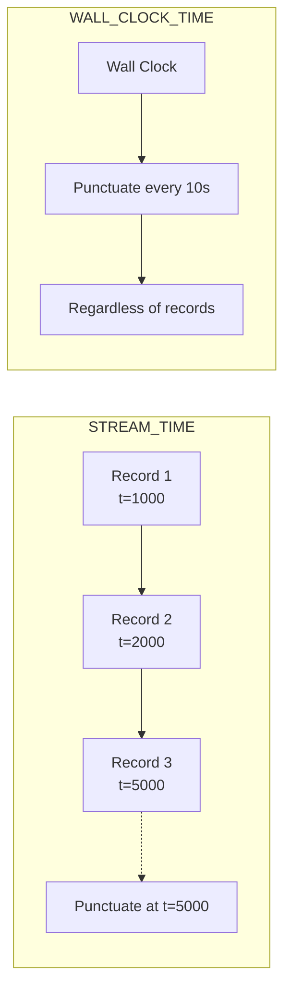
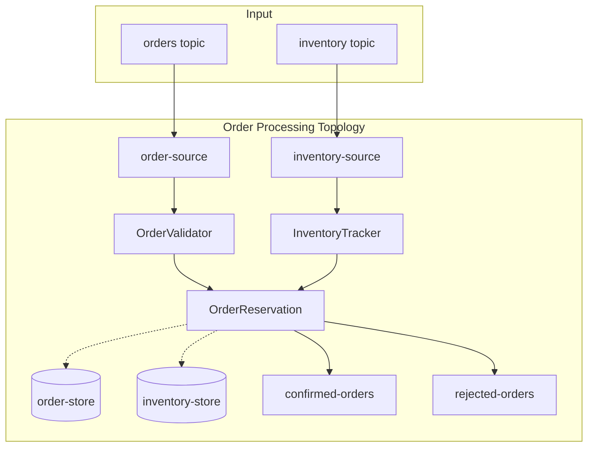

# How to Implement Kafka Streams Processor API

Author: [nawazdhandala](https://github.com/nawazdhandala)

Tags: Kafka, Streams, Processing, Java

Description: A practical guide to building custom stream processors using the Kafka Streams Processor API with state stores, punctuators, and topology patterns.

---

The Kafka Streams DSL covers most use cases with its fluent API for map, filter, join, and aggregate operations. But when you need fine-grained control over record processing, state management, or scheduling, the Processor API gives you direct access to the underlying stream processing machinery.

## When to Use the Processor API

The DSL handles common patterns well. Reach for the Processor API when you need:

- Custom logic that doesn't fit DSL operators
- Direct state store access with specific read/write patterns
- Time-based triggers independent of incoming records (punctuators)
- Complex multi-step processing within a single node
- Fine-grained control over record forwarding

## Understanding the Processor Topology



A topology defines the processing graph: sources read from topics, processors transform data, state stores hold local data, and sinks write to output topics.

## Core Interfaces

### Processor Interface

The `Processor` interface is the heart of the API. You implement `init()` for setup, `process()` for each record, and `close()` for cleanup.

```java
import org.apache.kafka.streams.processor.api.Processor;
import org.apache.kafka.streams.processor.api.ProcessorContext;
import org.apache.kafka.streams.processor.api.Record;

public class OrderValidationProcessor implements Processor<String, Order, String, ValidatedOrder> {

    private ProcessorContext<String, ValidatedOrder> context;

    @Override
    public void init(ProcessorContext<String, ValidatedOrder> context) {
        this.context = context;
    }

    @Override
    public void process(Record<String, Order> record) {
        Order order = record.value();

        if (order == null || order.getItems().isEmpty()) {
            // Skip invalid records
            return;
        }

        ValidatedOrder validated = new ValidatedOrder(
            order.getId(),
            order.getCustomerId(),
            order.getItems(),
            order.getTotal(),
            System.currentTimeMillis()
        );

        // Forward to downstream processors
        context.forward(new Record<>(
            record.key(),
            validated,
            record.timestamp(),
            record.headers()
        ));
    }

    @Override
    public void close() {
        // Cleanup resources if needed
    }
}
```

### ProcessorSupplier Interface

Kafka Streams creates processor instances per task (partition assignment). The `ProcessorSupplier` acts as a factory:

```java
import org.apache.kafka.streams.processor.api.ProcessorSupplier;

public class OrderValidationProcessorSupplier
        implements ProcessorSupplier<String, Order, String, ValidatedOrder> {

    @Override
    public Processor<String, Order, String, ValidatedOrder> get() {
        return new OrderValidationProcessor();
    }
}
```

For simpler cases, use a lambda:

```java
ProcessorSupplier<String, Order, String, ValidatedOrder> supplier =
    () -> new OrderValidationProcessor();
```

## Building a Topology

### Basic Topology Setup

```java
import org.apache.kafka.streams.Topology;
import org.apache.kafka.streams.StreamsBuilder;
import org.apache.kafka.common.serialization.Serdes;

public class OrderProcessingTopology {

    public Topology build() {
        Topology topology = new Topology();

        // Add source that reads from input topic
        topology.addSource(
            "order-source",
            Serdes.String().deserializer(),
            new OrderDeserializer(),
            "orders"
        );

        // Add processor connected to source
        topology.addProcessor(
            "validate-processor",
            new OrderValidationProcessorSupplier(),
            "order-source"
        );

        // Add sink connected to processor
        topology.addSink(
            "validated-sink",
            "validated-orders",
            Serdes.String().serializer(),
            new ValidatedOrderSerializer(),
            "validate-processor"
        );

        return topology;
    }
}
```

### Multi-Stage Processing Pipeline



```java
public Topology buildPipeline() {
    Topology topology = new Topology();

    // Source
    topology.addSource(
        "order-source",
        Serdes.String().deserializer(),
        new OrderDeserializer(),
        "orders"
    );

    // Validation stage
    topology.addProcessor(
        "validate-processor",
        () -> new OrderValidationProcessor(),
        "order-source"
    );

    // Enrichment stage
    topology.addProcessor(
        "enrich-processor",
        () -> new OrderEnrichmentProcessor(),
        "validate-processor"
    );

    // Aggregation stage with state store
    topology.addProcessor(
        "aggregate-processor",
        () -> new OrderAggregationProcessor(),
        "enrich-processor"
    );

    // State store for aggregation
    topology.addStateStore(
        Stores.keyValueStoreBuilder(
            Stores.persistentKeyValueStore("order-aggregates"),
            Serdes.String(),
            new AggregateSerde()
        ),
        "aggregate-processor"
    );

    // Multiple sinks
    topology.addSink(
        "valid-orders-sink",
        "valid-orders",
        Serdes.String().serializer(),
        new ValidatedOrderSerializer(),
        "aggregate-processor"
    );

    topology.addSink(
        "summary-sink",
        "order-summaries",
        Serdes.String().serializer(),
        new SummarySerializer(),
        "aggregate-processor"
    );

    return topology;
}
```

## Working with State Stores

State stores enable processors to maintain local state for aggregations, caching, and lookups.

### Connecting State Stores

```java
import org.apache.kafka.streams.state.KeyValueStore;
import org.apache.kafka.streams.state.Stores;
import org.apache.kafka.streams.state.StoreBuilder;

public Topology buildWithStateStore() {
    Topology topology = new Topology();

    // Create state store builder
    StoreBuilder<KeyValueStore<String, OrderAggregate>> storeBuilder =
        Stores.keyValueStoreBuilder(
            Stores.persistentKeyValueStore("order-store"),
            Serdes.String(),
            new OrderAggregateSerde()
        )
        .withCachingEnabled()
        .withLoggingEnabled(Collections.emptyMap());

    topology.addSource("source", "orders");

    topology.addProcessor(
        "aggregator",
        () -> new StatefulAggregationProcessor(),
        "source"
    );

    // Connect store to processor
    topology.addStateStore(storeBuilder, "aggregator");

    topology.addSink("sink", "aggregated-orders", "aggregator");

    return topology;
}
```

### Accessing State Stores in Processors

```java
public class StatefulAggregationProcessor
        implements Processor<String, Order, String, OrderAggregate> {

    private ProcessorContext<String, OrderAggregate> context;
    private KeyValueStore<String, OrderAggregate> store;

    @Override
    public void init(ProcessorContext<String, OrderAggregate> context) {
        this.context = context;
        this.store = context.getStateStore("order-store");
    }

    @Override
    public void process(Record<String, Order> record) {
        String customerId = record.key();
        Order order = record.value();

        // Read current aggregate
        OrderAggregate aggregate = store.get(customerId);

        if (aggregate == null) {
            aggregate = new OrderAggregate(customerId);
        }

        // Update aggregate
        aggregate.addOrder(order);
        aggregate.setLastUpdated(record.timestamp());

        // Write back to store
        store.put(customerId, aggregate);

        // Forward updated aggregate
        context.forward(new Record<>(
            customerId,
            aggregate,
            record.timestamp()
        ));
    }

    @Override
    public void close() {
        // Store cleanup handled by Kafka Streams
    }
}
```

### Using Different Store Types

```java
// Key-Value Store for point lookups
StoreBuilder<KeyValueStore<String, Customer>> kvStore =
    Stores.keyValueStoreBuilder(
        Stores.persistentKeyValueStore("customer-store"),
        Serdes.String(),
        customerSerde
    );

// Window Store for time-based aggregations
StoreBuilder<WindowStore<String, Long>> windowStore =
    Stores.windowStoreBuilder(
        Stores.persistentWindowStore(
            "clicks-per-minute",
            Duration.ofHours(1),    // retention
            Duration.ofMinutes(1),  // window size
            false                   // retain duplicates
        ),
        Serdes.String(),
        Serdes.Long()
    );

// Session Store for session-based aggregations
StoreBuilder<SessionStore<String, Long>> sessionStore =
    Stores.sessionStoreBuilder(
        Stores.persistentSessionStore(
            "user-sessions",
            Duration.ofHours(24)    // retention
        ),
        Serdes.String(),
        Serdes.Long()
    );
```

## Implementing Punctuators

Punctuators trigger actions based on time, independent of incoming records. Use them for periodic flushes, timeout handling, or scheduled aggregations.

### Punctuator Types



- **STREAM_TIME**: Advances based on record timestamps. Punctuator fires when stream time passes the scheduled interval.
- **WALL_CLOCK_TIME**: Advances based on system clock. Fires at regular intervals even with no records.

### Registering Punctuators

```java
import org.apache.kafka.streams.processor.PunctuationType;
import org.apache.kafka.streams.processor.Punctuator;

public class TimeoutProcessor implements Processor<String, Event, String, Alert> {

    private ProcessorContext<String, Alert> context;
    private KeyValueStore<String, Event> pendingEvents;
    private static final Duration TIMEOUT = Duration.ofMinutes(5);

    @Override
    public void init(ProcessorContext<String, Alert> context) {
        this.context = context;
        this.pendingEvents = context.getStateStore("pending-events");

        // Schedule punctuator using stream time
        context.schedule(
            Duration.ofMinutes(1),
            PunctuationType.STREAM_TIME,
            this::checkTimeouts
        );
    }

    private void checkTimeouts(long timestamp) {
        List<String> timedOut = new ArrayList<>();

        try (KeyValueIterator<String, Event> iter = pendingEvents.all()) {
            while (iter.hasNext()) {
                KeyValue<String, Event> entry = iter.next();
                Event event = entry.value;

                if (timestamp - event.getTimestamp() > TIMEOUT.toMillis()) {
                    timedOut.add(entry.key);

                    // Forward timeout alert
                    context.forward(new Record<>(
                        entry.key,
                        new Alert("TIMEOUT", event),
                        timestamp
                    ));
                }
            }
        }

        // Clean up timed out entries
        timedOut.forEach(pendingEvents::delete);
    }

    @Override
    public void process(Record<String, Event> record) {
        // Store event, waiting for completion
        pendingEvents.put(record.key(), record.value());
    }

    @Override
    public void close() {
        // Punctuator cancellation handled automatically
    }
}
```

### Periodic Flush Pattern

```java
public class BatchingProcessor implements Processor<String, Record, String, Batch> {

    private ProcessorContext<String, Batch> context;
    private final List<Record> buffer = new ArrayList<>();
    private static final int BATCH_SIZE = 100;
    private static final Duration FLUSH_INTERVAL = Duration.ofSeconds(30);

    @Override
    public void init(ProcessorContext<String, Batch> context) {
        this.context = context;

        // Flush on wall clock time to ensure delivery
        context.schedule(
            FLUSH_INTERVAL,
            PunctuationType.WALL_CLOCK_TIME,
            this::flushBuffer
        );
    }

    private void flushBuffer(long timestamp) {
        if (buffer.isEmpty()) {
            return;
        }

        Batch batch = new Batch(new ArrayList<>(buffer), timestamp);
        context.forward(new Record<>("batch", batch, timestamp));
        buffer.clear();
    }

    @Override
    public void process(Record<String, Record> record) {
        buffer.add(record.value());

        // Flush if batch size reached
        if (buffer.size() >= BATCH_SIZE) {
            flushBuffer(record.timestamp());
        }
    }

    @Override
    public void close() {
        // Final flush
        if (!buffer.isEmpty()) {
            flushBuffer(System.currentTimeMillis());
        }
    }
}
```

## Complete Example: Order Processing System



### Domain Models

```java
public record Order(
    String orderId,
    String customerId,
    List<OrderItem> items,
    BigDecimal total,
    long timestamp
) {}

public record OrderItem(
    String productId,
    int quantity,
    BigDecimal price
) {}

public record InventoryUpdate(
    String productId,
    int availableQuantity,
    long timestamp
) {}

public record OrderResult(
    String orderId,
    OrderStatus status,
    String reason,
    long processedAt
) {}

public enum OrderStatus {
    CONFIRMED, REJECTED, PENDING
}
```

### Order Validation Processor

```java
public class OrderValidatorProcessor
        implements Processor<String, Order, String, Order> {

    private ProcessorContext<String, Order> context;

    @Override
    public void init(ProcessorContext<String, Order> context) {
        this.context = context;
    }

    @Override
    public void process(Record<String, Order> record) {
        Order order = record.value();

        // Validate order
        if (order == null) {
            return;
        }

        if (order.items() == null || order.items().isEmpty()) {
            return;
        }

        if (order.total().compareTo(BigDecimal.ZERO) <= 0) {
            return;
        }

        // Forward valid orders
        context.forward(record);
    }

    @Override
    public void close() {}
}
```

### Inventory Tracking Processor

```java
public class InventoryTrackerProcessor
        implements Processor<String, InventoryUpdate, String, InventoryUpdate> {

    private ProcessorContext<String, InventoryUpdate> context;
    private KeyValueStore<String, Integer> inventoryStore;

    @Override
    public void init(ProcessorContext<String, InventoryUpdate> context) {
        this.context = context;
        this.inventoryStore = context.getStateStore("inventory-store");
    }

    @Override
    public void process(Record<String, InventoryUpdate> record) {
        InventoryUpdate update = record.value();

        // Update inventory state
        inventoryStore.put(update.productId(), update.availableQuantity());

        // Forward update
        context.forward(record);
    }

    @Override
    public void close() {}
}
```

### Order Reservation Processor

```java
public class OrderReservationProcessor
        implements Processor<String, Object, String, OrderResult> {

    private ProcessorContext<String, OrderResult> context;
    private KeyValueStore<String, Order> orderStore;
    private KeyValueStore<String, Integer> inventoryStore;

    @Override
    public void init(ProcessorContext<String, OrderResult> context) {
        this.context = context;
        this.orderStore = context.getStateStore("order-store");
        this.inventoryStore = context.getStateStore("inventory-store");

        // Check pending orders periodically
        context.schedule(
            Duration.ofSeconds(10),
            PunctuationType.STREAM_TIME,
            this::processPendingOrders
        );
    }

    @Override
    public void process(Record<String, Object> record) {
        Object value = record.value();

        if (value instanceof Order order) {
            processOrder(order, record.timestamp());
        } else if (value instanceof InventoryUpdate) {
            // Inventory update triggers pending order check
            processPendingOrders(record.timestamp());
        }
    }

    private void processOrder(Order order, long timestamp) {
        // Check inventory for all items
        boolean canFulfill = true;
        String rejectReason = null;

        for (OrderItem item : order.items()) {
            Integer available = inventoryStore.get(item.productId());

            if (available == null || available < item.quantity()) {
                canFulfill = false;
                rejectReason = "Insufficient inventory for " + item.productId();
                break;
            }
        }

        if (canFulfill) {
            // Reserve inventory
            for (OrderItem item : order.items()) {
                int current = inventoryStore.get(item.productId());
                inventoryStore.put(item.productId(), current - item.quantity());
            }

            // Forward confirmed order
            context.forward(
                new Record<>(
                    order.orderId(),
                    new OrderResult(order.orderId(), OrderStatus.CONFIRMED, null, timestamp),
                    timestamp
                ),
                "confirmed-orders"
            );
        } else {
            // Store for retry or reject
            orderStore.put(order.orderId(), order);

            context.forward(
                new Record<>(
                    order.orderId(),
                    new OrderResult(order.orderId(), OrderStatus.PENDING, rejectReason, timestamp),
                    timestamp
                ),
                "rejected-orders"
            );
        }
    }

    private void processPendingOrders(long timestamp) {
        List<String> processed = new ArrayList<>();

        try (KeyValueIterator<String, Order> iter = orderStore.all()) {
            while (iter.hasNext()) {
                KeyValue<String, Order> entry = iter.next();
                Order order = entry.value;

                // Retry order processing
                boolean canFulfill = true;
                for (OrderItem item : order.items()) {
                    Integer available = inventoryStore.get(item.productId());
                    if (available == null || available < item.quantity()) {
                        canFulfill = false;
                        break;
                    }
                }

                if (canFulfill) {
                    processOrder(order, timestamp);
                    processed.add(entry.key);
                }
            }
        }

        processed.forEach(orderStore::delete);
    }

    @Override
    public void close() {}
}
```

### Building the Complete Topology

```java
public class OrderProcessingTopology {

    public Topology build() {
        Topology topology = new Topology();

        // Sources
        topology.addSource(
            "order-source",
            Serdes.String().deserializer(),
            new OrderDeserializer(),
            "orders"
        );

        topology.addSource(
            "inventory-source",
            Serdes.String().deserializer(),
            new InventoryUpdateDeserializer(),
            "inventory"
        );

        // Processors
        topology.addProcessor(
            "order-validator",
            () -> new OrderValidatorProcessor(),
            "order-source"
        );

        topology.addProcessor(
            "inventory-tracker",
            () -> new InventoryTrackerProcessor(),
            "inventory-source"
        );

        topology.addProcessor(
            "order-reservation",
            () -> new OrderReservationProcessor(),
            "order-validator", "inventory-tracker"
        );

        // State stores
        topology.addStateStore(
            Stores.keyValueStoreBuilder(
                Stores.persistentKeyValueStore("order-store"),
                Serdes.String(),
                new OrderSerde()
            ),
            "order-reservation"
        );

        topology.addStateStore(
            Stores.keyValueStoreBuilder(
                Stores.persistentKeyValueStore("inventory-store"),
                Serdes.String(),
                Serdes.Integer()
            ),
            "inventory-tracker", "order-reservation"
        );

        // Sinks
        topology.addSink(
            "confirmed-sink",
            "confirmed-orders",
            Serdes.String().serializer(),
            new OrderResultSerializer(),
            "order-reservation"
        );

        topology.addSink(
            "rejected-sink",
            "rejected-orders",
            Serdes.String().serializer(),
            new OrderResultSerializer(),
            "order-reservation"
        );

        return topology;
    }
}
```

### Running the Application

```java
public class OrderProcessingApp {

    public static void main(String[] args) {
        Properties props = new Properties();
        props.put(StreamsConfig.APPLICATION_ID_CONFIG, "order-processing");
        props.put(StreamsConfig.BOOTSTRAP_SERVERS_CONFIG, "localhost:9092");
        props.put(StreamsConfig.DEFAULT_KEY_SERDE_CLASS_CONFIG, Serdes.StringSerde.class);
        props.put(StreamsConfig.STATE_DIR_CONFIG, "/var/kafka-streams");

        // Processing guarantee
        props.put(StreamsConfig.PROCESSING_GUARANTEE_CONFIG, "exactly_once_v2");

        // Commit interval
        props.put(StreamsConfig.COMMIT_INTERVAL_MS_CONFIG, 1000);

        OrderProcessingTopology topologyBuilder = new OrderProcessingTopology();
        Topology topology = topologyBuilder.build();

        KafkaStreams streams = new KafkaStreams(topology, props);

        // Add shutdown hook
        Runtime.getRuntime().addShutdownHook(new Thread(streams::close));

        // Start processing
        streams.start();
    }
}
```

## Mixing DSL and Processor API

You can combine DSL convenience with Processor API power:

```java
StreamsBuilder builder = new StreamsBuilder();

// Use DSL for simple transformations
KStream<String, Order> orders = builder.stream("orders");

KStream<String, Order> validOrders = orders
    .filter((key, order) -> order != null && !order.items().isEmpty());

// Switch to Processor API for complex logic
validOrders.process(
    () -> new ComplexProcessingProcessor(),
    Named.as("complex-processor"),
    "state-store-1", "state-store-2"
);

// Back to DSL
validOrders
    .mapValues(order -> new OrderSummary(order))
    .to("order-summaries");
```

## Testing Processors

```java
import org.apache.kafka.streams.TopologyTestDriver;
import org.apache.kafka.streams.TestInputTopic;
import org.apache.kafka.streams.TestOutputTopic;
import org.apache.kafka.streams.state.KeyValueStore;

public class OrderProcessingTest {

    private TopologyTestDriver testDriver;
    private TestInputTopic<String, Order> orderInput;
    private TestOutputTopic<String, OrderResult> confirmedOutput;
    private TestOutputTopic<String, OrderResult> rejectedOutput;

    @BeforeEach
    void setup() {
        Properties props = new Properties();
        props.put(StreamsConfig.APPLICATION_ID_CONFIG, "test");
        props.put(StreamsConfig.BOOTSTRAP_SERVERS_CONFIG, "dummy:1234");

        Topology topology = new OrderProcessingTopology().build();
        testDriver = new TopologyTestDriver(topology, props);

        orderInput = testDriver.createInputTopic(
            "orders",
            new StringSerializer(),
            new OrderSerializer()
        );

        confirmedOutput = testDriver.createOutputTopic(
            "confirmed-orders",
            new StringDeserializer(),
            new OrderResultDeserializer()
        );

        rejectedOutput = testDriver.createOutputTopic(
            "rejected-orders",
            new StringDeserializer(),
            new OrderResultDeserializer()
        );
    }

    @AfterEach
    void teardown() {
        testDriver.close();
    }

    @Test
    void shouldConfirmOrderWhenInventoryAvailable() {
        // Setup inventory
        KeyValueStore<String, Integer> inventoryStore =
            testDriver.getKeyValueStore("inventory-store");
        inventoryStore.put("product-1", 100);

        // Submit order
        Order order = new Order(
            "order-1",
            "customer-1",
            List.of(new OrderItem("product-1", 5, new BigDecimal("10.00"))),
            new BigDecimal("50.00"),
            System.currentTimeMillis()
        );

        orderInput.pipeInput("order-1", order);

        // Verify result
        assertFalse(confirmedOutput.isEmpty());
        OrderResult result = confirmedOutput.readValue();
        assertEquals(OrderStatus.CONFIRMED, result.status());
    }

    @Test
    void shouldRejectOrderWhenInsufficientInventory() {
        // No inventory setup

        Order order = new Order(
            "order-2",
            "customer-1",
            List.of(new OrderItem("product-1", 5, new BigDecimal("10.00"))),
            new BigDecimal("50.00"),
            System.currentTimeMillis()
        );

        orderInput.pipeInput("order-2", order);

        // Verify rejection
        assertFalse(rejectedOutput.isEmpty());
        OrderResult result = rejectedOutput.readValue();
        assertEquals(OrderStatus.PENDING, result.status());
    }
}
```

## Best Practices

### 1. Keep Processors Focused

Each processor should do one thing well. Split complex logic into multiple processors connected in sequence.

### 2. Handle Null Values

Records can have null values (tombstones). Always check before processing:

```java
@Override
public void process(Record<String, Order> record) {
    if (record.value() == null) {
        // Handle tombstone or skip
        return;
    }
    // Process normally
}
```

### 3. Use Appropriate State Store Types

- KeyValueStore: Point lookups and updates
- WindowStore: Time-based aggregations
- SessionStore: Session-based patterns

### 4. Consider State Store Caching

Enable caching to reduce writes to the changelog:

```java
Stores.keyValueStoreBuilder(...)
    .withCachingEnabled()
```

### 5. Forward Records Explicitly

Use named child nodes when forwarding to specific downstream processors:

```java
context.forward(record, "specific-child-node");
```

### 6. Clean Up Resources

Release resources in the `close()` method. State store cleanup is handled by Kafka Streams.

### 7. Test with TopologyTestDriver

The test driver runs your topology synchronously without a real Kafka cluster, making tests fast and deterministic.

---

The Processor API provides full control over stream processing when the DSL falls short. Start with the DSL for standard transformations, then drop to the Processor API when you need custom state access patterns, punctuators for time-based triggers, or complex multi-source processing logic. The ability to mix both approaches gives you flexibility without sacrificing convenience.
