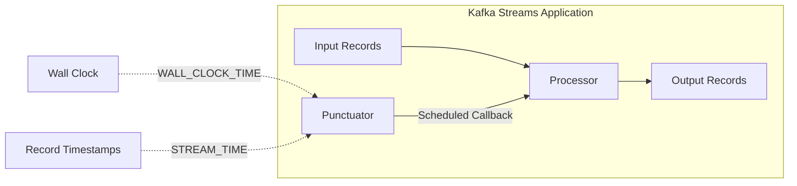
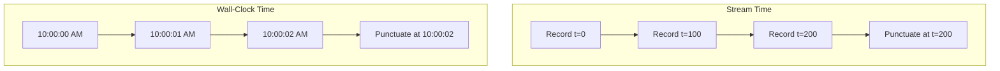
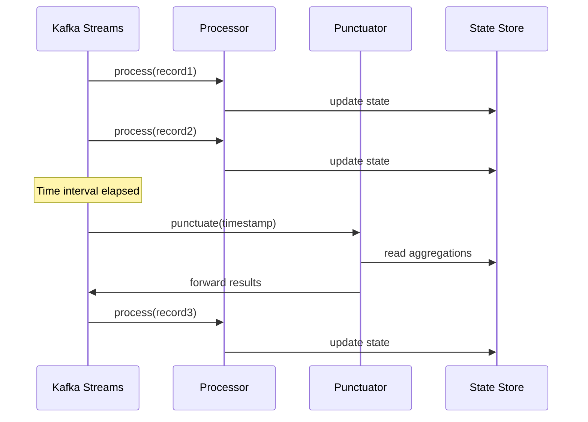
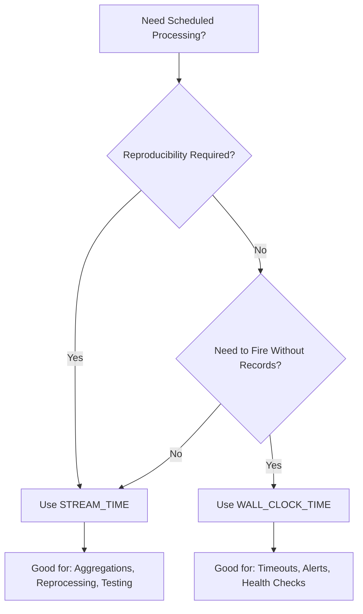

# How to Create Kafka Streams Punctuators

Author: [nawazdhandala](https://github.com/nawazdhandala)

Tags: Kafka Streams, Punctuators, Scheduled Processing, Time

Description: Learn to implement Kafka Streams punctuators for scheduled callbacks with wall-clock and stream-time semantics for periodic processing.

---

Kafka Streams provides a powerful mechanism called punctuators that allows you to schedule periodic callbacks within your stream processing topology. Whether you need to emit aggregated results at regular intervals, perform cleanup operations, or trigger time-based computations, punctuators give you fine-grained control over scheduled processing.

## What Are Punctuators?

A punctuator is a callback function that gets invoked at regular intervals during stream processing. Unlike normal record processing which is triggered by incoming messages, punctuators execute based on time - either wall-clock time or stream time.



## Punctuator Types: Stream Time vs Wall-Clock Time

Kafka Streams offers two punctuation semantics through the `PunctuationType` enum:

### Stream Time Punctuators

Stream time advances only when new records arrive. The punctuator fires based on the timestamps embedded in the records being processed.

**Characteristics:**
- Deterministic and reproducible
- Ideal for reprocessing historical data
- Will not fire if no records are being processed
- Advances based on the maximum timestamp observed

### Wall-Clock Time Punctuators

Wall-clock time is based on the system clock. The punctuator fires according to real-world time regardless of record flow.

**Characteristics:**
- Fires even when no records are arriving
- Useful for timeout detection and session expiration
- Not reproducible across reruns
- Better for real-time alerting scenarios



## Implementing a Basic Punctuator

Let us start with a complete example that demonstrates how to create and schedule a punctuator.

### Step 1: Create the Processor with Punctuator

```java
import org.apache.kafka.streams.processor.api.Processor;
import org.apache.kafka.streams.processor.api.ProcessorContext;
import org.apache.kafka.streams.processor.api.Record;
import org.apache.kafka.streams.processor.Punctuator;
import org.apache.kafka.streams.processor.PunctuationType;
import org.apache.kafka.streams.processor.Cancellable;
import org.apache.kafka.streams.state.KeyValueStore;

import java.time.Duration;

public class AggregatingProcessor implements Processor<String, Integer, String, Integer> {

    private ProcessorContext<String, Integer> context;
    private KeyValueStore<String, Integer> stateStore;
    private Cancellable punctuatorHandle;

    @Override
    public void init(ProcessorContext<String, Integer> context) {
        this.context = context;

        // Get the state store for maintaining aggregations
        this.stateStore = context.getStateStore("aggregation-store");

        // Schedule the punctuator to fire every 30 seconds using stream time
        this.punctuatorHandle = context.schedule(
            Duration.ofSeconds(30),
            PunctuationType.STREAM_TIME,
            new EmitAggregationsPunctuator()
        );
    }

    @Override
    public void process(Record<String, Integer> record) {
        // Aggregate incoming values
        String key = record.key();
        Integer currentValue = stateStore.get(key);

        if (currentValue == null) {
            currentValue = 0;
        }

        stateStore.put(key, currentValue + record.value());
    }

    @Override
    public void close() {
        // Cancel the punctuator when the processor is closed
        if (punctuatorHandle != null) {
            punctuatorHandle.cancel();
        }
    }

    // Inner class implementing the Punctuator interface
    private class EmitAggregationsPunctuator implements Punctuator {

        @Override
        public void punctuate(long timestamp) {
            // Iterate through all keys in the state store
            try (var iterator = stateStore.all()) {
                while (iterator.hasNext()) {
                    var entry = iterator.next();

                    // Forward the aggregated result downstream
                    context.forward(new Record<>(
                        entry.key,
                        entry.value,
                        timestamp
                    ));

                    // Optionally reset the aggregation
                    stateStore.delete(entry.key);
                }
            }
        }
    }
}
```

### Step 2: Build the Topology

```java
import org.apache.kafka.streams.Topology;
import org.apache.kafka.streams.state.Stores;
import org.apache.kafka.streams.state.KeyValueStore;
import org.apache.kafka.common.serialization.Serdes;

public class PunctuatorTopology {

    public static Topology build() {
        Topology topology = new Topology();

        // Add the state store
        topology.addStateStore(
            Stores.keyValueStoreBuilder(
                Stores.persistentKeyValueStore("aggregation-store"),
                Serdes.String(),
                Serdes.Integer()
            )
        );

        // Add source processor
        topology.addSource(
            "source",
            Serdes.String().deserializer(),
            Serdes.Integer().deserializer(),
            "input-topic"
        );

        // Add the processor with punctuator
        topology.addProcessor(
            "aggregating-processor",
            AggregatingProcessor::new,
            "source"
        );

        // Connect the state store to the processor
        topology.connectProcessorAndStateStores(
            "aggregating-processor",
            "aggregation-store"
        );

        // Add sink processor
        topology.addSink(
            "sink",
            "output-topic",
            Serdes.String().serializer(),
            Serdes.Integer().serializer(),
            "aggregating-processor"
        );

        return topology;
    }
}
```

## Advanced Punctuator Patterns

### Dynamic Punctuator Scheduling

You can dynamically schedule and cancel punctuators based on runtime conditions:

```java
public class DynamicPunctuatorProcessor implements Processor<String, Event, String, Alert> {

    private ProcessorContext<String, Alert> context;
    private KeyValueStore<String, Long> lastSeenStore;
    private Map<String, Cancellable> activePunctuators = new HashMap<>();

    @Override
    public void init(ProcessorContext<String, Alert> context) {
        this.context = context;
        this.lastSeenStore = context.getStateStore("last-seen-store");
    }

    @Override
    public void process(Record<String, Event> record) {
        String deviceId = record.key();

        // Update the last seen timestamp
        lastSeenStore.put(deviceId, record.timestamp());

        // If no punctuator exists for this device, create one
        if (!activePunctuators.containsKey(deviceId)) {
            Cancellable handle = context.schedule(
                Duration.ofMinutes(5),
                PunctuationType.WALL_CLOCK_TIME,
                timestamp -> checkDeviceTimeout(deviceId, timestamp)
            );
            activePunctuators.put(deviceId, handle);
        }
    }

    private void checkDeviceTimeout(String deviceId, long currentTime) {
        Long lastSeen = lastSeenStore.get(deviceId);

        if (lastSeen != null) {
            long inactiveTime = currentTime - lastSeen;

            // If device has been inactive for more than 10 minutes
            if (inactiveTime > Duration.ofMinutes(10).toMillis()) {
                // Emit an alert
                context.forward(new Record<>(
                    deviceId,
                    new Alert("Device inactive for " + inactiveTime + "ms"),
                    currentTime
                ));

                // Cancel and remove the punctuator
                Cancellable handle = activePunctuators.remove(deviceId);
                if (handle != null) {
                    handle.cancel();
                }

                // Clean up state
                lastSeenStore.delete(deviceId);
            }
        }
    }

    @Override
    public void close() {
        // Cancel all active punctuators
        activePunctuators.values().forEach(Cancellable::cancel);
        activePunctuators.clear();
    }
}
```

### Multiple Punctuators with Different Intervals

A single processor can schedule multiple punctuators with different intervals and types:

```java
@Override
public void init(ProcessorContext<String, String> context) {
    this.context = context;

    // Fast punctuator for real-time metrics - every 1 second
    context.schedule(
        Duration.ofSeconds(1),
        PunctuationType.WALL_CLOCK_TIME,
        this::emitRealtimeMetrics
    );

    // Medium punctuator for aggregations - every 1 minute
    context.schedule(
        Duration.ofMinutes(1),
        PunctuationType.STREAM_TIME,
        this::emitMinuteAggregations
    );

    // Slow punctuator for cleanup - every 1 hour
    context.schedule(
        Duration.ofHours(1),
        PunctuationType.WALL_CLOCK_TIME,
        this::performCleanup
    );
}

private void emitRealtimeMetrics(long timestamp) {
    // Emit current counts and rates
}

private void emitMinuteAggregations(long timestamp) {
    // Emit minute-level aggregations
}

private void performCleanup(long timestamp) {
    // Remove expired entries from state stores
}
```

## Punctuator Execution Flow

Understanding when punctuators execute is crucial for designing your application:



## Cancelling Punctuators

The `schedule()` method returns a `Cancellable` handle that allows you to stop the punctuator:

```java
public class CancellablePunctuatorExample implements Processor<String, String, String, String> {

    private Cancellable punctuatorHandle;
    private boolean shouldCancel = false;

    @Override
    public void init(ProcessorContext<String, String> context) {
        this.punctuatorHandle = context.schedule(
            Duration.ofSeconds(10),
            PunctuationType.STREAM_TIME,
            timestamp -> {
                if (shouldCancel) {
                    // Cancel from within the punctuator itself
                    punctuatorHandle.cancel();
                    return;
                }
                // Normal processing
                processScheduledTask(timestamp);
            }
        );
    }

    @Override
    public void process(Record<String, String> record) {
        // Check for cancellation signal
        if ("STOP_PUNCTUATOR".equals(record.value())) {
            shouldCancel = true;
        }
    }

    private void processScheduledTask(long timestamp) {
        // Scheduled task logic
    }

    @Override
    public void close() {
        if (punctuatorHandle != null) {
            punctuatorHandle.cancel();
        }
    }
}
```

## Common Use Cases

### 1. Session Window Expiration

Detect when user sessions have expired based on inactivity:

```java
private void checkSessionExpiration(long timestamp) {
    try (var iterator = sessionStore.all()) {
        while (iterator.hasNext()) {
            var session = iterator.next();

            if (timestamp - session.value.lastActivity > SESSION_TIMEOUT_MS) {
                // Emit session summary
                context.forward(new Record<>(
                    session.key,
                    session.value.toSummary(),
                    timestamp
                ));

                // Remove expired session
                sessionStore.delete(session.key);
            }
        }
    }
}
```

### 2. Periodic Metrics Emission

Emit aggregated metrics at regular intervals:

```java
private void emitMetrics(long timestamp) {
    MetricsSummary summary = new MetricsSummary();
    summary.setTimestamp(timestamp);
    summary.setRecordCount(recordCounter.getAndSet(0));
    summary.setErrorCount(errorCounter.getAndSet(0));
    summary.setAverageLatency(calculateAverageLatency());

    context.forward(new Record<>("metrics", summary, timestamp));
}
```

### 3. Batch Processing

Accumulate records and process them in batches:

```java
private List<Record<String, String>> batch = new ArrayList<>();
private static final int BATCH_SIZE = 100;

@Override
public void process(Record<String, String> record) {
    batch.add(record);

    if (batch.size() >= BATCH_SIZE) {
        flushBatch(record.timestamp());
    }
}

// Punctuator ensures batches are flushed even with low volume
private void flushBatchOnSchedule(long timestamp) {
    if (!batch.isEmpty()) {
        flushBatch(timestamp);
    }
}

private void flushBatch(long timestamp) {
    // Process the batch
    processBatch(batch);
    batch.clear();
}
```

### 4. Heartbeat and Health Monitoring

```java
private void emitHeartbeat(long timestamp) {
    HealthStatus status = new HealthStatus();
    status.setProcessorId(processorId);
    status.setTimestamp(timestamp);
    status.setRecordsProcessed(totalRecordsProcessed);
    status.setStateStoreSize(getStateStoreSize());
    status.setStatus("HEALTHY");

    context.forward(new Record<>("heartbeat", status, timestamp));
}
```

## Best Practices

### 1. Choose the Right Punctuation Type



### 2. Handle State Store Access Carefully

Always close iterators and handle exceptions:

```java
private void safePunctuate(long timestamp) {
    try (var iterator = stateStore.all()) {
        while (iterator.hasNext()) {
            try {
                processEntry(iterator.next(), timestamp);
            } catch (Exception e) {
                log.error("Error processing entry", e);
                // Continue processing other entries
            }
        }
    } catch (Exception e) {
        log.error("Error accessing state store", e);
    }
}
```

### 3. Avoid Long-Running Operations

Punctuators run on the stream thread - keep them fast:

```java
// Bad - blocks the stream thread
private void badPunctuate(long timestamp) {
    httpClient.post(collectAllMetrics()); // Network call blocks processing
}

// Good - collect data quickly, process asynchronously if needed
private void goodPunctuate(long timestamp) {
    MetricsSnapshot snapshot = collectMetricsSnapshot();
    context.forward(new Record<>("metrics", snapshot, timestamp));
    // Let a downstream consumer handle the slow network call
}
```

### 4. Use Appropriate Intervals

Consider your throughput and latency requirements:

```java
// For high-throughput, low-latency: shorter intervals
context.schedule(Duration.ofMillis(100), PunctuationType.WALL_CLOCK_TIME, ...);

// For batch processing: longer intervals
context.schedule(Duration.ofMinutes(5), PunctuationType.STREAM_TIME, ...);

// For cleanup tasks: much longer intervals
context.schedule(Duration.ofHours(1), PunctuationType.WALL_CLOCK_TIME, ...);
```

## Testing Punctuators

Use `TopologyTestDriver` to test punctuators with controlled time advancement:

```java
import org.apache.kafka.streams.TopologyTestDriver;
import org.apache.kafka.streams.TestInputTopic;
import org.apache.kafka.streams.TestOutputTopic;

@Test
void testStreamTimePunctuator() {
    try (TopologyTestDriver driver = new TopologyTestDriver(topology, props)) {
        TestInputTopic<String, Integer> inputTopic = driver.createInputTopic(
            "input-topic",
            new StringSerializer(),
            new IntegerSerializer()
        );

        TestOutputTopic<String, Integer> outputTopic = driver.createOutputTopic(
            "output-topic",
            new StringDeserializer(),
            new IntegerDeserializer()
        );

        // Send records with increasing timestamps
        inputTopic.pipeInput("key1", 10, Instant.ofEpochMilli(0));
        inputTopic.pipeInput("key1", 20, Instant.ofEpochMilli(15000));

        // No output yet - punctuator fires at 30 seconds
        assertTrue(outputTopic.isEmpty());

        // Advance stream time past 30 seconds
        inputTopic.pipeInput("key1", 5, Instant.ofEpochMilli(35000));

        // Now the punctuator should have fired
        var output = outputTopic.readKeyValue();
        assertEquals("key1", output.key);
        assertEquals(30, output.value); // 10 + 20 aggregated before punctuate
    }
}

@Test
void testWallClockTimePunctuator() {
    try (TopologyTestDriver driver = new TopologyTestDriver(topology, props)) {
        TestInputTopic<String, Integer> inputTopic = driver.createInputTopic(
            "input-topic",
            new StringSerializer(),
            new IntegerSerializer()
        );

        // Send a record
        inputTopic.pipeInput("key1", 10);

        // Advance wall-clock time
        driver.advanceWallClockTime(Duration.ofSeconds(35));

        // The punctuator should have fired based on wall-clock time
        // Check output or state as needed
    }
}
```

## Summary

Kafka Streams punctuators provide a powerful mechanism for implementing scheduled processing within your stream applications. Key takeaways:

1. **Choose the right punctuation type**: Use `STREAM_TIME` for reproducible, event-driven scheduling and `WALL_CLOCK_TIME` for real-time requirements like timeouts and alerts.

2. **Manage punctuator lifecycle**: Always store the `Cancellable` handle and cancel punctuators when appropriate to prevent resource leaks.

3. **Keep punctuators lightweight**: Avoid blocking operations in punctuators since they run on the stream processing thread.

4. **Leverage state stores**: Punctuators work best when combined with state stores to accumulate data between invocations.

5. **Test thoroughly**: Use `TopologyTestDriver` with controlled time advancement to verify punctuator behavior.

By following these patterns and best practices, you can effectively implement scheduled processing in your Kafka Streams applications for use cases ranging from windowed aggregations to session management and health monitoring.
