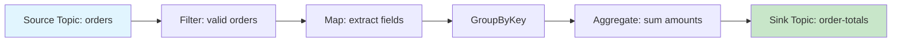
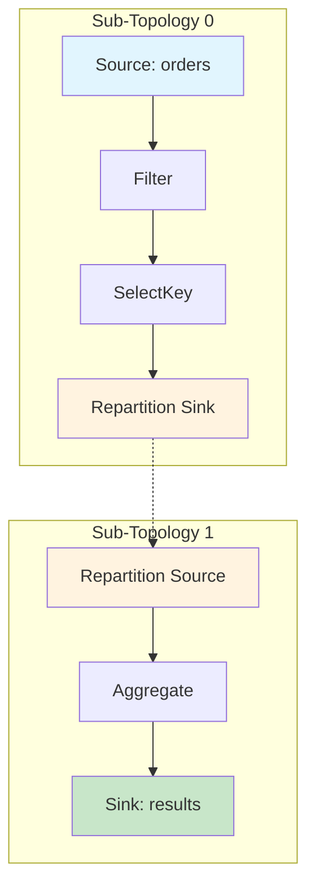
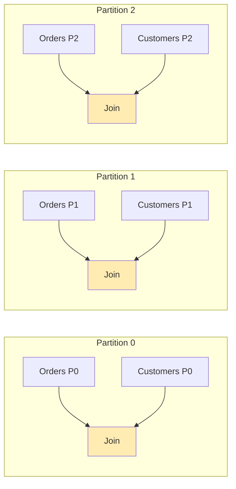
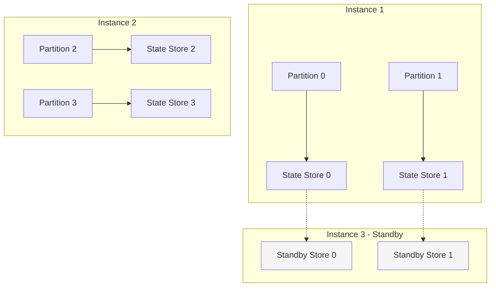
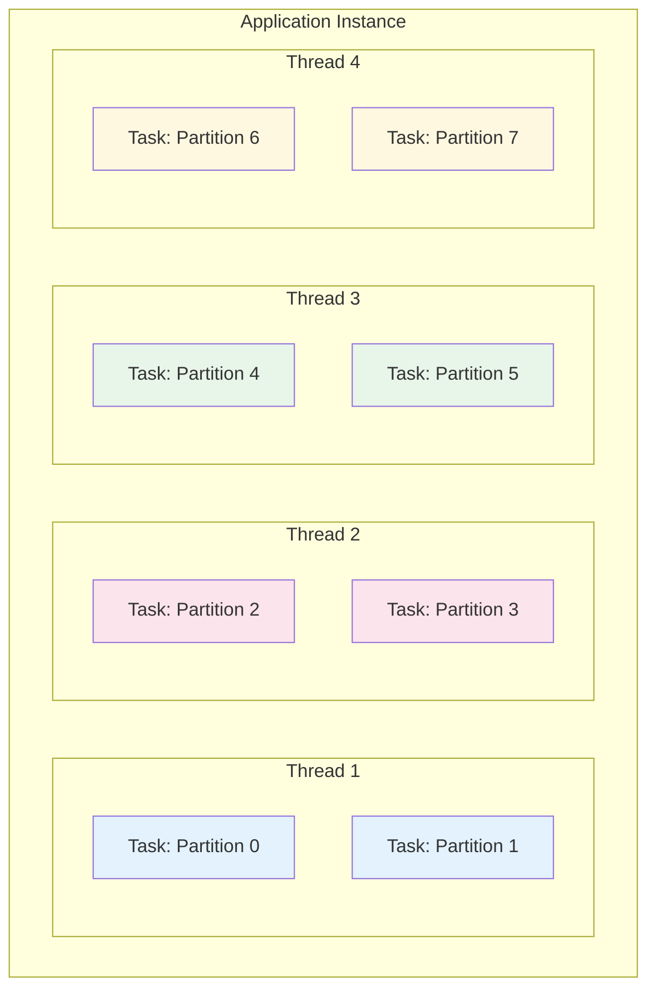
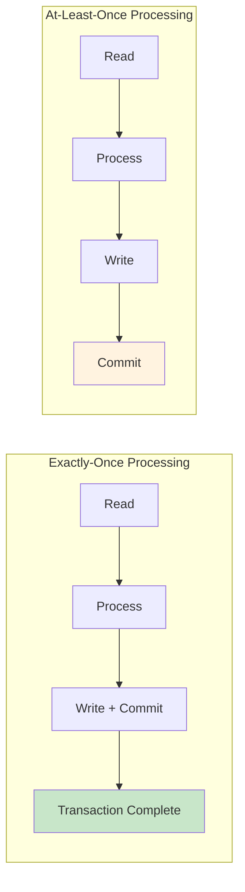
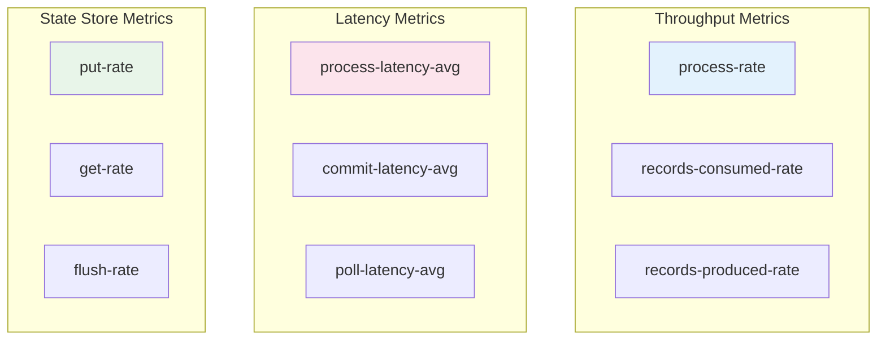

# How to Build Kafka Streams Topology Optimization

Author: [nawazdhandala](https://github.com/nawazdhandala)

Tags: Kafka Streams, Topology, Optimization, Performance

Description: Learn to optimize Kafka Streams topologies with sub-topology design, state store placement, and repartitioning strategies for scalable processing.

---

Kafka Streams provides a powerful abstraction for building real-time stream processing applications. However, as your data volumes grow and processing requirements become more complex, understanding and optimizing your topology becomes critical for achieving high performance. This guide walks you through the essential techniques for building and optimizing Kafka Streams topologies.

## Understanding Kafka Streams Topology

A topology in Kafka Streams represents the processing logic as a directed acyclic graph (DAG) of stream processors. Each node in this graph performs a specific operation - reading from a source, transforming data, aggregating values, or writing to a sink.



### Describing Your Topology

Before optimizing, you need to understand your current topology structure. Kafka Streams provides a built-in method to describe the topology:

```java
import org.apache.kafka.streams.StreamsBuilder;
import org.apache.kafka.streams.Topology;
import org.apache.kafka.streams.kstream.KStream;

public class TopologyDescriber {
    public static void main(String[] args) {
        StreamsBuilder builder = new StreamsBuilder();

        KStream<String, Order> orders = builder.stream("orders");

        orders
            .filter((key, order) -> order.getAmount() > 0)
            .mapValues(order -> new OrderSummary(order.getId(), order.getAmount()))
            .groupByKey()
            .reduce((agg, newValue) -> agg.merge(newValue))
            .toStream()
            .to("order-summaries");

        Topology topology = builder.build();

        // Print the topology description
        System.out.println(topology.describe());
    }
}
```

The output reveals the internal structure including sub-topologies, source processors, sink processors, and state stores. This information is invaluable for optimization.

## Sub-Topology Design and Optimization

Kafka Streams automatically partitions your topology into sub-topologies based on repartitioning boundaries. Each sub-topology can be scaled independently through parallelism.



### Minimizing Repartitioning

Repartitioning is one of the most expensive operations in Kafka Streams. It creates intermediate topics and adds network overhead. Here are strategies to minimize it:

```java
// Bad: Unnecessary repartitioning
KStream<String, Order> orders = builder.stream("orders");
orders
    .selectKey((key, value) -> value.getCustomerId())  // Triggers repartition
    .groupByKey()
    .count();

// Better: Use groupBy with a KeyValueMapper
KStream<String, Order> orders = builder.stream("orders");
orders
    .groupBy((key, value) -> value.getCustomerId())  // Single repartition
    .count();
```

### Copartitioning for Joins

When joining streams, ensure they are copartitioned to avoid unnecessary repartitioning:

```java
// Ensure both topics have the same number of partitions
// and use the same partitioning strategy

KStream<String, Order> orders = builder.stream("orders");
KTable<String, Customer> customers = builder.table("customers");

// This join works without repartitioning if both topics
// are keyed by customerId and have the same partition count
KStream<String, EnrichedOrder> enriched = orders.join(
    customers,
    (order, customer) -> new EnrichedOrder(order, customer)
);
```



## State Store Optimization

State stores are central to stateful operations like aggregations and joins. Proper configuration significantly impacts performance.

### Choosing the Right State Store

```java
import org.apache.kafka.streams.state.Stores;
import org.apache.kafka.streams.state.KeyValueBytesStoreSupplier;

// Default RocksDB store - good for large state
KeyValueBytesStoreSupplier rocksDbStore = Stores.persistentKeyValueStore("my-store");

// In-memory store - faster but limited by heap size
KeyValueBytesStoreSupplier inMemoryStore = Stores.inMemoryKeyValueStore("my-store");

// Use with Materialized
KTable<String, Long> counts = stream
    .groupByKey()
    .count(Materialized.<String, Long>as(inMemoryStore)
        .withKeySerde(Serdes.String())
        .withValueSerde(Serdes.Long()));
```

### RocksDB Tuning

For production workloads with RocksDB, tune these key parameters:

```java
import org.apache.kafka.streams.StreamsConfig;
import org.rocksdb.Options;
import org.rocksdb.BlockBasedTableConfig;

Properties props = new Properties();
props.put(StreamsConfig.ROCKSDB_CONFIG_SETTER_CLASS_CONFIG, CustomRocksDBConfig.class);

public class CustomRocksDBConfig implements RocksDBConfigSetter {
    @Override
    public void setConfig(String storeName, Options options, Map<String, Object> configs) {
        // Increase block cache for frequently accessed data
        BlockBasedTableConfig tableConfig = new BlockBasedTableConfig();
        tableConfig.setBlockCacheSize(256 * 1024 * 1024L);  // 256 MB
        tableConfig.setBlockSize(16 * 1024);  // 16 KB blocks

        options.setTableFormatConfig(tableConfig);

        // Optimize for point lookups
        options.optimizeForPointLookup(256);

        // Increase write buffer for better write performance
        options.setWriteBufferSize(64 * 1024 * 1024);  // 64 MB
        options.setMaxWriteBufferNumber(3);
    }
}
```

### State Store Placement Strategy



Enable standby replicas for faster failover:

```java
Properties props = new Properties();
props.put(StreamsConfig.NUM_STANDBY_REPLICAS_CONFIG, 1);
```

## Parallelism Configuration

### Understanding Stream Threads

The number of stream threads determines how many partitions can be processed concurrently within a single application instance:

```java
Properties props = new Properties();
props.put(StreamsConfig.APPLICATION_ID_CONFIG, "my-streams-app");
props.put(StreamsConfig.BOOTSTRAP_SERVERS_CONFIG, "localhost:9092");
props.put(StreamsConfig.NUM_STREAM_THREADS_CONFIG, 4);  // Process 4 partitions concurrently
```



### Scaling Guidelines

Calculate optimal thread count based on:

```java
// Rule of thumb:
// num.stream.threads <= number of input partitions
// num.stream.threads <= number of CPU cores

int inputPartitions = 16;
int cpuCores = Runtime.getRuntime().availableProcessors();
int optimalThreads = Math.min(inputPartitions, cpuCores);

props.put(StreamsConfig.NUM_STREAM_THREADS_CONFIG, optimalThreads);
```

### Dynamic Scaling

Kafka Streams supports adding and removing threads at runtime:

```java
KafkaStreams streams = new KafkaStreams(topology, props);
streams.start();

// Scale up - add 2 more threads
Optional<String> newThreadNames = streams.addStreamThread();

// Scale down - remove a thread
Optional<String> removedThread = streams.removeStreamThread();
```

## Processing Guarantees and Performance Trade-offs

### Exactly-Once vs At-Least-Once

```java
// Exactly-once semantics - higher latency, stronger guarantees
props.put(StreamsConfig.PROCESSING_GUARANTEE_CONFIG, StreamsConfig.EXACTLY_ONCE_V2);

// At-least-once - lower latency, requires idempotent consumers
props.put(StreamsConfig.PROCESSING_GUARANTEE_CONFIG, StreamsConfig.AT_LEAST_ONCE);
```



### Commit Interval Tuning

```java
// Lower value = more frequent commits = higher durability, lower throughput
// Higher value = less frequent commits = higher throughput, more reprocessing on failure
props.put(StreamsConfig.COMMIT_INTERVAL_MS_CONFIG, 100);  // Default is 30000 for at-least-once
```

## Debugging and Monitoring Topologies

### Built-in Metrics

Kafka Streams exposes JMX metrics for monitoring:

```java
// Enable metrics
props.put(StreamsConfig.METRICS_RECORDING_LEVEL_CONFIG, "DEBUG");

// Access metrics programmatically
KafkaStreams streams = new KafkaStreams(topology, props);
Map<MetricName, ? extends Metric> metrics = streams.metrics();

metrics.forEach((name, metric) -> {
    if (name.group().equals("stream-processor-node-metrics")) {
        System.out.printf("%s: %s%n", name.name(), metric.metricValue());
    }
});
```

### Key Metrics to Monitor



### Topology Visualization

Create a custom topology visualizer:

```java
public class TopologyVisualizer {
    public static String toMermaid(Topology topology) {
        StringBuilder sb = new StringBuilder();
        sb.append("graph TD\n");

        TopologyDescription description = topology.describe();

        for (TopologyDescription.Subtopology subtopology : description.subtopologies()) {
            sb.append(String.format("    subgraph \"Sub-Topology %d\"\n", subtopology.id()));

            for (TopologyDescription.Node node : subtopology.nodes()) {
                String nodeId = node.name().replace("-", "_");
                sb.append(String.format("        %s[%s]\n", nodeId, node.name()));

                for (TopologyDescription.Node successor : node.successors()) {
                    String successorId = successor.name().replace("-", "_");
                    sb.append(String.format("        %s --> %s\n", nodeId, successorId));
                }
            }

            sb.append("    end\n");
        }

        return sb.toString();
    }
}
```

### Interactive Queries for Debugging

```java
// Enable interactive queries
props.put(StreamsConfig.APPLICATION_SERVER_CONFIG, "localhost:8080");

// Query local state store
ReadOnlyKeyValueStore<String, Long> store = streams.store(
    StoreQueryParameters.fromNameAndType("counts-store", QueryableStoreTypes.keyValueStore())
);

// Iterate through all entries
try (KeyValueIterator<String, Long> iterator = store.all()) {
    while (iterator.hasNext()) {
        KeyValue<String, Long> entry = iterator.next();
        System.out.printf("Key: %s, Count: %d%n", entry.key, entry.value);
    }
}
```

## Advanced Optimization Techniques

### Custom Partitioner for Hot Keys

```java
public class CustomPartitioner implements StreamPartitioner<String, Order> {
    @Override
    public Integer partition(String topic, String key, Order value, int numPartitions) {
        // Spread hot keys across multiple partitions
        if (isHotKey(key)) {
            return (key.hashCode() + value.getSubKey().hashCode()) % numPartitions;
        }
        return Math.abs(key.hashCode()) % numPartitions;
    }

    private boolean isHotKey(String key) {
        // Identify keys that receive disproportionate traffic
        return hotKeySet.contains(key);
    }
}

// Apply custom partitioner
stream
    .through("intermediate-topic", Produced.with(Serdes.String(), orderSerde, new CustomPartitioner()))
    .groupByKey()
    .count();
```

### Processor API for Fine-Grained Control

```java
public class OptimizedProcessor implements Processor<String, Order, String, OrderAggregate> {
    private ProcessorContext<String, OrderAggregate> context;
    private KeyValueStore<String, OrderAggregate> store;
    private int batchSize = 0;
    private static final int BATCH_THRESHOLD = 100;

    @Override
    public void init(ProcessorContext<String, OrderAggregate> context) {
        this.context = context;
        this.store = context.getStateStore("order-aggregates");

        // Schedule periodic punctuation for batch processing
        context.schedule(
            Duration.ofSeconds(10),
            PunctuationType.WALL_CLOCK_TIME,
            this::flushBatch
        );
    }

    @Override
    public void process(Record<String, Order> record) {
        String key = record.key();
        Order order = record.value();

        OrderAggregate current = store.get(key);
        if (current == null) {
            current = new OrderAggregate();
        }

        current.add(order);
        store.put(key, current);
        batchSize++;

        // Batch forwarding for downstream efficiency
        if (batchSize >= BATCH_THRESHOLD) {
            flushBatch(context.currentSystemTimeMs());
        }
    }

    private void flushBatch(long timestamp) {
        try (KeyValueIterator<String, OrderAggregate> iter = store.all()) {
            while (iter.hasNext()) {
                KeyValue<String, OrderAggregate> entry = iter.next();
                if (entry.value.isReady()) {
                    context.forward(new Record<>(entry.key, entry.value, timestamp));
                }
            }
        }
        batchSize = 0;
    }
}
```

### Memory Management

```java
// Configure cache size for reducing writes to state stores
props.put(StreamsConfig.STATESTORE_CACHE_MAX_BYTES_CONFIG, 100 * 1024 * 1024L);  // 100 MB

// Configure buffered records for memory-bound scenarios
props.put(StreamsConfig.BUFFERED_RECORDS_PER_PARTITION_CONFIG, 1000);

// Optimize for memory with suppression
stream
    .groupByKey()
    .windowedBy(TimeWindows.ofSizeWithNoGrace(Duration.ofMinutes(5)))
    .count()
    .suppress(Suppressed.untilWindowCloses(BufferConfig.maxRecords(10000).withMaxBytes(64 * 1024 * 1024)));
```

## Performance Testing Your Topology

Create a benchmark for your topology:

```java
public class TopologyBenchmark {
    public static void main(String[] args) {
        Topology topology = buildTopology();
        Properties props = buildProperties();

        try (TopologyTestDriver driver = new TopologyTestDriver(topology, props)) {
            TestInputTopic<String, Order> inputTopic = driver.createInputTopic(
                "orders",
                new StringSerializer(),
                new OrderSerializer()
            );

            TestOutputTopic<String, OrderAggregate> outputTopic = driver.createOutputTopic(
                "order-aggregates",
                new StringDeserializer(),
                new OrderAggregateDeserializer()
            );

            // Warm up
            for (int i = 0; i < 1000; i++) {
                inputTopic.pipeInput("key-" + i, generateOrder());
            }

            // Benchmark
            long startTime = System.nanoTime();
            int recordCount = 100000;

            for (int i = 0; i < recordCount; i++) {
                inputTopic.pipeInput("key-" + (i % 1000), generateOrder());
            }

            // Drain output
            while (!outputTopic.isEmpty()) {
                outputTopic.readRecord();
            }

            long endTime = System.nanoTime();
            double durationMs = (endTime - startTime) / 1_000_000.0;
            double throughput = recordCount / (durationMs / 1000.0);

            System.out.printf("Processed %d records in %.2f ms%n", recordCount, durationMs);
            System.out.printf("Throughput: %.2f records/second%n", throughput);
        }
    }
}
```

## Summary

Optimizing Kafka Streams topologies requires a systematic approach:

1. **Understand your topology** - Use `topology.describe()` to visualize the processing graph
2. **Minimize repartitioning** - Design your key strategy to avoid unnecessary data shuffling
3. **Optimize state stores** - Choose the right store type and tune RocksDB for your workload
4. **Configure parallelism** - Match stream threads to your partition count and available CPU cores
5. **Monitor metrics** - Track throughput, latency, and state store performance
6. **Test thoroughly** - Use TopologyTestDriver to benchmark changes before deploying

By applying these techniques, you can build Kafka Streams applications that efficiently process millions of records per second while maintaining low latency and strong processing guarantees.
