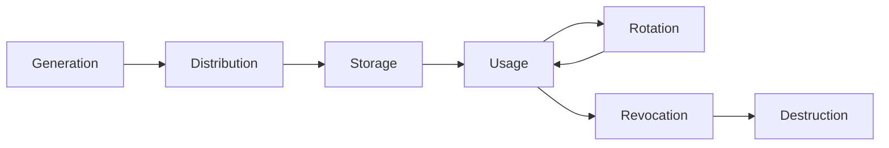
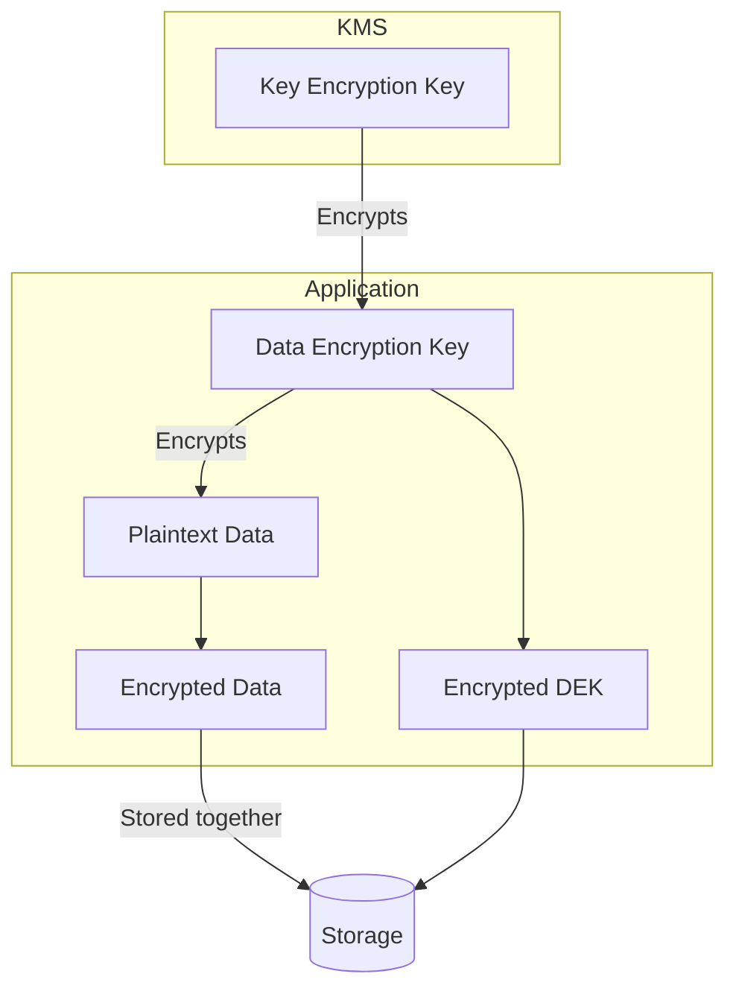
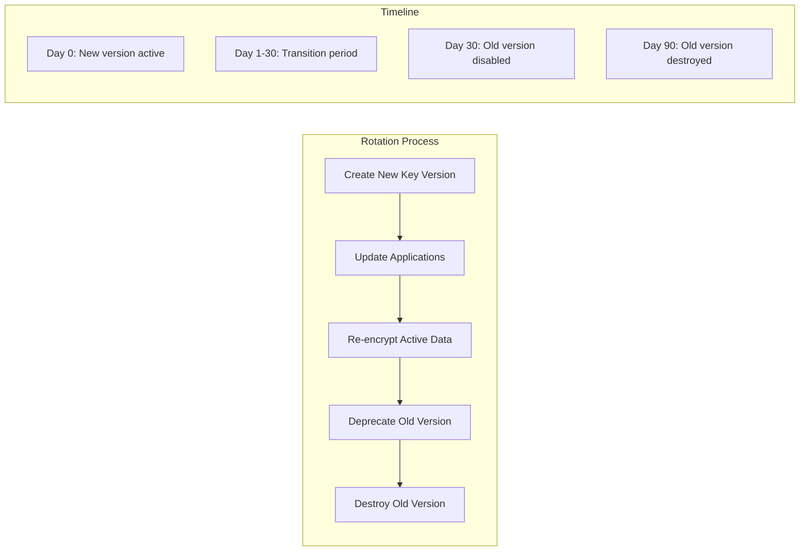

# How to Build Key Management Practices

Author: [nawazdhandala](https://github.com/nawazdhandala)

Tags: Security, Key Management, Encryption, KMS

Description: A practical guide to managing cryptographic keys across their lifecycle, from generation through rotation and revocation, with integration examples for AWS KMS and HashiCorp Vault.

---

Cryptographic keys protect everything from database credentials to API tokens and customer data. Yet most teams treat key management as an afterthought until an audit or breach forces the conversation. This guide covers the full key lifecycle and shows how to integrate with production-grade systems like AWS KMS and HashiCorp Vault.

---

## The Key Lifecycle

Every cryptographic key moves through distinct phases. Understanding this lifecycle helps you build policies that match each stage.



Each phase introduces specific risks:

- **Generation**: Weak entropy or predictable seeds produce keys that attackers can guess.
- **Distribution**: Transmitting keys in plaintext exposes them to interception.
- **Storage**: Keys sitting unencrypted on disk or in version control are trivial to steal.
- **Usage**: Improper access controls let unauthorized services decrypt sensitive data.
- **Rotation**: Stale keys accumulate risk over time; regular rotation limits blast radius.
- **Revocation**: Compromised keys must be invalidated immediately.
- **Destruction**: Retired keys should be wiped so they cannot resurface later.

---

## Key Generation Best Practices

Strong keys start with strong randomness. Never roll your own random number generator. Use operating system facilities or hardware security modules (HSMs).

### Generating Keys with OpenSSL

```bash
# Generate a 256-bit AES key using system entropy
openssl rand -base64 32 > aes-key.txt

# Generate an RSA 4096-bit key pair
openssl genrsa -out private.pem 4096
openssl rsa -in private.pem -pubout -out public.pem
```

### Key Generation with AWS KMS

AWS KMS generates keys inside FIPS 140-2 validated HSMs. You never see the raw key material for customer master keys (CMKs).

```bash
# Create a symmetric CMK for envelope encryption
aws kms create-key \
  --description "Application encryption key" \
  --key-usage ENCRYPT_DECRYPT \
  --origin AWS_KMS

# Create an asymmetric key for signing
aws kms create-key \
  --description "Code signing key" \
  --key-usage SIGN_VERIFY \
  --key-spec RSA_4096
```

### Key Generation with HashiCorp Vault

Vault's transit secrets engine generates and manages keys without exposing plaintext.

```bash
# Enable the transit engine
vault secrets enable transit

# Create a new encryption key
vault write -f transit/keys/payments-key

# Create a key with explicit type
vault write transit/keys/signing-key type=rsa-4096
```

---

## Envelope Encryption

Envelope encryption separates key management from data encryption. You encrypt data with a data encryption key (DEK), then encrypt the DEK with a key encryption key (KEK) stored in your KMS.



Benefits of envelope encryption:

- **Performance**: Encrypt large datasets with fast symmetric keys while keeping the master key secure.
- **Rotation simplicity**: Rotate the KEK without re-encrypting all data. Just re-encrypt the DEKs.
- **Reduced KMS calls**: Generate DEKs locally; only call KMS to wrap/unwrap them.

### Envelope Encryption with AWS KMS

```python
import boto3
import base64
from cryptography.fernet import Fernet

kms = boto3.client('kms')
KEY_ID = 'alias/application-key'

def encrypt_data(plaintext: bytes) -> dict:
    # Generate a data key from KMS
    response = kms.generate_data_key(
        KeyId=KEY_ID,
        KeySpec='AES_256'
    )

    # Use the plaintext key to encrypt data locally
    plaintext_key = response['Plaintext']
    encrypted_key = response['CiphertextBlob']

    # Fernet requires base64 encoded 32-byte key
    fernet_key = base64.urlsafe_b64encode(plaintext_key)
    fernet = Fernet(fernet_key)
    encrypted_data = fernet.encrypt(plaintext)

    return {
        'encrypted_key': base64.b64encode(encrypted_key).decode(),
        'encrypted_data': base64.b64encode(encrypted_data).decode()
    }

def decrypt_data(encrypted_key: str, encrypted_data: str) -> bytes:
    # Decrypt the data key using KMS
    response = kms.decrypt(
        CiphertextBlob=base64.b64decode(encrypted_key)
    )

    plaintext_key = response['Plaintext']
    fernet_key = base64.urlsafe_b64encode(plaintext_key)
    fernet = Fernet(fernet_key)

    return fernet.decrypt(base64.b64decode(encrypted_data))
```

### Envelope Encryption with HashiCorp Vault

Vault handles envelope encryption through its transit engine with the `datakey` endpoint.

```bash
# Generate a wrapped data key
vault write transit/datakey/wrapped/payments-key

# Response includes:
# - ciphertext: the encrypted DEK (store this)
# - plaintext: the DEK in base64 (use this to encrypt, then discard)

# Later, unwrap the DEK to decrypt data
vault write transit/decrypt/payments-key \
  ciphertext="vault:v1:..."
```

---

## Key Rotation Strategies

Regular rotation limits the exposure window if a key is compromised. Build rotation into your operational cadence.



### Automatic Rotation with AWS KMS

AWS KMS supports automatic annual rotation for symmetric CMKs.

```bash
# Enable automatic rotation (rotates every 365 days)
aws kms enable-key-rotation --key-id alias/application-key

# Check rotation status
aws kms get-key-rotation-status --key-id alias/application-key

# Manual rotation: create a new key and update the alias
aws kms create-key --description "Application key v2"
aws kms update-alias \
  --alias-name alias/application-key \
  --target-key-id <new-key-id>
```

For asymmetric keys or faster rotation schedules, use alias swapping:

```bash
# Create versioned keys
aws kms create-key --description "signing-key-2026-01"

# Point alias to current version
aws kms create-alias \
  --alias-name alias/signing-key-current \
  --target-key-id <key-id>

# During rotation, update the alias
aws kms update-alias \
  --alias-name alias/signing-key-current \
  --target-key-id <new-key-id>
```

### Automatic Rotation with HashiCorp Vault

Vault supports in-place key rotation that preserves the ability to decrypt old data.

```bash
# Rotate the key (creates a new version)
vault write -f transit/keys/payments-key/rotate

# Check key versions
vault read transit/keys/payments-key

# Set minimum decryption version (old versions cannot decrypt)
vault write transit/keys/payments-key \
  min_decryption_version=5

# Set minimum encryption version (forces use of latest)
vault write transit/keys/payments-key \
  min_encryption_version=10

# Configure automatic rotation
vault write transit/keys/payments-key \
  auto_rotate_period=720h  # 30 days
```

---

## Key Revocation and Destruction

When keys are compromised or retired, act fast.

### Revocation Checklist

1. **Identify affected systems**: Which services use this key? What data did it protect?
2. **Disable the key**: Prevent new encryption/decryption operations.
3. **Rotate dependent secrets**: API keys, tokens, and passwords encrypted with the compromised key need regeneration.
4. **Re-encrypt data**: If possible, decrypt with the old key and re-encrypt with a new one.
5. **Audit access logs**: Determine if the key was used maliciously.

### Disabling Keys in AWS KMS

```bash
# Disable the key (reversible)
aws kms disable-key --key-id alias/compromised-key

# Schedule deletion (7-30 day waiting period)
aws kms schedule-key-deletion \
  --key-id alias/compromised-key \
  --pending-window-in-days 7

# Cancel deletion if needed
aws kms cancel-key-deletion --key-id <key-id>
```

### Destroying Keys in HashiCorp Vault

```bash
# Delete specific key versions
vault write transit/keys/payments-key/config \
  deletion_allowed=true

vault delete transit/keys/payments-key

# Or disable the key without deletion
vault write transit/keys/payments-key/config \
  exportable=false \
  allow_plaintext_backup=false
```

---

## Access Control and Auditing

Limit who and what can use each key. Follow least privilege principles.

### AWS KMS Key Policies

```json
{
  "Version": "2012-10-17",
  "Statement": [
    {
      "Sid": "AllowAdminAccess",
      "Effect": "Allow",
      "Principal": {"AWS": "arn:aws:iam::123456789012:role/KeyAdmin"},
      "Action": [
        "kms:Create*",
        "kms:Describe*",
        "kms:Enable*",
        "kms:List*",
        "kms:Put*",
        "kms:Update*",
        "kms:Revoke*",
        "kms:Disable*",
        "kms:Get*",
        "kms:Delete*",
        "kms:ScheduleKeyDeletion",
        "kms:CancelKeyDeletion"
      ],
      "Resource": "*"
    },
    {
      "Sid": "AllowServiceEncryption",
      "Effect": "Allow",
      "Principal": {"AWS": "arn:aws:iam::123456789012:role/PaymentsService"},
      "Action": [
        "kms:Encrypt",
        "kms:Decrypt",
        "kms:GenerateDataKey"
      ],
      "Resource": "*",
      "Condition": {
        "StringEquals": {
          "kms:EncryptionContext:service": "payments"
        }
      }
    }
  ]
}
```

### Vault ACL Policies

```hcl
# payments-service-policy.hcl
path "transit/encrypt/payments-key" {
  capabilities = ["update"]
}

path "transit/decrypt/payments-key" {
  capabilities = ["update"]
}

path "transit/datakey/wrapped/payments-key" {
  capabilities = ["update"]
}

# Deny key management operations
path "transit/keys/payments-key/rotate" {
  capabilities = ["deny"]
}
```

Apply the policy:

```bash
vault policy write payments-service payments-service-policy.hcl
vault write auth/kubernetes/role/payments-service \
  bound_service_account_names=payments-api \
  bound_service_account_namespaces=prod \
  policies=payments-service
```

---

## Monitoring and Alerting

Track key usage to detect anomalies and satisfy audit requirements.

### AWS CloudTrail for KMS

```bash
# Query recent KMS operations
aws cloudtrail lookup-events \
  --lookup-attributes AttributeKey=EventSource,AttributeValue=kms.amazonaws.com \
  --start-time 2026-01-29T00:00:00Z \
  --end-time 2026-01-30T00:00:00Z
```

Create CloudWatch alarms for suspicious activity:

```bash
# Alert on key deletion attempts
aws cloudwatch put-metric-alarm \
  --alarm-name kms-deletion-attempts \
  --metric-name ScheduleKeyDeletion \
  --namespace AWS/KMS \
  --statistic Sum \
  --period 300 \
  --threshold 1 \
  --comparison-operator GreaterThanOrEqualToThreshold \
  --evaluation-periods 1 \
  --alarm-actions arn:aws:sns:us-east-1:123456789012:security-alerts
```

### Vault Audit Logging

```bash
# Enable file audit device
vault audit enable file file_path=/var/log/vault/audit.log

# Enable syslog audit device for centralized logging
vault audit enable syslog tag="vault" facility="AUTH"
```

Sample audit log entry:

```json
{
  "time": "2026-01-30T10:15:30Z",
  "type": "request",
  "auth": {
    "client_token": "hmac-sha256:...",
    "accessor": "hmac-sha256:...",
    "policies": ["payments-service"]
  },
  "request": {
    "operation": "update",
    "path": "transit/decrypt/payments-key"
  }
}
```

---

## Implementation Checklist

Before going to production, verify each item:

- [ ] Keys are generated using HSMs or system-provided entropy
- [ ] Envelope encryption separates data keys from master keys
- [ ] Automatic rotation is enabled with a defined schedule
- [ ] Key policies follow least privilege principles
- [ ] Audit logging captures all key operations
- [ ] Revocation procedures are documented and tested
- [ ] Backup and recovery processes exist for key material
- [ ] Monitoring alerts on unusual key access patterns

---

## Common Mistakes to Avoid

**Storing keys in source control.** Use secret managers and inject keys at runtime.

**Sharing keys across environments.** Production, staging, and development should have separate key hierarchies.

**Skipping rotation because nothing is broken.** Rotation limits damage from undetected compromises.

**Over-permissioning key access.** Grant encrypt/decrypt to services, not humans. Humans get audit access.

**Ignoring key dependencies.** Document which services use which keys. Surprise revocations break production.

---

Good key management is not a one-time project. It is an ongoing discipline that requires automation, monitoring, and regular review. Start with a single service, get the lifecycle right, then expand the pattern across your infrastructure. The payoff is confidence that your secrets stay secret, even when things go wrong.
