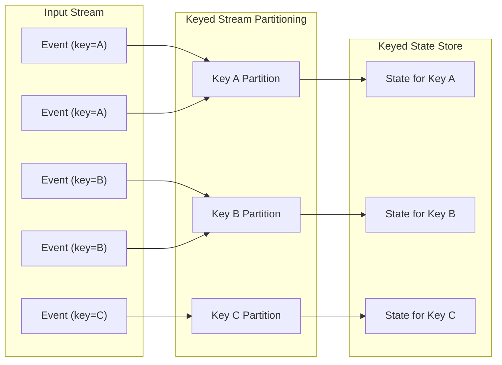
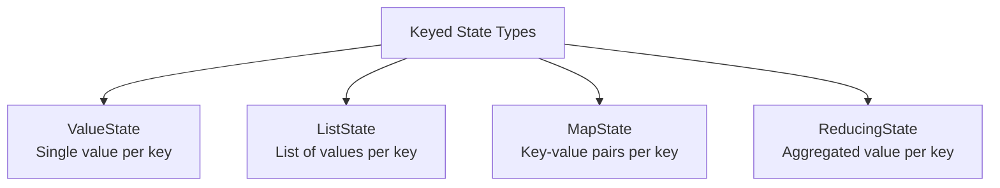
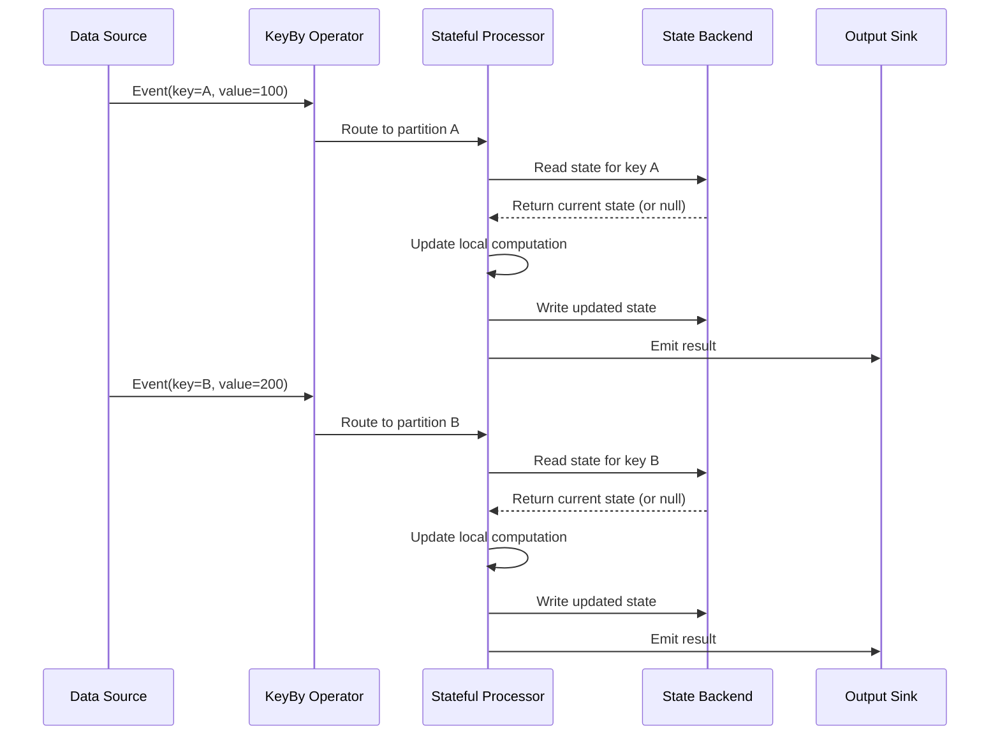
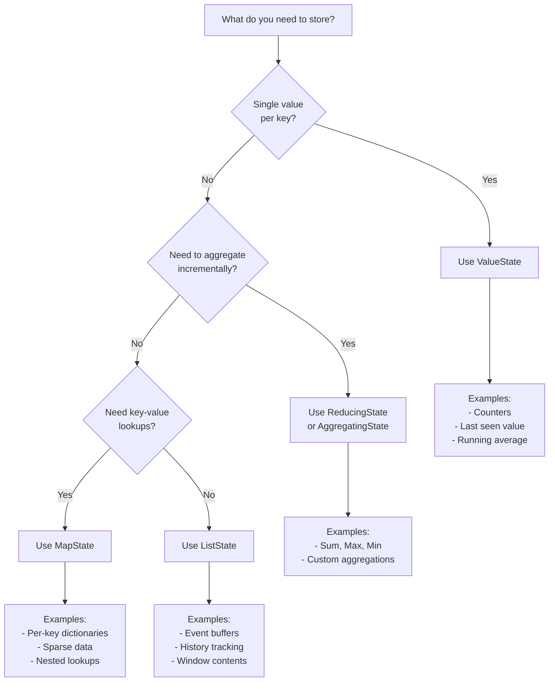

# How to Create Keyed State

Author: [nawazdhandala](https://github.com/nawazdhandala)

Tags: Stream Processing, State Management, Apache Flink, Backend

Description: Learn how to implement keyed state for per-key stateful processing in streams.

---

## Introduction

Keyed state is a fundamental concept in stream processing that allows you to maintain and access state on a per-key basis. When processing unbounded streams of data, you often need to remember information about previous events to make decisions about current ones. Keyed state makes this possible by partitioning state according to the keys defined in your data stream.

In this guide, we will explore how to create and use keyed state in Apache Flink, covering the four main types of keyed state: ValueState, ListState, MapState, and ReducingState.

## Understanding Keyed State

Before diving into code, let us understand how keyed state works conceptually.



When you key a stream by a specific field, Flink ensures that all events with the same key are processed by the same parallel instance and have access to the same state partition.

## Types of Keyed State

Flink provides four built-in types of keyed state, each suited for different use cases:



Let us explore each type with practical examples.

## ValueState: Storing a Single Value

ValueState is the simplest form of keyed state. It stores a single value per key and is ideal for scenarios like tracking the last event, counting occurrences, or maintaining a running average.

### Example: Counting Events Per User

```java
import org.apache.flink.api.common.functions.RichFlatMapFunction;
import org.apache.flink.api.common.state.ValueState;
import org.apache.flink.api.common.state.ValueStateDescriptor;
import org.apache.flink.api.common.typeinfo.Types;
import org.apache.flink.configuration.Configuration;
import org.apache.flink.util.Collector;

/**
 * A stateful function that counts events per user using ValueState.
 * Each user (key) maintains their own independent counter.
 */
public class UserEventCounter extends RichFlatMapFunction<UserEvent, UserEventCount> {

    // Declare the state handle - this will hold a Long value for each key
    private transient ValueState<Long> countState;

    @Override
    public void open(Configuration parameters) throws Exception {
        // Initialize the state descriptor with a name and type information
        // The name "user-event-count" uniquely identifies this state
        ValueStateDescriptor<Long> descriptor = new ValueStateDescriptor<>(
            "user-event-count",  // State name for identification
            Types.LONG           // Type of the state value
        );

        // Obtain the state handle from the runtime context
        // This connects our variable to Flink's state backend
        countState = getRuntimeContext().getState(descriptor);
    }

    @Override
    public void flatMap(UserEvent event, Collector<UserEventCount> out) throws Exception {
        // Retrieve the current count for this user (key)
        // Returns null if no state exists yet for this key
        Long currentCount = countState.value();

        // Initialize to 0 if this is the first event for this user
        if (currentCount == null) {
            currentCount = 0L;
        }

        // Increment the counter
        long newCount = currentCount + 1;

        // Update the state with the new count
        // This persists the value for future events with the same key
        countState.update(newCount);

        // Emit the result
        out.collect(new UserEventCount(event.getUserId(), newCount));
    }
}
```

### Using ValueState in Your Pipeline

```java
// Create the execution environment
StreamExecutionEnvironment env = StreamExecutionEnvironment.getExecutionEnvironment();

// Read the input stream
DataStream<UserEvent> events = env.addSource(new UserEventSource());

// Key the stream by user ID and apply the stateful function
DataStream<UserEventCount> counts = events
    .keyBy(UserEvent::getUserId)  // Partition by user ID
    .flatMap(new UserEventCounter());  // Apply stateful processing

// Output the results
counts.addSink(new ResultSink());

// Execute the job
env.execute("User Event Counter");
```

## ListState: Storing Multiple Values

ListState allows you to store a list of values per key. This is useful when you need to buffer events, maintain a history, or collect related items before processing them together.

### Example: Buffering Events for Batch Processing

```java
import org.apache.flink.api.common.state.ListState;
import org.apache.flink.api.common.state.ListStateDescriptor;
import org.apache.flink.api.common.typeinfo.Types;
import org.apache.flink.streaming.api.functions.KeyedProcessFunction;
import org.apache.flink.util.Collector;

import java.util.ArrayList;
import java.util.List;

/**
 * Buffers events per session and emits them as a batch when
 * a threshold is reached or a timeout occurs.
 */
public class SessionEventBuffer
    extends KeyedProcessFunction<String, SessionEvent, List<SessionEvent>> {

    // ListState to buffer events for each session
    private transient ListState<SessionEvent> bufferedEvents;

    // Configuration constants
    private static final int BATCH_SIZE = 10;
    private static final long TIMEOUT_MS = 60000; // 1 minute

    @Override
    public void open(Configuration parameters) throws Exception {
        // Create a descriptor for the list state
        // Each key (session) will have its own independent list
        ListStateDescriptor<SessionEvent> descriptor = new ListStateDescriptor<>(
            "session-event-buffer",  // Unique name for this state
            SessionEvent.class       // Type of elements in the list
        );

        bufferedEvents = getRuntimeContext().getListState(descriptor);
    }

    @Override
    public void processElement(
            SessionEvent event,
            Context ctx,
            Collector<List<SessionEvent>> out) throws Exception {

        // Add the incoming event to the buffer
        // Each session (key) has its own separate buffer
        bufferedEvents.add(event);

        // Count current buffered events
        int count = 0;
        for (SessionEvent e : bufferedEvents.get()) {
            count++;
        }

        // Check if we have reached the batch size threshold
        if (count >= BATCH_SIZE) {
            // Emit all buffered events as a batch
            emitBatch(out);
        } else if (count == 1) {
            // First event in buffer - register a timer for timeout
            // This ensures we emit even if batch size is never reached
            long timerTime = ctx.timerService().currentProcessingTime() + TIMEOUT_MS;
            ctx.timerService().registerProcessingTimeTimer(timerTime);
        }
    }

    @Override
    public void onTimer(
            long timestamp,
            OnTimerContext ctx,
            Collector<List<SessionEvent>> out) throws Exception {
        // Timer fired - emit whatever we have buffered
        emitBatch(out);
    }

    /**
     * Helper method to emit all buffered events and clear the state.
     */
    private void emitBatch(Collector<List<SessionEvent>> out) throws Exception {
        // Collect all events from the state into a list
        List<SessionEvent> batch = new ArrayList<>();
        for (SessionEvent event : bufferedEvents.get()) {
            batch.add(event);
        }

        // Only emit if there are events to send
        if (!batch.isEmpty()) {
            out.collect(batch);

            // Clear the buffer after emitting
            // This removes all elements from the list state for this key
            bufferedEvents.clear();
        }
    }
}
```

## MapState: Storing Key-Value Pairs

MapState allows you to store a map of key-value pairs within each keyed state partition. This is powerful when you need to maintain structured data with efficient lookups per key.

### Example: Tracking Product Views Per User

```java
import org.apache.flink.api.common.state.MapState;
import org.apache.flink.api.common.state.MapStateDescriptor;
import org.apache.flink.api.common.typeinfo.Types;
import org.apache.flink.streaming.api.functions.KeyedProcessFunction;
import org.apache.flink.util.Collector;

/**
 * Tracks how many times each user has viewed each product.
 * Uses MapState to efficiently store and update view counts per product.
 */
public class ProductViewTracker
    extends KeyedProcessFunction<String, ProductViewEvent, UserProductStats> {

    // MapState where:
    // - Outer key (from keyBy): User ID
    // - Map key: Product ID
    // - Map value: View count
    private transient MapState<String, Long> productViewCounts;

    @Override
    public void open(Configuration parameters) throws Exception {
        // Create descriptor specifying types for map keys and values
        MapStateDescriptor<String, Long> descriptor = new MapStateDescriptor<>(
            "product-view-counts",  // State name
            Types.STRING,           // Type of map keys (product ID)
            Types.LONG              // Type of map values (view count)
        );

        productViewCounts = getRuntimeContext().getMapState(descriptor);
    }

    @Override
    public void processElement(
            ProductViewEvent event,
            Context ctx,
            Collector<UserProductStats> out) throws Exception {

        String productId = event.getProductId();

        // Get current view count for this product (null if not viewed before)
        Long currentCount = productViewCounts.get(productId);

        // Initialize or increment the count
        long newCount = (currentCount == null) ? 1L : currentCount + 1;

        // Update the map state with the new count
        // This only affects the entry for this specific product
        productViewCounts.put(productId, newCount);

        // Calculate total views across all products for this user
        long totalViews = 0;
        int uniqueProducts = 0;

        // Iterate over all entries in the map state
        for (Map.Entry<String, Long> entry : productViewCounts.entries()) {
            totalViews += entry.getValue();
            uniqueProducts++;
        }

        // Emit statistics for this user
        out.collect(new UserProductStats(
            event.getUserId(),
            productId,
            newCount,
            uniqueProducts,
            totalViews
        ));
    }

    /**
     * Example: Check if a user has viewed a specific product.
     */
    public boolean hasViewedProduct(String productId) throws Exception {
        // contains() efficiently checks for key existence
        return productViewCounts.contains(productId);
    }

    /**
     * Example: Remove a product from tracking.
     */
    public void removeProduct(String productId) throws Exception {
        // remove() deletes a specific entry from the map
        productViewCounts.remove(productId);
    }
}
```

## ReducingState: Aggregating Values Incrementally

ReducingState automatically aggregates values using a provided reduce function. This is efficient because it maintains only the aggregated result rather than storing all individual values.

### Example: Computing Running Maximum

```java
import org.apache.flink.api.common.functions.ReduceFunction;
import org.apache.flink.api.common.state.ReducingState;
import org.apache.flink.api.common.state.ReducingStateDescriptor;
import org.apache.flink.api.common.typeinfo.Types;
import org.apache.flink.streaming.api.functions.KeyedProcessFunction;
import org.apache.flink.util.Collector;

/**
 * Tracks the maximum sensor reading for each sensor.
 * Uses ReducingState for efficient incremental aggregation.
 */
public class MaxSensorReading
    extends KeyedProcessFunction<String, SensorReading, SensorMax> {

    // ReducingState that automatically computes the maximum
    private transient ReducingState<Double> maxReading;

    @Override
    public void open(Configuration parameters) throws Exception {
        // Define the reduce function that computes maximum
        // This function is called each time a new value is added
        ReduceFunction<Double> maxFunction = (value1, value2) -> Math.max(value1, value2);

        // Create the reducing state descriptor
        ReducingStateDescriptor<Double> descriptor = new ReducingStateDescriptor<>(
            "max-sensor-reading",  // State name
            maxFunction,           // Reduce function to apply
            Types.DOUBLE           // Type of values
        );

        maxReading = getRuntimeContext().getReducingState(descriptor);
    }

    @Override
    public void processElement(
            SensorReading reading,
            Context ctx,
            Collector<SensorMax> out) throws Exception {

        // Add the new reading to the reducing state
        // Flink automatically applies the reduce function
        // If state is empty: stores the value directly
        // If state has a value: computes max(existing, new)
        maxReading.add(reading.getValue());

        // Get the current maximum (result of all reductions)
        Double currentMax = maxReading.get();

        // Emit the current maximum for this sensor
        out.collect(new SensorMax(
            reading.getSensorId(),
            currentMax,
            reading.getTimestamp()
        ));
    }
}
```

### Example: Computing Running Sum with ReducingState

```java
/**
 * Computes the running sum of transaction amounts per account.
 */
public class TransactionSumCalculator
    extends KeyedProcessFunction<String, Transaction, AccountBalance> {

    private transient ReducingState<Double> runningSum;

    @Override
    public void open(Configuration parameters) throws Exception {
        // Define a reduce function that sums values
        ReduceFunction<Double> sumFunction = (a, b) -> a + b;

        ReducingStateDescriptor<Double> descriptor = new ReducingStateDescriptor<>(
            "transaction-sum",
            sumFunction,
            Types.DOUBLE
        );

        runningSum = getRuntimeContext().getReducingState(descriptor);
    }

    @Override
    public void processElement(
            Transaction tx,
            Context ctx,
            Collector<AccountBalance> out) throws Exception {

        // Add transaction amount to the running sum
        // For deposits: positive amount
        // For withdrawals: negative amount
        runningSum.add(tx.getAmount());

        // Emit updated balance
        out.collect(new AccountBalance(
            tx.getAccountId(),
            runningSum.get()
        ));
    }
}
```

## State Time-To-Live (TTL)

In long-running applications, state can grow unbounded. Flink provides State TTL to automatically expire old state entries.

```java
import org.apache.flink.api.common.state.StateTtlConfig;
import org.apache.flink.api.common.time.Time;

/**
 * Example showing how to configure State TTL for automatic cleanup.
 */
public class StateTtlExample extends KeyedProcessFunction<String, Event, Result> {

    private transient ValueState<Data> stateWithTtl;

    @Override
    public void open(Configuration parameters) throws Exception {
        // Configure TTL settings
        StateTtlConfig ttlConfig = StateTtlConfig
            .newBuilder(Time.hours(24))  // State expires after 24 hours
            .setUpdateType(StateTtlConfig.UpdateType.OnCreateAndWrite)  // Reset TTL on writes
            .setStateVisibility(
                StateTtlConfig.StateVisibility.NeverReturnExpired)  // Never return expired state
            .cleanupFullSnapshot()  // Clean expired state during checkpoints
            .build();

        // Create descriptor and enable TTL
        ValueStateDescriptor<Data> descriptor = new ValueStateDescriptor<>(
            "data-with-ttl",
            Data.class
        );
        descriptor.enableTimeToLive(ttlConfig);  // Apply TTL configuration

        stateWithTtl = getRuntimeContext().getState(descriptor);
    }

    // ... rest of the implementation
}
```

## State Lifecycle Visualization

Here is how state flows through a keyed stream processing application:



## Choosing the Right State Type

Use this decision guide to select the appropriate state type:



## Best Practices

1. **Choose the right state type**: Use ValueState for simple values, ListState for collections, MapState for dictionaries, and ReducingState for aggregations.

2. **Configure State TTL**: Always set up TTL for state that can grow unbounded to prevent memory issues.

3. **Use descriptive state names**: State names are used for state recovery and migration. Choose clear, unique names.

4. **Initialize state lazily**: State handles should be initialized in the `open()` method, not in the constructor.

5. **Handle null values**: ValueState returns null when no state exists. Always check for null before using the value.

6. **Clear state when done**: Call `clear()` on state when it is no longer needed to free up resources.

7. **Consider state size**: Large state objects impact checkpoint performance. Use incremental checkpointing for large states.

## Complete Example: Fraud Detection

Here is a comprehensive example combining multiple state types for a fraud detection use case:

```java
import org.apache.flink.api.common.state.*;
import org.apache.flink.streaming.api.functions.KeyedProcessFunction;
import org.apache.flink.util.Collector;

/**
 * Detects potentially fraudulent transactions using multiple state types.
 *
 * Detection rules:
 * 1. More than 3 transactions in 1 minute (using ListState for recent transactions)
 * 2. Transaction amount exceeds 2x the user's average (using ReducingState for sum)
 * 3. Transaction from a new location (using MapState for known locations)
 */
public class FraudDetector
    extends KeyedProcessFunction<String, Transaction, FraudAlert> {

    // Track recent transactions for frequency analysis
    private transient ListState<Transaction> recentTransactions;

    // Track transaction count and sum for average calculation
    private transient ValueState<Long> transactionCount;
    private transient ReducingState<Double> transactionSum;

    // Track known locations for the user
    private transient MapState<String, Long> knownLocations;

    // Configuration
    private static final long TIME_WINDOW_MS = 60000;  // 1 minute
    private static final int MAX_TRANSACTIONS_PER_WINDOW = 3;
    private static final double AMOUNT_THRESHOLD_MULTIPLIER = 2.0;

    @Override
    public void open(Configuration parameters) throws Exception {
        // Initialize ListState for recent transactions
        ListStateDescriptor<Transaction> recentTxDescriptor =
            new ListStateDescriptor<>("recent-transactions", Transaction.class);
        recentTransactions = getRuntimeContext().getListState(recentTxDescriptor);

        // Initialize ValueState for transaction count
        ValueStateDescriptor<Long> countDescriptor =
            new ValueStateDescriptor<>("tx-count", Types.LONG);
        transactionCount = getRuntimeContext().getState(countDescriptor);

        // Initialize ReducingState for transaction sum
        ReducingStateDescriptor<Double> sumDescriptor = new ReducingStateDescriptor<>(
            "tx-sum",
            (a, b) -> a + b,
            Types.DOUBLE
        );
        transactionSum = getRuntimeContext().getReducingState(sumDescriptor);

        // Initialize MapState for known locations with TTL
        StateTtlConfig ttlConfig = StateTtlConfig
            .newBuilder(Time.days(90))
            .setUpdateType(StateTtlConfig.UpdateType.OnCreateAndWrite)
            .build();

        MapStateDescriptor<String, Long> locationDescriptor =
            new MapStateDescriptor<>("known-locations", Types.STRING, Types.LONG);
        locationDescriptor.enableTimeToLive(ttlConfig);
        knownLocations = getRuntimeContext().getMapState(locationDescriptor);
    }

    @Override
    public void processElement(
            Transaction tx,
            Context ctx,
            Collector<FraudAlert> out) throws Exception {

        List<String> alertReasons = new ArrayList<>();

        // Rule 1: Check transaction frequency
        if (checkFrequency(tx, ctx)) {
            alertReasons.add("High transaction frequency detected");
        }

        // Rule 2: Check if amount is unusually high
        if (checkAmount(tx)) {
            alertReasons.add("Transaction amount exceeds normal pattern");
        }

        // Rule 3: Check for new location
        if (checkLocation(tx)) {
            alertReasons.add("Transaction from unknown location");
        }

        // Emit alert if any rules triggered
        if (!alertReasons.isEmpty()) {
            out.collect(new FraudAlert(
                tx.getUserId(),
                tx.getTransactionId(),
                alertReasons,
                tx.getTimestamp()
            ));
        }

        // Update states for future checks
        updateStates(tx, ctx);
    }

    private boolean checkFrequency(Transaction tx, Context ctx) throws Exception {
        long currentTime = ctx.timerService().currentProcessingTime();
        int recentCount = 0;

        // Count transactions within the time window
        for (Transaction recent : recentTransactions.get()) {
            if (currentTime - recent.getTimestamp() < TIME_WINDOW_MS) {
                recentCount++;
            }
        }

        return recentCount >= MAX_TRANSACTIONS_PER_WINDOW;
    }

    private boolean checkAmount(Transaction tx) throws Exception {
        Long count = transactionCount.value();
        Double sum = transactionSum.get();

        // Need at least 5 transactions to establish a baseline
        if (count == null || count < 5) {
            return false;
        }

        double average = sum / count;
        return tx.getAmount() > (average * AMOUNT_THRESHOLD_MULTIPLIER);
    }

    private boolean checkLocation(Transaction tx) throws Exception {
        // Check if this location is new for the user
        return !knownLocations.contains(tx.getLocation());
    }

    private void updateStates(Transaction tx, Context ctx) throws Exception {
        // Update recent transactions
        recentTransactions.add(tx);

        // Update count and sum
        Long count = transactionCount.value();
        transactionCount.update(count == null ? 1L : count + 1);
        transactionSum.add(tx.getAmount());

        // Update known locations
        knownLocations.put(tx.getLocation(), tx.getTimestamp());

        // Register timer to clean up old transactions
        long cleanupTime = ctx.timerService().currentProcessingTime() + TIME_WINDOW_MS;
        ctx.timerService().registerProcessingTimeTimer(cleanupTime);
    }

    @Override
    public void onTimer(long timestamp, OnTimerContext ctx, Collector<FraudAlert> out)
            throws Exception {
        // Clean up old transactions from the list
        List<Transaction> validTransactions = new ArrayList<>();
        long currentTime = ctx.timerService().currentProcessingTime();

        for (Transaction tx : recentTransactions.get()) {
            if (currentTime - tx.getTimestamp() < TIME_WINDOW_MS) {
                validTransactions.add(tx);
            }
        }

        // Update list state with only valid transactions
        recentTransactions.update(validTransactions);
    }
}
```

## Conclusion

Keyed state is essential for building stateful stream processing applications. By understanding and properly using ValueState, ListState, MapState, and ReducingState, you can implement sophisticated streaming logic that maintains per-key context across events.

Key takeaways:

- **ValueState** is perfect for simple per-key values like counters or flags
- **ListState** works well for buffering events or maintaining history
- **MapState** provides efficient key-value storage within each partition
- **ReducingState** enables efficient incremental aggregations

Always remember to configure appropriate TTL settings, handle null values gracefully, and choose the right state type for your use case. With these tools, you can build robust, scalable stream processing applications that handle complex stateful logic efficiently.
