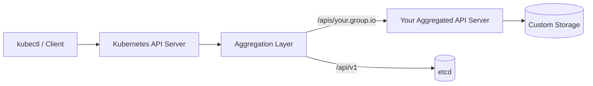
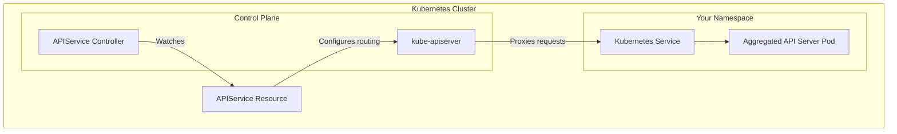
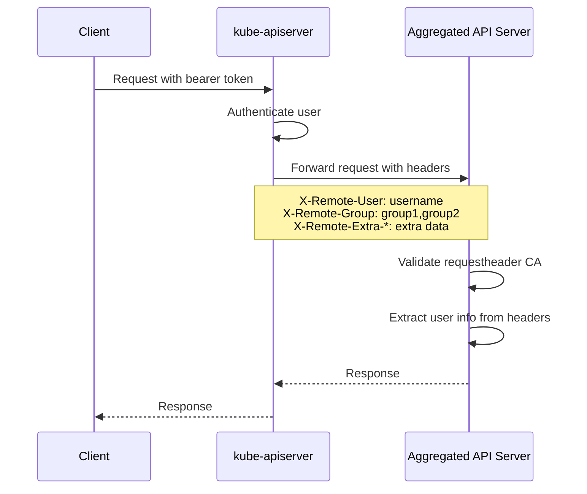
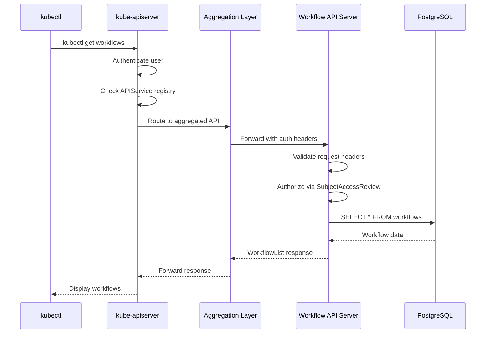

# How to Create Kubernetes Aggregated API Servers

Author: [nawazdhandala](https://github.com/nawazdhandala)

Tags: Kubernetes, API Aggregation, API Server, Extensions

Description: Learn to implement aggregated API servers for extending Kubernetes with custom API groups and advanced resource management.

---

Kubernetes is designed to be extensible. While Custom Resource Definitions (CRDs) provide a straightforward way to add custom resources, there are scenarios where you need more control over storage, validation, or subresources. This is where Aggregated API Servers come into play.

In this guide, we will walk through the complete process of building an aggregated API server from scratch, covering architecture, implementation, authentication, and storage backends.

## What Are Aggregated API Servers?

Aggregated API servers allow you to extend the Kubernetes API by running your own API server alongside the main Kubernetes API server. The main API server acts as a proxy, forwarding requests to your custom API server based on the API group being requested.



## When to Use Aggregated APIs vs CRDs

| Feature | CRDs | Aggregated APIs |
|---------|------|-----------------|
| Setup Complexity | Simple | Complex |
| Custom Storage Backend | No | Yes |
| Custom Validation Logic | Limited (webhooks) | Full control |
| Subresources | Limited | Full control |
| Protocol Conversion | No | Yes |
| Multiple API Versions | Basic | Advanced |

Choose aggregated APIs when you need:
- Custom storage backends (databases other than etcd)
- Complex validation that cannot be expressed in OpenAPI schemas
- Protocol translation (e.g., wrapping external APIs)
- Advanced subresource handling

## Architecture Overview



## Step 1: Define Your API Types

First, create the Go types that represent your custom resources. We will build a simple "Workflow" resource as an example.

```go
// pkg/apis/workflow/v1alpha1/types.go
package v1alpha1

import (
    metav1 "k8s.io/apimachinery/pkg/apis/meta/v1"
)

// +genclient
// +k8s:deepcopy-gen:interfaces=k8s.io/apimachinery/pkg/runtime.Object

// Workflow represents a workflow definition
type Workflow struct {
    metav1.TypeMeta   `json:",inline"`
    metav1.ObjectMeta `json:"metadata,omitempty"`

    Spec   WorkflowSpec   `json:"spec,omitempty"`
    Status WorkflowStatus `json:"status,omitempty"`
}

// WorkflowSpec defines the desired state of a Workflow
type WorkflowSpec struct {
    // Steps defines the workflow steps
    Steps []WorkflowStep `json:"steps,omitempty"`

    // Schedule defines an optional cron schedule
    Schedule string `json:"schedule,omitempty"`

    // Timeout defines the maximum execution time
    Timeout metav1.Duration `json:"timeout,omitempty"`
}

// WorkflowStep defines a single step in the workflow
type WorkflowStep struct {
    Name    string            `json:"name"`
    Image   string            `json:"image"`
    Command []string          `json:"command,omitempty"`
    Args    []string          `json:"args,omitempty"`
    Env     map[string]string `json:"env,omitempty"`
}

// WorkflowStatus defines the observed state of a Workflow
type WorkflowStatus struct {
    Phase          WorkflowPhase `json:"phase,omitempty"`
    StartTime      *metav1.Time  `json:"startTime,omitempty"`
    CompletionTime *metav1.Time  `json:"completionTime,omitempty"`
    Message        string        `json:"message,omitempty"`
}

// WorkflowPhase represents the current phase of the workflow
type WorkflowPhase string

const (
    WorkflowPhasePending   WorkflowPhase = "Pending"
    WorkflowPhaseRunning   WorkflowPhase = "Running"
    WorkflowPhaseSucceeded WorkflowPhase = "Succeeded"
    WorkflowPhaseFailed    WorkflowPhase = "Failed"
)

// +k8s:deepcopy-gen:interfaces=k8s.io/apimachinery/pkg/runtime.Object

// WorkflowList is a list of Workflow resources
type WorkflowList struct {
    metav1.TypeMeta `json:",inline"`
    metav1.ListMeta `json:"metadata,omitempty"`
    Items           []Workflow `json:"items"`
}
```

## Step 2: Register Types with the Scheme

Create the scheme registration to make your types known to the API machinery.

```go
// pkg/apis/workflow/v1alpha1/register.go
package v1alpha1

import (
    metav1 "k8s.io/apimachinery/pkg/apis/meta/v1"
    "k8s.io/apimachinery/pkg/runtime"
    "k8s.io/apimachinery/pkg/runtime/schema"
)

// GroupName is the group name for this API
const GroupName = "workflow.example.com"

// SchemeGroupVersion is the group version used to register these objects
var SchemeGroupVersion = schema.GroupVersion{
    Group:   GroupName,
    Version: "v1alpha1",
}

// Resource takes an unqualified resource and returns a Group qualified GroupResource
func Resource(resource string) schema.GroupResource {
    return SchemeGroupVersion.WithResource(resource).GroupResource()
}

var (
    // SchemeBuilder initializes a scheme builder
    SchemeBuilder = runtime.NewSchemeBuilder(addKnownTypes)
    // AddToScheme is a global function that registers this API group & version
    AddToScheme = SchemeBuilder.AddToScheme
)

// addKnownTypes adds the list of known types to Scheme
func addKnownTypes(scheme *runtime.Scheme) error {
    scheme.AddKnownTypes(SchemeGroupVersion,
        &Workflow{},
        &WorkflowList{},
    )
    metav1.AddToGroupVersion(scheme, SchemeGroupVersion)
    return nil
}
```

## Step 3: Implement the Storage Backend

The storage layer handles persistence of your resources. Here is an example using an in-memory store, but you can implement any backend.

```go
// pkg/registry/workflow/storage.go
package workflow

import (
    "context"
    "fmt"
    "sync"

    "k8s.io/apimachinery/pkg/api/errors"
    metav1 "k8s.io/apimachinery/pkg/apis/meta/v1"
    "k8s.io/apimachinery/pkg/runtime"
    "k8s.io/apimachinery/pkg/watch"
    "k8s.io/apiserver/pkg/registry/rest"

    workflowv1alpha1 "example.com/workflow-server/pkg/apis/workflow/v1alpha1"
)

// WorkflowStorage implements the REST storage interface
type WorkflowStorage struct {
    mu        sync.RWMutex
    workflows map[string]*workflowv1alpha1.Workflow
    watchers  map[int64]chan watch.Event
    watcherID int64
}

// NewWorkflowStorage creates a new workflow storage instance
func NewWorkflowStorage() *WorkflowStorage {
    return &WorkflowStorage{
        workflows: make(map[string]*workflowv1alpha1.Workflow),
        watchers:  make(map[int64]chan watch.Event),
    }
}

// New returns a new instance of the resource
func (s *WorkflowStorage) New() runtime.Object {
    return &workflowv1alpha1.Workflow{}
}

// Destroy cleans up resources
func (s *WorkflowStorage) Destroy() {}

// NewList returns a new list instance
func (s *WorkflowStorage) NewList() runtime.Object {
    return &workflowv1alpha1.WorkflowList{}
}

// NamespaceScoped returns true if the resource is namespaced
func (s *WorkflowStorage) NamespaceScoped() bool {
    return true
}

// GetSingularName returns the singular name of the resource
func (s *WorkflowStorage) GetSingularName() string {
    return "workflow"
}

// key generates a unique key for a namespaced resource
func key(namespace, name string) string {
    return fmt.Sprintf("%s/%s", namespace, name)
}

// Get retrieves a workflow by namespace and name
func (s *WorkflowStorage) Get(
    ctx context.Context,
    name string,
    options *metav1.GetOptions,
) (runtime.Object, error) {
    s.mu.RLock()
    defer s.mu.RUnlock()

    namespace := genericapirequest.NamespaceValue(ctx)
    wf, exists := s.workflows[key(namespace, name)]
    if !exists {
        return nil, errors.NewNotFound(
            workflowv1alpha1.Resource("workflows"),
            name,
        )
    }
    return wf.DeepCopy(), nil
}

// List returns all workflows matching the options
func (s *WorkflowStorage) List(
    ctx context.Context,
    options *metainternalversion.ListOptions,
) (runtime.Object, error) {
    s.mu.RLock()
    defer s.mu.RUnlock()

    namespace := genericapirequest.NamespaceValue(ctx)
    list := &workflowv1alpha1.WorkflowList{}

    for k, wf := range s.workflows {
        // Filter by namespace if specified
        if namespace != "" && wf.Namespace != namespace {
            continue
        }
        list.Items = append(list.Items, *wf.DeepCopy())
    }
    return list, nil
}

// Create stores a new workflow
func (s *WorkflowStorage) Create(
    ctx context.Context,
    obj runtime.Object,
    createValidation rest.ValidateObjectFunc,
    options *metav1.CreateOptions,
) (runtime.Object, error) {
    wf := obj.(*workflowv1alpha1.Workflow)

    // Run validation
    if createValidation != nil {
        if err := createValidation(ctx, obj); err != nil {
            return nil, err
        }
    }

    s.mu.Lock()
    defer s.mu.Unlock()

    namespace := genericapirequest.NamespaceValue(ctx)
    wf.Namespace = namespace

    k := key(namespace, wf.Name)
    if _, exists := s.workflows[k]; exists {
        return nil, errors.NewAlreadyExists(
            workflowv1alpha1.Resource("workflows"),
            wf.Name,
        )
    }

    // Set creation timestamp and UID
    now := metav1.Now()
    wf.CreationTimestamp = now
    wf.UID = types.UID(uuid.New().String())
    wf.ResourceVersion = "1"

    s.workflows[k] = wf.DeepCopy()
    s.notifyWatchers(watch.Event{Type: watch.Added, Object: wf})

    return wf.DeepCopy(), nil
}

// Update modifies an existing workflow
func (s *WorkflowStorage) Update(
    ctx context.Context,
    name string,
    objInfo rest.UpdatedObjectInfo,
    createValidation rest.ValidateObjectFunc,
    updateValidation rest.ValidateObjectUpdateFunc,
    forceAllowCreate bool,
    options *metav1.UpdateOptions,
) (runtime.Object, bool, error) {
    s.mu.Lock()
    defer s.mu.Unlock()

    namespace := genericapirequest.NamespaceValue(ctx)
    k := key(namespace, name)

    existing, exists := s.workflows[k]
    if !exists {
        return nil, false, errors.NewNotFound(
            workflowv1alpha1.Resource("workflows"),
            name,
        )
    }

    updated, err := objInfo.UpdatedObject(ctx, existing)
    if err != nil {
        return nil, false, err
    }

    wf := updated.(*workflowv1alpha1.Workflow)

    // Run update validation
    if updateValidation != nil {
        if err := updateValidation(ctx, wf, existing); err != nil {
            return nil, false, err
        }
    }

    // Increment resource version
    rv, _ := strconv.Atoi(existing.ResourceVersion)
    wf.ResourceVersion = strconv.Itoa(rv + 1)

    s.workflows[k] = wf.DeepCopy()
    s.notifyWatchers(watch.Event{Type: watch.Modified, Object: wf})

    return wf.DeepCopy(), false, nil
}

// Delete removes a workflow
func (s *WorkflowStorage) Delete(
    ctx context.Context,
    name string,
    deleteValidation rest.ValidateObjectFunc,
    options *metav1.DeleteOptions,
) (runtime.Object, bool, error) {
    s.mu.Lock()
    defer s.mu.Unlock()

    namespace := genericapirequest.NamespaceValue(ctx)
    k := key(namespace, name)

    wf, exists := s.workflows[k]
    if !exists {
        return nil, false, errors.NewNotFound(
            workflowv1alpha1.Resource("workflows"),
            name,
        )
    }

    delete(s.workflows, k)
    s.notifyWatchers(watch.Event{Type: watch.Deleted, Object: wf})

    return wf, true, nil
}

// Watch returns a channel of events for workflows
func (s *WorkflowStorage) Watch(
    ctx context.Context,
    options *metainternalversion.ListOptions,
) (watch.Interface, error) {
    s.mu.Lock()
    s.watcherID++
    id := s.watcherID
    ch := make(chan watch.Event, 100)
    s.watchers[id] = ch
    s.mu.Unlock()

    return &workflowWatcher{
        id:      id,
        ch:      ch,
        storage: s,
    }, nil
}

func (s *WorkflowStorage) notifyWatchers(event watch.Event) {
    for _, ch := range s.watchers {
        select {
        case ch <- event:
        default:
            // Drop event if channel is full
        }
    }
}

type workflowWatcher struct {
    id      int64
    ch      chan watch.Event
    storage *WorkflowStorage
}

func (w *workflowWatcher) Stop() {
    w.storage.mu.Lock()
    defer w.storage.mu.Unlock()
    delete(w.storage.watchers, w.id)
    close(w.ch)
}

func (w *workflowWatcher) ResultChan() <-chan watch.Event {
    return w.ch
}
```

## Step 4: Build the API Server

Now let us wire everything together into a complete API server.

```go
// cmd/apiserver/main.go
package main

import (
    "flag"
    "os"

    "k8s.io/apimachinery/pkg/runtime"
    "k8s.io/apimachinery/pkg/runtime/serializer"
    "k8s.io/apiserver/pkg/registry/rest"
    genericapiserver "k8s.io/apiserver/pkg/server"
    genericoptions "k8s.io/apiserver/pkg/server/options"
    "k8s.io/klog/v2"

    workflowv1alpha1 "example.com/workflow-server/pkg/apis/workflow/v1alpha1"
    workflowstorage "example.com/workflow-server/pkg/registry/workflow"
)

var (
    scheme = runtime.NewScheme()
    codecs = serializer.NewCodecFactory(scheme)
)

func init() {
    // Register our types
    workflowv1alpha1.AddToScheme(scheme)

    // Register meta types
    metav1.AddToGroupVersion(scheme, schema.GroupVersion{Version: "v1"})
}

func main() {
    // Parse flags
    options := NewServerOptions()
    options.AddFlags(flag.CommandLine)
    flag.Parse()

    // Create the server config
    config, err := options.Config()
    if err != nil {
        klog.Fatalf("Error creating config: %v", err)
    }

    // Create and run the server
    server, err := config.Complete().New("workflow-apiserver", genericapiserver.NewEmptyDelegate())
    if err != nil {
        klog.Fatalf("Error creating server: %v", err)
    }

    // Install API group
    installAPIGroup(server)

    // Run the server
    stopCh := genericapiserver.SetupSignalHandler()
    if err := server.PrepareRun().Run(stopCh); err != nil {
        klog.Fatalf("Error running server: %v", err)
    }
}

// ServerOptions contains the options for the API server
type ServerOptions struct {
    RecommendedOptions *genericoptions.RecommendedOptions
}

// NewServerOptions creates default server options
func NewServerOptions() *ServerOptions {
    return &ServerOptions{
        RecommendedOptions: genericoptions.NewRecommendedOptions(
            "",
            codecs.LegacyCodec(workflowv1alpha1.SchemeGroupVersion),
        ),
    }
}

// AddFlags adds flags to the specified FlagSet
func (o *ServerOptions) AddFlags(fs *flag.FlagSet) {
    o.RecommendedOptions.AddFlags(fs)
}

// Config returns the server configuration
func (o *ServerOptions) Config() (*genericapiserver.RecommendedConfig, error) {
    if err := o.RecommendedOptions.SecureServing.MaybeDefaultWithSelfSignedCerts(
        "localhost",
        nil,
        nil,
    ); err != nil {
        return nil, err
    }

    config := genericapiserver.NewRecommendedConfig(codecs)
    if err := o.RecommendedOptions.ApplyTo(config); err != nil {
        return nil, err
    }

    return config, nil
}

func installAPIGroup(server *genericapiserver.GenericAPIServer) {
    // Create storage
    workflowStorage := workflowstorage.NewWorkflowStorage()
    workflowStatusStorage := workflowstorage.NewWorkflowStatusStorage(workflowStorage)

    // Define the API group
    apiGroupInfo := genericapiserver.NewDefaultAPIGroupInfo(
        workflowv1alpha1.GroupName,
        scheme,
        metav1.ParameterCodec,
        codecs,
    )

    // Map version to storage
    v1alpha1Storage := map[string]rest.Storage{
        "workflows":        workflowStorage,
        "workflows/status": workflowStatusStorage,
    }
    apiGroupInfo.VersionedResourcesStorageMap["v1alpha1"] = v1alpha1Storage

    // Install the API group
    if err := server.InstallAPIGroup(&apiGroupInfo); err != nil {
        klog.Fatalf("Error installing API group: %v", err)
    }
}
```

## Step 5: Implement Status Subresource

The status subresource allows separate RBAC rules for spec and status updates.

```go
// pkg/registry/workflow/status_storage.go
package workflow

import (
    "context"

    metav1 "k8s.io/apimachinery/pkg/apis/meta/v1"
    "k8s.io/apimachinery/pkg/runtime"
    "k8s.io/apiserver/pkg/registry/rest"

    workflowv1alpha1 "example.com/workflow-server/pkg/apis/workflow/v1alpha1"
)

// WorkflowStatusStorage handles status subresource operations
type WorkflowStatusStorage struct {
    store *WorkflowStorage
}

// NewWorkflowStatusStorage creates a new status storage
func NewWorkflowStatusStorage(store *WorkflowStorage) *WorkflowStatusStorage {
    return &WorkflowStatusStorage{store: store}
}

// New returns a new Workflow instance
func (s *WorkflowStatusStorage) New() runtime.Object {
    return &workflowv1alpha1.Workflow{}
}

// Destroy cleans up resources
func (s *WorkflowStatusStorage) Destroy() {}

// Get retrieves a workflow
func (s *WorkflowStatusStorage) Get(
    ctx context.Context,
    name string,
    options *metav1.GetOptions,
) (runtime.Object, error) {
    return s.store.Get(ctx, name, options)
}

// Update only updates the status field
func (s *WorkflowStatusStorage) Update(
    ctx context.Context,
    name string,
    objInfo rest.UpdatedObjectInfo,
    createValidation rest.ValidateObjectFunc,
    updateValidation rest.ValidateObjectUpdateFunc,
    forceAllowCreate bool,
    options *metav1.UpdateOptions,
) (runtime.Object, bool, error) {
    // Wrap objInfo to only update status
    statusObjInfo := &statusUpdateObjectInfo{
        UpdatedObjectInfo: objInfo,
        store:             s.store,
        ctx:               ctx,
        name:              name,
    }

    return s.store.Update(
        ctx,
        name,
        statusObjInfo,
        createValidation,
        updateValidation,
        forceAllowCreate,
        options,
    )
}

type statusUpdateObjectInfo struct {
    rest.UpdatedObjectInfo
    store *WorkflowStorage
    ctx   context.Context
    name  string
}

func (s *statusUpdateObjectInfo) UpdatedObject(
    ctx context.Context,
    oldObj runtime.Object,
) (runtime.Object, error) {
    updated, err := s.UpdatedObjectInfo.UpdatedObject(ctx, oldObj)
    if err != nil {
        return nil, err
    }

    old := oldObj.(*workflowv1alpha1.Workflow)
    new := updated.(*workflowv1alpha1.Workflow)

    // Only copy the status from the new object
    result := old.DeepCopy()
    result.Status = new.Status

    return result, nil
}
```

## Step 6: Create the APIService Resource

Deploy the APIService to register your server with the aggregation layer.

```yaml
# deploy/apiservice.yaml
apiVersion: apiregistration.k8s.io/v1
kind: APIService
metadata:
  name: v1alpha1.workflow.example.com
spec:
  # The API group and version to register
  group: workflow.example.com
  version: v1alpha1

  # Reference to the service hosting your API server
  service:
    name: workflow-apiserver
    namespace: workflow-system
    port: 443

  # Group priority - higher values are preferred
  groupPriorityMinimum: 1000

  # Version priority within the group
  versionPriority: 100

  # CA bundle for validating the service certificate
  # This should be base64-encoded CA certificate
  caBundle: LS0tLS1CRUdJTi...

  # Set to false if your API server serves aggregated resources
  insecureSkipTLSVerify: false
```

## Step 7: Deploy the API Server

Create the deployment and service for your aggregated API server.

```yaml
# deploy/deployment.yaml
apiVersion: v1
kind: Namespace
metadata:
  name: workflow-system
---
apiVersion: v1
kind: ServiceAccount
metadata:
  name: workflow-apiserver
  namespace: workflow-system
---
apiVersion: apps/v1
kind: Deployment
metadata:
  name: workflow-apiserver
  namespace: workflow-system
  labels:
    app: workflow-apiserver
spec:
  replicas: 2
  selector:
    matchLabels:
      app: workflow-apiserver
  template:
    metadata:
      labels:
        app: workflow-apiserver
    spec:
      serviceAccountName: workflow-apiserver
      containers:
      - name: apiserver
        image: your-registry/workflow-apiserver:latest
        ports:
        - containerPort: 443
          name: https
        args:
        - --secure-port=443
        - --tls-cert-file=/etc/apiserver/certs/tls.crt
        - --tls-private-key-file=/etc/apiserver/certs/tls.key
        - --authentication-kubeconfig=/etc/apiserver/kubeconfig
        - --authorization-kubeconfig=/etc/apiserver/kubeconfig
        - --requestheader-client-ca-file=/etc/apiserver/certs/requestheader-ca.crt
        - --requestheader-allowed-names=front-proxy-client
        - --requestheader-extra-headers-prefix=X-Remote-Extra-
        - --requestheader-group-headers=X-Remote-Group
        - --requestheader-username-headers=X-Remote-User
        volumeMounts:
        - name: certs
          mountPath: /etc/apiserver/certs
          readOnly: true
        - name: kubeconfig
          mountPath: /etc/apiserver/kubeconfig
          subPath: kubeconfig
          readOnly: true
        resources:
          requests:
            cpu: 100m
            memory: 128Mi
          limits:
            cpu: 500m
            memory: 512Mi
        livenessProbe:
          httpGet:
            path: /healthz
            port: 443
            scheme: HTTPS
          initialDelaySeconds: 10
          periodSeconds: 10
        readinessProbe:
          httpGet:
            path: /readyz
            port: 443
            scheme: HTTPS
          initialDelaySeconds: 5
          periodSeconds: 5
      volumes:
      - name: certs
        secret:
          secretName: workflow-apiserver-certs
      - name: kubeconfig
        secret:
          secretName: workflow-apiserver-kubeconfig
---
apiVersion: v1
kind: Service
metadata:
  name: workflow-apiserver
  namespace: workflow-system
spec:
  selector:
    app: workflow-apiserver
  ports:
  - port: 443
    targetPort: 443
    protocol: TCP
```

## Step 8: Configure Authentication Proxy

The Kubernetes API server proxies requests to your aggregated API server with authentication headers. Here is how to configure your server to trust these headers.



Configure the requestheader authentication in your server:

```go
// pkg/server/authentication.go
package server

import (
    "k8s.io/apiserver/pkg/authentication/authenticator"
    "k8s.io/apiserver/pkg/authentication/authenticatorfactory"
    "k8s.io/apiserver/pkg/authentication/request/headerrequest"
    "k8s.io/apiserver/pkg/server/options"
)

// ConfigureAuthentication sets up request header authentication
func ConfigureAuthentication(opts *options.RecommendedOptions) error {
    // Configure request header authentication
    opts.Authentication.RequestHeader = &options.RequestHeaderAuthenticationOptions{
        // Path to the CA that signed the proxy client certificates
        ClientCAFile: "/etc/apiserver/certs/requestheader-ca.crt",

        // Common names that are allowed to use the proxy authentication
        AllowedNames: []string{"front-proxy-client"},

        // Header names for extracting user information
        UsernameHeaders:     []string{"X-Remote-User"},
        GroupHeaders:        []string{"X-Remote-Group"},
        ExtraHeaderPrefixes: []string{"X-Remote-Extra-"},
    }

    return nil
}

// CreateAuthenticator creates the combined authenticator
func CreateAuthenticator(config *authenticatorfactory.RequestHeaderConfig) (authenticator.Request, error) {
    requestHeaderAuthenticator, err := headerrequest.New(
        config.ClientCA,
        config.AllowedClientNames,
        config.UsernameHeaders,
        config.GroupHeaders,
        config.ExtraHeaderPrefixes,
    )
    if err != nil {
        return nil, err
    }

    return requestHeaderAuthenticator, nil
}
```

## Step 9: Set Up RBAC

Create the necessary RBAC rules for your API server and users.

```yaml
# deploy/rbac.yaml
# Allow the API server to authenticate against the main API server
apiVersion: rbac.authorization.k8s.io/v1
kind: ClusterRoleBinding
metadata:
  name: workflow-apiserver:system:auth-delegator
roleRef:
  apiGroup: rbac.authorization.k8s.io
  kind: ClusterRole
  name: system:auth-delegator
subjects:
- kind: ServiceAccount
  name: workflow-apiserver
  namespace: workflow-system
---
# Allow the API server to access authentication config
apiVersion: rbac.authorization.k8s.io/v1
kind: RoleBinding
metadata:
  name: workflow-apiserver-auth-reader
  namespace: kube-system
roleRef:
  apiGroup: rbac.authorization.k8s.io
  kind: Role
  name: extension-apiserver-authentication-reader
subjects:
- kind: ServiceAccount
  name: workflow-apiserver
  namespace: workflow-system
---
# RBAC for users to access workflows
apiVersion: rbac.authorization.k8s.io/v1
kind: ClusterRole
metadata:
  name: workflow-admin
rules:
- apiGroups: ["workflow.example.com"]
  resources: ["workflows"]
  verbs: ["get", "list", "watch", "create", "update", "patch", "delete"]
- apiGroups: ["workflow.example.com"]
  resources: ["workflows/status"]
  verbs: ["get", "update", "patch"]
---
apiVersion: rbac.authorization.k8s.io/v1
kind: ClusterRole
metadata:
  name: workflow-viewer
rules:
- apiGroups: ["workflow.example.com"]
  resources: ["workflows"]
  verbs: ["get", "list", "watch"]
- apiGroups: ["workflow.example.com"]
  resources: ["workflows/status"]
  verbs: ["get"]
```

## Step 10: Implement a Custom Storage Backend

Here is an example of implementing a PostgreSQL storage backend instead of the in-memory store.

```go
// pkg/registry/workflow/postgres_storage.go
package workflow

import (
    "context"
    "database/sql"
    "encoding/json"
    "fmt"

    "k8s.io/apimachinery/pkg/api/errors"
    metav1 "k8s.io/apimachinery/pkg/apis/meta/v1"
    "k8s.io/apimachinery/pkg/runtime"
    "k8s.io/apimachinery/pkg/watch"
    "k8s.io/apiserver/pkg/registry/rest"
    _ "github.com/lib/pq"

    workflowv1alpha1 "example.com/workflow-server/pkg/apis/workflow/v1alpha1"
)

// PostgresStorage implements REST storage backed by PostgreSQL
type PostgresStorage struct {
    db       *sql.DB
    watchers *WatcherHub
}

// NewPostgresStorage creates a new PostgreSQL-backed storage
func NewPostgresStorage(connectionString string) (*PostgresStorage, error) {
    db, err := sql.Open("postgres", connectionString)
    if err != nil {
        return nil, fmt.Errorf("failed to connect to database: %w", err)
    }

    // Create table if not exists
    _, err = db.Exec(`
        CREATE TABLE IF NOT EXISTS workflows (
            namespace TEXT NOT NULL,
            name TEXT NOT NULL,
            resource_version BIGINT NOT NULL DEFAULT 1,
            data JSONB NOT NULL,
            created_at TIMESTAMP WITH TIME ZONE DEFAULT NOW(),
            updated_at TIMESTAMP WITH TIME ZONE DEFAULT NOW(),
            PRIMARY KEY (namespace, name)
        );

        CREATE INDEX IF NOT EXISTS idx_workflows_namespace ON workflows(namespace);
    `)
    if err != nil {
        return nil, fmt.Errorf("failed to create table: %w", err)
    }

    return &PostgresStorage{
        db:       db,
        watchers: NewWatcherHub(),
    }, nil
}

// Get retrieves a workflow from PostgreSQL
func (s *PostgresStorage) Get(
    ctx context.Context,
    name string,
    options *metav1.GetOptions,
) (runtime.Object, error) {
    namespace := genericapirequest.NamespaceValue(ctx)

    var data []byte
    err := s.db.QueryRowContext(ctx,
        "SELECT data FROM workflows WHERE namespace = $1 AND name = $2",
        namespace, name,
    ).Scan(&data)

    if err == sql.ErrNoRows {
        return nil, errors.NewNotFound(
            workflowv1alpha1.Resource("workflows"),
            name,
        )
    }
    if err != nil {
        return nil, fmt.Errorf("database error: %w", err)
    }

    var wf workflowv1alpha1.Workflow
    if err := json.Unmarshal(data, &wf); err != nil {
        return nil, fmt.Errorf("failed to unmarshal workflow: %w", err)
    }

    return &wf, nil
}

// Create stores a new workflow in PostgreSQL
func (s *PostgresStorage) Create(
    ctx context.Context,
    obj runtime.Object,
    createValidation rest.ValidateObjectFunc,
    options *metav1.CreateOptions,
) (runtime.Object, error) {
    wf := obj.(*workflowv1alpha1.Workflow)
    namespace := genericapirequest.NamespaceValue(ctx)

    if createValidation != nil {
        if err := createValidation(ctx, obj); err != nil {
            return nil, err
        }
    }

    // Set metadata
    now := metav1.Now()
    wf.Namespace = namespace
    wf.CreationTimestamp = now
    wf.UID = types.UID(uuid.New().String())
    wf.ResourceVersion = "1"

    data, err := json.Marshal(wf)
    if err != nil {
        return nil, fmt.Errorf("failed to marshal workflow: %w", err)
    }

    _, err = s.db.ExecContext(ctx,
        `INSERT INTO workflows (namespace, name, data) VALUES ($1, $2, $3)`,
        namespace, wf.Name, data,
    )
    if err != nil {
        // Check for unique constraint violation
        if isUniqueViolation(err) {
            return nil, errors.NewAlreadyExists(
                workflowv1alpha1.Resource("workflows"),
                wf.Name,
            )
        }
        return nil, fmt.Errorf("database error: %w", err)
    }

    s.watchers.Notify(watch.Event{Type: watch.Added, Object: wf})
    return wf, nil
}

// Update modifies an existing workflow
func (s *PostgresStorage) Update(
    ctx context.Context,
    name string,
    objInfo rest.UpdatedObjectInfo,
    createValidation rest.ValidateObjectFunc,
    updateValidation rest.ValidateObjectUpdateFunc,
    forceAllowCreate bool,
    options *metav1.UpdateOptions,
) (runtime.Object, bool, error) {
    namespace := genericapirequest.NamespaceValue(ctx)

    // Use a transaction for read-modify-write
    tx, err := s.db.BeginTx(ctx, nil)
    if err != nil {
        return nil, false, fmt.Errorf("failed to begin transaction: %w", err)
    }
    defer tx.Rollback()

    // Get current version with lock
    var data []byte
    var currentVersion int64
    err = tx.QueryRowContext(ctx,
        "SELECT data, resource_version FROM workflows WHERE namespace = $1 AND name = $2 FOR UPDATE",
        namespace, name,
    ).Scan(&data, &currentVersion)

    if err == sql.ErrNoRows {
        return nil, false, errors.NewNotFound(
            workflowv1alpha1.Resource("workflows"),
            name,
        )
    }
    if err != nil {
        return nil, false, fmt.Errorf("database error: %w", err)
    }

    var existing workflowv1alpha1.Workflow
    if err := json.Unmarshal(data, &existing); err != nil {
        return nil, false, fmt.Errorf("failed to unmarshal workflow: %w", err)
    }

    // Apply the update
    updated, err := objInfo.UpdatedObject(ctx, &existing)
    if err != nil {
        return nil, false, err
    }

    wf := updated.(*workflowv1alpha1.Workflow)

    if updateValidation != nil {
        if err := updateValidation(ctx, wf, &existing); err != nil {
            return nil, false, err
        }
    }

    // Increment resource version
    newVersion := currentVersion + 1
    wf.ResourceVersion = fmt.Sprintf("%d", newVersion)

    newData, err := json.Marshal(wf)
    if err != nil {
        return nil, false, fmt.Errorf("failed to marshal workflow: %w", err)
    }

    _, err = tx.ExecContext(ctx,
        `UPDATE workflows SET data = $1, resource_version = $2, updated_at = NOW()
         WHERE namespace = $3 AND name = $4`,
        newData, newVersion, namespace, name,
    )
    if err != nil {
        return nil, false, fmt.Errorf("database error: %w", err)
    }

    if err := tx.Commit(); err != nil {
        return nil, false, fmt.Errorf("failed to commit transaction: %w", err)
    }

    s.watchers.Notify(watch.Event{Type: watch.Modified, Object: wf})
    return wf, false, nil
}

// List returns workflows matching the criteria
func (s *PostgresStorage) List(
    ctx context.Context,
    options *metainternalversion.ListOptions,
) (runtime.Object, error) {
    namespace := genericapirequest.NamespaceValue(ctx)

    var query string
    var args []interface{}

    if namespace != "" {
        query = "SELECT data FROM workflows WHERE namespace = $1 ORDER BY created_at"
        args = []interface{}{namespace}
    } else {
        query = "SELECT data FROM workflows ORDER BY created_at"
    }

    rows, err := s.db.QueryContext(ctx, query, args...)
    if err != nil {
        return nil, fmt.Errorf("database error: %w", err)
    }
    defer rows.Close()

    list := &workflowv1alpha1.WorkflowList{}
    for rows.Next() {
        var data []byte
        if err := rows.Scan(&data); err != nil {
            return nil, fmt.Errorf("failed to scan row: %w", err)
        }

        var wf workflowv1alpha1.Workflow
        if err := json.Unmarshal(data, &wf); err != nil {
            return nil, fmt.Errorf("failed to unmarshal workflow: %w", err)
        }
        list.Items = append(list.Items, wf)
    }

    return list, nil
}
```

## Testing Your Aggregated API Server

Once deployed, you can interact with your API using kubectl.

```bash
# Check if the API is available
kubectl api-versions | grep workflow

# Create a workflow
kubectl apply -f - <<EOF
apiVersion: workflow.example.com/v1alpha1
kind: Workflow
metadata:
  name: example-workflow
  namespace: default
spec:
  steps:
  - name: build
    image: golang:1.21
    command: ["go", "build", "./..."]
  - name: test
    image: golang:1.21
    command: ["go", "test", "./..."]
  timeout: 30m
EOF

# List workflows
kubectl get workflows

# Get workflow details
kubectl get workflow example-workflow -o yaml

# Update workflow status (typically done by a controller)
kubectl patch workflow example-workflow --type=merge --subresource=status \
  -p '{"status":{"phase":"Running","startTime":"2024-01-15T10:30:00Z"}}'

# Watch for changes
kubectl get workflows -w

# Delete workflow
kubectl delete workflow example-workflow
```

## Request Flow Diagram



## Best Practices

1. **Certificate Management**: Use cert-manager to automatically provision and rotate certificates for your API server.

2. **High Availability**: Deploy multiple replicas of your API server behind a Kubernetes Service for redundancy.

3. **Monitoring**: Expose Prometheus metrics from your API server to track request latency, error rates, and storage performance.

4. **Graceful Shutdown**: Implement proper shutdown handling to drain connections before terminating.

5. **Resource Versioning**: Always increment resource versions on updates to support optimistic concurrency control.

6. **Validation**: Implement thorough validation in your storage layer to reject invalid resources early.

7. **Documentation**: Generate OpenAPI specs for your API to enable proper kubectl explain support.

## Conclusion

Aggregated API servers provide powerful extensibility for Kubernetes when CRDs are not sufficient. While they require more setup and maintenance than CRDs, they offer complete control over storage, validation, and API behavior.

Key takeaways:
- Use aggregated APIs when you need custom storage backends or advanced API features
- Properly configure authentication to trust the Kubernetes API server proxy
- Implement watch support for controllers to efficiently react to changes
- Follow Kubernetes API conventions for a consistent user experience

The complete example code is available on GitHub and can serve as a starting point for your own aggregated API server implementations.
