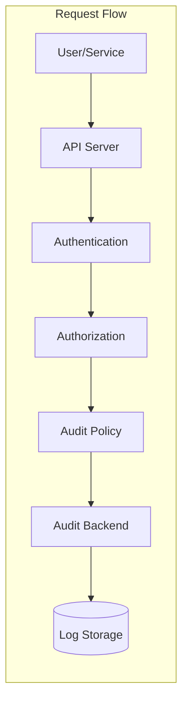
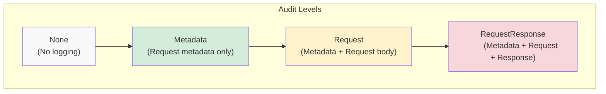
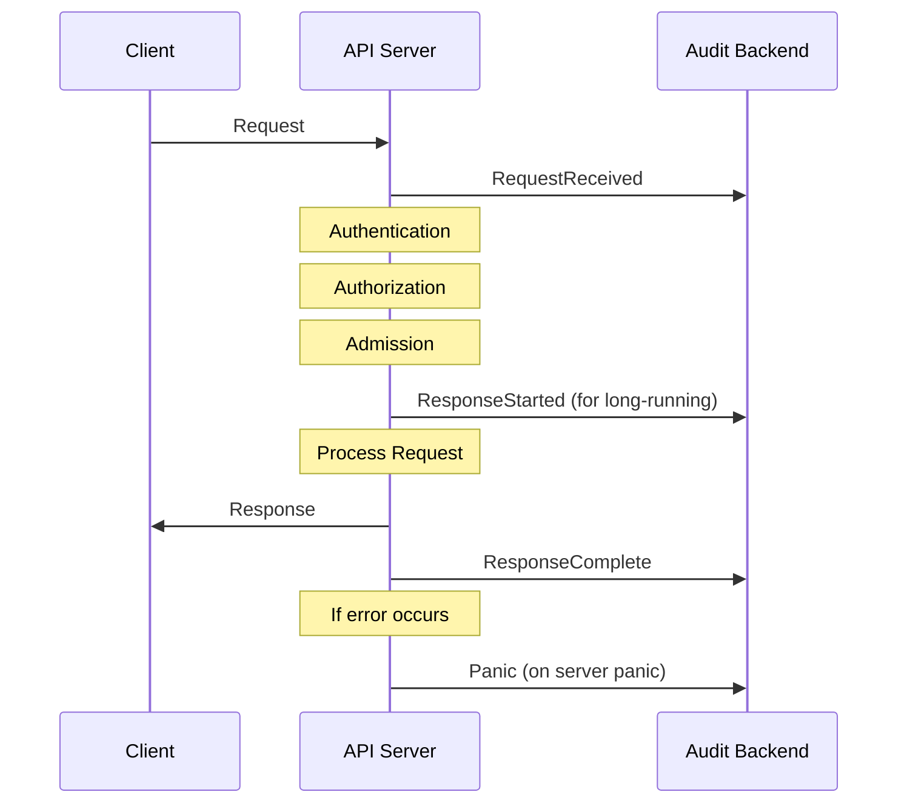
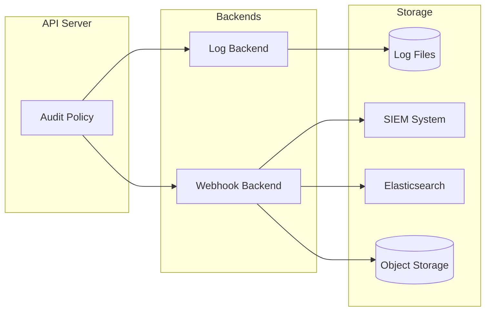

# How to Create Kubernetes Audit Policies

Author: [nawazdhandala](https://github.com/nawazdhandala)

Tags: Kubernetes, Audit, Security, Compliance

Description: Learn how to configure Kubernetes audit policies for security monitoring and compliance.

---

Kubernetes audit logging is essential for security compliance. Whether you need to meet SOC 2, PCI DSS, HIPAA, or internal security requirements, audit logs provide the visibility you need to track who did what, when, and to which resources. This guide covers everything from basic audit levels to production-ready policy configurations.

## What is Kubernetes Audit Logging?

Kubernetes audit logs record every request to the API server. They capture authentication details, authorization decisions, request payloads, and response data. This creates an immutable trail of all cluster activity.



### Why Audit Logs Matter

- **Security Incident Investigation**: Trace back unauthorized access or suspicious activity
- **Compliance Requirements**: Meet regulatory requirements for access logging
- **Change Tracking**: Understand who modified what and when
- **Debugging**: Troubleshoot API-level issues in your cluster

## Understanding Audit Levels

Kubernetes provides four audit levels that control how much information is captured for each event.



### Level Descriptions

| Level | What It Logs | Storage Impact | Use Case |
|-------|-------------|----------------|----------|
| None | Nothing | Zero | Exclude noisy or sensitive resources |
| Metadata | Request metadata (user, timestamp, resource, verb) | Low | General activity tracking |
| Request | Metadata + request body | Medium | Track what changes were requested |
| RequestResponse | Metadata + request body + response body | High | Full forensic capability |

## Basic Audit Policy Structure

An audit policy is a YAML file that defines rules for logging API requests. Rules are evaluated in order, and the first matching rule applies.

```yaml
# /etc/kubernetes/audit-policy.yaml
# Basic audit policy structure

apiVersion: audit.k8s.io/v1
kind: Policy

# Rules are evaluated in order - first match wins
rules:
  # Rule 1: Skip logging for health checks
  - level: None
    users: ["system:kube-probe"]

  # Rule 2: Log all other requests at Metadata level
  - level: Metadata
```

### Policy Rule Fields

Each rule can use these selectors:

```yaml
apiVersion: audit.k8s.io/v1
kind: Policy
rules:
  - level: Metadata

    # Who made the request
    users: ["admin", "developer"]
    userGroups: ["system:authenticated"]

    # What resource was accessed
    resources:
      - group: ""          # Core API group
        resources: ["pods", "services"]
        resourceNames: ["my-pod"]   # Optional: specific resource names

    # What action was taken
    verbs: ["create", "update", "delete"]

    # Which namespaces (empty = all)
    namespaces: ["production", "staging"]

    # Non-resource URLs (like /healthz)
    nonResourceURLs: ["/healthz*", "/version"]

    # Omit specific stages from logging
    omitStages: ["RequestReceived"]
```

## Audit Stages

Each API request goes through multiple stages. You can log at any combination of these stages.



### Stage Descriptions

- **RequestReceived**: Event generated as soon as the request is received
- **ResponseStarted**: Response headers sent, body not yet sent (watch and exec requests)
- **ResponseComplete**: Response body has been completed
- **Panic**: Event generated when a panic occurred

## Production Audit Policy Examples

### Example 1: Compliance-Focused Policy

This policy balances security visibility with storage efficiency, suitable for SOC 2 and similar compliance frameworks.

```yaml
# /etc/kubernetes/audit-policy.yaml
# Compliance-focused audit policy for SOC 2 and similar frameworks

apiVersion: audit.k8s.io/v1
kind: Policy

# Omit the RequestReceived stage to reduce log volume
# We still capture the complete request/response cycle
omitStages:
  - "RequestReceived"

rules:
  # ============================================
  # RULE 1: Skip system health checks
  # These generate massive log volume with no security value
  # ============================================
  - level: None
    users: ["system:kube-probe"]

  # ============================================
  # RULE 2: Skip read-only system components
  # Node and controller manager status checks are noisy
  # ============================================
  - level: None
    userGroups: ["system:nodes"]
    verbs: ["get", "list", "watch"]

  # ============================================
  # RULE 3: Skip kubelet read operations
  # Kubelet constantly reads pod specs - not security relevant
  # ============================================
  - level: None
    users: ["kubelet"]
    verbs: ["get"]
    resources:
      - group: ""
        resources: ["nodes", "nodes/status"]

  # ============================================
  # RULE 4: Skip kube-proxy watching endpoints
  # High volume, low security value
  # ============================================
  - level: None
    users: ["system:kube-proxy"]
    verbs: ["watch"]
    resources:
      - group: ""
        resources: ["endpoints", "services", "services/status"]

  # ============================================
  # RULE 5: Log secrets at Metadata level only
  # NEVER log secret data - compliance violation risk
  # ============================================
  - level: Metadata
    resources:
      - group: ""
        resources: ["secrets"]

  # ============================================
  # RULE 6: Log configmaps at Metadata level
  # ConfigMaps may contain sensitive configuration
  # ============================================
  - level: Metadata
    resources:
      - group: ""
        resources: ["configmaps"]

  # ============================================
  # RULE 7: Full logging for authentication events
  # Critical for security investigation
  # ============================================
  - level: RequestResponse
    resources:
      - group: "authentication.k8s.io"
        resources: ["tokenreviews"]
      - group: "authorization.k8s.io"
        resources: ["subjectaccessreviews", "localsubjectaccessreviews"]

  # ============================================
  # RULE 8: Full logging for RBAC changes
  # Track who modified permissions
  # ============================================
  - level: RequestResponse
    verbs: ["create", "update", "patch", "delete"]
    resources:
      - group: "rbac.authorization.k8s.io"
        resources: ["roles", "rolebindings", "clusterroles", "clusterrolebindings"]

  # ============================================
  # RULE 9: Log namespace operations
  # Namespace creation/deletion is a significant event
  # ============================================
  - level: RequestResponse
    verbs: ["create", "delete"]
    resources:
      - group: ""
        resources: ["namespaces"]

  # ============================================
  # RULE 10: Log pod exec and attach
  # Critical for detecting unauthorized container access
  # ============================================
  - level: RequestResponse
    resources:
      - group: ""
        resources: ["pods/exec", "pods/attach", "pods/portforward"]

  # ============================================
  # RULE 11: Log persistent volume operations
  # Track storage provisioning and access
  # ============================================
  - level: Request
    verbs: ["create", "delete", "update"]
    resources:
      - group: ""
        resources: ["persistentvolumes", "persistentvolumeclaims"]

  # ============================================
  # RULE 12: Log service account token creation
  # Token creation is a potential privilege escalation vector
  # ============================================
  - level: RequestResponse
    verbs: ["create"]
    resources:
      - group: ""
        resources: ["serviceaccounts/token"]

  # ============================================
  # RULE 13: Log workload changes in production
  # Track deployments, daemonsets, statefulsets
  # ============================================
  - level: Request
    verbs: ["create", "update", "patch", "delete"]
    namespaces: ["production", "kube-system"]
    resources:
      - group: "apps"
        resources: ["deployments", "daemonsets", "statefulsets", "replicasets"]

  # ============================================
  # RULE 14: Log all delete operations
  # Deletions are always security relevant
  # ============================================
  - level: Request
    verbs: ["delete", "deletecollection"]

  # ============================================
  # RULE 15: Log all other write operations at Metadata level
  # Catch-all for modifications
  # ============================================
  - level: Metadata
    verbs: ["create", "update", "patch"]

  # ============================================
  # RULE 16: Skip read operations by default
  # Read operations are too noisy for most compliance needs
  # ============================================
  - level: None
    verbs: ["get", "list", "watch"]

  # ============================================
  # RULE 17: Catch-all - log everything else at Metadata
  # Safety net for any missed events
  # ============================================
  - level: Metadata
```

### Example 2: Security Investigation Policy

Maximum visibility policy for security teams investigating incidents.

```yaml
# /etc/kubernetes/audit-policy-security.yaml
# Maximum visibility policy for security investigations

apiVersion: audit.k8s.io/v1
kind: Policy

rules:
  # ============================================
  # Skip only the most noisy operations
  # ============================================
  - level: None
    users: ["system:kube-probe"]

  - level: None
    userGroups: ["system:nodes"]
    verbs: ["get"]
    resources:
      - group: ""
        resources: ["nodes/status"]

  # ============================================
  # Full logging for all authentication
  # ============================================
  - level: RequestResponse
    resources:
      - group: "authentication.k8s.io"

  # ============================================
  # Full logging for all authorization
  # ============================================
  - level: RequestResponse
    resources:
      - group: "authorization.k8s.io"

  # ============================================
  # Secrets - Metadata only (never log content)
  # ============================================
  - level: Metadata
    resources:
      - group: ""
        resources: ["secrets"]

  # ============================================
  # Full logging for RBAC
  # ============================================
  - level: RequestResponse
    resources:
      - group: "rbac.authorization.k8s.io"

  # ============================================
  # Full logging for pod exec/attach/portforward
  # ============================================
  - level: RequestResponse
    resources:
      - group: ""
        resources: ["pods/exec", "pods/attach", "pods/portforward"]

  # ============================================
  # Full logging for service accounts
  # ============================================
  - level: RequestResponse
    resources:
      - group: ""
        resources: ["serviceaccounts", "serviceaccounts/token"]

  # ============================================
  # Full logging for network policies
  # ============================================
  - level: RequestResponse
    resources:
      - group: "networking.k8s.io"
        resources: ["networkpolicies"]

  # ============================================
  # Full logging for all writes
  # ============================================
  - level: RequestResponse
    verbs: ["create", "update", "patch", "delete", "deletecollection"]

  # ============================================
  # Metadata for all reads (comprehensive coverage)
  # ============================================
  - level: Metadata
    verbs: ["get", "list", "watch"]
```

### Example 3: Minimal Noise Policy

For development environments where you want basic tracking without log explosion.

```yaml
# /etc/kubernetes/audit-policy-minimal.yaml
# Minimal audit policy for development environments

apiVersion: audit.k8s.io/v1
kind: Policy

omitStages:
  - "RequestReceived"
  - "ResponseStarted"

rules:
  # Skip all system components
  - level: None
    userGroups: ["system:serviceaccounts:kube-system"]

  - level: None
    users: ["system:kube-proxy", "system:kube-scheduler", "system:kube-controller-manager"]

  # Skip all read operations
  - level: None
    verbs: ["get", "list", "watch"]

  # Never log secret content
  - level: Metadata
    resources:
      - group: ""
        resources: ["secrets"]

  # Log RBAC changes
  - level: Metadata
    resources:
      - group: "rbac.authorization.k8s.io"

  # Log exec into pods
  - level: Metadata
    resources:
      - group: ""
        resources: ["pods/exec", "pods/attach"]

  # Log delete operations
  - level: Metadata
    verbs: ["delete", "deletecollection"]

  # Skip everything else
  - level: None
```

## Configuring Audit Backends

Kubernetes supports multiple audit backends for storing and processing audit logs.



### Log Backend Configuration

The log backend writes audit events to files on disk.

```yaml
# kube-apiserver configuration flags

# Enable audit logging with log backend
# Add these to your kube-apiserver manifest or configuration

# Path to the audit policy file
# --audit-policy-file=/etc/kubernetes/audit-policy.yaml

# Path to write audit logs
# --audit-log-path=/var/log/kubernetes/audit.log

# Maximum age in days to retain old audit log files
# --audit-log-maxage=30

# Maximum number of audit log files to retain
# --audit-log-maxbackup=10

# Maximum size in megabytes before log rotation
# --audit-log-maxsize=100

# Buffering settings for performance
# --audit-log-batch-buffer-size=10000
# --audit-log-batch-max-size=1
# --audit-log-batch-max-wait=1s
```

For a kubeadm cluster, add to the API server manifest:

```yaml
# /etc/kubernetes/manifests/kube-apiserver.yaml
apiVersion: v1
kind: Pod
metadata:
  name: kube-apiserver
  namespace: kube-system
spec:
  containers:
  - name: kube-apiserver
    command:
    - kube-apiserver
    # ... other flags ...

    # Audit configuration flags
    - --audit-policy-file=/etc/kubernetes/audit-policy.yaml
    - --audit-log-path=/var/log/kubernetes/audit/audit.log
    - --audit-log-maxage=30
    - --audit-log-maxbackup=10
    - --audit-log-maxsize=100

    volumeMounts:
    # Mount the audit policy
    - mountPath: /etc/kubernetes/audit-policy.yaml
      name: audit-policy
      readOnly: true
    # Mount the log directory
    - mountPath: /var/log/kubernetes/audit
      name: audit-log

  volumes:
  - name: audit-policy
    hostPath:
      path: /etc/kubernetes/audit-policy.yaml
      type: File
  - name: audit-log
    hostPath:
      path: /var/log/kubernetes/audit
      type: DirectoryOrCreate
```

### Webhook Backend Configuration

The webhook backend sends audit events to an external service for processing.

```yaml
# /etc/kubernetes/audit-webhook-config.yaml
# Webhook configuration for sending audit logs to external service

apiVersion: v1
kind: Config
clusters:
- name: audit-webhook
  cluster:
    # URL of your audit log receiver
    server: https://audit-receiver.security.svc.cluster.local:8443/audit

    # CA certificate for TLS verification
    certificate-authority: /etc/kubernetes/pki/audit-webhook-ca.crt

contexts:
- name: audit-webhook
  context:
    cluster: audit-webhook
    user: audit-webhook

current-context: audit-webhook

users:
- name: audit-webhook
  user:
    # Client certificate for authentication
    client-certificate: /etc/kubernetes/pki/audit-webhook.crt
    client-key: /etc/kubernetes/pki/audit-webhook.key
```

Add webhook flags to kube-apiserver:

```yaml
# Add to kube-apiserver command flags
- --audit-webhook-config-file=/etc/kubernetes/audit-webhook-config.yaml
- --audit-webhook-initial-backoff=5s
- --audit-webhook-batch-buffer-size=10000
- --audit-webhook-batch-max-size=400
- --audit-webhook-batch-max-wait=30s
- --audit-webhook-batch-throttle-qps=10
- --audit-webhook-batch-throttle-burst=15
```

### Example Webhook Receiver

A simple webhook receiver for collecting audit logs:

```yaml
# audit-receiver-deployment.yaml
# Deploy a simple audit log receiver

apiVersion: apps/v1
kind: Deployment
metadata:
  name: audit-receiver
  namespace: security
spec:
  replicas: 2
  selector:
    matchLabels:
      app: audit-receiver
  template:
    metadata:
      labels:
        app: audit-receiver
    spec:
      containers:
      - name: receiver
        image: fluent/fluent-bit:latest
        ports:
        - containerPort: 8443
        volumeMounts:
        - name: config
          mountPath: /fluent-bit/etc
        - name: tls
          mountPath: /etc/tls
          readOnly: true
      volumes:
      - name: config
        configMap:
          name: fluent-bit-config
      - name: tls
        secret:
          secretName: audit-receiver-tls
---
apiVersion: v1
kind: Service
metadata:
  name: audit-receiver
  namespace: security
spec:
  ports:
  - port: 8443
    targetPort: 8443
  selector:
    app: audit-receiver
---
apiVersion: v1
kind: ConfigMap
metadata:
  name: fluent-bit-config
  namespace: security
data:
  fluent-bit.conf: |
    [SERVICE]
        HTTP_Server  On
        HTTP_Listen  0.0.0.0
        HTTP_Port    8443

    [INPUT]
        Name         http
        Listen       0.0.0.0
        Port         8443
        tls          on
        tls.cert_file /etc/tls/tls.crt
        tls.key_file  /etc/tls/tls.key

    [OUTPUT]
        Name         elasticsearch
        Match        *
        Host         elasticsearch.logging.svc.cluster.local
        Port         9200
        Index        kubernetes-audit
        Type         _doc
```

## Working with Audit Logs

### Audit Log Format

Each audit event is a JSON object with this structure:

```json
{
  "kind": "Event",
  "apiVersion": "audit.k8s.io/v1",
  "level": "RequestResponse",
  "auditID": "a]b1c2d3-e4f5-6789-abcd-ef0123456789",
  "stage": "ResponseComplete",
  "requestURI": "/api/v1/namespaces/production/pods",
  "verb": "create",
  "user": {
    "username": "developer@example.com",
    "uid": "abc123",
    "groups": ["developers", "system:authenticated"]
  },
  "sourceIPs": ["10.0.0.50"],
  "userAgent": "kubectl/v1.28.0",
  "objectRef": {
    "resource": "pods",
    "namespace": "production",
    "name": "my-app-pod",
    "apiVersion": "v1"
  },
  "responseStatus": {
    "metadata": {},
    "code": 201
  },
  "requestObject": {
    "kind": "Pod",
    "apiVersion": "v1",
    "metadata": {
      "name": "my-app-pod",
      "namespace": "production"
    }
  },
  "responseObject": {
    "kind": "Pod",
    "apiVersion": "v1",
    "metadata": {
      "name": "my-app-pod",
      "namespace": "production",
      "uid": "pod-uid-123"
    }
  },
  "requestReceivedTimestamp": "2026-01-30T10:15:30.123456Z",
  "stageTimestamp": "2026-01-30T10:15:30.234567Z"
}
```

### Querying Audit Logs

Common queries for security investigation:

```bash
# Find all pod exec events (potential unauthorized access)
cat /var/log/kubernetes/audit/audit.log | \
  jq 'select(.objectRef.subresource == "exec")'

# Find all RBAC modifications
cat /var/log/kubernetes/audit/audit.log | \
  jq 'select(.objectRef.apiGroup == "rbac.authorization.k8s.io") |
      select(.verb | IN("create", "update", "delete"))'

# Find all actions by a specific user
cat /var/log/kubernetes/audit/audit.log | \
  jq 'select(.user.username == "suspicious-user@example.com")'

# Find all failed requests (4xx and 5xx responses)
cat /var/log/kubernetes/audit/audit.log | \
  jq 'select(.responseStatus.code >= 400)'

# Find all secret access attempts
cat /var/log/kubernetes/audit/audit.log | \
  jq 'select(.objectRef.resource == "secrets")'

# Find all delete operations in production namespace
cat /var/log/kubernetes/audit/audit.log | \
  jq 'select(.verb == "delete") |
      select(.objectRef.namespace == "production")'
```

### Audit Log Analysis Script

```bash
#!/bin/bash
# audit-analysis.sh
# Analyze Kubernetes audit logs for security events

AUDIT_LOG="${1:-/var/log/kubernetes/audit/audit.log}"
REPORT_DATE=$(date +%Y-%m-%d)

echo "=== Kubernetes Audit Analysis Report ==="
echo "Date: $REPORT_DATE"
echo "Log File: $AUDIT_LOG"
echo ""

echo "=== Summary Statistics ==="
echo "Total events: $(wc -l < "$AUDIT_LOG")"
echo "Unique users: $(jq -r '.user.username' "$AUDIT_LOG" | sort -u | wc -l)"
echo ""

echo "=== Events by Verb ==="
jq -r '.verb' "$AUDIT_LOG" | sort | uniq -c | sort -rn | head -10
echo ""

echo "=== Failed Requests (4xx/5xx) ==="
jq 'select(.responseStatus.code >= 400) |
    {user: .user.username, verb: .verb, resource: .objectRef.resource,
     code: .responseStatus.code}' "$AUDIT_LOG" | head -50
echo ""

echo "=== Pod Exec Events ==="
jq 'select(.objectRef.subresource == "exec") |
    {time: .requestReceivedTimestamp, user: .user.username,
     namespace: .objectRef.namespace, pod: .objectRef.name}' "$AUDIT_LOG"
echo ""

echo "=== RBAC Modifications ==="
jq 'select(.objectRef.apiGroup == "rbac.authorization.k8s.io") |
    select(.verb | IN("create", "update", "delete")) |
    {time: .requestReceivedTimestamp, user: .user.username,
     verb: .verb, resource: .objectRef.resource, name: .objectRef.name}' "$AUDIT_LOG"
echo ""

echo "=== Secret Access ==="
jq 'select(.objectRef.resource == "secrets") |
    {time: .requestReceivedTimestamp, user: .user.username,
     verb: .verb, namespace: .objectRef.namespace, name: .objectRef.name}' "$AUDIT_LOG"
```

## Compliance Mapping

### SOC 2 Requirements

| SOC 2 Control | Audit Policy Coverage |
|--------------|----------------------|
| CC6.1 - Logical Access | Log all authentication events |
| CC6.2 - Access Removal | Log RBAC changes and deletions |
| CC6.3 - Access Changes | Log role and rolebinding modifications |
| CC7.1 - System Operations | Log workload deployments and changes |
| CC7.2 - Change Management | Log all create/update/delete operations |

### PCI DSS Requirements

| PCI DSS Requirement | Audit Policy Coverage |
|--------------------|----------------------|
| 10.2.1 - User Access | Log all user authentication |
| 10.2.2 - Admin Actions | Log all actions by privileged users |
| 10.2.4 - Invalid Access | Log failed authentication attempts |
| 10.2.5 - Access Changes | Log modifications to access controls |
| 10.2.7 - Object Creation/Deletion | Log resource creation and deletion |

## Testing Your Audit Policy

### Validation Script

```bash
#!/bin/bash
# validate-audit-policy.sh
# Test that audit policy captures expected events

set -e

NAMESPACE="audit-test-$(date +%s)"
echo "Creating test namespace: $NAMESPACE"
kubectl create namespace $NAMESPACE

# Test 1: Create a pod
echo "Test 1: Creating a pod..."
kubectl run test-pod --image=nginx -n $NAMESPACE
sleep 2

# Test 2: Exec into pod
echo "Test 2: Executing command in pod..."
kubectl exec -n $NAMESPACE test-pod -- echo "audit test" || true
sleep 2

# Test 3: Create a secret
echo "Test 3: Creating a secret..."
kubectl create secret generic test-secret --from-literal=key=value -n $NAMESPACE
sleep 2

# Test 4: Create RBAC resources
echo "Test 4: Creating RBAC resources..."
kubectl create role test-role --verb=get --resource=pods -n $NAMESPACE
kubectl create rolebinding test-binding --role=test-role --user=test-user -n $NAMESPACE
sleep 2

# Test 5: Delete resources
echo "Test 5: Deleting resources..."
kubectl delete pod test-pod -n $NAMESPACE
kubectl delete secret test-secret -n $NAMESPACE
kubectl delete rolebinding test-binding -n $NAMESPACE
kubectl delete role test-role -n $NAMESPACE
kubectl delete namespace $NAMESPACE

echo ""
echo "=== Audit Validation Checklist ==="
echo "Check your audit logs for:"
echo "  [ ] Pod creation event in $NAMESPACE"
echo "  [ ] Pod exec event (subresource: exec)"
echo "  [ ] Secret creation (Metadata only, no secret data)"
echo "  [ ] Role and RoleBinding creation"
echo "  [ ] All deletion events"
echo "  [ ] Namespace deletion"
```

## Best Practices

### Policy Design

1. **Start restrictive, then relax**: Begin with full logging, then add exceptions for noise
2. **Never log secret content**: Always use Metadata level for secrets
3. **Document every rule**: Add comments explaining why each rule exists
4. **Version control your policies**: Track changes to audit policies in Git
5. **Test policy changes**: Validate in staging before production

### Operations

1. **Set up log rotation**: Audit logs can grow quickly
2. **Monitor log volume**: Alert if audit log generation spikes unexpectedly
3. **Centralize logs**: Ship to a SIEM for analysis and long-term retention
4. **Set retention policies**: Compliance often requires 90+ days retention
5. **Protect audit logs**: Restrict access to audit log files and destinations

### Performance

1. **Use appropriate levels**: RequestResponse is expensive, use sparingly
2. **Omit RequestReceived stage**: Reduces volume without losing information
3. **Batch webhook delivery**: Configure batching for webhook backends
4. **Monitor API server latency**: Audit logging adds overhead

## Troubleshooting

### Common Issues

**Audit logs not appearing**
- Verify audit policy file path is correct
- Check API server logs for policy parsing errors
- Ensure log directory exists and is writable

**Log volume too high**
- Review rules for missing exclusions
- Add level: None for noisy system components
- Omit RequestReceived and ResponseStarted stages

**Webhook backend failing**
- Check network connectivity to webhook receiver
- Verify TLS certificates are valid
- Check webhook receiver logs for errors

**Missing expected events**
- Rules are evaluated in order; check for early matches
- Verify resource group and name spelling
- Check if verb matches (list vs get vs watch)

### Debug Checklist

```bash
# Check API server audit configuration
kubectl get pods -n kube-system kube-apiserver-* -o yaml | grep audit

# Verify audit log file exists
ls -la /var/log/kubernetes/audit/

# Check recent audit entries
tail -10 /var/log/kubernetes/audit/audit.log | jq .

# Count events by level
cat /var/log/kubernetes/audit/audit.log | jq -r '.level' | sort | uniq -c

# Check for policy parsing errors in API server logs
kubectl logs -n kube-system kube-apiserver-* | grep -i audit
```

---

Kubernetes audit logging is not optional for production clusters. It provides the visibility needed for security compliance, incident investigation, and operational awareness. Start with a comprehensive policy, tune it based on your log volume and storage capacity, and make sure those logs are getting shipped somewhere safe for analysis. When the security team comes asking questions, you will be glad you have detailed audit trails.
