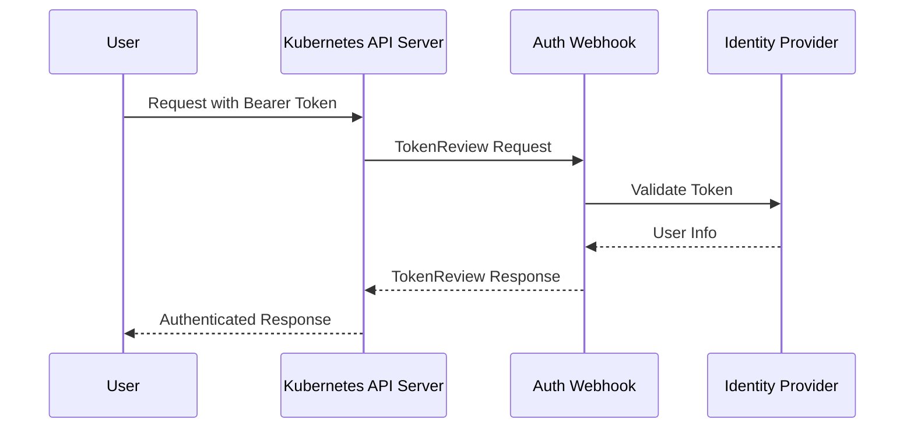
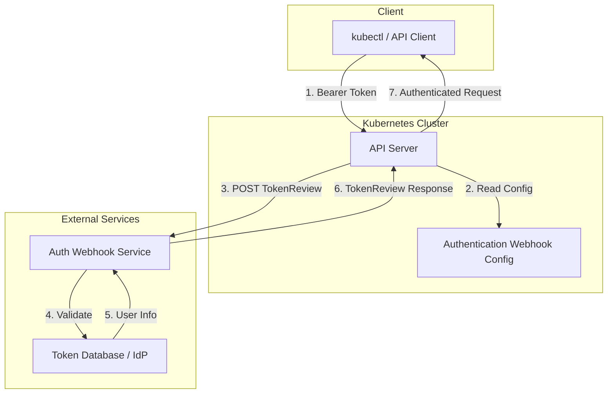
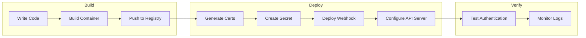
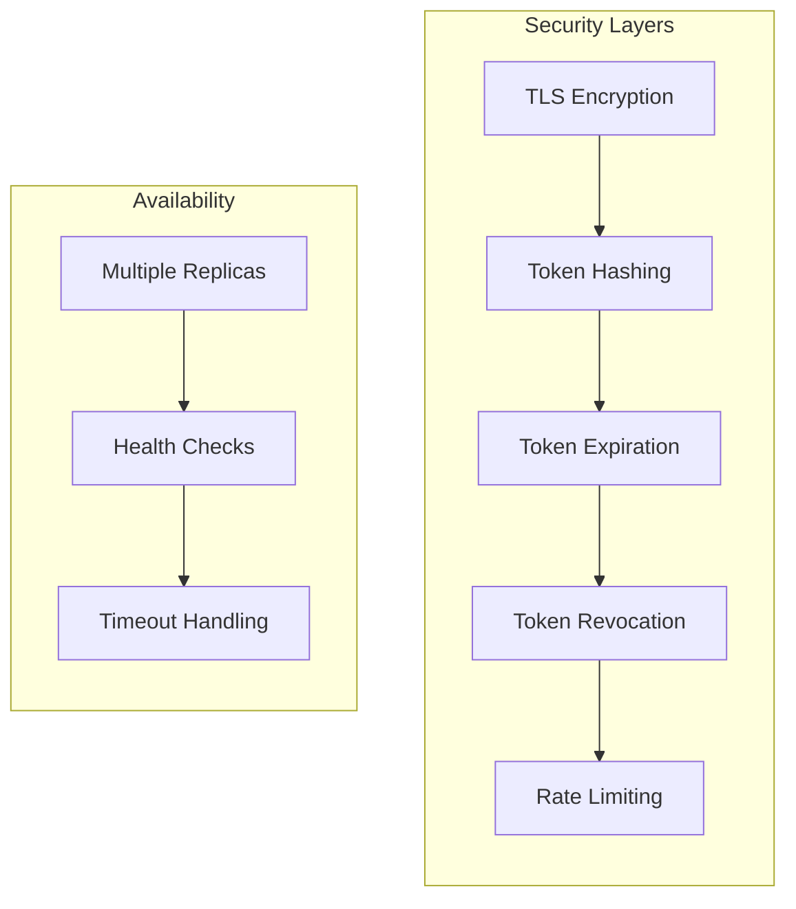

# How to Build Kubernetes Authentication Webhooks

Author: [nawazdhandala](https://github.com/nawazdhandala)

Tags: Kubernetes, Authentication, Webhooks, Security

Description: Learn how to implement custom authentication webhooks for Kubernetes clusters.

---

Kubernetes provides a flexible authentication system that allows you to integrate custom identity providers through webhook token authentication. This guide walks you through building a custom authentication webhook from scratch, covering the TokenReview API, webhook configuration, and a complete Go implementation.

## Understanding Kubernetes Authentication

Kubernetes supports multiple authentication strategies including client certificates, bearer tokens, authentication proxies, and webhook token authentication. Webhook authentication is particularly useful when you need to integrate with existing identity systems or implement custom authentication logic.

### How Webhook Authentication Works

When a user attempts to authenticate with a bearer token, the API server sends a TokenReview request to your webhook service. The webhook validates the token and returns user information if authentication succeeds.



## The TokenReview API

The TokenReview API is the contract between the Kubernetes API server and your webhook. Understanding this API is essential for building a working authentication webhook.

### TokenReview Request Structure

When a user presents a bearer token, Kubernetes sends a TokenReview object to your webhook:

```json
{
  "apiVersion": "authentication.k8s.io/v1",
  "kind": "TokenReview",
  "spec": {
    "token": "the-bearer-token-from-user",
    "audiences": ["api", "vault"]
  }
}
```

The `spec.token` field contains the bearer token that needs validation. The optional `audiences` field lists the intended audiences for the token.

### TokenReview Response Structure

Your webhook must return a TokenReview object with the authentication result:

```json
{
  "apiVersion": "authentication.k8s.io/v1",
  "kind": "TokenReview",
  "status": {
    "authenticated": true,
    "user": {
      "username": "jane.doe@example.com",
      "uid": "42",
      "groups": ["developers", "qa"],
      "extra": {
        "department": ["engineering"]
      }
    },
    "audiences": ["api"]
  }
}
```

For failed authentication, return:

```json
{
  "apiVersion": "authentication.k8s.io/v1",
  "kind": "TokenReview",
  "status": {
    "authenticated": false,
    "error": "Token expired or invalid"
  }
}
```

## Authentication Flow Architecture

Here is the complete architecture showing how all components interact:



## Building the Authentication Webhook in Go

Let us build a production-ready authentication webhook in Go. This implementation includes proper error handling, logging, and TLS support.

### Project Structure

```
auth-webhook/
├── main.go
├── handlers/
│   └── token_review.go
├── auth/
│   └── validator.go
├── types/
│   └── types.go
└── go.mod
```

### Type Definitions

First, define the types that match the Kubernetes TokenReview API:

```go
// types/types.go
package types

// TokenReview represents a Kubernetes TokenReview request/response
type TokenReview struct {
    APIVersion string            `json:"apiVersion"`
    Kind       string            `json:"kind"`
    Spec       TokenReviewSpec   `json:"spec,omitempty"`
    Status     TokenReviewStatus `json:"status,omitempty"`
}

// TokenReviewSpec contains the token to be reviewed
type TokenReviewSpec struct {
    // Token is the opaque bearer token being reviewed
    Token string `json:"token"`

    // Audiences are the identifiers that the resource server
    // presented with the token
    Audiences []string `json:"audiences,omitempty"`
}

// TokenReviewStatus contains the result of the token review
type TokenReviewStatus struct {
    // Authenticated indicates if the token was valid
    Authenticated bool `json:"authenticated"`

    // User contains information about the authenticated user
    User UserInfo `json:"user,omitempty"`

    // Audiences are the audiences accepted by the server
    Audiences []string `json:"audiences,omitempty"`

    // Error provides additional context for authentication failures
    Error string `json:"error,omitempty"`
}

// UserInfo contains information about the authenticated user
type UserInfo struct {
    // Username is the name that uniquely identifies the user
    Username string `json:"username"`

    // UID is a unique value that identifies the user
    UID string `json:"uid"`

    // Groups are the groups the user belongs to
    Groups []string `json:"groups,omitempty"`

    // Extra contains additional provider-specific information
    Extra map[string][]string `json:"extra,omitempty"`
}
```

### Token Validator

Create a token validator that checks tokens against your identity provider:

```go
// auth/validator.go
package auth

import (
    "context"
    "crypto/sha256"
    "encoding/hex"
    "errors"
    "sync"
    "time"

    "auth-webhook/types"
)

// Common errors returned by the validator
var (
    ErrTokenNotFound = errors.New("token not found")
    ErrTokenExpired  = errors.New("token has expired")
    ErrTokenRevoked  = errors.New("token has been revoked")
)

// TokenInfo stores information about a valid token
type TokenInfo struct {
    User      types.UserInfo
    ExpiresAt time.Time
    Revoked   bool
}

// Validator handles token validation logic
type Validator struct {
    // tokens stores valid tokens in memory
    // In production, use a database or external IdP
    tokens map[string]TokenInfo
    mu     sync.RWMutex
}

// NewValidator creates a new token validator
func NewValidator() *Validator {
    v := &Validator{
        tokens: make(map[string]TokenInfo),
    }

    // Add some sample tokens for demonstration
    // In production, tokens would come from a database or IdP
    v.addSampleTokens()

    return v
}

// addSampleTokens adds demonstration tokens
func (v *Validator) addSampleTokens() {
    // Hash the tokens for secure storage
    // In production, use proper token generation and storage

    v.tokens[v.hashToken("admin-token-12345")] = TokenInfo{
        User: types.UserInfo{
            Username: "admin@example.com",
            UID:      "1001",
            Groups:   []string{"system:masters", "cluster-admins"},
            Extra: map[string][]string{
                "department": {"platform"},
            },
        },
        ExpiresAt: time.Now().Add(24 * time.Hour),
        Revoked:   false,
    }

    v.tokens[v.hashToken("developer-token-67890")] = TokenInfo{
        User: types.UserInfo{
            Username: "developer@example.com",
            UID:      "2001",
            Groups:   []string{"developers"},
            Extra: map[string][]string{
                "department": {"engineering"},
            },
        },
        ExpiresAt: time.Now().Add(24 * time.Hour),
        Revoked:   false,
    }
}

// hashToken creates a SHA-256 hash of the token
func (v *Validator) hashToken(token string) string {
    hash := sha256.Sum256([]byte(token))
    return hex.EncodeToString(hash[:])
}

// Validate checks if a token is valid and returns user info
func (v *Validator) Validate(ctx context.Context, token string) (*types.UserInfo, error) {
    v.mu.RLock()
    defer v.mu.RUnlock()

    // Hash the incoming token to look it up
    hashedToken := v.hashToken(token)

    // Look up the token
    info, exists := v.tokens[hashedToken]
    if !exists {
        return nil, ErrTokenNotFound
    }

    // Check if the token has been revoked
    if info.Revoked {
        return nil, ErrTokenRevoked
    }

    // Check if the token has expired
    if time.Now().After(info.ExpiresAt) {
        return nil, ErrTokenExpired
    }

    // Return a copy of the user info
    userCopy := info.User
    return &userCopy, nil
}

// RevokeToken marks a token as revoked
func (v *Validator) RevokeToken(token string) {
    v.mu.Lock()
    defer v.mu.Unlock()

    hashedToken := v.hashToken(token)
    if info, exists := v.tokens[hashedToken]; exists {
        info.Revoked = true
        v.tokens[hashedToken] = info
    }
}
```

### HTTP Handler

Create the HTTP handler that processes TokenReview requests:

```go
// handlers/token_review.go
package handlers

import (
    "context"
    "encoding/json"
    "log"
    "net/http"
    "time"

    "auth-webhook/auth"
    "auth-webhook/types"
)

// TokenReviewHandler handles TokenReview requests from Kubernetes
type TokenReviewHandler struct {
    validator *auth.Validator
}

// NewTokenReviewHandler creates a new handler with the given validator
func NewTokenReviewHandler(validator *auth.Validator) *TokenReviewHandler {
    return &TokenReviewHandler{
        validator: validator,
    }
}

// ServeHTTP implements the http.Handler interface
func (h *TokenReviewHandler) ServeHTTP(w http.ResponseWriter, r *http.Request) {
    // Only accept POST requests
    if r.Method != http.MethodPost {
        http.Error(w, "Method not allowed", http.StatusMethodNotAllowed)
        return
    }

    // Set response content type
    w.Header().Set("Content-Type", "application/json")

    // Parse the incoming TokenReview request
    var tokenReview types.TokenReview
    if err := json.NewDecoder(r.Body).Decode(&tokenReview); err != nil {
        log.Printf("Error decoding request: %v", err)
        h.sendErrorResponse(w, "Invalid request body")
        return
    }

    // Validate that we received a TokenReview
    if tokenReview.Kind != "TokenReview" {
        log.Printf("Invalid kind: %s", tokenReview.Kind)
        h.sendErrorResponse(w, "Expected TokenReview kind")
        return
    }

    // Extract the token from the request
    token := tokenReview.Spec.Token
    if token == "" {
        log.Printf("Empty token in request")
        h.sendErrorResponse(w, "Token is required")
        return
    }

    // Create a context with timeout for validation
    ctx, cancel := context.WithTimeout(r.Context(), 5*time.Second)
    defer cancel()

    // Validate the token
    userInfo, err := h.validator.Validate(ctx, token)
    if err != nil {
        log.Printf("Token validation failed: %v", err)
        h.sendUnauthenticatedResponse(w, &tokenReview, err.Error())
        return
    }

    // Log successful authentication
    log.Printf("Authenticated user: %s (uid: %s)", userInfo.Username, userInfo.UID)

    // Send successful response
    h.sendAuthenticatedResponse(w, &tokenReview, userInfo)
}

// sendAuthenticatedResponse sends a successful TokenReview response
func (h *TokenReviewHandler) sendAuthenticatedResponse(
    w http.ResponseWriter,
    request *types.TokenReview,
    user *types.UserInfo,
) {
    response := types.TokenReview{
        APIVersion: request.APIVersion,
        Kind:       request.Kind,
        Status: types.TokenReviewStatus{
            Authenticated: true,
            User:          *user,
            Audiences:     request.Spec.Audiences,
        },
    }

    if err := json.NewEncoder(w).Encode(response); err != nil {
        log.Printf("Error encoding response: %v", err)
    }
}

// sendUnauthenticatedResponse sends a failed TokenReview response
func (h *TokenReviewHandler) sendUnauthenticatedResponse(
    w http.ResponseWriter,
    request *types.TokenReview,
    errorMsg string,
) {
    response := types.TokenReview{
        APIVersion: request.APIVersion,
        Kind:       request.Kind,
        Status: types.TokenReviewStatus{
            Authenticated: false,
            Error:         errorMsg,
        },
    }

    if err := json.NewEncoder(w).Encode(response); err != nil {
        log.Printf("Error encoding response: %v", err)
    }
}

// sendErrorResponse sends an error response for malformed requests
func (h *TokenReviewHandler) sendErrorResponse(w http.ResponseWriter, errorMsg string) {
    response := types.TokenReview{
        APIVersion: "authentication.k8s.io/v1",
        Kind:       "TokenReview",
        Status: types.TokenReviewStatus{
            Authenticated: false,
            Error:         errorMsg,
        },
    }

    w.WriteHeader(http.StatusBadRequest)
    if err := json.NewEncoder(w).Encode(response); err != nil {
        log.Printf("Error encoding error response: %v", err)
    }
}
```

### Main Application

Create the main application with TLS support:

```go
// main.go
package main

import (
    "crypto/tls"
    "flag"
    "log"
    "net/http"
    "os"
    "os/signal"
    "syscall"
    "time"

    "auth-webhook/auth"
    "auth-webhook/handlers"
)

func main() {
    // Parse command line flags
    var (
        addr     = flag.String("addr", ":8443", "Address to listen on")
        certFile = flag.String("cert", "/etc/webhook/certs/tls.crt", "TLS certificate file")
        keyFile  = flag.String("key", "/etc/webhook/certs/tls.key", "TLS private key file")
    )
    flag.Parse()

    // Create the token validator
    validator := auth.NewValidator()

    // Create the HTTP handler
    handler := handlers.NewTokenReviewHandler(validator)

    // Set up the HTTP server with TLS
    mux := http.NewServeMux()
    mux.Handle("/authenticate", handler)
    mux.HandleFunc("/healthz", healthCheckHandler)

    // Configure TLS
    tlsConfig := &tls.Config{
        MinVersion:               tls.VersionTLS12,
        CurvePreferences:         []tls.CurveID{tls.X25519, tls.CurveP256},
        PreferServerCipherSuites: true,
        CipherSuites: []uint16{
            tls.TLS_ECDHE_ECDSA_WITH_AES_256_GCM_SHA384,
            tls.TLS_ECDHE_RSA_WITH_AES_256_GCM_SHA384,
            tls.TLS_ECDHE_ECDSA_WITH_AES_128_GCM_SHA256,
            tls.TLS_ECDHE_RSA_WITH_AES_128_GCM_SHA256,
        },
    }

    server := &http.Server{
        Addr:         *addr,
        Handler:      mux,
        TLSConfig:    tlsConfig,
        ReadTimeout:  10 * time.Second,
        WriteTimeout: 10 * time.Second,
        IdleTimeout:  60 * time.Second,
    }

    // Handle graceful shutdown
    go func() {
        sigChan := make(chan os.Signal, 1)
        signal.Notify(sigChan, syscall.SIGINT, syscall.SIGTERM)
        <-sigChan

        log.Println("Shutting down server...")
        server.Close()
    }()

    // Start the server
    log.Printf("Starting authentication webhook on %s", *addr)
    if err := server.ListenAndServeTLS(*certFile, *keyFile); err != http.ErrServerClosed {
        log.Fatalf("Server error: %v", err)
    }

    log.Println("Server stopped")
}

// healthCheckHandler handles health check requests
func healthCheckHandler(w http.ResponseWriter, r *http.Request) {
    w.WriteHeader(http.StatusOK)
    w.Write([]byte("OK"))
}
```

## Deploying the Webhook to Kubernetes

### Kubernetes Deployment

Create a Deployment and Service for the webhook:

```yaml
# deployment.yaml
apiVersion: apps/v1
kind: Deployment
metadata:
  name: auth-webhook
  namespace: kube-system
  labels:
    app: auth-webhook
spec:
  replicas: 2
  selector:
    matchLabels:
      app: auth-webhook
  template:
    metadata:
      labels:
        app: auth-webhook
    spec:
      containers:
      - name: auth-webhook
        image: your-registry/auth-webhook:v1.0.0
        ports:
        - containerPort: 8443
          name: https
        volumeMounts:
        - name: certs
          mountPath: /etc/webhook/certs
          readOnly: true
        resources:
          requests:
            memory: "64Mi"
            cpu: "100m"
          limits:
            memory: "128Mi"
            cpu: "200m"
        livenessProbe:
          httpGet:
            path: /healthz
            port: 8443
            scheme: HTTPS
          initialDelaySeconds: 5
          periodSeconds: 10
        readinessProbe:
          httpGet:
            path: /healthz
            port: 8443
            scheme: HTTPS
          initialDelaySeconds: 5
          periodSeconds: 5
      volumes:
      - name: certs
        secret:
          secretName: auth-webhook-certs
---
apiVersion: v1
kind: Service
metadata:
  name: auth-webhook
  namespace: kube-system
spec:
  selector:
    app: auth-webhook
  ports:
  - port: 443
    targetPort: 8443
    protocol: TCP
```

### Generating TLS Certificates

Create TLS certificates for the webhook. You can use cert-manager or generate them manually:

```bash
#!/bin/bash
# generate-certs.sh

# Set variables
SERVICE_NAME="auth-webhook"
NAMESPACE="kube-system"
SECRET_NAME="auth-webhook-certs"

# Create a temporary directory for certificates
CERT_DIR=$(mktemp -d)

# Generate CA key and certificate
openssl genrsa -out ${CERT_DIR}/ca.key 2048
openssl req -x509 -new -nodes \
    -key ${CERT_DIR}/ca.key \
    -sha256 -days 3650 \
    -out ${CERT_DIR}/ca.crt \
    -subj "/CN=Auth Webhook CA"

# Generate server key
openssl genrsa -out ${CERT_DIR}/tls.key 2048

# Create CSR config file
cat > ${CERT_DIR}/csr.conf <<EOF
[req]
default_bits = 2048
prompt = no
default_md = sha256
distinguished_name = dn
req_extensions = req_ext

[dn]
CN = ${SERVICE_NAME}.${NAMESPACE}.svc

[req_ext]
subjectAltName = @alt_names

[alt_names]
DNS.1 = ${SERVICE_NAME}
DNS.2 = ${SERVICE_NAME}.${NAMESPACE}
DNS.3 = ${SERVICE_NAME}.${NAMESPACE}.svc
DNS.4 = ${SERVICE_NAME}.${NAMESPACE}.svc.cluster.local
EOF

# Generate CSR
openssl req -new \
    -key ${CERT_DIR}/tls.key \
    -out ${CERT_DIR}/tls.csr \
    -config ${CERT_DIR}/csr.conf

# Sign the certificate
openssl x509 -req \
    -in ${CERT_DIR}/tls.csr \
    -CA ${CERT_DIR}/ca.crt \
    -CAkey ${CERT_DIR}/ca.key \
    -CAcreateserial \
    -out ${CERT_DIR}/tls.crt \
    -days 365 \
    -extensions req_ext \
    -extfile ${CERT_DIR}/csr.conf

# Create Kubernetes secret
kubectl create secret generic ${SECRET_NAME} \
    --namespace=${NAMESPACE} \
    --from-file=tls.crt=${CERT_DIR}/tls.crt \
    --from-file=tls.key=${CERT_DIR}/tls.key \
    --from-file=ca.crt=${CERT_DIR}/ca.crt \
    --dry-run=client -o yaml | kubectl apply -f -

# Output CA certificate for webhook configuration
echo "CA Certificate (base64 encoded):"
cat ${CERT_DIR}/ca.crt | base64 | tr -d '\n'
echo ""

# Cleanup
rm -rf ${CERT_DIR}
```

### Configuring the API Server

Create a webhook configuration file that the API server will use:

```yaml
# webhook-config.yaml
apiVersion: v1
kind: Config
clusters:
- name: auth-webhook
  cluster:
    # Base64-encoded CA certificate from generate-certs.sh
    certificate-authority-data: <BASE64_CA_CERT>
    server: https://auth-webhook.kube-system.svc:443/authenticate
users:
- name: kube-apiserver
current-context: webhook
contexts:
- context:
    cluster: auth-webhook
    user: kube-apiserver
  name: webhook
```

Place this file on the control plane nodes and update the API server configuration:

```yaml
# kube-apiserver configuration
apiVersion: v1
kind: Pod
metadata:
  name: kube-apiserver
  namespace: kube-system
spec:
  containers:
  - command:
    - kube-apiserver
    - --authentication-token-webhook-config-file=/etc/kubernetes/auth-webhook/webhook-config.yaml
    - --authentication-token-webhook-cache-ttl=2m
    # ... other flags
    volumeMounts:
    - name: webhook-config
      mountPath: /etc/kubernetes/auth-webhook
      readOnly: true
  volumes:
  - name: webhook-config
    hostPath:
      path: /etc/kubernetes/auth-webhook
      type: Directory
```

## Deployment Flow

Here is the complete deployment workflow:



## Testing the Webhook

Test your webhook using curl before deploying to Kubernetes:

```bash
# Test with a valid token
curl -k -X POST https://localhost:8443/authenticate \
  -H "Content-Type: application/json" \
  -d '{
    "apiVersion": "authentication.k8s.io/v1",
    "kind": "TokenReview",
    "spec": {
      "token": "admin-token-12345"
    }
  }'

# Expected response:
# {
#   "apiVersion": "authentication.k8s.io/v1",
#   "kind": "TokenReview",
#   "status": {
#     "authenticated": true,
#     "user": {
#       "username": "admin@example.com",
#       "uid": "1001",
#       "groups": ["system:masters", "cluster-admins"],
#       "extra": {"department": ["platform"]}
#     }
#   }
# }

# Test with an invalid token
curl -k -X POST https://localhost:8443/authenticate \
  -H "Content-Type: application/json" \
  -d '{
    "apiVersion": "authentication.k8s.io/v1",
    "kind": "TokenReview",
    "spec": {
      "token": "invalid-token"
    }
  }'

# Expected response:
# {
#   "apiVersion": "authentication.k8s.io/v1",
#   "kind": "TokenReview",
#   "status": {
#     "authenticated": false,
#     "error": "token not found"
#   }
# }
```

Once deployed, test with kubectl:

```bash
# Create a kubeconfig file with the token
kubectl config set-credentials test-user --token=admin-token-12345
kubectl config set-context test-context --cluster=your-cluster --user=test-user
kubectl config use-context test-context

# Verify authentication
kubectl auth whoami
```

## Security Considerations

When building authentication webhooks, keep these security practices in mind:

### Token Security

1. **Never log tokens** in plain text. Use hashing for any token storage or logging.
2. **Implement token expiration** to limit the impact of compromised tokens.
3. **Support token revocation** so compromised tokens can be invalidated immediately.

### Network Security

1. **Always use TLS** for communication between the API server and webhook.
2. **Validate client certificates** if possible to ensure requests come from the API server.
3. **Deploy in the kube-system namespace** to benefit from network policies.

### High Availability

1. **Run multiple replicas** of your webhook to handle API server restarts.
2. **Set appropriate timeouts** so authentication does not block the API server.
3. **Implement health checks** to enable Kubernetes to route traffic away from unhealthy pods.



## Conclusion

Building a custom Kubernetes authentication webhook gives you full control over how users authenticate to your cluster. This approach is ideal for integrating with existing identity providers, implementing custom authentication logic, or adding additional security layers.

Key takeaways from this guide:

- The TokenReview API provides a standard interface for authentication webhooks
- Your webhook must handle both successful and failed authentication cases
- TLS is required for secure communication with the API server
- Proper error handling and logging are essential for debugging authentication issues
- Always implement token expiration and revocation for security

The complete source code for this authentication webhook is available and can be extended to integrate with LDAP, OAuth2, SAML, or any other identity provider your organization uses.

## Further Reading

- [Kubernetes Authentication Documentation](https://kubernetes.io/docs/reference/access-authn-authz/authentication/)
- [TokenReview API Reference](https://kubernetes.io/docs/reference/kubernetes-api/authentication-resources/token-review-v1/)
- [Webhook Token Authentication](https://kubernetes.io/docs/reference/access-authn-authz/authentication/#webhook-token-authentication)
