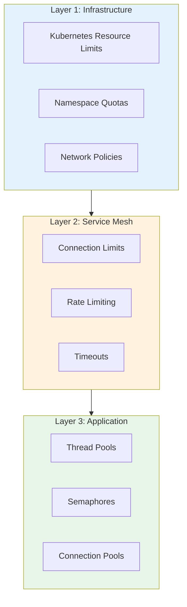
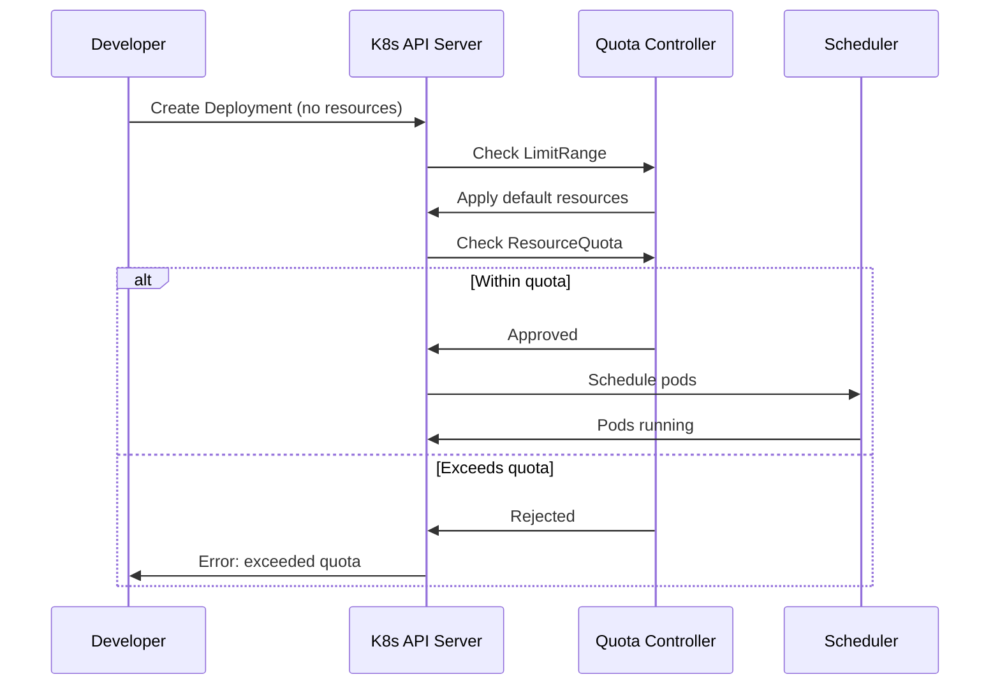
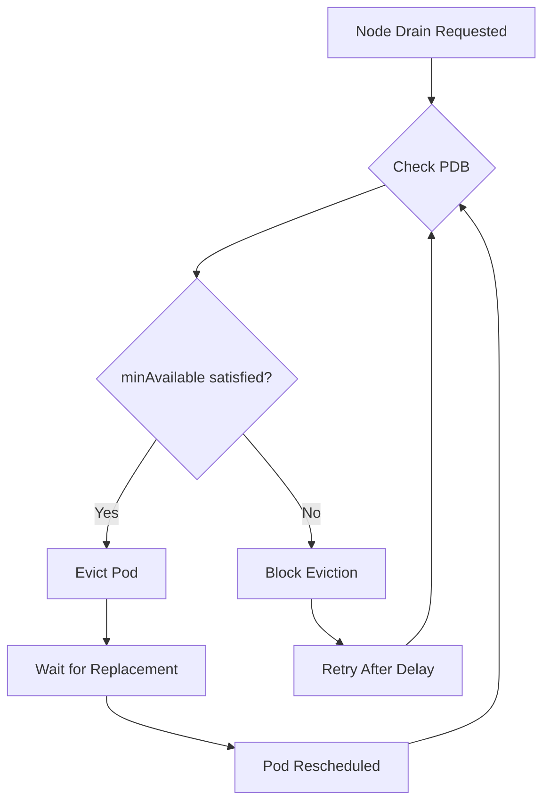
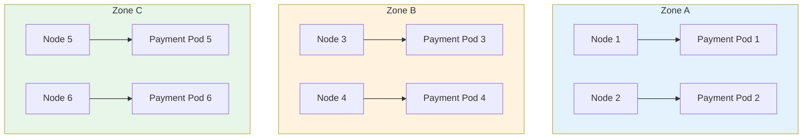

# How to Implement Bulkhead Pattern in Microservices with Kubernetes

Author: [nawazdhandala](https://github.com/nawazdhandala)

Tags: Kubernetes, Bulkhead Pattern, Microservices, Resilience, Infrastructure, Service Mesh, Istio

Description: Learn how to implement infrastructure-level bulkheads in Kubernetes using resource limits, network policies, and service mesh configurations to isolate failures and prevent cascading outages.

---

Most bulkhead tutorials focus on application code: semaphores, thread pools, and circuit breakers. But the most effective bulkheads operate at the infrastructure level. When a runaway service exhausts CPU or memory, your application-level semaphore will not save you. Kubernetes gives you multiple layers of bulkhead capabilities that complement your code.

This guide covers infrastructure-level bulkheads that protect your microservices from the ground up.

## The Bulkhead Pattern at Different Layers

Before diving into implementation, understand where bulkheads can operate in your stack.



Each layer provides different protections. Infrastructure bulkheads prevent resource starvation. Service mesh bulkheads control traffic flow. Application bulkheads manage internal concurrency. You need all three for comprehensive fault isolation.

## Resource Limits: The First Bulkhead

Kubernetes resource limits are your first line of defense. Without them, a single misbehaving pod can consume all node resources and starve other workloads.

### Basic Resource Configuration

Every production deployment should specify both requests and limits. Requests reserve resources, while limits cap consumption.

```yaml
# deployment-with-bulkhead.yaml
# This deployment demonstrates proper resource bulkheading.
# Each container is isolated to prevent resource hogging.
apiVersion: apps/v1
kind: Deployment
metadata:
  name: payment-service
  namespace: production
spec:
  replicas: 3
  selector:
    matchLabels:
      app: payment-service
  template:
    metadata:
      labels:
        app: payment-service
    spec:
      containers:
      - name: payment-service
        image: myregistry/payment-service:v2.1.0
        resources:
          # Requests guarantee these resources are reserved
          # The scheduler uses these values for placement decisions
          requests:
            cpu: "500m"      # Half a CPU core guaranteed
            memory: "512Mi"  # 512MB RAM guaranteed
          # Limits cap resource consumption
          # Container is throttled (CPU) or killed (memory) if exceeded
          limits:
            cpu: "1000m"     # Maximum 1 CPU core
            memory: "1Gi"    # Maximum 1GB RAM, OOMKilled if exceeded
        # Liveness probe restarts unhealthy containers
        livenessProbe:
          httpGet:
            path: /health/live
            port: 8080
          initialDelaySeconds: 10
          periodSeconds: 5
          failureThreshold: 3
        # Readiness probe removes from service during issues
        readinessProbe:
          httpGet:
            path: /health/ready
            port: 8080
          initialDelaySeconds: 5
          periodSeconds: 3
          failureThreshold: 2
```

### Why Both Requests and Limits Matter

Setting only limits without requests creates problems. The scheduler does not know how much capacity the pod actually needs, leading to overcommitment and resource contention.

| Configuration | Behavior | Risk |
|---------------|----------|------|
| Only requests | Resources reserved but no ceiling | Runaway pod can starve neighbors |
| Only limits | No guaranteed resources | Pod may be evicted under pressure |
| Both set | Guaranteed minimum, capped maximum | Proper isolation |
| Neither set | Uses node defaults | Complete chaos during load |

## Namespace Quotas: Team-Level Bulkheads

Resource quotas create bulkheads between teams or environments. If the analytics team deploys a resource-hungry job, it cannot consume resources allocated to the payments team.

```yaml
# namespace-quota.yaml
# Quotas create a hard ceiling for all resources in a namespace.
# This prevents any single team from monopolizing cluster resources.
apiVersion: v1
kind: ResourceQuota
metadata:
  name: production-quota
  namespace: payments-team
spec:
  hard:
    # Compute resource limits
    requests.cpu: "20"        # Total CPU requests across all pods
    requests.memory: "40Gi"   # Total memory requests
    limits.cpu: "40"          # Total CPU limits
    limits.memory: "80Gi"     # Total memory limits

    # Object count limits prevent pod proliferation
    pods: "50"                # Maximum number of pods
    services: "20"            # Maximum services
    secrets: "100"            # Maximum secrets
    configmaps: "100"         # Maximum configmaps
    persistentvolumeclaims: "20"  # Maximum PVCs

    # Limit expensive resources
    count/deployments.apps: "20"
    count/statefulsets.apps: "5"
---
# LimitRange sets defaults and constraints for individual resources
# Prevents developers from creating pods without resource specs
apiVersion: v1
kind: LimitRange
metadata:
  name: default-limits
  namespace: payments-team
spec:
  limits:
  - type: Container
    # Defaults applied when not specified in pod spec
    default:
      cpu: "500m"
      memory: "512Mi"
    defaultRequest:
      cpu: "100m"
      memory: "128Mi"
    # Hard constraints on any single container
    max:
      cpu: "4"
      memory: "8Gi"
    min:
      cpu: "50m"
      memory: "64Mi"
  - type: Pod
    # Constraints at pod level (sum of all containers)
    max:
      cpu: "8"
      memory: "16Gi"
```

### Quota Enforcement Flow



## Network Policies: Traffic Bulkheads

Network policies isolate traffic between services. If the fraud detection service is compromised or misbehaving, network policies prevent it from accessing services it should not communicate with.

```yaml
# network-policy-bulkhead.yaml
# This policy implements a bulkhead by restricting which services
# can communicate with the payment service.
apiVersion: networking.k8s.io/v1
kind: NetworkPolicy
metadata:
  name: payment-service-bulkhead
  namespace: production
spec:
  # Apply this policy to payment-service pods
  podSelector:
    matchLabels:
      app: payment-service

  # Define policy types - both ingress and egress
  policyTypes:
  - Ingress
  - Egress

  # Ingress rules: who can talk TO payment-service
  ingress:
  # Allow traffic from the API gateway
  - from:
    - namespaceSelector:
        matchLabels:
          name: api-gateway
      podSelector:
        matchLabels:
          app: gateway
    ports:
    - protocol: TCP
      port: 8080

  # Allow traffic from order-service
  - from:
    - podSelector:
        matchLabels:
          app: order-service
    ports:
    - protocol: TCP
      port: 8080

  # Egress rules: what payment-service can talk TO
  egress:
  # Allow DNS resolution
  - to:
    - namespaceSelector: {}
      podSelector:
        matchLabels:
          k8s-app: kube-dns
    ports:
    - protocol: UDP
      port: 53

  # Allow connection to payment database
  - to:
    - podSelector:
        matchLabels:
          app: payment-db
    ports:
    - protocol: TCP
      port: 5432

  # Allow external payment gateway
  - to:
    - ipBlock:
        cidr: 203.0.113.0/24  # Payment gateway IP range
    ports:
    - protocol: TCP
      port: 443
```

### Default Deny Policy

Start with a default deny policy, then explicitly allow required traffic. This approach ensures new services are isolated by default.

```yaml
# default-deny.yaml
# Deny all traffic by default in this namespace.
# All communication must be explicitly allowed.
apiVersion: networking.k8s.io/v1
kind: NetworkPolicy
metadata:
  name: default-deny-all
  namespace: production
spec:
  podSelector: {}  # Applies to all pods in namespace
  policyTypes:
  - Ingress
  - Egress
```

## Service Mesh Bulkheads with Istio

Service meshes provide application-layer bulkheads without code changes. Istio's DestinationRule configures connection limits, timeouts, and circuit breakers at the proxy level.

```yaml
# istio-destination-rule.yaml
# DestinationRule configures traffic policy for a service.
# This creates bulkheads through connection limits and circuit breaking.
apiVersion: networking.istio.io/v1beta1
kind: DestinationRule
metadata:
  name: payment-service-bulkhead
  namespace: production
spec:
  host: payment-service.production.svc.cluster.local
  trafficPolicy:
    # Connection pool settings act as bulkheads
    connectionPool:
      tcp:
        # Maximum TCP connections to this service
        # Requests beyond this are queued or rejected
        maxConnections: 100
        # Timeout for establishing new connections
        connectTimeout: 5s
      http:
        # Maximum pending HTTP requests
        # Requests beyond this get 503 errors
        h2UpgradePolicy: UPGRADE
        http1MaxPendingRequests: 50
        # Maximum requests per connection
        http2MaxRequests: 100
        # Maximum retries across all hosts
        maxRetries: 3
        # Maximum requests that can be outstanding
        maxRequestsPerConnection: 10

    # Circuit breaker configuration
    outlierDetection:
      # Check every 10 seconds
      interval: 10s
      # Number of consecutive 5xx errors before ejecting
      consecutive5xxErrors: 5
      # Number of consecutive gateway errors
      consecutiveGatewayErrors: 5
      # Minimum time a host is ejected
      baseEjectionTime: 30s
      # Maximum percentage of hosts that can be ejected
      maxEjectionPercent: 50
      # Minimum healthy hosts required
      minHealthPercent: 30
```

### Per-Route Bulkheads

Different endpoints may need different bulkhead configurations. A payment endpoint needs stricter limits than a health check.

```yaml
# istio-virtual-service.yaml
# VirtualService enables per-route traffic management.
apiVersion: networking.istio.io/v1beta1
kind: VirtualService
metadata:
  name: payment-service-routes
  namespace: production
spec:
  hosts:
  - payment-service
  http:
  # Health check endpoint - minimal protection needed
  - match:
    - uri:
        prefix: /health
    route:
    - destination:
        host: payment-service
    timeout: 2s
    retries:
      attempts: 1

  # Payment processing endpoint - strict bulkhead
  - match:
    - uri:
        prefix: /api/v1/payments
    route:
    - destination:
        host: payment-service
    # Shorter timeout for payment requests
    timeout: 10s
    retries:
      attempts: 2
      perTryTimeout: 5s
      retryOn: connect-failure,refused-stream,unavailable
    # Rate limiting for this route
    headers:
      request:
        add:
          x-envoy-max-retries: "2"

  # Batch processing endpoint - relaxed limits
  - match:
    - uri:
        prefix: /api/v1/batch
    route:
    - destination:
        host: payment-service
    timeout: 60s
    retries:
      attempts: 0  # No retries for batch operations
```

## Pod Disruption Budgets: Availability Bulkheads

Pod Disruption Budgets (PDBs) protect against voluntary disruptions. They ensure enough replicas remain available during node maintenance, cluster upgrades, or pod rescheduling.

```yaml
# pod-disruption-budget.yaml
# PDB ensures minimum availability during voluntary disruptions.
# This is a bulkhead against operational activities.
apiVersion: policy/v1
kind: PodDisruptionBudget
metadata:
  name: payment-service-pdb
  namespace: production
spec:
  # At least 2 pods must remain available at all times
  minAvailable: 2
  # Alternative: maxUnavailable: 1
  selector:
    matchLabels:
      app: payment-service
---
# For critical services, use percentage-based PDB
apiVersion: policy/v1
kind: PodDisruptionBudget
metadata:
  name: api-gateway-pdb
  namespace: production
spec:
  # At least 80% of pods must remain available
  minAvailable: "80%"
  selector:
    matchLabels:
      app: api-gateway
```

### PDB Behavior During Disruptions



## Priority Classes: Workload Bulkheads

Priority classes ensure critical workloads get resources first during contention. Low-priority workloads are preempted to make room for higher-priority ones.

```yaml
# priority-classes.yaml
# Define priority tiers for different workload types.
# Higher values mean higher priority.
apiVersion: scheduling.k8s.io/v1
kind: PriorityClass
metadata:
  name: critical-production
value: 1000000
globalDefault: false
description: "Critical production services that must not be preempted"
preemptionPolicy: PreemptLowerPriority
---
apiVersion: scheduling.k8s.io/v1
kind: PriorityClass
metadata:
  name: production
value: 100000
globalDefault: true
description: "Standard production workloads"
preemptionPolicy: PreemptLowerPriority
---
apiVersion: scheduling.k8s.io/v1
kind: PriorityClass
metadata:
  name: batch-processing
value: 10000
globalDefault: false
description: "Batch jobs that can be preempted"
preemptionPolicy: PreemptLowerPriority
---
apiVersion: scheduling.k8s.io/v1
kind: PriorityClass
metadata:
  name: development
value: 1000
globalDefault: false
description: "Development workloads, lowest priority"
preemptionPolicy: Never  # Don't preempt others
```

Apply priority classes to deployments to establish workload bulkheads.

```yaml
# deployment-with-priority.yaml
apiVersion: apps/v1
kind: Deployment
metadata:
  name: payment-service
  namespace: production
spec:
  replicas: 3
  selector:
    matchLabels:
      app: payment-service
  template:
    metadata:
      labels:
        app: payment-service
    spec:
      # Assign high priority to critical payment service
      priorityClassName: critical-production
      containers:
      - name: payment-service
        image: myregistry/payment-service:v2.1.0
        resources:
          requests:
            cpu: "500m"
            memory: "512Mi"
          limits:
            cpu: "1000m"
            memory: "1Gi"
```

## Topology Spread: Physical Bulkheads

Topology spread constraints distribute pods across failure domains. If one availability zone or node fails, your service continues running elsewhere.

```yaml
# topology-spread.yaml
apiVersion: apps/v1
kind: Deployment
metadata:
  name: payment-service
  namespace: production
spec:
  replicas: 6
  selector:
    matchLabels:
      app: payment-service
  template:
    metadata:
      labels:
        app: payment-service
    spec:
      # Spread pods across availability zones
      topologySpreadConstraints:
      - maxSkew: 1
        topologyKey: topology.kubernetes.io/zone
        whenUnsatisfiable: DoNotSchedule
        labelSelector:
          matchLabels:
            app: payment-service
      # Also spread across nodes within each zone
      - maxSkew: 1
        topologyKey: kubernetes.io/hostname
        whenUnsatisfiable: ScheduleAnyway
        labelSelector:
          matchLabels:
            app: payment-service
      # Anti-affinity prevents co-location with same app
      affinity:
        podAntiAffinity:
          preferredDuringSchedulingIgnoredDuringExecution:
          - weight: 100
            podAffinityTerm:
              labelSelector:
                matchLabels:
                  app: payment-service
              topologyKey: kubernetes.io/hostname
      containers:
      - name: payment-service
        image: myregistry/payment-service:v2.1.0
        resources:
          requests:
            cpu: "500m"
            memory: "512Mi"
          limits:
            cpu: "1000m"
            memory: "1Gi"
```

### Topology Spread Visualization



## Combining Infrastructure and Application Bulkheads

The most resilient systems combine infrastructure-level bulkheads with application-level patterns. Here is a complete example showing how they work together.

```yaml
# complete-bulkhead-deployment.yaml
# This deployment demonstrates defense in depth with multiple bulkhead layers.
apiVersion: apps/v1
kind: Deployment
metadata:
  name: order-service
  namespace: production
  labels:
    app: order-service
    version: v1.2.0
spec:
  replicas: 4
  selector:
    matchLabels:
      app: order-service
  template:
    metadata:
      labels:
        app: order-service
        version: v1.2.0
      annotations:
        # Prometheus scraping for bulkhead metrics
        prometheus.io/scrape: "true"
        prometheus.io/port: "8080"
        prometheus.io/path: "/metrics"
    spec:
      # Priority class bulkhead
      priorityClassName: critical-production

      # Topology bulkheads
      topologySpreadConstraints:
      - maxSkew: 1
        topologyKey: topology.kubernetes.io/zone
        whenUnsatisfiable: DoNotSchedule
        labelSelector:
          matchLabels:
            app: order-service

      containers:
      - name: order-service
        image: myregistry/order-service:v1.2.0

        # Resource bulkheads
        resources:
          requests:
            cpu: "500m"
            memory: "512Mi"
          limits:
            cpu: "1000m"
            memory: "1Gi"

        # Environment variables for application-level bulkheads
        env:
        # Database connection pool bulkhead
        - name: DB_POOL_SIZE
          value: "20"
        - name: DB_POOL_TIMEOUT_MS
          value: "5000"
        # Payment service client bulkhead
        - name: PAYMENT_MAX_CONCURRENT
          value: "10"
        - name: PAYMENT_TIMEOUT_MS
          value: "10000"
        # Inventory service client bulkhead
        - name: INVENTORY_MAX_CONCURRENT
          value: "20"
        - name: INVENTORY_TIMEOUT_MS
          value: "5000"
        # HTTP server bulkhead
        - name: MAX_CONCURRENT_REQUESTS
          value: "100"
        - name: REQUEST_TIMEOUT_MS
          value: "30000"

        ports:
        - containerPort: 8080
          name: http

        livenessProbe:
          httpGet:
            path: /health/live
            port: 8080
          initialDelaySeconds: 10
          periodSeconds: 5

        readinessProbe:
          httpGet:
            path: /health/ready
            port: 8080
          initialDelaySeconds: 5
          periodSeconds: 3
---
# Service mesh bulkhead configuration
apiVersion: networking.istio.io/v1beta1
kind: DestinationRule
metadata:
  name: order-service-bulkhead
  namespace: production
spec:
  host: order-service
  trafficPolicy:
    connectionPool:
      tcp:
        maxConnections: 100
        connectTimeout: 5s
      http:
        http1MaxPendingRequests: 50
        http2MaxRequests: 100
        maxRetries: 3
    outlierDetection:
      consecutive5xxErrors: 5
      interval: 10s
      baseEjectionTime: 30s
      maxEjectionPercent: 50
---
# Network policy bulkhead
apiVersion: networking.k8s.io/v1
kind: NetworkPolicy
metadata:
  name: order-service-bulkhead
  namespace: production
spec:
  podSelector:
    matchLabels:
      app: order-service
  policyTypes:
  - Ingress
  - Egress
  ingress:
  - from:
    - podSelector:
        matchLabels:
          app: api-gateway
    ports:
    - protocol: TCP
      port: 8080
  egress:
  - to:
    - podSelector:
        matchLabels:
          app: payment-service
    ports:
    - protocol: TCP
      port: 8080
  - to:
    - podSelector:
        matchLabels:
          app: inventory-service
    ports:
    - protocol: TCP
      port: 8080
  - to:
    - podSelector:
        matchLabels:
          app: order-db
    ports:
    - protocol: TCP
      port: 5432
  - to:
    - namespaceSelector: {}
      podSelector:
        matchLabels:
          k8s-app: kube-dns
    ports:
    - protocol: UDP
      port: 53
---
# PDB for availability bulkhead
apiVersion: policy/v1
kind: PodDisruptionBudget
metadata:
  name: order-service-pdb
  namespace: production
spec:
  minAvailable: 2
  selector:
    matchLabels:
      app: order-service
```

## Monitoring Bulkhead Health

Infrastructure bulkheads need monitoring just like application code. Track these metrics to ensure your bulkheads are working.

| Bulkhead Type | Key Metrics | Alert Threshold |
|--------------|-------------|-----------------|
| Resource Limits | CPU throttling, OOMKilled events | Throttling > 10%, any OOMKill |
| Namespace Quotas | Quota usage percentage | Usage > 80% |
| Network Policies | Blocked connections | Unexpected blocks |
| Connection Pools | Active connections, queued requests | Queue > 50% capacity |
| Circuit Breakers | Ejected hosts, open circuits | Any ejections |
| PDBs | Blocked evictions | Evictions blocked > 5 min |

### Prometheus Alert Example

```yaml
# prometheus-alerts.yaml
apiVersion: monitoring.coreos.com/v1
kind: PrometheusRule
metadata:
  name: bulkhead-alerts
  namespace: monitoring
spec:
  groups:
  - name: bulkhead-alerts
    rules:
    # Alert on CPU throttling indicating resource bulkhead stress
    - alert: PodCPUThrottling
      expr: |
        rate(container_cpu_cfs_throttled_periods_total[5m])
        / rate(container_cpu_cfs_periods_total[5m]) > 0.1
      for: 5m
      labels:
        severity: warning
      annotations:
        summary: "Pod {{ $labels.pod }} is being CPU throttled"
        description: "CPU throttling above 10% for 5 minutes"

    # Alert on OOMKilled pods
    - alert: PodOOMKilled
      expr: |
        kube_pod_container_status_last_terminated_reason{reason="OOMKilled"} == 1
      for: 0m
      labels:
        severity: critical
      annotations:
        summary: "Pod {{ $labels.pod }} was OOMKilled"
        description: "Container hit memory limit and was killed"

    # Alert on namespace quota approaching limit
    - alert: NamespaceQuotaNearLimit
      expr: |
        kube_resourcequota{type="used"}
        / kube_resourcequota{type="hard"} > 0.8
      for: 10m
      labels:
        severity: warning
      annotations:
        summary: "Namespace {{ $labels.namespace }} quota at 80%"
        description: "Resource quota usage is high"

    # Alert on Istio circuit breaker ejections
    - alert: IstioCircuitBreakerEjections
      expr: |
        increase(envoy_cluster_outlier_detection_ejections_total[5m]) > 0
      for: 0m
      labels:
        severity: warning
      annotations:
        summary: "Circuit breaker ejections for {{ $labels.cluster_name }}"
        description: "Hosts being ejected due to failures"
```

## Best Practices Summary

1. **Layer your bulkheads**: Combine infrastructure, service mesh, and application-level patterns for defense in depth.

2. **Set resource limits on everything**: No production pod should run without resource requests and limits.

3. **Use namespace quotas**: Prevent any single team or workload from monopolizing cluster resources.

4. **Start with default deny**: Network policies should deny all traffic by default, then explicitly allow what is needed.

5. **Match bulkhead size to downstream capacity**: If a database can handle 100 concurrent connections, do not configure a 200-connection pool.

6. **Monitor bulkhead metrics**: Track throttling, ejections, and quota usage to detect problems early.

7. **Test failure scenarios**: Verify that bulkheads actually isolate failures during chaos testing.

8. **Document bulkhead configurations**: Make sure your team understands the limits and their rationale.

## Conclusion

Infrastructure-level bulkheads provide the foundation for resilient microservices. While application-level patterns like semaphores and circuit breakers are important, they cannot protect you from resource exhaustion, network issues, or node failures.

Kubernetes gives you multiple bulkhead mechanisms: resource limits isolate CPU and memory, namespace quotas separate teams, network policies control traffic flow, and service meshes add connection-level protection. Use them together for comprehensive fault isolation.

Start with resource limits and quotas. Add network policies once you understand your traffic patterns. Layer in service mesh bulkheads as you scale. The goal is not to prevent all failures, but to ensure that when failures happen, they stay contained.

---

*Need visibility into your Kubernetes bulkhead health? [OneUptime](https://oneuptime.com) provides monitoring and alerting for resource usage, circuit breaker status, and failure isolation metrics across your microservices.*
