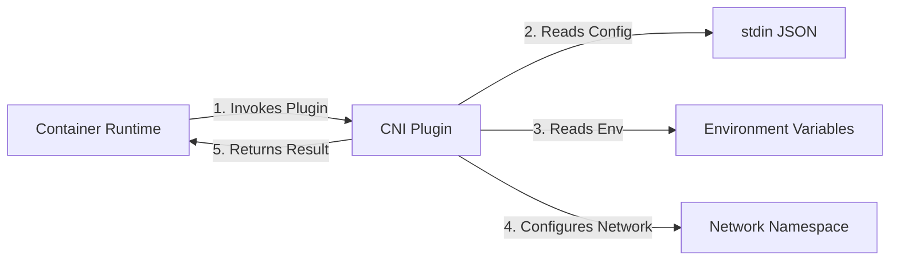
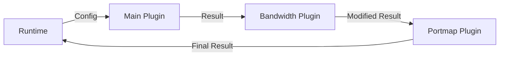
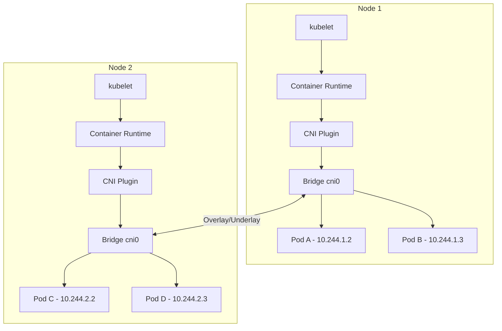

# How to Create Kubernetes CNI Plugins

Author: [nawazdhandala](https://github.com/nawazdhandala)

Tags: Kubernetes, CNI, Networking, Plugins

Description: Learn to implement CNI plugins for custom network configuration with ADD, DEL, and CHECK operations for specialized networking requirements.

---

Container Network Interface (CNI) plugins are the backbone of Kubernetes networking. They handle the critical task of connecting containers to networks, assigning IP addresses, and managing network policies. While many production-ready CNI plugins exist (Calico, Flannel, Cilium), understanding how to build your own gives you the power to implement custom networking solutions tailored to your specific requirements.

## Understanding the CNI Specification

The CNI specification defines a standard interface between container runtimes and network plugins. At its core, CNI is remarkably simple - plugins are executable programs that receive configuration via stdin and environment variables, then perform network operations.



### CNI Operations

Every CNI plugin must implement three core operations:

| Operation | Purpose | When Called |
|-----------|---------|-------------|
| ADD | Set up network for a container | Container creation |
| DEL | Tear down network for a container | Container deletion |
| CHECK | Verify network configuration | Health checks |

The runtime communicates the desired operation through the `CNI_COMMAND` environment variable.

### Environment Variables

CNI plugins receive context through these environment variables:

```bash
CNI_COMMAND      # ADD, DEL, or CHECK
CNI_CONTAINERID  # Unique container identifier
CNI_NETNS        # Path to network namespace (e.g., /var/run/netns/cni-xxx)
CNI_IFNAME       # Interface name to create (e.g., eth0)
CNI_ARGS         # Extra arguments (semicolon-separated key=value pairs)
CNI_PATH         # Paths to search for CNI plugin executables
```

## Plugin Configuration Format

CNI plugins receive their configuration as JSON through stdin. Here is a typical configuration structure:

```json
{
  "cniVersion": "1.0.0",
  "name": "my-custom-network",
  "type": "my-cni-plugin",
  "bridge": "cni0",
  "subnet": "10.244.0.0/16",
  "gateway": "10.244.0.1",
  "mtu": 1500,
  "ipam": {
    "type": "host-local",
    "subnet": "10.244.0.0/24",
    "routes": [
      { "dst": "0.0.0.0/0" }
    ]
  }
}
```

### Configuration Fields Explained

- **cniVersion**: The CNI spec version (use "1.0.0" for latest)
- **name**: Network name for identification
- **type**: Plugin executable name
- **ipam**: IP Address Management configuration (can delegate to another plugin)

## Building a Basic CNI Plugin in Go

Let us build a functional CNI plugin that creates a veth pair and connects containers to a bridge. We will use the official CNI library which handles much of the boilerplate.

### Project Structure

```
my-cni-plugin/
├── main.go
├── go.mod
├── pkg/
│   ├── config/
│   │   └── config.go
│   ├── network/
│   │   └── bridge.go
│   └── ipam/
│       └── ipam.go
└── conf/
    └── 10-my-cni.conflist
```

### Step 1: Define the Configuration

First, create the configuration parser:

```go
// pkg/config/config.go
package config

import (
    "encoding/json"
    "fmt"

    "github.com/containernetworking/cni/pkg/types"
)

// PluginConfig holds the CNI plugin configuration
type PluginConfig struct {
    types.NetConf

    // Custom fields for our plugin
    BridgeName string `json:"bridge"`
    Subnet     string `json:"subnet"`
    Gateway    string `json:"gateway"`
    MTU        int    `json:"mtu"`
}

// LoadConfig parses the CNI configuration from stdin
func LoadConfig(stdin []byte) (*PluginConfig, error) {
    config := &PluginConfig{}

    if err := json.Unmarshal(stdin, config); err != nil {
        return nil, fmt.Errorf("failed to parse config: %v", err)
    }

    // Set defaults
    if config.BridgeName == "" {
        config.BridgeName = "cni0"
    }
    if config.MTU == 0 {
        config.MTU = 1500
    }

    return config, nil
}
```

### Step 2: Implement Network Operations

Create the bridge and veth management code:

```go
// pkg/network/bridge.go
package network

import (
    "fmt"
    "net"

    "github.com/vishvananda/netlink"
)

// Bridge represents a Linux bridge interface
type Bridge struct {
    Name string
    MTU  int
}

// EnsureBridge creates the bridge if it does not exist
func (b *Bridge) EnsureBridge(gateway net.IP, subnet *net.IPNet) (*netlink.Bridge, error) {
    // Check if bridge already exists
    link, err := netlink.LinkByName(b.Name)
    if err == nil {
        if br, ok := link.(*netlink.Bridge); ok {
            return br, nil
        }
        return nil, fmt.Errorf("%s exists but is not a bridge", b.Name)
    }

    // Create new bridge
    br := &netlink.Bridge{
        LinkAttrs: netlink.LinkAttrs{
            Name:   b.Name,
            MTU:    b.MTU,
            TxQLen: -1,
        },
    }

    if err := netlink.LinkAdd(br); err != nil {
        return nil, fmt.Errorf("failed to create bridge %s: %v", b.Name, err)
    }

    // Assign gateway IP to bridge
    addr := &netlink.Addr{
        IPNet: &net.IPNet{
            IP:   gateway,
            Mask: subnet.Mask,
        },
    }
    if err := netlink.AddrAdd(br, addr); err != nil {
        return nil, fmt.Errorf("failed to assign IP to bridge: %v", err)
    }

    // Bring bridge up
    if err := netlink.LinkSetUp(br); err != nil {
        return nil, fmt.Errorf("failed to bring bridge up: %v", err)
    }

    return br, nil
}

// CreateVethPair creates a veth pair for container connectivity
func CreateVethPair(containerIfName, hostIfName string, mtu int) (
    *netlink.Veth, *netlink.Veth, error) {

    // Create the veth pair
    veth := &netlink.Veth{
        LinkAttrs: netlink.LinkAttrs{
            Name: hostIfName,
            MTU:  mtu,
        },
        PeerName: containerIfName,
    }

    if err := netlink.LinkAdd(veth); err != nil {
        return nil, nil, fmt.Errorf("failed to create veth pair: %v", err)
    }

    // Get references to both ends
    hostVeth, err := netlink.LinkByName(hostIfName)
    if err != nil {
        return nil, nil, err
    }

    containerVeth, err := netlink.LinkByName(containerIfName)
    if err != nil {
        return nil, nil, err
    }

    return hostVeth.(*netlink.Veth), containerVeth.(*netlink.Veth), nil
}

// AttachToBridge connects a veth interface to a bridge
func AttachToBridge(bridge *netlink.Bridge, veth netlink.Link) error {
    if err := netlink.LinkSetMaster(veth, bridge); err != nil {
        return fmt.Errorf("failed to attach veth to bridge: %v", err)
    }
    return netlink.LinkSetUp(veth)
}
```

### Step 3: Implement the Main Plugin Logic

Now implement the core CNI operations:

```go
// main.go
package main

import (
    "encoding/json"
    "fmt"
    "net"
    "runtime"

    "github.com/containernetworking/cni/pkg/skel"
    "github.com/containernetworking/cni/pkg/types"
    current "github.com/containernetworking/cni/pkg/types/100"
    "github.com/containernetworking/cni/pkg/version"
    "github.com/containernetworking/plugins/pkg/ip"
    "github.com/containernetworking/plugins/pkg/ipam"
    "github.com/containernetworking/plugins/pkg/ns"
    "github.com/vishvananda/netlink"

    "my-cni-plugin/pkg/config"
    "my-cni-plugin/pkg/network"
)

func main() {
    skel.PluginMain(cmdAdd, cmdCheck, cmdDel, version.All, "my-cni-plugin v1.0.0")
}

// cmdAdd handles the ADD operation
func cmdAdd(args *skel.CmdArgs) error {
    // Parse configuration
    cfg, err := config.LoadConfig(args.StdinData)
    if err != nil {
        return err
    }

    // Parse subnet and gateway
    _, subnet, err := net.ParseCIDR(cfg.Subnet)
    if err != nil {
        return fmt.Errorf("invalid subnet: %v", err)
    }
    gateway := net.ParseIP(cfg.Gateway)

    // Create or get bridge
    bridge := &network.Bridge{Name: cfg.BridgeName, MTU: cfg.MTU}
    br, err := bridge.EnsureBridge(gateway, subnet)
    if err != nil {
        return err
    }

    // Get the container network namespace
    netns, err := ns.GetNS(args.Netns)
    if err != nil {
        return fmt.Errorf("failed to open netns %q: %v", args.Netns, err)
    }
    defer netns.Close()

    // Generate unique veth names
    hostIfName := "veth" + args.ContainerID[:8]

    // Create veth pair
    hostVeth, containerVeth, err := network.CreateVethPair(args.IfName, hostIfName, cfg.MTU)
    if err != nil {
        return err
    }

    // Move container end into namespace
    if err := netlink.LinkSetNsFd(containerVeth, int(netns.Fd())); err != nil {
        return fmt.Errorf("failed to move veth to container ns: %v", err)
    }

    // Attach host end to bridge
    if err := network.AttachToBridge(br, hostVeth); err != nil {
        return err
    }

    // Run IPAM plugin to get IP address
    r, err := ipam.ExecAdd(cfg.IPAM.Type, args.StdinData)
    if err != nil {
        return fmt.Errorf("IPAM allocation failed: %v", err)
    }

    // Convert result to current version
    result, err := current.NewResultFromResult(r)
    if err != nil {
        return err
    }

    // Configure the container interface
    err = netns.Do(func(_ ns.NetNS) error {
        link, err := netlink.LinkByName(args.IfName)
        if err != nil {
            return err
        }

        // Add IP address
        for _, ipc := range result.IPs {
            addr := &netlink.Addr{IPNet: &ipc.Address}
            if err := netlink.AddrAdd(link, addr); err != nil {
                return fmt.Errorf("failed to add IP: %v", err)
            }
        }

        // Bring interface up
        if err := netlink.LinkSetUp(link); err != nil {
            return err
        }

        // Add default route
        if err := ip.AddDefaultRoute(gateway, link); err != nil {
            return fmt.Errorf("failed to add default route: %v", err)
        }

        return nil
    })

    if err != nil {
        return err
    }

    // Return the result
    return types.PrintResult(result, cfg.CNIVersion)
}

// cmdDel handles the DEL operation
func cmdDel(args *skel.CmdArgs) error {
    cfg, err := config.LoadConfig(args.StdinData)
    if err != nil {
        return err
    }

    // Release IP via IPAM
    if cfg.IPAM.Type != "" {
        if err := ipam.ExecDel(cfg.IPAM.Type, args.StdinData); err != nil {
            return fmt.Errorf("IPAM deletion failed: %v", err)
        }
    }

    // If no netns, interface is already gone
    if args.Netns == "" {
        return nil
    }

    // Delete the veth pair (deleting one end removes both)
    netns, err := ns.GetNS(args.Netns)
    if err != nil {
        // Namespace already gone, nothing to do
        return nil
    }
    defer netns.Close()

    err = netns.Do(func(_ ns.NetNS) error {
        link, err := netlink.LinkByName(args.IfName)
        if err != nil {
            // Interface already gone
            return nil
        }
        return netlink.LinkDel(link)
    })

    return err
}

// cmdCheck handles the CHECK operation
func cmdCheck(args *skel.CmdArgs) error {
    cfg, err := config.LoadConfig(args.StdinData)
    if err != nil {
        return err
    }

    // Verify bridge exists
    _, err = netlink.LinkByName(cfg.BridgeName)
    if err != nil {
        return fmt.Errorf("bridge %s not found: %v", cfg.BridgeName, err)
    }

    // Verify container interface exists
    netns, err := ns.GetNS(args.Netns)
    if err != nil {
        return fmt.Errorf("failed to open netns: %v", err)
    }
    defer netns.Close()

    err = netns.Do(func(_ ns.NetNS) error {
        link, err := netlink.LinkByName(args.IfName)
        if err != nil {
            return fmt.Errorf("interface %s not found: %v", args.IfName, err)
        }

        // Verify interface is up
        if link.Attrs().OperState != netlink.OperUp {
            return fmt.Errorf("interface %s is not up", args.IfName)
        }

        return nil
    })

    return err
}

func init() {
    // Lock OS thread for network namespace operations
    runtime.LockOSThread()
}
```

## CNI Plugin Result Format

When a plugin successfully completes an ADD operation, it must return a JSON result:

```json
{
  "cniVersion": "1.0.0",
  "interfaces": [
    {
      "name": "eth0",
      "mac": "02:42:ac:11:00:02",
      "sandbox": "/var/run/netns/cni-12345"
    },
    {
      "name": "veth12345678",
      "mac": "02:42:ac:11:00:01"
    }
  ],
  "ips": [
    {
      "address": "10.244.1.5/24",
      "gateway": "10.244.1.1",
      "interface": 0
    }
  ],
  "routes": [
    {
      "dst": "0.0.0.0/0",
      "gw": "10.244.1.1"
    }
  ],
  "dns": {
    "nameservers": ["10.96.0.10"],
    "domain": "cluster.local",
    "search": ["default.svc.cluster.local", "svc.cluster.local"]
  }
}
```

## IPAM (IP Address Management)

IPAM plugins handle IP address allocation. You can use existing IPAM plugins or create your own.

### Using Host-Local IPAM

The `host-local` plugin stores allocations in files on the local filesystem:

```json
{
  "ipam": {
    "type": "host-local",
    "ranges": [
      [
        {
          "subnet": "10.244.0.0/24",
          "rangeStart": "10.244.0.10",
          "rangeEnd": "10.244.0.250",
          "gateway": "10.244.0.1"
        }
      ]
    ],
    "routes": [
      { "dst": "0.0.0.0/0" }
    ],
    "dataDir": "/var/lib/cni/networks"
  }
}
```

### Custom IPAM Implementation

Here is how to create a simple IPAM plugin:

```go
// ipam/main.go
package main

import (
    "encoding/json"
    "fmt"
    "net"
    "os"
    "path/filepath"
    "sync"

    "github.com/containernetworking/cni/pkg/skel"
    "github.com/containernetworking/cni/pkg/types"
    current "github.com/containernetworking/cni/pkg/types/100"
    "github.com/containernetworking/cni/pkg/version"
)

var (
    dataDir = "/var/lib/cni/my-ipam"
    mutex   sync.Mutex
)

type IPAMConfig struct {
    types.NetConf
    Subnet  string `json:"subnet"`
    Gateway string `json:"gateway"`
}

func main() {
    skel.PluginMain(cmdAdd, cmdCheck, cmdDel, version.All, "my-ipam v1.0.0")
}

func cmdAdd(args *skel.CmdArgs) error {
    mutex.Lock()
    defer mutex.Unlock()

    cfg := &IPAMConfig{}
    if err := json.Unmarshal(args.StdinData, cfg); err != nil {
        return err
    }

    _, subnet, err := net.ParseCIDR(cfg.Subnet)
    if err != nil {
        return err
    }

    // Find next available IP
    ip, err := allocateIP(cfg.Name, subnet, args.ContainerID)
    if err != nil {
        return err
    }

    gateway := net.ParseIP(cfg.Gateway)

    result := &current.Result{
        CNIVersion: cfg.CNIVersion,
        IPs: []*current.IPConfig{
            {
                Address: net.IPNet{IP: ip, Mask: subnet.Mask},
                Gateway: gateway,
            },
        },
        Routes: []*types.Route{
            {Dst: net.IPNet{IP: net.IPv4zero, Mask: net.CIDRMask(0, 32)}, GW: gateway},
        },
    }

    return types.PrintResult(result, cfg.CNIVersion)
}

func allocateIP(networkName string, subnet *net.IPNet, containerID string) (net.IP, error) {
    dir := filepath.Join(dataDir, networkName)
    os.MkdirAll(dir, 0755)

    // Get all allocated IPs
    allocated := make(map[string]bool)
    files, _ := os.ReadDir(dir)
    for _, f := range files {
        allocated[f.Name()] = true
    }

    // Find available IP in subnet
    ip := subnet.IP.Mask(subnet.Mask)
    for ip = incrementIP(ip); subnet.Contains(ip); ip = incrementIP(ip) {
        ipStr := ip.String()
        if !allocated[ipStr] {
            // Claim this IP
            os.WriteFile(filepath.Join(dir, ipStr), []byte(containerID), 0644)
            return ip, nil
        }
    }

    return nil, fmt.Errorf("no available IPs in subnet %s", subnet)
}

func incrementIP(ip net.IP) net.IP {
    result := make(net.IP, len(ip))
    copy(result, ip)
    for i := len(result) - 1; i >= 0; i-- {
        result[i]++
        if result[i] > 0 {
            break
        }
    }
    return result
}

func cmdDel(args *skel.CmdArgs) error {
    // Release allocated IP
    cfg := &IPAMConfig{}
    json.Unmarshal(args.StdinData, cfg)

    dir := filepath.Join(dataDir, cfg.Name)
    files, _ := os.ReadDir(dir)
    for _, f := range files {
        path := filepath.Join(dir, f.Name())
        data, _ := os.ReadFile(path)
        if string(data) == args.ContainerID {
            os.Remove(path)
            break
        }
    }
    return nil
}

func cmdCheck(args *skel.CmdArgs) error {
    return nil
}
```

## Plugin Chaining

CNI supports chaining multiple plugins together. Each plugin receives the result of the previous plugin and can modify it.



### Conflist Format

Plugin chains are defined using a conflist file:

```json
{
  "cniVersion": "1.0.0",
  "name": "my-network-chain",
  "plugins": [
    {
      "type": "my-cni-plugin",
      "bridge": "cni0",
      "subnet": "10.244.0.0/16",
      "gateway": "10.244.0.1",
      "ipam": {
        "type": "host-local",
        "subnet": "10.244.0.0/24"
      }
    },
    {
      "type": "bandwidth",
      "ingressRate": 1000000,
      "ingressBurst": 1500000,
      "egressRate": 1000000,
      "egressBurst": 1500000
    },
    {
      "type": "portmap",
      "capabilities": {
        "portMappings": true
      }
    }
  ]
}
```

### Handling Previous Results

When your plugin is part of a chain, you receive the previous plugin's result:

```go
func cmdAdd(args *skel.CmdArgs) error {
    cfg, err := config.LoadConfig(args.StdinData)
    if err != nil {
        return err
    }

    // Check for previous result (we are in a chain)
    var prevResult *current.Result
    if cfg.PrevResult != nil {
        prevResult, err = current.NewResultFromResult(cfg.PrevResult)
        if err != nil {
            return fmt.Errorf("failed to parse prevResult: %v", err)
        }
    }

    // Modify or use the previous result
    if prevResult != nil {
        // Add our modifications
        prevResult.Interfaces = append(prevResult.Interfaces, &current.Interface{
            Name: "my-added-interface",
        })
    }

    // Continue with your plugin logic...

    return types.PrintResult(prevResult, cfg.CNIVersion)
}
```

## Testing Your CNI Plugin

### Unit Testing

Create comprehensive tests for your plugin:

```go
// main_test.go
package main

import (
    "encoding/json"
    "testing"

    "github.com/containernetworking/cni/pkg/skel"
    current "github.com/containernetworking/cni/pkg/types/100"
    "github.com/containernetworking/plugins/pkg/ns"
    "github.com/containernetworking/plugins/pkg/testutils"
)

func TestCmdAdd(t *testing.T) {
    // Create a test network namespace
    targetNS, err := testutils.NewNS()
    if err != nil {
        t.Fatalf("Failed to create test namespace: %v", err)
    }
    defer targetNS.Close()

    conf := `{
        "cniVersion": "1.0.0",
        "name": "test-network",
        "type": "my-cni-plugin",
        "bridge": "test-br0",
        "subnet": "10.244.0.0/24",
        "gateway": "10.244.0.1",
        "ipam": {
            "type": "host-local",
            "subnet": "10.244.0.0/24"
        }
    }`

    args := &skel.CmdArgs{
        ContainerID: "test-container-12345",
        Netns:       targetNS.Path(),
        IfName:      "eth0",
        StdinData:   []byte(conf),
    }

    // Run cmdAdd
    err = cmdAdd(args)
    if err != nil {
        t.Fatalf("cmdAdd failed: %v", err)
    }

    // Verify interface was created in namespace
    err = targetNS.Do(func(ns.NetNS) error {
        link, err := netlink.LinkByName("eth0")
        if err != nil {
            return err
        }
        if link.Attrs().OperState != netlink.OperUp {
            return fmt.Errorf("interface not up")
        }
        return nil
    })
    if err != nil {
        t.Fatalf("Interface verification failed: %v", err)
    }
}
```

### Manual Testing with CNI Tool

Use the `cnitool` for manual testing:

```bash
# Build your plugin
go build -o /opt/cni/bin/my-cni-plugin .

# Create a test configuration
cat > /etc/cni/net.d/10-my-cni.conf << EOF
{
  "cniVersion": "1.0.0",
  "name": "my-test-network",
  "type": "my-cni-plugin",
  "bridge": "cni0",
  "subnet": "10.244.0.0/24",
  "gateway": "10.244.0.1",
  "ipam": {
    "type": "host-local",
    "subnet": "10.244.0.0/24"
  }
}
EOF

# Create a test network namespace
ip netns add test-ns

# Test ADD
CNI_PATH=/opt/cni/bin cnitool add my-test-network /var/run/netns/test-ns

# Verify
ip netns exec test-ns ip addr show

# Test DEL
CNI_PATH=/opt/cni/bin cnitool del my-test-network /var/run/netns/test-ns

# Cleanup
ip netns del test-ns
```

## Deploying to Kubernetes

### Building and Distributing

Create a Dockerfile for your plugin:

```dockerfile
FROM golang:1.21-alpine AS builder

WORKDIR /build
COPY . .
RUN CGO_ENABLED=0 go build -o my-cni-plugin .

FROM alpine:3.19
COPY --from=builder /build/my-cni-plugin /opt/cni/bin/
```

### DaemonSet for Installation

Deploy your plugin across all nodes:

```yaml
apiVersion: apps/v1
kind: DaemonSet
metadata:
  name: my-cni-plugin
  namespace: kube-system
spec:
  selector:
    matchLabels:
      app: my-cni-plugin
  template:
    metadata:
      labels:
        app: my-cni-plugin
    spec:
      hostNetwork: true
      tolerations:
        - operator: Exists
      containers:
        - name: install-cni
          image: my-registry/my-cni-plugin:v1.0.0
          command:
            - /bin/sh
            - -c
            - |
              cp /opt/cni/bin/my-cni-plugin /host/opt/cni/bin/
              cp /config/10-my-cni.conflist /host/etc/cni/net.d/
              sleep infinity
          volumeMounts:
            - name: cni-bin
              mountPath: /host/opt/cni/bin
            - name: cni-conf
              mountPath: /host/etc/cni/net.d
            - name: config
              mountPath: /config
      volumes:
        - name: cni-bin
          hostPath:
            path: /opt/cni/bin
        - name: cni-conf
          hostPath:
            path: /etc/cni/net.d
        - name: config
          configMap:
            name: my-cni-config
---
apiVersion: v1
kind: ConfigMap
metadata:
  name: my-cni-config
  namespace: kube-system
data:
  10-my-cni.conflist: |
    {
      "cniVersion": "1.0.0",
      "name": "my-custom-network",
      "plugins": [
        {
          "type": "my-cni-plugin",
          "bridge": "cni0",
          "subnet": "10.244.0.0/16",
          "gateway": "10.244.0.1",
          "ipam": {
            "type": "host-local",
            "ranges": [
              [{"subnet": "10.244.0.0/24"}]
            ],
            "routes": [{"dst": "0.0.0.0/0"}]
          }
        },
        {
          "type": "portmap",
          "capabilities": {"portMappings": true}
        }
      ]
    }
```

## Error Handling Best Practices

CNI plugins must return errors in a specific format:

```go
func returnError(err error, code uint) error {
    e := &types.Error{
        Code:    code,
        Msg:     err.Error(),
        Details: "",
    }
    return e
}

// Common error codes:
// 1  - Incompatible CNI version
// 2  - Unsupported field in network configuration
// 3  - Container unknown or does not exist
// 4  - Invalid environment variables
// 5  - I/O failure
// 6  - Failed to decode content
// 11 - Try again later
```

## Architecture Overview

Here is how CNI plugins fit into the Kubernetes networking architecture:



## Summary

Creating custom CNI plugins gives you complete control over container networking in Kubernetes. The key concepts to remember are:

1. **CNI Specification** - Understand the three operations (ADD, DEL, CHECK) and how plugins receive configuration
2. **Plugin Structure** - Use the official CNI libraries to handle protocol details
3. **IPAM Integration** - Either use existing IPAM plugins or implement your own
4. **Plugin Chaining** - Design plugins to work in chains with other plugins
5. **Testing** - Thoroughly test plugins before deploying to production
6. **Deployment** - Use DaemonSets to distribute plugins across cluster nodes

With this foundation, you can implement specialized networking solutions such as:

- Multi-tenant network isolation
- Hardware acceleration integration (SR-IOV, DPDK)
- Custom overlay networks
- Network policy enforcement
- Service mesh integration

The CNI ecosystem provides a flexible framework that adapts to virtually any networking requirement your Kubernetes clusters might have.
