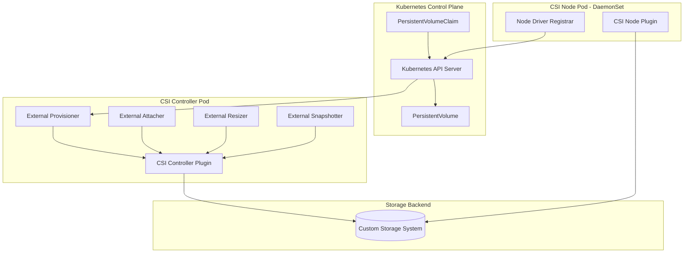
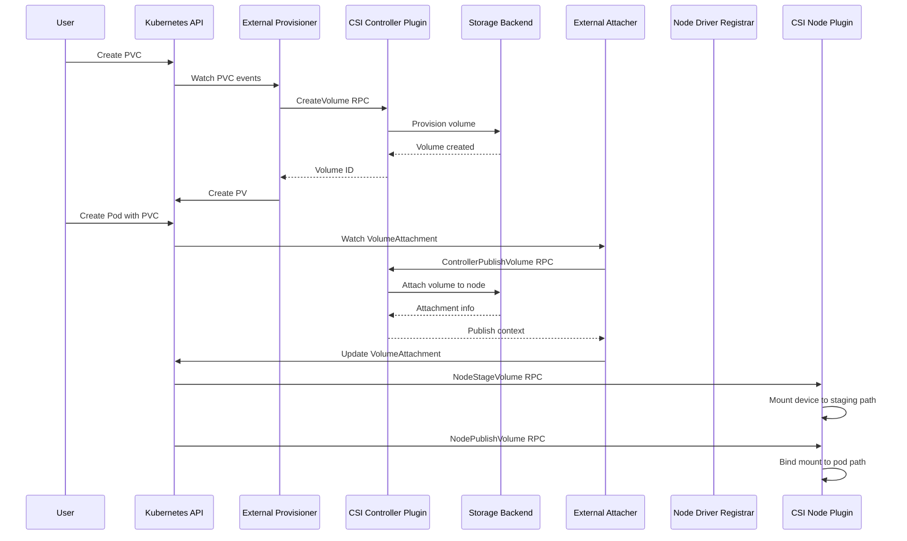
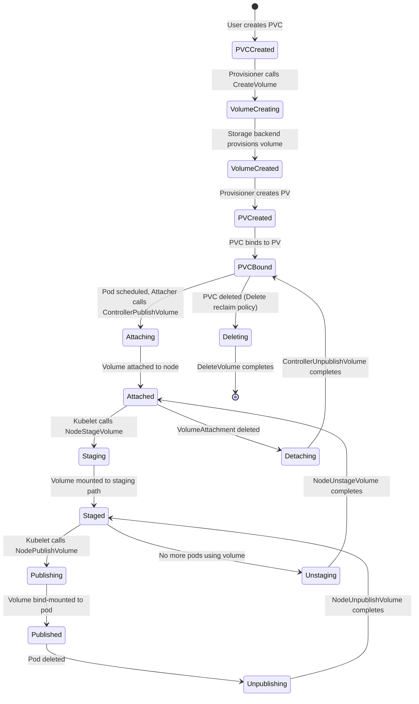

# How to Build Kubernetes CSI Drivers

Author: [nawazdhandala](https://github.com/nawazdhandala)

Tags: Kubernetes, CSI, Storage, Drivers

Description: Learn to implement CSI drivers for custom storage backends with identity, controller, and node services for persistent volume management.

---

## Introduction

The Container Storage Interface (CSI) is a standard for exposing arbitrary block and file storage systems to containerized workloads on Kubernetes. Before CSI, adding support for a new storage system required modifying the core Kubernetes codebase - a process that was slow, error-prone, and created tight coupling between storage vendors and Kubernetes releases.

CSI decouples storage plugins from the Kubernetes core, allowing storage providers to develop and deploy their drivers independently. This guide walks you through building a CSI driver from scratch for your custom storage backend.

## Understanding the CSI Architecture

A CSI driver consists of three main gRPC services that run as separate components in your Kubernetes cluster:



### The Three CSI Services

1. **Identity Service** - Provides driver identification and capability information
2. **Controller Service** - Handles volume provisioning, deletion, attachment, and snapshots
3. **Node Service** - Manages volume mounting and unmounting on individual nodes

## CSI Specification Overview

The CSI spec defines the gRPC interfaces your driver must implement. Let's examine the protocol buffer definitions for each service.

### Identity Service RPCs

```protobuf
service Identity {
  rpc GetPluginInfo(GetPluginInfoRequest)
    returns (GetPluginInfoResponse) {}

  rpc GetPluginCapabilities(GetPluginCapabilitiesRequest)
    returns (GetPluginCapabilitiesResponse) {}

  rpc Probe(ProbeRequest)
    returns (ProbeResponse) {}
}
```

### Controller Service RPCs

```protobuf
service Controller {
  rpc CreateVolume(CreateVolumeRequest)
    returns (CreateVolumeResponse) {}

  rpc DeleteVolume(DeleteVolumeRequest)
    returns (DeleteVolumeResponse) {}

  rpc ControllerPublishVolume(ControllerPublishVolumeRequest)
    returns (ControllerPublishVolumeResponse) {}

  rpc ControllerUnpublishVolume(ControllerUnpublishVolumeRequest)
    returns (ControllerUnpublishVolumeResponse) {}

  rpc ValidateVolumeCapabilities(ValidateVolumeCapabilitiesRequest)
    returns (ValidateVolumeCapabilitiesResponse) {}

  rpc ListVolumes(ListVolumesRequest)
    returns (ListVolumesResponse) {}

  rpc GetCapacity(GetCapacityRequest)
    returns (GetCapacityResponse) {}

  rpc ControllerGetCapabilities(ControllerGetCapabilitiesRequest)
    returns (ControllerGetCapabilitiesResponse) {}

  rpc CreateSnapshot(CreateSnapshotRequest)
    returns (CreateSnapshotResponse) {}

  rpc DeleteSnapshot(DeleteSnapshotRequest)
    returns (DeleteSnapshotResponse) {}

  rpc ListSnapshots(ListSnapshotsRequest)
    returns (ListSnapshotsResponse) {}

  rpc ControllerExpandVolume(ControllerExpandVolumeRequest)
    returns (ControllerExpandVolumeResponse) {}
}
```

### Node Service RPCs

```protobuf
service Node {
  rpc NodeStageVolume(NodeStageVolumeRequest)
    returns (NodeStageVolumeResponse) {}

  rpc NodeUnstageVolume(NodeUnstageVolumeRequest)
    returns (NodeUnstageVolumeResponse) {}

  rpc NodePublishVolume(NodePublishVolumeRequest)
    returns (NodePublishVolumeResponse) {}

  rpc NodeUnpublishVolume(NodeUnpublishVolumeRequest)
    returns (NodeUnpublishVolumeResponse) {}

  rpc NodeGetVolumeStats(NodeGetVolumeStatsRequest)
    returns (NodeGetVolumeStatsResponse) {}

  rpc NodeExpandVolume(NodeExpandVolumeRequest)
    returns (NodeExpandVolumeResponse) {}

  rpc NodeGetCapabilities(NodeGetCapabilitiesRequest)
    returns (NodeGetCapabilitiesResponse) {}

  rpc NodeGetInfo(NodeGetInfoRequest)
    returns (NodeGetInfoResponse) {}
}
```

## Project Setup

Let's create a CSI driver for a hypothetical custom storage backend. We'll use Go, which is the most common language for CSI driver development.

### Directory Structure

```
my-csi-driver/
├── cmd/
│   └── my-csi-driver/
│       └── main.go
├── pkg/
│   ├── driver/
│   │   ├── driver.go
│   │   ├── identity.go
│   │   ├── controller.go
│   │   └── node.go
│   └── storage/
│       └── client.go
├── deploy/
│   ├── kubernetes/
│   │   ├── csi-controller.yaml
│   │   ├── csi-node.yaml
│   │   ├── csi-driver.yaml
│   │   └── storageclass.yaml
│   └── docker/
│       └── Dockerfile
├── go.mod
└── go.sum
```

### Dependencies

Create your `go.mod` file:

```go
module github.com/yourusername/my-csi-driver

go 1.21

require (
    github.com/container-storage-interface/spec v1.9.0
    google.golang.org/grpc v1.60.0
    k8s.io/klog/v2 v2.110.1
    k8s.io/mount-utils v0.29.0
)
```

## Implementing the Identity Service

The Identity Service is the simplest of the three services. It provides basic information about your driver.

```go
// pkg/driver/identity.go
package driver

import (
    "context"

    "github.com/container-storage-interface/spec/lib/go/csi"
    "google.golang.org/grpc/codes"
    "google.golang.org/grpc/status"
)

// GetPluginInfo returns metadata about the CSI plugin
func (d *Driver) GetPluginInfo(ctx context.Context, req *csi.GetPluginInfoRequest) (*csi.GetPluginInfoResponse, error) {
    if d.name == "" {
        return nil, status.Error(codes.Unavailable, "driver name not configured")
    }

    if d.version == "" {
        return nil, status.Error(codes.Unavailable, "driver version not configured")
    }

    return &csi.GetPluginInfoResponse{
        Name:          d.name,
        VendorVersion: d.version,
    }, nil
}

// GetPluginCapabilities returns the capabilities of the CSI plugin
func (d *Driver) GetPluginCapabilities(ctx context.Context, req *csi.GetPluginCapabilitiesRequest) (*csi.GetPluginCapabilitiesResponse, error) {
    capabilities := []*csi.PluginCapability{
        {
            Type: &csi.PluginCapability_Service_{
                Service: &csi.PluginCapability_Service{
                    Type: csi.PluginCapability_Service_CONTROLLER_SERVICE,
                },
            },
        },
        {
            Type: &csi.PluginCapability_Service_{
                Service: &csi.PluginCapability_Service{
                    Type: csi.PluginCapability_Service_VOLUME_ACCESSIBILITY_CONSTRAINTS,
                },
            },
        },
        {
            Type: &csi.PluginCapability_VolumeExpansion_{
                VolumeExpansion: &csi.PluginCapability_VolumeExpansion{
                    Type: csi.PluginCapability_VolumeExpansion_ONLINE,
                },
            },
        },
    }

    return &csi.GetPluginCapabilitiesResponse{
        Capabilities: capabilities,
    }, nil
}

// Probe checks if the plugin is healthy and ready to serve requests
func (d *Driver) Probe(ctx context.Context, req *csi.ProbeRequest) (*csi.ProbeResponse, error) {
    // Check if the storage backend is reachable
    if err := d.storageClient.HealthCheck(ctx); err != nil {
        return nil, status.Errorf(codes.FailedPrecondition, "storage backend unhealthy: %v", err)
    }

    return &csi.ProbeResponse{
        Ready: &wrapperspb.BoolValue{Value: true},
    }, nil
}
```

## Implementing the Controller Service

The Controller Service handles volume lifecycle operations. This is where you interact with your storage backend to create, delete, and manage volumes.

```go
// pkg/driver/controller.go
package driver

import (
    "context"
    "fmt"

    "github.com/container-storage-interface/spec/lib/go/csi"
    "google.golang.org/grpc/codes"
    "google.golang.org/grpc/status"
    "k8s.io/klog/v2"
)

// CreateVolume provisions a new volume on the storage backend
func (d *Driver) CreateVolume(ctx context.Context, req *csi.CreateVolumeRequest) (*csi.CreateVolumeResponse, error) {
    // Validate request parameters
    if req.GetName() == "" {
        return nil, status.Error(codes.InvalidArgument, "volume name is required")
    }

    if len(req.GetVolumeCapabilities()) == 0 {
        return nil, status.Error(codes.InvalidArgument, "volume capabilities are required")
    }

    // Extract capacity - default to minimum if not specified
    capacityBytes := int64(1 * 1024 * 1024 * 1024) // 1 GiB default
    if capRange := req.GetCapacityRange(); capRange != nil {
        if capRange.GetRequiredBytes() > 0 {
            capacityBytes = capRange.GetRequiredBytes()
        }
    }

    // Extract parameters from StorageClass
    params := req.GetParameters()
    storagePool := params["storagePool"]
    if storagePool == "" {
        storagePool = "default"
    }

    // Check for idempotency - volume might already exist
    existingVolume, err := d.storageClient.GetVolume(ctx, req.GetName())
    if err == nil && existingVolume != nil {
        // Volume exists - verify it matches the request
        if existingVolume.SizeBytes >= capacityBytes {
            klog.Infof("Volume %s already exists with sufficient capacity", req.GetName())
            return &csi.CreateVolumeResponse{
                Volume: &csi.Volume{
                    VolumeId:      existingVolume.ID,
                    CapacityBytes: existingVolume.SizeBytes,
                    VolumeContext: map[string]string{
                        "storagePool": existingVolume.StoragePool,
                    },
                },
            }, nil
        }
        return nil, status.Errorf(codes.AlreadyExists,
            "volume %s exists but with smaller capacity", req.GetName())
    }

    // Create the volume on the storage backend
    klog.Infof("Creating volume %s with capacity %d bytes in pool %s",
        req.GetName(), capacityBytes, storagePool)

    volume, err := d.storageClient.CreateVolume(ctx, &storage.CreateVolumeRequest{
        Name:        req.GetName(),
        SizeBytes:   capacityBytes,
        StoragePool: storagePool,
    })
    if err != nil {
        return nil, status.Errorf(codes.Internal, "failed to create volume: %v", err)
    }

    // Handle volume content source (clone or snapshot restore)
    if contentSource := req.GetVolumeContentSource(); contentSource != nil {
        switch source := contentSource.GetType().(type) {
        case *csi.VolumeContentSource_Snapshot:
            snapshotID := source.Snapshot.GetSnapshotId()
            if err := d.storageClient.RestoreSnapshot(ctx, snapshotID, volume.ID); err != nil {
                // Cleanup on failure
                d.storageClient.DeleteVolume(ctx, volume.ID)
                return nil, status.Errorf(codes.Internal,
                    "failed to restore snapshot: %v", err)
            }
        case *csi.VolumeContentSource_Volume:
            sourceVolumeID := source.Volume.GetVolumeId()
            if err := d.storageClient.CloneVolume(ctx, sourceVolumeID, volume.ID); err != nil {
                d.storageClient.DeleteVolume(ctx, volume.ID)
                return nil, status.Errorf(codes.Internal,
                    "failed to clone volume: %v", err)
            }
        }
    }

    return &csi.CreateVolumeResponse{
        Volume: &csi.Volume{
            VolumeId:      volume.ID,
            CapacityBytes: volume.SizeBytes,
            VolumeContext: map[string]string{
                "storagePool": volume.StoragePool,
            },
            AccessibleTopology: []*csi.Topology{
                {
                    Segments: map[string]string{
                        "topology.my-csi-driver.io/zone": volume.Zone,
                    },
                },
            },
        },
    }, nil
}

// DeleteVolume removes a volume from the storage backend
func (d *Driver) DeleteVolume(ctx context.Context, req *csi.DeleteVolumeRequest) (*csi.DeleteVolumeResponse, error) {
    volumeID := req.GetVolumeId()
    if volumeID == "" {
        return nil, status.Error(codes.InvalidArgument, "volume ID is required")
    }

    klog.Infof("Deleting volume %s", volumeID)

    // Delete is idempotent - if volume doesn't exist, return success
    if err := d.storageClient.DeleteVolume(ctx, volumeID); err != nil {
        if !isNotFoundError(err) {
            return nil, status.Errorf(codes.Internal, "failed to delete volume: %v", err)
        }
        klog.Infof("Volume %s not found, assuming already deleted", volumeID)
    }

    return &csi.DeleteVolumeResponse{}, nil
}

// ControllerPublishVolume attaches a volume to a node
func (d *Driver) ControllerPublishVolume(ctx context.Context, req *csi.ControllerPublishVolumeRequest) (*csi.ControllerPublishVolumeResponse, error) {
    volumeID := req.GetVolumeId()
    nodeID := req.GetNodeId()

    if volumeID == "" {
        return nil, status.Error(codes.InvalidArgument, "volume ID is required")
    }
    if nodeID == "" {
        return nil, status.Error(codes.InvalidArgument, "node ID is required")
    }

    klog.Infof("Attaching volume %s to node %s", volumeID, nodeID)

    // Attach volume to the node
    attachment, err := d.storageClient.AttachVolume(ctx, volumeID, nodeID)
    if err != nil {
        return nil, status.Errorf(codes.Internal, "failed to attach volume: %v", err)
    }

    // Return publish context with device path or connection info
    return &csi.ControllerPublishVolumeResponse{
        PublishContext: map[string]string{
            "devicePath":   attachment.DevicePath,
            "targetPortal": attachment.TargetPortal,
            "targetIQN":    attachment.TargetIQN,
            "lun":          fmt.Sprintf("%d", attachment.LUN),
        },
    }, nil
}

// ControllerUnpublishVolume detaches a volume from a node
func (d *Driver) ControllerUnpublishVolume(ctx context.Context, req *csi.ControllerUnpublishVolumeRequest) (*csi.ControllerUnpublishVolumeResponse, error) {
    volumeID := req.GetVolumeId()
    nodeID := req.GetNodeId()

    if volumeID == "" {
        return nil, status.Error(codes.InvalidArgument, "volume ID is required")
    }

    klog.Infof("Detaching volume %s from node %s", volumeID, nodeID)

    if err := d.storageClient.DetachVolume(ctx, volumeID, nodeID); err != nil {
        if !isNotFoundError(err) {
            return nil, status.Errorf(codes.Internal, "failed to detach volume: %v", err)
        }
    }

    return &csi.ControllerUnpublishVolumeResponse{}, nil
}

// ControllerGetCapabilities returns the capabilities of the controller service
func (d *Driver) ControllerGetCapabilities(ctx context.Context, req *csi.ControllerGetCapabilitiesRequest) (*csi.ControllerGetCapabilitiesResponse, error) {
    capabilities := []csi.ControllerServiceCapability_RPC_Type{
        csi.ControllerServiceCapability_RPC_CREATE_DELETE_VOLUME,
        csi.ControllerServiceCapability_RPC_PUBLISH_UNPUBLISH_VOLUME,
        csi.ControllerServiceCapability_RPC_LIST_VOLUMES,
        csi.ControllerServiceCapability_RPC_GET_CAPACITY,
        csi.ControllerServiceCapability_RPC_CREATE_DELETE_SNAPSHOT,
        csi.ControllerServiceCapability_RPC_LIST_SNAPSHOTS,
        csi.ControllerServiceCapability_RPC_EXPAND_VOLUME,
        csi.ControllerServiceCapability_RPC_CLONE_VOLUME,
    }

    var caps []*csi.ControllerServiceCapability
    for _, cap := range capabilities {
        caps = append(caps, &csi.ControllerServiceCapability{
            Type: &csi.ControllerServiceCapability_Rpc{
                Rpc: &csi.ControllerServiceCapability_RPC{
                    Type: cap,
                },
            },
        })
    }

    return &csi.ControllerGetCapabilitiesResponse{
        Capabilities: caps,
    }, nil
}

// CreateSnapshot creates a snapshot of a volume
func (d *Driver) CreateSnapshot(ctx context.Context, req *csi.CreateSnapshotRequest) (*csi.CreateSnapshotResponse, error) {
    sourceVolumeID := req.GetSourceVolumeId()
    snapshotName := req.GetName()

    if sourceVolumeID == "" {
        return nil, status.Error(codes.InvalidArgument, "source volume ID is required")
    }
    if snapshotName == "" {
        return nil, status.Error(codes.InvalidArgument, "snapshot name is required")
    }

    klog.Infof("Creating snapshot %s from volume %s", snapshotName, sourceVolumeID)

    snapshot, err := d.storageClient.CreateSnapshot(ctx, &storage.CreateSnapshotRequest{
        Name:           snapshotName,
        SourceVolumeID: sourceVolumeID,
    })
    if err != nil {
        return nil, status.Errorf(codes.Internal, "failed to create snapshot: %v", err)
    }

    return &csi.CreateSnapshotResponse{
        Snapshot: &csi.Snapshot{
            SnapshotId:     snapshot.ID,
            SourceVolumeId: sourceVolumeID,
            CreationTime:   timestamppb.New(snapshot.CreatedAt),
            ReadyToUse:     snapshot.Ready,
            SizeBytes:      snapshot.SizeBytes,
        },
    }, nil
}

// ControllerExpandVolume expands the capacity of a volume
func (d *Driver) ControllerExpandVolume(ctx context.Context, req *csi.ControllerExpandVolumeRequest) (*csi.ControllerExpandVolumeResponse, error) {
    volumeID := req.GetVolumeId()
    if volumeID == "" {
        return nil, status.Error(codes.InvalidArgument, "volume ID is required")
    }

    capacityBytes := req.GetCapacityRange().GetRequiredBytes()
    if capacityBytes == 0 {
        return nil, status.Error(codes.InvalidArgument, "capacity is required")
    }

    klog.Infof("Expanding volume %s to %d bytes", volumeID, capacityBytes)

    if err := d.storageClient.ExpandVolume(ctx, volumeID, capacityBytes); err != nil {
        return nil, status.Errorf(codes.Internal, "failed to expand volume: %v", err)
    }

    return &csi.ControllerExpandVolumeResponse{
        CapacityBytes:         capacityBytes,
        NodeExpansionRequired: true, // Node needs to resize filesystem
    }, nil
}
```

## Implementing the Node Service

The Node Service runs on every node in the cluster and handles mounting/unmounting volumes to pods.

```go
// pkg/driver/node.go
package driver

import (
    "context"
    "fmt"
    "os"
    "path/filepath"

    "github.com/container-storage-interface/spec/lib/go/csi"
    "google.golang.org/grpc/codes"
    "google.golang.org/grpc/status"
    "k8s.io/klog/v2"
    "k8s.io/mount-utils"
)

// NodeStageVolume mounts the volume to a staging path (global mount)
func (d *Driver) NodeStageVolume(ctx context.Context, req *csi.NodeStageVolumeRequest) (*csi.NodeStageVolumeResponse, error) {
    volumeID := req.GetVolumeId()
    stagingTargetPath := req.GetStagingTargetPath()
    publishContext := req.GetPublishContext()

    if volumeID == "" {
        return nil, status.Error(codes.InvalidArgument, "volume ID is required")
    }
    if stagingTargetPath == "" {
        return nil, status.Error(codes.InvalidArgument, "staging target path is required")
    }

    klog.Infof("Staging volume %s to %s", volumeID, stagingTargetPath)

    // Get device path from publish context
    devicePath := publishContext["devicePath"]
    if devicePath == "" {
        // For iSCSI volumes, we need to discover and login
        targetPortal := publishContext["targetPortal"]
        targetIQN := publishContext["targetIQN"]
        lun := publishContext["lun"]

        var err error
        devicePath, err = d.iscsiHelper.AttachDisk(ctx, targetPortal, targetIQN, lun)
        if err != nil {
            return nil, status.Errorf(codes.Internal,
                "failed to attach iSCSI disk: %v", err)
        }
    }

    // Create staging directory if it doesn't exist
    if err := os.MkdirAll(stagingTargetPath, 0750); err != nil {
        return nil, status.Errorf(codes.Internal,
            "failed to create staging directory: %v", err)
    }

    // Check if already mounted
    mounter := mount.New("")
    notMounted, err := mount.IsNotMountPoint(mounter, stagingTargetPath)
    if err != nil {
        if !os.IsNotExist(err) {
            return nil, status.Errorf(codes.Internal,
                "failed to check mount point: %v", err)
        }
        notMounted = true
    }

    if !notMounted {
        klog.Infof("Volume %s is already staged at %s", volumeID, stagingTargetPath)
        return &csi.NodeStageVolumeResponse{}, nil
    }

    // Determine filesystem type
    fsType := "ext4"
    if volCap := req.GetVolumeCapability(); volCap != nil {
        if mountVolume := volCap.GetMount(); mountVolume != nil {
            if mountVolume.GetFsType() != "" {
                fsType = mountVolume.GetFsType()
            }
        }
    }

    // Format the volume if needed and mount it
    formatOptions := []string{}
    mountOptions := []string{}

    klog.Infof("Formatting and mounting device %s to %s with fsType %s",
        devicePath, stagingTargetPath, fsType)

    diskMounter := &mount.SafeFormatAndMount{
        Interface: mounter,
        Exec:      mount.NewOSExec(),
    }

    if err := diskMounter.FormatAndMount(devicePath, stagingTargetPath, fsType, mountOptions); err != nil {
        return nil, status.Errorf(codes.Internal,
            "failed to format and mount: %v", err)
    }

    return &csi.NodeStageVolumeResponse{}, nil
}

// NodeUnstageVolume unmounts the volume from the staging path
func (d *Driver) NodeUnstageVolume(ctx context.Context, req *csi.NodeUnstageVolumeRequest) (*csi.NodeUnstageVolumeResponse, error) {
    volumeID := req.GetVolumeId()
    stagingTargetPath := req.GetStagingTargetPath()

    if volumeID == "" {
        return nil, status.Error(codes.InvalidArgument, "volume ID is required")
    }
    if stagingTargetPath == "" {
        return nil, status.Error(codes.InvalidArgument, "staging target path is required")
    }

    klog.Infof("Unstaging volume %s from %s", volumeID, stagingTargetPath)

    mounter := mount.New("")

    // Unmount the staging path
    if err := mounter.Unmount(stagingTargetPath); err != nil {
        return nil, status.Errorf(codes.Internal, "failed to unmount: %v", err)
    }

    // Clean up the directory
    if err := os.RemoveAll(stagingTargetPath); err != nil {
        klog.Warningf("Failed to remove staging directory %s: %v", stagingTargetPath, err)
    }

    return &csi.NodeUnstageVolumeResponse{}, nil
}

// NodePublishVolume mounts the volume to the target path (pod mount)
func (d *Driver) NodePublishVolume(ctx context.Context, req *csi.NodePublishVolumeRequest) (*csi.NodePublishVolumeResponse, error) {
    volumeID := req.GetVolumeId()
    targetPath := req.GetTargetPath()
    stagingTargetPath := req.GetStagingTargetPath()

    if volumeID == "" {
        return nil, status.Error(codes.InvalidArgument, "volume ID is required")
    }
    if targetPath == "" {
        return nil, status.Error(codes.InvalidArgument, "target path is required")
    }
    if stagingTargetPath == "" {
        return nil, status.Error(codes.InvalidArgument, "staging target path is required")
    }

    klog.Infof("Publishing volume %s from %s to %s", volumeID, stagingTargetPath, targetPath)

    mounter := mount.New("")

    // Check if already mounted
    notMounted, err := mount.IsNotMountPoint(mounter, targetPath)
    if err != nil {
        if !os.IsNotExist(err) {
            return nil, status.Errorf(codes.Internal,
                "failed to check mount point: %v", err)
        }
        // Create the target directory
        if err := os.MkdirAll(targetPath, 0750); err != nil {
            return nil, status.Errorf(codes.Internal,
                "failed to create target directory: %v", err)
        }
        notMounted = true
    }

    if !notMounted {
        klog.Infof("Volume %s is already published at %s", volumeID, targetPath)
        return &csi.NodePublishVolumeResponse{}, nil
    }

    // Build mount options
    mountOptions := []string{"bind"}
    if req.GetReadonly() {
        mountOptions = append(mountOptions, "ro")
    }

    if volCap := req.GetVolumeCapability(); volCap != nil {
        if mountVolume := volCap.GetMount(); mountVolume != nil {
            mountOptions = append(mountOptions, mountVolume.GetMountFlags()...)
        }
    }

    // Bind mount from staging path to target path
    if err := mounter.Mount(stagingTargetPath, targetPath, "", mountOptions); err != nil {
        return nil, status.Errorf(codes.Internal, "failed to bind mount: %v", err)
    }

    return &csi.NodePublishVolumeResponse{}, nil
}

// NodeUnpublishVolume unmounts the volume from the target path
func (d *Driver) NodeUnpublishVolume(ctx context.Context, req *csi.NodeUnpublishVolumeRequest) (*csi.NodeUnpublishVolumeResponse, error) {
    volumeID := req.GetVolumeId()
    targetPath := req.GetTargetPath()

    if volumeID == "" {
        return nil, status.Error(codes.InvalidArgument, "volume ID is required")
    }
    if targetPath == "" {
        return nil, status.Error(codes.InvalidArgument, "target path is required")
    }

    klog.Infof("Unpublishing volume %s from %s", volumeID, targetPath)

    mounter := mount.New("")

    if err := mounter.Unmount(targetPath); err != nil {
        return nil, status.Errorf(codes.Internal, "failed to unmount: %v", err)
    }

    if err := os.RemoveAll(targetPath); err != nil {
        klog.Warningf("Failed to remove target directory %s: %v", targetPath, err)
    }

    return &csi.NodeUnpublishVolumeResponse{}, nil
}

// NodeGetInfo returns information about the node
func (d *Driver) NodeGetInfo(ctx context.Context, req *csi.NodeGetInfoRequest) (*csi.NodeGetInfoResponse, error) {
    return &csi.NodeGetInfoResponse{
        NodeId:            d.nodeID,
        MaxVolumesPerNode: 128,
        AccessibleTopology: &csi.Topology{
            Segments: map[string]string{
                "topology.my-csi-driver.io/zone": d.zone,
            },
        },
    }, nil
}

// NodeGetCapabilities returns the capabilities of the node service
func (d *Driver) NodeGetCapabilities(ctx context.Context, req *csi.NodeGetCapabilitiesRequest) (*csi.NodeGetCapabilitiesResponse, error) {
    capabilities := []csi.NodeServiceCapability_RPC_Type{
        csi.NodeServiceCapability_RPC_STAGE_UNSTAGE_VOLUME,
        csi.NodeServiceCapability_RPC_EXPAND_VOLUME,
        csi.NodeServiceCapability_RPC_GET_VOLUME_STATS,
    }

    var caps []*csi.NodeServiceCapability
    for _, cap := range capabilities {
        caps = append(caps, &csi.NodeServiceCapability{
            Type: &csi.NodeServiceCapability_Rpc{
                Rpc: &csi.NodeServiceCapability_RPC{
                    Type: cap,
                },
            },
        })
    }

    return &csi.NodeGetCapabilitiesResponse{
        Capabilities: caps,
    }, nil
}

// NodeGetVolumeStats returns volume statistics
func (d *Driver) NodeGetVolumeStats(ctx context.Context, req *csi.NodeGetVolumeStatsRequest) (*csi.NodeGetVolumeStatsResponse, error) {
    volumePath := req.GetVolumePath()
    if volumePath == "" {
        return nil, status.Error(codes.InvalidArgument, "volume path is required")
    }

    // Get filesystem statistics
    var stat unix.Statfs_t
    if err := unix.Statfs(volumePath, &stat); err != nil {
        return nil, status.Errorf(codes.Internal,
            "failed to get filesystem stats: %v", err)
    }

    availableBytes := int64(stat.Bavail) * int64(stat.Bsize)
    totalBytes := int64(stat.Blocks) * int64(stat.Bsize)
    usedBytes := totalBytes - availableBytes

    availableInodes := int64(stat.Ffree)
    totalInodes := int64(stat.Files)
    usedInodes := totalInodes - availableInodes

    return &csi.NodeGetVolumeStatsResponse{
        Usage: []*csi.VolumeUsage{
            {
                Unit:      csi.VolumeUsage_BYTES,
                Available: availableBytes,
                Total:     totalBytes,
                Used:      usedBytes,
            },
            {
                Unit:      csi.VolumeUsage_INODES,
                Available: availableInodes,
                Total:     totalInodes,
                Used:      usedInodes,
            },
        },
    }, nil
}

// NodeExpandVolume expands the filesystem on a volume
func (d *Driver) NodeExpandVolume(ctx context.Context, req *csi.NodeExpandVolumeRequest) (*csi.NodeExpandVolumeResponse, error) {
    volumePath := req.GetVolumePath()
    if volumePath == "" {
        return nil, status.Error(codes.InvalidArgument, "volume path is required")
    }

    klog.Infof("Expanding filesystem at %s", volumePath)

    // Resize the filesystem
    resizer := mount.NewResizeFs(mount.NewOSExec())

    // Get the device path from the mount
    mounter := mount.New("")
    devicePath, _, err := mount.GetDeviceNameFromMount(mounter, volumePath)
    if err != nil {
        return nil, status.Errorf(codes.Internal,
            "failed to get device path: %v", err)
    }

    if _, err := resizer.Resize(devicePath, volumePath); err != nil {
        return nil, status.Errorf(codes.Internal,
            "failed to resize filesystem: %v", err)
    }

    return &csi.NodeExpandVolumeResponse{
        CapacityBytes: req.GetCapacityRange().GetRequiredBytes(),
    }, nil
}
```

## The Main Driver Structure

Now let's create the main driver structure that ties everything together:

```go
// pkg/driver/driver.go
package driver

import (
    "context"
    "fmt"
    "net"
    "os"
    "sync"

    "github.com/container-storage-interface/spec/lib/go/csi"
    "google.golang.org/grpc"
    "k8s.io/klog/v2"
)

// Driver implements the CSI specification
type Driver struct {
    name          string
    version       string
    nodeID        string
    zone          string
    endpoint      string
    storageClient *storage.Client
    iscsiHelper   *iscsi.Helper

    srv     *grpc.Server
    wg      sync.WaitGroup
}

// NewDriver creates a new CSI driver instance
func NewDriver(cfg *Config) (*Driver, error) {
    if cfg.Name == "" {
        return nil, fmt.Errorf("driver name is required")
    }
    if cfg.NodeID == "" {
        return nil, fmt.Errorf("node ID is required")
    }
    if cfg.Endpoint == "" {
        return nil, fmt.Errorf("endpoint is required")
    }

    // Initialize storage client
    storageClient, err := storage.NewClient(cfg.StorageEndpoint, cfg.StorageCredentials)
    if err != nil {
        return nil, fmt.Errorf("failed to create storage client: %w", err)
    }

    return &Driver{
        name:          cfg.Name,
        version:       cfg.Version,
        nodeID:        cfg.NodeID,
        zone:          cfg.Zone,
        endpoint:      cfg.Endpoint,
        storageClient: storageClient,
        iscsiHelper:   iscsi.NewHelper(),
    }, nil
}

// Run starts the CSI driver gRPC server
func (d *Driver) Run(ctx context.Context) error {
    // Parse the endpoint URL
    scheme, addr, err := parseEndpoint(d.endpoint)
    if err != nil {
        return fmt.Errorf("failed to parse endpoint: %w", err)
    }

    // For Unix sockets, remove any existing socket file
    if scheme == "unix" {
        if err := os.Remove(addr); err != nil && !os.IsNotExist(err) {
            return fmt.Errorf("failed to remove existing socket: %w", err)
        }
    }

    // Create the listener
    listener, err := net.Listen(scheme, addr)
    if err != nil {
        return fmt.Errorf("failed to listen: %w", err)
    }

    // Create gRPC server with interceptors for logging
    opts := []grpc.ServerOption{
        grpc.UnaryInterceptor(loggingInterceptor),
    }
    d.srv = grpc.NewServer(opts...)

    // Register CSI services
    csi.RegisterIdentityServer(d.srv, d)
    csi.RegisterControllerServer(d.srv, d)
    csi.RegisterNodeServer(d.srv, d)

    klog.Infof("Starting CSI driver %s version %s", d.name, d.version)
    klog.Infof("Listening on %s", d.endpoint)

    // Handle graceful shutdown
    d.wg.Add(1)
    go func() {
        defer d.wg.Done()
        <-ctx.Done()
        klog.Info("Shutting down gRPC server")
        d.srv.GracefulStop()
    }()

    // Start serving
    if err := d.srv.Serve(listener); err != nil {
        return fmt.Errorf("failed to serve: %w", err)
    }

    return nil
}

// Stop gracefully stops the driver
func (d *Driver) Stop() {
    if d.srv != nil {
        d.srv.GracefulStop()
    }
    d.wg.Wait()
}

// loggingInterceptor logs all gRPC calls
func loggingInterceptor(ctx context.Context, req interface{}, info *grpc.UnaryServerInfo, handler grpc.UnaryHandler) (interface{}, error) {
    klog.V(4).Infof("gRPC call: %s", info.FullMethod)
    klog.V(5).Infof("Request: %+v", req)

    resp, err := handler(ctx, req)

    if err != nil {
        klog.Errorf("gRPC error: %v", err)
    } else {
        klog.V(5).Infof("Response: %+v", resp)
    }

    return resp, err
}

func parseEndpoint(endpoint string) (string, string, error) {
    // Handle unix:// and tcp:// schemes
    if len(endpoint) > 7 && endpoint[:7] == "unix://" {
        return "unix", endpoint[7:], nil
    }
    if len(endpoint) > 6 && endpoint[:6] == "tcp://" {
        return "tcp", endpoint[6:], nil
    }
    return "", "", fmt.Errorf("unsupported endpoint scheme: %s", endpoint)
}
```

## Main Entry Point

```go
// cmd/my-csi-driver/main.go
package main

import (
    "context"
    "flag"
    "os"
    "os/signal"
    "syscall"

    "github.com/yourusername/my-csi-driver/pkg/driver"
    "k8s.io/klog/v2"
)

var (
    driverName       = flag.String("driver-name", "my-csi-driver.example.com", "CSI driver name")
    version          = flag.String("version", "1.0.0", "Driver version")
    nodeID           = flag.String("node-id", "", "Node ID")
    endpoint         = flag.String("endpoint", "unix:///csi/csi.sock", "CSI endpoint")
    zone             = flag.String("zone", "", "Availability zone")
    storageEndpoint  = flag.String("storage-endpoint", "", "Storage backend endpoint")
)

func main() {
    klog.InitFlags(nil)
    flag.Parse()

    // Get node ID from environment if not provided
    if *nodeID == "" {
        *nodeID = os.Getenv("NODE_ID")
    }
    if *nodeID == "" {
        klog.Fatal("Node ID is required")
    }

    // Create driver configuration
    cfg := &driver.Config{
        Name:             *driverName,
        Version:          *version,
        NodeID:           *nodeID,
        Zone:             *zone,
        Endpoint:         *endpoint,
        StorageEndpoint:  *storageEndpoint,
        StorageCredentials: os.Getenv("STORAGE_CREDENTIALS"),
    }

    // Create the driver
    d, err := driver.NewDriver(cfg)
    if err != nil {
        klog.Fatalf("Failed to create driver: %v", err)
    }

    // Set up signal handling for graceful shutdown
    ctx, cancel := context.WithCancel(context.Background())
    defer cancel()

    sigCh := make(chan os.Signal, 1)
    signal.Notify(sigCh, syscall.SIGINT, syscall.SIGTERM)

    go func() {
        sig := <-sigCh
        klog.Infof("Received signal %v, initiating shutdown", sig)
        cancel()
    }()

    // Run the driver
    if err := d.Run(ctx); err != nil {
        klog.Fatalf("Driver failed: %v", err)
    }

    klog.Info("Driver stopped")
}
```

## Understanding CSI Sidecar Containers

CSI drivers don't run alone - they work with sidecar containers that handle Kubernetes API interactions. Here's how they work together:



### Key Sidecar Containers

| Sidecar | Purpose | Watches |
|---------|---------|---------|
| external-provisioner | Creates/deletes volumes | PersistentVolumeClaims |
| external-attacher | Attaches/detaches volumes | VolumeAttachments |
| external-resizer | Expands volumes | PersistentVolumeClaims |
| external-snapshotter | Creates/deletes snapshots | VolumeSnapshots |
| node-driver-registrar | Registers the node plugin | - |
| livenessprobe | Health checking | - |

## Kubernetes Deployment Manifests

### CSIDriver Resource

```yaml
# deploy/kubernetes/csi-driver.yaml
apiVersion: storage.k8s.io/v1
kind: CSIDriver
metadata:
  name: my-csi-driver.example.com
spec:
  attachRequired: true
  podInfoOnMount: true
  fsGroupPolicy: File
  volumeLifecycleModes:
    - Persistent
  storageCapacity: true
  tokenRequests:
    - audience: ""
```

### Controller Deployment

```yaml
# deploy/kubernetes/csi-controller.yaml
apiVersion: apps/v1
kind: Deployment
metadata:
  name: my-csi-controller
  namespace: kube-system
spec:
  replicas: 2
  selector:
    matchLabels:
      app: my-csi-controller
  template:
    metadata:
      labels:
        app: my-csi-controller
    spec:
      serviceAccountName: my-csi-controller-sa
      priorityClassName: system-cluster-critical
      containers:
        # CSI Controller Plugin
        - name: csi-plugin
          image: myregistry/my-csi-driver:v1.0.0
          args:
            - "--driver-name=my-csi-driver.example.com"
            - "--endpoint=unix:///csi/csi.sock"
            - "--storage-endpoint=$(STORAGE_ENDPOINT)"
            - "--v=4"
          env:
            - name: STORAGE_ENDPOINT
              valueFrom:
                secretKeyRef:
                  name: my-csi-credentials
                  key: endpoint
            - name: STORAGE_CREDENTIALS
              valueFrom:
                secretKeyRef:
                  name: my-csi-credentials
                  key: credentials
            - name: NODE_ID
              valueFrom:
                fieldRef:
                  fieldPath: spec.nodeName
          volumeMounts:
            - name: socket-dir
              mountPath: /csi
          resources:
            limits:
              memory: 256Mi
            requests:
              cpu: 10m
              memory: 64Mi

        # External Provisioner
        - name: csi-provisioner
          image: registry.k8s.io/sig-storage/csi-provisioner:v3.6.0
          args:
            - "--csi-address=/csi/csi.sock"
            - "--feature-gates=Topology=true"
            - "--leader-election"
            - "--leader-election-namespace=kube-system"
            - "--timeout=120s"
            - "--retry-interval-start=1s"
            - "--retry-interval-max=5m"
          volumeMounts:
            - name: socket-dir
              mountPath: /csi
          resources:
            limits:
              memory: 128Mi
            requests:
              cpu: 10m
              memory: 32Mi

        # External Attacher
        - name: csi-attacher
          image: registry.k8s.io/sig-storage/csi-attacher:v4.4.0
          args:
            - "--csi-address=/csi/csi.sock"
            - "--leader-election"
            - "--leader-election-namespace=kube-system"
            - "--timeout=120s"
          volumeMounts:
            - name: socket-dir
              mountPath: /csi
          resources:
            limits:
              memory: 128Mi
            requests:
              cpu: 10m
              memory: 32Mi

        # External Resizer
        - name: csi-resizer
          image: registry.k8s.io/sig-storage/csi-resizer:v1.9.0
          args:
            - "--csi-address=/csi/csi.sock"
            - "--leader-election"
            - "--leader-election-namespace=kube-system"
          volumeMounts:
            - name: socket-dir
              mountPath: /csi
          resources:
            limits:
              memory: 128Mi
            requests:
              cpu: 10m
              memory: 32Mi

        # External Snapshotter
        - name: csi-snapshotter
          image: registry.k8s.io/sig-storage/csi-snapshotter:v6.3.0
          args:
            - "--csi-address=/csi/csi.sock"
            - "--leader-election"
            - "--leader-election-namespace=kube-system"
          volumeMounts:
            - name: socket-dir
              mountPath: /csi
          resources:
            limits:
              memory: 128Mi
            requests:
              cpu: 10m
              memory: 32Mi

        # Liveness Probe
        - name: liveness-probe
          image: registry.k8s.io/sig-storage/livenessprobe:v2.11.0
          args:
            - "--csi-address=/csi/csi.sock"
          volumeMounts:
            - name: socket-dir
              mountPath: /csi

      volumes:
        - name: socket-dir
          emptyDir: {}
```

### Node DaemonSet

```yaml
# deploy/kubernetes/csi-node.yaml
apiVersion: apps/v1
kind: DaemonSet
metadata:
  name: my-csi-node
  namespace: kube-system
spec:
  selector:
    matchLabels:
      app: my-csi-node
  template:
    metadata:
      labels:
        app: my-csi-node
    spec:
      serviceAccountName: my-csi-node-sa
      priorityClassName: system-node-critical
      hostNetwork: true
      containers:
        # CSI Node Plugin
        - name: csi-plugin
          image: myregistry/my-csi-driver:v1.0.0
          args:
            - "--driver-name=my-csi-driver.example.com"
            - "--endpoint=unix:///csi/csi.sock"
            - "--storage-endpoint=$(STORAGE_ENDPOINT)"
            - "--v=4"
          env:
            - name: STORAGE_ENDPOINT
              valueFrom:
                secretKeyRef:
                  name: my-csi-credentials
                  key: endpoint
            - name: STORAGE_CREDENTIALS
              valueFrom:
                secretKeyRef:
                  name: my-csi-credentials
                  key: credentials
            - name: NODE_ID
              valueFrom:
                fieldRef:
                  fieldPath: spec.nodeName
          securityContext:
            privileged: true
            capabilities:
              add: ["SYS_ADMIN"]
            allowPrivilegeEscalation: true
          volumeMounts:
            - name: socket-dir
              mountPath: /csi
            - name: pods-mount-dir
              mountPath: /var/lib/kubelet/pods
              mountPropagation: Bidirectional
            - name: plugin-dir
              mountPath: /var/lib/kubelet/plugins
              mountPropagation: Bidirectional
            - name: device-dir
              mountPath: /dev
            - name: sys-dir
              mountPath: /sys
            - name: iscsi-dir
              mountPath: /etc/iscsi
          resources:
            limits:
              memory: 256Mi
            requests:
              cpu: 10m
              memory: 64Mi

        # Node Driver Registrar
        - name: node-driver-registrar
          image: registry.k8s.io/sig-storage/csi-node-driver-registrar:v2.9.0
          args:
            - "--csi-address=/csi/csi.sock"
            - "--kubelet-registration-path=/var/lib/kubelet/plugins/my-csi-driver.example.com/csi.sock"
          volumeMounts:
            - name: socket-dir
              mountPath: /csi
            - name: registration-dir
              mountPath: /registration
          resources:
            limits:
              memory: 64Mi
            requests:
              cpu: 5m
              memory: 16Mi

        # Liveness Probe
        - name: liveness-probe
          image: registry.k8s.io/sig-storage/livenessprobe:v2.11.0
          args:
            - "--csi-address=/csi/csi.sock"
          volumeMounts:
            - name: socket-dir
              mountPath: /csi

      volumes:
        - name: socket-dir
          hostPath:
            path: /var/lib/kubelet/plugins/my-csi-driver.example.com
            type: DirectoryOrCreate
        - name: registration-dir
          hostPath:
            path: /var/lib/kubelet/plugins_registry
            type: Directory
        - name: pods-mount-dir
          hostPath:
            path: /var/lib/kubelet/pods
            type: Directory
        - name: plugin-dir
          hostPath:
            path: /var/lib/kubelet/plugins
            type: Directory
        - name: device-dir
          hostPath:
            path: /dev
        - name: sys-dir
          hostPath:
            path: /sys
        - name: iscsi-dir
          hostPath:
            path: /etc/iscsi
            type: DirectoryOrCreate
```

### StorageClass

```yaml
# deploy/kubernetes/storageclass.yaml
apiVersion: storage.k8s.io/v1
kind: StorageClass
metadata:
  name: my-csi-storage
provisioner: my-csi-driver.example.com
parameters:
  storagePool: "high-performance"
  fsType: "ext4"
allowVolumeExpansion: true
reclaimPolicy: Delete
volumeBindingMode: WaitForFirstConsumer
allowedTopologies:
  - matchLabelExpressions:
      - key: topology.my-csi-driver.io/zone
        values:
          - us-east-1a
          - us-east-1b
```

## Testing Your CSI Driver

### Unit Testing

Create comprehensive unit tests for each service:

```go
// pkg/driver/controller_test.go
package driver

import (
    "context"
    "testing"

    "github.com/container-storage-interface/spec/lib/go/csi"
    "github.com/stretchr/testify/assert"
    "github.com/stretchr/testify/mock"
)

type MockStorageClient struct {
    mock.Mock
}

func (m *MockStorageClient) CreateVolume(ctx context.Context, req *storage.CreateVolumeRequest) (*storage.Volume, error) {
    args := m.Called(ctx, req)
    if args.Get(0) == nil {
        return nil, args.Error(1)
    }
    return args.Get(0).(*storage.Volume), args.Error(1)
}

func (m *MockStorageClient) GetVolume(ctx context.Context, name string) (*storage.Volume, error) {
    args := m.Called(ctx, name)
    if args.Get(0) == nil {
        return nil, args.Error(1)
    }
    return args.Get(0).(*storage.Volume), args.Error(1)
}

func TestCreateVolume(t *testing.T) {
    tests := []struct {
        name          string
        req           *csi.CreateVolumeRequest
        mockSetup     func(*MockStorageClient)
        expectedError bool
        expectedID    string
    }{
        {
            name: "successful volume creation",
            req: &csi.CreateVolumeRequest{
                Name: "test-volume",
                VolumeCapabilities: []*csi.VolumeCapability{
                    {
                        AccessType: &csi.VolumeCapability_Mount{
                            Mount: &csi.VolumeCapability_MountVolume{
                                FsType: "ext4",
                            },
                        },
                        AccessMode: &csi.VolumeCapability_AccessMode{
                            Mode: csi.VolumeCapability_AccessMode_SINGLE_NODE_WRITER,
                        },
                    },
                },
                CapacityRange: &csi.CapacityRange{
                    RequiredBytes: 10 * 1024 * 1024 * 1024, // 10 GiB
                },
                Parameters: map[string]string{
                    "storagePool": "default",
                },
            },
            mockSetup: func(m *MockStorageClient) {
                m.On("GetVolume", mock.Anything, "test-volume").Return(nil, storage.ErrNotFound)
                m.On("CreateVolume", mock.Anything, mock.MatchedBy(func(req *storage.CreateVolumeRequest) bool {
                    return req.Name == "test-volume" && req.SizeBytes == 10*1024*1024*1024
                })).Return(&storage.Volume{
                    ID:          "vol-12345",
                    Name:        "test-volume",
                    SizeBytes:   10 * 1024 * 1024 * 1024,
                    StoragePool: "default",
                    Zone:        "us-east-1a",
                }, nil)
            },
            expectedError: false,
            expectedID:    "vol-12345",
        },
        {
            name: "missing volume name",
            req: &csi.CreateVolumeRequest{
                Name: "",
                VolumeCapabilities: []*csi.VolumeCapability{
                    {
                        AccessType: &csi.VolumeCapability_Mount{
                            Mount: &csi.VolumeCapability_MountVolume{},
                        },
                    },
                },
            },
            mockSetup:     func(m *MockStorageClient) {},
            expectedError: true,
        },
        {
            name: "idempotent - volume already exists",
            req: &csi.CreateVolumeRequest{
                Name: "existing-volume",
                VolumeCapabilities: []*csi.VolumeCapability{
                    {
                        AccessType: &csi.VolumeCapability_Mount{
                            Mount: &csi.VolumeCapability_MountVolume{},
                        },
                    },
                },
                CapacityRange: &csi.CapacityRange{
                    RequiredBytes: 5 * 1024 * 1024 * 1024,
                },
            },
            mockSetup: func(m *MockStorageClient) {
                m.On("GetVolume", mock.Anything, "existing-volume").Return(&storage.Volume{
                    ID:          "vol-existing",
                    Name:        "existing-volume",
                    SizeBytes:   10 * 1024 * 1024 * 1024,
                    StoragePool: "default",
                    Zone:        "us-east-1a",
                }, nil)
            },
            expectedError: false,
            expectedID:    "vol-existing",
        },
    }

    for _, tt := range tests {
        t.Run(tt.name, func(t *testing.T) {
            mockClient := new(MockStorageClient)
            tt.mockSetup(mockClient)

            driver := &Driver{
                name:          "test-driver",
                version:       "1.0.0",
                storageClient: mockClient,
            }

            resp, err := driver.CreateVolume(context.Background(), tt.req)

            if tt.expectedError {
                assert.Error(t, err)
            } else {
                assert.NoError(t, err)
                assert.Equal(t, tt.expectedID, resp.Volume.VolumeId)
            }

            mockClient.AssertExpectations(t)
        })
    }
}
```

### Integration Testing with CSI Sanity

The CSI sanity test suite is the standard way to validate your CSI driver implementation:

```go
// test/sanity/sanity_test.go
package sanity

import (
    "os"
    "testing"

    "github.com/kubernetes-csi/csi-test/v5/pkg/sanity"
    "github.com/yourusername/my-csi-driver/pkg/driver"
)

func TestSanity(t *testing.T) {
    // Create a temporary directory for the socket
    socketDir, err := os.MkdirTemp("", "csi-sanity")
    if err != nil {
        t.Fatalf("Failed to create temp dir: %v", err)
    }
    defer os.RemoveAll(socketDir)

    endpoint := "unix://" + socketDir + "/csi.sock"
    targetPath := socketDir + "/target"
    stagingPath := socketDir + "/staging"

    // Create and start the driver
    cfg := &driver.Config{
        Name:            "test-driver",
        Version:         "1.0.0",
        NodeID:          "test-node",
        Zone:            "test-zone",
        Endpoint:        endpoint,
        StorageEndpoint: "mock://localhost",
    }

    d, err := driver.NewDriver(cfg)
    if err != nil {
        t.Fatalf("Failed to create driver: %v", err)
    }

    go func() {
        if err := d.Run(context.Background()); err != nil {
            t.Errorf("Driver run failed: %v", err)
        }
    }()
    defer d.Stop()

    // Wait for driver to be ready
    time.Sleep(time.Second)

    // Run the sanity tests
    config := sanity.NewTestConfig()
    config.Address = endpoint
    config.TargetPath = targetPath
    config.StagingPath = stagingPath
    config.CreateTargetDir = func(path string) (string, error) {
        return path, os.MkdirAll(path, 0755)
    }
    config.CreateStagingDir = func(path string) (string, error) {
        return path, os.MkdirAll(path, 0755)
    }

    sanity.Test(t, config)
}
```

### End-to-End Testing

Create a test that deploys your driver and validates it works in a real Kubernetes cluster:

```yaml
# test/e2e/test-pod.yaml
apiVersion: v1
kind: PersistentVolumeClaim
metadata:
  name: test-pvc
spec:
  accessModes:
    - ReadWriteOnce
  storageClassName: my-csi-storage
  resources:
    requests:
      storage: 5Gi
---
apiVersion: v1
kind: Pod
metadata:
  name: test-pod
spec:
  containers:
    - name: test-container
      image: busybox
      command: ["sh", "-c", "echo 'Hello CSI!' > /data/test.txt && cat /data/test.txt && sleep 3600"]
      volumeMounts:
        - name: test-volume
          mountPath: /data
  volumes:
    - name: test-volume
      persistentVolumeClaim:
        claimName: test-pvc
```

```bash
#!/bin/bash
# test/e2e/run-e2e.sh

set -e

echo "Deploying CSI driver..."
kubectl apply -f deploy/kubernetes/

echo "Waiting for CSI driver to be ready..."
kubectl wait --for=condition=available --timeout=120s deployment/my-csi-controller -n kube-system
kubectl rollout status daemonset/my-csi-node -n kube-system --timeout=120s

echo "Creating test resources..."
kubectl apply -f test/e2e/test-pod.yaml

echo "Waiting for PVC to be bound..."
kubectl wait --for=jsonpath='{.status.phase}'=Bound pvc/test-pvc --timeout=120s

echo "Waiting for pod to be running..."
kubectl wait --for=condition=ready pod/test-pod --timeout=180s

echo "Verifying data was written..."
kubectl exec test-pod -- cat /data/test.txt | grep "Hello CSI!"

echo "Testing volume expansion..."
kubectl patch pvc test-pvc -p '{"spec":{"resources":{"requests":{"storage":"10Gi"}}}}'
sleep 10
kubectl wait --for=condition=FileSystemResizePending=false pvc/test-pvc --timeout=120s || true

echo "Cleaning up..."
kubectl delete -f test/e2e/test-pod.yaml

echo "E2E tests passed!"
```

## Volume Lifecycle Flow

Here's how volumes flow through the CSI driver during their lifecycle:



## Best Practices

### Error Handling

Always return appropriate gRPC status codes:

```go
import (
    "google.golang.org/grpc/codes"
    "google.golang.org/grpc/status"
)

// Return appropriate error codes
func handleStorageError(err error) error {
    switch {
    case errors.Is(err, storage.ErrNotFound):
        return status.Error(codes.NotFound, err.Error())
    case errors.Is(err, storage.ErrAlreadyExists):
        return status.Error(codes.AlreadyExists, err.Error())
    case errors.Is(err, storage.ErrInvalidArgument):
        return status.Error(codes.InvalidArgument, err.Error())
    case errors.Is(err, storage.ErrResourceExhausted):
        return status.Error(codes.ResourceExhausted, err.Error())
    case errors.Is(err, storage.ErrPermissionDenied):
        return status.Error(codes.PermissionDenied, err.Error())
    default:
        return status.Error(codes.Internal, err.Error())
    }
}
```

### Idempotency

All CSI operations must be idempotent. The same request should produce the same result:

```go
func (d *Driver) CreateVolume(ctx context.Context, req *csi.CreateVolumeRequest) (*csi.CreateVolumeResponse, error) {
    // Check if volume already exists
    existingVolume, err := d.storageClient.GetVolume(ctx, req.GetName())
    if err == nil && existingVolume != nil {
        // Volume exists - verify it matches and return success
        if volumeMatchesRequest(existingVolume, req) {
            return createVolumeResponse(existingVolume), nil
        }
        return nil, status.Error(codes.AlreadyExists, "volume exists with different parameters")
    }

    // Create the volume
    // ...
}
```

### Logging

Use structured logging with appropriate verbosity levels:

```go
import "k8s.io/klog/v2"

// V(2) - Important operational messages
klog.V(2).Infof("Creating volume %s with size %d", name, size)

// V(4) - Debug messages
klog.V(4).Infof("Volume parameters: %+v", params)

// V(5) - Trace messages
klog.V(5).Infof("Full request: %+v", req)

// Errors
klog.Errorf("Failed to create volume: %v", err)
```

### Resource Cleanup

Always clean up resources on failure:

```go
func (d *Driver) CreateVolume(ctx context.Context, req *csi.CreateVolumeRequest) (*csi.CreateVolumeResponse, error) {
    volume, err := d.storageClient.CreateVolume(ctx, createReq)
    if err != nil {
        return nil, status.Errorf(codes.Internal, "failed to create volume: %v", err)
    }

    // If snapshot restore fails, clean up the volume
    if contentSource := req.GetVolumeContentSource(); contentSource != nil {
        if err := d.restoreContent(ctx, contentSource, volume.ID); err != nil {
            // Cleanup on failure
            if deleteErr := d.storageClient.DeleteVolume(ctx, volume.ID); deleteErr != nil {
                klog.Errorf("Failed to cleanup volume %s: %v", volume.ID, deleteErr)
            }
            return nil, status.Errorf(codes.Internal, "failed to restore content: %v", err)
        }
    }

    return createVolumeResponse(volume), nil
}
```

## Conclusion

Building a CSI driver requires implementing three core services - Identity, Controller, and Node - along with proper integration with Kubernetes through sidecar containers. The key aspects to remember are:

1. **Follow the CSI specification** - Implement all required RPCs and follow the error handling conventions
2. **Make operations idempotent** - The same request should always produce the same result
3. **Handle failures gracefully** - Clean up resources on failure and return appropriate error codes
4. **Test thoroughly** - Use unit tests, CSI sanity tests, and end-to-end tests
5. **Use sidecars** - Let the external provisioner, attacher, and other sidecars handle Kubernetes API interactions

The CSI specification continues to evolve, so check the official documentation at [github.com/container-storage-interface/spec](https://github.com/container-storage-interface/spec) for the latest updates and features.

## References

- [CSI Specification](https://github.com/container-storage-interface/spec)
- [Kubernetes CSI Developer Documentation](https://kubernetes-csi.github.io/docs/)
- [CSI Sidecar Containers](https://kubernetes-csi.github.io/docs/sidecar-containers.html)
- [CSI Driver Example Repository](https://github.com/kubernetes-csi/csi-driver-host-path)
- [CSI Test Suite](https://github.com/kubernetes-csi/csi-test)
