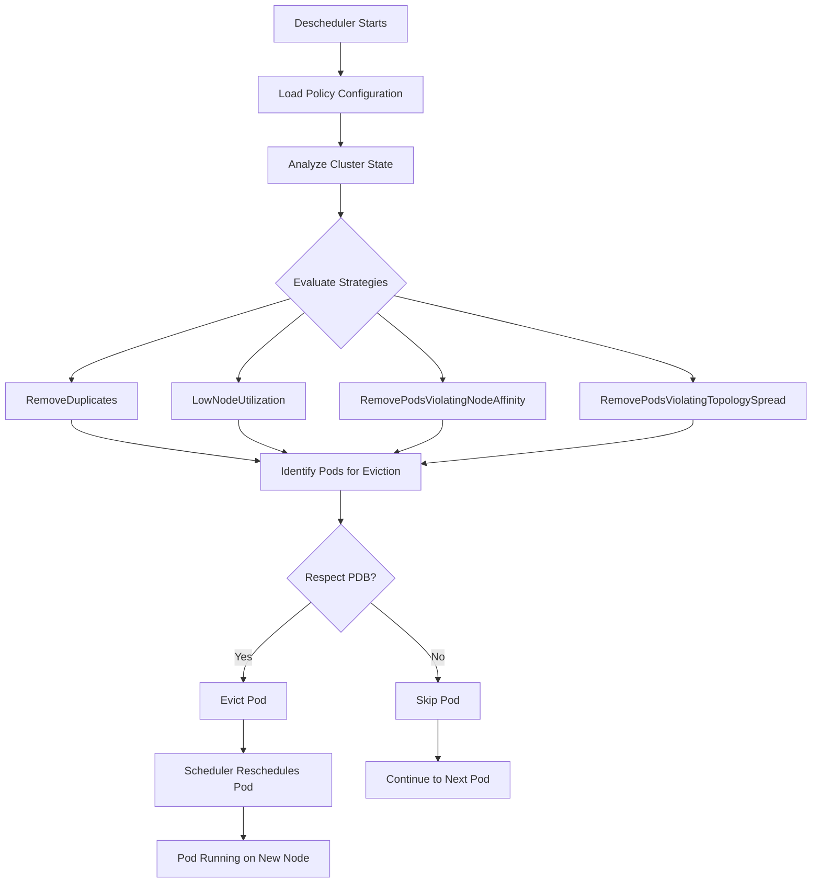
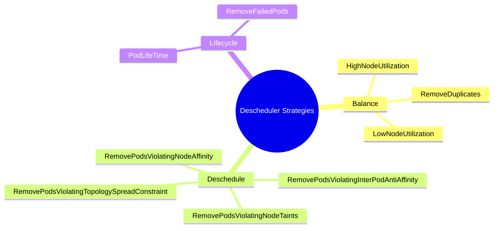
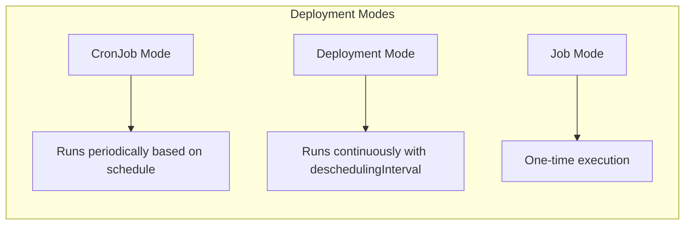
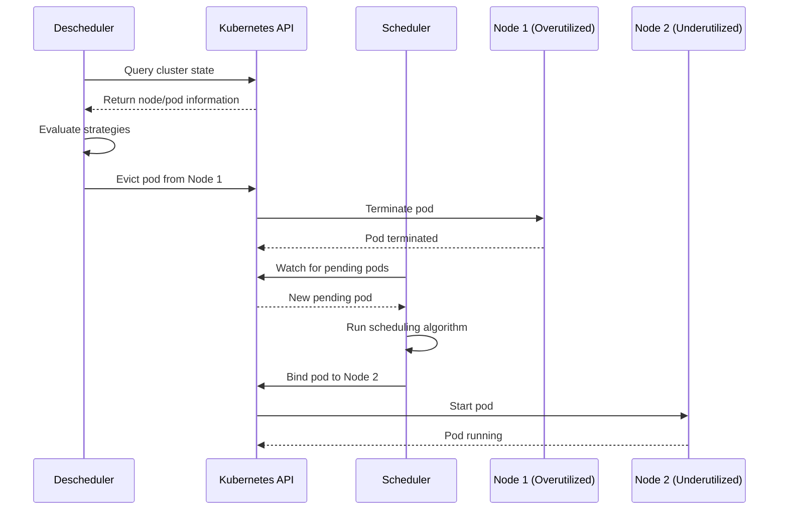

# How to Implement Kubernetes Descheduler

Author: [nawazdhandala](https://github.com/nawazdhandala)

Tags: Kubernetes, Descheduler, Workload Management, Optimization

Description: Learn to implement descheduler for rebalancing pods with eviction policies, strategies, and scheduling constraints for optimal cluster utilization.

---

## Introduction

The Kubernetes scheduler is responsible for placing pods on nodes when they are created. However, as clusters evolve over time - with nodes being added, removed, or experiencing changing resource availability - the initial scheduling decisions may no longer be optimal. This is where the Kubernetes Descheduler comes in.

The Descheduler is a complementary tool that identifies pods that should be moved and evicts them, allowing the scheduler to place them on more appropriate nodes. This helps maintain optimal cluster utilization and workload distribution.

## Why Do You Need a Descheduler?

Several scenarios can lead to suboptimal pod placement:

- **Node additions**: New nodes join the cluster but existing pods remain on old nodes
- **Taint/toleration changes**: Policy updates that affect where pods should run
- **Node label changes**: Modifications to node affinity requirements
- **Resource pressure**: Uneven resource utilization across nodes
- **Pod failures**: Replica imbalances across topology domains

## How the Descheduler Works

The following diagram illustrates the descheduler workflow:



## Installing the Descheduler

### Method 1: Using Helm

The recommended way to install the descheduler is via Helm:

```bash
# Add the descheduler Helm repository
helm repo add descheduler https://kubernetes-sigs.github.io/descheduler/

# Update your Helm repositories
helm repo update

# Install the descheduler with default configuration
helm install descheduler descheduler/descheduler \
  --namespace kube-system \
  --create-namespace
```

### Method 2: Using Kubectl

You can also deploy the descheduler directly using manifests:

```bash
# Clone the descheduler repository
git clone https://github.com/kubernetes-sigs/descheduler.git
cd descheduler

# Apply the RBAC and deployment manifests
kubectl apply -f kubernetes/base/rbac.yaml
kubectl apply -f kubernetes/base/configmap.yaml
kubectl apply -f kubernetes/cronjob/cronjob.yaml
```

## Descheduler Strategies

The descheduler supports multiple strategies that can be enabled based on your requirements. Here is a visual representation of the available strategies:



### Strategy 1: LowNodeUtilization

This strategy finds underutilized nodes and evicts pods from overutilized nodes to balance resource usage.

```yaml
apiVersion: "descheduler/v1alpha2"
kind: "DeschedulerPolicy"
profiles:
  - name: ProfileName
    pluginConfig:
    - name: "LowNodeUtilization"
      args:
        thresholds:
          "cpu": 20
          "memory": 20
          "pods": 20
        targetThresholds:
          "cpu": 50
          "memory": 50
          "pods": 50
        useDeviationThresholds: false
    plugins:
      balance:
        enabled:
          - "LowNodeUtilization"
```

**Explanation:**
- `thresholds`: Nodes below these values are considered underutilized
- `targetThresholds`: Nodes above these values are considered overutilized
- Pods are evicted from overutilized nodes to allow rescheduling to underutilized nodes

### Strategy 2: RemoveDuplicates

This strategy ensures that only one pod from a ReplicaSet, Deployment, or StatefulSet runs on each node:

```yaml
apiVersion: "descheduler/v1alpha2"
kind: "DeschedulerPolicy"
profiles:
  - name: ProfileName
    pluginConfig:
    - name: "RemoveDuplicates"
      args:
        excludeOwnerKinds:
          - "DaemonSet"
    plugins:
      balance:
        enabled:
          - "RemoveDuplicates"
```

This is particularly useful for spreading replicas across nodes for high availability.

### Strategy 3: RemovePodsViolatingNodeAffinity

This strategy evicts pods that no longer satisfy their node affinity rules:

```yaml
apiVersion: "descheduler/v1alpha2"
kind: "DeschedulerPolicy"
profiles:
  - name: ProfileName
    pluginConfig:
    - name: "RemovePodsViolatingNodeAffinity"
      args:
        nodeAffinityType:
          - "requiredDuringSchedulingIgnoredDuringExecution"
    plugins:
      deschedule:
        enabled:
          - "RemovePodsViolatingNodeAffinity"
```

### Strategy 4: RemovePodsViolatingTopologySpreadConstraint

This strategy helps maintain proper pod distribution according to topology spread constraints:

```yaml
apiVersion: "descheduler/v1alpha2"
kind: "DeschedulerPolicy"
profiles:
  - name: ProfileName
    pluginConfig:
    - name: "RemovePodsViolatingTopologySpreadConstraint"
      args:
        constraints:
          - DoNotSchedule
          - ScheduleAnyway
    plugins:
      balance:
        enabled:
          - "RemovePodsViolatingTopologySpreadConstraint"
```

### Strategy 5: PodLifeTime

This strategy evicts pods that have been running longer than a specified duration:

```yaml
apiVersion: "descheduler/v1alpha2"
kind: "DeschedulerPolicy"
profiles:
  - name: ProfileName
    pluginConfig:
    - name: "PodLifeTime"
      args:
        maxPodLifeTimeSeconds: 86400  # 24 hours
        podStatusPhases:
          - "Running"
        labelSelector:
          matchLabels:
            app: "long-running-app"
    plugins:
      deschedule:
        enabled:
          - "PodLifeTime"
```

This is useful for enforcing pod recycling and ensuring fresh pod instances.

## Complete Policy Configuration Example

Here is a comprehensive descheduler policy that combines multiple strategies:

```yaml
apiVersion: "descheduler/v1alpha2"
kind: "DeschedulerPolicy"
profiles:
  - name: "production-profile"
    pluginConfig:
    # Balance node utilization
    - name: "LowNodeUtilization"
      args:
        thresholds:
          "cpu": 20
          "memory": 20
          "pods": 20
        targetThresholds:
          "cpu": 60
          "memory": 60
          "pods": 60
        useDeviationThresholds: false
        evictableNamespaces:
          exclude:
            - "kube-system"
            - "monitoring"

    # Remove duplicate pods from same node
    - name: "RemoveDuplicates"
      args:
        excludeOwnerKinds:
          - "DaemonSet"

    # Handle node affinity violations
    - name: "RemovePodsViolatingNodeAffinity"
      args:
        nodeAffinityType:
          - "requiredDuringSchedulingIgnoredDuringExecution"

    # Maintain topology spread
    - name: "RemovePodsViolatingTopologySpreadConstraint"
      args:
        constraints:
          - DoNotSchedule

    # Remove pods violating taints
    - name: "RemovePodsViolatingNodeTaints"

    # Clean up failed pods
    - name: "RemoveFailedPods"
      args:
        reasons:
          - "NodeAffinity"
          - "NodeShutdown"
        includingInitContainers: true
        excludeOwnerKinds:
          - "Job"
        minPodLifetimeSeconds: 3600

    plugins:
      balance:
        enabled:
          - "LowNodeUtilization"
          - "RemoveDuplicates"
          - "RemovePodsViolatingTopologySpreadConstraint"
      deschedule:
        enabled:
          - "RemovePodsViolatingNodeAffinity"
          - "RemovePodsViolatingNodeTaints"
          - "RemoveFailedPods"
```

## Eviction Controls

The descheduler provides several mechanisms to control pod eviction behavior:

### Pod Disruption Budgets (PDBs)

The descheduler respects PodDisruptionBudgets. Create PDBs to protect critical workloads:

```yaml
apiVersion: policy/v1
kind: PodDisruptionBudget
metadata:
  name: app-pdb
  namespace: production
spec:
  minAvailable: 2
  selector:
    matchLabels:
      app: critical-app
```

### Namespace Filtering

Control which namespaces the descheduler can operate on:

```yaml
apiVersion: "descheduler/v1alpha2"
kind: "DeschedulerPolicy"
profiles:
  - name: ProfileName
    pluginConfig:
    - name: "LowNodeUtilization"
      args:
        evictableNamespaces:
          include:
            - "default"
            - "staging"
          exclude:
            - "kube-system"
            - "monitoring"
```

### Priority-Based Eviction

Configure priority thresholds to protect high-priority pods:

```yaml
apiVersion: "descheduler/v1alpha2"
kind: "DeschedulerPolicy"
profiles:
  - name: ProfileName
    pluginConfig:
    - name: "DefaultEvictor"
      args:
        evictSystemCriticalPods: false
        evictLocalStoragePods: false
        evictDaemonSetPods: false
        ignorePvcPods: true
        priorityThreshold:
          value: 10000
```

### Node Filtering

Specify which nodes the descheduler should consider:

```yaml
apiVersion: "descheduler/v1alpha2"
kind: "DeschedulerPolicy"
profiles:
  - name: ProfileName
    pluginConfig:
    - name: "DefaultEvictor"
      args:
        nodeFit: true
    - name: "LowNodeUtilization"
      args:
        thresholds:
          "cpu": 20
          "memory": 20
        targetThresholds:
          "cpu": 50
          "memory": 50
        nodeSelector: "node-type=worker"
```

## Deployment Modes

The descheduler can run in different modes depending on your requirements:



### CronJob Mode (Recommended for Production)

```yaml
apiVersion: batch/v1
kind: CronJob
metadata:
  name: descheduler
  namespace: kube-system
spec:
  schedule: "*/30 * * * *"  # Run every 30 minutes
  concurrencyPolicy: Forbid
  jobTemplate:
    spec:
      template:
        spec:
          serviceAccountName: descheduler
          containers:
          - name: descheduler
            image: registry.k8s.io/descheduler/descheduler:v0.30.1
            args:
              - "--policy-config-file=/policy-dir/policy.yaml"
              - "--v=3"
            volumeMounts:
            - name: policy-volume
              mountPath: /policy-dir
          volumes:
          - name: policy-volume
            configMap:
              name: descheduler-policy
          restartPolicy: Never
```

### Deployment Mode (Continuous)

```yaml
apiVersion: apps/v1
kind: Deployment
metadata:
  name: descheduler
  namespace: kube-system
spec:
  replicas: 1
  selector:
    matchLabels:
      app: descheduler
  template:
    metadata:
      labels:
        app: descheduler
    spec:
      serviceAccountName: descheduler
      containers:
      - name: descheduler
        image: registry.k8s.io/descheduler/descheduler:v0.30.1
        args:
          - "--policy-config-file=/policy-dir/policy.yaml"
          - "--descheduling-interval=5m"
          - "--v=3"
        volumeMounts:
        - name: policy-volume
          mountPath: /policy-dir
      volumes:
      - name: policy-volume
        configMap:
          name: descheduler-policy
```

## Integration with Scheduler

The descheduler works in tandem with the Kubernetes scheduler. Here is how they interact:



### Ensuring Proper Rescheduling

To ensure evicted pods are scheduled to appropriate nodes, configure proper scheduling constraints in your workloads:

```yaml
apiVersion: apps/v1
kind: Deployment
metadata:
  name: balanced-app
spec:
  replicas: 6
  selector:
    matchLabels:
      app: balanced-app
  template:
    metadata:
      labels:
        app: balanced-app
    spec:
      # Topology spread for even distribution
      topologySpreadConstraints:
      - maxSkew: 1
        topologyKey: kubernetes.io/hostname
        whenUnsatisfied: DoNotSchedule
        labelSelector:
          matchLabels:
            app: balanced-app

      # Node affinity for targeting specific nodes
      affinity:
        nodeAffinity:
          requiredDuringSchedulingIgnoredDuringExecution:
            nodeSelectorTerms:
            - matchExpressions:
              - key: node-type
                operator: In
                values:
                - worker

        # Pod anti-affinity for spreading
        podAntiAffinity:
          preferredDuringSchedulingIgnoredDuringExecution:
          - weight: 100
            podAffinityTerm:
              labelSelector:
                matchLabels:
                  app: balanced-app
              topologyKey: kubernetes.io/hostname

      containers:
      - name: app
        image: myapp:latest
        resources:
          requests:
            cpu: "100m"
            memory: "128Mi"
          limits:
            cpu: "200m"
            memory: "256Mi"
```

## Monitoring the Descheduler

### Prometheus Metrics

The descheduler exposes Prometheus metrics for monitoring:

```yaml
apiVersion: v1
kind: Service
metadata:
  name: descheduler-metrics
  namespace: kube-system
  labels:
    app: descheduler
spec:
  ports:
  - name: metrics
    port: 10258
    targetPort: 10258
  selector:
    app: descheduler
---
apiVersion: monitoring.coreos.com/v1
kind: ServiceMonitor
metadata:
  name: descheduler
  namespace: monitoring
spec:
  endpoints:
  - port: metrics
    interval: 30s
  namespaceSelector:
    matchNames:
    - kube-system
  selector:
    matchLabels:
      app: descheduler
```

Key metrics to monitor:

- `descheduler_pods_evicted`: Total number of pods evicted
- `descheduler_build_info`: Build information
- `descheduler_loop_duration_seconds`: Duration of each descheduling loop

### Example Grafana Dashboard Query

```promql
# Pods evicted per strategy
sum by (strategy) (increase(descheduler_pods_evicted[1h]))

# Eviction rate over time
rate(descheduler_pods_evicted[5m])
```

## Best Practices

### 1. Start with Dry Run Mode

Test your configuration before applying it to production:

```bash
# Run descheduler in dry-run mode
kubectl run descheduler-dry-run \
  --image=registry.k8s.io/descheduler/descheduler:v0.30.1 \
  --restart=Never \
  --rm -it \
  -- /bin/descheduler \
    --policy-config-file=/policy-dir/policy.yaml \
    --dry-run=true \
    --v=4
```

### 2. Protect Critical Workloads

Always create PDBs for stateful and critical applications:

```yaml
apiVersion: policy/v1
kind: PodDisruptionBudget
metadata:
  name: database-pdb
spec:
  maxUnavailable: 1
  selector:
    matchLabels:
      app: database
```

### 3. Set Appropriate Thresholds

Configure thresholds based on your cluster characteristics:

```yaml
# Conservative settings for production
thresholds:
  "cpu": 30
  "memory": 30
targetThresholds:
  "cpu": 70
  "memory": 70
```

### 4. Exclude System Namespaces

Always exclude critical system namespaces:

```yaml
evictableNamespaces:
  exclude:
    - "kube-system"
    - "kube-public"
    - "kube-node-lease"
    - "monitoring"
    - "logging"
```

### 5. Use Gradual Rollout

Start with limited scope and expand gradually:

1. Begin with a single non-critical namespace
2. Monitor for unintended disruptions
3. Gradually include more namespaces
4. Enable additional strategies one at a time

## Troubleshooting

### Common Issues

**Pods not being evicted:**

1. Check if PDBs are blocking eviction
2. Verify namespace inclusion/exclusion settings
3. Review priority threshold configuration
4. Check if pods have local storage (ignored by default)

**Too aggressive eviction:**

1. Increase thresholds
2. Add more namespaces to exclusion list
3. Reduce descheduling frequency
4. Enable fewer strategies

### Debug Logging

Enable verbose logging for troubleshooting:

```yaml
args:
  - "--policy-config-file=/policy-dir/policy.yaml"
  - "--v=5"  # Increase verbosity
  - "--logging-format=json"
```

### Checking Descheduler Logs

```bash
# View descheduler logs
kubectl logs -n kube-system -l app=descheduler -f

# Check eviction events
kubectl get events --field-selector reason=Descheduled -A
```

## Conclusion

The Kubernetes Descheduler is a powerful tool for maintaining optimal cluster utilization and workload distribution. By carefully configuring strategies, eviction controls, and scheduling integration, you can ensure your cluster remains balanced and efficient over time.

Key takeaways:

- The descheduler complements the scheduler by rebalancing workloads post-deployment
- Multiple strategies can be combined to address different imbalance scenarios
- PDBs and namespace filtering protect critical workloads from disruption
- Start with conservative settings and gradually tune based on your cluster needs
- Monitor descheduler metrics to track effectiveness and prevent issues

Remember to always test descheduler configurations in non-production environments first and implement proper observability to track its impact on your cluster.
