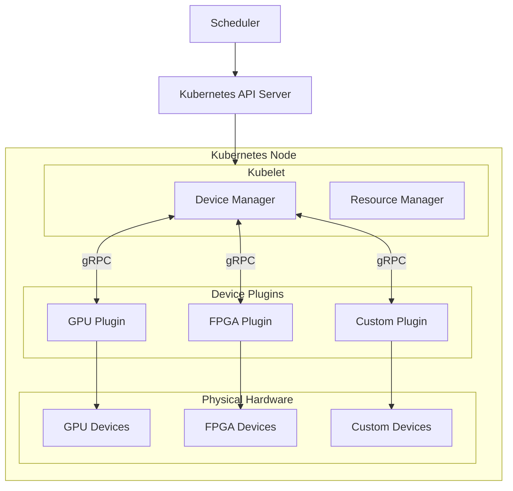
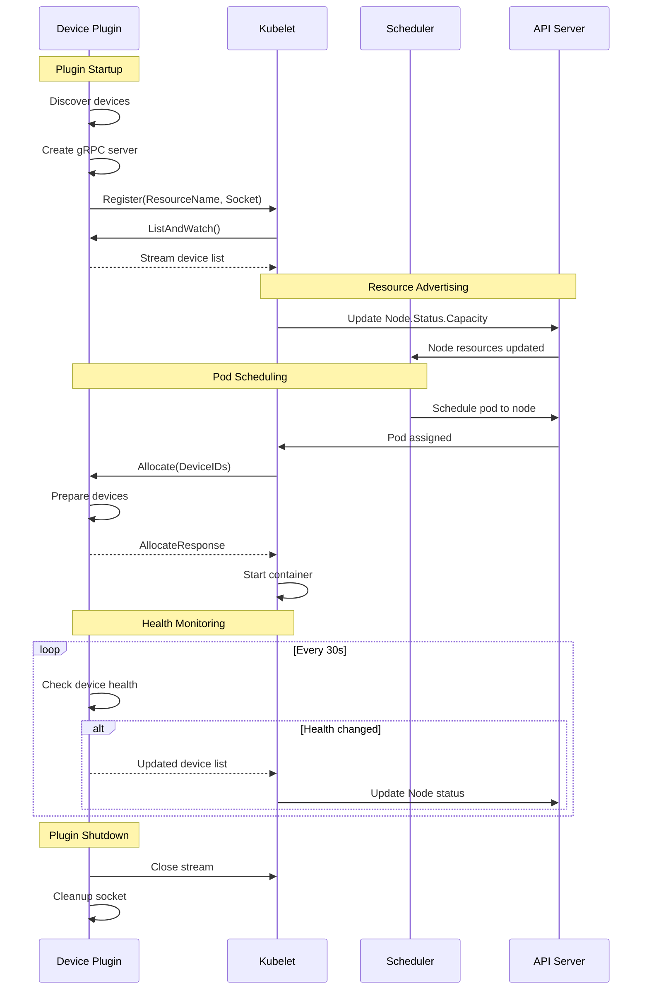

# How to Implement Kubernetes Device Plugins

Author: [nawazdhandala](https://github.com/nawazdhandala)

Tags: Kubernetes, Device Plugins, GPU, Hardware

Description: Learn to implement device plugins for exposing hardware resources like GPUs, FPGAs, and custom devices to Kubernetes workloads.

---

Kubernetes has become the de facto standard for container orchestration, but when it comes to specialized hardware like GPUs, FPGAs, or custom accelerators, the default resource model falls short. This is where the Device Plugin framework comes in - it provides a standardized way to advertise and allocate hardware resources to containers without modifying Kubernetes core code.

In this comprehensive guide, we will walk through implementing a Kubernetes device plugin from scratch, covering the plugin interface, device discovery, allocation strategies, health monitoring, and production deployment.

## Understanding the Device Plugin Architecture

Before diving into implementation, let us understand how device plugins fit into the Kubernetes ecosystem.



The Device Plugin framework operates through a gRPC-based communication channel between the kubelet and device plugins. Each plugin registers itself with the kubelet, advertises available devices, and handles allocation requests when pods require specific hardware resources.

## The Device Plugin Interface

The device plugin API is defined as a gRPC service. Here is the complete interface that every device plugin must implement:

```protobuf
// deviceplugin.proto
syntax = "proto3";

package v1beta1;

service DevicePlugin {
    // GetDevicePluginOptions returns options to be communicated with the kubelet
    rpc GetDevicePluginOptions(Empty) returns (DevicePluginOptions) {}

    // ListAndWatch returns a stream of devices
    // Whenever a device state changes, ListAndWatch sends the new list
    rpc ListAndWatch(Empty) returns (stream ListAndWatchResponse) {}

    // GetPreferredAllocation returns preferred allocation from available devices
    rpc GetPreferredAllocation(PreferredAllocationRequest) returns (PreferredAllocationResponse) {}

    // Allocate is called during container creation
    rpc Allocate(AllocateRequest) returns (AllocateResponse) {}

    // PreStartContainer is called before container start if indicated by plugin
    rpc PreStartContainer(PreStartContainerRequest) returns (PreStartContainerResponse) {}
}

message Device {
    string ID = 1;
    string health = 2;  // "Healthy" or "Unhealthy"
    TopologyInfo topology = 3;
}

message AllocateResponse {
    repeated ContainerAllocateResponse container_responses = 1;
}

message ContainerAllocateResponse {
    map<string, string> envs = 1;
    repeated Mount mounts = 2;
    repeated DeviceSpec devices = 3;
    map<string, string> annotations = 4;
}
```

## Implementing a Custom Device Plugin

Let us build a complete device plugin for a hypothetical custom accelerator. We will use Go, which is the most common language for Kubernetes components.

### Project Structure

```
custom-device-plugin/
├── cmd/
│   └── plugin/
│       └── main.go
├── pkg/
│   ├── plugin/
│   │   ├── plugin.go
│   │   ├── server.go
│   │   └── device.go
│   └── discovery/
│       └── discovery.go
├── api/
│   └── v1beta1/
│       └── api.pb.go
├── deploy/
│   ├── daemonset.yaml
│   └── rbac.yaml
├── go.mod
└── Dockerfile
```

### Step 1: Device Discovery

First, we need to discover available devices on the node. This typically involves reading from sysfs, device files, or vendor-specific APIs.

```go
// pkg/discovery/discovery.go
package discovery

import (
    "fmt"
    "os"
    "path/filepath"
    "strings"
)

const (
    // SysfsPath is the base path for device discovery
    SysfsPath = "/sys/class/custom-accelerator"
    // DevicePath is where device files are located
    DevicePath = "/dev"
)

// Device represents a discovered hardware device
type Device struct {
    ID       string
    Path     string
    Healthy  bool
    Metadata map[string]string
}

// Discoverer handles device discovery on the node
type Discoverer struct {
    sysfsPath  string
    devicePath string
}

// NewDiscoverer creates a new device discoverer
func NewDiscoverer() *Discoverer {
    return &Discoverer{
        sysfsPath:  SysfsPath,
        devicePath: DevicePath,
    }
}

// Discover finds all available devices on the node
func (d *Discoverer) Discover() ([]Device, error) {
    var devices []Device

    // Read device entries from sysfs
    entries, err := os.ReadDir(d.sysfsPath)
    if err != nil {
        if os.IsNotExist(err) {
            // No devices available
            return devices, nil
        }
        return nil, fmt.Errorf("failed to read sysfs: %w", err)
    }

    for _, entry := range entries {
        if !entry.IsDir() {
            continue
        }

        deviceID := entry.Name()
        devicePath := filepath.Join(d.devicePath, deviceID)

        // Check if device file exists
        if _, err := os.Stat(devicePath); os.IsNotExist(err) {
            continue
        }

        // Read device metadata
        metadata, err := d.readDeviceMetadata(filepath.Join(d.sysfsPath, deviceID))
        if err != nil {
            continue
        }

        // Check device health
        healthy := d.checkDeviceHealth(deviceID)

        devices = append(devices, Device{
            ID:       deviceID,
            Path:     devicePath,
            Healthy:  healthy,
            Metadata: metadata,
        })
    }

    return devices, nil
}

// readDeviceMetadata reads device attributes from sysfs
func (d *Discoverer) readDeviceMetadata(path string) (map[string]string, error) {
    metadata := make(map[string]string)

    attrs := []string{"vendor", "model", "serial", "numa_node"}
    for _, attr := range attrs {
        data, err := os.ReadFile(filepath.Join(path, attr))
        if err == nil {
            metadata[attr] = strings.TrimSpace(string(data))
        }
    }

    return metadata, nil
}

// checkDeviceHealth verifies the device is functioning properly
func (d *Discoverer) checkDeviceHealth(deviceID string) bool {
    // Implement vendor-specific health check
    // This could involve reading status registers, running diagnostics, etc.
    statusPath := filepath.Join(d.sysfsPath, deviceID, "status")
    data, err := os.ReadFile(statusPath)
    if err != nil {
        return false
    }

    return strings.TrimSpace(string(data)) == "online"
}
```

### Step 2: Plugin Server Implementation

The core of the device plugin is the gRPC server that implements the DevicePlugin interface.

```go
// pkg/plugin/server.go
package plugin

import (
    "context"
    "fmt"
    "net"
    "os"
    "path/filepath"
    "sync"
    "time"

    "google.golang.org/grpc"
    "google.golang.org/grpc/credentials/insecure"
    pluginapi "k8s.io/kubelet/pkg/apis/deviceplugin/v1beta1"
)

const (
    // ResourceName is the extended resource name
    ResourceName = "example.com/custom-accelerator"
    // SocketName is the Unix socket filename
    SocketName = "custom-accelerator.sock"
    // KubeletSocket is the kubelet device plugin socket
    KubeletSocket = "/var/lib/kubelet/device-plugins/kubelet.sock"
    // DevicePluginPath is where device plugin sockets are created
    DevicePluginPath = "/var/lib/kubelet/device-plugins"
)

// PluginServer implements the device plugin gRPC server
type PluginServer struct {
    pluginapi.UnimplementedDevicePluginServer

    resourceName string
    socketPath   string

    server     *grpc.Server
    devices    map[string]*pluginapi.Device
    devicesMux sync.RWMutex

    health    chan *pluginapi.Device
    stop      chan struct{}

    discoverer DeviceDiscoverer
}

// DeviceDiscoverer interface for device discovery
type DeviceDiscoverer interface {
    Discover() ([]Device, error)
}

// NewPluginServer creates a new device plugin server
func NewPluginServer(discoverer DeviceDiscoverer) *PluginServer {
    return &PluginServer{
        resourceName: ResourceName,
        socketPath:   filepath.Join(DevicePluginPath, SocketName),
        devices:      make(map[string]*pluginapi.Device),
        health:       make(chan *pluginapi.Device),
        stop:         make(chan struct{}),
        discoverer:   discoverer,
    }
}

// Start starts the gRPC server and registers with kubelet
func (s *PluginServer) Start() error {
    // Clean up any existing socket
    if err := s.cleanup(); err != nil {
        return err
    }

    // Create Unix socket listener
    listener, err := net.Listen("unix", s.socketPath)
    if err != nil {
        return fmt.Errorf("failed to create listener: %w", err)
    }

    // Create gRPC server
    s.server = grpc.NewServer()
    pluginapi.RegisterDevicePluginServer(s.server, s)

    // Start serving in background
    go func() {
        if err := s.server.Serve(listener); err != nil {
            fmt.Printf("gRPC server error: %v\n", err)
        }
    }()

    // Wait for server to be ready
    ctx, cancel := context.WithTimeout(context.Background(), 5*time.Second)
    defer cancel()

    if err := s.waitForServer(ctx); err != nil {
        return err
    }

    // Register with kubelet
    if err := s.registerWithKubelet(); err != nil {
        return err
    }

    // Start health monitoring
    go s.healthCheck()

    return nil
}

// Stop stops the gRPC server
func (s *PluginServer) Stop() {
    close(s.stop)
    if s.server != nil {
        s.server.Stop()
    }
    s.cleanup()
}

// registerWithKubelet registers the plugin with the kubelet
func (s *PluginServer) registerWithKubelet() error {
    conn, err := grpc.Dial(
        KubeletSocket,
        grpc.WithTransportCredentials(insecure.NewCredentials()),
        grpc.WithContextDialer(func(ctx context.Context, addr string) (net.Conn, error) {
            return net.DialTimeout("unix", addr, 5*time.Second)
        }),
    )
    if err != nil {
        return fmt.Errorf("failed to connect to kubelet: %w", err)
    }
    defer conn.Close()

    client := pluginapi.NewRegistrationClient(conn)

    req := &pluginapi.RegisterRequest{
        Version:      pluginapi.Version,
        Endpoint:     SocketName,
        ResourceName: s.resourceName,
        Options: &pluginapi.DevicePluginOptions{
            PreStartRequired:                false,
            GetPreferredAllocationAvailable: true,
        },
    }

    _, err = client.Register(context.Background(), req)
    if err != nil {
        return fmt.Errorf("failed to register with kubelet: %w", err)
    }

    fmt.Printf("Registered device plugin for %s\n", s.resourceName)
    return nil
}

// cleanup removes the Unix socket file
func (s *PluginServer) cleanup() error {
    if err := os.Remove(s.socketPath); err != nil && !os.IsNotExist(err) {
        return err
    }
    return nil
}

// waitForServer waits for the gRPC server to be ready
func (s *PluginServer) waitForServer(ctx context.Context) error {
    for {
        select {
        case <-ctx.Done():
            return ctx.Err()
        default:
            conn, err := grpc.DialContext(
                ctx,
                s.socketPath,
                grpc.WithTransportCredentials(insecure.NewCredentials()),
                grpc.WithBlock(),
                grpc.WithContextDialer(func(ctx context.Context, addr string) (net.Conn, error) {
                    return net.DialTimeout("unix", addr, time.Second)
                }),
            )
            if err == nil {
                conn.Close()
                return nil
            }
            time.Sleep(100 * time.Millisecond)
        }
    }
}
```

### Step 3: Implementing gRPC Methods

Now let us implement the required gRPC methods for the device plugin interface.

```go
// pkg/plugin/plugin.go
package plugin

import (
    "context"
    "fmt"
    "time"

    pluginapi "k8s.io/kubelet/pkg/apis/deviceplugin/v1beta1"
)

// GetDevicePluginOptions returns plugin options
func (s *PluginServer) GetDevicePluginOptions(
    ctx context.Context,
    empty *pluginapi.Empty,
) (*pluginapi.DevicePluginOptions, error) {
    return &pluginapi.DevicePluginOptions{
        PreStartRequired:                false,
        GetPreferredAllocationAvailable: true,
    }, nil
}

// ListAndWatch streams device updates to the kubelet
func (s *PluginServer) ListAndWatch(
    empty *pluginapi.Empty,
    stream pluginapi.DevicePlugin_ListAndWatchServer,
) error {
    // Initial device discovery
    if err := s.updateDevices(); err != nil {
        return err
    }

    // Send initial device list
    if err := s.sendDevices(stream); err != nil {
        return err
    }

    // Watch for device changes
    ticker := time.NewTicker(10 * time.Second)
    defer ticker.Stop()

    for {
        select {
        case <-s.stop:
            return nil

        case device := <-s.health:
            // Device health changed
            s.devicesMux.Lock()
            s.devices[device.ID] = device
            s.devicesMux.Unlock()

            if err := s.sendDevices(stream); err != nil {
                return err
            }

        case <-ticker.C:
            // Periodic device discovery
            if err := s.updateDevices(); err != nil {
                fmt.Printf("Device update error: %v\n", err)
                continue
            }

            if err := s.sendDevices(stream); err != nil {
                return err
            }
        }
    }
}

// updateDevices refreshes the device list
func (s *PluginServer) updateDevices() error {
    discovered, err := s.discoverer.Discover()
    if err != nil {
        return err
    }

    s.devicesMux.Lock()
    defer s.devicesMux.Unlock()

    // Clear existing devices
    s.devices = make(map[string]*pluginapi.Device)

    for _, d := range discovered {
        health := pluginapi.Healthy
        if !d.Healthy {
            health = pluginapi.Unhealthy
        }

        s.devices[d.ID] = &pluginapi.Device{
            ID:     d.ID,
            Health: health,
            Topology: &pluginapi.TopologyInfo{
                Nodes: []*pluginapi.NUMANode{
                    {ID: parseNUMANode(d.Metadata["numa_node"])},
                },
            },
        }
    }

    return nil
}

// sendDevices sends the current device list to the kubelet
func (s *PluginServer) sendDevices(stream pluginapi.DevicePlugin_ListAndWatchServer) error {
    s.devicesMux.RLock()
    defer s.devicesMux.RUnlock()

    var deviceList []*pluginapi.Device
    for _, device := range s.devices {
        deviceList = append(deviceList, device)
    }

    return stream.Send(&pluginapi.ListAndWatchResponse{
        Devices: deviceList,
    })
}

// Allocate handles device allocation requests from the kubelet
func (s *PluginServer) Allocate(
    ctx context.Context,
    req *pluginapi.AllocateRequest,
) (*pluginapi.AllocateResponse, error) {
    response := &pluginapi.AllocateResponse{}

    for _, containerReq := range req.ContainerRequests {
        containerResp := &pluginapi.ContainerAllocateResponse{
            Envs:    make(map[string]string),
            Mounts:  []*pluginapi.Mount{},
            Devices: []*pluginapi.DeviceSpec{},
        }

        for i, deviceID := range containerReq.DevicesIDs {
            // Verify device exists and is healthy
            s.devicesMux.RLock()
            device, exists := s.devices[deviceID]
            s.devicesMux.RUnlock()

            if !exists {
                return nil, fmt.Errorf("device %s not found", deviceID)
            }

            if device.Health != pluginapi.Healthy {
                return nil, fmt.Errorf("device %s is unhealthy", deviceID)
            }

            // Add device file to container
            containerResp.Devices = append(containerResp.Devices, &pluginapi.DeviceSpec{
                ContainerPath: fmt.Sprintf("/dev/accelerator%d", i),
                HostPath:      fmt.Sprintf("/dev/%s", deviceID),
                Permissions:   "rw",
            })

            // Add any required mounts (e.g., driver libraries)
            containerResp.Mounts = append(containerResp.Mounts, &pluginapi.Mount{
                ContainerPath: "/usr/lib/accelerator",
                HostPath:      "/usr/lib/accelerator",
                ReadOnly:      true,
            })
        }

        // Set environment variables for the container
        containerResp.Envs["ACCELERATOR_VISIBLE_DEVICES"] = joinDeviceIDs(containerReq.DevicesIDs)
        containerResp.Envs["ACCELERATOR_DRIVER_VERSION"] = "1.0.0"

        response.ContainerResponses = append(response.ContainerResponses, containerResp)
    }

    return response, nil
}

// GetPreferredAllocation returns the preferred device allocation
func (s *PluginServer) GetPreferredAllocation(
    ctx context.Context,
    req *pluginapi.PreferredAllocationRequest,
) (*pluginapi.PreferredAllocationResponse, error) {
    response := &pluginapi.PreferredAllocationResponse{}

    for _, containerReq := range req.ContainerRequests {
        // Implement topology-aware allocation
        preferred := s.selectPreferredDevices(
            containerReq.AvailableDeviceIDs,
            int(containerReq.AllocationSize),
        )

        response.ContainerResponses = append(response.ContainerResponses,
            &pluginapi.ContainerPreferredAllocationResponse{
                DeviceIDs: preferred,
            },
        )
    }

    return response, nil
}

// selectPreferredDevices selects devices based on topology
func (s *PluginServer) selectPreferredDevices(available []string, count int) []string {
    s.devicesMux.RLock()
    defer s.devicesMux.RUnlock()

    // Group devices by NUMA node
    numaGroups := make(map[int64][]string)
    for _, id := range available {
        if device, ok := s.devices[id]; ok {
            if device.Topology != nil && len(device.Topology.Nodes) > 0 {
                numaID := device.Topology.Nodes[0].ID
                numaGroups[numaID] = append(numaGroups[numaID], id)
            }
        }
    }

    // Prefer devices from the same NUMA node
    for _, devices := range numaGroups {
        if len(devices) >= count {
            return devices[:count]
        }
    }

    // Fall back to any available devices
    if len(available) >= count {
        return available[:count]
    }

    return available
}

// PreStartContainer is called before container start
func (s *PluginServer) PreStartContainer(
    ctx context.Context,
    req *pluginapi.PreStartContainerRequest,
) (*pluginapi.PreStartContainerResponse, error) {
    // Perform any pre-start initialization if needed
    // This is optional and controlled by GetDevicePluginOptions
    return &pluginapi.PreStartContainerResponse{}, nil
}

// Helper functions

func parseNUMANode(s string) int64 {
    var node int64
    fmt.Sscanf(s, "%d", &node)
    return node
}

func joinDeviceIDs(ids []string) string {
    result := ""
    for i, id := range ids {
        if i > 0 {
            result += ","
        }
        result += id
    }
    return result
}
```

### Step 4: Health Monitoring

Continuous health monitoring ensures the kubelet is aware of device status changes.

```go
// pkg/plugin/health.go
package plugin

import (
    "fmt"
    "os"
    "path/filepath"
    "strings"
    "time"

    pluginapi "k8s.io/kubelet/pkg/apis/deviceplugin/v1beta1"
)

const (
    healthCheckInterval = 30 * time.Second
)

// healthCheck monitors device health continuously
func (s *PluginServer) healthCheck() {
    ticker := time.NewTicker(healthCheckInterval)
    defer ticker.Stop()

    for {
        select {
        case <-s.stop:
            return
        case <-ticker.C:
            s.checkAllDevices()
        }
    }
}

// checkAllDevices checks health of all registered devices
func (s *PluginServer) checkAllDevices() {
    s.devicesMux.RLock()
    deviceIDs := make([]string, 0, len(s.devices))
    for id := range s.devices {
        deviceIDs = append(deviceIDs, id)
    }
    s.devicesMux.RUnlock()

    for _, id := range deviceIDs {
        healthy := s.checkDeviceHealth(id)

        s.devicesMux.RLock()
        device, exists := s.devices[id]
        s.devicesMux.RUnlock()

        if !exists {
            continue
        }

        expectedHealth := pluginapi.Healthy
        if !healthy {
            expectedHealth = pluginapi.Unhealthy
        }

        if device.Health != expectedHealth {
            // Health status changed - notify
            updatedDevice := &pluginapi.Device{
                ID:       device.ID,
                Health:   expectedHealth,
                Topology: device.Topology,
            }

            select {
            case s.health <- updatedDevice:
                fmt.Printf("Device %s health changed to %s\n", id, expectedHealth)
            default:
                // Channel full, will be caught in next cycle
            }
        }
    }
}

// checkDeviceHealth performs health check on a specific device
func (s *PluginServer) checkDeviceHealth(deviceID string) bool {
    // Check 1: Device file exists and is accessible
    devicePath := filepath.Join("/dev", deviceID)
    if _, err := os.Stat(devicePath); os.IsNotExist(err) {
        return false
    }

    // Check 2: Sysfs status indicates online
    statusPath := filepath.Join("/sys/class/custom-accelerator", deviceID, "status")
    data, err := os.ReadFile(statusPath)
    if err != nil {
        return false
    }

    if strings.TrimSpace(string(data)) != "online" {
        return false
    }

    // Check 3: Error count is below threshold
    errorPath := filepath.Join("/sys/class/custom-accelerator", deviceID, "error_count")
    errorData, err := os.ReadFile(errorPath)
    if err == nil {
        var errorCount int
        fmt.Sscanf(strings.TrimSpace(string(errorData)), "%d", &errorCount)
        if errorCount > 100 {
            return false
        }
    }

    // Check 4: Temperature is within acceptable range
    tempPath := filepath.Join("/sys/class/custom-accelerator", deviceID, "temperature")
    tempData, err := os.ReadFile(tempPath)
    if err == nil {
        var temp int
        fmt.Sscanf(strings.TrimSpace(string(tempData)), "%d", &temp)
        if temp > 85 { // 85 degrees Celsius threshold
            return false
        }
    }

    return true
}
```

### Step 5: Main Entry Point

```go
// cmd/plugin/main.go
package main

import (
    "fmt"
    "os"
    "os/signal"
    "syscall"

    "github.com/example/custom-device-plugin/pkg/discovery"
    "github.com/example/custom-device-plugin/pkg/plugin"
)

func main() {
    fmt.Println("Starting Custom Device Plugin...")

    // Create device discoverer
    discoverer := discovery.NewDiscoverer()

    // Create and start plugin server
    server := plugin.NewPluginServer(discoverer)

    if err := server.Start(); err != nil {
        fmt.Printf("Failed to start plugin server: %v\n", err)
        os.Exit(1)
    }

    fmt.Println("Device plugin started successfully")

    // Wait for termination signal
    sigChan := make(chan os.Signal, 1)
    signal.Notify(sigChan, syscall.SIGINT, syscall.SIGTERM)

    <-sigChan

    fmt.Println("Shutting down device plugin...")
    server.Stop()
    fmt.Println("Device plugin stopped")
}
```

## Deployment Configuration

### DaemonSet Deployment

Device plugins should run as DaemonSets to ensure one instance per node.

```yaml
# deploy/daemonset.yaml
apiVersion: apps/v1
kind: DaemonSet
metadata:
  name: custom-device-plugin
  namespace: kube-system
  labels:
    app: custom-device-plugin
spec:
  selector:
    matchLabels:
      app: custom-device-plugin
  updateStrategy:
    type: RollingUpdate
  template:
    metadata:
      labels:
        app: custom-device-plugin
    spec:
      priorityClassName: system-node-critical
      tolerations:
        - key: CriticalAddonsOnly
          operator: Exists
        - effect: NoSchedule
          key: custom-accelerator
          operator: Exists
      nodeSelector:
        feature.node.kubernetes.io/custom-accelerator: "true"
      containers:
        - name: device-plugin
          image: example.com/custom-device-plugin:v1.0.0
          imagePullPolicy: Always
          securityContext:
            privileged: true
          resources:
            requests:
              cpu: 50m
              memory: 50Mi
            limits:
              cpu: 100m
              memory: 100Mi
          volumeMounts:
            - name: device-plugin
              mountPath: /var/lib/kubelet/device-plugins
            - name: sys
              mountPath: /sys
              readOnly: true
            - name: dev
              mountPath: /dev
          env:
            - name: NODE_NAME
              valueFrom:
                fieldRef:
                  fieldPath: spec.nodeName
      volumes:
        - name: device-plugin
          hostPath:
            path: /var/lib/kubelet/device-plugins
        - name: sys
          hostPath:
            path: /sys
        - name: dev
          hostPath:
            path: /dev
```

### RBAC Configuration

```yaml
# deploy/rbac.yaml
apiVersion: v1
kind: ServiceAccount
metadata:
  name: custom-device-plugin
  namespace: kube-system
---
apiVersion: rbac.authorization.k8s.io/v1
kind: ClusterRole
metadata:
  name: custom-device-plugin
rules:
  - apiGroups: [""]
    resources: ["nodes"]
    verbs: ["get", "list", "watch"]
  - apiGroups: [""]
    resources: ["nodes/status"]
    verbs: ["patch", "update"]
---
apiVersion: rbac.authorization.k8s.io/v1
kind: ClusterRoleBinding
metadata:
  name: custom-device-plugin
subjects:
  - kind: ServiceAccount
    name: custom-device-plugin
    namespace: kube-system
roleRef:
  kind: ClusterRole
  name: custom-device-plugin
  apiGroup: rbac.authorization.k8s.io
```

## Device Plugin Lifecycle

Understanding the complete lifecycle is essential for debugging and maintenance.



## Using Device Resources in Pods

Once the device plugin is deployed, workloads can request devices using the extended resource name.

```yaml
# example-workload.yaml
apiVersion: v1
kind: Pod
metadata:
  name: accelerator-workload
spec:
  containers:
    - name: worker
      image: example.com/ml-worker:latest
      resources:
        limits:
          example.com/custom-accelerator: 2
        requests:
          example.com/custom-accelerator: 2
      env:
        - name: ACCELERATOR_COUNT
          value: "2"
```

## Testing Your Device Plugin

### Unit Testing

```go
// pkg/plugin/plugin_test.go
package plugin

import (
    "context"
    "testing"

    pluginapi "k8s.io/kubelet/pkg/apis/deviceplugin/v1beta1"
)

type mockDiscoverer struct {
    devices []Device
}

func (m *mockDiscoverer) Discover() ([]Device, error) {
    return m.devices, nil
}

func TestAllocate(t *testing.T) {
    discoverer := &mockDiscoverer{
        devices: []Device{
            {ID: "device-0", Path: "/dev/device-0", Healthy: true},
            {ID: "device-1", Path: "/dev/device-1", Healthy: true},
        },
    }

    server := NewPluginServer(discoverer)
    server.updateDevices()

    req := &pluginapi.AllocateRequest{
        ContainerRequests: []*pluginapi.ContainerAllocateRequest{
            {DevicesIDs: []string{"device-0"}},
        },
    }

    resp, err := server.Allocate(context.Background(), req)
    if err != nil {
        t.Fatalf("Allocate failed: %v", err)
    }

    if len(resp.ContainerResponses) != 1 {
        t.Fatalf("Expected 1 container response, got %d", len(resp.ContainerResponses))
    }

    containerResp := resp.ContainerResponses[0]
    if len(containerResp.Devices) != 1 {
        t.Fatalf("Expected 1 device, got %d", len(containerResp.Devices))
    }

    if containerResp.Devices[0].HostPath != "/dev/device-0" {
        t.Errorf("Wrong host path: %s", containerResp.Devices[0].HostPath)
    }
}

func TestAllocateUnhealthyDevice(t *testing.T) {
    discoverer := &mockDiscoverer{
        devices: []Device{
            {ID: "device-0", Path: "/dev/device-0", Healthy: false},
        },
    }

    server := NewPluginServer(discoverer)
    server.updateDevices()

    req := &pluginapi.AllocateRequest{
        ContainerRequests: []*pluginapi.ContainerAllocateRequest{
            {DevicesIDs: []string{"device-0"}},
        },
    }

    _, err := server.Allocate(context.Background(), req)
    if err == nil {
        t.Fatal("Expected error for unhealthy device")
    }
}
```

### Integration Testing

```bash
#!/bin/bash
# test-integration.sh

# Deploy the device plugin
kubectl apply -f deploy/

# Wait for DaemonSet to be ready
kubectl rollout status daemonset/custom-device-plugin -n kube-system

# Verify devices are advertised
kubectl get nodes -o jsonpath='{.items[*].status.capacity}' | jq .

# Deploy test workload
kubectl apply -f - <<EOF
apiVersion: v1
kind: Pod
metadata:
  name: test-accelerator
spec:
  containers:
    - name: test
      image: busybox
      command: ["sh", "-c", "ls -la /dev/accelerator* && sleep 3600"]
      resources:
        limits:
          example.com/custom-accelerator: 1
EOF

# Wait for pod to be running
kubectl wait --for=condition=Ready pod/test-accelerator --timeout=60s

# Verify device is mounted
kubectl exec test-accelerator -- ls -la /dev/

# Cleanup
kubectl delete pod test-accelerator
```

## Advanced Topics

### Topology-Aware Scheduling

For optimal performance with NUMA-aware hardware, implement proper topology hints.

```go
// Add topology information to devices
func (s *PluginServer) getTopologyForDevice(deviceID string) *pluginapi.TopologyInfo {
    // Read NUMA node from sysfs
    numaPath := filepath.Join("/sys/class/custom-accelerator", deviceID, "numa_node")
    data, err := os.ReadFile(numaPath)
    if err != nil {
        return nil
    }

    var numaNode int64
    fmt.Sscanf(strings.TrimSpace(string(data)), "%d", &numaNode)

    return &pluginapi.TopologyInfo{
        Nodes: []*pluginapi.NUMANode{
            {ID: numaNode},
        },
    }
}
```

### Device Sharing

For devices that support sharing (like time-sliced GPUs), you can advertise more devices than physical hardware.

```go
func (s *PluginServer) createVirtualDevices(physical Device, replicas int) []*pluginapi.Device {
    var devices []*pluginapi.Device

    for i := 0; i < replicas; i++ {
        virtualID := fmt.Sprintf("%s-virt-%d", physical.ID, i)
        health := pluginapi.Healthy
        if !physical.Healthy {
            health = pluginapi.Unhealthy
        }

        devices = append(devices, &pluginapi.Device{
            ID:       virtualID,
            Health:   health,
            Topology: physical.Topology,
        })
    }

    return devices
}
```

## Best Practices and Recommendations

1. **Graceful Shutdown**: Always handle SIGTERM properly and clean up sockets to prevent kubelet issues on restart.

2. **Robust Health Checks**: Implement comprehensive health monitoring that catches hardware failures, driver issues, and thermal problems.

3. **Logging and Metrics**: Export Prometheus metrics for device utilization, allocation counts, and health status.

4. **Idempotent Allocation**: Ensure the Allocate method can be called multiple times for the same device without issues.

5. **Resource Cleanup**: Implement proper cleanup when containers using devices are terminated.

6. **Version Compatibility**: Test your plugin against multiple Kubernetes versions since the device plugin API may have subtle changes.

## Conclusion

Implementing a Kubernetes device plugin requires careful attention to the gRPC interface, device discovery, health monitoring, and proper integration with the kubelet. By following the patterns outlined in this guide, you can create robust device plugins that seamlessly expose specialized hardware to your Kubernetes workloads.

The device plugin framework provides the flexibility to support virtually any hardware - from GPUs and FPGAs to custom accelerators and specialized I/O devices. As Kubernetes continues to expand into edge computing and AI/ML workloads, understanding device plugins becomes an increasingly valuable skill for platform engineers and cluster administrators.

For production deployments, consider using established device plugins from hardware vendors (like NVIDIA for GPUs) as references, and always thoroughly test your implementation in staging environments before rolling out to production clusters.
