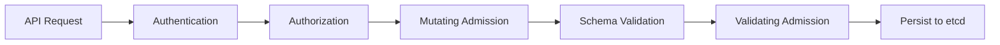
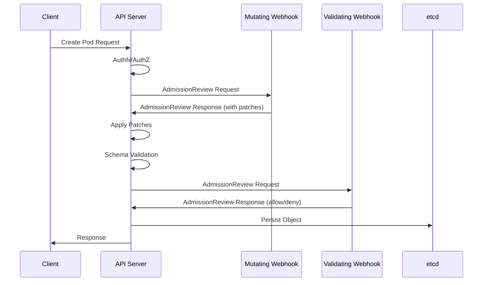
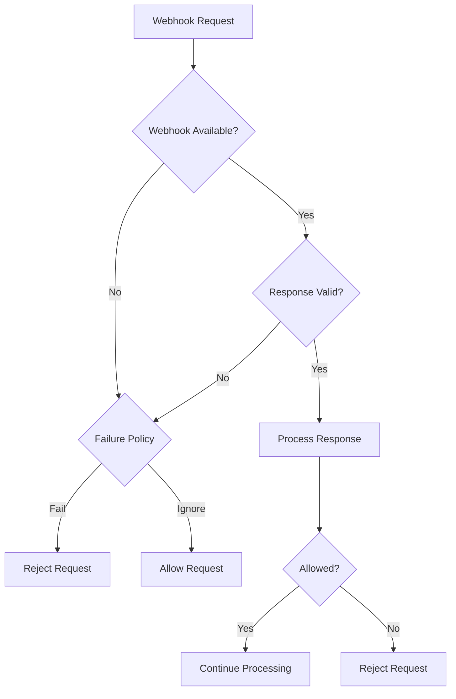

# How to Implement Kubernetes Dynamic Admission Control

Author: [nawazdhandala](https://github.com/nawazdhandala)

Tags: Kubernetes, Admission Control, Webhooks, Policy

Description: Learn to implement dynamic admission control with validating and mutating webhooks for custom policy enforcement in Kubernetes.

---

Dynamic admission control is one of the most powerful features in Kubernetes for enforcing custom policies, security requirements, and organizational standards. In this comprehensive guide, we will explore how to implement validating and mutating admission webhooks to control what resources can be created or modified in your cluster.

## What is Dynamic Admission Control?

When a request reaches the Kubernetes API server, it goes through several stages before the resource is persisted to etcd. Dynamic admission control happens after authentication and authorization but before the object is stored.



There are two types of admission webhooks:

1. **Mutating Admission Webhooks** - Can modify the incoming request (e.g., inject sidecars, add labels)
2. **Validating Admission Webhooks** - Can accept or reject requests but cannot modify them

Mutating webhooks run first, followed by validating webhooks. This order allows validating webhooks to verify the final state of an object after all mutations.

## Architecture Overview

Here is how the admission control flow works with external webhooks:



## Setting Up Certificate Management

Admission webhooks require TLS certificates because the API server communicates with webhooks over HTTPS. Let us set up proper certificate management using cert-manager.

### Installing cert-manager

First, install cert-manager in your cluster:

```bash
kubectl apply -f https://github.com/cert-manager/cert-manager/releases/download/v1.14.0/cert-manager.yaml
```

### Creating a Self-Signed Issuer

Create a self-signed issuer for generating webhook certificates:

```yaml
# issuer.yaml
apiVersion: cert-manager.io/v1
kind: Issuer
metadata:
  name: webhook-selfsigned-issuer
  namespace: webhook-system
spec:
  selfSigned: {}
---
apiVersion: cert-manager.io/v1
kind: Certificate
metadata:
  name: webhook-server-cert
  namespace: webhook-system
spec:
  secretName: webhook-server-cert
  duration: 8760h # 1 year
  renewBefore: 720h # 30 days
  subject:
    organizations:
      - my-organization
  commonName: webhook-service.webhook-system.svc
  isCA: false
  privateKey:
    algorithm: RSA
    size: 2048
  usages:
    - server auth
    - digital signature
    - key encipherment
  dnsNames:
    - webhook-service.webhook-system.svc
    - webhook-service.webhook-system.svc.cluster.local
  issuerRef:
    name: webhook-selfsigned-issuer
    kind: Issuer
```

Apply the certificate configuration:

```bash
kubectl create namespace webhook-system
kubectl apply -f issuer.yaml
```

## Building a Validating Admission Webhook

Let us build a validating webhook that enforces a policy requiring all pods to have resource limits defined.

### The Webhook Server Code

Here is a complete Go implementation:

```go
// main.go
package main

import (
    "encoding/json"
    "fmt"
    "io"
    "net/http"
    "os"

    admissionv1 "k8s.io/api/admission/v1"
    corev1 "k8s.io/api/core/v1"
    metav1 "k8s.io/apimachinery/pkg/apis/meta/v1"
    "k8s.io/apimachinery/pkg/runtime"
    "k8s.io/apimachinery/pkg/runtime/serializer"
    "k8s.io/klog/v2"
)

var (
    runtimeScheme = runtime.NewScheme()
    codecFactory  = serializer.NewCodecFactory(runtimeScheme)
    deserializer  = codecFactory.UniversalDeserializer()
)

func init() {
    _ = admissionv1.AddToScheme(runtimeScheme)
    _ = corev1.AddToScheme(runtimeScheme)
}

// validatePod checks if the pod has resource limits defined
func validatePod(pod *corev1.Pod) (bool, string) {
    for _, container := range pod.Spec.Containers {
        if container.Resources.Limits == nil {
            return false, fmt.Sprintf(
                "container %s does not have resource limits defined",
                container.Name,
            )
        }
        if container.Resources.Limits.Cpu().IsZero() {
            return false, fmt.Sprintf(
                "container %s does not have CPU limit defined",
                container.Name,
            )
        }
        if container.Resources.Limits.Memory().IsZero() {
            return false, fmt.Sprintf(
                "container %s does not have memory limit defined",
                container.Name,
            )
        }
    }
    return true, ""
}

func handleValidate(w http.ResponseWriter, r *http.Request) {
    body, err := io.ReadAll(r.Body)
    if err != nil {
        klog.Errorf("Failed to read request body: %v", err)
        http.Error(w, "Failed to read request body", http.StatusBadRequest)
        return
    }

    var admissionReview admissionv1.AdmissionReview
    if _, _, err := deserializer.Decode(body, nil, &admissionReview); err != nil {
        klog.Errorf("Failed to decode admission review: %v", err)
        http.Error(w, "Failed to decode admission review", http.StatusBadRequest)
        return
    }

    response := &admissionv1.AdmissionResponse{
        UID:     admissionReview.Request.UID,
        Allowed: true,
    }

    // Only validate Pod creation and updates
    if admissionReview.Request.Kind.Kind == "Pod" {
        var pod corev1.Pod
        if err := json.Unmarshal(admissionReview.Request.Object.Raw, &pod); err != nil {
            klog.Errorf("Failed to unmarshal pod: %v", err)
            response.Allowed = false
            response.Result = &metav1.Status{
                Message: "Failed to unmarshal pod object",
            }
        } else {
            allowed, message := validatePod(&pod)
            response.Allowed = allowed
            if !allowed {
                response.Result = &metav1.Status{
                    Message: message,
                    Reason:  metav1.StatusReasonForbidden,
                }
            }
        }
    }

    admissionReview.Response = response
    responseBytes, err := json.Marshal(admissionReview)
    if err != nil {
        klog.Errorf("Failed to marshal response: %v", err)
        http.Error(w, "Failed to marshal response", http.StatusInternalServerError)
        return
    }

    w.Header().Set("Content-Type", "application/json")
    w.Write(responseBytes)
}

func main() {
    certFile := os.Getenv("TLS_CERT_FILE")
    keyFile := os.Getenv("TLS_KEY_FILE")

    if certFile == "" {
        certFile = "/etc/webhook/certs/tls.crt"
    }
    if keyFile == "" {
        keyFile = "/etc/webhook/certs/tls.key"
    }

    http.HandleFunc("/validate", handleValidate)
    http.HandleFunc("/healthz", func(w http.ResponseWriter, r *http.Request) {
        w.WriteHeader(http.StatusOK)
        w.Write([]byte("ok"))
    })

    klog.Info("Starting webhook server on :8443")
    if err := http.ListenAndServeTLS(":8443", certFile, keyFile, nil); err != nil {
        klog.Fatalf("Failed to start server: %v", err)
    }
}
```

### Dockerfile

```dockerfile
FROM golang:1.22-alpine AS builder

WORKDIR /app
COPY go.mod go.sum ./
RUN go mod download
COPY . .
RUN CGO_ENABLED=0 GOOS=linux go build -o webhook-server .

FROM alpine:3.19
RUN apk --no-cache add ca-certificates
WORKDIR /root/
COPY --from=builder /app/webhook-server .
EXPOSE 8443
CMD ["./webhook-server"]
```

### Kubernetes Deployment

Deploy the webhook server:

```yaml
# deployment.yaml
apiVersion: apps/v1
kind: Deployment
metadata:
  name: validating-webhook
  namespace: webhook-system
  labels:
    app: validating-webhook
spec:
  replicas: 2
  selector:
    matchLabels:
      app: validating-webhook
  template:
    metadata:
      labels:
        app: validating-webhook
    spec:
      containers:
        - name: webhook
          image: your-registry/validating-webhook:v1.0.0
          ports:
            - containerPort: 8443
          volumeMounts:
            - name: webhook-certs
              mountPath: /etc/webhook/certs
              readOnly: true
          livenessProbe:
            httpGet:
              path: /healthz
              port: 8443
              scheme: HTTPS
            initialDelaySeconds: 5
            periodSeconds: 10
          readinessProbe:
            httpGet:
              path: /healthz
              port: 8443
              scheme: HTTPS
            initialDelaySeconds: 5
            periodSeconds: 10
          resources:
            limits:
              cpu: 100m
              memory: 128Mi
            requests:
              cpu: 50m
              memory: 64Mi
      volumes:
        - name: webhook-certs
          secret:
            secretName: webhook-server-cert
---
apiVersion: v1
kind: Service
metadata:
  name: webhook-service
  namespace: webhook-system
spec:
  selector:
    app: validating-webhook
  ports:
    - port: 443
      targetPort: 8443
```

### ValidatingWebhookConfiguration

Register the webhook with the API server:

```yaml
# validating-webhook-config.yaml
apiVersion: admissionregistration.k8s.io/v1
kind: ValidatingWebhookConfiguration
metadata:
  name: pod-resource-limits-validator
  annotations:
    cert-manager.io/inject-ca-from: webhook-system/webhook-server-cert
webhooks:
  - name: pod-resource-limits.example.com
    admissionReviewVersions:
      - v1
    sideEffects: None
    timeoutSeconds: 10
    failurePolicy: Fail
    matchPolicy: Equivalent
    clientConfig:
      service:
        name: webhook-service
        namespace: webhook-system
        path: /validate
        port: 443
    rules:
      - operations:
          - CREATE
          - UPDATE
        apiGroups:
          - ""
        apiVersions:
          - v1
        resources:
          - pods
    namespaceSelector:
      matchExpressions:
        - key: kubernetes.io/metadata.name
          operator: NotIn
          values:
            - kube-system
            - webhook-system
```

## Building a Mutating Admission Webhook for Sidecar Injection

Sidecar injection is one of the most common use cases for mutating webhooks. Let us build a webhook that automatically injects a logging sidecar into pods.

### Sidecar Injection Logic

```go
// mutate.go
package main

import (
    "encoding/json"
    "fmt"
    "io"
    "net/http"

    admissionv1 "k8s.io/api/admission/v1"
    corev1 "k8s.io/api/core/v1"
    metav1 "k8s.io/apimachinery/pkg/apis/meta/v1"
    "k8s.io/klog/v2"
)

const (
    sidecarAnnotation = "sidecar.example.com/inject"
)

// patchOperation represents a JSON patch operation
type patchOperation struct {
    Op    string      `json:"op"`
    Path  string      `json:"path"`
    Value interface{} `json:"value,omitempty"`
}

// createSidecarContainer creates the logging sidecar container spec
func createSidecarContainer() corev1.Container {
    return corev1.Container{
        Name:  "logging-sidecar",
        Image: "fluent/fluent-bit:2.2",
        Resources: corev1.ResourceRequirements{
            Limits: corev1.ResourceList{
                corev1.ResourceCPU:    resource.MustParse("100m"),
                corev1.ResourceMemory: resource.MustParse("128Mi"),
            },
            Requests: corev1.ResourceList{
                corev1.ResourceCPU:    resource.MustParse("50m"),
                corev1.ResourceMemory: resource.MustParse("64Mi"),
            },
        },
        VolumeMounts: []corev1.VolumeMount{
            {
                Name:      "shared-logs",
                MountPath: "/var/log/app",
            },
            {
                Name:      "fluent-bit-config",
                MountPath: "/fluent-bit/etc/",
            },
        },
    }
}

// createSidecarVolumes creates the volumes needed for the sidecar
func createSidecarVolumes() []corev1.Volume {
    return []corev1.Volume{
        {
            Name: "shared-logs",
            VolumeSource: corev1.VolumeSource{
                EmptyDir: &corev1.EmptyDirVolumeSource{},
            },
        },
        {
            Name: "fluent-bit-config",
            VolumeSource: corev1.VolumeSource{
                ConfigMap: &corev1.ConfigMapVolumeSource{
                    LocalObjectReference: corev1.LocalObjectReference{
                        Name: "fluent-bit-config",
                    },
                },
            },
        },
    }
}

// shouldInjectSidecar checks if the pod should have a sidecar injected
func shouldInjectSidecar(pod *corev1.Pod) bool {
    if val, ok := pod.Annotations[sidecarAnnotation]; ok {
        return val == "true"
    }
    return false
}

// createPatch creates the JSON patch for sidecar injection
func createPatch(pod *corev1.Pod) ([]byte, error) {
    var patches []patchOperation

    // Add sidecar container
    sidecar := createSidecarContainer()
    patches = append(patches, patchOperation{
        Op:    "add",
        Path:  "/spec/containers/-",
        Value: sidecar,
    })

    // Add volumes
    sidecarVolumes := createSidecarVolumes()
    if len(pod.Spec.Volumes) == 0 {
        patches = append(patches, patchOperation{
            Op:    "add",
            Path:  "/spec/volumes",
            Value: sidecarVolumes,
        })
    } else {
        for _, volume := range sidecarVolumes {
            patches = append(patches, patchOperation{
                Op:    "add",
                Path:  "/spec/volumes/-",
                Value: volume,
            })
        }
    }

    // Add annotation to mark as injected
    if pod.Annotations == nil {
        patches = append(patches, patchOperation{
            Op:    "add",
            Path:  "/metadata/annotations",
            Value: map[string]string{"sidecar.example.com/injected": "true"},
        })
    } else {
        patches = append(patches, patchOperation{
            Op:    "add",
            Path:  "/metadata/annotations/sidecar.example.com~1injected",
            Value: "true",
        })
    }

    return json.Marshal(patches)
}

func handleMutate(w http.ResponseWriter, r *http.Request) {
    body, err := io.ReadAll(r.Body)
    if err != nil {
        klog.Errorf("Failed to read request body: %v", err)
        http.Error(w, "Failed to read request body", http.StatusBadRequest)
        return
    }

    var admissionReview admissionv1.AdmissionReview
    if _, _, err := deserializer.Decode(body, nil, &admissionReview); err != nil {
        klog.Errorf("Failed to decode admission review: %v", err)
        http.Error(w, "Failed to decode admission review", http.StatusBadRequest)
        return
    }

    response := &admissionv1.AdmissionResponse{
        UID:     admissionReview.Request.UID,
        Allowed: true,
    }

    if admissionReview.Request.Kind.Kind == "Pod" {
        var pod corev1.Pod
        if err := json.Unmarshal(admissionReview.Request.Object.Raw, &pod); err != nil {
            klog.Errorf("Failed to unmarshal pod: %v", err)
            response.Allowed = false
            response.Result = &metav1.Status{
                Message: "Failed to unmarshal pod object",
            }
        } else if shouldInjectSidecar(&pod) {
            patchBytes, err := createPatch(&pod)
            if err != nil {
                klog.Errorf("Failed to create patch: %v", err)
                response.Allowed = false
                response.Result = &metav1.Status{
                    Message: "Failed to create mutation patch",
                }
            } else {
                patchType := admissionv1.PatchTypeJSONPatch
                response.Patch = patchBytes
                response.PatchType = &patchType
                klog.Infof("Injecting sidecar into pod %s/%s",
                    pod.Namespace, pod.Name)
            }
        }
    }

    admissionReview.Response = response
    responseBytes, err := json.Marshal(admissionReview)
    if err != nil {
        klog.Errorf("Failed to marshal response: %v", err)
        http.Error(w, "Failed to marshal response", http.StatusInternalServerError)
        return
    }

    w.Header().Set("Content-Type", "application/json")
    w.Write(responseBytes)
}
```

### MutatingWebhookConfiguration

```yaml
# mutating-webhook-config.yaml
apiVersion: admissionregistration.k8s.io/v1
kind: MutatingWebhookConfiguration
metadata:
  name: sidecar-injector
  annotations:
    cert-manager.io/inject-ca-from: webhook-system/webhook-server-cert
webhooks:
  - name: sidecar-injector.example.com
    admissionReviewVersions:
      - v1
    sideEffects: None
    timeoutSeconds: 10
    failurePolicy: Ignore
    reinvocationPolicy: Never
    matchPolicy: Equivalent
    clientConfig:
      service:
        name: webhook-service
        namespace: webhook-system
        path: /mutate
        port: 443
    rules:
      - operations:
          - CREATE
        apiGroups:
          - ""
        apiVersions:
          - v1
        resources:
          - pods
    namespaceSelector:
      matchLabels:
        sidecar-injection: enabled
    objectSelector:
      matchExpressions:
        - key: sidecar.example.com/inject
          operator: NotIn
          values:
            - "false"
```

## Understanding Failure Policies

The `failurePolicy` field determines what happens when the webhook is unavailable or returns an error:



### Fail Policy

```yaml
failurePolicy: Fail
```

Use `Fail` when:
- The webhook enforces critical security policies
- You cannot allow resources that bypass validation
- You prefer availability issues over policy violations

### Ignore Policy

```yaml
failurePolicy: Ignore
```

Use `Ignore` when:
- The webhook provides non-critical functionality
- High availability is more important than strict enforcement
- You are implementing optional features like sidecar injection

## Advanced Configuration Options

### Namespace Selectors

Target specific namespaces:

```yaml
namespaceSelector:
  matchLabels:
    environment: production
  matchExpressions:
    - key: team
      operator: In
      values:
        - platform
        - security
```

### Object Selectors

Target specific objects based on labels:

```yaml
objectSelector:
  matchLabels:
    validate: "true"
  matchExpressions:
    - key: skip-validation
      operator: NotIn
      values:
        - "true"
```

### Scope and Match Policy

Control which resources trigger the webhook:

```yaml
rules:
  - operations:
      - CREATE
      - UPDATE
    apiGroups:
      - apps
    apiVersions:
      - v1
    resources:
      - deployments
    scope: Namespaced  # or Cluster, or *
matchPolicy: Equivalent  # or Exact
```

## Testing Your Webhooks

### Unit Testing

```go
func TestValidatePod(t *testing.T) {
    tests := []struct {
        name        string
        pod         *corev1.Pod
        expectValid bool
        expectMsg   string
    }{
        {
            name: "pod with resource limits",
            pod: &corev1.Pod{
                Spec: corev1.PodSpec{
                    Containers: []corev1.Container{
                        {
                            Name: "app",
                            Resources: corev1.ResourceRequirements{
                                Limits: corev1.ResourceList{
                                    corev1.ResourceCPU:    resource.MustParse("100m"),
                                    corev1.ResourceMemory: resource.MustParse("128Mi"),
                                },
                            },
                        },
                    },
                },
            },
            expectValid: true,
        },
        {
            name: "pod without resource limits",
            pod: &corev1.Pod{
                Spec: corev1.PodSpec{
                    Containers: []corev1.Container{
                        {
                            Name: "app",
                        },
                    },
                },
            },
            expectValid: false,
            expectMsg:   "container app does not have resource limits defined",
        },
    }

    for _, tt := range tests {
        t.Run(tt.name, func(t *testing.T) {
            valid, msg := validatePod(tt.pod)
            if valid != tt.expectValid {
                t.Errorf("expected valid=%v, got %v", tt.expectValid, valid)
            }
            if msg != tt.expectMsg {
                t.Errorf("expected message=%q, got %q", tt.expectMsg, msg)
            }
        })
    }
}
```

### Integration Testing with kind

Create a test script:

```bash
#!/bin/bash
set -e

# Create kind cluster
kind create cluster --name webhook-test

# Install cert-manager
kubectl apply -f https://github.com/cert-manager/cert-manager/releases/download/v1.14.0/cert-manager.yaml
kubectl wait --for=condition=Available deployment --all -n cert-manager --timeout=300s

# Deploy webhook
kubectl apply -f manifests/

# Wait for webhook to be ready
kubectl wait --for=condition=Available deployment/validating-webhook -n webhook-system --timeout=120s

# Test: Pod without resource limits should be rejected
echo "Testing pod without resource limits..."
if kubectl run test-pod --image=nginx --restart=Never 2>&1 | grep -q "does not have resource limits"; then
    echo "PASS: Pod without limits was rejected"
else
    echo "FAIL: Pod without limits was not rejected"
    exit 1
fi

# Test: Pod with resource limits should be accepted
echo "Testing pod with resource limits..."
kubectl run test-pod-with-limits --image=nginx --restart=Never \
    --limits="cpu=100m,memory=128Mi" \
    --requests="cpu=50m,memory=64Mi"

if kubectl get pod test-pod-with-limits; then
    echo "PASS: Pod with limits was accepted"
else
    echo "FAIL: Pod with limits was not accepted"
    exit 1
fi

# Cleanup
kind delete cluster --name webhook-test
echo "All tests passed!"
```

## Monitoring and Observability

### Adding Metrics

Add Prometheus metrics to your webhook:

```go
import (
    "github.com/prometheus/client_golang/prometheus"
    "github.com/prometheus/client_golang/prometheus/promhttp"
)

var (
    webhookRequests = prometheus.NewCounterVec(
        prometheus.CounterOpts{
            Name: "admission_webhook_requests_total",
            Help: "Total number of admission webhook requests",
        },
        []string{"operation", "kind", "allowed"},
    )
    webhookLatency = prometheus.NewHistogramVec(
        prometheus.HistogramOpts{
            Name:    "admission_webhook_latency_seconds",
            Help:    "Latency of admission webhook requests",
            Buckets: prometheus.DefBuckets,
        },
        []string{"operation", "kind"},
    )
)

func init() {
    prometheus.MustRegister(webhookRequests)
    prometheus.MustRegister(webhookLatency)
}

func main() {
    // ... existing code ...
    http.Handle("/metrics", promhttp.Handler())
    // ... existing code ...
}
```

### Logging Best Practices

```go
func handleValidate(w http.ResponseWriter, r *http.Request) {
    start := time.Now()

    // ... validation logic ...

    klog.V(2).InfoS("Processed admission request",
        "operation", admissionReview.Request.Operation,
        "kind", admissionReview.Request.Kind.Kind,
        "namespace", admissionReview.Request.Namespace,
        "name", admissionReview.Request.Name,
        "allowed", response.Allowed,
        "duration", time.Since(start),
    )

    webhookRequests.WithLabelValues(
        string(admissionReview.Request.Operation),
        admissionReview.Request.Kind.Kind,
        fmt.Sprintf("%t", response.Allowed),
    ).Inc()

    webhookLatency.WithLabelValues(
        string(admissionReview.Request.Operation),
        admissionReview.Request.Kind.Kind,
    ).Observe(time.Since(start).Seconds())
}
```

## Production Best Practices

### High Availability

Deploy multiple replicas with pod anti-affinity:

```yaml
spec:
  replicas: 3
  template:
    spec:
      affinity:
        podAntiAffinity:
          preferredDuringSchedulingIgnoredDuringExecution:
            - weight: 100
              podAffinityTerm:
                labelSelector:
                  matchLabels:
                    app: validating-webhook
                topologyKey: kubernetes.io/hostname
```

### Resource Management

Always set appropriate resource limits:

```yaml
resources:
  limits:
    cpu: 200m
    memory: 256Mi
  requests:
    cpu: 100m
    memory: 128Mi
```

### Timeout Configuration

Set reasonable timeouts to prevent API server delays:

```yaml
timeoutSeconds: 5  # Keep it short for production
```

### Certificate Rotation

Ensure certificates are rotated before expiry. With cert-manager:

```yaml
spec:
  duration: 8760h    # 1 year
  renewBefore: 720h  # 30 days before expiry
```

## Troubleshooting Common Issues

### Webhook Not Being Called

1. Check if the webhook configuration is registered:
```bash
kubectl get validatingwebhookconfigurations
kubectl get mutatingwebhookconfigurations
```

2. Verify namespace and object selectors match your test resources

3. Check API server logs for webhook errors

### Certificate Issues

1. Verify the CA bundle is correctly injected:
```bash
kubectl get validatingwebhookconfigurations <name> -o yaml | grep caBundle
```

2. Check cert-manager certificate status:
```bash
kubectl get certificates -n webhook-system
kubectl describe certificate webhook-server-cert -n webhook-system
```

### Timeout Errors

1. Increase webhook timeout if processing is slow
2. Check webhook pod logs for errors
3. Verify network connectivity between API server and webhook service

## Conclusion

Dynamic admission control provides a powerful mechanism for enforcing policies in Kubernetes. By implementing validating and mutating webhooks, you can:

- Enforce security policies and compliance requirements
- Automatically inject sidecars and configurations
- Validate resources against custom business rules
- Standardize resource configurations across your organization

Remember to:
- Use proper certificate management with automatic rotation
- Choose appropriate failure policies based on your use case
- Implement comprehensive monitoring and logging
- Test thoroughly before deploying to production
- Keep webhook latency low to avoid impacting API server performance

With the patterns and code examples provided in this guide, you should be well-equipped to implement robust admission control for your Kubernetes clusters.
