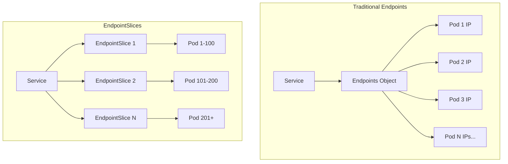
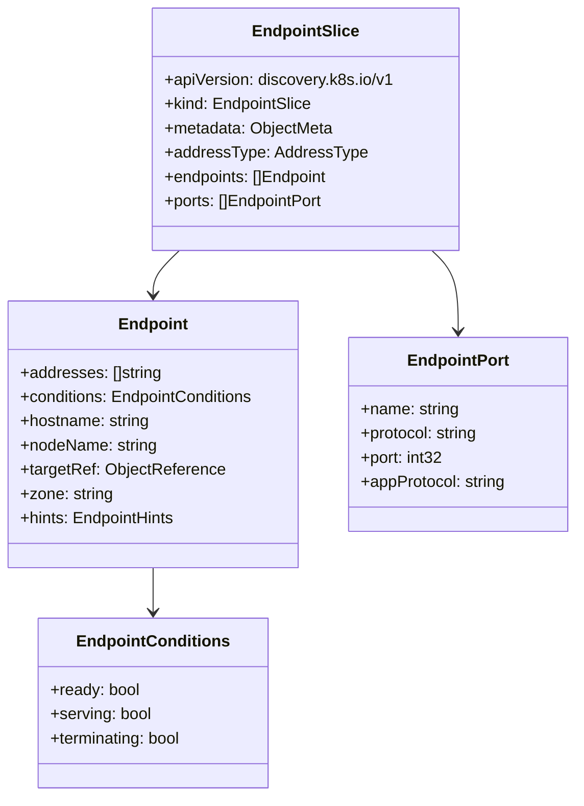
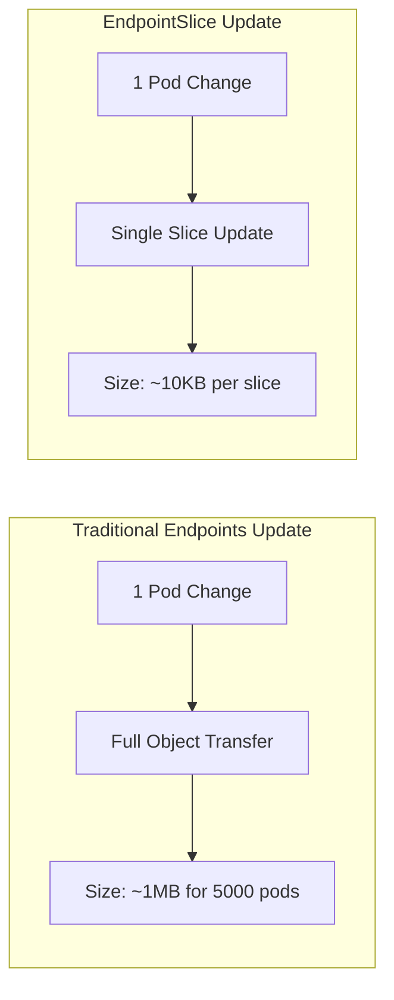
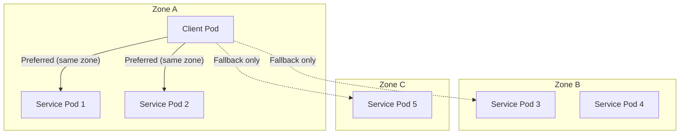
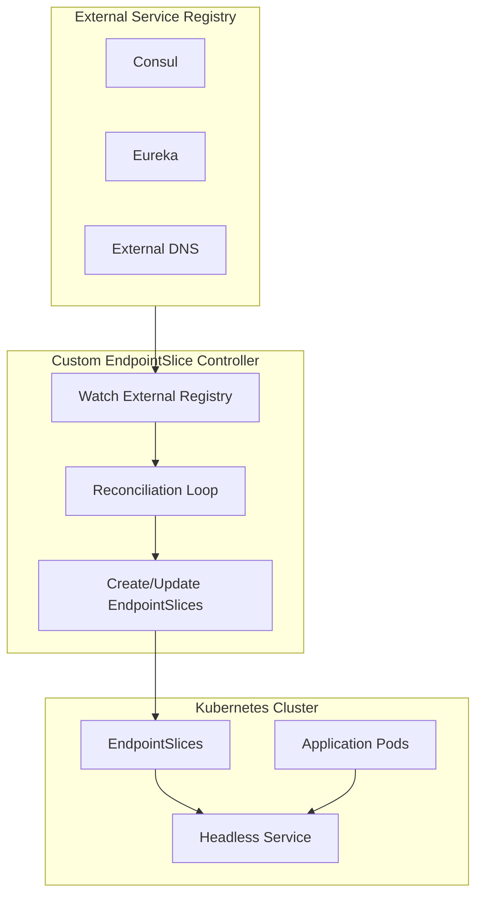
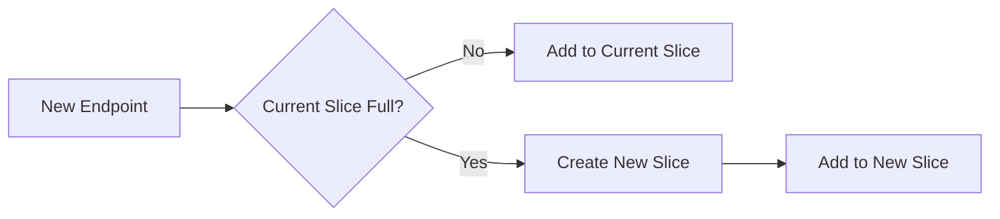

# How to Create Kubernetes EndpointSlices

Author: [nawazdhandala](https://github.com/nawazdhandala)

Tags: Kubernetes, EndpointSlices, Service Discovery, Networking

Description: Learn to implement EndpointSlices for scalable service discovery with improved performance over traditional Endpoints for large clusters.

---

## Introduction

Service discovery is a fundamental component of Kubernetes networking. Traditionally, Kubernetes used the `Endpoints` API to track the network addresses of pods backing a Service. However, as clusters grew larger, the Endpoints API began showing scalability limitations. Enter **EndpointSlices** - a more scalable and extensible alternative introduced in Kubernetes 1.16 and generally available since Kubernetes 1.21.

In this guide, we will explore how to create and manage EndpointSlices effectively for scalable service discovery in your Kubernetes clusters.

## Understanding EndpointSlices Architecture

EndpointSlices provide a distributed approach to endpoint management. Instead of storing all endpoints in a single resource, they split endpoints across multiple smaller resources.



## EndpointSlice Structure

An EndpointSlice contains several key components that define how network endpoints are organized and accessed.



### Basic EndpointSlice Manifest

Here is a simple EndpointSlice definition:

```yaml
apiVersion: discovery.k8s.io/v1
kind: EndpointSlice
metadata:
  name: my-service-abc
  labels:
    kubernetes.io/service-name: my-service
addressType: IPv4
ports:
  - name: http
    protocol: TCP
    port: 80
endpoints:
  - addresses:
      - "10.1.2.3"
    conditions:
      ready: true
      serving: true
      terminating: false
    nodeName: node-1
    zone: us-east-1a
```

**Key fields explained:**

- `addressType`: Specifies the type of address (IPv4, IPv6, or FQDN)
- `ports`: Defines the ports that endpoints expose
- `endpoints`: Lists the actual endpoint addresses with their conditions and metadata

## Advantages Over Traditional Endpoints

EndpointSlices offer significant improvements over the legacy Endpoints API:

### 1. Scalability

Traditional Endpoints store all pod IPs in a single object. With services backed by thousands of pods, this creates large objects that must be transmitted in full on every change.



**Comparison:**

| Aspect | Endpoints | EndpointSlices |
|--------|-----------|----------------|
| Max endpoints per object | Unlimited (causes issues) | 100 (configurable) |
| Update granularity | Full object | Single slice |
| Network overhead | High | Low |
| etcd storage efficiency | Poor | Good |

### 2. Extended Metadata

EndpointSlices support additional per-endpoint metadata:

```yaml
apiVersion: discovery.k8s.io/v1
kind: EndpointSlice
metadata:
  name: my-service-extended
  labels:
    kubernetes.io/service-name: my-service
addressType: IPv4
ports:
  - name: https
    protocol: TCP
    port: 443
    appProtocol: https
endpoints:
  - addresses:
      - "10.1.2.3"
    conditions:
      ready: true
      serving: true
      terminating: false
    nodeName: node-1
    zone: us-east-1a
    targetRef:
      kind: Pod
      name: my-pod-abc
      namespace: default
      uid: "a1b2c3d4-e5f6-7890-abcd-ef1234567890"
```

### 3. Dual-Stack Support

EndpointSlices natively support dual-stack networking with separate slices for IPv4 and IPv6:

```yaml
# IPv4 EndpointSlice
apiVersion: discovery.k8s.io/v1
kind: EndpointSlice
metadata:
  name: my-service-ipv4-abc
  labels:
    kubernetes.io/service-name: my-service
addressType: IPv4
ports:
  - name: http
    port: 80
endpoints:
  - addresses:
      - "10.1.2.3"
    conditions:
      ready: true
---
# IPv6 EndpointSlice
apiVersion: discovery.k8s.io/v1
kind: EndpointSlice
metadata:
  name: my-service-ipv6-xyz
  labels:
    kubernetes.io/service-name: my-service
addressType: IPv6
ports:
  - name: http
    port: 80
endpoints:
  - addresses:
      - "2001:db8::1"
    conditions:
      ready: true
```

## Topology-Aware Routing with Hints

EndpointSlices support topology hints that enable traffic to be routed preferentially to endpoints in the same zone. This reduces latency and cross-zone data transfer costs.



### Enabling Topology-Aware Routing

To enable topology-aware routing, add the annotation to your Service:

```yaml
apiVersion: v1
kind: Service
metadata:
  name: my-service
  annotations:
    service.kubernetes.io/topology-mode: Auto
spec:
  selector:
    app: my-app
  ports:
    - port: 80
      targetPort: 8080
```

### EndpointSlice with Topology Hints

When topology-aware routing is enabled, the EndpointSlice controller automatically adds hints:

```yaml
apiVersion: discovery.k8s.io/v1
kind: EndpointSlice
metadata:
  name: my-service-topology
  labels:
    kubernetes.io/service-name: my-service
addressType: IPv4
ports:
  - name: http
    port: 80
endpoints:
  - addresses:
      - "10.1.2.3"
    conditions:
      ready: true
    zone: us-east-1a
    hints:
      forZones:
        - name: us-east-1a
  - addresses:
      - "10.1.3.4"
    conditions:
      ready: true
    zone: us-east-1b
    hints:
      forZones:
        - name: us-east-1b
  - addresses:
      - "10.1.4.5"
    conditions:
      ready: true
    zone: us-east-1c
    hints:
      forZones:
        - name: us-east-1c
```

## Creating a Custom EndpointSlice Controller

For advanced use cases, you might need a custom controller to manage EndpointSlices for external services or custom service discovery.

### Controller Architecture



### Go Controller Implementation

Here is a basic custom controller using the Kubernetes Go client:

```go
package main

import (
    "context"
    "fmt"
    "time"

    discoveryv1 "k8s.io/api/discovery/v1"
    metav1 "k8s.io/apimachinery/pkg/apis/meta/v1"
    "k8s.io/client-go/kubernetes"
    "k8s.io/client-go/tools/clientcmd"
    "k8s.io/utils/pointer"
)

const (
    maxEndpointsPerSlice = 100
    serviceName          = "external-service"
    namespace            = "default"
)

type ExternalEndpoint struct {
    Address  string
    Port     int32
    Zone     string
    NodeName string
    Ready    bool
}

func main() {
    // Initialize Kubernetes client
    config, err := clientcmd.BuildConfigFromFlags("", clientcmd.RecommendedHomeFile)
    if err != nil {
        panic(err)
    }

    clientset, err := kubernetes.NewForConfig(config)
    if err != nil {
        panic(err)
    }

    // Start the reconciliation loop
    for {
        endpoints := fetchExternalEndpoints()
        err := reconcileEndpointSlices(clientset, endpoints)
        if err != nil {
            fmt.Printf("Error reconciling: %v\n", err)
        }
        time.Sleep(30 * time.Second)
    }
}

func fetchExternalEndpoints() []ExternalEndpoint {
    // Implement your external service discovery logic here
    // This example returns static endpoints
    return []ExternalEndpoint{
        {Address: "192.168.1.10", Port: 8080, Zone: "zone-a", Ready: true},
        {Address: "192.168.1.11", Port: 8080, Zone: "zone-a", Ready: true},
        {Address: "192.168.1.12", Port: 8080, Zone: "zone-b", Ready: true},
    }
}

func reconcileEndpointSlices(clientset *kubernetes.Clientset, endpoints []ExternalEndpoint) error {
    ctx := context.Background()

    // Calculate required number of slices
    numSlices := (len(endpoints) + maxEndpointsPerSlice - 1) / maxEndpointsPerSlice

    for i := 0; i < numSlices; i++ {
        start := i * maxEndpointsPerSlice
        end := start + maxEndpointsPerSlice
        if end > len(endpoints) {
            end = len(endpoints)
        }

        sliceEndpoints := endpoints[start:end]
        sliceName := fmt.Sprintf("%s-%d", serviceName, i)

        endpointSlice := buildEndpointSlice(sliceName, sliceEndpoints)

        // Create or update the EndpointSlice
        _, err := clientset.DiscoveryV1().EndpointSlices(namespace).Create(
            ctx, endpointSlice, metav1.CreateOptions{},
        )
        if err != nil {
            // Try update if create fails
            _, err = clientset.DiscoveryV1().EndpointSlices(namespace).Update(
                ctx, endpointSlice, metav1.UpdateOptions{},
            )
            if err != nil {
                return fmt.Errorf("failed to create/update slice %s: %w", sliceName, err)
            }
        }
    }

    return nil
}

func buildEndpointSlice(name string, endpoints []ExternalEndpoint) *discoveryv1.EndpointSlice {
    protocol := "TCP"
    portName := "http"

    var sliceEndpoints []discoveryv1.Endpoint
    for _, ep := range endpoints {
        sliceEndpoints = append(sliceEndpoints, discoveryv1.Endpoint{
            Addresses: []string{ep.Address},
            Conditions: discoveryv1.EndpointConditions{
                Ready:       pointer.Bool(ep.Ready),
                Serving:     pointer.Bool(ep.Ready),
                Terminating: pointer.Bool(false),
            },
            Zone: pointer.String(ep.Zone),
        })
    }

    return &discoveryv1.EndpointSlice{
        ObjectMeta: metav1.ObjectMeta{
            Name:      name,
            Namespace: namespace,
            Labels: map[string]string{
                "kubernetes.io/service-name":               serviceName,
                "endpointslice.kubernetes.io/managed-by":   "custom-controller",
            },
        },
        AddressType: discoveryv1.AddressTypeIPv4,
        Ports: []discoveryv1.EndpointPort{
            {
                Name:     &portName,
                Protocol: (*corev1.Protocol)(&protocol),
                Port:     pointer.Int32(8080),
            },
        },
        Endpoints: sliceEndpoints,
    }
}
```

### Headless Service for Custom EndpointSlices

Create a headless Service to use with your custom EndpointSlices:

```yaml
apiVersion: v1
kind: Service
metadata:
  name: external-service
  namespace: default
spec:
  clusterIP: None
  ports:
    - name: http
      port: 8080
      targetPort: 8080
```

## Monitoring EndpointSlices

### Viewing EndpointSlices

Use kubectl to inspect EndpointSlices:

```bash
# List all EndpointSlices
kubectl get endpointslices -A

# List EndpointSlices for a specific service
kubectl get endpointslices -l kubernetes.io/service-name=my-service

# Describe an EndpointSlice with full details
kubectl describe endpointslice my-service-abc

# Output EndpointSlice as YAML
kubectl get endpointslice my-service-abc -o yaml
```

### Metrics to Monitor

Key metrics for EndpointSlice health:

```yaml
# Prometheus ServiceMonitor for kube-controller-manager
apiVersion: monitoring.coreos.com/v1
kind: ServiceMonitor
metadata:
  name: endpointslice-metrics
spec:
  endpoints:
    - port: https-metrics
      interval: 30s
  selector:
    matchLabels:
      component: kube-controller-manager
```

Important metrics to track:

| Metric | Description |
|--------|-------------|
| `endpoint_slice_controller_syncs_total` | Total syncs by the controller |
| `endpoint_slice_controller_endpoints_added_per_sync` | Endpoints added per sync |
| `endpoint_slice_controller_endpoints_removed_per_sync` | Endpoints removed per sync |
| `endpoint_slice_controller_changes` | Number of EndpointSlice changes |

## Best Practices

### 1. Label Your EndpointSlices Correctly

Always include the required label linking to the Service:

```yaml
metadata:
  labels:
    kubernetes.io/service-name: my-service
    endpointslice.kubernetes.io/managed-by: my-controller
```

### 2. Handle Slice Ownership

When creating custom EndpointSlices, set owner references for automatic cleanup:

```yaml
metadata:
  ownerReferences:
    - apiVersion: v1
      kind: Service
      name: my-service
      uid: <service-uid>
      controller: true
      blockOwnerDeletion: true
```

### 3. Respect the Maximum Endpoints Per Slice

Keep endpoints per slice at or below 100 for optimal performance:



### 4. Use Conditions Properly

Set endpoint conditions accurately:

```yaml
endpoints:
  - addresses:
      - "10.1.2.3"
    conditions:
      # Pod is ready to receive traffic
      ready: true
      # Pod is serving (may be true even during termination)
      serving: true
      # Pod is terminating
      terminating: false
```

## Troubleshooting

### Common Issues

**EndpointSlices not being created:**

```bash
# Check the EndpointSlice controller logs
kubectl logs -n kube-system -l component=kube-controller-manager | grep -i endpointslice
```

**Service not routing to endpoints:**

```bash
# Verify EndpointSlices exist for the service
kubectl get endpointslices -l kubernetes.io/service-name=<service-name>

# Check if endpoints have ready=true
kubectl get endpointslice <slice-name> -o jsonpath='{.endpoints[*].conditions}'
```

**Topology hints not working:**

```bash
# Verify the annotation is set
kubectl get svc my-service -o jsonpath='{.metadata.annotations}'

# Check if nodes have zone labels
kubectl get nodes --show-labels | grep topology
```

## Conclusion

EndpointSlices represent a significant improvement over traditional Endpoints for Kubernetes service discovery. Their distributed architecture, extended metadata support, and topology-aware routing capabilities make them essential for running large-scale clusters efficiently.

Key takeaways:

- EndpointSlices split endpoints across multiple resources for better scalability
- They support per-endpoint metadata including zone information and topology hints
- Custom controllers can manage EndpointSlices for external service integration
- Proper labeling and ownership references ensure correct Service association
- Monitor EndpointSlice controller metrics to ensure healthy operation

As your clusters grow, leveraging EndpointSlices becomes increasingly important for maintaining reliable and efficient service discovery.

## Further Reading

- [Kubernetes EndpointSlices Documentation](https://kubernetes.io/docs/concepts/services-networking/endpoint-slices/)
- [Topology-Aware Routing](https://kubernetes.io/docs/concepts/services-networking/topology-aware-routing/)
- [KEP-0752: EndpointSlice API](https://github.com/kubernetes/enhancements/tree/master/keps/sig-network/0752-endpointslices)
