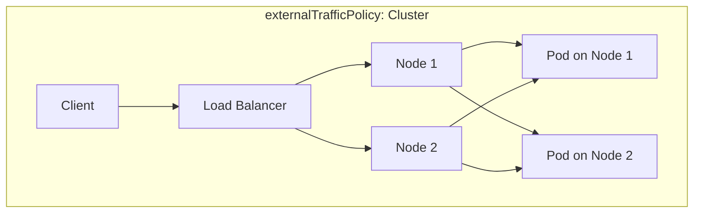
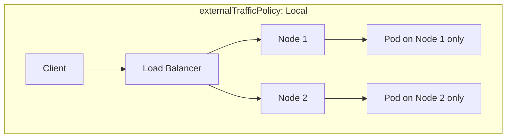
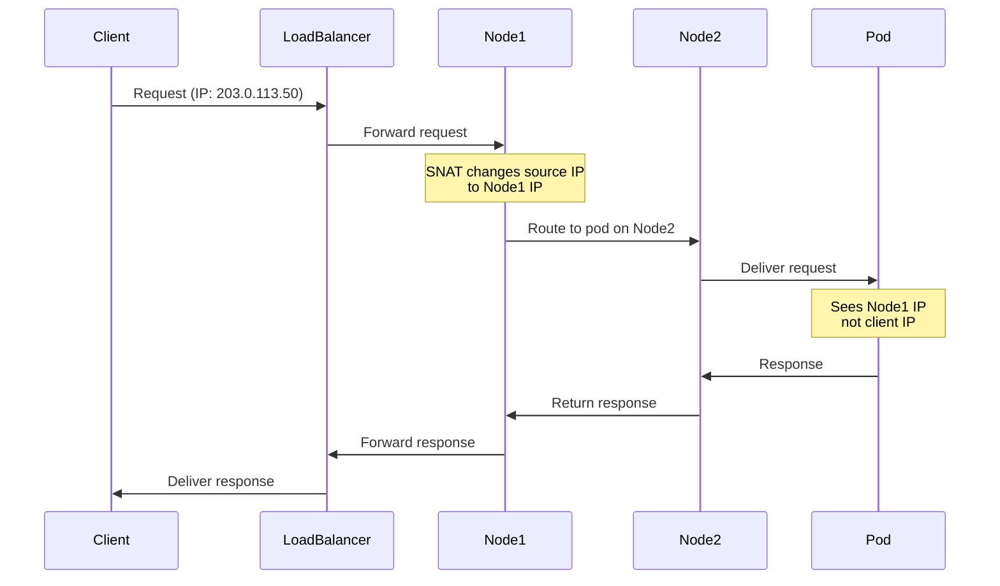
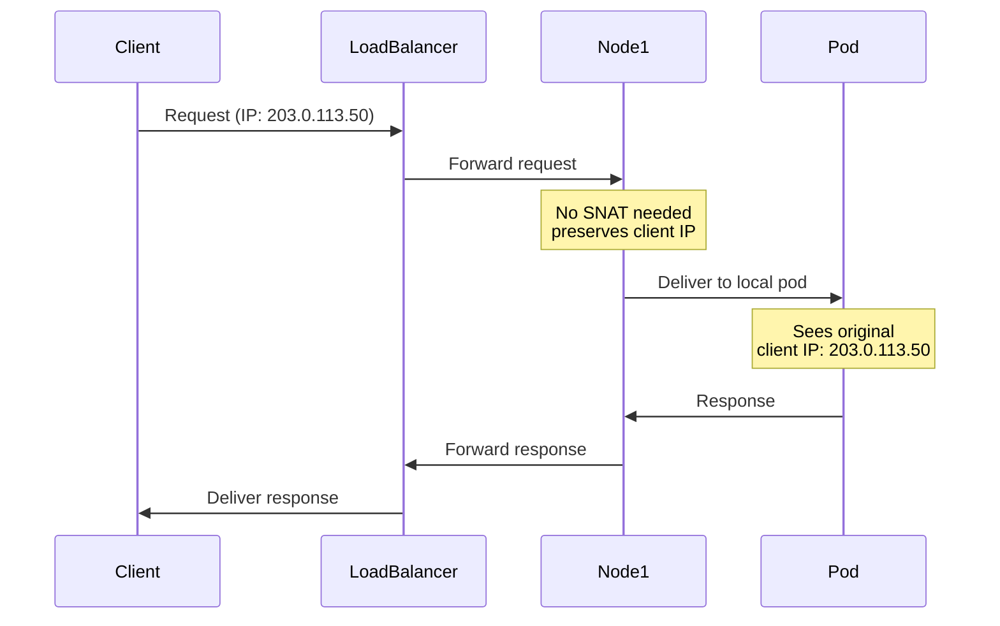
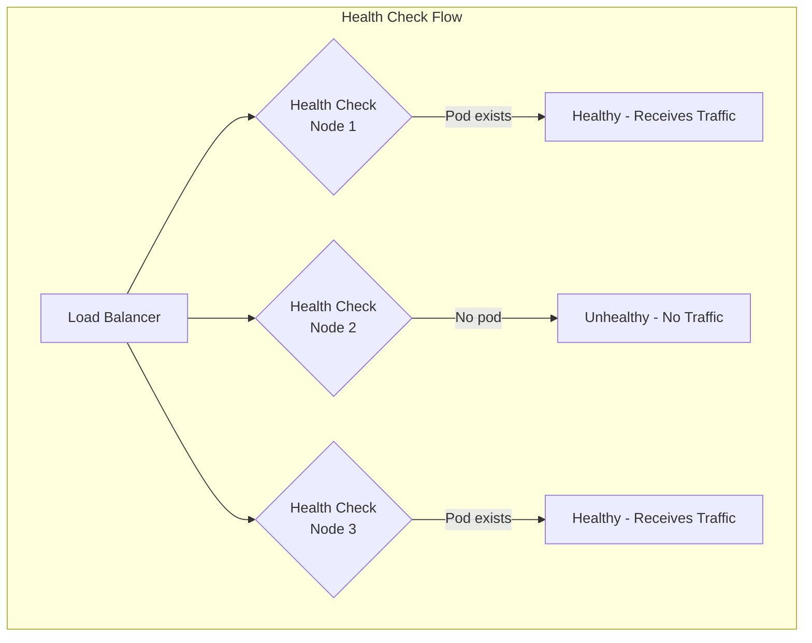
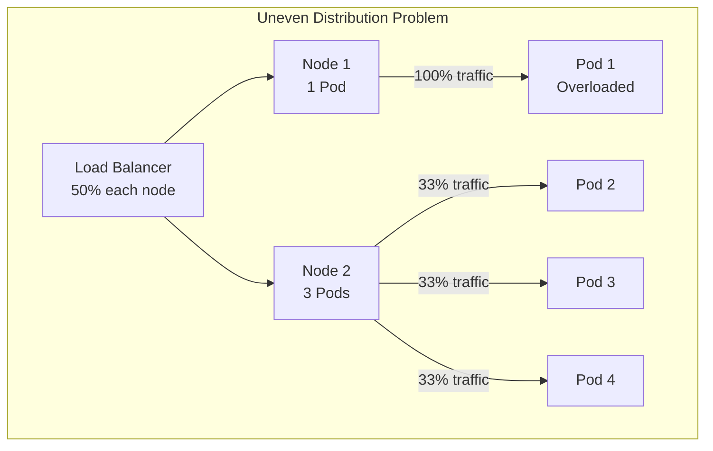
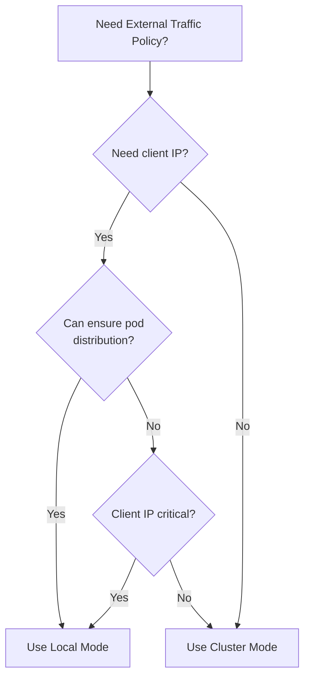
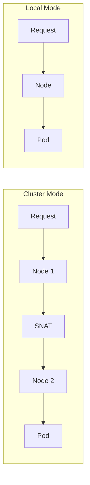

# How to Implement Kubernetes External Traffic Policy

Author: [nawazdhandala](https://github.com/nawazdhandala)

Tags: Kubernetes, External Traffic Policy, Networking, Load Balancing

Description: Learn to implement external traffic policy with Local and Cluster modes for client IP preservation and optimal traffic routing.

---

## Introduction

When exposing applications to external traffic in Kubernetes, understanding how traffic flows from clients to your pods is crucial. The `externalTrafficPolicy` setting on Services determines how external traffic is routed and whether the original client IP address is preserved. This guide covers everything you need to know about implementing external traffic policies effectively.

## Understanding External Traffic Policy

Kubernetes Services support two external traffic policy modes:

- **Cluster** (default): Distributes traffic across all nodes, potentially losing the client IP
- **Local**: Routes traffic only to pods on the receiving node, preserving the client IP

### Traffic Flow Comparison





## Cluster Mode - The Default Behavior

With `externalTrafficPolicy: Cluster`, traffic can be routed to any pod in the cluster regardless of which node receives the initial request. This provides better load distribution but comes with trade-offs.

### How Cluster Mode Works



### Cluster Mode Service Configuration

```yaml
apiVersion: v1
kind: Service
metadata:
  name: my-app-cluster
  labels:
    app: my-app
spec:
  type: LoadBalancer
  externalTrafficPolicy: Cluster  # Default setting
  selector:
    app: my-app
  ports:
    - name: http
      port: 80
      targetPort: 8080
      protocol: TCP
```

### Characteristics of Cluster Mode

| Aspect | Behavior |
|--------|----------|
| Load Distribution | Even across all pods |
| Client IP | Lost due to SNAT |
| Network Hops | May require extra hop between nodes |
| Availability | Traffic goes to any healthy pod |
| Node Health Checks | All nodes pass health checks |

## Local Mode - Preserving Client IP

With `externalTrafficPolicy: Local`, traffic is only routed to pods running on the node that receives the request. This preserves the original client IP address.

### How Local Mode Works



### Local Mode Service Configuration

```yaml
apiVersion: v1
kind: Service
metadata:
  name: my-app-local
  labels:
    app: my-app
spec:
  type: LoadBalancer
  externalTrafficPolicy: Local
  selector:
    app: my-app
  ports:
    - name: http
      port: 80
      targetPort: 8080
      protocol: TCP
```

### Characteristics of Local Mode

| Aspect | Behavior |
|--------|----------|
| Load Distribution | Potentially uneven |
| Client IP | Preserved |
| Network Hops | Single hop to local pod |
| Availability | Only nodes with pods receive traffic |
| Node Health Checks | Nodes without pods fail health checks |

## Client IP Preservation in Detail

### Why Client IP Matters

Preserving the client IP is essential for:

- **Security**: IP-based access control and rate limiting
- **Logging**: Accurate audit trails and analytics
- **Geolocation**: Location-based content delivery
- **Compliance**: Regulatory requirements for tracking

### Verifying Client IP in Your Application

Here is a simple Go application to verify client IP preservation:

```go
package main

import (
    "encoding/json"
    "log"
    "net"
    "net/http"
    "os"
    "strings"
)

type RequestInfo struct {
    RemoteAddr     string            `json:"remote_addr"`
    XForwardedFor  string            `json:"x_forwarded_for"`
    XRealIP        string            `json:"x_real_ip"`
    Headers        map[string]string `json:"headers"`
    ServerHostname string            `json:"server_hostname"`
}

func main() {
    http.HandleFunc("/", func(w http.ResponseWriter, r *http.Request) {
        // Extract the actual client IP
        clientIP := getClientIP(r)

        hostname, _ := os.Hostname()

        info := RequestInfo{
            RemoteAddr:     r.RemoteAddr,
            XForwardedFor:  r.Header.Get("X-Forwarded-For"),
            XRealIP:        r.Header.Get("X-Real-IP"),
            Headers:        make(map[string]string),
            ServerHostname: hostname,
        }

        // Capture relevant headers
        for _, header := range []string{"X-Forwarded-For", "X-Real-IP", "X-Forwarded-Proto"} {
            if val := r.Header.Get(header); val != "" {
                info.Headers[header] = val
            }
        }

        log.Printf("Request from client IP: %s", clientIP)

        w.Header().Set("Content-Type", "application/json")
        json.NewEncoder(w).Encode(info)
    })

    log.Println("Server starting on :8080")
    log.Fatal(http.ListenAndServe(":8080", nil))
}

func getClientIP(r *http.Request) string {
    // Check X-Forwarded-For header first
    if xff := r.Header.Get("X-Forwarded-For"); xff != "" {
        ips := strings.Split(xff, ",")
        if len(ips) > 0 {
            return strings.TrimSpace(ips[0])
        }
    }

    // Check X-Real-IP header
    if xrip := r.Header.Get("X-Real-IP"); xrip != "" {
        return xrip
    }

    // Fall back to RemoteAddr
    ip, _, err := net.SplitHostPort(r.RemoteAddr)
    if err != nil {
        return r.RemoteAddr
    }
    return ip
}
```

### Dockerfile for the Test Application

```dockerfile
FROM golang:1.21-alpine AS builder
WORKDIR /app
COPY main.go .
RUN go build -o server main.go

FROM alpine:latest
WORKDIR /app
COPY --from=builder /app/server .
EXPOSE 8080
CMD ["./server"]
```

## Health Checks and Node Availability

### Understanding Health Check Behavior

With Local mode, the load balancer uses health checks to determine which nodes have pods running. Nodes without pods will fail health checks and stop receiving traffic.



### Configuring Health Check Parameters

You can customize health check behavior using annotations specific to your cloud provider. Here is an example for AWS:

```yaml
apiVersion: v1
kind: Service
metadata:
  name: my-app
  annotations:
    # AWS NLB health check settings
    service.beta.kubernetes.io/aws-load-balancer-healthcheck-interval: "10"
    service.beta.kubernetes.io/aws-load-balancer-healthcheck-timeout: "5"
    service.beta.kubernetes.io/aws-load-balancer-healthcheck-healthy-threshold: "2"
    service.beta.kubernetes.io/aws-load-balancer-healthcheck-unhealthy-threshold: "2"
spec:
  type: LoadBalancer
  externalTrafficPolicy: Local
  healthCheckNodePort: 30000  # Optional: specify a fixed port
  selector:
    app: my-app
  ports:
    - port: 80
      targetPort: 8080
```

### Health Check Node Port

When using Local mode, Kubernetes automatically allocates a health check node port. You can verify this:

```bash
# Get the service details including health check node port
kubectl get service my-app -o yaml | grep -A5 "healthCheckNodePort"

# Test the health check endpoint directly
curl http://<node-ip>:<healthCheckNodePort>/healthz
```

## Ensuring Even Traffic Distribution with Local Mode

### The Distribution Challenge



### Solution: Pod Anti-Affinity

Use pod anti-affinity to distribute pods evenly across nodes:

```yaml
apiVersion: apps/v1
kind: Deployment
metadata:
  name: my-app
spec:
  replicas: 3
  selector:
    matchLabels:
      app: my-app
  template:
    metadata:
      labels:
        app: my-app
    spec:
      affinity:
        podAntiAffinity:
          preferredDuringSchedulingIgnoredDuringExecution:
            - weight: 100
              podAffinityTerm:
                labelSelector:
                  matchExpressions:
                    - key: app
                      operator: In
                      values:
                        - my-app
                topologyKey: kubernetes.io/hostname
      containers:
        - name: my-app
          image: my-app:latest
          ports:
            - containerPort: 8080
          resources:
            requests:
              cpu: 100m
              memory: 128Mi
            limits:
              cpu: 500m
              memory: 512Mi
```

### Solution: Topology Spread Constraints

For more control over pod distribution, use topology spread constraints:

```yaml
apiVersion: apps/v1
kind: Deployment
metadata:
  name: my-app
spec:
  replicas: 6
  selector:
    matchLabels:
      app: my-app
  template:
    metadata:
      labels:
        app: my-app
    spec:
      topologySpreadConstraints:
        - maxSkew: 1
          topologyKey: kubernetes.io/hostname
          whenUnsatisfiable: DoNotSchedule
          labelSelector:
            matchLabels:
              app: my-app
        - maxSkew: 1
          topologyKey: topology.kubernetes.io/zone
          whenUnsatisfiable: ScheduleAnyway
          labelSelector:
            matchLabels:
              app: my-app
      containers:
        - name: my-app
          image: my-app:latest
          ports:
            - containerPort: 8080
```

## Complete Example: Production-Ready Configuration

Here is a complete example combining all best practices:

### Namespace and ConfigMap

```yaml
apiVersion: v1
kind: Namespace
metadata:
  name: production
---
apiVersion: v1
kind: ConfigMap
metadata:
  name: app-config
  namespace: production
data:
  LOG_LEVEL: "info"
  ENABLE_METRICS: "true"
```

### Deployment with Anti-Affinity

```yaml
apiVersion: apps/v1
kind: Deployment
metadata:
  name: web-app
  namespace: production
  labels:
    app: web-app
spec:
  replicas: 4
  selector:
    matchLabels:
      app: web-app
  template:
    metadata:
      labels:
        app: web-app
      annotations:
        prometheus.io/scrape: "true"
        prometheus.io/port: "8080"
        prometheus.io/path: "/metrics"
    spec:
      topologySpreadConstraints:
        - maxSkew: 1
          topologyKey: kubernetes.io/hostname
          whenUnsatisfiable: DoNotSchedule
          labelSelector:
            matchLabels:
              app: web-app
      containers:
        - name: web-app
          image: my-registry/web-app:v1.2.3
          ports:
            - name: http
              containerPort: 8080
          envFrom:
            - configMapRef:
                name: app-config
          readinessProbe:
            httpGet:
              path: /healthz
              port: 8080
            initialDelaySeconds: 5
            periodSeconds: 10
          livenessProbe:
            httpGet:
              path: /healthz
              port: 8080
            initialDelaySeconds: 15
            periodSeconds: 20
          resources:
            requests:
              cpu: 200m
              memory: 256Mi
            limits:
              cpu: 1000m
              memory: 1Gi
```

### Service with Local Traffic Policy

```yaml
apiVersion: v1
kind: Service
metadata:
  name: web-app
  namespace: production
  labels:
    app: web-app
  annotations:
    # Cloud provider specific annotations (AWS example)
    service.beta.kubernetes.io/aws-load-balancer-type: "nlb"
    service.beta.kubernetes.io/aws-load-balancer-cross-zone-load-balancing-enabled: "true"
spec:
  type: LoadBalancer
  externalTrafficPolicy: Local
  selector:
    app: web-app
  ports:
    - name: http
      port: 80
      targetPort: 8080
      protocol: TCP
```

### Pod Disruption Budget

```yaml
apiVersion: policy/v1
kind: PodDisruptionBudget
metadata:
  name: web-app-pdb
  namespace: production
spec:
  minAvailable: 2
  selector:
    matchLabels:
      app: web-app
```

## Trade-offs and Decision Matrix

### When to Use Each Mode



### Comparison Table

| Factor | Cluster Mode | Local Mode |
|--------|--------------|------------|
| Client IP Preservation | No | Yes |
| Load Distribution | Even across all pods | Depends on pod placement |
| Network Latency | May add inter-node hop | Direct to local pod |
| Node Availability | All nodes receive traffic | Only nodes with pods |
| Configuration Complexity | Simple | Requires pod distribution strategy |
| Health Check Behavior | Always healthy | Based on pod presence |
| Scaling Considerations | No special requirements | Need to maintain pod distribution |

### Performance Implications



## Troubleshooting Common Issues

### Issue 1: Traffic Not Reaching Pods with Local Mode

Check if pods are running on nodes receiving traffic:

```bash
# List pods with node information
kubectl get pods -o wide -l app=my-app

# Check service endpoints
kubectl get endpoints my-app

# Verify node health check status
kubectl describe service my-app | grep -A10 "Events"
```

### Issue 2: Uneven Load Distribution

Verify pod distribution across nodes:

```bash
# Count pods per node
kubectl get pods -l app=my-app -o wide | awk '{print $7}' | sort | uniq -c

# Check topology spread constraint status
kubectl describe pod <pod-name> | grep -A5 "Topology Spread"
```

### Issue 3: Client IP Still Not Visible

Verify the traffic policy is correctly applied:

```bash
# Check service configuration
kubectl get service my-app -o jsonpath='{.spec.externalTrafficPolicy}'

# Verify from inside the pod
kubectl exec -it <pod-name> -- curl -s http://localhost:8080 | jq .
```

### Debugging Script

```bash
#!/bin/bash

SERVICE_NAME=${1:-my-app}
NAMESPACE=${2:-default}

echo "=== Service Configuration ==="
kubectl get service $SERVICE_NAME -n $NAMESPACE -o yaml

echo -e "\n=== External Traffic Policy ==="
kubectl get service $SERVICE_NAME -n $NAMESPACE \
    -o jsonpath='External Traffic Policy: {.spec.externalTrafficPolicy}{"\n"}'

echo -e "\n=== Health Check Node Port ==="
kubectl get service $SERVICE_NAME -n $NAMESPACE \
    -o jsonpath='Health Check Port: {.spec.healthCheckNodePort}{"\n"}'

echo -e "\n=== Endpoints ==="
kubectl get endpoints $SERVICE_NAME -n $NAMESPACE

echo -e "\n=== Pods Distribution ==="
kubectl get pods -n $NAMESPACE -l app=$SERVICE_NAME -o wide

echo -e "\n=== Pods per Node ==="
kubectl get pods -n $NAMESPACE -l app=$SERVICE_NAME -o wide | \
    tail -n +2 | awk '{print $7}' | sort | uniq -c
```

## Cloud Provider Considerations

### AWS (EKS)

```yaml
apiVersion: v1
kind: Service
metadata:
  name: my-app
  annotations:
    service.beta.kubernetes.io/aws-load-balancer-type: "nlb"
    service.beta.kubernetes.io/aws-load-balancer-nlb-target-type: "ip"
    service.beta.kubernetes.io/aws-load-balancer-scheme: "internet-facing"
spec:
  type: LoadBalancer
  externalTrafficPolicy: Local
  selector:
    app: my-app
  ports:
    - port: 80
      targetPort: 8080
```

### Google Cloud (GKE)

```yaml
apiVersion: v1
kind: Service
metadata:
  name: my-app
  annotations:
    cloud.google.com/neg: '{"ingress": true}'
    cloud.google.com/backend-config: '{"default": "my-backend-config"}'
spec:
  type: LoadBalancer
  externalTrafficPolicy: Local
  selector:
    app: my-app
  ports:
    - port: 80
      targetPort: 8080
```

### Azure (AKS)

```yaml
apiVersion: v1
kind: Service
metadata:
  name: my-app
  annotations:
    service.beta.kubernetes.io/azure-load-balancer-internal: "false"
spec:
  type: LoadBalancer
  externalTrafficPolicy: Local
  selector:
    app: my-app
  ports:
    - port: 80
      targetPort: 8080
```

## Summary

Implementing Kubernetes external traffic policy correctly is essential for applications that need client IP preservation. Here are the key takeaways:

1. **Default to Cluster mode** when client IP is not important and even load distribution is the priority
2. **Use Local mode** when you need to preserve client IP for security, logging, or compliance
3. **Always implement pod distribution strategies** when using Local mode to ensure even traffic distribution
4. **Configure health checks appropriately** to handle node failures gracefully
5. **Test thoroughly** to verify client IP preservation and traffic distribution
6. **Monitor load distribution** to detect and address imbalances

By following these guidelines and using the configurations provided, you can implement external traffic policies that meet your application requirements while maintaining reliability and performance.

## Further Reading

- [Kubernetes Service Documentation](https://kubernetes.io/docs/concepts/services-networking/service/)
- [Source IP for Services with Type LoadBalancer](https://kubernetes.io/docs/tutorials/services/source-ip/)
- [Topology Spread Constraints](https://kubernetes.io/docs/concepts/scheduling-eviction/topology-spread-constraints/)
