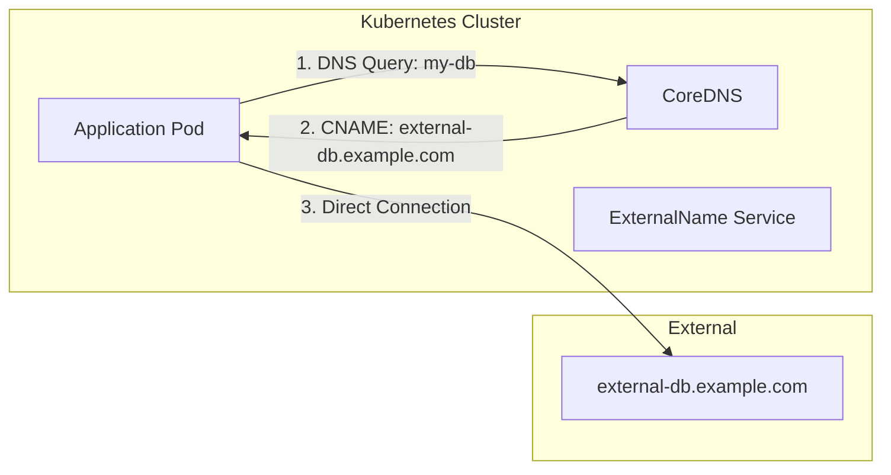
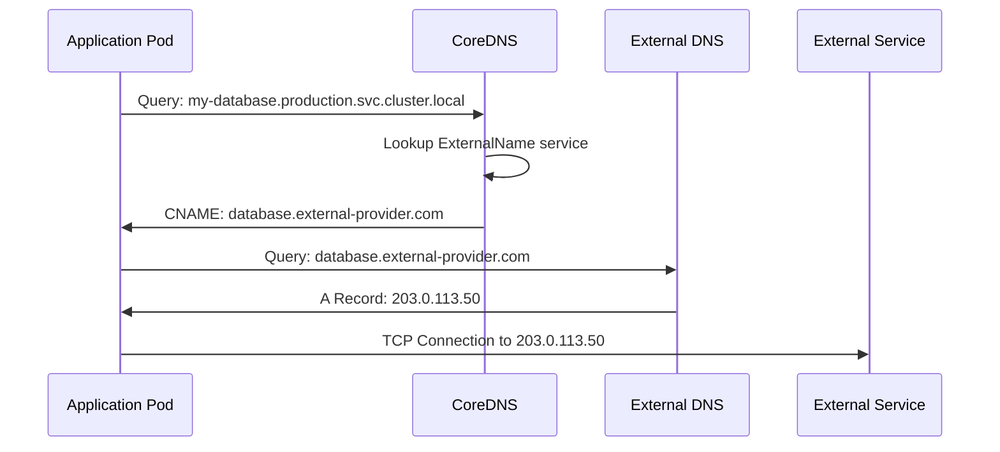
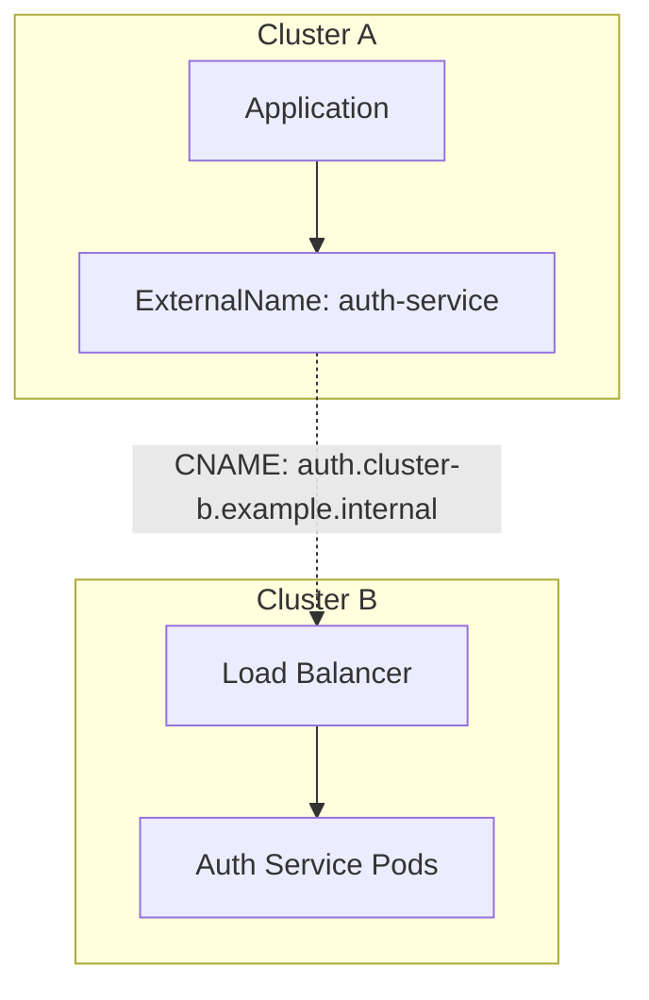
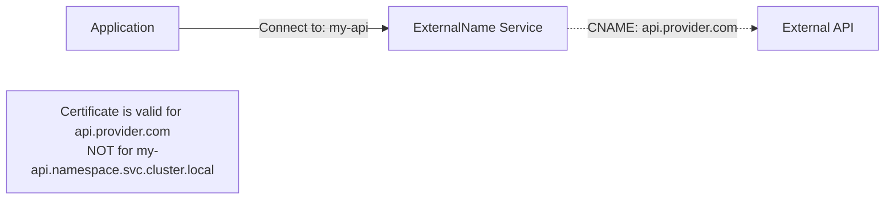
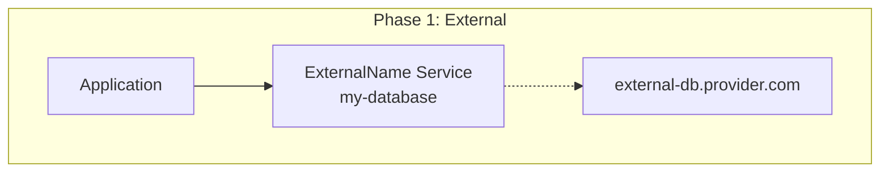
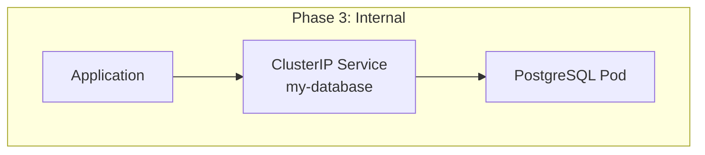

# How to Build Kubernetes ExternalName Services

Author: [nawazdhandala](https://github.com/nawazdhandala)

Tags: Kubernetes, ExternalName, Services, DNS

Description: Learn to implement ExternalName services for accessing external services through Kubernetes DNS with proper configuration and migration patterns.

---

Kubernetes ExternalName services provide a powerful mechanism to reference external services using Kubernetes-native DNS resolution. Instead of hardcoding external hostnames throughout your applications, you can create a service abstraction that maps to an external DNS name. This approach simplifies configuration management, enables easier migrations, and maintains consistency with how you access internal services.

## Understanding ExternalName Services

An ExternalName service is a special type of Kubernetes service that does not route traffic through a proxy or load balancer. Instead, it creates a CNAME DNS record that points to an external hostname. When your application queries the service name, Kubernetes DNS returns the external hostname, and your application connects directly to that external endpoint.



The key difference from other service types is that ExternalName services do not have cluster IPs, endpoints, or selectors. They purely function as DNS aliases.

## Basic ExternalName Service Setup

Let us start with a simple example. Suppose your application needs to connect to an external database hosted at `database.external-provider.com`.

### Creating the Service

```yaml
# external-database-service.yaml
apiVersion: v1
kind: Service
metadata:
  name: my-database
  namespace: production
spec:
  type: ExternalName
  externalName: database.external-provider.com
```

Apply the configuration:

```bash
kubectl apply -f external-database-service.yaml
```

Verify the service:

```bash
kubectl get service my-database -n production
```

Output:

```
NAME          TYPE           CLUSTER-IP   EXTERNAL-IP                        PORT(S)   AGE
my-database   ExternalName   <none>       database.external-provider.com     <none>    5s
```

### How Applications Use It

Your application can now connect to `my-database` or the fully qualified domain name `my-database.production.svc.cluster.local`. Kubernetes DNS resolves this to `database.external-provider.com`.

```python
# Python application example
import psycopg2

# Instead of hardcoding: database.external-provider.com
# Use the service name
connection = psycopg2.connect(
    host="my-database",  # ExternalName service
    port=5432,
    database="myapp",
    user="appuser",
    password=os.environ["DB_PASSWORD"]
)
```

## DNS Resolution Flow

Understanding how DNS resolution works with ExternalName services helps troubleshoot issues and design better architectures.



The resolution happens in two phases:

1. **Internal Resolution**: CoreDNS receives the query and returns a CNAME record pointing to the external hostname
2. **External Resolution**: The application (or its resolver) then queries external DNS to get the actual IP address

## Practical Use Cases

### Use Case 1: Managed Database Services

Connect to cloud-managed databases like AWS RDS, Google Cloud SQL, or Azure Database services.

```yaml
apiVersion: v1
kind: Service
metadata:
  name: postgres-primary
  namespace: app
  labels:
    app: myapp
    component: database
spec:
  type: ExternalName
  externalName: mydb-instance.abc123.us-east-1.rds.amazonaws.com
```

### Use Case 2: Third-Party APIs

Create service abstractions for external APIs:

```yaml
apiVersion: v1
kind: Service
metadata:
  name: payment-gateway
  namespace: checkout
spec:
  type: ExternalName
  externalName: api.stripe.com
---
apiVersion: v1
kind: Service
metadata:
  name: email-service
  namespace: notifications
spec:
  type: ExternalName
  externalName: smtp.sendgrid.net
```

### Use Case 3: Cross-Cluster Communication

Reference services in other Kubernetes clusters:

```yaml
apiVersion: v1
kind: Service
metadata:
  name: auth-service
  namespace: app
spec:
  type: ExternalName
  externalName: auth.cluster-b.example.internal
```



### Use Case 4: Legacy System Integration

Bridge containerized applications with legacy systems:

```yaml
apiVersion: v1
kind: Service
metadata:
  name: legacy-erp
  namespace: integration
  annotations:
    description: "Legacy ERP system - contact infra team for issues"
spec:
  type: ExternalName
  externalName: erp.legacy.internal.company.com
```

## Configuration Best Practices

### Adding Metadata and Labels

Include descriptive metadata for better operational management:

```yaml
apiVersion: v1
kind: Service
metadata:
  name: analytics-db
  namespace: data-platform
  labels:
    app.kubernetes.io/name: analytics-db
    app.kubernetes.io/component: database
    app.kubernetes.io/part-of: data-platform
    environment: production
  annotations:
    description: "Production analytics database on Google Cloud SQL"
    owner: data-team@company.com
    external-dns.alpha.kubernetes.io/hostname: analytics-db.data-platform.svc.cluster.local
spec:
  type: ExternalName
  externalName: analytics-instance.us-central1.sql.gcp.company.com
```

### Namespace Organization

Organize ExternalName services by function or team:

```yaml
# Create dedicated namespace for external service references
apiVersion: v1
kind: Namespace
metadata:
  name: external-services
  labels:
    purpose: external-service-references
---
apiVersion: v1
kind: Service
metadata:
  name: mongodb-atlas
  namespace: external-services
spec:
  type: ExternalName
  externalName: cluster0.abc123.mongodb.net
---
apiVersion: v1
kind: Service
metadata:
  name: elasticsearch-cloud
  namespace: external-services
spec:
  type: ExternalName
  externalName: my-deployment.es.us-east-1.aws.found.io
```

## Working with Ports

ExternalName services do not define ports in the traditional sense because they do not proxy traffic. However, you can add port definitions for documentation purposes and service mesh compatibility:

```yaml
apiVersion: v1
kind: Service
metadata:
  name: external-api
  namespace: app
spec:
  type: ExternalName
  externalName: api.external-service.com
  ports:
    - port: 443
      targetPort: 443
      protocol: TCP
      name: https
```

Note that these port definitions do not affect traffic routing for ExternalName services - they primarily serve as documentation and metadata.

## Limitations and Considerations

### Limitation 1: No IP Address Support

ExternalName services only work with DNS hostnames. You cannot specify an IP address:

```yaml
# This will NOT work
apiVersion: v1
kind: Service
metadata:
  name: external-by-ip
spec:
  type: ExternalName
  externalName: 192.168.1.100  # Invalid - must be a hostname
```

**Workaround**: Use a headless service with manual Endpoints:

```yaml
apiVersion: v1
kind: Service
metadata:
  name: external-by-ip
spec:
  clusterIP: None
  ports:
    - port: 8080
---
apiVersion: v1
kind: Endpoints
metadata:
  name: external-by-ip
subsets:
  - addresses:
      - ip: 192.168.1.100
    ports:
      - port: 8080
```

### Limitation 2: TLS Certificate Validation

When using TLS, the client validates the certificate against the hostname it connects to. This can cause issues:



**Solution**: Configure your application to use the external hostname for TLS validation:

```yaml
# Application ConfigMap
apiVersion: v1
kind: ConfigMap
metadata:
  name: app-config
data:
  API_HOST: "my-api"  # For connection
  API_TLS_SERVER_NAME: "api.provider.com"  # For certificate validation
```

### Limitation 3: No Load Balancing

ExternalName services do not perform load balancing. If the external DNS returns multiple IP addresses, load balancing depends on your application or DNS resolver behavior.

### Limitation 4: DNS Caching

DNS responses may be cached by various components:

- CoreDNS caches records
- Application-level DNS caching
- Operating system resolver caching

Consider TTL values when the external endpoint changes frequently.

## Migration Patterns

One of the most powerful uses of ExternalName services is facilitating migrations - either moving services into Kubernetes or migrating between external providers.

### Pattern 1: External to Internal Migration

Migrate an external database into Kubernetes without changing application code:



**Phase 1: Initial Setup**

```yaml
# Point to external database
apiVersion: v1
kind: Service
metadata:
  name: my-database
spec:
  type: ExternalName
  externalName: external-db.provider.com
```

**Phase 2: Deploy Internal Database**

```yaml
# Deploy StatefulSet for new internal database
apiVersion: apps/v1
kind: StatefulSet
metadata:
  name: postgres
spec:
  serviceName: postgres-headless
  replicas: 1
  selector:
    matchLabels:
      app: postgres
  template:
    metadata:
      labels:
        app: postgres
    spec:
      containers:
        - name: postgres
          image: postgres:15
          ports:
            - containerPort: 5432
          volumeMounts:
            - name: data
              mountPath: /var/lib/postgresql/data
  volumeClaimTemplates:
    - metadata:
        name: data
      spec:
        accessModes: ["ReadWriteOnce"]
        resources:
          requests:
            storage: 100Gi
```

**Phase 3: Switch to Internal Service**

```yaml
# Replace ExternalName with ClusterIP service
apiVersion: v1
kind: Service
metadata:
  name: my-database
spec:
  type: ClusterIP
  selector:
    app: postgres
  ports:
    - port: 5432
      targetPort: 5432
```



### Pattern 2: Provider Migration

Migrate between cloud providers:

```yaml
# Step 1: Original provider
apiVersion: v1
kind: Service
metadata:
  name: cache
  annotations:
    migration-status: "source"
spec:
  type: ExternalName
  externalName: redis.abc123.cache.amazonaws.com
---
# Step 2: New provider (after data migration)
apiVersion: v1
kind: Service
metadata:
  name: cache
  annotations:
    migration-status: "target"
spec:
  type: ExternalName
  externalName: redis-cluster.memorystoreinstance.gcp.company.com
```

### Pattern 3: Blue-Green External Services

Implement blue-green deployments for external services:

```yaml
# Blue environment
apiVersion: v1
kind: Service
metadata:
  name: api-backend-blue
spec:
  type: ExternalName
  externalName: api-v1.backend.com
---
# Green environment
apiVersion: v1
kind: Service
metadata:
  name: api-backend-green
spec:
  type: ExternalName
  externalName: api-v2.backend.com
---
# Active service - point to current environment
apiVersion: v1
kind: Service
metadata:
  name: api-backend
spec:
  type: ExternalName
  externalName: api-v1.backend.com  # Switch to api-v2.backend.com when ready
```

## Troubleshooting

### Verify DNS Resolution

Test DNS resolution from within a pod:

```bash
# Create a debug pod
kubectl run dns-test --image=busybox:1.36 --rm -it --restart=Never -- nslookup my-database.production.svc.cluster.local
```

Expected output:

```
Server:    10.96.0.10
Address 1: 10.96.0.10 kube-dns.kube-system.svc.cluster.local

Name:      my-database.production.svc.cluster.local
Address 1: database.external-provider.com
```

### Check Service Configuration

```bash
kubectl describe service my-database -n production
```

Look for:

```
Name:              my-database
Namespace:         production
Type:              ExternalName
External Name:     database.external-provider.com
```

### Debug CoreDNS

Check CoreDNS logs for resolution issues:

```bash
kubectl logs -n kube-system -l k8s-app=kube-dns --tail=100
```

### Common Issues and Solutions

| Issue | Cause | Solution |
|-------|-------|----------|
| DNS resolution fails | Invalid external hostname | Verify the hostname resolves externally |
| Connection timeout | Firewall blocking egress | Check network policies and firewall rules |
| TLS errors | Certificate mismatch | Configure TLS server name override |
| Intermittent failures | DNS caching issues | Adjust TTL or implement retry logic |

## Complete Example: Multi-Environment Setup

Here is a complete example showing ExternalName services across multiple environments:

```yaml
# Base configuration using Kustomize
# base/external-services.yaml
apiVersion: v1
kind: Service
metadata:
  name: primary-database
spec:
  type: ExternalName
  externalName: placeholder.example.com
---
apiVersion: v1
kind: Service
metadata:
  name: cache-cluster
spec:
  type: ExternalName
  externalName: placeholder.example.com
---
apiVersion: v1
kind: Service
metadata:
  name: message-queue
spec:
  type: ExternalName
  externalName: placeholder.example.com
```

```yaml
# overlays/development/external-services-patch.yaml
apiVersion: v1
kind: Service
metadata:
  name: primary-database
spec:
  externalName: dev-db.internal.company.com
---
apiVersion: v1
kind: Service
metadata:
  name: cache-cluster
spec:
  externalName: dev-redis.internal.company.com
---
apiVersion: v1
kind: Service
metadata:
  name: message-queue
spec:
  externalName: dev-rabbitmq.internal.company.com
```

```yaml
# overlays/production/external-services-patch.yaml
apiVersion: v1
kind: Service
metadata:
  name: primary-database
spec:
  externalName: prod-db.abc123.us-east-1.rds.amazonaws.com
---
apiVersion: v1
kind: Service
metadata:
  name: cache-cluster
spec:
  externalName: prod-redis.abc123.cache.amazonaws.com
---
apiVersion: v1
kind: Service
metadata:
  name: message-queue
spec:
  externalName: prod-mq.servicebus.windows.net
```

```yaml
# overlays/development/kustomization.yaml
apiVersion: kustomize.config.k8s.io/v1beta1
kind: Kustomization
resources:
  - ../../base
patchesStrategicMerge:
  - external-services-patch.yaml
```

Deploy with Kustomize:

```bash
# Development
kubectl apply -k overlays/development/

# Production
kubectl apply -k overlays/production/
```

## Summary

Kubernetes ExternalName services provide a clean abstraction layer for accessing external resources through Kubernetes-native DNS. Key takeaways:

- **Simplicity**: ExternalName services create DNS CNAME records without proxying traffic
- **Abstraction**: Applications use consistent service names regardless of where resources are hosted
- **Migration**: Enable seamless migrations by changing the ExternalName without modifying application code
- **Limitations**: Remember that ExternalName services only work with hostnames, do not provide load balancing, and may require TLS configuration adjustments

When designing your Kubernetes architecture, consider ExternalName services as a tool for managing external dependencies. They integrate naturally with your existing service discovery patterns and make your infrastructure more maintainable and portable.
