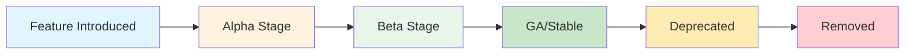
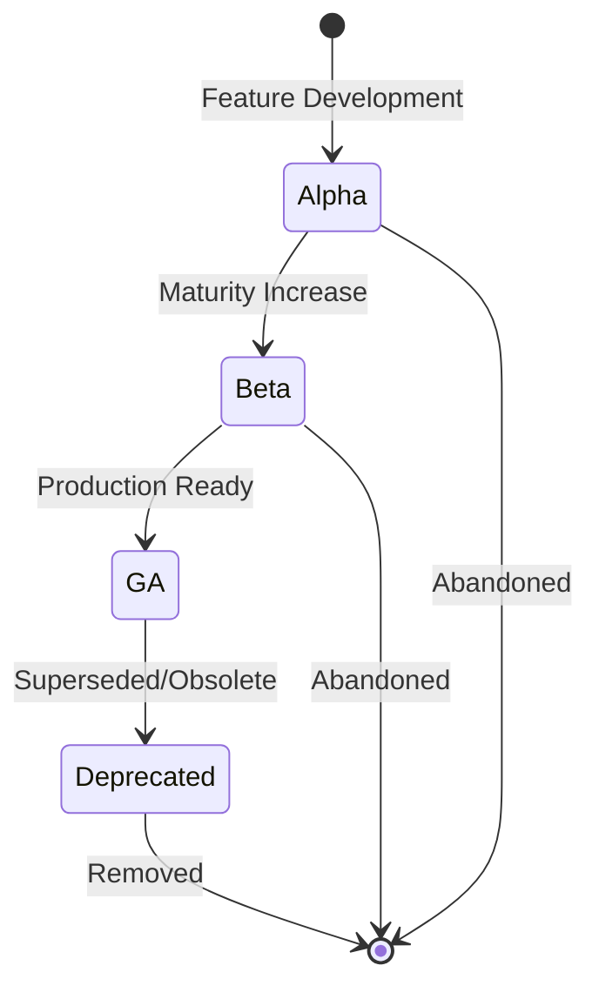
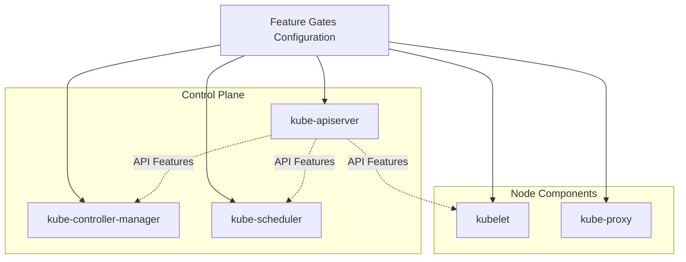
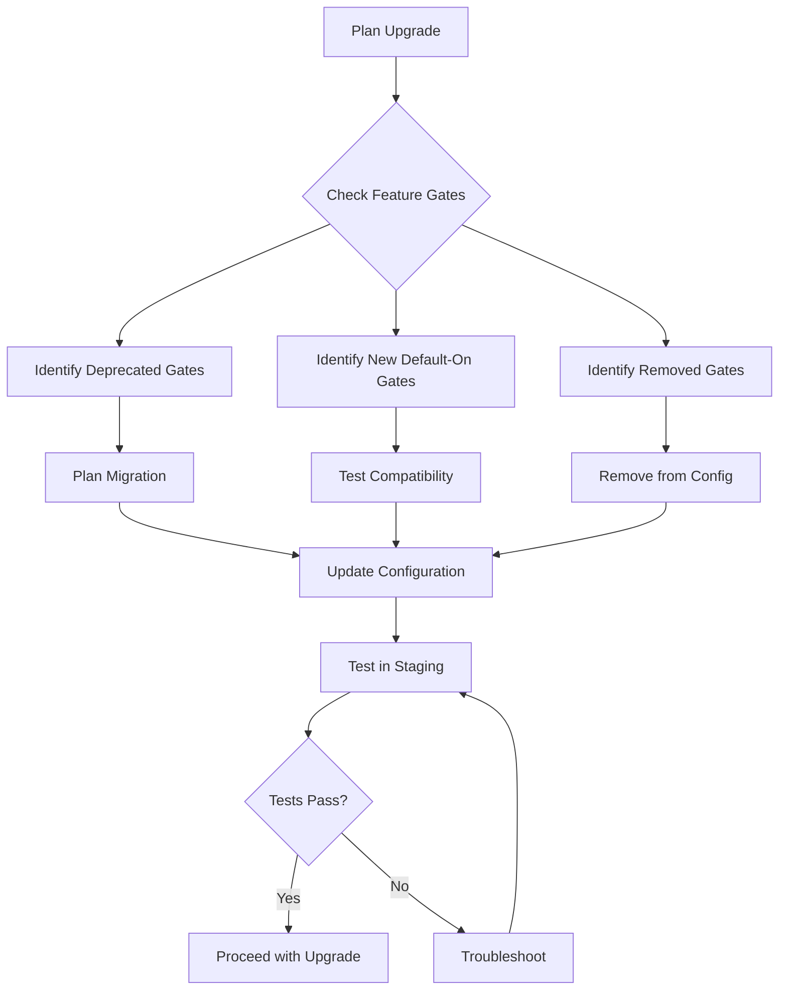
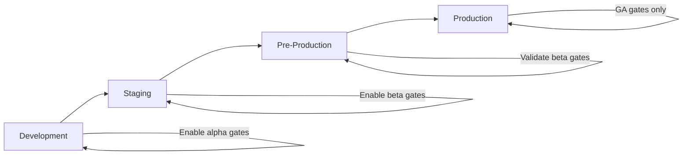

# How to Build Kubernetes Feature Gates

Author: [nawazdhandala](https://github.com/nawazdhandala)

Tags: Kubernetes, Feature Gates, Configuration, Cluster Management

Description: Learn to implement feature gates for enabling alpha and beta features with proper configuration and upgrade considerations.

---

Feature gates in Kubernetes provide a mechanism to enable or disable specific features in your cluster. They give administrators fine-grained control over which experimental, beta, or deprecated features are active. This guide walks you through understanding, configuring, and managing feature gates effectively.

## What Are Feature Gates?

Feature gates are key-value pairs that control the availability of Kubernetes features. Each feature gate corresponds to a specific functionality that can be toggled on or off. This system allows the Kubernetes project to introduce new features gradually while maintaining stability for production environments.



## Feature Gate Lifecycle Stages

Understanding the lifecycle of feature gates is essential for making informed decisions about which features to enable in your environment.

### Stage Definitions

| Stage | Default State | Recommended Use | Stability |
|-------|--------------|-----------------|-----------|
| Alpha | Disabled | Testing/Development only | May change or be removed |
| Beta | Usually Enabled | Non-critical workloads | API may change slightly |
| GA (General Availability) | Enabled | Production ready | Stable, locked on |
| Deprecated | Varies | Plan migration away | Will be removed |



## Enabling and Disabling Feature Gates

Feature gates are configured through command-line arguments passed to Kubernetes components. The syntax follows a simple pattern.

### Basic Syntax

```bash
--feature-gates=FeatureName1=true,FeatureName2=false
```

### Configuring the API Server

To enable feature gates on the kube-apiserver, modify its manifest or startup configuration:

```yaml
# /etc/kubernetes/manifests/kube-apiserver.yaml
apiVersion: v1
kind: Pod
metadata:
  name: kube-apiserver
  namespace: kube-system
spec:
  containers:
  - name: kube-apiserver
    command:
    - kube-apiserver
    - --feature-gates=GracefulNodeShutdown=true,PodDisruptionConditions=true
    - --advertise-address=192.168.1.100
    - --allow-privileged=true
    # ... other flags
```

### Configuring the Kubelet

For kubelet configuration, you can use either command-line flags or a configuration file:

**Using command-line flags:**

```bash
kubelet --feature-gates=GracefulNodeShutdown=true,MemoryQoS=true
```

**Using a configuration file (recommended):**

```yaml
# /var/lib/kubelet/config.yaml
apiVersion: kubelet.config.k8s.io/v1beta1
kind: KubeletConfiguration
featureGates:
  GracefulNodeShutdown: true
  MemoryQoS: true
  TopologyManager: true
cgroupDriver: systemd
```

### Configuring the Controller Manager

```yaml
# /etc/kubernetes/manifests/kube-controller-manager.yaml
apiVersion: v1
kind: Pod
metadata:
  name: kube-controller-manager
  namespace: kube-system
spec:
  containers:
  - name: kube-controller-manager
    command:
    - kube-controller-manager
    - --feature-gates=TTLAfterFinished=true,JobTrackingWithFinalizers=true
    - --leader-elect=true
    # ... other flags
```

## Component-Specific Feature Gates

Different Kubernetes components support different feature gates. Here is how they relate:



### Common Feature Gates by Component

**API Server specific:**
```bash
--feature-gates=APIPriorityAndFairness=true,APIListChunking=true
```

**Scheduler specific:**
```bash
--feature-gates=PodTopologySpread=true,DefaultPodTopologySpread=true
```

**Kubelet specific:**
```bash
--feature-gates=CPUManager=true,MemoryManager=true,TopologyManager=true
```

## Practical Example: Enabling Pod Security Admission

Let us walk through enabling a feature gate across your cluster components.

### Step 1: Check Current Feature Gate Status

```bash
# Check API server feature gates
kubectl get pods -n kube-system kube-apiserver-master -o yaml | grep feature-gates

# Check kubelet feature gates on a node
ssh node1 "cat /var/lib/kubelet/config.yaml | grep -A 10 featureGates"
```

### Step 2: Update API Server Configuration

```yaml
apiVersion: v1
kind: Pod
metadata:
  name: kube-apiserver
  namespace: kube-system
spec:
  containers:
  - name: kube-apiserver
    command:
    - kube-apiserver
    - --feature-gates=PodSecurity=true
    - --admission-control-config-file=/etc/kubernetes/admission/config.yaml
```

### Step 3: Create Admission Configuration

```yaml
# /etc/kubernetes/admission/config.yaml
apiVersion: apiserver.config.k8s.io/v1
kind: AdmissionConfiguration
plugins:
- name: PodSecurity
  configuration:
    apiVersion: pod-security.admission.config.k8s.io/v1
    kind: PodSecurityConfiguration
    defaults:
      enforce: "baseline"
      enforce-version: "latest"
      audit: "restricted"
      audit-version: "latest"
      warn: "restricted"
      warn-version: "latest"
```

### Step 4: Apply and Verify

```bash
# Restart the API server (happens automatically with static pods)
# Verify the feature is active
kubectl api-resources | grep -i security

# Test with a namespace
kubectl label namespace default pod-security.kubernetes.io/enforce=baseline
```

## Version Considerations and Upgrade Planning

When planning upgrades, feature gate changes require careful consideration.



### Checking Feature Gate Changes Between Versions

```bash
# List all feature gates and their status for current version
kubectl api-versions
kubectl get --raw /metrics | grep kubernetes_feature_enabled

# Compare release notes for feature gate changes
# Example script to document current feature gates
cat << 'EOF' > check-feature-gates.sh
#!/bin/bash
echo "=== API Server Feature Gates ==="
kubectl get pod -n kube-system -l component=kube-apiserver -o jsonpath='{.items[0].spec.containers[0].command}' | tr ',' '\n' | grep feature-gates

echo "=== Controller Manager Feature Gates ==="
kubectl get pod -n kube-system -l component=kube-controller-manager -o jsonpath='{.items[0].spec.containers[0].command}' | tr ',' '\n' | grep feature-gates

echo "=== Scheduler Feature Gates ==="
kubectl get pod -n kube-system -l component=kube-scheduler -o jsonpath='{.items[0].spec.containers[0].command}' | tr ',' '\n' | grep feature-gates
EOF
chmod +x check-feature-gates.sh
```

### Version Compatibility Matrix

Create a tracking document for your environment:

```yaml
# feature-gate-tracking.yaml
apiVersion: v1
kind: ConfigMap
metadata:
  name: feature-gate-tracking
  namespace: kube-system
data:
  current-version: "1.29"
  target-version: "1.30"
  feature-gates: |
    # Gate Name          | Current | v1.29  | v1.30  | Action Required
    # -------------------|---------|--------|--------|----------------
    # GracefulNodeShutdown | true  | Beta   | GA     | Remove explicit setting
    # PodDisruptionConditions | true | Beta | GA    | Remove explicit setting
    # LegacyServiceAccountTokenNoAutoGeneration | true | Beta | GA | Prepare for default
```

## Best Practices

### 1. Document All Feature Gate Changes

```yaml
# Maintain a changelog for feature gates
# feature-gates-changelog.yaml
changes:
  - date: "2026-01-15"
    gate: "GracefulNodeShutdown"
    action: "enabled"
    reason: "Required for node maintenance automation"
    components:
      - kubelet
    reviewer: "platform-team"
```

### 2. Use Configuration Management

```yaml
# Using Ansible for consistent feature gate management
# playbook.yml
- name: Configure kubelet feature gates
  hosts: kubernetes_nodes
  tasks:
    - name: Update kubelet config
      template:
        src: kubelet-config.yaml.j2
        dest: /var/lib/kubelet/config.yaml
      notify: restart kubelet

# templates/kubelet-config.yaml.j2
apiVersion: kubelet.config.k8s.io/v1beta1
kind: KubeletConfiguration
featureGates:

  {{ gate }}: {{ enabled | lower }}

```

### 3. Test in Non-Production First



### 4. Monitor Feature Gate Impact

```yaml
# Prometheus alert for feature gate issues
apiVersion: monitoring.coreos.com/v1
kind: PrometheusRule
metadata:
  name: feature-gate-alerts
spec:
  groups:
  - name: feature-gates
    rules:
    - alert: AlphaFeatureEnabled
      expr: kubernetes_feature_enabled{stage="ALPHA"} == 1
      for: 5m
      labels:
        severity: warning
      annotations:
        summary: "Alpha feature gate enabled in cluster"
        description: "Feature {{ $labels.name }} is an alpha feature and should not be used in production"
```

## Troubleshooting Feature Gates

### Common Issues and Solutions

**Issue: Component fails to start after enabling a feature gate**

```bash
# Check component logs
journalctl -u kubelet -f
kubectl logs -n kube-system kube-apiserver-master

# Verify feature gate syntax
# Correct format
--feature-gates=FeatureName=true

# Common mistakes
--feature-gates FeatureName=true  # Missing equals sign
--feature-gates=featurename=true  # Case sensitive - wrong case
```

**Issue: Feature appears enabled but not working**

```bash
# Verify all required components have the feature gate
# Some features require enabling on multiple components

# Example: Check if feature is recognized
kubectl get --raw /metrics | grep kubernetes_feature_enabled | grep FeatureName
```

**Issue: Upgrade breaks existing feature gate configuration**

```bash
# Check for removed or renamed feature gates
# Review release notes and migration guides

# Temporarily disable problematic gates
# Update one component at a time
kubectl edit pod -n kube-system kube-apiserver-master
```

## Summary

Feature gates provide powerful control over Kubernetes functionality but require careful management:

1. **Understand the lifecycle** - Know which stage each feature is in before enabling
2. **Configure consistently** - Apply feature gates to all relevant components
3. **Plan for upgrades** - Track feature gate changes between versions
4. **Test thoroughly** - Validate in non-production environments first
5. **Document everything** - Maintain records of what is enabled and why

By following these practices, you can safely leverage new Kubernetes features while maintaining cluster stability and preparing for smooth upgrades.

## Additional Resources

- [Kubernetes Feature Gates Documentation](https://kubernetes.io/docs/reference/command-line-tools-reference/feature-gates/)
- [Kubernetes Release Notes](https://kubernetes.io/docs/setup/release/notes/)
- [KEP (Kubernetes Enhancement Proposals)](https://github.com/kubernetes/enhancements)
