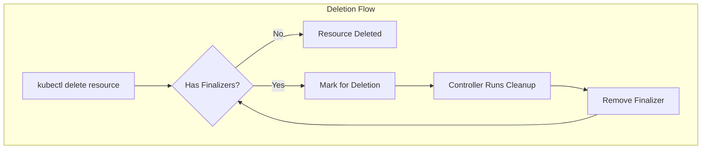

# How to Implement Kubernetes Finalizers

Author: [nawazdhandala](https://github.com/nawazdhandala)

Tags: Kubernetes, Finalizers, Controllers, Cleanup

Description: Use Kubernetes finalizers to ensure cleanup operations complete before resource deletion with proper controller implementation patterns.

---

Finalizers give you control over what happens before Kubernetes deletes a resource. When you delete a Pod, Deployment, or custom resource, Kubernetes does not remove it immediately if finalizers are present. Instead, it marks the resource for deletion and waits for your controller to complete cleanup tasks and remove the finalizer.

This pattern is essential when your Kubernetes resources manage external dependencies like cloud infrastructure, databases, DNS records, or third-party services that need explicit cleanup.

## What Finalizers Do



When you delete a resource with finalizers:

1. Kubernetes sets the `deletionTimestamp` field instead of deleting immediately
2. The resource remains in the cluster with its data intact
3. Controllers watching the resource see the deletion timestamp
4. Controllers perform cleanup operations
5. Controllers remove their finalizer from the resource
6. Once all finalizers are removed, Kubernetes deletes the resource

### Finalizers vs Owner References

| Feature | Finalizers | Owner References |
|---------|------------|------------------|
| Purpose | Run cleanup logic before deletion | Automatic cascade deletion |
| Control | Controller must explicitly remove | Kubernetes handles automatically |
| Use Case | External resources, custom cleanup | Child Kubernetes resources |
| Blocking | Blocks deletion until removed | Does not block deletion |
| Location | `metadata.finalizers` array | `metadata.ownerReferences` array |

### Common Finalizer Use Cases

| Scenario | Why Finalizers Help |
|----------|---------------------|
| Cloud resources | Delete AWS/GCP resources before removing CR |
| DNS records | Remove external DNS entries |
| Database cleanup | Drop databases or remove users |
| Certificate cleanup | Revoke certificates from external CA |
| Audit logging | Record deletion events to external systems |
| Distributed locks | Release locks held in external systems |

## Adding Finalizers to Resources

### Basic Finalizer Structure

Finalizers are string identifiers stored in the resource's metadata. Use a unique, DNS-subdomain-style name to avoid collisions.

```yaml
# Example resource with a finalizer
apiVersion: myorg.com/v1
kind: Database
metadata:
  name: production-db
  finalizers:
    - databases.myorg.com/cleanup
spec:
  engine: postgres
  size: 100Gi
```

### Adding Finalizers with kubectl

You can add finalizers directly using kubectl patch.

```bash
# Add a finalizer to an existing resource
kubectl patch configmap my-config -p '{"metadata":{"finalizers":["myorg.com/cleanup"]}}'

# View finalizers on a resource
kubectl get configmap my-config -o jsonpath='{.metadata.finalizers}'

# Add finalizer using strategic merge patch
kubectl patch deployment my-app --type=merge -p '
{
  "metadata": {
    "finalizers": ["myorg.com/deployment-cleanup"]
  }
}'
```

### Adding Finalizers in Go Controllers

The controller-runtime library provides helper functions for managing finalizers. Add the finalizer during the first reconciliation.

```go
package controller

import (
    "context"

    "k8s.io/apimachinery/pkg/api/errors"
    ctrl "sigs.k8s.io/controller-runtime"
    "sigs.k8s.io/controller-runtime/pkg/client"
    "sigs.k8s.io/controller-runtime/pkg/controller/controllerutil"
    "sigs.k8s.io/controller-runtime/pkg/log"

    dbv1 "github.com/myorg/db-operator/api/v1"
)

const finalizerName = "databases.myorg.com/cleanup"

type DatabaseReconciler struct {
    client.Client
}

func (r *DatabaseReconciler) Reconcile(ctx context.Context, req ctrl.Request) (ctrl.Result, error) {
    logger := log.FromContext(ctx)

    // Fetch the Database resource
    db := &dbv1.Database{}
    if err := r.Get(ctx, req.NamespacedName, db); err != nil {
        if errors.IsNotFound(err) {
            // Resource already deleted, nothing to do
            return ctrl.Result{}, nil
        }
        return ctrl.Result{}, err
    }

    // Check if the resource is being deleted
    if !db.DeletionTimestamp.IsZero() {
        // Resource is being deleted, handle cleanup
        return r.handleDeletion(ctx, db)
    }

    // Add finalizer if not present
    // This ensures cleanup runs before the resource is deleted
    if !controllerutil.ContainsFinalizer(db, finalizerName) {
        logger.Info("Adding finalizer to Database", "name", db.Name)
        controllerutil.AddFinalizer(db, finalizerName)
        if err := r.Update(ctx, db); err != nil {
            return ctrl.Result{}, err
        }
        // Requeue to continue reconciliation with updated resource
        return ctrl.Result{Requeue: true}, nil
    }

    // Normal reconciliation logic here
    return r.reconcileDatabase(ctx, db)
}
```

### Adding Finalizers in Python (kopf)

Kopf is a Python framework for building Kubernetes operators. It handles finalizers with decorators.

```python
import kopf
import boto3

# kopf automatically manages finalizers when you define handlers for deletion

@kopf.on.create('databases.myorg.com', 'v1', 'databases')
def create_database(spec, name, namespace, logger, **kwargs):
    """
    Create handler runs when a Database resource is created.
    kopf adds a finalizer automatically when deletion handlers exist.
    """
    logger.info(f"Creating database {name} in namespace {namespace}")

    # Create external database
    rds = boto3.client('rds')
    response = rds.create_db_instance(
        DBInstanceIdentifier=f"{namespace}-{name}",
        DBInstanceClass=spec.get('instanceClass', 'db.t3.micro'),
        Engine=spec.get('engine', 'postgres'),
        MasterUsername=spec.get('username', 'admin'),
        MasterUserPassword=spec.get('password'),
        AllocatedStorage=spec.get('storage', 20),
    )

    # Return data to store in status
    return {'db_instance_id': response['DBInstance']['DBInstanceIdentifier']}


@kopf.on.delete('databases.myorg.com', 'v1', 'databases')
def delete_database(spec, name, namespace, status, logger, **kwargs):
    """
    Delete handler runs before the resource is removed.
    kopf removes its finalizer after this handler completes.
    """
    logger.info(f"Deleting database {name} from namespace {namespace}")

    db_instance_id = status.get('create_database', {}).get('db_instance_id')
    if db_instance_id:
        rds = boto3.client('rds')
        try:
            rds.delete_db_instance(
                DBInstanceIdentifier=db_instance_id,
                SkipFinalSnapshot=True,
            )
            logger.info(f"Deleted RDS instance {db_instance_id}")
        except rds.exceptions.DBInstanceNotFoundFault:
            logger.info(f"RDS instance {db_instance_id} already deleted")
```

## Implementing Cleanup Logic

### Complete Go Controller with Cleanup

Here is a full controller implementation showing the cleanup pattern.

```go
package controller

import (
    "context"
    "fmt"
    "time"

    "k8s.io/apimachinery/pkg/api/errors"
    metav1 "k8s.io/apimachinery/pkg/apis/meta/v1"
    "k8s.io/apimachinery/pkg/runtime"
    ctrl "sigs.k8s.io/controller-runtime"
    "sigs.k8s.io/controller-runtime/pkg/client"
    "sigs.k8s.io/controller-runtime/pkg/controller/controllerutil"
    "sigs.k8s.io/controller-runtime/pkg/log"

    dbv1 "github.com/myorg/db-operator/api/v1"
)

const (
    finalizerName      = "databases.myorg.com/cleanup"
    cleanupTimeout     = 5 * time.Minute
    cleanupRetryDelay  = 30 * time.Second
)

type DatabaseReconciler struct {
    client.Client
    Scheme     *runtime.Scheme
    DBClient   ExternalDBClient
}

// ExternalDBClient interface for database operations
type ExternalDBClient interface {
    CreateDatabase(name string, config DatabaseConfig) error
    DeleteDatabase(name string) error
    DatabaseExists(name string) (bool, error)
}

type DatabaseConfig struct {
    Engine   string
    Size     string
    Username string
}

func (r *DatabaseReconciler) Reconcile(ctx context.Context, req ctrl.Request) (ctrl.Result, error) {
    logger := log.FromContext(ctx)

    db := &dbv1.Database{}
    if err := r.Get(ctx, req.NamespacedName, db); err != nil {
        if errors.IsNotFound(err) {
            return ctrl.Result{}, nil
        }
        return ctrl.Result{}, err
    }

    // Handle deletion
    if !db.DeletionTimestamp.IsZero() {
        return r.handleDeletion(ctx, db)
    }

    // Add finalizer
    if !controllerutil.ContainsFinalizer(db, finalizerName) {
        controllerutil.AddFinalizer(db, finalizerName)
        if err := r.Update(ctx, db); err != nil {
            return ctrl.Result{}, err
        }
        return ctrl.Result{Requeue: true}, nil
    }

    // Create or update the external database
    if err := r.reconcileExternalDB(ctx, db); err != nil {
        logger.Error(err, "Failed to reconcile external database")
        r.setCondition(db, "Ready", metav1.ConditionFalse, "ReconcileFailed", err.Error())
        r.Status().Update(ctx, db)
        return ctrl.Result{RequeueAfter: time.Minute}, err
    }

    // Update status
    r.setCondition(db, "Ready", metav1.ConditionTrue, "DatabaseReady", "External database is ready")
    if err := r.Status().Update(ctx, db); err != nil {
        return ctrl.Result{}, err
    }

    return ctrl.Result{}, nil
}

func (r *DatabaseReconciler) handleDeletion(ctx context.Context, db *dbv1.Database) (ctrl.Result, error) {
    logger := log.FromContext(ctx)

    // Check if our finalizer is present
    if !controllerutil.ContainsFinalizer(db, finalizerName) {
        // Finalizer already removed, nothing to do
        return ctrl.Result{}, nil
    }

    logger.Info("Running cleanup for Database", "name", db.Name)

    // Check if cleanup is taking too long
    deletionTime := db.DeletionTimestamp.Time
    if time.Since(deletionTime) > cleanupTimeout {
        logger.Error(nil, "Cleanup timeout exceeded", "name", db.Name)
        r.setCondition(db, "CleanupFailed", metav1.ConditionTrue, "Timeout",
            "Cleanup exceeded timeout, manual intervention required")
        r.Status().Update(ctx, db)
        // Do not remove finalizer, require manual intervention
        return ctrl.Result{}, nil
    }

    // Perform the actual cleanup
    externalDBName := fmt.Sprintf("%s-%s", db.Namespace, db.Name)

    // Check if external database exists
    exists, err := r.DBClient.DatabaseExists(externalDBName)
    if err != nil {
        logger.Error(err, "Failed to check database existence")
        return ctrl.Result{RequeueAfter: cleanupRetryDelay}, err
    }

    if exists {
        // Delete the external database
        logger.Info("Deleting external database", "name", externalDBName)
        if err := r.DBClient.DeleteDatabase(externalDBName); err != nil {
            logger.Error(err, "Failed to delete external database")
            r.setCondition(db, "CleanupFailed", metav1.ConditionTrue, "DeleteFailed", err.Error())
            r.Status().Update(ctx, db)
            return ctrl.Result{RequeueAfter: cleanupRetryDelay}, err
        }
    }

    logger.Info("Cleanup complete, removing finalizer", "name", db.Name)

    // Remove the finalizer
    controllerutil.RemoveFinalizer(db, finalizerName)
    if err := r.Update(ctx, db); err != nil {
        return ctrl.Result{}, err
    }

    // Resource will be deleted by Kubernetes after finalizer is removed
    return ctrl.Result{}, nil
}

func (r *DatabaseReconciler) reconcileExternalDB(ctx context.Context, db *dbv1.Database) error {
    externalDBName := fmt.Sprintf("%s-%s", db.Namespace, db.Name)

    exists, err := r.DBClient.DatabaseExists(externalDBName)
    if err != nil {
        return fmt.Errorf("failed to check database existence: %w", err)
    }

    if !exists {
        config := DatabaseConfig{
            Engine:   db.Spec.Engine,
            Size:     db.Spec.Size,
            Username: db.Spec.Username,
        }
        if err := r.DBClient.CreateDatabase(externalDBName, config); err != nil {
            return fmt.Errorf("failed to create database: %w", err)
        }
    }

    return nil
}

func (r *DatabaseReconciler) setCondition(db *dbv1.Database, condType string, status metav1.ConditionStatus, reason, message string) {
    condition := metav1.Condition{
        Type:               condType,
        Status:             status,
        Reason:             reason,
        Message:            message,
        LastTransitionTime: metav1.Now(),
    }

    // Find and update existing condition or append new one
    for i, c := range db.Status.Conditions {
        if c.Type == condType {
            db.Status.Conditions[i] = condition
            return
        }
    }
    db.Status.Conditions = append(db.Status.Conditions, condition)
}

func (r *DatabaseReconciler) SetupWithManager(mgr ctrl.Manager) error {
    return ctrl.NewControllerManagedBy(mgr).
        For(&dbv1.Database{}).
        Complete(r)
}
```

### Cleanup with Multiple Steps

For complex cleanup operations, track progress in the status field.

```go
type CleanupState string

const (
    CleanupNotStarted    CleanupState = ""
    CleanupDeletingData  CleanupState = "DeletingData"
    CleanupDeletingUser  CleanupState = "DeletingUser"
    CleanupDeletingDB    CleanupState = "DeletingDatabase"
    CleanupComplete      CleanupState = "Complete"
)

func (r *DatabaseReconciler) handleMultiStepDeletion(ctx context.Context, db *dbv1.Database) (ctrl.Result, error) {
    logger := log.FromContext(ctx)

    if !controllerutil.ContainsFinalizer(db, finalizerName) {
        return ctrl.Result{}, nil
    }

    // Track cleanup progress in status
    currentState := CleanupState(db.Status.CleanupState)
    logger.Info("Cleanup in progress", "state", currentState, "name", db.Name)

    switch currentState {
    case CleanupNotStarted:
        // Start with data deletion
        logger.Info("Starting data deletion")
        if err := r.DBClient.DeleteAllData(db.Name); err != nil {
            return ctrl.Result{RequeueAfter: cleanupRetryDelay}, err
        }
        db.Status.CleanupState = string(CleanupDeletingData)
        r.Status().Update(ctx, db)
        return ctrl.Result{Requeue: true}, nil

    case CleanupDeletingData:
        // Check if data deletion is complete, then delete user
        complete, err := r.DBClient.IsDataDeletionComplete(db.Name)
        if err != nil {
            return ctrl.Result{RequeueAfter: cleanupRetryDelay}, err
        }
        if !complete {
            return ctrl.Result{RequeueAfter: 10 * time.Second}, nil
        }

        logger.Info("Data deletion complete, deleting user")
        if err := r.DBClient.DeleteUser(db.Name); err != nil {
            return ctrl.Result{RequeueAfter: cleanupRetryDelay}, err
        }
        db.Status.CleanupState = string(CleanupDeletingUser)
        r.Status().Update(ctx, db)
        return ctrl.Result{Requeue: true}, nil

    case CleanupDeletingUser:
        // Delete the database instance
        logger.Info("User deleted, deleting database")
        if err := r.DBClient.DeleteDatabase(db.Name); err != nil {
            return ctrl.Result{RequeueAfter: cleanupRetryDelay}, err
        }
        db.Status.CleanupState = string(CleanupDeletingDB)
        r.Status().Update(ctx, db)
        return ctrl.Result{Requeue: true}, nil

    case CleanupDeletingDB:
        // Check if database is fully deleted
        exists, err := r.DBClient.DatabaseExists(db.Name)
        if err != nil {
            return ctrl.Result{RequeueAfter: cleanupRetryDelay}, err
        }
        if exists {
            return ctrl.Result{RequeueAfter: 10 * time.Second}, nil
        }

        logger.Info("Database deleted, cleanup complete")
        db.Status.CleanupState = string(CleanupComplete)
        r.Status().Update(ctx, db)
        return ctrl.Result{Requeue: true}, nil

    case CleanupComplete:
        // Remove finalizer
        logger.Info("Removing finalizer")
        controllerutil.RemoveFinalizer(db, finalizerName)
        if err := r.Update(ctx, db); err != nil {
            return ctrl.Result{}, err
        }
        return ctrl.Result{}, nil
    }

    return ctrl.Result{}, nil
}
```

## Removing Finalizers

### Safe Finalizer Removal

Always verify cleanup completed successfully before removing the finalizer.

```go
func (r *DatabaseReconciler) safelyRemoveFinalizer(ctx context.Context, db *dbv1.Database) error {
    logger := log.FromContext(ctx)

    // Double-check that external resources are actually gone
    externalDBName := fmt.Sprintf("%s-%s", db.Namespace, db.Name)
    exists, err := r.DBClient.DatabaseExists(externalDBName)
    if err != nil {
        return fmt.Errorf("cannot verify cleanup: %w", err)
    }

    if exists {
        return fmt.Errorf("external database still exists, cannot remove finalizer")
    }

    // Safe to remove finalizer
    logger.Info("Verified cleanup complete, removing finalizer")
    controllerutil.RemoveFinalizer(db, finalizerName)
    return r.Update(ctx, db)
}
```

### Manual Finalizer Removal

Sometimes you need to remove a finalizer manually to unblock deletion. Use this carefully.

```bash
# List finalizers on a resource
kubectl get database production-db -o jsonpath='{.metadata.finalizers}'

# Remove a specific finalizer using JSON patch
kubectl patch database production-db --type=json \
  -p='[{"op": "remove", "path": "/metadata/finalizers/0"}]'

# Remove all finalizers (use with caution)
kubectl patch database production-db --type=merge \
  -p='{"metadata":{"finalizers":null}}'

# Alternative using kubectl edit
kubectl edit database production-db
# Then manually remove the finalizers array entries
```

## Common Patterns

### Pattern 1: Graceful Degradation

Handle cleanup failures without blocking deletion forever.

```go
const (
    maxCleanupAttempts = 3
)

func (r *DatabaseReconciler) handleDeletionWithRetries(ctx context.Context, db *dbv1.Database) (ctrl.Result, error) {
    logger := log.FromContext(ctx)

    if !controllerutil.ContainsFinalizer(db, finalizerName) {
        return ctrl.Result{}, nil
    }

    attempts := db.Status.CleanupAttempts

    // Try cleanup
    err := r.performCleanup(ctx, db)
    if err != nil {
        attempts++
        db.Status.CleanupAttempts = attempts
        db.Status.LastCleanupError = err.Error()
        r.Status().Update(ctx, db)

        if attempts >= maxCleanupAttempts {
            // Log error but allow deletion to proceed
            logger.Error(err, "Cleanup failed after max attempts, allowing deletion",
                "attempts", attempts, "name", db.Name)

            // Record event for audit trail
            r.Recorder.Event(db, "Warning", "CleanupFailed",
                fmt.Sprintf("Cleanup failed after %d attempts: %s", attempts, err.Error()))

            // Remove finalizer despite failure
            controllerutil.RemoveFinalizer(db, finalizerName)
            return ctrl.Result{}, r.Update(ctx, db)
        }

        logger.Error(err, "Cleanup failed, will retry",
            "attempt", attempts, "name", db.Name)
        return ctrl.Result{RequeueAfter: cleanupRetryDelay}, nil
    }

    // Cleanup successful
    controllerutil.RemoveFinalizer(db, finalizerName)
    return ctrl.Result{}, r.Update(ctx, db)
}
```

### Pattern 2: Pre-delete Validation

Block deletion if certain conditions are not met.

```go
func (r *DatabaseReconciler) handleDeletionWithValidation(ctx context.Context, db *dbv1.Database) (ctrl.Result, error) {
    logger := log.FromContext(ctx)

    if !controllerutil.ContainsFinalizer(db, finalizerName) {
        return ctrl.Result{}, nil
    }

    // Check if deletion should be blocked
    if db.Spec.DeletionProtection {
        logger.Info("Deletion protection enabled, blocking deletion", "name", db.Name)
        r.setCondition(db, "DeletionBlocked", metav1.ConditionTrue,
            "ProtectionEnabled", "Remove spec.deletionProtection to allow deletion")
        r.Status().Update(ctx, db)
        // Do not remove finalizer, block deletion
        return ctrl.Result{}, nil
    }

    // Check for dependent resources
    dependents, err := r.findDependentResources(ctx, db)
    if err != nil {
        return ctrl.Result{}, err
    }

    if len(dependents) > 0 {
        logger.Info("Cannot delete, has dependent resources",
            "name", db.Name, "dependents", dependents)
        r.setCondition(db, "DeletionBlocked", metav1.ConditionTrue,
            "HasDependents", fmt.Sprintf("Delete dependent resources first: %v", dependents))
        r.Status().Update(ctx, db)
        return ctrl.Result{RequeueAfter: time.Minute}, nil
    }

    // Proceed with cleanup
    if err := r.performCleanup(ctx, db); err != nil {
        return ctrl.Result{RequeueAfter: cleanupRetryDelay}, err
    }

    controllerutil.RemoveFinalizer(db, finalizerName)
    return ctrl.Result{}, r.Update(ctx, db)
}

func (r *DatabaseReconciler) findDependentResources(ctx context.Context, db *dbv1.Database) ([]string, error) {
    var dependents []string

    // Check for applications using this database
    apps := &appv1.ApplicationList{}
    if err := r.List(ctx, apps, client.InNamespace(db.Namespace)); err != nil {
        return nil, err
    }

    for _, app := range apps.Items {
        if app.Spec.DatabaseRef == db.Name {
            dependents = append(dependents, fmt.Sprintf("Application/%s", app.Name))
        }
    }

    return dependents, nil
}
```

### Pattern 3: Multiple Finalizers

Use multiple finalizers for different cleanup responsibilities.

```go
const (
    dbFinalizer     = "databases.myorg.com/database-cleanup"
    metricsFinalizer = "databases.myorg.com/metrics-cleanup"
    backupFinalizer = "databases.myorg.com/backup-cleanup"
)

func (r *DatabaseReconciler) addAllFinalizers(ctx context.Context, db *dbv1.Database) error {
    updated := false

    if !controllerutil.ContainsFinalizer(db, dbFinalizer) {
        controllerutil.AddFinalizer(db, dbFinalizer)
        updated = true
    }
    if !controllerutil.ContainsFinalizer(db, metricsFinalizer) {
        controllerutil.AddFinalizer(db, metricsFinalizer)
        updated = true
    }
    if !controllerutil.ContainsFinalizer(db, backupFinalizer) {
        controllerutil.AddFinalizer(db, backupFinalizer)
        updated = true
    }

    if updated {
        return r.Update(ctx, db)
    }
    return nil
}

func (r *DatabaseReconciler) handleDeletionWithMultipleFinalizers(ctx context.Context, db *dbv1.Database) (ctrl.Result, error) {
    logger := log.FromContext(ctx)

    // Handle each finalizer separately
    // They can run in parallel or sequentially depending on dependencies

    // Backup cleanup (must run first)
    if controllerutil.ContainsFinalizer(db, backupFinalizer) {
        logger.Info("Cleaning up backups")
        if err := r.cleanupBackups(ctx, db); err != nil {
            return ctrl.Result{RequeueAfter: cleanupRetryDelay}, err
        }
        controllerutil.RemoveFinalizer(db, backupFinalizer)
        if err := r.Update(ctx, db); err != nil {
            return ctrl.Result{}, err
        }
        return ctrl.Result{Requeue: true}, nil
    }

    // Metrics cleanup
    if controllerutil.ContainsFinalizer(db, metricsFinalizer) {
        logger.Info("Cleaning up metrics")
        if err := r.cleanupMetrics(ctx, db); err != nil {
            return ctrl.Result{RequeueAfter: cleanupRetryDelay}, err
        }
        controllerutil.RemoveFinalizer(db, metricsFinalizer)
        if err := r.Update(ctx, db); err != nil {
            return ctrl.Result{}, err
        }
        return ctrl.Result{Requeue: true}, nil
    }

    // Database cleanup (runs last)
    if controllerutil.ContainsFinalizer(db, dbFinalizer) {
        logger.Info("Cleaning up database")
        if err := r.cleanupDatabase(ctx, db); err != nil {
            return ctrl.Result{RequeueAfter: cleanupRetryDelay}, err
        }
        controllerutil.RemoveFinalizer(db, dbFinalizer)
        if err := r.Update(ctx, db); err != nil {
            return ctrl.Result{}, err
        }
    }

    return ctrl.Result{}, nil
}
```

## Handling Stuck Finalizers

### Diagnosing Stuck Resources

```bash
# Find all resources with deletion timestamps (stuck in deletion)
kubectl get all --all-namespaces -o json | jq -r '
  .items[] |
  select(.metadata.deletionTimestamp != null) |
  "\(.kind)/\(.metadata.namespace)/\(.metadata.name)"
'

# Check specific resource for finalizers and deletion timestamp
kubectl get database production-db -o yaml | grep -A5 "metadata:"

# View controller logs for cleanup errors
kubectl logs -l app=database-operator -n operators --tail=100 | grep -i "cleanup\|finalizer"

# Check events on the resource
kubectl describe database production-db | grep -A10 "Events:"
```

### Forceful Finalizer Removal Script

Use this script when manual intervention is required.

```bash
#!/bin/bash
# remove-finalizer.sh - Safely remove a stuck finalizer

set -e

RESOURCE_TYPE=$1
RESOURCE_NAME=$2
NAMESPACE=${3:-default}

if [ -z "$RESOURCE_TYPE" ] || [ -z "$RESOURCE_NAME" ]; then
    echo "Usage: $0 <resource-type> <resource-name> [namespace]"
    echo "Example: $0 database production-db default"
    exit 1
fi

echo "Checking resource: $RESOURCE_TYPE/$RESOURCE_NAME in namespace $NAMESPACE"

# Get current finalizers
FINALIZERS=$(kubectl get "$RESOURCE_TYPE" "$RESOURCE_NAME" -n "$NAMESPACE" -o jsonpath='{.metadata.finalizers}')
echo "Current finalizers: $FINALIZERS"

if [ -z "$FINALIZERS" ] || [ "$FINALIZERS" == "null" ]; then
    echo "No finalizers found on resource"
    exit 0
fi

# Confirm before proceeding
echo ""
echo "WARNING: Removing finalizers may leave external resources orphaned."
echo "Ensure cleanup has been performed manually if needed."
read -p "Remove all finalizers? (yes/no): " CONFIRM

if [ "$CONFIRM" != "yes" ]; then
    echo "Aborted"
    exit 1
fi

# Remove finalizers
kubectl patch "$RESOURCE_TYPE" "$RESOURCE_NAME" -n "$NAMESPACE" \
    --type=merge \
    -p '{"metadata":{"finalizers":null}}'

echo "Finalizers removed. Resource should be deleted now."

# Verify deletion
sleep 2
if kubectl get "$RESOURCE_TYPE" "$RESOURCE_NAME" -n "$NAMESPACE" 2>/dev/null; then
    echo "WARNING: Resource still exists"
else
    echo "Resource deleted successfully"
fi
```

### Automated Stuck Finalizer Detection

Add monitoring for stuck finalizers in your operator.

```go
func (r *DatabaseReconciler) checkForStuckFinalizers(ctx context.Context) error {
    logger := log.FromContext(ctx)

    databases := &dbv1.DatabaseList{}
    if err := r.List(ctx, databases); err != nil {
        return err
    }

    for _, db := range databases.Items {
        if db.DeletionTimestamp.IsZero() {
            continue
        }

        // Resource is being deleted
        deletionAge := time.Since(db.DeletionTimestamp.Time)

        if deletionAge > 10*time.Minute {
            logger.Error(nil, "Resource stuck in deletion",
                "name", db.Name,
                "namespace", db.Namespace,
                "deletionAge", deletionAge.String(),
                "finalizers", db.Finalizers)

            // Update metrics
            stuckFinalizerGauge.WithLabelValues(db.Namespace, db.Name).Set(1)

            // Create alert event
            r.Recorder.Event(&db, "Warning", "StuckFinalizer",
                fmt.Sprintf("Resource stuck in deletion for %s", deletionAge.Round(time.Minute)))
        }
    }

    return nil
}
```

## Testing Finalizer Logic

### Unit Tests

```go
package controller

import (
    "context"
    "testing"

    "github.com/stretchr/testify/assert"
    "github.com/stretchr/testify/mock"
    metav1 "k8s.io/apimachinery/pkg/apis/meta/v1"
    "k8s.io/apimachinery/pkg/runtime"
    "k8s.io/apimachinery/pkg/types"
    "sigs.k8s.io/controller-runtime/pkg/client/fake"
    "sigs.k8s.io/controller-runtime/pkg/reconcile"

    dbv1 "github.com/myorg/db-operator/api/v1"
)

// MockDBClient mocks external database operations
type MockDBClient struct {
    mock.Mock
}

func (m *MockDBClient) CreateDatabase(name string, config DatabaseConfig) error {
    args := m.Called(name, config)
    return args.Error(0)
}

func (m *MockDBClient) DeleteDatabase(name string) error {
    args := m.Called(name)
    return args.Error(0)
}

func (m *MockDBClient) DatabaseExists(name string) (bool, error) {
    args := m.Called(name)
    return args.Bool(0), args.Error(1)
}

func TestReconciler_AddsFinalizer(t *testing.T) {
    // Create a Database without finalizers
    db := &dbv1.Database{
        ObjectMeta: metav1.ObjectMeta{
            Name:      "test-db",
            Namespace: "default",
        },
        Spec: dbv1.DatabaseSpec{
            Engine: "postgres",
        },
    }

    // Setup fake client
    scheme := runtime.NewScheme()
    dbv1.AddToScheme(scheme)
    client := fake.NewClientBuilder().WithScheme(scheme).WithObjects(db).Build()

    mockDB := new(MockDBClient)

    reconciler := &DatabaseReconciler{
        Client:   client,
        Scheme:   scheme,
        DBClient: mockDB,
    }

    // Reconcile
    req := reconcile.Request{
        NamespacedName: types.NamespacedName{
            Name:      "test-db",
            Namespace: "default",
        },
    }

    result, err := reconciler.Reconcile(context.Background(), req)

    assert.NoError(t, err)
    assert.True(t, result.Requeue, "Should requeue after adding finalizer")

    // Verify finalizer was added
    updatedDB := &dbv1.Database{}
    client.Get(context.Background(), req.NamespacedName, updatedDB)
    assert.Contains(t, updatedDB.Finalizers, finalizerName)
}

func TestReconciler_CleanupOnDeletion(t *testing.T) {
    // Create a Database marked for deletion with finalizer
    now := metav1.Now()
    db := &dbv1.Database{
        ObjectMeta: metav1.ObjectMeta{
            Name:              "test-db",
            Namespace:         "default",
            Finalizers:        []string{finalizerName},
            DeletionTimestamp: &now,
        },
        Spec: dbv1.DatabaseSpec{
            Engine: "postgres",
        },
    }

    scheme := runtime.NewScheme()
    dbv1.AddToScheme(scheme)
    client := fake.NewClientBuilder().WithScheme(scheme).WithObjects(db).Build()

    mockDB := new(MockDBClient)
    // Mock: database exists and can be deleted
    mockDB.On("DatabaseExists", "default-test-db").Return(true, nil)
    mockDB.On("DeleteDatabase", "default-test-db").Return(nil)

    reconciler := &DatabaseReconciler{
        Client:   client,
        Scheme:   scheme,
        DBClient: mockDB,
    }

    req := reconcile.Request{
        NamespacedName: types.NamespacedName{
            Name:      "test-db",
            Namespace: "default",
        },
    }

    result, err := reconciler.Reconcile(context.Background(), req)

    assert.NoError(t, err)
    assert.False(t, result.Requeue)

    // Verify cleanup was called
    mockDB.AssertCalled(t, "DeleteDatabase", "default-test-db")

    // Verify finalizer was removed
    updatedDB := &dbv1.Database{}
    client.Get(context.Background(), req.NamespacedName, updatedDB)
    assert.NotContains(t, updatedDB.Finalizers, finalizerName)
}

func TestReconciler_CleanupRetryOnError(t *testing.T) {
    now := metav1.Now()
    db := &dbv1.Database{
        ObjectMeta: metav1.ObjectMeta{
            Name:              "test-db",
            Namespace:         "default",
            Finalizers:        []string{finalizerName},
            DeletionTimestamp: &now,
        },
    }

    scheme := runtime.NewScheme()
    dbv1.AddToScheme(scheme)
    client := fake.NewClientBuilder().WithScheme(scheme).WithObjects(db).Build()

    mockDB := new(MockDBClient)
    // Mock: database exists but deletion fails
    mockDB.On("DatabaseExists", "default-test-db").Return(true, nil)
    mockDB.On("DeleteDatabase", "default-test-db").Return(fmt.Errorf("connection timeout"))

    reconciler := &DatabaseReconciler{
        Client:   client,
        Scheme:   scheme,
        DBClient: mockDB,
    }

    req := reconcile.Request{
        NamespacedName: types.NamespacedName{
            Name:      "test-db",
            Namespace: "default",
        },
    }

    result, err := reconciler.Reconcile(context.Background(), req)

    // Should return error and schedule retry
    assert.Error(t, err)
    assert.Equal(t, cleanupRetryDelay, result.RequeueAfter)

    // Verify finalizer NOT removed
    updatedDB := &dbv1.Database{}
    client.Get(context.Background(), req.NamespacedName, updatedDB)
    assert.Contains(t, updatedDB.Finalizers, finalizerName)
}
```

### Integration Tests

```go
package controller

import (
    "context"
    "time"

    . "github.com/onsi/ginkgo/v2"
    . "github.com/onsi/gomega"
    metav1 "k8s.io/apimachinery/pkg/apis/meta/v1"
    "k8s.io/apimachinery/pkg/types"

    dbv1 "github.com/myorg/db-operator/api/v1"
)

var _ = Describe("Database Controller Integration", func() {
    const (
        timeout  = time.Second * 30
        interval = time.Millisecond * 250
    )

    Context("Finalizer Lifecycle", func() {
        It("Should add finalizer on creation and remove on deletion", func() {
            ctx := context.Background()
            dbName := "integration-test-db"
            dbNamespace := "default"

            // Create Database
            db := &dbv1.Database{
                ObjectMeta: metav1.ObjectMeta{
                    Name:      dbName,
                    Namespace: dbNamespace,
                },
                Spec: dbv1.DatabaseSpec{
                    Engine: "postgres",
                    Size:   "10Gi",
                },
            }
            Expect(k8sClient.Create(ctx, db)).Should(Succeed())

            // Wait for finalizer to be added
            lookupKey := types.NamespacedName{Name: dbName, Namespace: dbNamespace}
            createdDB := &dbv1.Database{}

            Eventually(func() bool {
                err := k8sClient.Get(ctx, lookupKey, createdDB)
                if err != nil {
                    return false
                }
                for _, f := range createdDB.Finalizers {
                    if f == finalizerName {
                        return true
                    }
                }
                return false
            }, timeout, interval).Should(BeTrue(), "Finalizer should be added")

            // Delete the Database
            Expect(k8sClient.Delete(ctx, createdDB)).Should(Succeed())

            // Wait for resource to be fully deleted
            Eventually(func() bool {
                err := k8sClient.Get(ctx, lookupKey, &dbv1.Database{})
                return err != nil // Should return NotFound error
            }, timeout, interval).Should(BeTrue(), "Resource should be deleted after cleanup")
        })
    })
})
```

### Testing with envtest

```go
package controller

import (
    "context"
    "path/filepath"
    "testing"

    . "github.com/onsi/ginkgo/v2"
    . "github.com/onsi/gomega"
    "k8s.io/client-go/kubernetes/scheme"
    "k8s.io/client-go/rest"
    ctrl "sigs.k8s.io/controller-runtime"
    "sigs.k8s.io/controller-runtime/pkg/client"
    "sigs.k8s.io/controller-runtime/pkg/envtest"

    dbv1 "github.com/myorg/db-operator/api/v1"
)

var cfg *rest.Config
var k8sClient client.Client
var testEnv *envtest.Environment

func TestControllers(t *testing.T) {
    RegisterFailHandler(Fail)
    RunSpecs(t, "Controller Suite")
}

var _ = BeforeSuite(func() {
    // Start test environment with CRDs
    testEnv = &envtest.Environment{
        CRDDirectoryPaths: []string{
            filepath.Join("..", "..", "config", "crd", "bases"),
        },
        ErrorIfCRDPathMissing: true,
    }

    var err error
    cfg, err = testEnv.Start()
    Expect(err).NotTo(HaveOccurred())
    Expect(cfg).NotTo(BeNil())

    // Add scheme
    err = dbv1.AddToScheme(scheme.Scheme)
    Expect(err).NotTo(HaveOccurred())

    // Create client
    k8sClient, err = client.New(cfg, client.Options{Scheme: scheme.Scheme})
    Expect(err).NotTo(HaveOccurred())
    Expect(k8sClient).NotTo(BeNil())

    // Start controller manager
    mgr, err := ctrl.NewManager(cfg, ctrl.Options{
        Scheme: scheme.Scheme,
    })
    Expect(err).NotTo(HaveOccurred())

    // Setup reconciler with mock DB client
    mockDBClient := NewMockDBClient()
    err = (&DatabaseReconciler{
        Client:   mgr.GetClient(),
        Scheme:   mgr.GetScheme(),
        DBClient: mockDBClient,
    }).SetupWithManager(mgr)
    Expect(err).NotTo(HaveOccurred())

    // Start manager in background
    go func() {
        defer GinkgoRecover()
        err = mgr.Start(context.Background())
        Expect(err).NotTo(HaveOccurred())
    }()
})

var _ = AfterSuite(func() {
    err := testEnv.Stop()
    Expect(err).NotTo(HaveOccurred())
})
```

## Summary

Finalizers provide a reliable mechanism for running cleanup logic before Kubernetes deletes a resource. Key takeaways:

| Aspect | Recommendation |
|--------|----------------|
| Naming | Use DNS-style names like `myorg.com/cleanup` |
| Addition | Add finalizers early in reconciliation, before creating external resources |
| Cleanup | Verify external resources are deleted before removing finalizer |
| Errors | Implement retry logic with backoff for transient failures |
| Timeouts | Set cleanup timeouts and handle stuck scenarios |
| Testing | Write unit and integration tests for finalizer logic |
| Monitoring | Track deletion duration and alert on stuck finalizers |

When implementing finalizers, always consider what happens when cleanup fails. Decide whether to block deletion forever, retry with limits, or eventually allow deletion with manual cleanup required. The right choice depends on how critical the external resources are and whether orphaned resources cause problems.

---

Finalizers are essential for operators managing external infrastructure. They guarantee your cleanup code runs before resources disappear from the cluster. Start with simple cleanup logic, add error handling and retries, and build monitoring to catch stuck finalizers before they become incidents.
