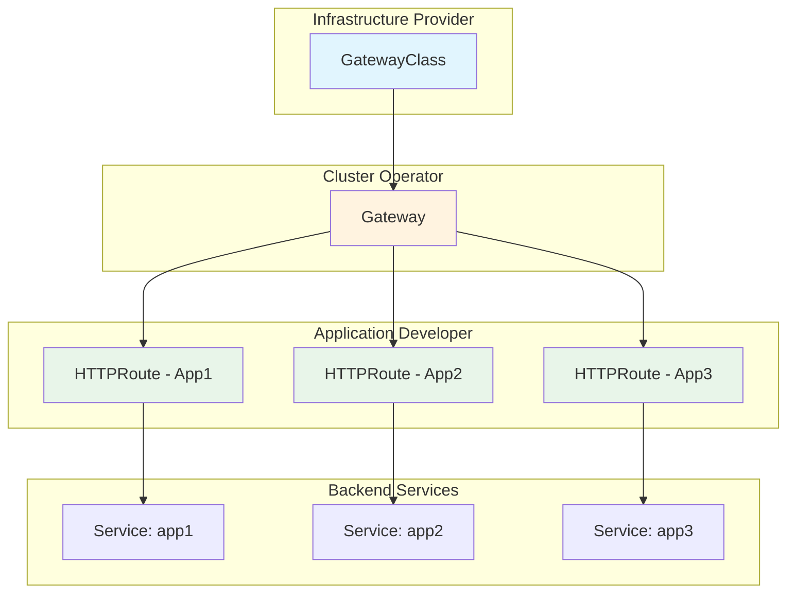
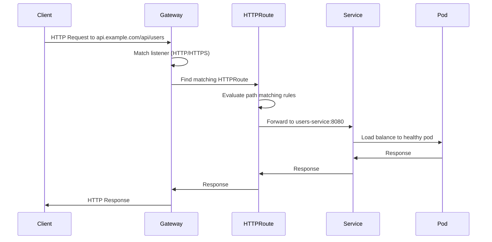
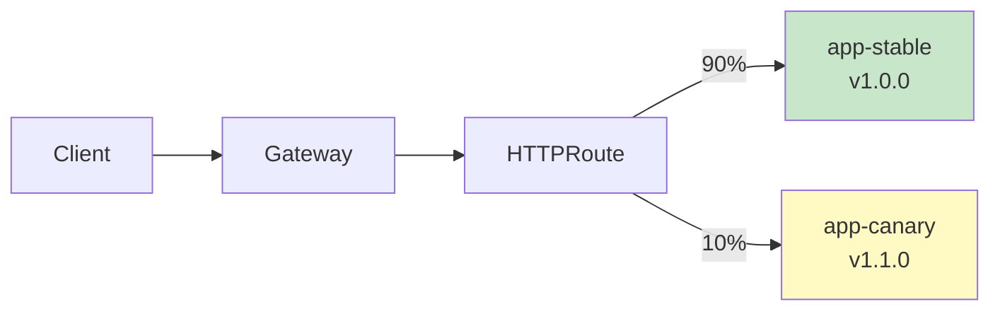
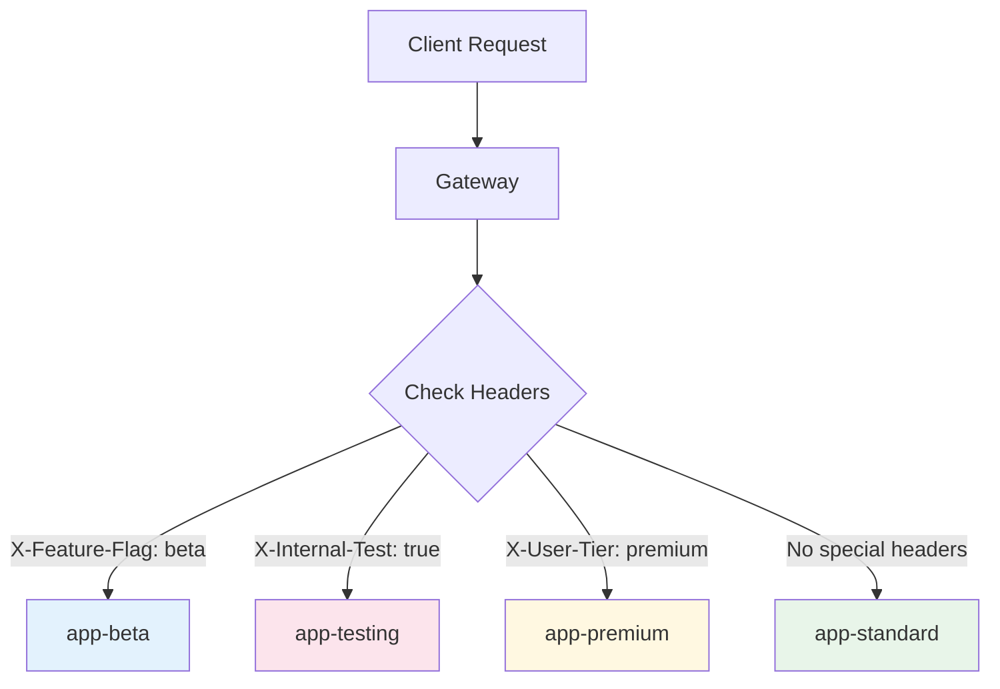
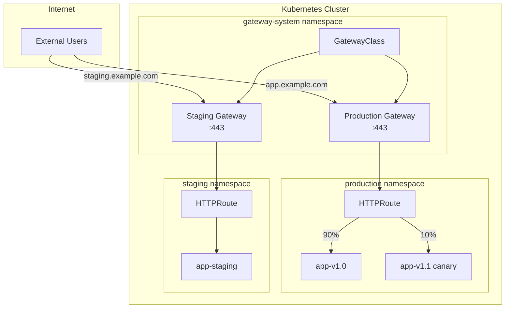

# How to Build Kubernetes Gateway API

Author: [nawazdhandala](https://github.com/nawazdhandala)

Tags: Kubernetes, Gateway API, Ingress, Networking

Description: Learn how to use Kubernetes Gateway API for flexible traffic routing.

---

## Introduction

The Kubernetes Gateway API is the next generation of Kubernetes Ingress, providing a more expressive, extensible, and role-oriented approach to managing traffic routing. Unlike the traditional Ingress resource, Gateway API introduces a layered model that separates concerns between infrastructure providers, cluster operators, and application developers.

In this guide, we will explore how to build and configure the Kubernetes Gateway API for ingress management, covering the core resources: GatewayClass, Gateway, and HTTPRoute. We will also dive into advanced features like traffic splitting and header-based routing.

## Why Gateway API?

Before we dive into implementation, let us understand why Gateway API is becoming the preferred choice:

- **Role-oriented design**: Clear separation between infrastructure providers, cluster operators, and developers
- **Portable**: Works across different implementations (Istio, Contour, Envoy Gateway, and more)
- **Expressive**: Supports advanced routing features natively
- **Extensible**: Built with extensibility in mind through policy attachment

## Architecture Overview

The Gateway API follows a layered architecture with three main resources working together:



## Prerequisites

Before getting started, ensure you have:

- A Kubernetes cluster (v1.24 or later recommended)
- kubectl configured to access your cluster
- A Gateway API implementation installed (we will use Envoy Gateway in examples)

## Installing Gateway API CRDs

First, install the Gateway API Custom Resource Definitions:

```bash
# Install the standard Gateway API CRDs
kubectl apply -f https://github.com/kubernetes-sigs/gateway-api/releases/download/v1.0.0/standard-install.yaml

# Verify the installation
kubectl get crd | grep gateway
```

You should see output similar to:

```
gatewayclasses.gateway.networking.k8s.io
gateways.gateway.networking.k8s.io
httproutes.gateway.networking.k8s.io
referencegrants.gateway.networking.k8s.io
```

## Understanding Core Resources

### 1. GatewayClass

GatewayClass defines the controller that will handle Gateways of this class. Think of it as the "type" of load balancer or proxy you want to use.

```yaml
# gatewayclass.yaml
# GatewayClass defines which controller implements the Gateway
# This is typically created by the infrastructure provider
apiVersion: gateway.networking.k8s.io/v1
kind: GatewayClass
metadata:
  name: envoy-gateway-class
spec:
  # controllerName identifies the controller that manages
  # Gateways of this class
  controllerName: gateway.envoyproxy.io/gatewayclass-controller

  # Optional: Add a description for documentation purposes
  description: "Envoy Gateway controller for production traffic"
```

Apply the GatewayClass:

```bash
kubectl apply -f gatewayclass.yaml
```

### 2. Gateway

The Gateway resource defines the entry point for traffic. It specifies which ports and protocols to listen on, and references a GatewayClass.

```yaml
# gateway.yaml
# Gateway defines the actual listener configuration
# This is typically managed by cluster operators
apiVersion: gateway.networking.k8s.io/v1
kind: Gateway
metadata:
  name: production-gateway
  namespace: gateway-system
spec:
  # Reference the GatewayClass we created earlier
  gatewayClassName: envoy-gateway-class

  # Define the listeners (ports and protocols)
  listeners:
    # HTTP listener on port 80
    - name: http
      protocol: HTTP
      port: 80
      # AllowedRoutes defines which routes can attach to this listener
      allowedRoutes:
        namespaces:
          # Allow routes from all namespaces
          from: All

    # HTTPS listener on port 443
    - name: https
      protocol: HTTPS
      port: 443
      # TLS configuration for HTTPS
      tls:
        mode: Terminate
        certificateRefs:
          - kind: Secret
            name: production-tls-cert
            namespace: gateway-system
      allowedRoutes:
        namespaces:
          from: All
```

Apply the Gateway:

```bash
kubectl apply -f gateway.yaml

# Check the Gateway status
kubectl get gateway -n gateway-system
```

### 3. HTTPRoute

HTTPRoute defines how HTTP traffic should be routed to backend services. This is where application developers specify their routing rules.

```yaml
# httproute-basic.yaml
# HTTPRoute defines routing rules for HTTP traffic
# This is typically created by application developers
apiVersion: gateway.networking.k8s.io/v1
kind: HTTPRoute
metadata:
  name: app-routes
  namespace: default
spec:
  # Reference the Gateway this route should attach to
  parentRefs:
    - name: production-gateway
      namespace: gateway-system

  # Define hostnames this route should match
  hostnames:
    - "api.example.com"

  # Define the routing rules
  rules:
    # Route for the users API
    - matches:
        - path:
            type: PathPrefix
            value: /api/users
      backendRefs:
        - name: users-service
          port: 8080

    # Route for the orders API
    - matches:
        - path:
            type: PathPrefix
            value: /api/orders
      backendRefs:
        - name: orders-service
          port: 8080

    # Default route for other paths
    - matches:
        - path:
            type: PathPrefix
            value: /
      backendRefs:
        - name: frontend-service
          port: 80
```

## Traffic Flow Visualization

Here is how traffic flows through the Gateway API components:



## Advanced Routing Features

### Traffic Splitting

Traffic splitting allows you to distribute traffic between multiple backend services. This is essential for canary deployments, A/B testing, and gradual rollouts.

```yaml
# httproute-traffic-split.yaml
# HTTPRoute with traffic splitting for canary deployment
apiVersion: gateway.networking.k8s.io/v1
kind: HTTPRoute
metadata:
  name: canary-deployment
  namespace: default
spec:
  parentRefs:
    - name: production-gateway
      namespace: gateway-system

  hostnames:
    - "app.example.com"

  rules:
    - matches:
        - path:
            type: PathPrefix
            value: /

      # Traffic splitting configuration
      # Total weight: 100 (90 + 10)
      backendRefs:
        # Send 90% of traffic to stable version
        - name: app-stable
          port: 8080
          weight: 90

        # Send 10% of traffic to canary version
        - name: app-canary
          port: 8080
          weight: 10
```

Visualizing the traffic split:



### Gradual Rollout Example

Here is a complete example showing how to perform a gradual rollout:

```yaml
# Stage 1: 95/5 split - Initial canary
---
apiVersion: gateway.networking.k8s.io/v1
kind: HTTPRoute
metadata:
  name: app-route
  namespace: default
spec:
  parentRefs:
    - name: production-gateway
      namespace: gateway-system
  hostnames:
    - "app.example.com"
  rules:
    - backendRefs:
        - name: app-stable
          port: 8080
          weight: 95
        - name: app-canary
          port: 8080
          weight: 5

# Stage 2: 75/25 split - Increased canary traffic
# Apply this after validating Stage 1
---
# Update weights to 75/25 after successful validation
# kubectl patch httproute app-route --type=merge -p '
# spec:
#   rules:
#   - backendRefs:
#     - name: app-stable
#       port: 8080
#       weight: 75
#     - name: app-canary
#       port: 8080
#       weight: 25
# '

# Stage 3: 50/50 split - Equal distribution
# Stage 4: 25/75 split - Canary becomes primary
# Stage 5: 0/100 split - Full rollout complete
```

### Header-Based Routing

Header-based routing allows you to route traffic based on HTTP headers. This is useful for feature flags, internal testing, and multi-tenant applications.

```yaml
# httproute-header-routing.yaml
# HTTPRoute with header-based routing for feature flags
apiVersion: gateway.networking.k8s.io/v1
kind: HTTPRoute
metadata:
  name: feature-flag-routing
  namespace: default
spec:
  parentRefs:
    - name: production-gateway
      namespace: gateway-system

  hostnames:
    - "app.example.com"

  rules:
    # Route beta users to the new feature version
    # Matches requests with header: X-Feature-Flag: beta
    - matches:
        - headers:
            - name: X-Feature-Flag
              value: beta
      backendRefs:
        - name: app-beta
          port: 8080

    # Route internal testing traffic
    # Matches requests with header: X-Internal-Test: true
    - matches:
        - headers:
            - name: X-Internal-Test
              value: "true"
      backendRefs:
        - name: app-testing
          port: 8080

    # Route premium users to dedicated infrastructure
    # Matches requests with header: X-User-Tier: premium
    - matches:
        - headers:
            - name: X-User-Tier
              value: premium
      backendRefs:
        - name: app-premium
          port: 8080

    # Default route for regular traffic
    - matches:
        - path:
            type: PathPrefix
            value: /
      backendRefs:
        - name: app-standard
          port: 8080
```

Header-based routing visualization:



### Combining Multiple Match Conditions

You can combine path, header, and method matching for complex routing scenarios:

```yaml
# httproute-complex-matching.yaml
# HTTPRoute with multiple match conditions
apiVersion: gateway.networking.k8s.io/v1
kind: HTTPRoute
metadata:
  name: complex-routing
  namespace: default
spec:
  parentRefs:
    - name: production-gateway
      namespace: gateway-system

  hostnames:
    - "api.example.com"

  rules:
    # Match POST requests to /api/orders with beta header
    # All conditions must match (AND logic)
    - matches:
        - path:
            type: PathPrefix
            value: /api/orders
          method: POST
          headers:
            - name: X-API-Version
              value: v2
      backendRefs:
        - name: orders-service-v2
          port: 8080

    # Match GET requests to /api/orders
    - matches:
        - path:
            type: PathPrefix
            value: /api/orders
          method: GET
      backendRefs:
        - name: orders-read-replica
          port: 8080

    # Match any request with query parameter matching
    # Note: Query parameter matching requires experimental CRDs
    - matches:
        - path:
            type: PathPrefix
            value: /api/orders
      backendRefs:
        - name: orders-service-v1
          port: 8080
```

## Request and Response Modification

Gateway API also supports modifying requests and responses using filters:

```yaml
# httproute-filters.yaml
# HTTPRoute with request/response modification
apiVersion: gateway.networking.k8s.io/v1
kind: HTTPRoute
metadata:
  name: modified-routing
  namespace: default
spec:
  parentRefs:
    - name: production-gateway
      namespace: gateway-system

  hostnames:
    - "api.example.com"

  rules:
    - matches:
        - path:
            type: PathPrefix
            value: /api

      # Filters modify requests before forwarding
      filters:
        # Add headers to the request
        - type: RequestHeaderModifier
          requestHeaderModifier:
            add:
              # Add tracing header
              - name: X-Request-ID
                value: "generated-id"
              # Add internal routing header
              - name: X-Forwarded-Proto
                value: https
            set:
              # Override the host header
              - name: Host
                value: internal-api.svc.cluster.local
            remove:
              # Remove sensitive headers
              - X-Debug-Mode

        # Rewrite the URL path
        - type: URLRewrite
          urlRewrite:
            path:
              type: ReplacePrefixMatch
              replacePrefixMatch: /v1/api

      backendRefs:
        - name: api-service
          port: 8080
```

## Complete Example: Multi-Environment Setup

Here is a complete example showing a production-ready multi-environment setup:



### Production GatewayClass and Gateway

```yaml
# production-gateway-setup.yaml
---
# GatewayClass for production workloads
apiVersion: gateway.networking.k8s.io/v1
kind: GatewayClass
metadata:
  name: production-class
spec:
  controllerName: gateway.envoyproxy.io/gatewayclass-controller
  description: "Production traffic gateway class"

---
# Production Gateway with TLS termination
apiVersion: gateway.networking.k8s.io/v1
kind: Gateway
metadata:
  name: production-gateway
  namespace: gateway-system
  annotations:
    # Cloud provider specific annotations for load balancer
    service.beta.kubernetes.io/aws-load-balancer-type: "nlb"
spec:
  gatewayClassName: production-class

  listeners:
    # Redirect HTTP to HTTPS
    - name: http-redirect
      protocol: HTTP
      port: 80
      allowedRoutes:
        namespaces:
          from: Same

    # Production HTTPS listener
    - name: https-production
      protocol: HTTPS
      port: 443
      hostname: "app.example.com"
      tls:
        mode: Terminate
        certificateRefs:
          - kind: Secret
            name: production-tls
      allowedRoutes:
        namespaces:
          from: Selector
          selector:
            matchLabels:
              environment: production

    # Staging HTTPS listener
    - name: https-staging
      protocol: HTTPS
      port: 443
      hostname: "staging.example.com"
      tls:
        mode: Terminate
        certificateRefs:
          - kind: Secret
            name: staging-tls
      allowedRoutes:
        namespaces:
          from: Selector
          selector:
            matchLabels:
              environment: staging

---
# HTTPRoute for HTTP to HTTPS redirect
apiVersion: gateway.networking.k8s.io/v1
kind: HTTPRoute
metadata:
  name: http-redirect
  namespace: gateway-system
spec:
  parentRefs:
    - name: production-gateway
      sectionName: http-redirect
  rules:
    - filters:
        - type: RequestRedirect
          requestRedirect:
            scheme: https
            statusCode: 301
```

### Production HTTPRoute with Canary

```yaml
# production-httproute.yaml
apiVersion: gateway.networking.k8s.io/v1
kind: HTTPRoute
metadata:
  name: production-app
  namespace: production
spec:
  parentRefs:
    - name: production-gateway
      namespace: gateway-system
      sectionName: https-production

  hostnames:
    - "app.example.com"

  rules:
    # Health check endpoint - always route to stable
    - matches:
        - path:
            type: Exact
            value: /health
      backendRefs:
        - name: app-stable
          port: 8080

    # API routes with canary deployment
    - matches:
        - path:
            type: PathPrefix
            value: /api
      backendRefs:
        - name: app-stable
          port: 8080
          weight: 90
        - name: app-canary
          port: 8080
          weight: 10

    # Static assets - route to CDN origin
    - matches:
        - path:
            type: PathPrefix
            value: /static
      backendRefs:
        - name: cdn-origin
          port: 80

    # Default frontend route
    - matches:
        - path:
            type: PathPrefix
            value: /
      backendRefs:
        - name: frontend
          port: 80
```

## Monitoring and Troubleshooting

### Checking Gateway Status

```bash
# Get all gateways with their status
kubectl get gateways -A

# Describe a specific gateway for detailed status
kubectl describe gateway production-gateway -n gateway-system

# Check gateway conditions
kubectl get gateway production-gateway -n gateway-system -o jsonpath='{.status.conditions[*].type}'
```

### Checking HTTPRoute Status

```bash
# List all HTTPRoutes
kubectl get httproutes -A

# Check if HTTPRoute is attached to Gateway
kubectl get httproute app-route -o jsonpath='{.status.parents[*].conditions}'

# Describe for detailed troubleshooting
kubectl describe httproute app-route
```

### Common Issues and Solutions

1. **HTTPRoute not attaching to Gateway**
   - Verify the parentRef name and namespace match the Gateway
   - Check that the Gateway allows routes from the HTTPRoute namespace
   - Ensure the hostname in HTTPRoute matches the Gateway listener

2. **Traffic not reaching backend**
   - Verify backend service exists and has endpoints
   - Check service port matches backendRef port
   - Ensure pods are healthy and ready

3. **TLS errors**
   - Verify TLS secret exists in the correct namespace
   - Check certificate validity and hostname matching
   - Ensure ReferenceGrant exists if secret is in different namespace

## Best Practices

1. **Namespace Organization**
   - Keep GatewayClass and Gateway in a dedicated namespace (e.g., gateway-system)
   - Use namespace selectors to control which namespaces can attach routes

2. **Security**
   - Always use TLS for production traffic
   - Implement ReferenceGrants for cross-namespace references
   - Use RBAC to control who can create Gateway resources

3. **High Availability**
   - Deploy Gateway controllers with multiple replicas
   - Use pod anti-affinity for controller pods
   - Configure appropriate resource limits

4. **Observability**
   - Enable access logging on the Gateway
   - Export metrics to your monitoring system
   - Set up alerts for Gateway and route health

## Conclusion

The Kubernetes Gateway API provides a powerful and flexible way to manage ingress traffic. With its role-oriented design, you can clearly separate concerns between infrastructure providers, cluster operators, and application developers. The expressive routing capabilities, including traffic splitting and header-based routing, make it ideal for modern deployment strategies like canary releases and A/B testing.

As the Gateway API continues to evolve and gain adoption, it is becoming the standard way to handle ingress in Kubernetes. By understanding and implementing the patterns covered in this guide, you will be well-prepared to manage traffic routing in your Kubernetes clusters effectively.

## Additional Resources

- [Kubernetes Gateway API Documentation](https://gateway-api.sigs.k8s.io/)
- [Gateway API GitHub Repository](https://github.com/kubernetes-sigs/gateway-api)
- [Envoy Gateway Documentation](https://gateway.envoyproxy.io/)
- [NGINX Gateway Fabric](https://github.com/nginxinc/nginx-gateway-fabric)
- [Istio Gateway API Support](https://istio.io/latest/docs/tasks/traffic-management/ingress/gateway-api/)
