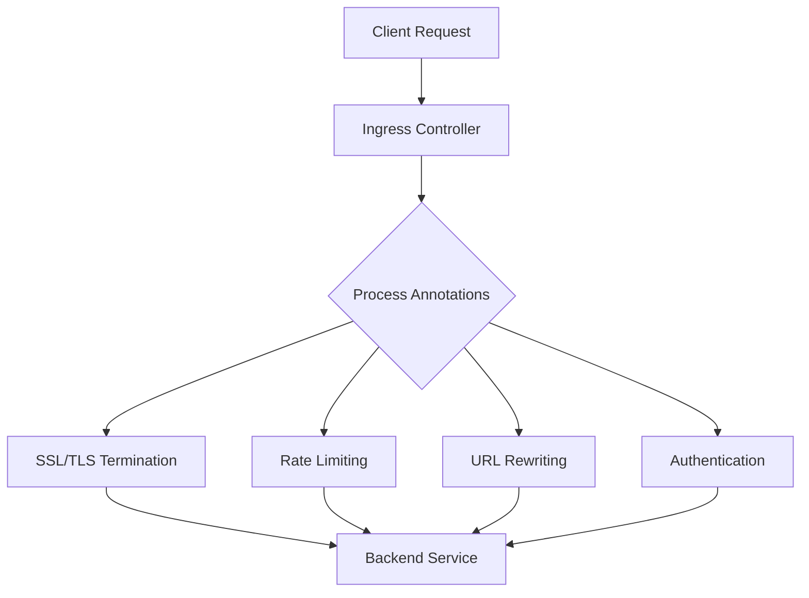
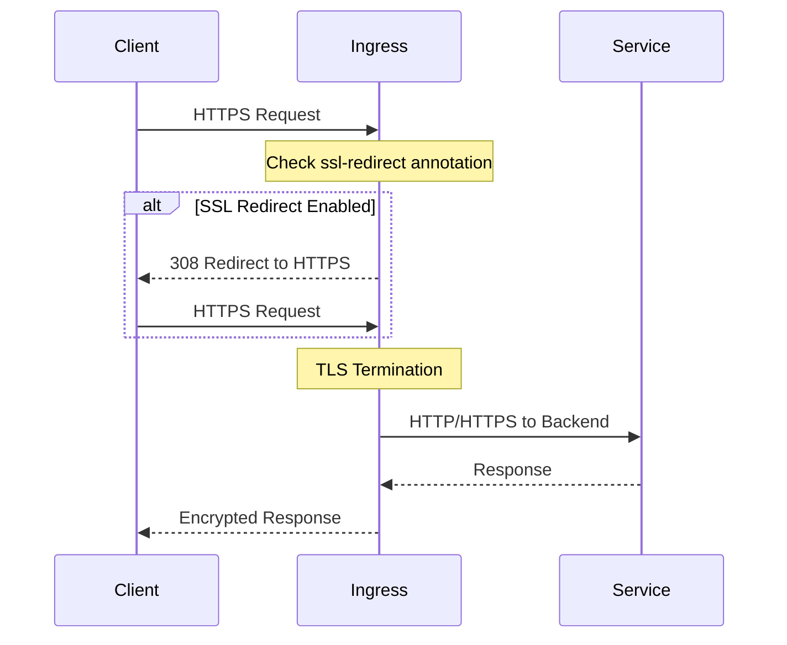
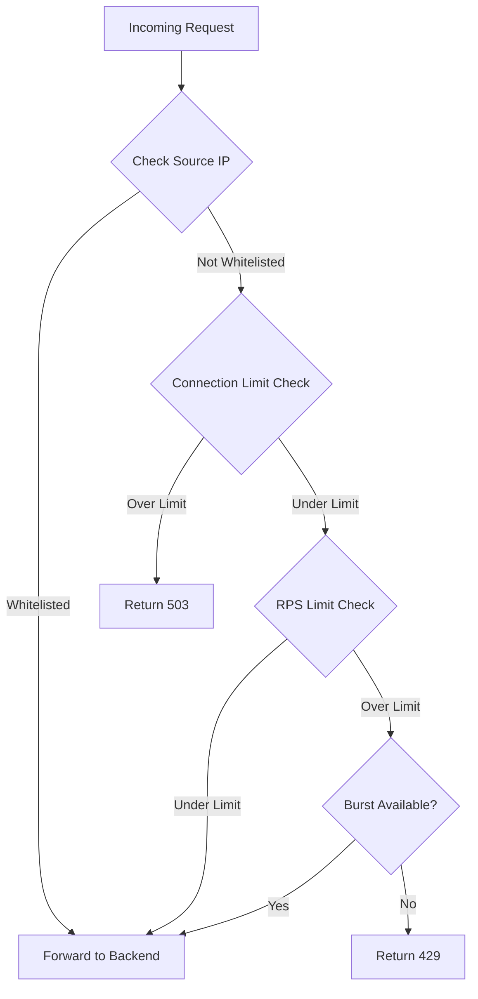
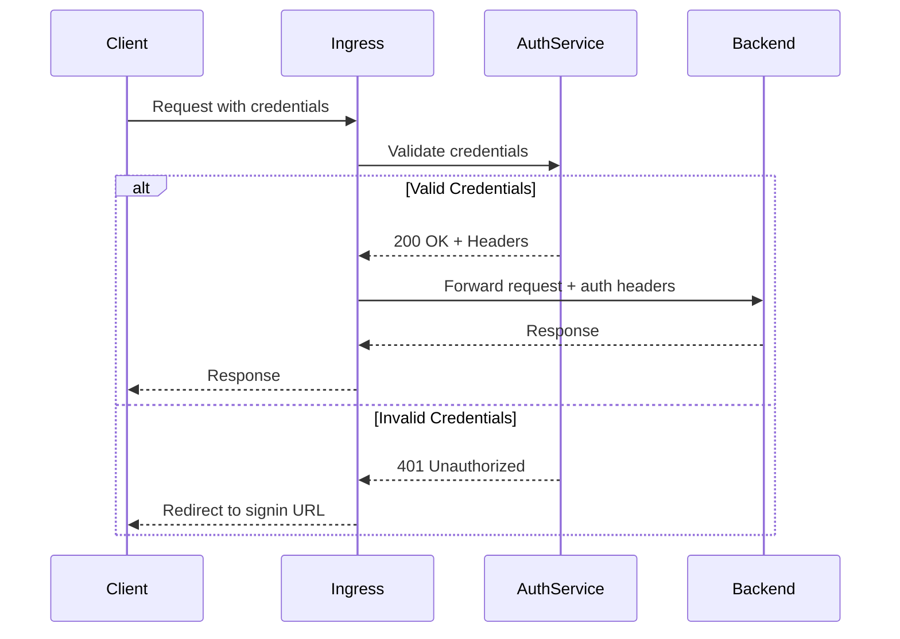
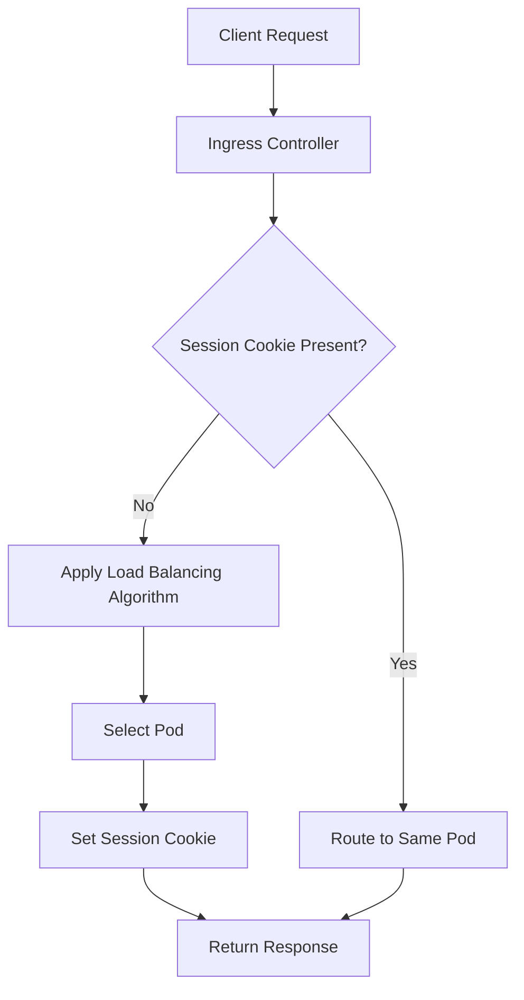
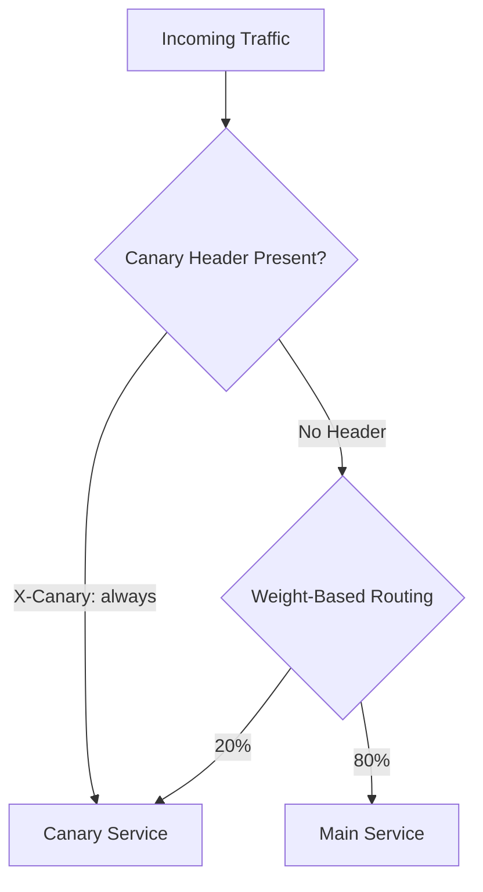

# How to Implement Kubernetes Ingress Annotations

Author: [nawazdhandala](https://github.com/nawazdhandala)

Tags: Kubernetes, Ingress, Annotations, Nginx

Description: Learn to implement Ingress annotations for SSL, rate limiting, rewrites, and authentication with nginx and other ingress controllers.

---

Kubernetes Ingress resources provide HTTP and HTTPS routing to services within your cluster. While the base Ingress specification covers fundamental routing, annotations unlock powerful advanced features specific to your ingress controller. This guide explores how to leverage annotations for sophisticated traffic management, security configurations, and performance optimization.

## Understanding Ingress Annotations

Annotations are key-value pairs attached to Kubernetes objects that provide additional configuration beyond the standard specification. For Ingress resources, annotations enable controller-specific features that extend basic routing capabilities.



## Common Ingress Controllers and Their Annotation Prefixes

Different ingress controllers use different annotation prefixes:

| Controller | Annotation Prefix |
|------------|-------------------|
| NGINX Ingress Controller | `nginx.ingress.kubernetes.io/` |
| Traefik | `traefik.ingress.kubernetes.io/` |
| HAProxy | `haproxy.org/` |
| AWS ALB | `alb.ingress.kubernetes.io/` |
| Kong | `konghq.com/` |

## Basic Ingress Resource Structure

Before diving into annotations, here is a basic Ingress resource:

```yaml
apiVersion: networking.k8s.io/v1
kind: Ingress
metadata:
  name: example-ingress
  namespace: default
  annotations:
    # Annotations go here
spec:
  ingressClassName: nginx
  rules:
    - host: example.com
      http:
        paths:
          - path: /
            pathType: Prefix
            backend:
              service:
                name: web-service
                port:
                  number: 80
```

## SSL/TLS Configuration Annotations

### Enabling HTTPS Redirect

Force all HTTP traffic to redirect to HTTPS:

```yaml
apiVersion: networking.k8s.io/v1
kind: Ingress
metadata:
  name: secure-ingress
  annotations:
    nginx.ingress.kubernetes.io/ssl-redirect: "true"
    nginx.ingress.kubernetes.io/force-ssl-redirect: "true"
spec:
  ingressClassName: nginx
  tls:
    - hosts:
        - secure.example.com
      secretName: tls-secret
  rules:
    - host: secure.example.com
      http:
        paths:
          - path: /
            pathType: Prefix
            backend:
              service:
                name: secure-service
                port:
                  number: 443
```

### SSL Passthrough

For applications that handle TLS termination themselves:

```yaml
metadata:
  annotations:
    nginx.ingress.kubernetes.io/ssl-passthrough: "true"
    nginx.ingress.kubernetes.io/backend-protocol: "HTTPS"
```

### Custom SSL Ciphers and Protocols

Configure specific TLS versions and cipher suites:

```yaml
metadata:
  annotations:
    nginx.ingress.kubernetes.io/ssl-ciphers: "ECDHE-RSA-AES128-GCM-SHA256:ECDHE-RSA-AES256-GCM-SHA384"
    nginx.ingress.kubernetes.io/ssl-prefer-server-ciphers: "true"
    nginx.ingress.kubernetes.io/ssl-protocols: "TLSv1.2 TLSv1.3"
```



## URL Rewriting and Path Manipulation

### Basic Rewrite Target

Rewrite the URL path before forwarding to the backend:

```yaml
apiVersion: networking.k8s.io/v1
kind: Ingress
metadata:
  name: rewrite-ingress
  annotations:
    nginx.ingress.kubernetes.io/rewrite-target: /$2
spec:
  ingressClassName: nginx
  rules:
    - host: app.example.com
      http:
        paths:
          - path: /api(/|$)(.*)
            pathType: ImplementationSpecific
            backend:
              service:
                name: api-service
                port:
                  number: 8080
```

In this example, a request to `/api/users/123` is rewritten to `/users/123` before reaching the backend.

### App Root Redirect

Redirect requests from root path to a specific location:

```yaml
metadata:
  annotations:
    nginx.ingress.kubernetes.io/app-root: /dashboard
```

### Using Regular Expressions

Enable regex-based path matching:

```yaml
metadata:
  annotations:
    nginx.ingress.kubernetes.io/use-regex: "true"
    nginx.ingress.kubernetes.io/rewrite-target: /$1
spec:
  rules:
    - host: app.example.com
      http:
        paths:
          - path: /v[0-9]+/(.*)
            pathType: ImplementationSpecific
            backend:
              service:
                name: versioned-api
                port:
                  number: 8080
```

## Rate Limiting Annotations

### Connection-Based Limits

Limit concurrent connections from a single IP:

```yaml
metadata:
  annotations:
    nginx.ingress.kubernetes.io/limit-connections: "10"
```

### Request Rate Limits

Control requests per second from a single IP:

```yaml
apiVersion: networking.k8s.io/v1
kind: Ingress
metadata:
  name: rate-limited-ingress
  annotations:
    nginx.ingress.kubernetes.io/limit-rps: "5"
    nginx.ingress.kubernetes.io/limit-rpm: "100"
    nginx.ingress.kubernetes.io/limit-burst-multiplier: "3"
spec:
  ingressClassName: nginx
  rules:
    - host: api.example.com
      http:
        paths:
          - path: /
            pathType: Prefix
            backend:
              service:
                name: api-service
                port:
                  number: 8080
```

### Whitelist Specific IPs from Rate Limiting

```yaml
metadata:
  annotations:
    nginx.ingress.kubernetes.io/limit-whitelist: "10.0.0.0/8,192.168.1.0/24"
```



## Authentication Annotations

### Basic Authentication

Create a basic auth secret and reference it:

```bash
# Create htpasswd file
htpasswd -c auth admin

# Create Kubernetes secret
kubectl create secret generic basic-auth --from-file=auth
```

```yaml
apiVersion: networking.k8s.io/v1
kind: Ingress
metadata:
  name: auth-ingress
  annotations:
    nginx.ingress.kubernetes.io/auth-type: basic
    nginx.ingress.kubernetes.io/auth-secret: basic-auth
    nginx.ingress.kubernetes.io/auth-realm: "Authentication Required"
spec:
  ingressClassName: nginx
  rules:
    - host: protected.example.com
      http:
        paths:
          - path: /
            pathType: Prefix
            backend:
              service:
                name: protected-service
                port:
                  number: 80
```

### External Authentication

Delegate authentication to an external service:

```yaml
metadata:
  annotations:
    nginx.ingress.kubernetes.io/auth-url: "https://auth.example.com/validate"
    nginx.ingress.kubernetes.io/auth-signin: "https://auth.example.com/login"
    nginx.ingress.kubernetes.io/auth-response-headers: "X-User,X-Email,X-Roles"
    nginx.ingress.kubernetes.io/auth-cache-key: "$remote_user$http_authorization"
    nginx.ingress.kubernetes.io/auth-cache-duration: "200 202 401 5m"
```



### OAuth2 Proxy Integration

```yaml
metadata:
  annotations:
    nginx.ingress.kubernetes.io/auth-url: "https://oauth2-proxy.example.com/oauth2/auth"
    nginx.ingress.kubernetes.io/auth-signin: "https://oauth2-proxy.example.com/oauth2/start?rd=$scheme://$host$request_uri"
    nginx.ingress.kubernetes.io/auth-response-headers: "X-Auth-Request-User,X-Auth-Request-Email"
```

## Custom Headers and CORS

### Adding Custom Headers

```yaml
metadata:
  annotations:
    nginx.ingress.kubernetes.io/configuration-snippet: |
      more_set_headers "X-Frame-Options: SAMEORIGIN";
      more_set_headers "X-Content-Type-Options: nosniff";
      more_set_headers "X-XSS-Protection: 1; mode=block";
```

### CORS Configuration

Enable Cross-Origin Resource Sharing:

```yaml
apiVersion: networking.k8s.io/v1
kind: Ingress
metadata:
  name: cors-ingress
  annotations:
    nginx.ingress.kubernetes.io/enable-cors: "true"
    nginx.ingress.kubernetes.io/cors-allow-origin: "https://frontend.example.com"
    nginx.ingress.kubernetes.io/cors-allow-methods: "GET, POST, PUT, DELETE, OPTIONS"
    nginx.ingress.kubernetes.io/cors-allow-headers: "DNT,X-CustomHeader,Keep-Alive,User-Agent,X-Requested-With,If-Modified-Since,Cache-Control,Content-Type,Authorization"
    nginx.ingress.kubernetes.io/cors-expose-headers: "Content-Length,Content-Range"
    nginx.ingress.kubernetes.io/cors-allow-credentials: "true"
    nginx.ingress.kubernetes.io/cors-max-age: "86400"
spec:
  ingressClassName: nginx
  rules:
    - host: api.example.com
      http:
        paths:
          - path: /
            pathType: Prefix
            backend:
              service:
                name: api-service
                port:
                  number: 8080
```

## Load Balancing and Session Affinity

### Sticky Sessions

Maintain session affinity for stateful applications:

```yaml
metadata:
  annotations:
    nginx.ingress.kubernetes.io/affinity: "cookie"
    nginx.ingress.kubernetes.io/affinity-mode: "persistent"
    nginx.ingress.kubernetes.io/session-cookie-name: "SERVERID"
    nginx.ingress.kubernetes.io/session-cookie-expires: "172800"
    nginx.ingress.kubernetes.io/session-cookie-max-age: "172800"
    nginx.ingress.kubernetes.io/session-cookie-path: "/"
    nginx.ingress.kubernetes.io/session-cookie-samesite: "Strict"
    nginx.ingress.kubernetes.io/session-cookie-secure: "true"
```

### Custom Load Balancing Algorithm

```yaml
metadata:
  annotations:
    nginx.ingress.kubernetes.io/upstream-hash-by: "$request_uri"
```



## Timeouts and Buffering

### Configure Timeouts

```yaml
metadata:
  annotations:
    nginx.ingress.kubernetes.io/proxy-connect-timeout: "10"
    nginx.ingress.kubernetes.io/proxy-send-timeout: "60"
    nginx.ingress.kubernetes.io/proxy-read-timeout: "60"
    nginx.ingress.kubernetes.io/proxy-next-upstream-timeout: "30"
```

### Request Body and Buffer Settings

```yaml
metadata:
  annotations:
    nginx.ingress.kubernetes.io/proxy-body-size: "50m"
    nginx.ingress.kubernetes.io/proxy-buffer-size: "16k"
    nginx.ingress.kubernetes.io/proxy-buffers-number: "4"
    nginx.ingress.kubernetes.io/client-body-buffer-size: "1m"
```

## Controller-Specific Annotations

### Traefik Annotations

```yaml
apiVersion: networking.k8s.io/v1
kind: Ingress
metadata:
  name: traefik-ingress
  annotations:
    traefik.ingress.kubernetes.io/router.entrypoints: websecure
    traefik.ingress.kubernetes.io/router.tls: "true"
    traefik.ingress.kubernetes.io/router.middlewares: default-rate-limit@kubernetescrd
    traefik.ingress.kubernetes.io/service.sticky.cookie: "true"
    traefik.ingress.kubernetes.io/service.sticky.cookie.name: "traefik_sticky"
spec:
  ingressClassName: traefik
  rules:
    - host: traefik.example.com
      http:
        paths:
          - path: /
            pathType: Prefix
            backend:
              service:
                name: web-service
                port:
                  number: 80
```

### AWS ALB Annotations

```yaml
apiVersion: networking.k8s.io/v1
kind: Ingress
metadata:
  name: alb-ingress
  annotations:
    alb.ingress.kubernetes.io/scheme: internet-facing
    alb.ingress.kubernetes.io/target-type: ip
    alb.ingress.kubernetes.io/certificate-arn: arn:aws:acm:region:account:certificate/cert-id
    alb.ingress.kubernetes.io/listen-ports: '[{"HTTPS":443}]'
    alb.ingress.kubernetes.io/ssl-policy: ELBSecurityPolicy-TLS-1-2-2017-01
    alb.ingress.kubernetes.io/healthcheck-path: /health
    alb.ingress.kubernetes.io/healthcheck-interval-seconds: "30"
    alb.ingress.kubernetes.io/success-codes: "200-299"
spec:
  ingressClassName: alb
  rules:
    - host: aws.example.com
      http:
        paths:
          - path: /
            pathType: Prefix
            backend:
              service:
                name: web-service
                port:
                  number: 80
```

## Advanced Configuration Snippets

### Custom NGINX Configuration

Inject custom NGINX directives:

```yaml
metadata:
  annotations:
    nginx.ingress.kubernetes.io/server-snippet: |
      location /custom-health {
        access_log off;
        return 200 "healthy";
      }
    nginx.ingress.kubernetes.io/configuration-snippet: |
      if ($request_uri ~* "^/api/v1/") {
        set $custom_header "api-v1";
      }
      proxy_set_header X-Custom-Header $custom_header;
```

### Canary Deployments

Route a percentage of traffic to a canary service:

```yaml
# Main Ingress
apiVersion: networking.k8s.io/v1
kind: Ingress
metadata:
  name: main-ingress
spec:
  ingressClassName: nginx
  rules:
    - host: app.example.com
      http:
        paths:
          - path: /
            pathType: Prefix
            backend:
              service:
                name: main-service
                port:
                  number: 80
---
# Canary Ingress
apiVersion: networking.k8s.io/v1
kind: Ingress
metadata:
  name: canary-ingress
  annotations:
    nginx.ingress.kubernetes.io/canary: "true"
    nginx.ingress.kubernetes.io/canary-weight: "20"
spec:
  ingressClassName: nginx
  rules:
    - host: app.example.com
      http:
        paths:
          - path: /
            pathType: Prefix
            backend:
              service:
                name: canary-service
                port:
                  number: 80
```

### Header-Based Canary Routing

```yaml
metadata:
  annotations:
    nginx.ingress.kubernetes.io/canary: "true"
    nginx.ingress.kubernetes.io/canary-by-header: "X-Canary"
    nginx.ingress.kubernetes.io/canary-by-header-value: "always"
```



## Complete Production Example

Here is a comprehensive Ingress configuration for a production API:

```yaml
apiVersion: networking.k8s.io/v1
kind: Ingress
metadata:
  name: production-api-ingress
  namespace: production
  annotations:
    # SSL Configuration
    nginx.ingress.kubernetes.io/ssl-redirect: "true"
    nginx.ingress.kubernetes.io/ssl-protocols: "TLSv1.2 TLSv1.3"

    # Security Headers
    nginx.ingress.kubernetes.io/configuration-snippet: |
      more_set_headers "Strict-Transport-Security: max-age=31536000; includeSubDomains";
      more_set_headers "X-Frame-Options: DENY";
      more_set_headers "X-Content-Type-Options: nosniff";
      more_set_headers "X-XSS-Protection: 1; mode=block";
      more_set_headers "Referrer-Policy: strict-origin-when-cross-origin";

    # Rate Limiting
    nginx.ingress.kubernetes.io/limit-rps: "50"
    nginx.ingress.kubernetes.io/limit-connections: "25"
    nginx.ingress.kubernetes.io/limit-burst-multiplier: "5"

    # Timeouts
    nginx.ingress.kubernetes.io/proxy-connect-timeout: "10"
    nginx.ingress.kubernetes.io/proxy-send-timeout: "120"
    nginx.ingress.kubernetes.io/proxy-read-timeout: "120"

    # Request Size
    nginx.ingress.kubernetes.io/proxy-body-size: "100m"

    # CORS
    nginx.ingress.kubernetes.io/enable-cors: "true"
    nginx.ingress.kubernetes.io/cors-allow-origin: "https://app.example.com"
    nginx.ingress.kubernetes.io/cors-allow-methods: "GET, POST, PUT, DELETE, PATCH, OPTIONS"
    nginx.ingress.kubernetes.io/cors-allow-credentials: "true"

    # External Auth
    nginx.ingress.kubernetes.io/auth-url: "https://auth.example.com/validate"
    nginx.ingress.kubernetes.io/auth-response-headers: "X-User-ID,X-User-Email,X-User-Roles"

    # Monitoring
    nginx.ingress.kubernetes.io/enable-access-log: "true"
    nginx.ingress.kubernetes.io/enable-opentelemetry: "true"
spec:
  ingressClassName: nginx
  tls:
    - hosts:
        - api.example.com
      secretName: api-tls-secret
  rules:
    - host: api.example.com
      http:
        paths:
          - path: /v1
            pathType: Prefix
            backend:
              service:
                name: api-v1-service
                port:
                  number: 8080
          - path: /v2
            pathType: Prefix
            backend:
              service:
                name: api-v2-service
                port:
                  number: 8080
```

## Debugging Annotations

### Enable Debug Logging

```yaml
metadata:
  annotations:
    nginx.ingress.kubernetes.io/enable-access-log: "true"
    nginx.ingress.kubernetes.io/configuration-snippet: |
      access_log /var/log/nginx/access.log upstreaminfo;
```

### Verify Applied Configuration

Check the generated NGINX configuration:

```bash
# Get the ingress controller pod
kubectl get pods -n ingress-nginx

# Check the generated configuration
kubectl exec -n ingress-nginx <pod-name> -- cat /etc/nginx/nginx.conf

# View ingress controller logs
kubectl logs -n ingress-nginx <pod-name>
```

## Best Practices

1. **Use Specific Annotation Prefixes**: Always use the correct prefix for your ingress controller to avoid configuration being ignored.

2. **Version Control**: Keep Ingress manifests in version control alongside application code.

3. **Test in Staging**: Validate annotations in a staging environment before production deployment.

4. **Document Custom Configurations**: Add comments or documentation for complex annotation combinations.

5. **Monitor Performance**: Use annotations to enable metrics and tracing for observability.

6. **Security First**: Always enable SSL redirect, use strong TLS versions, and implement appropriate rate limits.

7. **Validate Syntax**: Use `kubectl apply --dry-run=client` to validate manifests before applying.

## Conclusion

Kubernetes Ingress annotations provide a powerful mechanism for configuring advanced routing, security, and performance features. By understanding the annotations available for your specific ingress controller, you can implement sophisticated traffic management without custom application code. Start with basic annotations and progressively add more advanced configurations as your requirements evolve. Always test annotation changes in a non-production environment and monitor their impact on your application performance and security posture.
