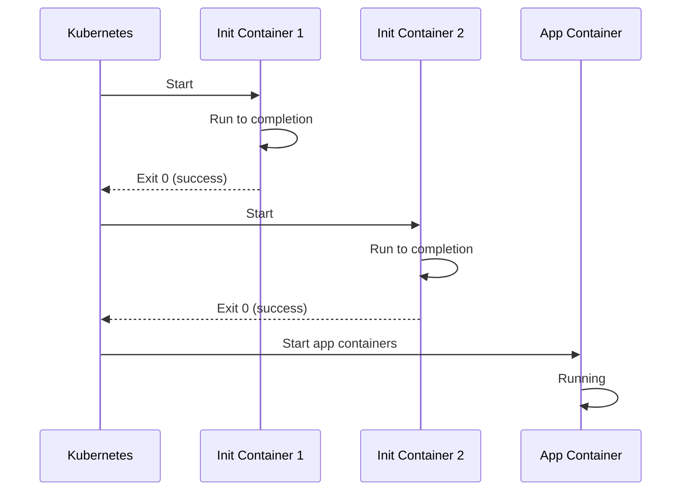

# How to Build Kubernetes Init Container Patterns

Author: [nawazdhandala](https://www.github.com/nawazdhandala)

Tags: Kubernetes, Init Containers, Patterns, DevOps, Container Orchestration

Description: Implement Kubernetes init container patterns for database migrations, configuration, dependency checks, and secrets injection.

---

Init containers solve a fundamental problem in container orchestration: how do you run setup tasks before your main application starts? While the basics are straightforward, real-world deployments require patterns that handle failures gracefully, coordinate between services, and maintain security best practices.

This guide covers battle-tested init container patterns that you can adapt for your own deployments.

## Understanding the Init Container Flow

Before diving into patterns, here is how init containers fit into the pod lifecycle.



Each init container must complete successfully before the next one starts. If any init container fails, Kubernetes restarts the pod according to the restart policy.

## Pattern 1: Service Mesh Readiness

When running with service meshes like Istio, your application might start before the sidecar proxy is ready. This pattern ensures the mesh is fully initialized.

```yaml
# service-mesh-readiness.yaml
apiVersion: apps/v1
kind: Deployment
metadata:
  name: mesh-aware-app
spec:
  selector:
    matchLabels:
      app: mesh-aware-app
  template:
    metadata:
      labels:
        app: mesh-aware-app
    spec:
      initContainers:
        # Wait for Istio sidecar to be ready
        - name: wait-for-istio
          image: curlimages/curl:8.5.0
          command:
            - sh
            - -c
            - |
              # Istio injects a sidecar that listens on 15021
              # Wait until the health endpoint responds
              echo "Waiting for Istio sidecar..."
              until curl -fsI http://localhost:15021/healthz/ready; do
                echo "Sidecar not ready, retrying in 2s..."
                sleep 2
              done
              echo "Istio sidecar is ready"
          resources:
            requests:
              cpu: 10m
              memory: 16Mi
            limits:
              cpu: 50m
              memory: 32Mi
      containers:
        - name: app
          image: myregistry/app:v1.0.0
          ports:
            - containerPort: 8080
```

## Pattern 2: Schema Migration with Locking

Running database migrations in init containers works well for single-replica deployments, but multiple replicas can cause race conditions. This pattern uses advisory locks to ensure only one migration runs at a time.

```yaml
# migration-with-lock.yaml
apiVersion: apps/v1
kind: Deployment
metadata:
  name: api-with-migrations
spec:
  replicas: 3
  selector:
    matchLabels:
      app: api
  template:
    metadata:
      labels:
        app: api
    spec:
      initContainers:
        - name: run-migrations
          image: myregistry/api:v1.0.0
          command:
            - sh
            - -c
            - |
              # Use PostgreSQL advisory lock to prevent concurrent migrations
              # Lock ID 12345 is arbitrary but must be consistent
              psql "$DATABASE_URL" <<'EOF'
              SELECT pg_advisory_lock(12345);

              -- Check current schema version
              DO $$
              BEGIN
                -- Run migrations only if needed
                IF NOT EXISTS (
                  SELECT 1 FROM schema_migrations
                  WHERE version = '20260130001'
                ) THEN
                  -- Your migration SQL here
                  ALTER TABLE users ADD COLUMN IF NOT EXISTS last_login TIMESTAMP;

                  INSERT INTO schema_migrations (version, applied_at)
                  VALUES ('20260130001', NOW());

                  RAISE NOTICE 'Migration 20260130001 applied';
                ELSE
                  RAISE NOTICE 'Migration 20260130001 already applied';
                END IF;
              END $$;

              SELECT pg_advisory_unlock(12345);
              EOF

              echo "Migration check complete"
          env:
            - name: DATABASE_URL
              valueFrom:
                secretKeyRef:
                  name: db-credentials
                  key: url
          resources:
            requests:
              cpu: 100m
              memory: 128Mi
            limits:
              cpu: 500m
              memory: 256Mi
      containers:
        - name: api
          image: myregistry/api:v1.0.0
          ports:
            - containerPort: 8080
```

## Pattern 3: Secrets Injection from Vault

Instead of using Kubernetes secrets, you might need to fetch secrets from HashiCorp Vault or another secrets manager. This pattern pulls secrets and writes them to a shared volume.

```yaml
# vault-secrets-injection.yaml
apiVersion: apps/v1
kind: Deployment
metadata:
  name: app-with-vault
spec:
  selector:
    matchLabels:
      app: vault-app
  template:
    metadata:
      labels:
        app: vault-app
    spec:
      serviceAccountName: vault-auth
      initContainers:
        - name: fetch-secrets
          image: hashicorp/vault:1.15
          command:
            - sh
            - -c
            - |
              # Authenticate with Vault using Kubernetes auth
              echo "Authenticating with Vault..."

              # Read the service account token
              JWT=$(cat /var/run/secrets/kubernetes.io/serviceaccount/token)

              # Login to Vault
              VAULT_TOKEN=$(vault write -field=token auth/kubernetes/login \
                role=myapp \
                jwt=$JWT)

              export VAULT_TOKEN

              # Fetch secrets and write to shared volume
              echo "Fetching secrets..."
              vault kv get -format=json secret/myapp/database | \
                jq -r '.data.data' > /secrets/database.json

              vault kv get -format=json secret/myapp/api-keys | \
                jq -r '.data.data' > /secrets/api-keys.json

              # Set restrictive permissions
              chmod 600 /secrets/*.json

              echo "Secrets fetched successfully"
          env:
            - name: VAULT_ADDR
              value: "https://vault.vault.svc.cluster.local:8200"
          volumeMounts:
            - name: secrets
              mountPath: /secrets
          resources:
            requests:
              cpu: 50m
              memory: 64Mi
            limits:
              cpu: 200m
              memory: 128Mi
      containers:
        - name: app
          image: myregistry/app:v1.0.0
          volumeMounts:
            - name: secrets
              mountPath: /app/secrets
              readOnly: true
      volumes:
        - name: secrets
          emptyDir:
            medium: Memory
            sizeLimit: 10Mi
```

## Pattern 4: Configuration Templating

Sometimes you need to generate configuration files based on environment variables or other runtime data. This pattern uses envsubst for template processing.

```yaml
# config-templating.yaml
apiVersion: v1
kind: ConfigMap
metadata:
  name: nginx-template
data:
  nginx.conf.template: |
    worker_processes ${WORKER_PROCESSES};

    events {
        worker_connections ${WORKER_CONNECTIONS};
    }

    http {
        upstream backend {
            server ${BACKEND_HOST}:${BACKEND_PORT};
        }

        server {
            listen 80;
            server_name ${SERVER_NAME};

            location / {
                proxy_pass http://backend;
                proxy_set_header Host $host;
                proxy_set_header X-Real-IP $remote_addr;
            }
        }
    }
---
apiVersion: apps/v1
kind: Deployment
metadata:
  name: nginx-with-template
spec:
  selector:
    matchLabels:
      app: nginx
  template:
    metadata:
      labels:
        app: nginx
    spec:
      initContainers:
        - name: render-config
          image: busybox:1.36
          command:
            - sh
            - -c
            - |
              # envsubst replaces ${VAR} with environment values
              echo "Rendering nginx configuration..."

              # Use explicit variable list to avoid replacing nginx variables
              envsubst '${WORKER_PROCESSES} ${WORKER_CONNECTIONS} ${BACKEND_HOST} ${BACKEND_PORT} ${SERVER_NAME}' \
                < /template/nginx.conf.template \
                > /config/nginx.conf

              echo "Configuration rendered:"
              cat /config/nginx.conf
          env:
            - name: WORKER_PROCESSES
              value: "4"
            - name: WORKER_CONNECTIONS
              value: "1024"
            - name: BACKEND_HOST
              value: "api-service"
            - name: BACKEND_PORT
              value: "8080"
            - name: SERVER_NAME
              value: "myapp.example.com"
          volumeMounts:
            - name: template
              mountPath: /template
            - name: config
              mountPath: /config
          resources:
            requests:
              cpu: 10m
              memory: 16Mi
      containers:
        - name: nginx
          image: nginx:1.25
          volumeMounts:
            - name: config
              mountPath: /etc/nginx/nginx.conf
              subPath: nginx.conf
      volumes:
        - name: template
          configMap:
            name: nginx-template
        - name: config
          emptyDir: {}
```

## Pattern 5: Dependency Health Verification

Rather than just checking if a port is open, this pattern verifies that dependencies are actually healthy and ready to handle requests.

```yaml
# dependency-health-check.yaml
apiVersion: apps/v1
kind: Deployment
metadata:
  name: app-with-health-checks
spec:
  selector:
    matchLabels:
      app: health-check-app
  template:
    metadata:
      labels:
        app: health-check-app
    spec:
      initContainers:
        - name: verify-dependencies
          image: curlimages/curl:8.5.0
          command:
            - sh
            - -c
            - |
              # Function to check service health
              check_health() {
                SERVICE_NAME=$1
                HEALTH_URL=$2
                MAX_ATTEMPTS=$3

                echo "Checking $SERVICE_NAME health..."

                for i in $(seq 1 $MAX_ATTEMPTS); do
                  # Check if health endpoint returns 200 and reports healthy
                  RESPONSE=$(curl -s -w "\n%{http_code}" "$HEALTH_URL" 2>/dev/null)
                  HTTP_CODE=$(echo "$RESPONSE" | tail -n1)
                  BODY=$(echo "$RESPONSE" | head -n-1)

                  if [ "$HTTP_CODE" = "200" ]; then
                    # Parse JSON response to verify healthy status
                    STATUS=$(echo "$BODY" | grep -o '"status":"[^"]*"' | cut -d'"' -f4)
                    if [ "$STATUS" = "healthy" ] || [ "$STATUS" = "ok" ]; then
                      echo "$SERVICE_NAME is healthy"
                      return 0
                    fi
                  fi

                  echo "Attempt $i/$MAX_ATTEMPTS: $SERVICE_NAME not healthy (HTTP: $HTTP_CODE)"
                  sleep 5
                done

                echo "ERROR: $SERVICE_NAME failed health check"
                return 1
              }

              # Check all dependencies
              check_health "PostgreSQL" "http://postgres-service:8080/health" 30 || exit 1
              check_health "Redis" "http://redis-service:8080/health" 30 || exit 1
              check_health "Elasticsearch" "http://elasticsearch:9200/_cluster/health" 60 || exit 1

              echo "All dependencies are healthy"
          resources:
            requests:
              cpu: 20m
              memory: 32Mi
            limits:
              cpu: 100m
              memory: 64Mi
      containers:
        - name: app
          image: myregistry/app:v1.0.0
```

## Pattern 6: Data Preloading

For applications that need cached data or ML models loaded at startup, this pattern downloads and prepares the data before the main container starts.

```yaml
# data-preload.yaml
apiVersion: apps/v1
kind: Deployment
metadata:
  name: ml-inference-app
spec:
  selector:
    matchLabels:
      app: ml-inference
  template:
    metadata:
      labels:
        app: ml-inference
    spec:
      initContainers:
        # Download ML model from object storage
        - name: download-model
          image: amazon/aws-cli:2.15.0
          command:
            - sh
            - -c
            - |
              echo "Downloading ML model..."

              # Download model file
              aws s3 cp s3://ml-models/sentiment-v2.0.tar.gz /models/

              # Extract model
              cd /models && tar -xzf sentiment-v2.0.tar.gz
              rm sentiment-v2.0.tar.gz

              # Verify model integrity
              CHECKSUM=$(sha256sum /models/sentiment-v2.0/model.bin | cut -d' ' -f1)
              EXPECTED="a1b2c3d4e5f6..."

              if [ "$CHECKSUM" != "$EXPECTED" ]; then
                echo "ERROR: Model checksum mismatch"
                exit 1
              fi

              echo "Model downloaded and verified"
          env:
            - name: AWS_ACCESS_KEY_ID
              valueFrom:
                secretKeyRef:
                  name: aws-credentials
                  key: access-key
            - name: AWS_SECRET_ACCESS_KEY
              valueFrom:
                secretKeyRef:
                  name: aws-credentials
                  key: secret-key
            - name: AWS_DEFAULT_REGION
              value: "us-east-1"
          volumeMounts:
            - name: model-storage
              mountPath: /models
          resources:
            requests:
              cpu: 100m
              memory: 256Mi
            limits:
              cpu: 500m
              memory: 512Mi
      containers:
        - name: inference
          image: myregistry/ml-inference:v1.0.0
          volumeMounts:
            - name: model-storage
              mountPath: /app/models
              readOnly: true
      volumes:
        - name: model-storage
          emptyDir:
            sizeLimit: 5Gi
```

## Debugging Init Container Issues

When init containers fail or get stuck, use these commands to diagnose the problem.

```bash
# Check init container status
kubectl get pod myapp-xxx -o jsonpath='{range .status.initContainerStatuses[*]}{.name}: {.state}{"\n"}{end}'

# View logs from a specific init container
kubectl logs myapp-xxx -c wait-for-istio

# Stream logs while init container is running
kubectl logs -f myapp-xxx -c fetch-secrets

# Get events related to the pod
kubectl get events --field-selector involvedObject.name=myapp-xxx --sort-by='.lastTimestamp'

# Describe pod to see full init container details
kubectl describe pod myapp-xxx | grep -A 20 "Init Containers:"
```

## Best Practices Summary

When implementing init container patterns, keep these guidelines in mind:

1. **Keep images small.** Use minimal base images like busybox or distroless where possible. Large images slow down pod startup.

2. **Set resource limits.** Init containers should have their own resource requests and limits. Do not assume they need the same resources as your main container.

3. **Add timeouts.** Always include timeout logic in wait loops. Infinite waits make debugging difficult and can hide real issues.

4. **Make operations idempotent.** Init containers might run multiple times due to pod restarts. Ensure they can handle being re-run safely.

5. **Log progress.** Include echo statements that show what the init container is doing. This makes troubleshooting much easier.

Init containers are a powerful primitive for handling pre-startup logic. By combining these patterns with your specific requirements, you can build robust initialization workflows that handle real-world complexity.
