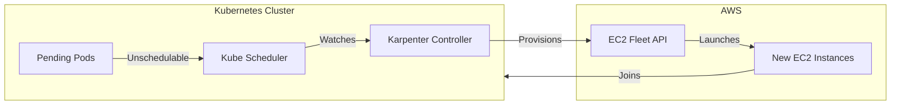
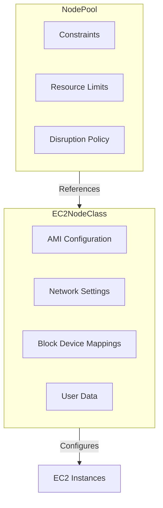
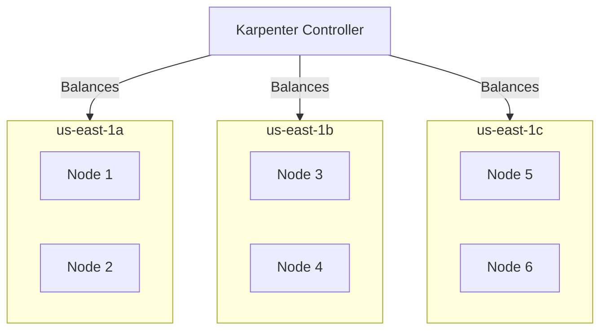
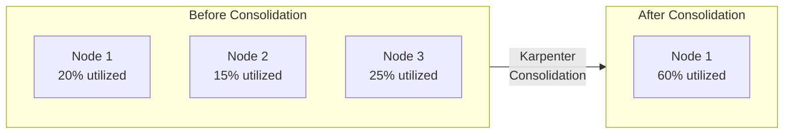

# How to Create Kubernetes Karpenter Node Pools

Author: [nawazdhandala](https://github.com/nawazdhandala)

Tags: Kubernetes, Karpenter, Autoscaling, AWS

Description: Learn how to configure Karpenter node pools for efficient cluster autoscaling.

---

Karpenter is a high-performance Kubernetes cluster autoscaler that provisions nodes in seconds rather than minutes. Unlike the Cluster Autoscaler that works with predefined node groups, Karpenter dynamically selects instance types based on pending pod requirements and can consolidate underutilized nodes to reduce costs.

## How Karpenter Works

Karpenter watches for unschedulable pods and provisions just-in-time compute capacity. It directly integrates with cloud provider APIs to launch instances without the overhead of managed node groups.



## Prerequisites

Before configuring Karpenter, ensure you have:

- An EKS cluster running Kubernetes 1.25 or later
- AWS IAM permissions for Karpenter
- The Karpenter controller installed via Helm

### Install Karpenter

```bash
# Set environment variables
export KARPENTER_NAMESPACE="kube-system"
export KARPENTER_VERSION="1.0.0"
export CLUSTER_NAME="my-cluster"

# Install Karpenter using Helm
helm upgrade --install karpenter oci://public.ecr.aws/karpenter/karpenter \
  --version "${KARPENTER_VERSION}" \
  --namespace "${KARPENTER_NAMESPACE}" \
  --set "settings.clusterName=${CLUSTER_NAME}" \
  --set "settings.interruptionQueue=${CLUSTER_NAME}" \
  --wait
```

## Understanding Node Pools and EC2NodeClasses

Karpenter uses two main Custom Resource Definitions (CRDs):

- **NodePool**: Defines constraints for nodes (instance types, zones, capacity type)
- **EC2NodeClass**: Defines AWS-specific configuration (AMI, security groups, subnets)



## Creating an EC2NodeClass

The EC2NodeClass defines how EC2 instances are configured. Start by creating the AWS-specific configuration.

```yaml
# ec2nodeclass.yaml
# Defines AWS-specific settings for nodes provisioned by Karpenter
apiVersion: karpenter.k8s.aws/v1
kind: EC2NodeClass
metadata:
  name: default
spec:
  # IAM role that nodes will assume
  # This role needs permissions for ECR, SSM, and other AWS services
  role: "KarpenterNodeRole-${CLUSTER_NAME}"

  # Subnet discovery using tags
  # Karpenter will launch nodes in subnets with these tags
  subnetSelectorTerms:
    - tags:
        karpenter.sh/discovery: "${CLUSTER_NAME}"

  # Security group discovery using tags
  # Nodes will be attached to security groups matching these tags
  securityGroupSelectorTerms:
    - tags:
        karpenter.sh/discovery: "${CLUSTER_NAME}"

  # AMI selection - use the latest EKS optimized AMI
  amiSelectorTerms:
    - alias: al2023@latest    # Amazon Linux 2023 EKS optimized

  # Block device configuration for the root volume
  blockDeviceMappings:
    - deviceName: /dev/xvda
      ebs:
        volumeSize: 100Gi           # Root volume size
        volumeType: gp3             # Use gp3 for better performance
        iops: 3000                  # Baseline IOPS for gp3
        throughput: 125             # Baseline throughput in MiB/s
        encrypted: true             # Enable EBS encryption
        deleteOnTermination: true   # Clean up when node is terminated

  # Optional: Add custom tags to EC2 instances
  tags:
    Environment: production
    ManagedBy: karpenter
```

Apply the EC2NodeClass:

```bash
# Apply the EC2NodeClass configuration
kubectl apply -f ec2nodeclass.yaml

# Verify the EC2NodeClass was created successfully
kubectl get ec2nodeclasses
```

## Creating a Basic NodePool

The NodePool defines what types of nodes Karpenter can provision and under what constraints.

```yaml
# nodepool-default.yaml
# Default NodePool for general workloads
apiVersion: karpenter.sh/v1
kind: NodePool
metadata:
  name: default
spec:
  # Reference to the EC2NodeClass that defines AWS configuration
  template:
    metadata:
      # Labels applied to all nodes from this pool
      labels:
        node-type: general
    spec:
      # Link to the EC2NodeClass
      nodeClassRef:
        group: karpenter.k8s.aws
        kind: EC2NodeClass
        name: default

      # Expire nodes after 720 hours (30 days) to ensure fresh instances
      expireAfter: 720h

      # Instance type requirements
      requirements:
        # Allow both on-demand and spot instances
        - key: karpenter.sh/capacity-type
          operator: In
          values: ["on-demand", "spot"]

        # Restrict to specific instance families for predictable performance
        - key: node.kubernetes.io/instance-type
          operator: In
          values:
            - m6i.large
            - m6i.xlarge
            - m6i.2xlarge
            - m6a.large
            - m6a.xlarge
            - m6a.2xlarge
            - c6i.large
            - c6i.xlarge
            - c6i.2xlarge

        # Use x86_64 architecture
        - key: kubernetes.io/arch
          operator: In
          values: ["amd64"]

        # Restrict to specific availability zones
        - key: topology.kubernetes.io/zone
          operator: In
          values:
            - us-east-1a
            - us-east-1b
            - us-east-1c

  # Resource limits to prevent runaway scaling
  limits:
    cpu: 1000        # Maximum 1000 vCPUs across all nodes in this pool
    memory: 2000Gi   # Maximum 2000 GiB memory across all nodes

  # Disruption settings for cost optimization
  disruption:
    # Allow consolidation to reduce costs
    consolidationPolicy: WhenEmptyOrUnderutilized
    # Wait 30 seconds before consolidating
    consolidateAfter: 30s
```

Apply and verify:

```bash
# Apply the NodePool
kubectl apply -f nodepool-default.yaml

# Check NodePool status
kubectl get nodepools

# View detailed NodePool information
kubectl describe nodepool default
```

## Creating Specialized Node Pools

Different workloads have different requirements. Create specialized pools for specific use cases.

### Spot Instance Pool for Cost Optimization

```yaml
# nodepool-spot.yaml
# NodePool optimized for cost using spot instances
apiVersion: karpenter.sh/v1
kind: NodePool
metadata:
  name: spot-workers
spec:
  template:
    metadata:
      labels:
        node-type: spot
        cost-tier: economical
    spec:
      nodeClassRef:
        group: karpenter.k8s.aws
        kind: EC2NodeClass
        name: default

      expireAfter: 168h   # 7 days - shorter lifetime for spot

      # Taint spot nodes so only tolerating pods land here
      taints:
        - key: spot
          value: "true"
          effect: NoSchedule

      requirements:
        # Only spot instances for maximum savings
        - key: karpenter.sh/capacity-type
          operator: In
          values: ["spot"]

        # Use a wide variety of instance types for better spot availability
        - key: node.kubernetes.io/instance-type
          operator: In
          values:
            - m6i.large
            - m6i.xlarge
            - m6a.large
            - m6a.xlarge
            - m5.large
            - m5.xlarge
            - c6i.large
            - c6i.xlarge
            - c5.large
            - c5.xlarge
            - r6i.large
            - r5.large

        - key: kubernetes.io/arch
          operator: In
          values: ["amd64"]

  limits:
    cpu: 500
    memory: 1000Gi

  disruption:
    consolidationPolicy: WhenEmptyOrUnderutilized
    consolidateAfter: 15s   # Aggressive consolidation for spot
```

### GPU Node Pool for ML Workloads

```yaml
# nodepool-gpu.yaml
# NodePool for GPU-intensive workloads
apiVersion: karpenter.sh/v1
kind: NodePool
metadata:
  name: gpu-workers
spec:
  template:
    metadata:
      labels:
        node-type: gpu
        accelerator: nvidia
    spec:
      nodeClassRef:
        group: karpenter.k8s.aws
        kind: EC2NodeClass
        name: gpu-nodeclass   # Separate EC2NodeClass with GPU AMI

      expireAfter: 720h

      # Taint GPU nodes for dedicated GPU workloads
      taints:
        - key: nvidia.com/gpu
          value: "true"
          effect: NoSchedule

      requirements:
        # GPU instances are expensive - use on-demand for stability
        - key: karpenter.sh/capacity-type
          operator: In
          values: ["on-demand"]

        # Specific GPU instance types
        - key: node.kubernetes.io/instance-type
          operator: In
          values:
            - g5.xlarge      # 1 x A10G GPU
            - g5.2xlarge     # 1 x A10G GPU, more CPU/memory
            - g5.4xlarge     # 1 x A10G GPU, even more CPU/memory
            - p4d.24xlarge   # 8 x A100 GPUs for large models

        - key: kubernetes.io/arch
          operator: In
          values: ["amd64"]

  # Strict limits on GPU nodes due to cost
  limits:
    cpu: 200
    memory: 800Gi

  disruption:
    # Only consolidate when completely empty for GPU workloads
    consolidationPolicy: WhenEmpty
    consolidateAfter: 60s
```

### High Memory Pool for Data Processing

```yaml
# nodepool-highmem.yaml
# NodePool for memory-intensive workloads like databases and caching
apiVersion: karpenter.sh/v1
kind: NodePool
metadata:
  name: highmem-workers
spec:
  template:
    metadata:
      labels:
        node-type: highmem
        workload: data-processing
    spec:
      nodeClassRef:
        group: karpenter.k8s.aws
        kind: EC2NodeClass
        name: default

      expireAfter: 720h

      requirements:
        # On-demand for data workloads requiring stability
        - key: karpenter.sh/capacity-type
          operator: In
          values: ["on-demand"]

        # Memory-optimized instance types
        - key: node.kubernetes.io/instance-type
          operator: In
          values:
            - r6i.large     # 2 vCPU, 16 GiB
            - r6i.xlarge    # 4 vCPU, 32 GiB
            - r6i.2xlarge   # 8 vCPU, 64 GiB
            - r6i.4xlarge   # 16 vCPU, 128 GiB
            - r6a.large
            - r6a.xlarge
            - r6a.2xlarge

        - key: kubernetes.io/arch
          operator: In
          values: ["amd64"]

  limits:
    cpu: 300
    memory: 2400Gi   # Higher memory limit

  disruption:
    consolidationPolicy: WhenEmptyOrUnderutilized
    consolidateAfter: 120s   # Longer wait for stateful workloads
```

## Node Pool Topology and Scheduling

Karpenter works with Kubernetes topology spread constraints to ensure high availability.



### Deploying Pods with Topology Spread

```yaml
# deployment-with-spread.yaml
# Deployment that spreads pods across availability zones
apiVersion: apps/v1
kind: Deployment
metadata:
  name: web-app
spec:
  replicas: 6
  selector:
    matchLabels:
      app: web-app
  template:
    metadata:
      labels:
        app: web-app
    spec:
      # Spread pods across AZs for high availability
      topologySpreadConstraints:
        - maxSkew: 1                              # Maximum difference in pod count
          topologyKey: topology.kubernetes.io/zone
          whenUnsatisfiable: DoNotSchedule       # Strict spreading
          labelSelector:
            matchLabels:
              app: web-app

      # Request spot nodes for cost savings
      nodeSelector:
        node-type: spot

      # Tolerate spot taint
      tolerations:
        - key: spot
          operator: Equal
          value: "true"
          effect: NoSchedule

      containers:
        - name: web
          image: nginx:latest
          resources:
            requests:
              cpu: 500m
              memory: 512Mi
            limits:
              cpu: 1000m
              memory: 1Gi
```

## Understanding Consolidation

Karpenter automatically consolidates nodes to reduce costs by moving pods and removing underutilized nodes.



### Consolidation Policies

There are two consolidation policies:

- **WhenEmpty**: Only remove nodes with no pods
- **WhenEmptyOrUnderutilized**: Remove nodes that are empty or can have their pods moved elsewhere

```yaml
# nodepool-consolidation.yaml
# NodePool with aggressive consolidation for development
apiVersion: karpenter.sh/v1
kind: NodePool
metadata:
  name: dev-pool
spec:
  template:
    spec:
      nodeClassRef:
        group: karpenter.k8s.aws
        kind: EC2NodeClass
        name: default

      requirements:
        - key: karpenter.sh/capacity-type
          operator: In
          values: ["spot"]

        - key: node.kubernetes.io/instance-type
          operator: In
          values:
            - m6i.large
            - m6i.xlarge

  limits:
    cpu: 100

  disruption:
    # Aggressively consolidate in dev
    consolidationPolicy: WhenEmptyOrUnderutilized
    # Short wait time for dev environment
    consolidateAfter: 10s

    # Control how many nodes can be disrupted at once
    budgets:
      # Allow disrupting 20% of nodes at a time
      - nodes: "20%"
      # Or at least 1 node
      - nodes: "1"
```

### Preventing Consolidation for Critical Pods

Use Pod Disruption Budgets (PDBs) to protect critical workloads:

```yaml
# pdb-critical.yaml
# Prevent Karpenter from disrupting critical pods
apiVersion: policy/v1
kind: PodDisruptionBudget
metadata:
  name: critical-app-pdb
spec:
  # Always keep at least 2 replicas running
  minAvailable: 2
  selector:
    matchLabels:
      app: critical-app
```

Or use the do-not-disrupt annotation:

```yaml
# pod-no-disruption.yaml
apiVersion: v1
kind: Pod
metadata:
  name: critical-batch-job
  annotations:
    # Karpenter will not voluntarily disrupt this pod
    karpenter.sh/do-not-disrupt: "true"
spec:
  containers:
    - name: batch
      image: my-batch-processor:latest
```

## Weighted Node Pools

Use weights to prefer certain node pools over others:

```yaml
# nodepool-weighted.yaml
# Primary pool with higher weight (preferred)
apiVersion: karpenter.sh/v1
kind: NodePool
metadata:
  name: primary
spec:
  # Higher weight means this pool is preferred
  weight: 100

  template:
    spec:
      nodeClassRef:
        group: karpenter.k8s.aws
        kind: EC2NodeClass
        name: default

      requirements:
        - key: karpenter.sh/capacity-type
          operator: In
          values: ["spot"]

        - key: node.kubernetes.io/instance-type
          operator: In
          values:
            - m6i.large
            - m6i.xlarge

  limits:
    cpu: 500

  disruption:
    consolidationPolicy: WhenEmptyOrUnderutilized
    consolidateAfter: 30s
---
# Fallback pool with lower weight
apiVersion: karpenter.sh/v1
kind: NodePool
metadata:
  name: fallback
spec:
  # Lower weight - only used when primary is exhausted or constrained
  weight: 10

  template:
    spec:
      nodeClassRef:
        group: karpenter.k8s.aws
        kind: EC2NodeClass
        name: default

      requirements:
        # Fall back to on-demand if spot unavailable
        - key: karpenter.sh/capacity-type
          operator: In
          values: ["on-demand"]

        - key: node.kubernetes.io/instance-type
          operator: In
          values:
            - m6i.large
            - m6i.xlarge
            - m6i.2xlarge

  limits:
    cpu: 200

  disruption:
    consolidationPolicy: WhenEmptyOrUnderutilized
    consolidateAfter: 60s
```

## Monitoring Karpenter

### View Provisioned Nodes

```bash
# List all nodes provisioned by Karpenter
kubectl get nodes -l karpenter.sh/registered=true

# View node details including instance type and capacity type
kubectl get nodes -L node.kubernetes.io/instance-type,karpenter.sh/capacity-type,topology.kubernetes.io/zone

# Check NodeClaim status (how Karpenter tracks provisioning)
kubectl get nodeclaims

# View detailed provisioning information
kubectl describe nodeclaim <name>
```

### Check Karpenter Logs

```bash
# View Karpenter controller logs
kubectl logs -n kube-system -l app.kubernetes.io/name=karpenter -c controller --tail=100

# Follow logs in real-time
kubectl logs -n kube-system -l app.kubernetes.io/name=karpenter -c controller -f

# Filter for provisioning events
kubectl logs -n kube-system -l app.kubernetes.io/name=karpenter -c controller | grep -i "launched"
```

### Prometheus Metrics

Karpenter exposes metrics for monitoring:

```yaml
# servicemonitor-karpenter.yaml
# Prometheus ServiceMonitor for Karpenter metrics
apiVersion: monitoring.coreos.com/v1
kind: ServiceMonitor
metadata:
  name: karpenter
  namespace: kube-system
spec:
  selector:
    matchLabels:
      app.kubernetes.io/name: karpenter
  endpoints:
    - port: http-metrics
      interval: 30s
```

Key metrics to monitor:

- `karpenter_nodes_total`: Total nodes managed by Karpenter
- `karpenter_pods_state`: Pod scheduling state
- `karpenter_nodepools_limit`: Resource limits per NodePool
- `karpenter_nodepools_usage`: Current resource usage per NodePool
- `karpenter_interruption_received_total`: Spot interruption events

## Troubleshooting

### Pods Stuck Pending

```bash
# Check why pods are pending
kubectl describe pod <pod-name>

# Verify NodePool requirements match pod requirements
kubectl get nodepools -o yaml

# Check for resource limit exhaustion
kubectl describe nodepool default | grep -A5 "Limits"
```

### Nodes Not Provisioning

```bash
# Check Karpenter controller logs for errors
kubectl logs -n kube-system -l app.kubernetes.io/name=karpenter -c controller | grep -i error

# Verify EC2NodeClass configuration
kubectl describe ec2nodeclass default

# Check IAM permissions (common issue)
kubectl get events -n kube-system --field-selector reason=FailedCreate
```

### Consolidation Not Working

```bash
# Check if PDBs are blocking consolidation
kubectl get pdb -A

# Look for do-not-disrupt annotations
kubectl get pods -A -o jsonpath='{range .items[*]}{.metadata.name}{"\t"}{.metadata.annotations.karpenter\.sh/do-not-disrupt}{"\n"}{end}' | grep true

# Verify consolidation settings
kubectl get nodepool default -o yaml | grep -A10 disruption
```

## Best Practices

1. **Start with broad instance type requirements** - Let Karpenter choose the best fit
2. **Use spot instances for stateless workloads** - Significant cost savings
3. **Set appropriate resource limits** - Prevent runaway scaling
4. **Enable consolidation** - Reduce costs automatically
5. **Use topology spread constraints** - Ensure high availability
6. **Monitor NodePool utilization** - Right-size your limits
7. **Test disruption settings** - Verify PDBs work as expected
8. **Keep Karpenter updated** - New versions bring performance improvements

---

Karpenter transforms Kubernetes autoscaling from a slow, reactive process to a fast, intelligent system that provisions exactly what your workloads need. With proper NodePool configuration, you can achieve both high availability and cost optimization without manual intervention.
