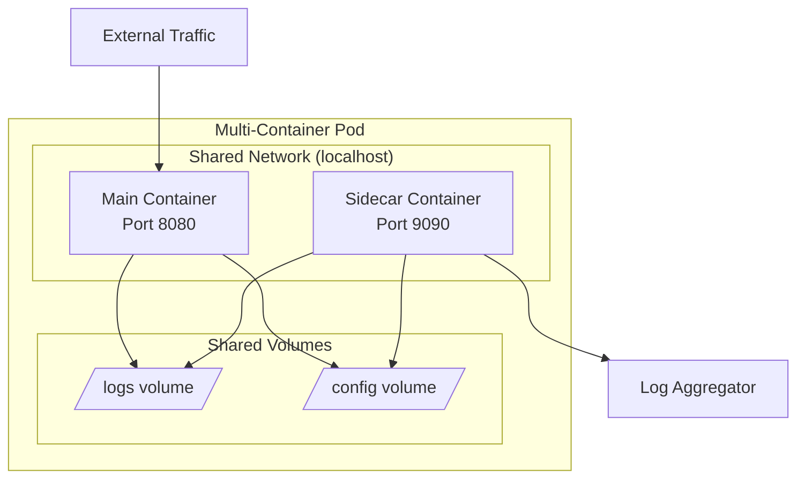
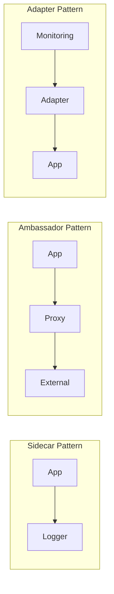
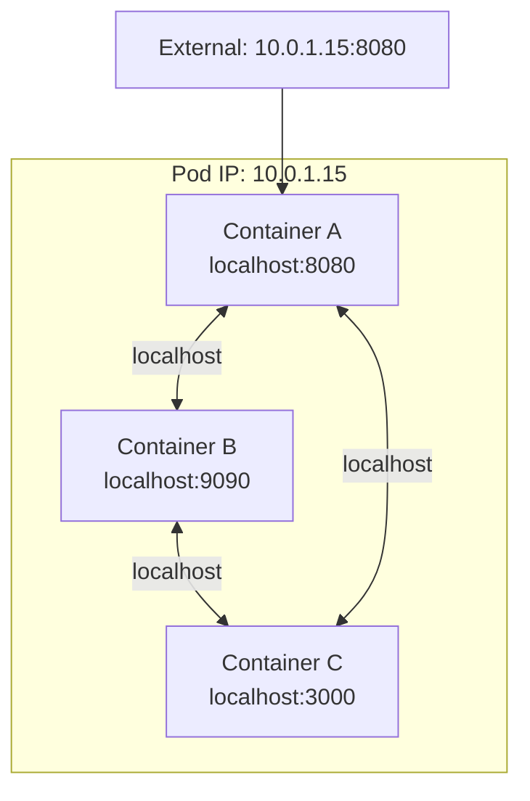
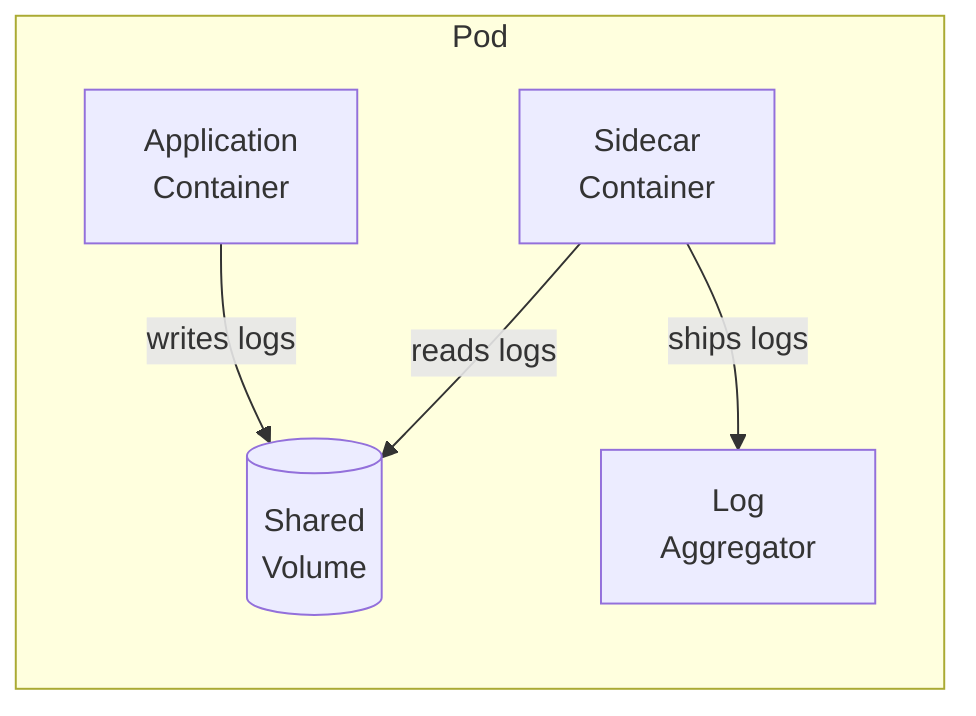
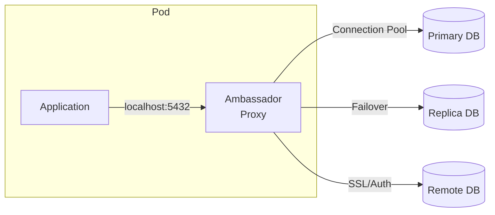
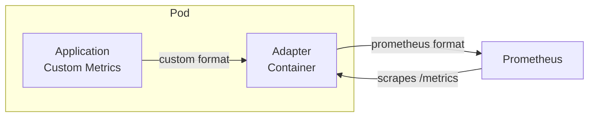
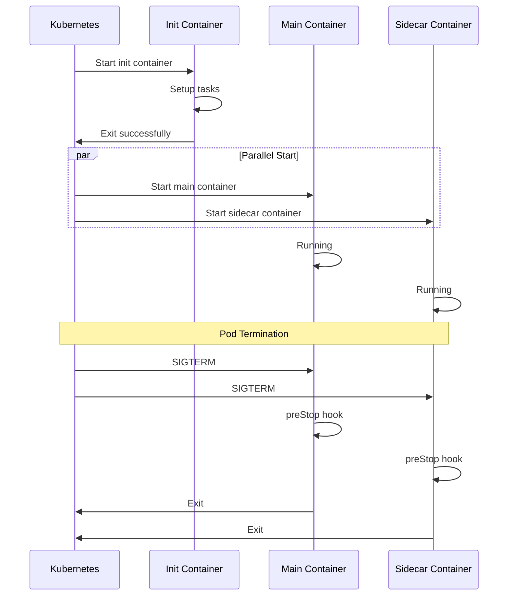

# How to Create Kubernetes Multi-Container Pods

Author: [nawazdhandala](https://github.com/nawazdhandala)

Tags: Kubernetes, Pods, Container Patterns, Architecture

Description: Learn how to design multi-container pods with sidecar, ambassador, and adapter patterns.

---

A pod in Kubernetes can run multiple containers that share the same network namespace, storage volumes, and lifecycle. This enables powerful patterns for extending and enhancing your applications without modifying the main container.

## Why Multi-Container Pods?

Single-container pods work well for simple applications. But as requirements grow, you often need supporting functionality: logging, proxying, configuration reloading, or data transformation. Multi-container pods let you add these capabilities as separate containers that work alongside your main application.



### Key Benefits

- **Separation of concerns**: Each container has a single responsibility
- **Reusability**: Sidecar containers can be reused across different applications
- **Independent updates**: Update the logging sidecar without touching the main app
- **Shared resources**: Containers share network, storage, and can communicate via localhost

## Understanding the Three Main Patterns



| Pattern | Purpose | Example |
|---------|---------|---------|
| Sidecar | Extend and enhance the main container | Log shipping, file sync, config reload |
| Ambassador | Proxy connections to external services | Database proxy, API gateway |
| Adapter | Standardize and transform data | Metrics exporter, log format converter |

## Shared Volumes Between Containers

Volumes are the primary way containers in a pod communicate and share data. Each container can mount the same volume at different paths.

### Basic Shared Volume Configuration

```yaml
# shared-volume-pod.yaml
# Demonstrates how two containers share data through a volume
apiVersion: v1
kind: Pod
metadata:
  name: shared-volume-demo
  labels:
    app: shared-volume-demo
spec:
  # Define a volume that both containers will use
  volumes:
    - name: shared-data
      emptyDir: {}  # Temporary storage that exists for pod lifetime

    - name: config-volume
      configMap:
        name: app-config  # Both containers can read this config

  containers:
    # Main application container
    - name: app
      image: nginx:1.25
      ports:
        - containerPort: 80
      volumeMounts:
        # Mount shared volume where nginx serves files
        - name: shared-data
          mountPath: /usr/share/nginx/html
        # Mount config as read-only
        - name: config-volume
          mountPath: /etc/app-config
          readOnly: true
      resources:
        requests:
          memory: "64Mi"
          cpu: "100m"
        limits:
          memory: "128Mi"
          cpu: "200m"

    # Sidecar that writes content to the shared volume
    - name: content-generator
      image: busybox:1.36
      # Generate content every 10 seconds
      command:
        - /bin/sh
        - -c
        - |
          while true; do
            echo "<h1>Generated at $(date)</h1>" > /data/index.html
            echo "Content updated at $(date)" >> /data/updates.log
            sleep 10
          done
      volumeMounts:
        # Same volume, mounted at different path
        - name: shared-data
          mountPath: /data
      resources:
        requests:
          memory: "32Mi"
          cpu: "50m"
        limits:
          memory: "64Mi"
          cpu: "100m"
```

### Volume Types for Multi-Container Pods

```yaml
# volume-types-example.yaml
# Shows different volume types useful for multi-container patterns
apiVersion: v1
kind: Pod
metadata:
  name: volume-types-demo
spec:
  volumes:
    # Ephemeral storage - cleared when pod is removed
    - name: scratch-space
      emptyDir: {}

    # In-memory storage for sensitive data or fast access
    - name: cache
      emptyDir:
        medium: Memory
        sizeLimit: 100Mi

    # ConfigMap for shared configuration
    - name: config
      configMap:
        name: shared-config
        items:
          - key: app.conf
            path: application.conf

    # Secret for credentials both containers need
    - name: credentials
      secret:
        secretName: db-credentials
        defaultMode: 0400  # Read-only for owner

    # Persistent storage for data that survives pod restarts
    - name: persistent-data
      persistentVolumeClaim:
        claimName: shared-pvc

  containers:
    - name: writer
      image: busybox:1.36
      command: ["sh", "-c", "echo data > /scratch/file && sleep infinity"]
      volumeMounts:
        - name: scratch-space
          mountPath: /scratch
        - name: cache
          mountPath: /cache
        - name: credentials
          mountPath: /secrets
          readOnly: true

    - name: reader
      image: busybox:1.36
      command: ["sh", "-c", "cat /scratch/file && sleep infinity"]
      volumeMounts:
        - name: scratch-space
          mountPath: /scratch
          readOnly: true  # Reader only needs read access
        - name: cache
          mountPath: /cache
        - name: config
          mountPath: /config
```

## Networking Between Containers

Containers in the same pod share a network namespace. They communicate via `localhost` and share the same IP address.



### Network Communication Example

```yaml
# network-demo-pod.yaml
# Shows how containers communicate over localhost
apiVersion: v1
kind: Pod
metadata:
  name: network-demo
spec:
  containers:
    # Web server listening on port 80
    - name: web
      image: nginx:1.25
      ports:
        - containerPort: 80
          name: http
      # Health check via localhost
      livenessProbe:
        httpGet:
          path: /
          port: 80
        initialDelaySeconds: 5
        periodSeconds: 10

    # API server listening on port 8080
    - name: api
      image: hashicorp/http-echo
      args:
        - "-listen=:8080"
        - "-text=Hello from API"
      ports:
        - containerPort: 8080
          name: api

    # Sidecar that calls both services via localhost
    - name: monitor
      image: curlimages/curl:8.5.0
      command:
        - /bin/sh
        - -c
        - |
          while true; do
            echo "--- Health Check $(date) ---"

            # Call web server via localhost
            echo "Web server response:"
            curl -s http://localhost:80/ | head -5

            # Call API via localhost
            echo "API response:"
            curl -s http://localhost:8080/

            sleep 30
          done
```

### Port Conflict Avoidance

Since containers share the network namespace, each container must use unique ports:

```yaml
# port-allocation.yaml
# Proper port allocation across containers
apiVersion: v1
kind: Pod
metadata:
  name: multi-service-pod
spec:
  containers:
    - name: frontend
      image: nginx:1.25
      ports:
        - containerPort: 80    # HTTP
        - containerPort: 443   # HTTPS

    - name: backend
      image: myapp/api:v1
      ports:
        - containerPort: 8080  # API endpoint
        - containerPort: 8081  # Health/metrics

    - name: cache
      image: redis:7
      ports:
        - containerPort: 6379  # Redis default port

    - name: metrics-proxy
      image: prom/pushgateway:v1.6.2
      ports:
        - containerPort: 9091  # Metrics endpoint
```

## The Sidecar Pattern

The sidecar pattern extends and enhances the main container without changing it. Common use cases include logging, monitoring, and configuration management.



### Logging Sidecar Example

This pattern collects logs from the main application and ships them to a central logging system.

```yaml
# logging-sidecar.yaml
# A production-ready logging sidecar pattern
apiVersion: v1
kind: Pod
metadata:
  name: app-with-logging-sidecar
  labels:
    app: web-app
spec:
  volumes:
    # Shared volume for log files
    - name: app-logs
      emptyDir: {}

    # Fluent Bit configuration
    - name: fluent-bit-config
      configMap:
        name: fluent-bit-config

  containers:
    # Main application container
    - name: app
      image: nginx:1.25
      ports:
        - containerPort: 80
      volumeMounts:
        # Application writes logs here
        - name: app-logs
          mountPath: /var/log/nginx
      resources:
        requests:
          memory: "128Mi"
          cpu: "100m"
        limits:
          memory: "256Mi"
          cpu: "500m"
      # Ensure logs go to files, not just stdout
      env:
        - name: LOG_TO_FILE
          value: "true"

    # Logging sidecar using Fluent Bit
    - name: log-shipper
      image: fluent/fluent-bit:2.2
      volumeMounts:
        # Read logs from shared volume
        - name: app-logs
          mountPath: /var/log/app
          readOnly: true
        # Fluent Bit configuration
        - name: fluent-bit-config
          mountPath: /fluent-bit/etc
      resources:
        requests:
          memory: "64Mi"
          cpu: "50m"
        limits:
          memory: "128Mi"
          cpu: "100m"

---
# ConfigMap for Fluent Bit
apiVersion: v1
kind: ConfigMap
metadata:
  name: fluent-bit-config
data:
  fluent-bit.conf: |
    [SERVICE]
        Flush         5
        Log_Level     info
        Daemon        off
        Parsers_File  parsers.conf

    [INPUT]
        Name              tail
        Path              /var/log/app/*.log
        Parser            nginx
        Tag               nginx.*
        Refresh_Interval  10
        Mem_Buf_Limit     5MB
        Skip_Long_Lines   On

    [FILTER]
        Name              modify
        Match             *
        Add               pod_name ${POD_NAME}
        Add               namespace ${POD_NAMESPACE}

    [OUTPUT]
        Name              forward
        Match             *
        Host              fluentd.logging.svc.cluster.local
        Port              24224
        Retry_Limit       5

  parsers.conf: |
    [PARSER]
        Name        nginx
        Format      regex
        Regex       ^(?<remote>[^ ]*) (?<host>[^ ]*) (?<user>[^ ]*) \[(?<time>[^\]]*)\] "(?<method>\S+)(?: +(?<path>[^\"]*?)(?: +\S*)?)?" (?<code>[^ ]*) (?<size>[^ ]*)(?: "(?<referer>[^\"]*)" "(?<agent>[^\"]*)")?$
        Time_Key    time
        Time_Format %d/%b/%Y:%H:%M:%S %z
```

### File Sync Sidecar

Sync configuration files from a remote source:

```yaml
# config-sync-sidecar.yaml
# Syncs configuration from git repository
apiVersion: v1
kind: Pod
metadata:
  name: app-with-config-sync
spec:
  volumes:
    - name: config
      emptyDir: {}
    - name: git-secret
      secret:
        secretName: git-credentials
        defaultMode: 0400

  # Init container to do initial clone
  initContainers:
    - name: git-clone
      image: bitnami/git:2.43
      command:
        - /bin/sh
        - -c
        - |
          git clone --depth 1 https://github.com/org/config-repo.git /config
      volumeMounts:
        - name: config
          mountPath: /config
        - name: git-secret
          mountPath: /root/.git-credentials
          subPath: credentials

  containers:
    # Main application
    - name: app
      image: myapp:v1
      volumeMounts:
        - name: config
          mountPath: /app/config
          readOnly: true
      env:
        - name: CONFIG_PATH
          value: /app/config

    # Git sync sidecar - keeps config updated
    - name: git-sync
      image: registry.k8s.io/git-sync/git-sync:v4.2.1
      env:
        - name: GITSYNC_REPO
          value: https://github.com/org/config-repo.git
        - name: GITSYNC_ROOT
          value: /config
        - name: GITSYNC_PERIOD
          value: "60s"  # Sync every 60 seconds
        - name: GITSYNC_ONE_TIME
          value: "false"
      volumeMounts:
        - name: config
          mountPath: /config
        - name: git-secret
          mountPath: /etc/git-secret
          readOnly: true
      securityContext:
        runAsUser: 65534  # nobody user
      resources:
        requests:
          memory: "32Mi"
          cpu: "10m"
        limits:
          memory: "64Mi"
          cpu: "50m"
```

## The Ambassador Pattern

The ambassador pattern provides a proxy for outgoing connections. The main container connects to localhost, and the ambassador handles the complexity of connecting to external services.



### Database Proxy Ambassador

```yaml
# ambassador-proxy.yaml
# PgBouncer as an ambassador for PostgreSQL connections
apiVersion: v1
kind: Pod
metadata:
  name: app-with-db-ambassador
spec:
  volumes:
    - name: pgbouncer-config
      configMap:
        name: pgbouncer-config
    - name: pgbouncer-users
      secret:
        secretName: pgbouncer-users

  containers:
    # Main application connects to localhost:5432
    - name: app
      image: myapp:v1
      env:
        # App thinks database is on localhost
        - name: DATABASE_HOST
          value: "localhost"
        - name: DATABASE_PORT
          value: "5432"
        - name: DATABASE_NAME
          value: "myapp"
      ports:
        - containerPort: 8080
      resources:
        requests:
          memory: "256Mi"
          cpu: "200m"
        limits:
          memory: "512Mi"
          cpu: "500m"

    # PgBouncer ambassador handles actual DB connection
    - name: pgbouncer
      image: bitnami/pgbouncer:1.22.0
      ports:
        - containerPort: 5432
      env:
        - name: PGBOUNCER_DATABASE
          value: "myapp"
        - name: POSTGRESQL_HOST
          value: "postgres.database.svc.cluster.local"
        - name: POSTGRESQL_PORT
          value: "5432"
        - name: PGBOUNCER_POOL_MODE
          value: "transaction"
        - name: PGBOUNCER_MAX_CLIENT_CONN
          value: "100"
        - name: PGBOUNCER_DEFAULT_POOL_SIZE
          value: "20"
      volumeMounts:
        - name: pgbouncer-config
          mountPath: /bitnami/pgbouncer/conf
        - name: pgbouncer-users
          mountPath: /etc/pgbouncer/userlist.txt
          subPath: userlist.txt
      resources:
        requests:
          memory: "64Mi"
          cpu: "50m"
        limits:
          memory: "128Mi"
          cpu: "100m"
      livenessProbe:
        tcpSocket:
          port: 5432
        initialDelaySeconds: 30
        periodSeconds: 10

---
apiVersion: v1
kind: ConfigMap
metadata:
  name: pgbouncer-config
data:
  pgbouncer.ini: |
    [databases]
    myapp = host=postgres.database.svc.cluster.local port=5432 dbname=myapp

    [pgbouncer]
    listen_addr = 0.0.0.0
    listen_port = 5432
    auth_type = md5
    auth_file = /etc/pgbouncer/userlist.txt
    pool_mode = transaction
    max_client_conn = 100
    default_pool_size = 20
    reserve_pool_size = 5
    reserve_pool_timeout = 3
    log_connections = 1
    log_disconnections = 1
    log_pooler_errors = 1
```

### HTTP Proxy Ambassador

```yaml
# http-proxy-ambassador.yaml
# Envoy as an HTTP proxy ambassador
apiVersion: v1
kind: Pod
metadata:
  name: app-with-envoy-ambassador
spec:
  volumes:
    - name: envoy-config
      configMap:
        name: envoy-ambassador-config

  containers:
    # Application makes requests to localhost:8001
    - name: app
      image: myapp:v1
      env:
        - name: EXTERNAL_API_URL
          value: "http://localhost:8001"
      ports:
        - containerPort: 8080

    # Envoy proxy handles external communication
    - name: envoy
      image: envoyproxy/envoy:v1.28-latest
      ports:
        - containerPort: 8001  # Proxy port for app
        - containerPort: 9901  # Admin interface
      volumeMounts:
        - name: envoy-config
          mountPath: /etc/envoy
      command:
        - envoy
        - -c
        - /etc/envoy/envoy.yaml
      resources:
        requests:
          memory: "64Mi"
          cpu: "50m"
        limits:
          memory: "128Mi"
          cpu: "200m"

---
apiVersion: v1
kind: ConfigMap
metadata:
  name: envoy-ambassador-config
data:
  envoy.yaml: |
    static_resources:
      listeners:
        - name: listener_0
          address:
            socket_address:
              address: 0.0.0.0
              port_value: 8001
          filter_chains:
            - filters:
                - name: envoy.filters.network.http_connection_manager
                  typed_config:
                    "@type": type.googleapis.com/envoy.extensions.filters.network.http_connection_manager.v3.HttpConnectionManager
                    stat_prefix: ingress_http
                    route_config:
                      name: local_route
                      virtual_hosts:
                        - name: external_api
                          domains: ["*"]
                          routes:
                            - match:
                                prefix: "/"
                              route:
                                cluster: external_api
                              timeout: 30s
                    http_filters:
                      - name: envoy.filters.http.router
                        typed_config:
                          "@type": type.googleapis.com/envoy.extensions.filters.http.router.v3.Router

      clusters:
        - name: external_api
          connect_timeout: 5s
          type: STRICT_DNS
          lb_policy: ROUND_ROBIN
          load_assignment:
            cluster_name: external_api
            endpoints:
              - lb_endpoints:
                  - endpoint:
                      address:
                        socket_address:
                          address: api.external-service.com
                          port_value: 443
          transport_socket:
            name: envoy.transport_sockets.tls
            typed_config:
              "@type": type.googleapis.com/envoy.extensions.transport_sockets.tls.v3.UpstreamTlsContext
              sni: api.external-service.com

    admin:
      address:
        socket_address:
          address: 0.0.0.0
          port_value: 9901
```

## The Adapter Pattern

The adapter pattern transforms the output of the main container into a format expected by external systems. Common use cases include metrics exporters and log format converters.



### Metrics Adapter Example

Convert custom metrics to Prometheus format:

```yaml
# metrics-adapter.yaml
# Converts custom application metrics to Prometheus format
apiVersion: v1
kind: Pod
metadata:
  name: app-with-metrics-adapter
  labels:
    app: web-app
  annotations:
    prometheus.io/scrape: "true"
    prometheus.io/port: "9113"
    prometheus.io/path: "/metrics"
spec:
  volumes:
    - name: metrics
      emptyDir: {}

  containers:
    # Main application writes custom metrics
    - name: app
      image: nginx:1.25
      ports:
        - containerPort: 80
      volumeMounts:
        - name: metrics
          mountPath: /var/log/nginx
      # Enable stub_status for metrics
      lifecycle:
        postStart:
          exec:
            command:
              - /bin/sh
              - -c
              - |
                cat > /etc/nginx/conf.d/status.conf << 'EOF'
                server {
                    listen 8080;
                    location /nginx_status {
                        stub_status on;
                        access_log off;
                        allow 127.0.0.1;
                        deny all;
                    }
                }
                EOF
                nginx -s reload

    # Nginx Prometheus exporter adapter
    - name: metrics-adapter
      image: nginx/nginx-prometheus-exporter:1.0
      args:
        - "-nginx.scrape-uri=http://localhost:8080/nginx_status"
      ports:
        - containerPort: 9113
          name: metrics
      resources:
        requests:
          memory: "32Mi"
          cpu: "10m"
        limits:
          memory: "64Mi"
          cpu: "50m"
      livenessProbe:
        httpGet:
          path: /metrics
          port: 9113
        initialDelaySeconds: 10
        periodSeconds: 15

---
# ServiceMonitor for Prometheus Operator
apiVersion: monitoring.coreos.com/v1
kind: ServiceMonitor
metadata:
  name: web-app-metrics
spec:
  selector:
    matchLabels:
      app: web-app
  endpoints:
    - port: metrics
      interval: 30s
      path: /metrics
```

### Log Format Adapter

Transform logs from one format to another:

```yaml
# log-adapter.yaml
# Transforms application logs to structured JSON format
apiVersion: v1
kind: Pod
metadata:
  name: app-with-log-adapter
spec:
  volumes:
    - name: raw-logs
      emptyDir: {}
    - name: processed-logs
      emptyDir: {}

  containers:
    # Application writes logs in custom format
    - name: app
      image: legacy-app:v1
      volumeMounts:
        - name: raw-logs
          mountPath: /var/log/app
      env:
        - name: LOG_FILE
          value: /var/log/app/application.log

    # Adapter transforms logs to JSON
    - name: log-adapter
      image: alpine:3.19
      command:
        - /bin/sh
        - -c
        - |
          apk add --no-cache jq

          # Watch for new log entries and transform to JSON
          tail -F /raw-logs/application.log 2>/dev/null | while read line; do
            # Parse custom log format: TIMESTAMP LEVEL MESSAGE
            timestamp=$(echo "$line" | cut -d' ' -f1,2)
            level=$(echo "$line" | cut -d' ' -f3)
            message=$(echo "$line" | cut -d' ' -f4-)

            # Output as JSON
            jq -n \
              --arg ts "$timestamp" \
              --arg level "$level" \
              --arg msg "$message" \
              --arg pod "$POD_NAME" \
              '{timestamp: $ts, level: $level, message: $msg, pod: $pod}' \
              >> /processed-logs/app.json
          done
      env:
        - name: POD_NAME
          valueFrom:
            fieldRef:
              fieldPath: metadata.name
      volumeMounts:
        - name: raw-logs
          mountPath: /raw-logs
          readOnly: true
        - name: processed-logs
          mountPath: /processed-logs
      resources:
        requests:
          memory: "32Mi"
          cpu: "20m"
        limits:
          memory: "64Mi"
          cpu: "50m"

    # Log shipper reads processed JSON logs
    - name: log-shipper
      image: fluent/fluent-bit:2.2
      volumeMounts:
        - name: processed-logs
          mountPath: /logs
          readOnly: true
```

## Container Lifecycle Coordination

Containers in a pod start simultaneously by default. For proper coordination, use init containers for setup and lifecycle hooks for graceful shutdown.



### Init Containers for Dependencies

```yaml
# lifecycle-coordination.yaml
# Proper startup and shutdown coordination
apiVersion: v1
kind: Pod
metadata:
  name: coordinated-pod
spec:
  # Init containers run before main containers
  initContainers:
    # Wait for database to be ready
    - name: wait-for-db
      image: busybox:1.36
      command:
        - /bin/sh
        - -c
        - |
          echo "Waiting for database..."
          until nc -z postgres.database.svc.cluster.local 5432; do
            echo "Database not ready, waiting..."
            sleep 2
          done
          echo "Database is ready!"

    # Run database migrations
    - name: migrate
      image: myapp:v1
      command:
        - /bin/sh
        - -c
        - |
          echo "Running database migrations..."
          /app/migrate up
          echo "Migrations complete!"
      env:
        - name: DATABASE_URL
          valueFrom:
            secretKeyRef:
              name: db-credentials
              key: url

    # Warm up caches
    - name: cache-warmup
      image: curlimages/curl:8.5.0
      command:
        - /bin/sh
        - -c
        - |
          echo "Warming up caches..."
          curl -X POST http://cache.default.svc.cluster.local:8080/warmup
          echo "Cache warmup complete!"

  containers:
    - name: app
      image: myapp:v1
      ports:
        - containerPort: 8080
      # Startup probe for slow-starting applications
      startupProbe:
        httpGet:
          path: /healthz
          port: 8080
        failureThreshold: 30
        periodSeconds: 10
      # Liveness probe after startup
      livenessProbe:
        httpGet:
          path: /healthz
          port: 8080
        initialDelaySeconds: 0
        periodSeconds: 10
      # Readiness probe for traffic
      readinessProbe:
        httpGet:
          path: /ready
          port: 8080
        initialDelaySeconds: 0
        periodSeconds: 5
      # Graceful shutdown
      lifecycle:
        preStop:
          exec:
            command:
              - /bin/sh
              - -c
              - |
                echo "Starting graceful shutdown..."
                # Stop accepting new requests
                touch /tmp/shutdown
                # Wait for in-flight requests (max 25 seconds)
                sleep 25
                echo "Shutdown complete"

    - name: sidecar
      image: sidecar:v1
      lifecycle:
        preStop:
          exec:
            command:
              - /bin/sh
              - -c
              - |
                # Flush buffers before shutdown
                curl -X POST http://localhost:9090/flush
                sleep 5

  # Give containers time to shut down gracefully
  terminationGracePeriodSeconds: 30
```

### Controlling Container Startup Order

For sidecars that must start before the main app, use a readiness gate:

```yaml
# startup-order.yaml
# Ensure sidecar is ready before main app accepts traffic
apiVersion: v1
kind: Pod
metadata:
  name: ordered-startup
spec:
  volumes:
    - name: ready-flag
      emptyDir: {}

  containers:
    # Sidecar that must be ready first
    - name: sidecar
      image: envoyproxy/envoy:v1.28-latest
      ports:
        - containerPort: 9901
      volumeMounts:
        - name: ready-flag
          mountPath: /ready
      readinessProbe:
        httpGet:
          path: /ready
          port: 9901
        initialDelaySeconds: 2
        periodSeconds: 5
      # Signal readiness to main container
      lifecycle:
        postStart:
          exec:
            command:
              - /bin/sh
              - -c
              - |
                # Wait for Envoy to be ready
                until curl -s http://localhost:9901/ready; do sleep 1; done
                touch /ready/sidecar-ready

    # Main app waits for sidecar
    - name: app
      image: myapp:v1
      volumeMounts:
        - name: ready-flag
          mountPath: /ready
          readOnly: true
      command:
        - /bin/sh
        - -c
        - |
          # Wait for sidecar to be ready
          echo "Waiting for sidecar..."
          while [ ! -f /ready/sidecar-ready ]; do
            sleep 1
          done
          echo "Sidecar ready, starting app..."
          exec /app/start
```

## Real-World Multi-Container Pod Examples

### Web Application with Full Observability Stack

```yaml
# full-observability-pod.yaml
# Production web app with logging, metrics, and tracing sidecars
apiVersion: v1
kind: Pod
metadata:
  name: web-app-full-stack
  labels:
    app: web-app
    version: v1
  annotations:
    prometheus.io/scrape: "true"
    prometheus.io/port: "9090"
spec:
  volumes:
    - name: logs
      emptyDir: {}
    - name: tmp
      emptyDir: {}
    - name: fluent-bit-config
      configMap:
        name: fluent-bit-config

  initContainers:
    # Ensure dependencies are ready
    - name: wait-for-dependencies
      image: busybox:1.36
      command:
        - /bin/sh
        - -c
        - |
          echo "Checking dependencies..."
          # Wait for database
          until nc -z postgres.database.svc.cluster.local 5432; do
            sleep 2
          done
          # Wait for Redis
          until nc -z redis.cache.svc.cluster.local 6379; do
            sleep 2
          done
          echo "All dependencies ready!"

  containers:
    # Main application
    - name: app
      image: myorg/web-app:v2.1.0
      ports:
        - containerPort: 8080
          name: http
      env:
        - name: LOG_LEVEL
          value: "info"
        - name: LOG_FORMAT
          value: "json"
        - name: LOG_FILE
          value: "/var/log/app/app.log"
        - name: OTEL_EXPORTER_OTLP_ENDPOINT
          value: "http://localhost:4317"
        - name: OTEL_SERVICE_NAME
          value: "web-app"
      volumeMounts:
        - name: logs
          mountPath: /var/log/app
        - name: tmp
          mountPath: /tmp
      resources:
        requests:
          memory: "256Mi"
          cpu: "200m"
        limits:
          memory: "512Mi"
          cpu: "500m"
      livenessProbe:
        httpGet:
          path: /healthz
          port: 8080
        initialDelaySeconds: 15
        periodSeconds: 20
      readinessProbe:
        httpGet:
          path: /ready
          port: 8080
        initialDelaySeconds: 5
        periodSeconds: 10
      lifecycle:
        preStop:
          exec:
            command: ["/bin/sh", "-c", "sleep 15"]

    # Logging sidecar - ships logs to central system
    - name: log-shipper
      image: fluent/fluent-bit:2.2
      volumeMounts:
        - name: logs
          mountPath: /var/log/app
          readOnly: true
        - name: fluent-bit-config
          mountPath: /fluent-bit/etc
      resources:
        requests:
          memory: "64Mi"
          cpu: "50m"
        limits:
          memory: "128Mi"
          cpu: "100m"

    # Metrics sidecar - exposes Prometheus metrics
    - name: metrics-exporter
      image: prom/statsd-exporter:v0.26.0
      ports:
        - containerPort: 9090
          name: metrics
        - containerPort: 9125
          name: statsd
          protocol: UDP
      args:
        - "--statsd.listen-udp=:9125"
        - "--web.listen-address=:9090"
      resources:
        requests:
          memory: "32Mi"
          cpu: "20m"
        limits:
          memory: "64Mi"
          cpu: "50m"

    # OpenTelemetry collector sidecar - handles traces
    - name: otel-collector
      image: otel/opentelemetry-collector-contrib:0.92.0
      ports:
        - containerPort: 4317
          name: otlp-grpc
        - containerPort: 4318
          name: otlp-http
      args:
        - "--config=/etc/otel/config.yaml"
      volumeMounts:
        - name: tmp
          mountPath: /etc/otel
          subPath: otel-config
      resources:
        requests:
          memory: "64Mi"
          cpu: "50m"
        limits:
          memory: "128Mi"
          cpu: "100m"

  terminationGracePeriodSeconds: 30
```

### Microservice with Service Mesh Sidecar

```yaml
# service-mesh-pod.yaml
# Application with Envoy sidecar for service mesh
apiVersion: v1
kind: Pod
metadata:
  name: microservice-with-mesh
  labels:
    app: orders-service
    version: v1
  annotations:
    # Annotations for Istio/Envoy injection
    sidecar.istio.io/inject: "false"  # Manual sidecar for demonstration
spec:
  volumes:
    - name: envoy-config
      configMap:
        name: envoy-sidecar-config
    - name: certs
      secret:
        secretName: service-certs

  containers:
    # Main application
    - name: orders-service
      image: myorg/orders-service:v1.5.0
      ports:
        - containerPort: 8080
          name: http
      env:
        # Service discovery through localhost proxy
        - name: INVENTORY_SERVICE_URL
          value: "http://localhost:15001"
        - name: PAYMENT_SERVICE_URL
          value: "http://localhost:15002"
        - name: USER_SERVICE_URL
          value: "http://localhost:15003"
      resources:
        requests:
          memory: "256Mi"
          cpu: "200m"
        limits:
          memory: "512Mi"
          cpu: "500m"
      readinessProbe:
        httpGet:
          path: /health
          port: 8080
        initialDelaySeconds: 5
        periodSeconds: 10

    # Envoy sidecar proxy
    - name: envoy
      image: envoyproxy/envoy:v1.28-latest
      ports:
        - containerPort: 15000  # Admin
        - containerPort: 15001  # Inventory proxy
        - containerPort: 15002  # Payment proxy
        - containerPort: 15003  # User proxy
        - containerPort: 15006  # Inbound
      volumeMounts:
        - name: envoy-config
          mountPath: /etc/envoy
        - name: certs
          mountPath: /etc/certs
          readOnly: true
      command:
        - envoy
        - -c
        - /etc/envoy/envoy.yaml
        - --service-cluster
        - orders-service
        - --service-node
        - orders-service-pod
      resources:
        requests:
          memory: "64Mi"
          cpu: "50m"
        limits:
          memory: "128Mi"
          cpu: "200m"
      readinessProbe:
        httpGet:
          path: /ready
          port: 15000
        initialDelaySeconds: 5
        periodSeconds: 10
      lifecycle:
        preStop:
          exec:
            command:
              - /bin/sh
              - -c
              - |
                # Drain connections gracefully
                curl -X POST http://localhost:15000/drain_listeners
                sleep 10
```

## Best Practices Summary

### Resource Management

```yaml
# Always set resource limits for sidecars
containers:
  - name: main-app
    resources:
      requests:
        memory: "256Mi"
        cpu: "200m"
      limits:
        memory: "512Mi"
        cpu: "500m"

  # Sidecars should be lightweight
  - name: sidecar
    resources:
      requests:
        memory: "32Mi"   # Minimal footprint
        cpu: "20m"
      limits:
        memory: "64Mi"
        cpu: "50m"
```

### Security Best Practices

```yaml
# Apply security contexts to all containers
securityContext:
  runAsNonRoot: true
  runAsUser: 1000
  fsGroup: 1000
  seccompProfile:
    type: RuntimeDefault

containers:
  - name: app
    securityContext:
      allowPrivilegeEscalation: false
      readOnlyRootFilesystem: true
      capabilities:
        drop:
          - ALL
```

### Health Check Configuration

```yaml
# Each container needs appropriate probes
containers:
  - name: main-app
    livenessProbe:
      httpGet:
        path: /healthz
        port: 8080
      initialDelaySeconds: 15
      periodSeconds: 20
    readinessProbe:
      httpGet:
        path: /ready
        port: 8080
      initialDelaySeconds: 5
      periodSeconds: 10

  - name: sidecar
    # Simpler probe for sidecars
    livenessProbe:
      tcpSocket:
        port: 9090
      initialDelaySeconds: 10
      periodSeconds: 30
```

### When to Use Multi-Container Pods

Use multi-container pods when:

- Containers must share the same lifecycle
- Tight coupling requires shared volumes or localhost networking
- You need to extend functionality without modifying the main container
- Sidecar functionality is specific to the application, not the cluster

Use separate pods when:

- Components can scale independently
- Failure of one should not affect the other
- Components have different resource requirements or lifecycles

---

Multi-container pods enable powerful patterns for extending your applications. Start with simple sidecars for logging or metrics, then explore ambassador and adapter patterns as your needs grow. Remember that each additional container adds complexity, so use these patterns only when the benefits outweigh the operational overhead.
