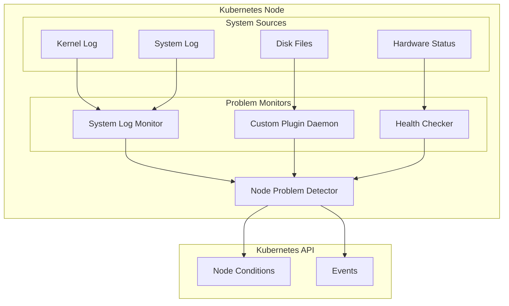
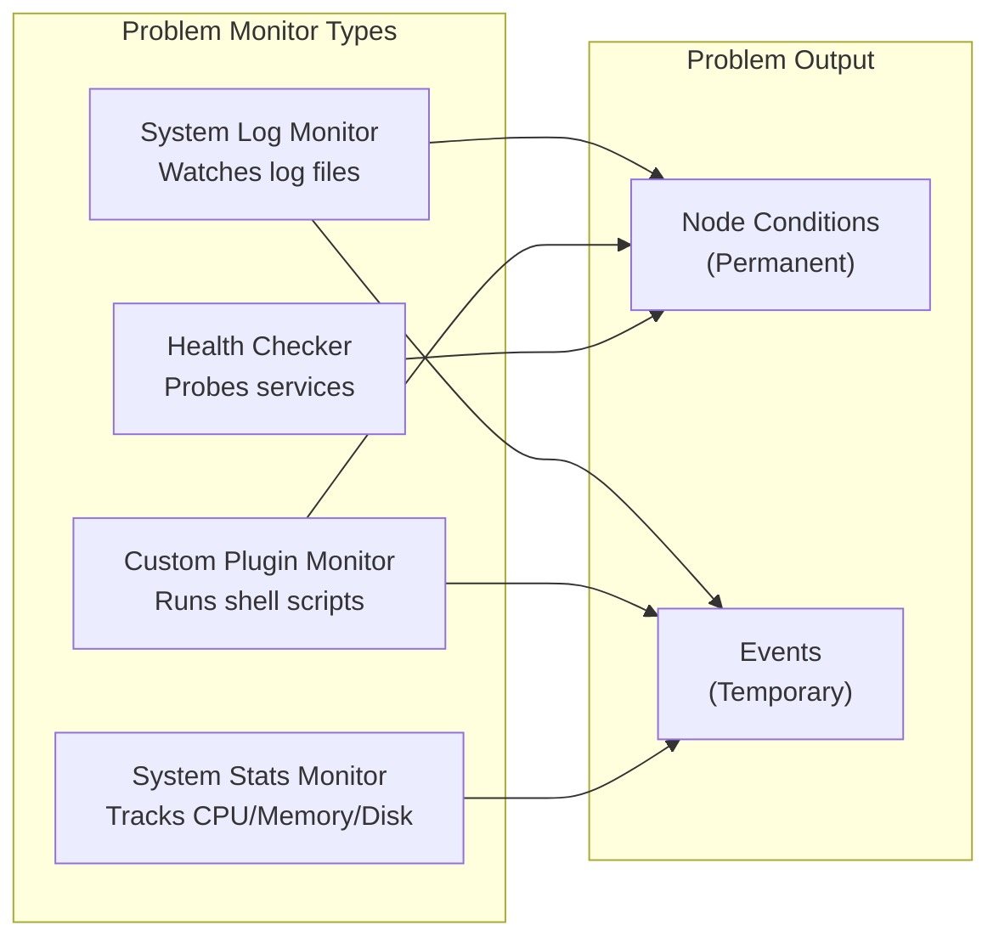
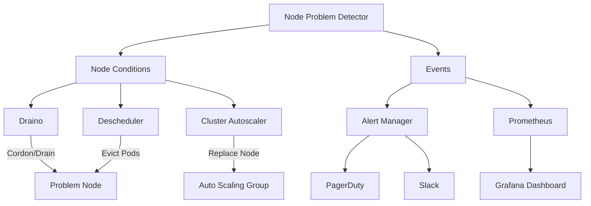

# How to Build Kubernetes Node Problem Detector

Author: [nawazdhandala](https://github.com/nawazdhandala)

Tags: Kubernetes, Node Problem Detector, Monitoring, Health Checks

Description: Learn to implement Node Problem Detector for detecting node issues with custom problem daemons, log monitors, and condition reporting.

---

Node health is critical in Kubernetes clusters. When nodes fail silently - whether from kernel panics, memory pressure, or disk issues - workloads suffer. Node Problem Detector (NPD) surfaces these problems before they cascade into application failures.

## What is Node Problem Detector?

Node Problem Detector is a DaemonSet that runs on every node in your cluster. It monitors system logs, runs custom checks, and reports problems as node conditions or events that Kubernetes and operators can act upon.



### Problem Types

| Type | Description | Example |
|------|-------------|---------|
| Temporary | One-time issues reported as events | OOM kills, task hung |
| Permanent | Ongoing conditions added to node status | Disk pressure, network down |

## Deploying Node Problem Detector

### Basic Deployment with Helm

```bash
# Add the NPD Helm repository
helm repo add deliveryhero https://charts.deliveryhero.io/
helm repo update

# Install Node Problem Detector
helm install node-problem-detector deliveryhero/node-problem-detector \
  --namespace kube-system \
  --set metrics.enabled=true \
  --set metrics.serviceMonitor.enabled=true
```

### Manual DaemonSet Deployment

Create the ConfigMap with default problem definitions:

```yaml
# npd-config.yaml
apiVersion: v1
kind: ConfigMap
metadata:
  name: node-problem-detector-config
  namespace: kube-system
data:
  kernel-monitor.json: |
    {
      "plugin": "kmsg",
      "logPath": "/dev/kmsg",
      "lookback": "5m",
      "bufferSize": 10,
      "source": "kernel-monitor",
      "conditions": [
        {
          "type": "KernelDeadlock",
          "reason": "KernelHasNoDeadlock",
          "message": "kernel has no deadlock"
        },
        {
          "type": "ReadonlyFilesystem",
          "reason": "FilesystemIsNotReadOnly",
          "message": "Filesystem is not read-only"
        }
      ],
      "rules": [
        {
          "type": "temporary",
          "reason": "OOMKilling",
          "pattern": "Killed process \\d+ (.+) total-vm:\\d+kB, anon-rss:\\d+kB, file-rss:\\d+kB.*"
        },
        {
          "type": "temporary",
          "reason": "TaskHung",
          "pattern": "task \\S+:\\w+ blocked for more than \\w+ seconds\\."
        },
        {
          "type": "temporary",
          "reason": "UnregisterNetDevice",
          "pattern": "unregister_netdevice: waiting for \\w+ to become free. Usage count = \\d+"
        },
        {
          "type": "permanent",
          "condition": "KernelDeadlock",
          "reason": "DockerHung",
          "pattern": "task docker:\\w+ blocked for more than \\w+ seconds\\."
        },
        {
          "type": "permanent",
          "condition": "ReadonlyFilesystem",
          "reason": "FilesystemIsReadOnly",
          "pattern": "Remounting filesystem read-only"
        }
      ]
    }
  docker-monitor.json: |
    {
      "plugin": "journald",
      "pluginConfig": {
        "source": "docker"
      },
      "logPath": "/var/log/journal",
      "lookback": "5m",
      "bufferSize": 10,
      "source": "docker-monitor",
      "conditions": [],
      "rules": [
        {
          "type": "temporary",
          "reason": "CorruptDockerImage",
          "pattern": "Error trying v2 registry: failed to register layer: rename /var/lib/docker/image/(.+) /var/lib/docker/image/(.+): directory not empty.*"
        }
      ]
    }
```

Deploy the DaemonSet:

```yaml
# npd-daemonset.yaml
apiVersion: apps/v1
kind: DaemonSet
metadata:
  name: node-problem-detector
  namespace: kube-system
  labels:
    app: node-problem-detector
spec:
  selector:
    matchLabels:
      app: node-problem-detector
  template:
    metadata:
      labels:
        app: node-problem-detector
    spec:
      serviceAccountName: node-problem-detector
      hostNetwork: true
      hostPID: true
      containers:
        - name: node-problem-detector
          image: registry.k8s.io/node-problem-detector/node-problem-detector:v0.8.19
          command:
            - /node-problem-detector
            - --logtostderr
            - --config.system-log-monitor=/config/kernel-monitor.json,/config/docker-monitor.json
            - --config.custom-plugin-monitor=/config/health-checker-kubelet.json
            - --config.system-stats-monitor=/config/system-stats-monitor.json
          securityContext:
            privileged: true
          env:
            - name: NODE_NAME
              valueFrom:
                fieldRef:
                  fieldPath: spec.nodeName
          volumeMounts:
            - name: log
              mountPath: /var/log
              readOnly: true
            - name: kmsg
              mountPath: /dev/kmsg
              readOnly: true
            - name: localtime
              mountPath: /etc/localtime
              readOnly: true
            - name: config
              mountPath: /config
              readOnly: true
          resources:
            limits:
              cpu: 100m
              memory: 100Mi
            requests:
              cpu: 20m
              memory: 40Mi
          ports:
            - containerPort: 20257
              name: exporter
      volumes:
        - name: log
          hostPath:
            path: /var/log/
        - name: kmsg
          hostPath:
            path: /dev/kmsg
        - name: localtime
          hostPath:
            path: /etc/localtime
        - name: config
          configMap:
            name: node-problem-detector-config
      tolerations:
        - operator: Exists
          effect: NoSchedule
        - operator: Exists
          effect: NoExecute
```

Create the ServiceAccount and RBAC:

```yaml
# npd-rbac.yaml
apiVersion: v1
kind: ServiceAccount
metadata:
  name: node-problem-detector
  namespace: kube-system
---
apiVersion: rbac.authorization.k8s.io/v1
kind: ClusterRole
metadata:
  name: node-problem-detector
rules:
  - apiGroups: [""]
    resources: ["nodes"]
    verbs: ["get"]
  - apiGroups: [""]
    resources: ["nodes/status"]
    verbs: ["patch"]
  - apiGroups: [""]
    resources: ["events"]
    verbs: ["create", "patch", "update"]
---
apiVersion: rbac.authorization.k8s.io/v1
kind: ClusterRoleBinding
metadata:
  name: node-problem-detector
roleRef:
  apiGroup: rbac.authorization.k8s.io
  kind: ClusterRole
  name: node-problem-detector
subjects:
  - kind: ServiceAccount
    name: node-problem-detector
    namespace: kube-system
```

Apply all manifests:

```bash
kubectl apply -f npd-rbac.yaml
kubectl apply -f npd-config.yaml
kubectl apply -f npd-daemonset.yaml
```

## Understanding Problem Monitors

Node Problem Detector supports multiple types of problem monitors. Each serves a specific purpose.



### System Log Monitor

The system log monitor watches log files for specific patterns. It supports multiple log formats:

| Plugin | Log Source | Use Case |
|--------|------------|----------|
| kmsg | /dev/kmsg | Kernel messages |
| journald | systemd journal | System services |
| filelog | Custom log files | Application logs |

Example kernel monitor configuration:

```json
{
  "plugin": "kmsg",
  "logPath": "/dev/kmsg",
  "lookback": "5m",
  "bufferSize": 10,
  "source": "kernel-monitor",
  "conditions": [
    {
      "type": "KernelDeadlock",
      "reason": "KernelHasNoDeadlock",
      "message": "kernel has no deadlock"
    }
  ],
  "rules": [
    {
      "type": "temporary",
      "reason": "OOMKilling",
      "pattern": "Killed process \\d+ (.+) total-vm:\\d+kB"
    },
    {
      "type": "permanent",
      "condition": "KernelDeadlock",
      "reason": "DockerHung",
      "pattern": "task docker:\\w+ blocked for more than \\w+ seconds\\."
    }
  ]
}
```

### Custom Plugin Monitor

Custom plugin monitors run external scripts or binaries to detect problems. This is the most flexible option for custom checks.

```json
{
  "plugin": "custom",
  "pluginConfig": {
    "invoke_interval": "30s",
    "timeout": "10s",
    "max_output_length": 80,
    "concurrency": 3
  },
  "source": "ntp-custom-plugin-monitor",
  "conditions": [
    {
      "type": "NTPProblem",
      "reason": "NTPIsUp",
      "message": "NTP service is running"
    }
  ],
  "rules": [
    {
      "type": "permanent",
      "condition": "NTPProblem",
      "reason": "NTPIsDown",
      "path": "/custom-plugins/check_ntp.sh",
      "message": "NTP service is not running"
    }
  ]
}
```

### Health Checker

Health checker monitors run continuous health checks against system services:

```json
{
  "plugin": "healthchecker",
  "pluginConfig": {
    "timeout": "10s"
  },
  "source": "health-checker",
  "conditions": [
    {
      "type": "KubeletUnhealthy",
      "reason": "KubeletIsHealthy",
      "message": "kubelet is running"
    },
    {
      "type": "ContainerRuntimeUnhealthy",
      "reason": "ContainerRuntimeIsHealthy",
      "message": "container runtime is running"
    }
  ],
  "rules": [
    {
      "type": "permanent",
      "condition": "KubeletUnhealthy",
      "reason": "KubeletUnhealthy",
      "path": "/health-checker/kubelet-health-checker.sh"
    },
    {
      "type": "permanent",
      "condition": "ContainerRuntimeUnhealthy",
      "reason": "ContainerRuntimeUnhealthy",
      "path": "/health-checker/container-runtime-health-checker.sh"
    }
  ]
}
```

## Building Custom Problem Detectors

### Custom Script-Based Detector

Create a script that returns specific exit codes and outputs:

```bash
#!/bin/bash
# check_disk_latency.sh - Check disk I/O latency

THRESHOLD_MS=100
DEVICE="/dev/sda"

# Measure disk latency using dd
LATENCY=$(dd if=$DEVICE of=/dev/null bs=4k count=100 iflag=direct 2>&1 | \
  grep -oP '\d+\.\d+ MB/s' | head -1 | grep -oP '\d+\.\d+')

if [ -z "$LATENCY" ]; then
  echo "Unable to measure disk latency"
  exit 1  # Unknown state
fi

# Convert MB/s to approximate latency (inverse relationship)
SPEED=$(echo "$LATENCY" | awk '{printf "%.0f", $1}')

if [ "$SPEED" -lt 10 ]; then
  echo "Disk latency is high: ${SPEED} MB/s throughput"
  exit 1  # Problem detected
fi

echo "Disk performance is normal: ${SPEED} MB/s throughput"
exit 0  # No problem
```

Exit codes for custom plugins:

| Exit Code | Meaning |
|-----------|---------|
| 0 | No problem detected |
| 1 | Problem detected |
| Other | Unknown/error state |

### Custom Monitor ConfigMap

```yaml
# custom-monitor-config.yaml
apiVersion: v1
kind: ConfigMap
metadata:
  name: node-problem-detector-custom-config
  namespace: kube-system
data:
  disk-latency-monitor.json: |
    {
      "plugin": "custom",
      "pluginConfig": {
        "invoke_interval": "60s",
        "timeout": "30s",
        "max_output_length": 256,
        "concurrency": 1
      },
      "source": "disk-latency-monitor",
      "conditions": [
        {
          "type": "DiskLatencyHigh",
          "reason": "DiskLatencyNormal",
          "message": "Disk latency is within normal range"
        }
      ],
      "rules": [
        {
          "type": "permanent",
          "condition": "DiskLatencyHigh",
          "reason": "DiskLatencyHigh",
          "path": "/custom-plugins/check_disk_latency.sh",
          "message": "Disk latency is above threshold"
        }
      ]
    }
  network-connectivity-monitor.json: |
    {
      "plugin": "custom",
      "pluginConfig": {
        "invoke_interval": "30s",
        "timeout": "15s",
        "max_output_length": 256,
        "concurrency": 2
      },
      "source": "network-connectivity-monitor",
      "conditions": [
        {
          "type": "NetworkUnavailable",
          "reason": "NetworkIsAvailable",
          "message": "Network connectivity is normal"
        }
      ],
      "rules": [
        {
          "type": "permanent",
          "condition": "NetworkUnavailable",
          "reason": "NetworkUnavailable",
          "path": "/custom-plugins/check_network.sh",
          "message": "Network connectivity check failed"
        }
      ]
    }
  check_disk_latency.sh: |
    #!/bin/bash
    THRESHOLD_IOPS=100

    # Get disk IOPS using iostat
    IOPS=$(iostat -dx 1 2 | grep -E "^sd|^nvme" | tail -1 | awk '{print $4}')

    if [ -z "$IOPS" ]; then
      echo "Unable to measure disk IOPS"
      exit 1
    fi

    IOPS_INT=$(printf "%.0f" "$IOPS")

    if [ "$IOPS_INT" -lt "$THRESHOLD_IOPS" ]; then
      echo "Disk IOPS low: ${IOPS_INT} read IOPS"
      exit 1
    fi

    echo "Disk IOPS normal: ${IOPS_INT} read IOPS"
    exit 0
  check_network.sh: |
    #!/bin/bash
    # Check connectivity to Kubernetes API server

    KUBE_API=${KUBERNETES_SERVICE_HOST:-"kubernetes.default.svc"}
    KUBE_PORT=${KUBERNETES_SERVICE_PORT:-443}

    # Try to connect to API server
    if timeout 5 bash -c "echo > /dev/tcp/${KUBE_API}/${KUBE_PORT}" 2>/dev/null; then
      echo "Network connectivity to Kubernetes API is normal"
      exit 0
    else
      echo "Cannot reach Kubernetes API server at ${KUBE_API}:${KUBE_PORT}"
      exit 1
    fi
```

### Advanced Custom Plugin: GPU Health Monitor

For nodes with GPUs, create a custom monitor:

```bash
#!/bin/bash
# check_gpu_health.sh - Monitor NVIDIA GPU health

# Check if nvidia-smi is available
if ! command -v nvidia-smi &> /dev/null; then
  echo "nvidia-smi not found, skipping GPU check"
  exit 0
fi

# Get GPU status
GPU_STATUS=$(nvidia-smi --query-gpu=gpu_name,temperature.gpu,utilization.gpu,memory.used,memory.total --format=csv,noheader,nounits 2>&1)

if [ $? -ne 0 ]; then
  echo "Failed to query GPU status: $GPU_STATUS"
  exit 1
fi

# Parse temperature
TEMP=$(echo "$GPU_STATUS" | cut -d',' -f2 | tr -d ' ')

# Check temperature threshold (85C is critical for most GPUs)
if [ "$TEMP" -gt 85 ]; then
  echo "GPU temperature critical: ${TEMP}C"
  exit 1
fi

# Check for ECC errors
ECC_ERRORS=$(nvidia-smi --query-gpu=ecc.errors.uncorrected.volatile.total --format=csv,noheader,nounits 2>/dev/null)

if [ -n "$ECC_ERRORS" ] && [ "$ECC_ERRORS" != "N/A" ] && [ "$ECC_ERRORS" -gt 0 ]; then
  echo "GPU ECC errors detected: $ECC_ERRORS uncorrected errors"
  exit 1
fi

echo "GPU health normal: ${TEMP}C, no ECC errors"
exit 0
```

GPU monitor configuration:

```json
{
  "plugin": "custom",
  "pluginConfig": {
    "invoke_interval": "60s",
    "timeout": "30s",
    "max_output_length": 256,
    "concurrency": 1
  },
  "source": "gpu-health-monitor",
  "conditions": [
    {
      "type": "GPUProblem",
      "reason": "GPUHealthy",
      "message": "GPU is healthy"
    }
  ],
  "rules": [
    {
      "type": "permanent",
      "condition": "GPUProblem",
      "reason": "GPUUnhealthy",
      "path": "/custom-plugins/check_gpu_health.sh",
      "message": "GPU health check failed"
    }
  ]
}
```

## System Stats Monitor

The system stats monitor collects performance metrics and reports issues when thresholds are exceeded:

```json
{
  "plugin": "systemstatsmonitor",
  "source": "system-stats-monitor",
  "invokeInterval": "60s",
  "disk": {
    "metricsConfigs": {
      "disk/io_time": {
        "displayName": "disk/io_time"
      },
      "disk/weighted_io": {
        "displayName": "disk/weighted_io"
      },
      "disk/avg_queue_len": {
        "displayName": "disk/avg_queue_len"
      }
    },
    "includeAllAttachedBlk": true,
    "lsblkTimeout": "5s"
  },
  "memory": {
    "metricsConfigs": {
      "memory/available": {
        "displayName": "memory/available"
      },
      "memory/dirty": {
        "displayName": "memory/dirty"
      }
    }
  },
  "cpu": {
    "metricsConfigs": {
      "cpu/runnable_task_count": {
        "displayName": "cpu/runnable_task_count"
      },
      "cpu/load_1m": {
        "displayName": "cpu/load_1m"
      },
      "cpu/load_5m": {
        "displayName": "cpu/load_5m"
      },
      "cpu/load_15m": {
        "displayName": "cpu/load_15m"
      }
    }
  }
}
```

## Viewing Node Conditions and Events

### Check Node Conditions

```bash
# View all node conditions
kubectl get nodes -o json | jq '.items[] | {name: .metadata.name, conditions: .status.conditions}'

# Filter for NPD-reported conditions
kubectl describe node <node-name> | grep -A 5 "Conditions:"

# Check specific condition
kubectl get node <node-name> -o jsonpath='{.status.conditions[?(@.type=="KernelDeadlock")]}'
```

### View Events

```bash
# Get all events from NPD
kubectl get events --field-selector source=node-problem-detector

# Get events for a specific node
kubectl get events --field-selector involvedObject.name=<node-name>,source=node-problem-detector

# Watch events in real-time
kubectl get events -w --field-selector source=node-problem-detector
```

### Sample Output

```bash
$ kubectl get nodes -o custom-columns=\
NAME:.metadata.name,\
KERNEL_DEADLOCK:.status.conditions[?(@.type==\"KernelDeadlock\")].status,\
DISK_PRESSURE:.status.conditions[?(@.type==\"DiskPressure\")].status,\
MEMORY_PRESSURE:.status.conditions[?(@.type==\"MemoryPressure\")].status

NAME           KERNEL_DEADLOCK   DISK_PRESSURE   MEMORY_PRESSURE
node-1         False             False           False
node-2         False             False           False
node-3         True              False           True
```

## Integrating with Remediation Systems



### Using Draino for Automatic Node Drain

Draino automatically drains nodes when specific conditions are detected:

```yaml
# draino-deployment.yaml
apiVersion: apps/v1
kind: Deployment
metadata:
  name: draino
  namespace: kube-system
spec:
  replicas: 1
  selector:
    matchLabels:
      app: draino
  template:
    metadata:
      labels:
        app: draino
    spec:
      serviceAccountName: draino
      containers:
        - name: draino
          image: planetlabs/draino:latest
          command:
            - /draino
            - --node-label-expr=node-role.kubernetes.io/worker
            - --evict-emptydir-pods
            - --evict-unreplicated-pods
            - --drain-buffer=10m
            - --skip-drain=false
            - KernelDeadlock=True
            - ReadonlyFilesystem=True
            - GPUProblem=True
          resources:
            limits:
              cpu: 100m
              memory: 128Mi
            requests:
              cpu: 50m
              memory: 64Mi
```

RBAC for Draino:

```yaml
apiVersion: v1
kind: ServiceAccount
metadata:
  name: draino
  namespace: kube-system
---
apiVersion: rbac.authorization.k8s.io/v1
kind: ClusterRole
metadata:
  name: draino
rules:
  - apiGroups: [""]
    resources: ["nodes"]
    verbs: ["get", "list", "watch", "update", "patch"]
  - apiGroups: [""]
    resources: ["pods"]
    verbs: ["get", "list", "watch"]
  - apiGroups: [""]
    resources: ["pods/eviction"]
    verbs: ["create"]
  - apiGroups: [""]
    resources: ["events"]
    verbs: ["create", "patch", "update"]
---
apiVersion: rbac.authorization.k8s.io/v1
kind: ClusterRoleBinding
metadata:
  name: draino
roleRef:
  apiGroup: rbac.authorization.k8s.io
  kind: ClusterRole
  name: draino
subjects:
  - kind: ServiceAccount
    name: draino
    namespace: kube-system
```

### Custom Remediation Controller

Build a custom controller that watches for node conditions and takes action:

```go
package main

import (
    "context"
    "fmt"
    "log"
    "time"

    corev1 "k8s.io/api/core/v1"
    metav1 "k8s.io/apimachinery/pkg/apis/meta/v1"
    "k8s.io/client-go/kubernetes"
    "k8s.io/client-go/rest"
)

type RemediationController struct {
    clientset *kubernetes.Clientset
    actions   map[string]RemediationAction
}

type RemediationAction struct {
    ConditionType   string
    ConditionStatus corev1.ConditionStatus
    Action          func(nodeName string) error
}

func NewRemediationController() (*RemediationController, error) {
    config, err := rest.InClusterConfig()
    if err != nil {
        return nil, err
    }

    clientset, err := kubernetes.NewForConfig(config)
    if err != nil {
        return nil, err
    }

    rc := &RemediationController{
        clientset: clientset,
        actions:   make(map[string]RemediationAction),
    }

    // Register default actions
    rc.RegisterAction(RemediationAction{
        ConditionType:   "KernelDeadlock",
        ConditionStatus: corev1.ConditionTrue,
        Action:          rc.cordonNode,
    })

    rc.RegisterAction(RemediationAction{
        ConditionType:   "ReadonlyFilesystem",
        ConditionStatus: corev1.ConditionTrue,
        Action:          rc.drainAndReboot,
    })

    return rc, nil
}

func (rc *RemediationController) RegisterAction(action RemediationAction) {
    key := fmt.Sprintf("%s-%s", action.ConditionType, action.ConditionStatus)
    rc.actions[key] = action
}

func (rc *RemediationController) Run(ctx context.Context) error {
    ticker := time.NewTicker(30 * time.Second)
    defer ticker.Stop()

    for {
        select {
        case <-ctx.Done():
            return ctx.Err()
        case <-ticker.C:
            if err := rc.reconcile(ctx); err != nil {
                log.Printf("Reconciliation error: %v", err)
            }
        }
    }
}

func (rc *RemediationController) reconcile(ctx context.Context) error {
    nodes, err := rc.clientset.CoreV1().Nodes().List(ctx, metav1.ListOptions{})
    if err != nil {
        return err
    }

    for _, node := range nodes.Items {
        for _, condition := range node.Status.Conditions {
            key := fmt.Sprintf("%s-%s", condition.Type, condition.Status)
            if action, exists := rc.actions[key]; exists {
                log.Printf("Taking action for node %s: condition %s is %s",
                    node.Name, condition.Type, condition.Status)
                if err := action.Action(node.Name); err != nil {
                    log.Printf("Action failed for node %s: %v", node.Name, err)
                }
            }
        }
    }

    return nil
}

func (rc *RemediationController) cordonNode(nodeName string) error {
    ctx := context.Background()
    node, err := rc.clientset.CoreV1().Nodes().Get(ctx, nodeName, metav1.GetOptions{})
    if err != nil {
        return err
    }

    if node.Spec.Unschedulable {
        return nil // Already cordoned
    }

    node.Spec.Unschedulable = true
    _, err = rc.clientset.CoreV1().Nodes().Update(ctx, node, metav1.UpdateOptions{})
    return err
}

func (rc *RemediationController) drainAndReboot(nodeName string) error {
    // First cordon the node
    if err := rc.cordonNode(nodeName); err != nil {
        return err
    }

    // Evict all pods (simplified - production code should handle PDBs)
    ctx := context.Background()
    pods, err := rc.clientset.CoreV1().Pods("").List(ctx, metav1.ListOptions{
        FieldSelector: fmt.Sprintf("spec.nodeName=%s", nodeName),
    })
    if err != nil {
        return err
    }

    for _, pod := range pods.Items {
        // Skip DaemonSet pods and mirror pods
        if isDaemonSetPod(&pod) || isMirrorPod(&pod) {
            continue
        }

        eviction := &policyv1.Eviction{
            ObjectMeta: metav1.ObjectMeta{
                Name:      pod.Name,
                Namespace: pod.Namespace,
            },
        }
        rc.clientset.PolicyV1().Evictions(pod.Namespace).Evict(ctx, eviction)
    }

    log.Printf("Node %s drained, reboot should be triggered externally", nodeName)
    return nil
}

func isDaemonSetPod(pod *corev1.Pod) bool {
    for _, owner := range pod.OwnerReferences {
        if owner.Kind == "DaemonSet" {
            return true
        }
    }
    return false
}

func isMirrorPod(pod *corev1.Pod) bool {
    _, exists := pod.Annotations["kubernetes.io/config.mirror"]
    return exists
}
```

### Prometheus Alerting Rules

Create alerts based on NPD-reported conditions:

```yaml
# prometheus-npd-alerts.yaml
apiVersion: monitoring.coreos.com/v1
kind: PrometheusRule
metadata:
  name: node-problem-detector-alerts
  namespace: monitoring
spec:
  groups:
    - name: node-problem-detector
      rules:
        - alert: NodeKernelDeadlock
          expr: |
            kube_node_status_condition{condition="KernelDeadlock",status="true"} == 1
          for: 5m
          labels:
            severity: critical
          annotations:
            summary: "Kernel deadlock detected on {{ $labels.node }}"
            description: "Node {{ $labels.node }} has been in KernelDeadlock condition for more than 5 minutes."

        - alert: NodeReadonlyFilesystem
          expr: |
            kube_node_status_condition{condition="ReadonlyFilesystem",status="true"} == 1
          for: 1m
          labels:
            severity: critical
          annotations:
            summary: "Filesystem is read-only on {{ $labels.node }}"
            description: "Node {{ $labels.node }} has a read-only filesystem."

        - alert: NodeContainerRuntimeUnhealthy
          expr: |
            kube_node_status_condition{condition="ContainerRuntimeUnhealthy",status="true"} == 1
          for: 5m
          labels:
            severity: warning
          annotations:
            summary: "Container runtime unhealthy on {{ $labels.node }}"
            description: "Node {{ $labels.node }} container runtime has been unhealthy for more than 5 minutes."

        - alert: NodeOOMKillsHigh
          expr: |
            increase(problem_counter{reason="OOMKilling"}[1h]) > 5
          for: 5m
          labels:
            severity: warning
          annotations:
            summary: "High OOM kills on {{ $labels.node }}"
            description: "Node {{ $labels.node }} has had {{ $value }} OOM kills in the last hour."

        - alert: NodeGPUProblem
          expr: |
            kube_node_status_condition{condition="GPUProblem",status="true"} == 1
          for: 5m
          labels:
            severity: critical
          annotations:
            summary: "GPU problem detected on {{ $labels.node }}"
            description: "Node {{ $labels.node }} has a GPU health problem."
```

### Grafana Dashboard

Create a dashboard to visualize node health:

```json
{
  "dashboard": {
    "title": "Node Problem Detector Dashboard",
    "panels": [
      {
        "title": "Nodes with Problems",
        "type": "stat",
        "targets": [
          {
            "expr": "count(kube_node_status_condition{condition=~\"KernelDeadlock|ReadonlyFilesystem|GPUProblem\",status=\"true\"} == 1)",
            "legendFormat": "Problem Nodes"
          }
        ]
      },
      {
        "title": "Problem Events Over Time",
        "type": "graph",
        "targets": [
          {
            "expr": "sum(increase(problem_counter[5m])) by (reason)",
            "legendFormat": "{{ reason }}"
          }
        ]
      },
      {
        "title": "Node Condition Status",
        "type": "table",
        "targets": [
          {
            "expr": "kube_node_status_condition{condition=~\"KernelDeadlock|ReadonlyFilesystem|ContainerRuntimeUnhealthy|GPUProblem\"}",
            "format": "table"
          }
        ]
      },
      {
        "title": "OOM Kills by Node",
        "type": "bargauge",
        "targets": [
          {
            "expr": "sum(increase(problem_counter{reason=\"OOMKilling\"}[24h])) by (node)",
            "legendFormat": "{{ node }}"
          }
        ]
      }
    ]
  }
}
```

## Complete Production Setup

### Full ConfigMap with All Monitors

```yaml
apiVersion: v1
kind: ConfigMap
metadata:
  name: node-problem-detector-config
  namespace: kube-system
data:
  kernel-monitor.json: |
    {
      "plugin": "kmsg",
      "logPath": "/dev/kmsg",
      "lookback": "5m",
      "bufferSize": 10,
      "source": "kernel-monitor",
      "conditions": [
        {
          "type": "KernelDeadlock",
          "reason": "KernelHasNoDeadlock",
          "message": "kernel has no deadlock"
        },
        {
          "type": "ReadonlyFilesystem",
          "reason": "FilesystemIsNotReadOnly",
          "message": "Filesystem is not read-only"
        }
      ],
      "rules": [
        {
          "type": "temporary",
          "reason": "OOMKilling",
          "pattern": "Killed process \\d+ (.+) total-vm:\\d+kB, anon-rss:\\d+kB, file-rss:\\d+kB.*"
        },
        {
          "type": "temporary",
          "reason": "TaskHung",
          "pattern": "task \\S+:\\w+ blocked for more than \\w+ seconds\\."
        },
        {
          "type": "temporary",
          "reason": "UnregisterNetDevice",
          "pattern": "unregister_netdevice: waiting for \\w+ to become free. Usage count = \\d+"
        },
        {
          "type": "temporary",
          "reason": "KernelOops",
          "pattern": "BUG: unable to handle kernel"
        },
        {
          "type": "temporary",
          "reason": "Ext4Error",
          "pattern": "EXT4-fs error.*"
        },
        {
          "type": "temporary",
          "reason": "Ext4Warning",
          "pattern": "EXT4-fs warning.*"
        },
        {
          "type": "temporary",
          "reason": "IOError",
          "pattern": "Buffer I/O error.*"
        },
        {
          "type": "permanent",
          "condition": "KernelDeadlock",
          "reason": "DockerHung",
          "pattern": "task docker:\\w+ blocked for more than \\w+ seconds\\."
        },
        {
          "type": "permanent",
          "condition": "KernelDeadlock",
          "reason": "ContainerdHung",
          "pattern": "task containerd:\\w+ blocked for more than \\w+ seconds\\."
        },
        {
          "type": "permanent",
          "condition": "ReadonlyFilesystem",
          "reason": "FilesystemIsReadOnly",
          "pattern": "Remounting filesystem read-only"
        }
      ]
    }
  docker-monitor.json: |
    {
      "plugin": "journald",
      "pluginConfig": {
        "source": "docker"
      },
      "logPath": "/var/log/journal",
      "lookback": "5m",
      "bufferSize": 10,
      "source": "docker-monitor",
      "conditions": [],
      "rules": [
        {
          "type": "temporary",
          "reason": "CorruptDockerImage",
          "pattern": "Error trying v2 registry: failed to register layer: rename /var/lib/docker/image/(.+): directory not empty.*"
        },
        {
          "type": "temporary",
          "reason": "CorruptDockerOverlay2",
          "pattern": "returned error: driver \"overlay2\" failed to remove root filesystem.*"
        }
      ]
    }
  containerd-monitor.json: |
    {
      "plugin": "journald",
      "pluginConfig": {
        "source": "containerd"
      },
      "logPath": "/var/log/journal",
      "lookback": "5m",
      "bufferSize": 10,
      "source": "containerd-monitor",
      "conditions": [],
      "rules": [
        {
          "type": "temporary",
          "reason": "ContainerdRuntimeError",
          "pattern": "runtime error:.*"
        }
      ]
    }
  kubelet-monitor.json: |
    {
      "plugin": "journald",
      "pluginConfig": {
        "source": "kubelet"
      },
      "logPath": "/var/log/journal",
      "lookback": "5m",
      "bufferSize": 10,
      "source": "kubelet-monitor",
      "conditions": [],
      "rules": [
        {
          "type": "temporary",
          "reason": "KubeletStart",
          "pattern": "Starting kubelet.*"
        },
        {
          "type": "temporary",
          "reason": "PLEGUnhealthy",
          "pattern": "PLEG is not healthy:.*"
        },
        {
          "type": "temporary",
          "reason": "NodeAllocatableEnforced",
          "pattern": "node allocatable.*"
        }
      ]
    }
  health-checker-kubelet.json: |
    {
      "plugin": "healthchecker",
      "pluginConfig": {
        "timeout": "10s"
      },
      "source": "kubelet-health-checker",
      "conditions": [
        {
          "type": "KubeletUnhealthy",
          "reason": "KubeletIsHealthy",
          "message": "kubelet on the node is healthy"
        }
      ],
      "rules": [
        {
          "type": "permanent",
          "condition": "KubeletUnhealthy",
          "reason": "KubeletUnhealthy",
          "path": "/home/kubernetes/bin/health-checker",
          "args": ["--component=kubelet", "--enable-repair=false"],
          "timeout": "10s"
        }
      ]
    }
  health-checker-containerd.json: |
    {
      "plugin": "healthchecker",
      "pluginConfig": {
        "timeout": "10s"
      },
      "source": "containerd-health-checker",
      "conditions": [
        {
          "type": "ContainerRuntimeUnhealthy",
          "reason": "ContainerRuntimeIsHealthy",
          "message": "container runtime on the node is healthy"
        }
      ],
      "rules": [
        {
          "type": "permanent",
          "condition": "ContainerRuntimeUnhealthy",
          "reason": "ContainerdUnhealthy",
          "path": "/home/kubernetes/bin/health-checker",
          "args": ["--component=containerd", "--enable-repair=false"],
          "timeout": "10s"
        }
      ]
    }
  system-stats-monitor.json: |
    {
      "plugin": "systemstatsmonitor",
      "source": "system-stats-monitor",
      "invokeInterval": "60s",
      "disk": {
        "metricsConfigs": {
          "disk/io_time": { "displayName": "disk/io_time" },
          "disk/weighted_io": { "displayName": "disk/weighted_io" },
          "disk/avg_queue_len": { "displayName": "disk/avg_queue_len" }
        },
        "includeAllAttachedBlk": true
      },
      "memory": {
        "metricsConfigs": {
          "memory/available": { "displayName": "memory/available" },
          "memory/bytes_used": { "displayName": "memory/bytes_used" },
          "memory/dirty": { "displayName": "memory/dirty" }
        }
      },
      "cpu": {
        "metricsConfigs": {
          "cpu/load_1m": { "displayName": "cpu/load_1m" },
          "cpu/load_5m": { "displayName": "cpu/load_5m" },
          "cpu/load_15m": { "displayName": "cpu/load_15m" },
          "cpu/runnable_task_count": { "displayName": "cpu/runnable_task_count" }
        }
      }
    }
```

### Production DaemonSet with Metrics

```yaml
apiVersion: apps/v1
kind: DaemonSet
metadata:
  name: node-problem-detector
  namespace: kube-system
  labels:
    app.kubernetes.io/name: node-problem-detector
    app.kubernetes.io/component: monitoring
spec:
  selector:
    matchLabels:
      app.kubernetes.io/name: node-problem-detector
  updateStrategy:
    type: RollingUpdate
    rollingUpdate:
      maxUnavailable: 1
  template:
    metadata:
      labels:
        app.kubernetes.io/name: node-problem-detector
      annotations:
        prometheus.io/scrape: "true"
        prometheus.io/port: "20257"
    spec:
      serviceAccountName: node-problem-detector
      hostNetwork: true
      hostPID: true
      priorityClassName: system-node-critical
      containers:
        - name: node-problem-detector
          image: registry.k8s.io/node-problem-detector/node-problem-detector:v0.8.19
          command:
            - /node-problem-detector
            - --logtostderr
            - --config.system-log-monitor=/config/kernel-monitor.json,/config/docker-monitor.json,/config/containerd-monitor.json,/config/kubelet-monitor.json
            - --config.custom-plugin-monitor=/config/health-checker-kubelet.json,/config/health-checker-containerd.json
            - --config.system-stats-monitor=/config/system-stats-monitor.json
            - --prometheus-address=0.0.0.0
            - --prometheus-port=20257
          securityContext:
            privileged: true
          env:
            - name: NODE_NAME
              valueFrom:
                fieldRef:
                  fieldPath: spec.nodeName
          volumeMounts:
            - name: log
              mountPath: /var/log
              readOnly: true
            - name: kmsg
              mountPath: /dev/kmsg
              readOnly: true
            - name: localtime
              mountPath: /etc/localtime
              readOnly: true
            - name: config
              mountPath: /config
              readOnly: true
            - name: machine-id
              mountPath: /etc/machine-id
              readOnly: true
            - name: systemd
              mountPath: /run/systemd/system
              readOnly: true
          resources:
            limits:
              cpu: 200m
              memory: 200Mi
            requests:
              cpu: 20m
              memory: 40Mi
          ports:
            - containerPort: 20257
              name: metrics
              protocol: TCP
          livenessProbe:
            httpGet:
              path: /healthz
              port: 20257
            initialDelaySeconds: 10
            periodSeconds: 10
          readinessProbe:
            httpGet:
              path: /healthz
              port: 20257
            initialDelaySeconds: 5
            periodSeconds: 5
      volumes:
        - name: log
          hostPath:
            path: /var/log/
        - name: kmsg
          hostPath:
            path: /dev/kmsg
        - name: localtime
          hostPath:
            path: /etc/localtime
        - name: config
          configMap:
            name: node-problem-detector-config
        - name: machine-id
          hostPath:
            path: /etc/machine-id
            type: File
        - name: systemd
          hostPath:
            path: /run/systemd/system
            type: DirectoryOrCreate
      tolerations:
        - operator: Exists
          effect: NoSchedule
        - operator: Exists
          effect: NoExecute
        - key: CriticalAddonsOnly
          operator: Exists
```

## Best Practices

### Monitor Configuration

1. **Tune lookback periods** - Set appropriate lookback times based on check frequency
2. **Use appropriate buffer sizes** - Larger buffers for high-volume logs
3. **Set reasonable timeouts** - Prevent health checks from blocking
4. **Limit concurrency** - Avoid overwhelming nodes with parallel checks

### Custom Plugins

1. **Keep scripts fast** - Timeout if execution takes too long
2. **Handle edge cases** - Missing binaries, permissions, network issues
3. **Use meaningful exit codes** - 0 for healthy, 1 for problems
4. **Output useful messages** - Include relevant metrics in output

### Remediation

1. **Start with alerting** - Understand failure patterns before automating
2. **Use gradual escalation** - Cordon before drain, drain before terminate
3. **Respect PodDisruptionBudgets** - Do not disrupt critical workloads
4. **Log all actions** - Maintain audit trail for troubleshooting

### Resource Management

1. **Set resource limits** - Prevent NPD from consuming node resources
2. **Use priorityClass** - Ensure NPD runs even under resource pressure
3. **Monitor NPD itself** - Alert if NPD pods are unhealthy

---

Node Problem Detector bridges the gap between node-level issues and Kubernetes awareness. By combining built-in monitors with custom plugins and integrating with remediation systems, you can build a self-healing cluster that automatically responds to infrastructure problems. Start with the default monitors, add custom checks for your specific environment, and gradually automate remediation as you understand your failure patterns.
