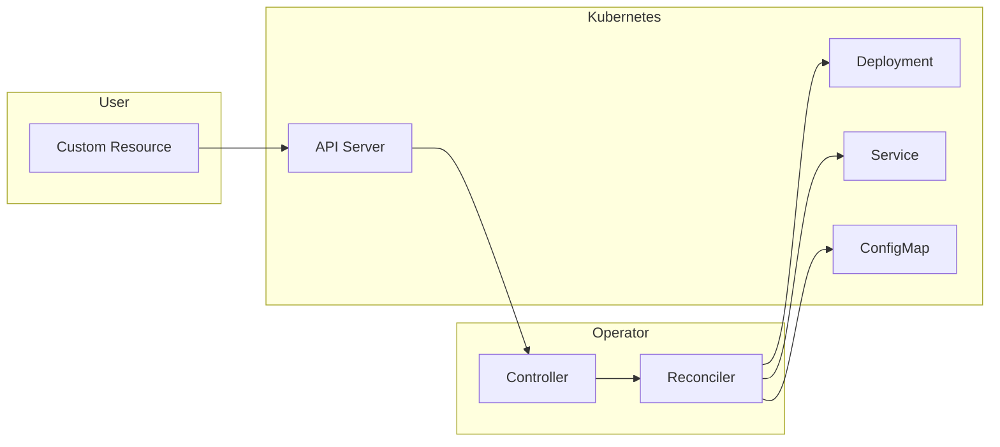

# How to Build Kubernetes Operator with Operator SDK

Author: [nawazdhandala](https://github.com/nawazdhandala)

Tags: Kubernetes, Operators, Operator SDK, Go

Description: Create Kubernetes operators using Operator SDK to automate complex application lifecycle management with custom resources and controllers.

---

Kubernetes operators encode human operational knowledge into software. They watch your custom resources and automatically take action to keep your application running the way you intended. The Operator SDK provides the tools to build, test, and package operators without dealing with low-level Kubernetes API complexity.

## What is an Operator?

An operator combines custom resource definitions (CRDs) with controllers that watch and reconcile those resources. When you create, update, or delete a custom resource, the operator responds by creating or modifying Kubernetes objects like Deployments, Services, or ConfigMaps.



### Operator Pattern Components

| Component | Purpose |
|-----------|---------|
| Custom Resource Definition (CRD) | Extends Kubernetes API with your custom types |
| Custom Resource (CR) | Instance of your CRD representing desired state |
| Controller | Watches resources and triggers reconciliation |
| Reconciler | Contains the logic to move from current to desired state |
| Finalizer | Handles cleanup when resources are deleted |

## Installing Operator SDK

The Operator SDK CLI helps you scaffold, build, and test operators. Install it on your development machine first.

### Install on macOS

```bash
# Install using Homebrew
brew install operator-sdk

# Verify installation
operator-sdk version
```

### Install on Linux

```bash
# Download the binary for your architecture
export ARCH=$(case $(uname -m) in x86_64) echo -n amd64 ;; aarch64) echo -n arm64 ;; *) echo -n $(uname -m) ;; esac)
export OS=$(uname | awk '{print tolower($0)}')
export OPERATOR_SDK_DL_URL=https://github.com/operator-framework/operator-sdk/releases/download/v1.34.1

curl -LO ${OPERATOR_SDK_DL_URL}/operator-sdk_${OS}_${ARCH}

# Make it executable and move to PATH
chmod +x operator-sdk_${OS}_${ARCH}
sudo mv operator-sdk_${OS}_${ARCH} /usr/local/bin/operator-sdk

# Verify installation
operator-sdk version
```

### Prerequisites

Before building operators, you need these tools installed:

| Tool | Version | Purpose |
|------|---------|---------|
| Go | 1.21+ | Programming language for the operator |
| Docker | 20.10+ | Building and pushing container images |
| kubectl | 1.28+ | Interacting with Kubernetes clusters |
| kind or minikube | Latest | Local Kubernetes cluster for testing |

Verify your Go installation:

```bash
# Check Go version
go version

# Ensure GOPATH is set
echo $GOPATH
```

## Creating a New Operator Project

The Operator SDK scaffolds a complete project structure with all the boilerplate code you need.

### Initialize the Project

Create a new directory and initialize the operator project with Go as the plugin type:

```bash
# Create project directory
mkdir memcached-operator && cd memcached-operator

# Initialize the project
# - domain: your organization's domain (used in API groups)
# - repo: Go module path for your project
operator-sdk init --domain example.com --repo github.com/example/memcached-operator
```

This creates the following project structure:

```
memcached-operator/
├── Dockerfile              # Multi-stage Dockerfile for the operator
├── Makefile               # Build, test, and deploy targets
├── PROJECT                # Project metadata
├── config/                # Kubernetes manifests
│   ├── default/          # Kustomize base configuration
│   ├── manager/          # Operator deployment
│   ├── rbac/             # RBAC rules
│   └── samples/          # Example CRs
├── go.mod                 # Go module definition
├── go.sum                 # Dependency checksums
├── cmd/
│   └── main.go           # Operator entrypoint
└── internal/
    └── controller/       # Controller implementations
```

### Understanding the Generated Files

The Makefile contains useful targets for development:

```bash
# View available make targets
make help

# Common targets:
# make manifests    - Generate CRD and RBAC manifests
# make generate     - Generate code (DeepCopy functions)
# make build        - Build the operator binary
# make run          - Run the operator locally
# make docker-build - Build the container image
# make install      - Install CRDs into cluster
# make deploy       - Deploy operator to cluster
```

## Creating an API and Controller

Use the Operator SDK to create a custom resource definition and its controller together.

### Scaffold the API

Create a Memcached API that will represent a Memcached cluster deployment:

```bash
# Create API with CRD and controller
# - group: API group name
# - version: API version (v1alpha1 for unstable, v1 for stable)
# - kind: resource type name
operator-sdk create api --group cache --version v1alpha1 --kind Memcached --resource --controller
```

This generates:

- `api/v1alpha1/memcached_types.go` - The custom resource type definition
- `internal/controller/memcached_controller.go` - The controller implementation

### Define the Custom Resource

Edit the API types file to define your custom resource specification and status.

The Spec describes the desired state, while Status reflects the observed state:

```go
// api/v1alpha1/memcached_types.go
package v1alpha1

import (
    metav1 "k8s.io/apimachinery/pkg/apis/meta/v1"
)

// MemcachedSpec defines the desired state of Memcached
type MemcachedSpec struct {
    // Size defines the number of Memcached instances to deploy
    // +kubebuilder:validation:Minimum=1
    // +kubebuilder:validation:Maximum=5
    // +kubebuilder:default=1
    Size int32 `json:"size"`

    // ContainerPort specifies the port for Memcached containers
    // +kubebuilder:validation:Minimum=1024
    // +kubebuilder:validation:Maximum=65535
    // +kubebuilder:default=11211
    ContainerPort int32 `json:"containerPort,omitempty"`

    // Image specifies the Memcached container image
    // +kubebuilder:default="memcached:1.6-alpine"
    Image string `json:"image,omitempty"`

    // Resources defines CPU and memory limits
    Resources ResourceSpec `json:"resources,omitempty"`
}

// ResourceSpec defines compute resource requirements
type ResourceSpec struct {
    // CPULimit specifies the CPU limit (e.g., "500m")
    // +kubebuilder:default="500m"
    CPULimit string `json:"cpuLimit,omitempty"`

    // MemoryLimit specifies the memory limit (e.g., "128Mi")
    // +kubebuilder:default="128Mi"
    MemoryLimit string `json:"memoryLimit,omitempty"`
}

// MemcachedStatus defines the observed state of Memcached
type MemcachedStatus struct {
    // Nodes contains the names of the Memcached pods
    Nodes []string `json:"nodes,omitempty"`

    // ReadyReplicas is the number of pods in ready state
    ReadyReplicas int32 `json:"readyReplicas,omitempty"`

    // Conditions represent the latest available observations
    Conditions []metav1.Condition `json:"conditions,omitempty"`
}

// +kubebuilder:object:root=true
// +kubebuilder:subresource:status
// +kubebuilder:printcolumn:name="Size",type="integer",JSONPath=".spec.size"
// +kubebuilder:printcolumn:name="Ready",type="integer",JSONPath=".status.readyReplicas"
// +kubebuilder:printcolumn:name="Age",type="date",JSONPath=".metadata.creationTimestamp"

// Memcached is the Schema for the memcacheds API
type Memcached struct {
    metav1.TypeMeta   `json:",inline"`
    metav1.ObjectMeta `json:"metadata,omitempty"`

    Spec   MemcachedSpec   `json:"spec,omitempty"`
    Status MemcachedStatus `json:"status,omitempty"`
}

// +kubebuilder:object:root=true

// MemcachedList contains a list of Memcached
type MemcachedList struct {
    metav1.TypeMeta `json:",inline"`
    metav1.ListMeta `json:"metadata,omitempty"`
    Items           []Memcached `json:"items"`
}

func init() {
    SchemeBuilder.Register(&Memcached{}, &MemcachedList{})
}
```

### Understanding Kubebuilder Markers

The comments starting with `+kubebuilder` are markers that control code generation:

| Marker | Purpose |
|--------|---------|
| `+kubebuilder:validation:Minimum` | Sets minimum value for numeric fields |
| `+kubebuilder:validation:Maximum` | Sets maximum value for numeric fields |
| `+kubebuilder:default` | Sets default value when field is omitted |
| `+kubebuilder:object:root=true` | Marks type as a root object (has its own API endpoint) |
| `+kubebuilder:subresource:status` | Creates a /status subresource |
| `+kubebuilder:printcolumn` | Adds columns to kubectl get output |

Generate the CRD manifests and Go code after modifying types:

```bash
# Generate CRD manifests in config/crd/bases/
make manifests

# Generate DeepCopy functions
make generate
```

## Implementing the Reconciler

The reconciler contains the core logic that runs whenever your custom resource changes.

### Reconciliation Loop

The Reconcile function is called whenever something changes. It compares the desired state (from the CR spec) with the actual state (resources in the cluster) and takes action to align them:

```go
// internal/controller/memcached_controller.go
package controller

import (
    "context"
    "fmt"
    "reflect"
    "time"

    appsv1 "k8s.io/api/apps/v1"
    corev1 "k8s.io/api/core/v1"
    "k8s.io/apimachinery/pkg/api/errors"
    "k8s.io/apimachinery/pkg/api/meta"
    "k8s.io/apimachinery/pkg/api/resource"
    metav1 "k8s.io/apimachinery/pkg/apis/meta/v1"
    "k8s.io/apimachinery/pkg/runtime"
    "k8s.io/apimachinery/pkg/types"
    ctrl "sigs.k8s.io/controller-runtime"
    "sigs.k8s.io/controller-runtime/pkg/client"
    "sigs.k8s.io/controller-runtime/pkg/controller/controllerutil"
    "sigs.k8s.io/controller-runtime/pkg/log"

    cachev1alpha1 "github.com/example/memcached-operator/api/v1alpha1"
)

const (
    memcachedFinalizer = "cache.example.com/finalizer"
    typeAvailable      = "Available"
    typeDegraded       = "Degraded"
)

// MemcachedReconciler reconciles a Memcached object
type MemcachedReconciler struct {
    client.Client
    Scheme *runtime.Scheme
}

// RBAC markers generate ClusterRole rules in config/rbac/role.yaml
// +kubebuilder:rbac:groups=cache.example.com,resources=memcacheds,verbs=get;list;watch;create;update;patch;delete
// +kubebuilder:rbac:groups=cache.example.com,resources=memcacheds/status,verbs=get;update;patch
// +kubebuilder:rbac:groups=cache.example.com,resources=memcacheds/finalizers,verbs=update
// +kubebuilder:rbac:groups=apps,resources=deployments,verbs=get;list;watch;create;update;patch;delete
// +kubebuilder:rbac:groups=core,resources=pods,verbs=get;list;watch

func (r *MemcachedReconciler) Reconcile(ctx context.Context, req ctrl.Request) (ctrl.Result, error) {
    logger := log.FromContext(ctx)

    // Fetch the Memcached instance
    memcached := &cachev1alpha1.Memcached{}
    err := r.Get(ctx, req.NamespacedName, memcached)
    if err != nil {
        if errors.IsNotFound(err) {
            // Custom resource was deleted, nothing to do
            logger.Info("Memcached resource not found, likely deleted")
            return ctrl.Result{}, nil
        }
        logger.Error(err, "Failed to get Memcached")
        return ctrl.Result{}, err
    }

    // Set initial status condition
    if memcached.Status.Conditions == nil || len(memcached.Status.Conditions) == 0 {
        meta.SetStatusCondition(&memcached.Status.Conditions, metav1.Condition{
            Type:    typeAvailable,
            Status:  metav1.ConditionUnknown,
            Reason:  "Reconciling",
            Message: "Starting reconciliation",
        })
        if err := r.Status().Update(ctx, memcached); err != nil {
            logger.Error(err, "Failed to update Memcached status")
            return ctrl.Result{}, err
        }
        // Re-fetch after status update
        if err := r.Get(ctx, req.NamespacedName, memcached); err != nil {
            logger.Error(err, "Failed to re-fetch Memcached")
            return ctrl.Result{}, err
        }
    }

    // Add finalizer if not present
    if !controllerutil.ContainsFinalizer(memcached, memcachedFinalizer) {
        logger.Info("Adding finalizer for Memcached")
        if ok := controllerutil.AddFinalizer(memcached, memcachedFinalizer); !ok {
            logger.Info("Finalizer already present")
            return ctrl.Result{Requeue: true}, nil
        }
        if err := r.Update(ctx, memcached); err != nil {
            logger.Error(err, "Failed to add finalizer")
            return ctrl.Result{}, err
        }
    }

    // Handle deletion
    if !memcached.DeletionTimestamp.IsZero() {
        return r.handleDeletion(ctx, memcached)
    }

    // Reconcile the Deployment
    result, err := r.reconcileDeployment(ctx, memcached)
    if err != nil {
        return result, err
    }

    // Update status
    return r.updateStatus(ctx, memcached)
}
```

### Creating the Deployment

The reconciler creates and manages a Deployment based on the Memcached spec:

```go
func (r *MemcachedReconciler) reconcileDeployment(ctx context.Context, memcached *cachev1alpha1.Memcached) (ctrl.Result, error) {
    logger := log.FromContext(ctx)

    // Check if Deployment already exists
    deployment := &appsv1.Deployment{}
    err := r.Get(ctx, types.NamespacedName{Name: memcached.Name, Namespace: memcached.Namespace}, deployment)

    if err != nil && errors.IsNotFound(err) {
        // Create new Deployment
        dep, err := r.deploymentForMemcached(memcached)
        if err != nil {
            logger.Error(err, "Failed to define Deployment for Memcached")
            return ctrl.Result{}, err
        }

        logger.Info("Creating Deployment", "Deployment.Namespace", dep.Namespace, "Deployment.Name", dep.Name)
        if err := r.Create(ctx, dep); err != nil {
            logger.Error(err, "Failed to create Deployment")
            return ctrl.Result{}, err
        }

        // Deployment created, requeue to check status
        return ctrl.Result{RequeueAfter: time.Second * 10}, nil
    } else if err != nil {
        logger.Error(err, "Failed to get Deployment")
        return ctrl.Result{}, err
    }

    // Ensure the deployment spec matches the desired state
    size := memcached.Spec.Size
    if *deployment.Spec.Replicas != size {
        deployment.Spec.Replicas = &size
        logger.Info("Updating Deployment replicas", "from", *deployment.Spec.Replicas, "to", size)
        if err := r.Update(ctx, deployment); err != nil {
            logger.Error(err, "Failed to update Deployment")
            return ctrl.Result{}, err
        }
        return ctrl.Result{RequeueAfter: time.Second * 10}, nil
    }

    // Check if image changed
    currentImage := deployment.Spec.Template.Spec.Containers[0].Image
    desiredImage := memcached.Spec.Image
    if desiredImage == "" {
        desiredImage = "memcached:1.6-alpine"
    }
    if currentImage != desiredImage {
        deployment.Spec.Template.Spec.Containers[0].Image = desiredImage
        logger.Info("Updating Deployment image", "from", currentImage, "to", desiredImage)
        if err := r.Update(ctx, deployment); err != nil {
            logger.Error(err, "Failed to update Deployment image")
            return ctrl.Result{}, err
        }
        return ctrl.Result{RequeueAfter: time.Second * 10}, nil
    }

    return ctrl.Result{}, nil
}

// deploymentForMemcached creates a Deployment specification
func (r *MemcachedReconciler) deploymentForMemcached(m *cachev1alpha1.Memcached) (*appsv1.Deployment, error) {
    labels := labelsForMemcached(m.Name)
    replicas := m.Spec.Size

    // Set default image if not specified
    image := m.Spec.Image
    if image == "" {
        image = "memcached:1.6-alpine"
    }

    // Set default port if not specified
    port := m.Spec.ContainerPort
    if port == 0 {
        port = 11211
    }

    // Set default resources if not specified
    cpuLimit := m.Spec.Resources.CPULimit
    if cpuLimit == "" {
        cpuLimit = "500m"
    }
    memoryLimit := m.Spec.Resources.MemoryLimit
    if memoryLimit == "" {
        memoryLimit = "128Mi"
    }

    dep := &appsv1.Deployment{
        ObjectMeta: metav1.ObjectMeta{
            Name:      m.Name,
            Namespace: m.Namespace,
            Labels:    labels,
        },
        Spec: appsv1.DeploymentSpec{
            Replicas: &replicas,
            Selector: &metav1.LabelSelector{
                MatchLabels: labels,
            },
            Template: corev1.PodTemplateSpec{
                ObjectMeta: metav1.ObjectMeta{
                    Labels: labels,
                },
                Spec: corev1.PodSpec{
                    SecurityContext: &corev1.PodSecurityContext{
                        RunAsNonRoot: boolPtr(true),
                        SeccompProfile: &corev1.SeccompProfile{
                            Type: corev1.SeccompProfileTypeRuntimeDefault,
                        },
                    },
                    Containers: []corev1.Container{{
                        Name:  "memcached",
                        Image: image,
                        Ports: []corev1.ContainerPort{{
                            ContainerPort: port,
                            Name:          "memcached",
                            Protocol:      corev1.ProtocolTCP,
                        }},
                        Command: []string{
                            "memcached",
                            "-m=64",
                            "-o", "modern",
                            "-v",
                        },
                        Resources: corev1.ResourceRequirements{
                            Limits: corev1.ResourceList{
                                corev1.ResourceCPU:    resource.MustParse(cpuLimit),
                                corev1.ResourceMemory: resource.MustParse(memoryLimit),
                            },
                            Requests: corev1.ResourceList{
                                corev1.ResourceCPU:    resource.MustParse("100m"),
                                corev1.ResourceMemory: resource.MustParse("64Mi"),
                            },
                        },
                        SecurityContext: &corev1.SecurityContext{
                            AllowPrivilegeEscalation: boolPtr(false),
                            Capabilities: &corev1.Capabilities{
                                Drop: []corev1.Capability{"ALL"},
                            },
                        },
                        LivenessProbe: &corev1.Probe{
                            ProbeHandler: corev1.ProbeHandler{
                                TCPSocket: &corev1.TCPSocketAction{
                                    Port: intstr.FromInt(int(port)),
                                },
                            },
                            InitialDelaySeconds: 15,
                            PeriodSeconds:       20,
                        },
                        ReadinessProbe: &corev1.Probe{
                            ProbeHandler: corev1.ProbeHandler{
                                TCPSocket: &corev1.TCPSocketAction{
                                    Port: intstr.FromInt(int(port)),
                                },
                            },
                            InitialDelaySeconds: 5,
                            PeriodSeconds:       10,
                        },
                    }},
                },
            },
        },
    }

    // Set Memcached instance as the owner of the Deployment
    // This enables garbage collection when the CR is deleted
    if err := ctrl.SetControllerReference(m, dep, r.Scheme); err != nil {
        return nil, err
    }

    return dep, nil
}

// Helper to create bool pointer
func boolPtr(b bool) *bool {
    return &b
}

// Import intstr for probe ports
import "k8s.io/apimachinery/pkg/util/intstr"
```

### Handling Deletion with Finalizers

Finalizers ensure cleanup happens before the resource is deleted:

```go
func (r *MemcachedReconciler) handleDeletion(ctx context.Context, memcached *cachev1alpha1.Memcached) (ctrl.Result, error) {
    logger := log.FromContext(ctx)

    if controllerutil.ContainsFinalizer(memcached, memcachedFinalizer) {
        logger.Info("Running finalizer for Memcached")

        // Perform any external cleanup here
        // For example: delete external resources, notify other systems, etc.

        // Set degraded condition
        meta.SetStatusCondition(&memcached.Status.Conditions, metav1.Condition{
            Type:    typeDegraded,
            Status:  metav1.ConditionTrue,
            Reason:  "Deleting",
            Message: "Performing cleanup before deletion",
        })
        if err := r.Status().Update(ctx, memcached); err != nil {
            logger.Error(err, "Failed to update status during deletion")
            return ctrl.Result{}, err
        }

        // Remove the finalizer
        logger.Info("Removing finalizer from Memcached")
        if ok := controllerutil.RemoveFinalizer(memcached, memcachedFinalizer); !ok {
            logger.Info("Finalizer not found")
            return ctrl.Result{Requeue: true}, nil
        }
        if err := r.Update(ctx, memcached); err != nil {
            logger.Error(err, "Failed to remove finalizer")
            return ctrl.Result{}, err
        }
    }

    return ctrl.Result{}, nil
}
```

### Updating Status

Keep the status subresource updated to reflect the actual state:

```go
func (r *MemcachedReconciler) updateStatus(ctx context.Context, memcached *cachev1alpha1.Memcached) (ctrl.Result, error) {
    logger := log.FromContext(ctx)

    // Get the list of pods managed by this Memcached
    podList := &corev1.PodList{}
    listOpts := []client.ListOption{
        client.InNamespace(memcached.Namespace),
        client.MatchingLabels(labelsForMemcached(memcached.Name)),
    }
    if err := r.List(ctx, podList, listOpts...); err != nil {
        logger.Error(err, "Failed to list pods")
        return ctrl.Result{}, err
    }

    // Get pod names and count ready pods
    podNames := []string{}
    readyCount := int32(0)
    for _, pod := range podList.Items {
        podNames = append(podNames, pod.Name)
        for _, condition := range pod.Status.Conditions {
            if condition.Type == corev1.PodReady && condition.Status == corev1.ConditionTrue {
                readyCount++
                break
            }
        }
    }

    // Update status if changed
    if !reflect.DeepEqual(podNames, memcached.Status.Nodes) || memcached.Status.ReadyReplicas != readyCount {
        memcached.Status.Nodes = podNames
        memcached.Status.ReadyReplicas = readyCount

        // Update condition based on ready replicas
        if readyCount == memcached.Spec.Size {
            meta.SetStatusCondition(&memcached.Status.Conditions, metav1.Condition{
                Type:    typeAvailable,
                Status:  metav1.ConditionTrue,
                Reason:  "AllReplicasReady",
                Message: fmt.Sprintf("All %d replicas are ready", readyCount),
            })
        } else {
            meta.SetStatusCondition(&memcached.Status.Conditions, metav1.Condition{
                Type:    typeAvailable,
                Status:  metav1.ConditionFalse,
                Reason:  "ReplicasNotReady",
                Message: fmt.Sprintf("%d of %d replicas ready", readyCount, memcached.Spec.Size),
            })
        }

        if err := r.Status().Update(ctx, memcached); err != nil {
            logger.Error(err, "Failed to update Memcached status")
            return ctrl.Result{}, err
        }
    }

    return ctrl.Result{RequeueAfter: time.Minute}, nil
}

func labelsForMemcached(name string) map[string]string {
    return map[string]string{
        "app.kubernetes.io/name":       "Memcached",
        "app.kubernetes.io/instance":   name,
        "app.kubernetes.io/managed-by": "memcached-operator",
    }
}

// SetupWithManager registers the controller with the manager
func (r *MemcachedReconciler) SetupWithManager(mgr ctrl.Manager) error {
    return ctrl.NewControllerManagedBy(mgr).
        For(&cachev1alpha1.Memcached{}).
        Owns(&appsv1.Deployment{}).
        Complete(r)
}
```

## Testing Your Operator

Operator SDK supports multiple testing approaches.

### Unit Tests with Envtest

Envtest spins up a local control plane for integration testing:

```go
// internal/controller/memcached_controller_test.go
package controller

import (
    "context"
    "time"

    . "github.com/onsi/ginkgo/v2"
    . "github.com/onsi/gomega"
    appsv1 "k8s.io/api/apps/v1"
    corev1 "k8s.io/api/core/v1"
    metav1 "k8s.io/apimachinery/pkg/apis/meta/v1"
    "k8s.io/apimachinery/pkg/types"

    cachev1alpha1 "github.com/example/memcached-operator/api/v1alpha1"
)

var _ = Describe("Memcached Controller", func() {
    const (
        MemcachedName      = "test-memcached"
        MemcachedNamespace = "default"
        timeout            = time.Second * 30
        interval           = time.Millisecond * 250
    )

    Context("When creating a Memcached CR", func() {
        It("Should create a Deployment with correct replicas", func() {
            ctx := context.Background()

            // Create a new Memcached CR
            memcached := &cachev1alpha1.Memcached{
                ObjectMeta: metav1.ObjectMeta{
                    Name:      MemcachedName,
                    Namespace: MemcachedNamespace,
                },
                Spec: cachev1alpha1.MemcachedSpec{
                    Size:          3,
                    ContainerPort: 11211,
                    Image:         "memcached:1.6-alpine",
                },
            }
            Expect(k8sClient.Create(ctx, memcached)).Should(Succeed())

            // Verify Deployment is created
            deploymentKey := types.NamespacedName{Name: MemcachedName, Namespace: MemcachedNamespace}
            createdDeployment := &appsv1.Deployment{}

            Eventually(func() bool {
                err := k8sClient.Get(ctx, deploymentKey, createdDeployment)
                return err == nil
            }, timeout, interval).Should(BeTrue())

            // Verify replicas
            Expect(*createdDeployment.Spec.Replicas).Should(Equal(int32(3)))

            // Verify image
            Expect(createdDeployment.Spec.Template.Spec.Containers[0].Image).Should(Equal("memcached:1.6-alpine"))

            // Cleanup
            Expect(k8sClient.Delete(ctx, memcached)).Should(Succeed())
        })
    })

    Context("When updating a Memcached CR", func() {
        It("Should update the Deployment replicas", func() {
            ctx := context.Background()

            // Create Memcached
            memcached := &cachev1alpha1.Memcached{
                ObjectMeta: metav1.ObjectMeta{
                    Name:      "update-test",
                    Namespace: MemcachedNamespace,
                },
                Spec: cachev1alpha1.MemcachedSpec{
                    Size: 2,
                },
            }
            Expect(k8sClient.Create(ctx, memcached)).Should(Succeed())

            // Wait for Deployment
            deploymentKey := types.NamespacedName{Name: "update-test", Namespace: MemcachedNamespace}
            deployment := &appsv1.Deployment{}
            Eventually(func() bool {
                err := k8sClient.Get(ctx, deploymentKey, deployment)
                return err == nil
            }, timeout, interval).Should(BeTrue())

            // Update size
            memcachedKey := types.NamespacedName{Name: "update-test", Namespace: MemcachedNamespace}
            Eventually(func() error {
                err := k8sClient.Get(ctx, memcachedKey, memcached)
                if err != nil {
                    return err
                }
                memcached.Spec.Size = 4
                return k8sClient.Update(ctx, memcached)
            }, timeout, interval).Should(Succeed())

            // Verify Deployment updated
            Eventually(func() int32 {
                k8sClient.Get(ctx, deploymentKey, deployment)
                return *deployment.Spec.Replicas
            }, timeout, interval).Should(Equal(int32(4)))

            // Cleanup
            Expect(k8sClient.Delete(ctx, memcached)).Should(Succeed())
        })
    })
})
```

### Test Suite Setup

Create the test suite configuration:

```go
// internal/controller/suite_test.go
package controller

import (
    "context"
    "path/filepath"
    "testing"

    . "github.com/onsi/ginkgo/v2"
    . "github.com/onsi/gomega"
    "k8s.io/client-go/kubernetes/scheme"
    "k8s.io/client-go/rest"
    ctrl "sigs.k8s.io/controller-runtime"
    "sigs.k8s.io/controller-runtime/pkg/client"
    "sigs.k8s.io/controller-runtime/pkg/envtest"
    logf "sigs.k8s.io/controller-runtime/pkg/log"
    "sigs.k8s.io/controller-runtime/pkg/log/zap"

    cachev1alpha1 "github.com/example/memcached-operator/api/v1alpha1"
)

var cfg *rest.Config
var k8sClient client.Client
var testEnv *envtest.Environment
var ctx context.Context
var cancel context.CancelFunc

func TestControllers(t *testing.T) {
    RegisterFailHandler(Fail)
    RunSpecs(t, "Controller Suite")
}

var _ = BeforeSuite(func() {
    logf.SetLogger(zap.New(zap.WriteTo(GinkgoWriter), zap.UseDevMode(true)))

    ctx, cancel = context.WithCancel(context.TODO())

    By("bootstrapping test environment")
    testEnv = &envtest.Environment{
        CRDDirectoryPaths:     []string{filepath.Join("..", "..", "config", "crd", "bases")},
        ErrorIfCRDPathMissing: true,
    }

    var err error
    cfg, err = testEnv.Start()
    Expect(err).NotTo(HaveOccurred())
    Expect(cfg).NotTo(BeNil())

    err = cachev1alpha1.AddToScheme(scheme.Scheme)
    Expect(err).NotTo(HaveOccurred())

    k8sClient, err = client.New(cfg, client.Options{Scheme: scheme.Scheme})
    Expect(err).NotTo(HaveOccurred())
    Expect(k8sClient).NotTo(BeNil())

    // Start the controller
    k8sManager, err := ctrl.NewManager(cfg, ctrl.Options{
        Scheme: scheme.Scheme,
    })
    Expect(err).ToNot(HaveOccurred())

    err = (&MemcachedReconciler{
        Client: k8sManager.GetClient(),
        Scheme: k8sManager.GetScheme(),
    }).SetupWithManager(k8sManager)
    Expect(err).ToNot(HaveOccurred())

    go func() {
        defer GinkgoRecover()
        err = k8sManager.Start(ctx)
        Expect(err).ToNot(HaveOccurred())
    }()
})

var _ = AfterSuite(func() {
    cancel()
    By("tearing down the test environment")
    err := testEnv.Stop()
    Expect(err).NotTo(HaveOccurred())
})
```

Run the tests:

```bash
# Run all tests
make test

# Run with verbose output
go test -v ./internal/controller/...

# Run specific test
go test -v ./internal/controller/... -ginkgo.focus="When creating"
```

## Operator Lifecycle Manager (OLM)

OLM manages operator installation, upgrades, and RBAC in a cluster.

### Generate OLM Bundle

Create the OLM bundle manifests:

```bash
# Generate bundle manifests
make bundle IMG=docker.io/example/memcached-operator:v0.0.1

# This creates:
# - bundle/manifests/           - ClusterServiceVersion, CRDs
# - bundle/metadata/            - Annotations for catalog
# - bundle/tests/scorecard/     - Scorecard test configuration
```

### ClusterServiceVersion

The CSV describes your operator for OLM:

```yaml
# bundle/manifests/memcached-operator.clusterserviceversion.yaml
apiVersion: operators.coreos.com/v1alpha1
kind: ClusterServiceVersion
metadata:
  name: memcached-operator.v0.0.1
  namespace: placeholder
  annotations:
    capabilities: Basic Install
    categories: Database
    description: Manages Memcached clusters on Kubernetes
    containerImage: docker.io/example/memcached-operator:v0.0.1
    repository: https://github.com/example/memcached-operator
spec:
  displayName: Memcached Operator
  description: |
    ## About this Operator
    The Memcached Operator automates the deployment and management of Memcached clusters.

    ## Features
    - Deploy Memcached clusters with a single custom resource
    - Scale clusters up and down automatically
    - Monitor cluster health with built-in status conditions

    ## Getting Started
    Create a Memcached resource to deploy a cluster:

    ```yaml
    apiVersion: cache.example.com/v1alpha1
    kind: Memcached
    metadata:
      name: example-memcached
    spec:
      size: 3
    ```
  maturity: alpha
  version: 0.0.1
  replaces: ""
  minKubeVersion: "1.25.0"
  keywords:
    - memcached
    - cache
    - database
  maintainers:
    - name: Example Inc
      email: support@example.com
  provider:
    name: Example Inc
  links:
    - name: Documentation
      url: https://example.com/docs
    - name: Source Code
      url: https://github.com/example/memcached-operator
  icon:
    - base64data: ""
      mediatype: image/png
  installModes:
    - type: OwnNamespace
      supported: true
    - type: SingleNamespace
      supported: true
    - type: MultiNamespace
      supported: false
    - type: AllNamespaces
      supported: true
  install:
    strategy: deployment
    spec:
      deployments:
        - name: memcached-operator-controller-manager
          spec:
            replicas: 1
            selector:
              matchLabels:
                control-plane: controller-manager
            template:
              metadata:
                labels:
                  control-plane: controller-manager
              spec:
                containers:
                  - name: manager
                    image: docker.io/example/memcached-operator:v0.0.1
                    command:
                      - /manager
                    resources:
                      limits:
                        cpu: 500m
                        memory: 128Mi
                      requests:
                        cpu: 10m
                        memory: 64Mi
      permissions:
        - serviceAccountName: memcached-operator-controller-manager
          rules:
            - apiGroups: [""]
              resources: ["configmaps"]
              verbs: ["get", "list", "watch", "create", "update", "patch", "delete"]
  customresourcedefinitions:
    owned:
      - name: memcacheds.cache.example.com
        version: v1alpha1
        kind: Memcached
        displayName: Memcached
        description: Represents a Memcached cluster
        resources:
          - kind: Deployment
            version: v1
          - kind: Service
            version: v1
        specDescriptors:
          - path: size
            displayName: Size
            description: Number of Memcached instances
            x-descriptors:
              - urn:alm:descriptor:com.tectonic.ui:podCount
        statusDescriptors:
          - path: nodes
            displayName: Nodes
            description: Names of the Memcached pods
            x-descriptors:
              - urn:alm:descriptor:com.tectonic.ui:podStatuses
```

### Build and Push Bundle

```bash
# Build the bundle image
make bundle-build BUNDLE_IMG=docker.io/example/memcached-operator-bundle:v0.0.1

# Push the bundle image
make bundle-push BUNDLE_IMG=docker.io/example/memcached-operator-bundle:v0.0.1

# Validate the bundle
operator-sdk bundle validate ./bundle
```

### Install with OLM

```bash
# Install OLM in the cluster (if not already installed)
operator-sdk olm install

# Run the operator using OLM
operator-sdk run bundle docker.io/example/memcached-operator-bundle:v0.0.1

# Check the operator installation
kubectl get csv -n operators
kubectl get pods -n operators

# Cleanup
operator-sdk cleanup memcached-operator
```

## Building and Deploying

### Build the Operator Image

```bash
# Build the manager binary
make build

# Build and push the container image
make docker-build docker-push IMG=docker.io/example/memcached-operator:v0.0.1
```

### Deploy Without OLM

Deploy directly using Kustomize:

```bash
# Install CRDs
make install

# Deploy the operator
make deploy IMG=docker.io/example/memcached-operator:v0.0.1

# Verify deployment
kubectl get deployment -n memcached-operator-system
kubectl get pods -n memcached-operator-system

# Check operator logs
kubectl logs -f deployment/memcached-operator-controller-manager -n memcached-operator-system
```

### Create a Sample CR

```bash
# Create a Memcached instance
kubectl apply -f - <<EOF
apiVersion: cache.example.com/v1alpha1
kind: Memcached
metadata:
  name: memcached-sample
  namespace: default
spec:
  size: 3
  containerPort: 11211
  image: memcached:1.6-alpine
  resources:
    cpuLimit: "500m"
    memoryLimit: "128Mi"
EOF

# Watch the resources
kubectl get memcached -w
kubectl get deployment -w
kubectl get pods -w

# Check status
kubectl describe memcached memcached-sample
```

## Operator Best Practices

### Idempotency

Your reconciler should be idempotent. Running it multiple times should produce the same result:

```go
// Good: Check before creating
deployment := &appsv1.Deployment{}
err := r.Get(ctx, types.NamespacedName{Name: name, Namespace: namespace}, deployment)
if errors.IsNotFound(err) {
    // Create only if not found
    return r.Create(ctx, newDeployment)
}

// Bad: Always create without checking
return r.Create(ctx, newDeployment) // Will fail if exists
```

### Error Handling

Return errors appropriately to trigger requeue:

| Scenario | Return Value |
|----------|--------------|
| Transient error (network, API server) | `ctrl.Result{}, err` |
| Resource not found (deleted) | `ctrl.Result{}, nil` |
| Waiting for external resource | `ctrl.Result{RequeueAfter: time.Minute}, nil` |
| Successfully reconciled | `ctrl.Result{}, nil` |

### Resource Ownership

Always set owner references to enable garbage collection:

```go
// Set the CR as owner of the Deployment
if err := ctrl.SetControllerReference(memcached, deployment, r.Scheme); err != nil {
    return err
}
```

### Status Updates

Update status separately from spec changes:

```go
// Update status using the status subresource
if err := r.Status().Update(ctx, memcached); err != nil {
    return ctrl.Result{}, err
}
```

### Watch Related Resources

Configure the controller to watch owned resources:

```go
func (r *MemcachedReconciler) SetupWithManager(mgr ctrl.Manager) error {
    return ctrl.NewControllerManagedBy(mgr).
        For(&cachev1alpha1.Memcached{}).     // Watch CR
        Owns(&appsv1.Deployment{}).           // Watch owned Deployments
        Owns(&corev1.Service{}).              // Watch owned Services
        Complete(r)
}
```

## Debugging Operators

### Local Development

Run the operator locally against a remote cluster:

```bash
# Install CRDs
make install

# Run locally (uses your kubeconfig)
make run

# In another terminal, create resources and watch logs
```

### Debugging in Cluster

Check operator logs and events:

```bash
# Get operator logs
kubectl logs -f deployment/memcached-operator-controller-manager \
  -n memcached-operator-system \
  -c manager

# Get events for a CR
kubectl describe memcached memcached-sample

# Get events in namespace
kubectl get events --sort-by='.lastTimestamp'
```

### Common Issues

| Issue | Cause | Solution |
|-------|-------|----------|
| CRD not found | CRDs not installed | Run `make install` |
| Permission denied | Missing RBAC rules | Add rules to controller and run `make manifests` |
| Reconcile not triggered | Controller not watching resource | Check `SetupWithManager` configuration |
| Status not updating | Using wrong update method | Use `r.Status().Update()` for status |

---

Operator SDK simplifies building Kubernetes operators by generating boilerplate code and providing testing utilities. Start with a simple operator that manages one resource type, add validation webhooks when you need input validation, and package with OLM for production distribution. The patterns shown here apply to operators of any complexity, from simple deployment managers to full database operators.
