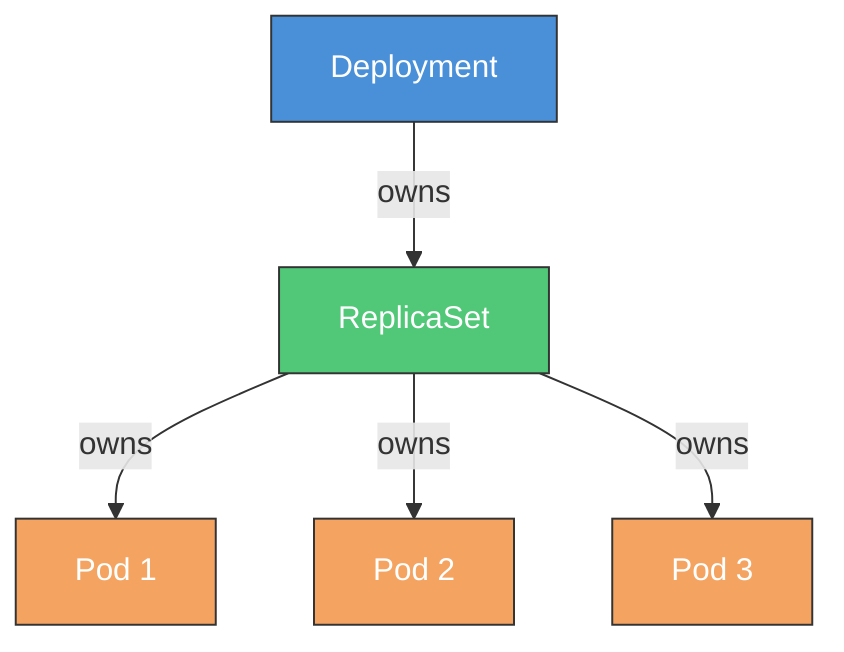
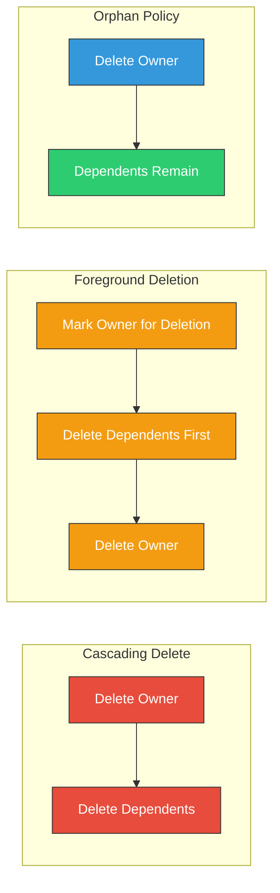
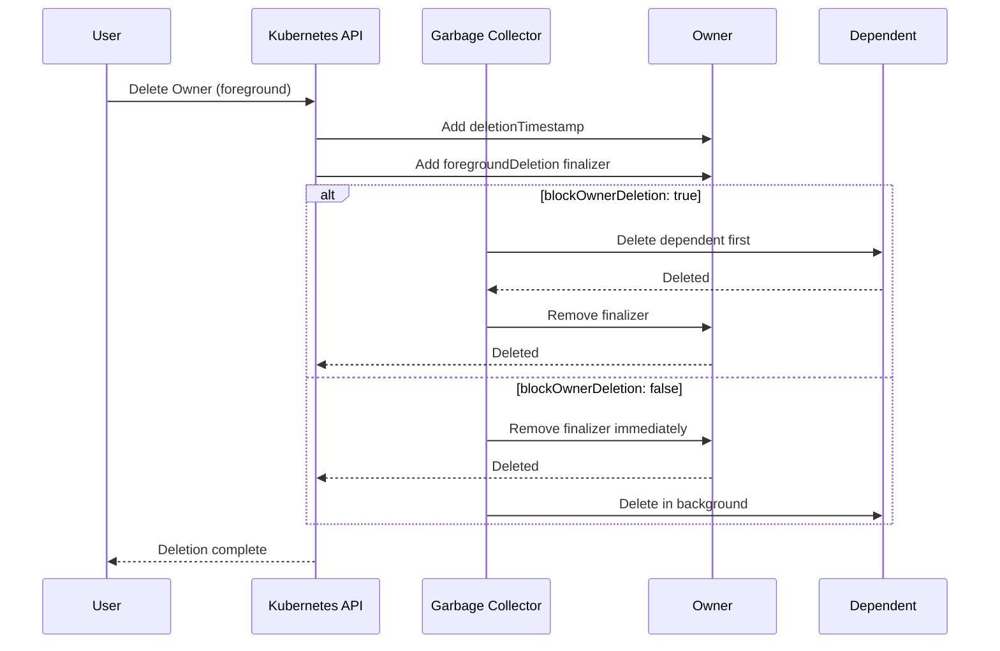
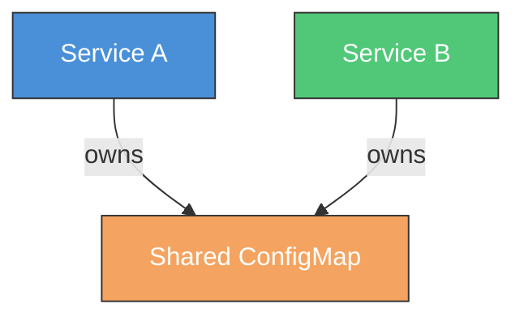

# How to Create Kubernetes Owner References

Author: [nawazdhandala](https://github.com/nawazdhandala)

Tags: Kubernetes, Owner References, Garbage Collection, Resource Management

Description: Learn to implement owner references for automatic garbage collection with cascading delete, foreground deletion, and orphan strategies.

---

## Introduction

Owner references in Kubernetes establish parent-child relationships between resources. When you delete a parent resource, Kubernetes automatically handles the cleanup of dependent child resources through its garbage collection mechanism. This feature is essential for maintaining a clean cluster and preventing orphaned resources from consuming unnecessary resources.

In this guide, we will explore how to create and manage owner references, understand different deletion strategies, and implement practical examples for your Kubernetes applications.

## Understanding Owner References

Owner references define a dependency relationship where one resource (the owner) controls the lifecycle of another resource (the dependent). This relationship is stored in the dependent resource's metadata.



When you delete the Deployment, Kubernetes automatically deletes the ReplicaSet and all Pods associated with it.

## Owner Reference Structure

An owner reference consists of several fields that identify the owning resource:

```yaml
ownerReferences:
  - apiVersion: apps/v1
    kind: Deployment
    name: my-deployment
    uid: d9607e19-f88f-11e6-a518-42010a800195
    controller: true
    blockOwnerDeletion: true
```

### Field Descriptions

| Field | Description |
|-------|-------------|
| `apiVersion` | API version of the owner resource |
| `kind` | Kind of the owner resource |
| `name` | Name of the owner resource |
| `uid` | Unique identifier of the owner resource |
| `controller` | Indicates if this is the managing controller |
| `blockOwnerDeletion` | Prevents owner deletion until dependent is removed |

## Creating Owner References Programmatically

### Using kubectl and YAML

Here is an example of creating a ConfigMap owned by a Deployment:

```yaml
apiVersion: v1
kind: ConfigMap
metadata:
  name: my-config
  namespace: default
  ownerReferences:
    - apiVersion: apps/v1
      kind: Deployment
      name: my-deployment
      uid: ""  # Must be set to actual UID
      controller: true
      blockOwnerDeletion: true
data:
  config.yaml: |
    key: value
```

To get the UID of the owner resource:

```bash
kubectl get deployment my-deployment -o jsonpath='{.metadata.uid}'
```

### Using Go Client

Here is a complete example using the Kubernetes Go client:

```go
package main

import (
    "context"
    "fmt"

    corev1 "k8s.io/api/core/v1"
    metav1 "k8s.io/apimachinery/pkg/apis/meta/v1"
    "k8s.io/client-go/kubernetes"
    "k8s.io/client-go/tools/clientcmd"
)

func main() {
    // Load kubeconfig
    config, err := clientcmd.BuildConfigFromFlags("",
        clientcmd.RecommendedHomeFile)
    if err != nil {
        panic(err)
    }

    // Create clientset
    clientset, err := kubernetes.NewForConfig(config)
    if err != nil {
        panic(err)
    }

    ctx := context.Background()

    // Get the owner deployment
    deployment, err := clientset.AppsV1().Deployments("default").
        Get(ctx, "my-deployment", metav1.GetOptions{})
    if err != nil {
        panic(err)
    }

    // Create owner reference
    ownerRef := metav1.OwnerReference{
        APIVersion:         "apps/v1",
        Kind:               "Deployment",
        Name:               deployment.Name,
        UID:                deployment.UID,
        Controller:         boolPtr(true),
        BlockOwnerDeletion: boolPtr(true),
    }

    // Create ConfigMap with owner reference
    configMap := &corev1.ConfigMap{
        ObjectMeta: metav1.ObjectMeta{
            Name:            "my-config",
            Namespace:       "default",
            OwnerReferences: []metav1.OwnerReference{ownerRef},
        },
        Data: map[string]string{
            "config.yaml": "key: value",
        },
    }

    // Create the ConfigMap
    created, err := clientset.CoreV1().ConfigMaps("default").
        Create(ctx, configMap, metav1.CreateOptions{})
    if err != nil {
        panic(err)
    }

    fmt.Printf("Created ConfigMap %s with owner reference\n", created.Name)
}

func boolPtr(b bool) *bool {
    return &b
}
```

### Using Python Client

```python
from kubernetes import client, config

# Load kubeconfig
config.load_kube_config()

# Create API clients
apps_v1 = client.AppsV1Api()
core_v1 = client.CoreV1Api()

# Get the owner deployment
deployment = apps_v1.read_namespaced_deployment(
    name="my-deployment",
    namespace="default"
)

# Create owner reference
owner_reference = client.V1OwnerReference(
    api_version="apps/v1",
    kind="Deployment",
    name=deployment.metadata.name,
    uid=deployment.metadata.uid,
    controller=True,
    block_owner_deletion=True
)

# Create ConfigMap with owner reference
config_map = client.V1ConfigMap(
    metadata=client.V1ObjectMeta(
        name="my-config",
        namespace="default",
        owner_references=[owner_reference]
    ),
    data={"config.yaml": "key: value"}
)

# Create the ConfigMap
created = core_v1.create_namespaced_config_map(
    namespace="default",
    body=config_map
)

print(f"Created ConfigMap {created.metadata.name} with owner reference")
```

## Deletion Strategies

Kubernetes provides three deletion propagation policies that control how dependent resources are handled when deleting an owner.



### 1. Background Deletion (Default)

The owner is deleted immediately, and the garbage collector deletes dependents in the background.

```bash
kubectl delete deployment my-deployment --cascade=background
```

Or using the API:

```go
deletePolicy := metav1.DeletePropagationBackground
clientset.AppsV1().Deployments("default").Delete(
    ctx,
    "my-deployment",
    metav1.DeleteOptions{
        PropagationPolicy: &deletePolicy,
    },
)
```

### 2. Foreground Deletion

The owner enters a "deletion in progress" state. The garbage collector deletes all dependents first, then deletes the owner.

```bash
kubectl delete deployment my-deployment --cascade=foreground
```

Using the Go client:

```go
deletePolicy := metav1.DeletePropagationForeground
clientset.AppsV1().Deployments("default").Delete(
    ctx,
    "my-deployment",
    metav1.DeleteOptions{
        PropagationPolicy: &deletePolicy,
    },
)
```

During foreground deletion, the owner resource:
- Has `metadata.deletionTimestamp` set
- Has `foregroundDeletion` finalizer added
- Remains visible via the API until all blocking dependents are deleted

### 3. Orphan Policy

The owner is deleted, but dependents are not deleted. The owner references are removed from dependents.

```bash
kubectl delete deployment my-deployment --cascade=orphan
```

Using the Go client:

```go
deletePolicy := metav1.DeletePropagationOrphan
clientset.AppsV1().Deployments("default").Delete(
    ctx,
    "my-deployment",
    metav1.DeleteOptions{
        PropagationPolicy: &deletePolicy,
    },
)
```

## The blockOwnerDeletion Field

The `blockOwnerDeletion` field controls whether a dependent resource blocks the deletion of its owner during foreground deletion.



### Example: Non-blocking Dependent

```yaml
ownerReferences:
  - apiVersion: apps/v1
    kind: Deployment
    name: my-deployment
    uid: d9607e19-f88f-11e6-a518-42010a800195
    controller: true
    blockOwnerDeletion: false  # Owner can be deleted before this resource
```

## Practical Example: Custom Resource with Dependents

Here is a complete example of a custom controller that creates resources with proper owner references:

```go
package controller

import (
    "context"

    appsv1 "k8s.io/api/apps/v1"
    corev1 "k8s.io/api/core/v1"
    metav1 "k8s.io/apimachinery/pkg/apis/meta/v1"
    "k8s.io/apimachinery/pkg/runtime"
    ctrl "sigs.k8s.io/controller-runtime"
    "sigs.k8s.io/controller-runtime/pkg/client"
    "sigs.k8s.io/controller-runtime/pkg/controller/controllerutil"
)

type MyAppReconciler struct {
    client.Client
    Scheme *runtime.Scheme
}

func (r *MyAppReconciler) Reconcile(ctx context.Context,
    req ctrl.Request) (ctrl.Result, error) {

    // Fetch the MyApp instance
    myApp := &MyAppv1.MyApp{}
    if err := r.Get(ctx, req.NamespacedName, myApp); err != nil {
        return ctrl.Result{}, client.IgnoreNotFound(err)
    }

    // Create a ConfigMap for the application
    configMap := &corev1.ConfigMap{
        ObjectMeta: metav1.ObjectMeta{
            Name:      myApp.Name + "-config",
            Namespace: myApp.Namespace,
        },
        Data: map[string]string{
            "app.conf": "setting=value",
        },
    }

    // Set owner reference using controller-runtime helper
    if err := controllerutil.SetControllerReference(
        myApp, configMap, r.Scheme); err != nil {
        return ctrl.Result{}, err
    }

    // Create or update the ConfigMap
    if err := r.Create(ctx, configMap); err != nil {
        return ctrl.Result{}, err
    }

    // Create a Deployment for the application
    deployment := &appsv1.Deployment{
        ObjectMeta: metav1.ObjectMeta{
            Name:      myApp.Name,
            Namespace: myApp.Namespace,
        },
        Spec: appsv1.DeploymentSpec{
            Replicas: int32Ptr(1),
            Selector: &metav1.LabelSelector{
                MatchLabels: map[string]string{"app": myApp.Name},
            },
            Template: corev1.PodTemplateSpec{
                ObjectMeta: metav1.ObjectMeta{
                    Labels: map[string]string{"app": myApp.Name},
                },
                Spec: corev1.PodSpec{
                    Containers: []corev1.Container{{
                        Name:  "app",
                        Image: myApp.Spec.Image,
                    }},
                },
            },
        },
    }

    // Set owner reference
    if err := controllerutil.SetControllerReference(
        myApp, deployment, r.Scheme); err != nil {
        return ctrl.Result{}, err
    }

    if err := r.Create(ctx, deployment); err != nil {
        return ctrl.Result{}, err
    }

    return ctrl.Result{}, nil
}

func int32Ptr(i int32) *int32 {
    return &i
}
```

## Multiple Owner References

A resource can have multiple owner references, which is useful when a resource is shared between multiple owners.



```yaml
apiVersion: v1
kind: ConfigMap
metadata:
  name: shared-config
  ownerReferences:
    - apiVersion: v1
      kind: Service
      name: service-a
      uid: abc123
      controller: false
      blockOwnerDeletion: false
    - apiVersion: v1
      kind: Service
      name: service-b
      uid: def456
      controller: false
      blockOwnerDeletion: false
data:
  shared.conf: |
    shared-setting=value
```

Important notes about multiple owners:
- Only one owner reference can have `controller: true`
- The resource is deleted only when all owners are deleted
- This pattern is useful for shared resources like ConfigMaps or Secrets

## Best Practices

### 1. Always Set Owner References for Controller-Created Resources

When your controller creates resources, always set owner references to ensure proper cleanup:

```go
// Use controller-runtime helper
controllerutil.SetControllerReference(owner, dependent, scheme)
```

### 2. Use blockOwnerDeletion Appropriately

Set `blockOwnerDeletion: true` for critical resources that must be deleted before the owner:

```yaml
ownerReferences:
  - apiVersion: apps/v1
    kind: Deployment
    name: critical-deployment
    uid: xyz789
    controller: true
    blockOwnerDeletion: true  # Ensures cleanup order
```

### 3. Handle Cross-Namespace Dependencies

Owner references only work within the same namespace. For cross-namespace dependencies, use finalizers instead:

```go
// Add finalizer to owner
controllerutil.AddFinalizer(owner, "myapp.example.com/cleanup")

// In reconcile loop, check for deletion
if !owner.DeletionTimestamp.IsZero() {
    // Clean up cross-namespace resources
    if err := cleanupCrossNamespaceResources(ctx, owner); err != nil {
        return ctrl.Result{}, err
    }
    // Remove finalizer
    controllerutil.RemoveFinalizer(owner, "myapp.example.com/cleanup")
    return ctrl.Result{}, r.Update(ctx, owner)
}
```

### 4. Verify Owner References Exist

Always verify that the owner exists before creating dependents:

```go
owner := &appsv1.Deployment{}
if err := r.Get(ctx, types.NamespacedName{
    Name:      ownerName,
    Namespace: namespace,
}, owner); err != nil {
    if errors.IsNotFound(err) {
        // Owner does not exist - do not create dependent
        return ctrl.Result{}, nil
    }
    return ctrl.Result{}, err
}
```

## Troubleshooting

### Finding Orphaned Resources

To find resources that may have been orphaned:

```bash
# Find ConfigMaps without owner references
kubectl get configmaps -A -o json | jq -r '
  .items[] |
  select(.metadata.ownerReferences == null) |
  "\(.metadata.namespace)/\(.metadata.name)"
'
```

### Debugging Garbage Collection

Check the garbage collector metrics:

```bash
kubectl get --raw /metrics | grep garbage_collector
```

### Viewing Owner References

```bash
kubectl get configmap my-config -o jsonpath='{.metadata.ownerReferences}' | jq
```

## Conclusion

Owner references are a fundamental mechanism in Kubernetes for managing resource lifecycles and dependencies. By properly implementing owner references, you can:

- Ensure automatic cleanup of dependent resources
- Prevent orphaned resources from accumulating
- Control the order of deletion with foreground propagation
- Build robust controllers that manage complex resource hierarchies

Understanding and correctly implementing owner references is essential for building production-grade Kubernetes applications and operators.

## Further Reading

- [Kubernetes Garbage Collection Documentation](https://kubernetes.io/docs/concepts/architecture/garbage-collection/)
- [Owner References API Reference](https://kubernetes.io/docs/reference/kubernetes-api/common-definitions/object-meta/)
- [Controller Runtime Documentation](https://pkg.go.dev/sigs.k8s.io/controller-runtime)
