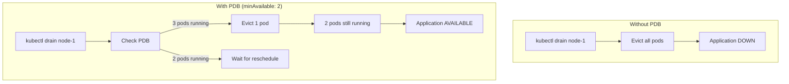
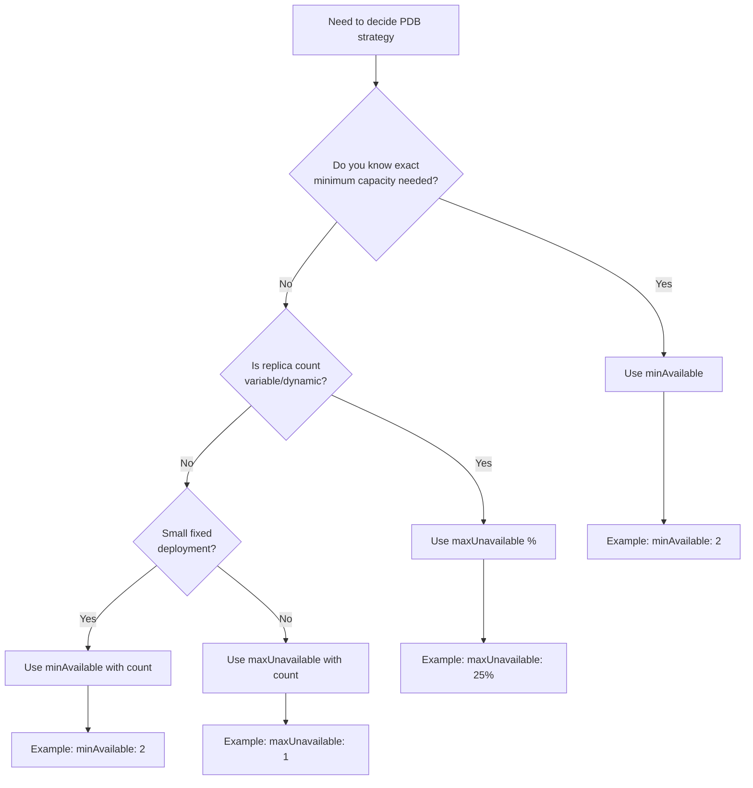
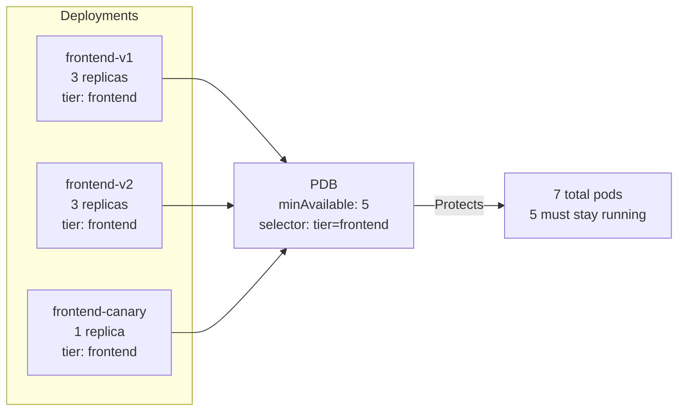
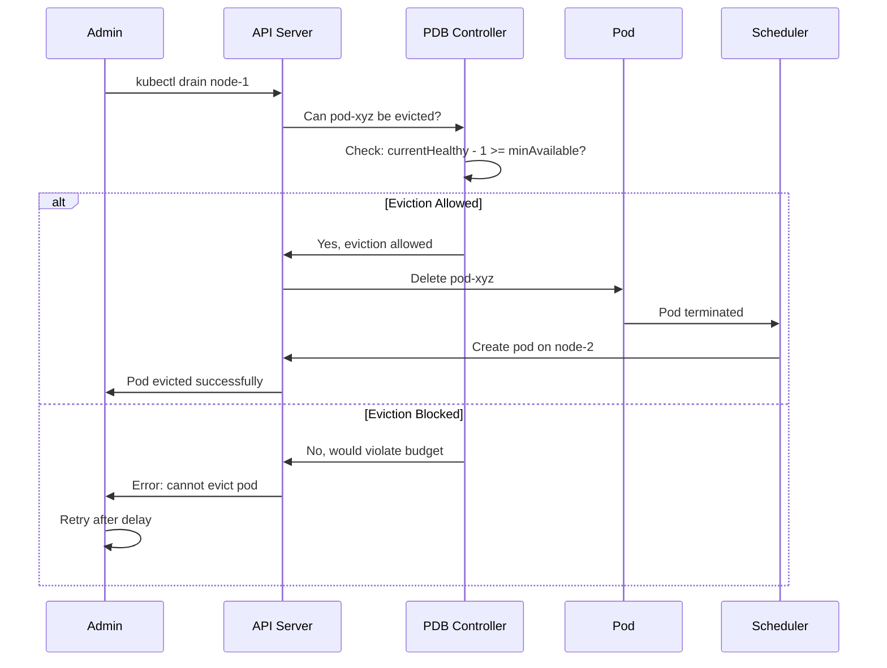
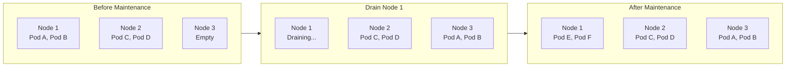
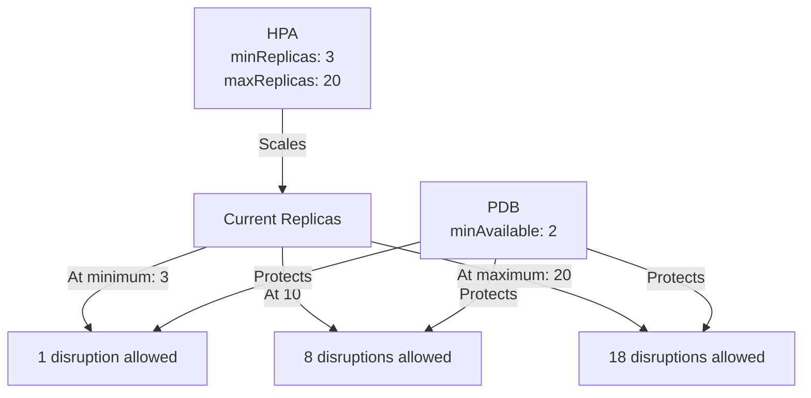

# How to Create Kubernetes Pod Disruption Budget Strategies

Author: [nawazdhandala](https://github.com/nawazdhandala)

Tags: Kubernetes, Pod Disruption Budget, High Availability, Maintenance

Description: Learn to implement Pod Disruption Budgets with minAvailable, maxUnavailable, and selector strategies for safe cluster maintenance.

---

Pod Disruption Budgets (PDBs) are your safety net during cluster maintenance. They tell Kubernetes how many pods must stay running when voluntary disruptions occur - like node drains, cluster upgrades, or autoscaling events. Without PDBs, a single `kubectl drain` command could take down your entire application.

This guide covers practical PDB strategies to maintain high availability while allowing necessary cluster operations.

## How PDBs Protect Your Workloads



PDBs only protect against voluntary disruptions. They cannot prevent involuntary disruptions like node hardware failures, kernel panics, or out-of-memory kills.

## PDB Configuration Strategies

### Strategy 1: minAvailable - Guarantee Minimum Capacity

Use `minAvailable` when you need a guaranteed number of pods running at all times.

```yaml
apiVersion: policy/v1
kind: PodDisruptionBudget
metadata:
  name: web-app-pdb
  namespace: production
spec:
  minAvailable: 2
  selector:
    matchLabels:
      app: web-app
```

**When to use:**
- Critical services where you know exactly how many pods you need
- Stateful applications requiring quorum (databases, distributed caches)
- Services with strict SLA requirements

**Percentage-based minAvailable:**

```yaml
apiVersion: policy/v1
kind: PodDisruptionBudget
metadata:
  name: web-app-pdb
spec:
  minAvailable: "50%"
  selector:
    matchLabels:
      app: web-app
```

### Strategy 2: maxUnavailable - Allow Controlled Disruption

Use `maxUnavailable` when you want to specify how many pods can be down simultaneously.

```yaml
apiVersion: policy/v1
kind: PodDisruptionBudget
metadata:
  name: api-service-pdb
  namespace: production
spec:
  maxUnavailable: 1
  selector:
    matchLabels:
      app: api-service
```

**When to use:**
- Large deployments where absolute numbers are less meaningful
- Applications that scale dynamically with HPA
- Workloads that can tolerate partial unavailability

**Percentage-based maxUnavailable:**

```yaml
apiVersion: policy/v1
kind: PodDisruptionBudget
metadata:
  name: workers-pdb
spec:
  maxUnavailable: "25%"
  selector:
    matchLabels:
      app: workers
```

### Choosing Between minAvailable and maxUnavailable



| Scenario | Recommended Strategy | Example |
|----------|---------------------|---------|
| 3-replica database cluster | minAvailable | `minAvailable: 2` |
| 20-replica web tier | maxUnavailable % | `maxUnavailable: 25%` |
| HPA-managed service (5-50 pods) | maxUnavailable % | `maxUnavailable: 20%` |
| Singleton pod (1 replica) | maxUnavailable | `maxUnavailable: 1` |
| Quorum-based system | minAvailable | `minAvailable: n/2 + 1` |

## Selector Matching Strategies

The selector determines which pods the PDB protects. Getting this right is critical.

### Strategy 1: Single Deployment Selector

Match pods from a specific deployment:

```yaml
apiVersion: policy/v1
kind: PodDisruptionBudget
metadata:
  name: frontend-pdb
spec:
  minAvailable: 2
  selector:
    matchLabels:
      app: frontend
      component: web
```

### Strategy 2: Multi-Deployment Selector

Use a shared label to protect multiple deployments with one PDB:

```yaml
apiVersion: policy/v1
kind: PodDisruptionBudget
metadata:
  name: tier-frontend-pdb
spec:
  minAvailable: 5
  selector:
    matchLabels:
      tier: frontend  # Matches frontend-v1, frontend-v2, etc.
```



### Strategy 3: Label Expression Selectors

Use `matchExpressions` for complex selection logic:

```yaml
apiVersion: policy/v1
kind: PodDisruptionBudget
metadata:
  name: production-services-pdb
spec:
  maxUnavailable: 1
  selector:
    matchExpressions:
      - key: app
        operator: In
        values:
          - api
          - web
          - worker
      - key: environment
        operator: NotIn
        values:
          - development
          - staging
```

### Verifying Selector Matches

Always verify your selectors match the intended pods:

```bash
# Check which pods match a label selector
kubectl get pods -l app=web-app -n production

# Verify PDB status shows correct pod count
kubectl describe pdb web-app-pdb -n production

# Output includes:
# Selector: app=web-app
# Status:
#   Current:    4
#   Desired:    4
#   Expected:   4
#   Allowed disruptions: 2
```

## Eviction Handling and Behavior

Understanding how Kubernetes handles eviction with PDBs helps you design better strategies.

### The Eviction Process



### Eviction States

```yaml
# Check PDB status
kubectl get pdb -n production -o wide

# NAME          MIN AVAILABLE   MAX UNAVAILABLE   ALLOWED DISRUPTIONS   AGE
# web-pdb       2               N/A               2                     5d
# api-pdb       N/A             1                 1                     5d
# db-pdb        2               N/A               0                     5d  # Blocked!
```

**Key fields:**
- **ALLOWED DISRUPTIONS**: How many pods can currently be evicted
- **Current**: Number of healthy pods now
- **Desired**: Number of pods the controller wants
- **Expected**: Number of pods expected to be available

### Handling Blocked Evictions

When evictions are blocked, drains will hang. Here's how to handle it:

```bash
# See why drain is stuck
kubectl get pdb -A -o wide

# Check pod health
kubectl get pods -l app=web-app -n production -o wide

# Common issues:
# 1. Pods stuck in Pending (no capacity elsewhere)
# 2. Pods unhealthy (failing readiness probes)
# 3. minAvailable equals replica count (no room for disruption)
```

**Solutions for stuck drains:**

```bash
# Option 1: Scale up first, then drain
kubectl scale deployment web-app --replicas=5 -n production
kubectl drain node-1 --ignore-daemonsets

# Option 2: Fix unhealthy pods
kubectl describe pod <unhealthy-pod> -n production
kubectl delete pod <unhealthy-pod> -n production

# Option 3 (Emergency): Override with force (loses PDB protection)
kubectl drain node-1 --ignore-daemonsets --force --delete-emptydir-data
```

## Maintenance Window Strategies

Plan PDB configurations for different maintenance scenarios.

### Strategy 1: Rolling Node Upgrades

For sequential node upgrades, ensure PDBs allow at least one disruption:

```yaml
apiVersion: policy/v1
kind: PodDisruptionBudget
metadata:
  name: web-pdb
spec:
  maxUnavailable: 1  # Always allows draining one node's worth
  selector:
    matchLabels:
      app: web
---
apiVersion: apps/v1
kind: Deployment
metadata:
  name: web
spec:
  replicas: 4
  template:
    spec:
      # Spread pods across nodes
      topologySpreadConstraints:
        - maxSkew: 1
          topologyKey: kubernetes.io/hostname
          whenUnsatisfiable: ScheduleAnyway
          labelSelector:
            matchLabels:
              app: web
```



### Strategy 2: Cluster Upgrades

During major upgrades, you may need to temporarily relax PDBs:

```yaml
# relaxed-pdb.yaml - Apply during maintenance window
apiVersion: policy/v1
kind: PodDisruptionBudget
metadata:
  name: web-pdb-maintenance
  namespace: production
  labels:
    maintenance-mode: "true"
spec:
  maxUnavailable: "50%"  # More permissive during upgrade
  selector:
    matchLabels:
      app: web
```

```bash
# Maintenance workflow
# 1. Scale up to handle more disruption
kubectl scale deployment web --replicas=6 -n production

# 2. Apply relaxed PDB
kubectl apply -f relaxed-pdb.yaml

# 3. Perform upgrade
# ... cluster upgrade commands ...

# 4. Restore normal PDB
kubectl apply -f normal-pdb.yaml

# 5. Scale back down
kubectl scale deployment web --replicas=4 -n production
```

### Strategy 3: Emergency Maintenance

For urgent fixes, document your override procedure:

```bash
#!/bin/bash
# emergency-drain.sh - Use only for critical issues
set -e

NODE=$1
NAMESPACE=${2:-production}

echo "WARNING: Emergency drain bypasses PDB protection"
echo "Node: $NODE, Namespace: $NAMESPACE"
read -p "Type 'CONFIRM' to proceed: " confirm

if [ "$confirm" != "CONFIRM" ]; then
    echo "Aborted"
    exit 1
fi

# Log the action
echo "$(date) - Emergency drain of $NODE by $USER" >> /var/log/k8s-emergency.log

# Cordon to prevent new scheduling
kubectl cordon $NODE

# Force drain
kubectl drain $NODE \
    --ignore-daemonsets \
    --force \
    --delete-emptydir-data \
    --grace-period=30

echo "Node $NODE drained. Remember to uncordon after maintenance."
```

## PDB Patterns for Different Workload Types

### Pattern 1: Stateless Web Applications

```yaml
apiVersion: apps/v1
kind: Deployment
metadata:
  name: web-frontend
spec:
  replicas: 4
  selector:
    matchLabels:
      app: web-frontend
  template:
    metadata:
      labels:
        app: web-frontend
    spec:
      affinity:
        podAntiAffinity:
          preferredDuringSchedulingIgnoredDuringExecution:
            - weight: 100
              podAffinityTerm:
                labelSelector:
                  matchLabels:
                    app: web-frontend
                topologyKey: kubernetes.io/hostname
      containers:
        - name: web
          image: nginx:latest
          readinessProbe:
            httpGet:
              path: /health
              port: 80
            initialDelaySeconds: 5
            periodSeconds: 5
---
apiVersion: policy/v1
kind: PodDisruptionBudget
metadata:
  name: web-frontend-pdb
spec:
  minAvailable: 2  # 50% capacity always available
  selector:
    matchLabels:
      app: web-frontend
```

### Pattern 2: Stateful Databases (Quorum-Based)

```yaml
apiVersion: apps/v1
kind: StatefulSet
metadata:
  name: postgres
spec:
  replicas: 3
  selector:
    matchLabels:
      app: postgres
  template:
    metadata:
      labels:
        app: postgres
    spec:
      containers:
        - name: postgres
          image: postgres:15
---
apiVersion: policy/v1
kind: PodDisruptionBudget
metadata:
  name: postgres-pdb
spec:
  minAvailable: 2  # Maintain quorum (n/2 + 1 for n=3)
  selector:
    matchLabels:
      app: postgres
```

### Pattern 3: Batch Processing Workers

```yaml
apiVersion: apps/v1
kind: Deployment
metadata:
  name: batch-workers
spec:
  replicas: 10
  selector:
    matchLabels:
      app: batch-workers
  template:
    metadata:
      labels:
        app: batch-workers
---
apiVersion: policy/v1
kind: PodDisruptionBudget
metadata:
  name: batch-workers-pdb
spec:
  maxUnavailable: "50%"  # Can tolerate significant disruption
  selector:
    matchLabels:
      app: batch-workers
```

### Pattern 4: Singleton Services

```yaml
apiVersion: apps/v1
kind: Deployment
metadata:
  name: scheduler
spec:
  replicas: 1
  selector:
    matchLabels:
      app: scheduler
---
apiVersion: policy/v1
kind: PodDisruptionBudget
metadata:
  name: scheduler-pdb
spec:
  maxUnavailable: 1  # Allows disruption but documents intent
  selector:
    matchLabels:
      app: scheduler
```

## PDB with HPA Integration

When using Horizontal Pod Autoscaler, align your PDB with scaling boundaries:

```yaml
apiVersion: autoscaling/v2
kind: HorizontalPodAutoscaler
metadata:
  name: api-hpa
spec:
  scaleTargetRef:
    apiVersion: apps/v1
    kind: Deployment
    name: api
  minReplicas: 3
  maxReplicas: 20
  metrics:
    - type: Resource
      resource:
        name: cpu
        target:
          type: Utilization
          averageUtilization: 70
---
apiVersion: policy/v1
kind: PodDisruptionBudget
metadata:
  name: api-pdb
spec:
  minAvailable: 2  # Less than HPA minReplicas
  selector:
    matchLabels:
      app: api
```



**Key rule:** `PDB minAvailable` should be less than `HPA minReplicas` to always allow at least one disruption.

## Monitoring and Alerting

### Prometheus Alerts for PDB

```yaml
apiVersion: monitoring.coreos.com/v1
kind: PrometheusRule
metadata:
  name: pdb-alerts
  namespace: monitoring
spec:
  groups:
    - name: pdb
      rules:
        - alert: PDBDisruptionsBlocked
          expr: |
            kube_poddisruptionbudget_status_pod_disruptions_allowed == 0
          for: 15m
          labels:
            severity: warning
          annotations:
            summary: "PDB {{ $labels.poddisruptionbudget }} allows no disruptions"
            description: "PDB has been blocking all disruptions for 15 minutes. This may block cluster maintenance."

        - alert: PDBUnhealthyPods
          expr: |
            kube_poddisruptionbudget_status_current_healthy
            <
            kube_poddisruptionbudget_status_desired_healthy
          for: 5m
          labels:
            severity: warning
          annotations:
            summary: "PDB {{ $labels.poddisruptionbudget }} has unhealthy pods"
            description: "Current healthy pods ({{ $value }}) is below desired."

        - alert: PDBTooRestrictive
          expr: |
            (
              kube_poddisruptionbudget_status_desired_healthy
              -
              kube_poddisruptionbudget_status_pod_disruptions_allowed
            )
            >=
            kube_poddisruptionbudget_status_desired_healthy
          for: 1h
          labels:
            severity: info
          annotations:
            summary: "PDB {{ $labels.poddisruptionbudget }} may be too restrictive"
            description: "PDB configuration leaves no room for disruption."
```

### Grafana Dashboard Queries

```promql
# Allowed disruptions over time
kube_poddisruptionbudget_status_pod_disruptions_allowed

# Current vs desired healthy pods
kube_poddisruptionbudget_status_current_healthy
/
kube_poddisruptionbudget_status_desired_healthy

# PDBs blocking maintenance (allowed = 0)
count(kube_poddisruptionbudget_status_pod_disruptions_allowed == 0)
```

## Common Pitfalls and Solutions

### Pitfall 1: minAvailable Equals Replica Count

```yaml
# BAD - No disruptions ever allowed
spec:
  replicas: 3
---
spec:
  minAvailable: 3  # Blocks all drains!
```

**Solution:** Always leave room for at least one disruption.

```yaml
# GOOD
spec:
  replicas: 3
---
spec:
  minAvailable: 2  # Allows 1 disruption
```

### Pitfall 2: Selector Mismatch

```yaml
# BAD - Labels don't match
apiVersion: apps/v1
kind: Deployment
spec:
  template:
    metadata:
      labels:
        app: web-frontend  # Note: web-frontend
---
apiVersion: policy/v1
kind: PodDisruptionBudget
spec:
  selector:
    matchLabels:
      app: frontend  # Note: frontend - DOESN'T MATCH!
```

**Solution:** Verify selectors match with `kubectl get pods -l <selector>`.

### Pitfall 3: Missing PDBs for Critical Services

```bash
# Find deployments without PDBs
kubectl get deployments -A -o json | jq -r '
  .items[] |
  select(.metadata.namespace != "kube-system") |
  "\(.metadata.namespace)/\(.metadata.name)"
' | while read deploy; do
  ns=$(echo $deploy | cut -d/ -f1)
  name=$(echo $deploy | cut -d/ -f2)
  labels=$(kubectl get deployment $name -n $ns -o jsonpath='{.spec.selector.matchLabels}')
  pdb_count=$(kubectl get pdb -n $ns -o json | jq --arg labels "$labels" '[.items[] | select(.spec.selector.matchLabels == ($labels | fromjson))] | length')
  if [ "$pdb_count" -eq "0" ]; then
    echo "Missing PDB: $deploy"
  fi
done
```

### Pitfall 4: Not Testing PDB Behavior

```bash
# Test PDB before production
# 1. Deploy to staging with same config
# 2. Verify PDB status
kubectl get pdb -n staging -o wide

# 3. Simulate drain
kubectl drain <staging-node> --dry-run=client --ignore-daemonsets

# 4. Actually drain and verify app stays available
kubectl drain <staging-node> --ignore-daemonsets
curl -I https://staging.example.com  # Should respond
```

## Best Practices Summary

1. **Always create PDBs for production workloads** - Even if permissive, they document intent.

2. **Use maxUnavailable for dynamic workloads** - Pairs better with HPA.

3. **Use minAvailable for quorum systems** - Databases, consensus systems, leader election.

4. **Leave room for at least one disruption** - `minAvailable < replicas` or `maxUnavailable >= 1`.

5. **Combine with pod anti-affinity** - Spread pods so one node drain does not affect all replicas.

6. **Test PDB behavior in staging** - Verify drains work before production emergencies.

7. **Monitor allowed disruptions** - Alert when PDBs block all maintenance.

8. **Document emergency procedures** - Know when and how to override PDBs.

---

Pod Disruption Budgets are essential for production Kubernetes. They protect your applications during maintenance while still allowing necessary cluster operations. Start by adding PDBs to all critical services, tune based on your availability requirements, and always test the maintenance workflow before you need it in an emergency.
