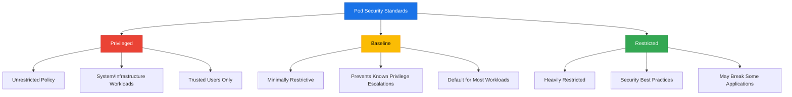
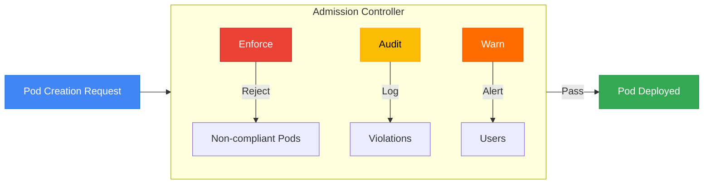
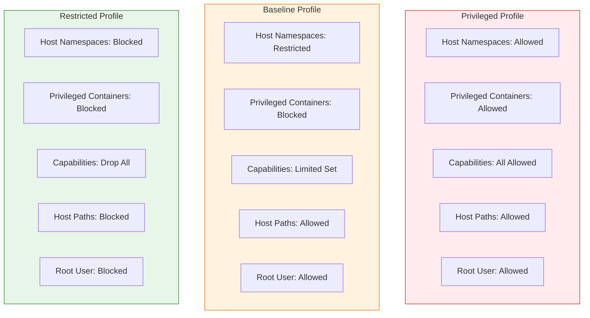
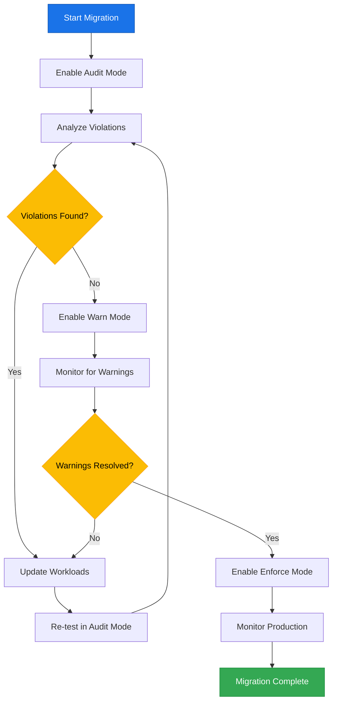

# How to Create Kubernetes Pod Security Policies

Author: [nawazdhandala](https://github.com/nawazdhandala)

Tags: Kubernetes, Security, Pod Security, Policy

Description: Learn how to implement pod security standards for secure workload deployment.

---

## Introduction

Kubernetes Pod Security is a critical aspect of cluster hardening that controls what privileges and capabilities pods can request. With the deprecation of PodSecurityPolicy (PSP) in Kubernetes 1.21 and its removal in 1.25, the community has shifted to Pod Security Standards (PSS) enforced through the built-in Pod Security Admission controller.

This guide walks you through implementing Pod Security Standards to protect your Kubernetes workloads from privilege escalation attacks and security misconfigurations.

## Understanding Pod Security Standards

Pod Security Standards define three distinct security profiles that cover a broad spectrum of security requirements:



### The Three Security Profiles

| Profile | Use Case | Security Level |
|---------|----------|----------------|
| **Privileged** | System-level workloads requiring full access | No restrictions |
| **Baseline** | Standard workloads with minimal restrictions | Moderate security |
| **Restricted** | Security-critical workloads | Maximum security |

## Pod Security Admission Controller

The Pod Security Admission controller is built into Kubernetes and validates pods against the defined security standards. It operates at the namespace level using labels.



### Admission Modes

- **Enforce**: Pods violating the policy will be rejected
- **Audit**: Violations are recorded in the audit log but pods are allowed
- **Warn**: Users receive warnings but pods are allowed

## Setting Up Pod Security Standards

### Step 1: Enable the Admission Controller

The Pod Security Admission controller is enabled by default in Kubernetes 1.23 and later. For earlier versions, you need to enable it in the API server configuration.

```yaml
# kube-apiserver configuration
# File: /etc/kubernetes/manifests/kube-apiserver.yaml
apiVersion: v1
kind: Pod
metadata:
  name: kube-apiserver
  namespace: kube-system
spec:
  containers:
  - name: kube-apiserver
    command:
    - kube-apiserver
    # Enable the PodSecurity admission plugin
    - --enable-admission-plugins=PodSecurity
    # Other flags remain unchanged
    - --authorization-mode=Node,RBAC
    - --client-ca-file=/etc/kubernetes/pki/ca.crt
```

### Step 2: Configure Namespace Labels

Apply security standards to namespaces using labels. The label format follows this pattern:

```
pod-security.kubernetes.io/<MODE>: <LEVEL>
pod-security.kubernetes.io/<MODE>-version: <VERSION>
```

## Policy Examples

### Privileged Policy (Unrestricted)

Use this policy only for system namespaces or trusted infrastructure workloads.

```yaml
# privileged-namespace.yaml
# This namespace allows all pod configurations without restrictions
# WARNING: Only use for system-level workloads that require full privileges
apiVersion: v1
kind: Namespace
metadata:
  name: kube-system
  labels:
    # Allow all pods without security restrictions
    pod-security.kubernetes.io/enforce: privileged
    # Use the latest version of the privileged profile
    pod-security.kubernetes.io/enforce-version: latest
    # Audit against baseline to track potential security improvements
    pod-security.kubernetes.io/audit: baseline
    pod-security.kubernetes.io/audit-version: latest
```

Example workload that requires privileged access:

```yaml
# privileged-pod.yaml
# Example: CNI plugin pod that requires host networking and privileges
apiVersion: v1
kind: Pod
metadata:
  name: network-plugin
  namespace: kube-system
spec:
  # Run on the host network stack for network configuration
  hostNetwork: true
  # Access host PID namespace for process management
  hostPID: true
  containers:
  - name: cni-plugin
    image: example/cni-plugin:v1.0
    securityContext:
      # Required for network namespace manipulation
      privileged: true
      # Run as root for system-level access
      runAsUser: 0
    volumeMounts:
    # Mount host paths for CNI configuration
    - name: cni-bin
      mountPath: /opt/cni/bin
    - name: cni-conf
      mountPath: /etc/cni/net.d
  volumes:
  - name: cni-bin
    hostPath:
      path: /opt/cni/bin
      type: DirectoryOrCreate
  - name: cni-conf
    hostPath:
      path: /etc/cni/net.d
      type: DirectoryOrCreate
```

### Baseline Policy (Default Recommended)

The baseline policy prevents known privilege escalations while maintaining compatibility with most workloads.

```yaml
# baseline-namespace.yaml
# Recommended for general application workloads
# Prevents known privilege escalations while allowing common configurations
apiVersion: v1
kind: Namespace
metadata:
  name: applications
  labels:
    # Enforce baseline security standards
    pod-security.kubernetes.io/enforce: baseline
    pod-security.kubernetes.io/enforce-version: v1.28
    # Warn if pods would violate restricted policy
    # Helps teams prepare for stricter security
    pod-security.kubernetes.io/warn: restricted
    pod-security.kubernetes.io/warn-version: latest
    # Audit against restricted for security reports
    pod-security.kubernetes.io/audit: restricted
    pod-security.kubernetes.io/audit-version: latest
```

Example compliant workload:

```yaml
# baseline-compliant-pod.yaml
# Standard web application that meets baseline requirements
apiVersion: v1
kind: Pod
metadata:
  name: web-application
  namespace: applications
spec:
  containers:
  - name: webapp
    image: nginx:1.25
    # Port configuration
    ports:
    - containerPort: 8080
      protocol: TCP
    securityContext:
      # Do not allow privilege escalation
      allowPrivilegeEscalation: false
      # Use non-root user
      runAsNonRoot: true
      runAsUser: 1000
      runAsGroup: 1000
    resources:
      # Always set resource limits
      limits:
        memory: "256Mi"
        cpu: "500m"
      requests:
        memory: "128Mi"
        cpu: "250m"
```

### Restricted Policy (Maximum Security)

The restricted policy enforces the most stringent security requirements following current best practices.

```yaml
# restricted-namespace.yaml
# Maximum security for sensitive workloads
# May require application modifications to comply
apiVersion: v1
kind: Namespace
metadata:
  name: secure-apps
  labels:
    # Enforce the most restrictive security standards
    pod-security.kubernetes.io/enforce: restricted
    pod-security.kubernetes.io/enforce-version: v1.28
    # All modes set to restricted for complete coverage
    pod-security.kubernetes.io/warn: restricted
    pod-security.kubernetes.io/warn-version: v1.28
    pod-security.kubernetes.io/audit: restricted
    pod-security.kubernetes.io/audit-version: v1.28
```

Example compliant workload:

```yaml
# restricted-compliant-pod.yaml
# Fully compliant pod meeting all restricted policy requirements
apiVersion: v1
kind: Pod
metadata:
  name: secure-api
  namespace: secure-apps
spec:
  # Prevent privilege escalation at pod level
  securityContext:
    # Run entire pod as non-root
    runAsNonRoot: true
    # Use seccomp profile to limit syscalls
    seccompProfile:
      type: RuntimeDefault
    # Set filesystem group
    fsGroup: 10000
  containers:
  - name: api-server
    image: myregistry/secure-api:v2.0
    ports:
    - containerPort: 8443
      protocol: TCP
    securityContext:
      # Block privilege escalation
      allowPrivilegeEscalation: false
      # Non-root user execution
      runAsNonRoot: true
      runAsUser: 10000
      runAsGroup: 10000
      # Read-only root filesystem prevents tampering
      readOnlyRootFilesystem: true
      # Drop all capabilities
      capabilities:
        drop:
          - ALL
    # Use emptyDir for any writable storage needs
    volumeMounts:
    - name: tmp
      mountPath: /tmp
    - name: cache
      mountPath: /var/cache
    resources:
      limits:
        memory: "512Mi"
        cpu: "1000m"
      requests:
        memory: "256Mi"
        cpu: "500m"
  volumes:
  # Temporary writable volumes
  - name: tmp
    emptyDir: {}
  - name: cache
    emptyDir: {}
```

## Security Profile Comparison



## Implementing a Cluster-Wide Default

You can set default policies for the entire cluster using the admission controller configuration.

```yaml
# pod-security-config.yaml
# Cluster-wide Pod Security Admission configuration
apiVersion: apiserver.config.k8s.io/v1
kind: AdmissionConfiguration
plugins:
- name: PodSecurity
  configuration:
    apiVersion: pod-security.admission.config.k8s.io/v1
    kind: PodSecurityConfiguration
    # Default settings for namespaces without explicit labels
    defaults:
      # Enforce baseline by default
      enforce: "baseline"
      enforce-version: "latest"
      # Warn about restricted violations
      warn: "restricted"
      warn-version: "latest"
      # Audit at restricted level
      audit: "restricted"
      audit-version: "latest"
    # Exempt specific namespaces, users, or runtime classes
    exemptions:
      # System namespaces that need privileged access
      namespaces:
        - kube-system
        - kube-node-lease
        - kube-public
      # Service accounts for infrastructure components
      usernames:
        - system:serviceaccount:kube-system:*
      # Runtime classes that have their own security measures
      runtimeClasses: []
```

## Testing Your Policies

### Dry Run Validation

Test pod configurations against policies before deployment:

```bash
#!/bin/bash
# validate-pod-security.sh
# Script to validate pod manifests against security standards

# Set the namespace with restricted policy for testing
NAMESPACE="secure-apps"

# Create a test namespace with restricted policy
kubectl create namespace test-restricted --dry-run=client -o yaml | \
  kubectl label --local -f - \
    pod-security.kubernetes.io/enforce=restricted \
    pod-security.kubernetes.io/enforce-version=latest \
    --dry-run=client -o yaml | \
  kubectl apply -f -

# Test your pod manifest
# The --dry-run=server flag validates against admission controllers
kubectl apply -f my-pod.yaml \
  --namespace=test-restricted \
  --dry-run=server

# Check the result
if [ $? -eq 0 ]; then
    echo "Pod manifest is compliant with restricted policy"
else
    echo "Pod manifest violates restricted policy"
fi

# Cleanup test namespace
kubectl delete namespace test-restricted
```

### Audit Log Analysis

Monitor policy violations through audit logs:

```yaml
# audit-policy.yaml
# Kubernetes audit policy to capture Pod Security violations
apiVersion: audit.k8s.io/v1
kind: Policy
rules:
  # Log all Pod Security admission decisions
  - level: RequestResponse
    resources:
    - group: ""
      resources: ["pods"]
    verbs: ["create", "update"]
    # Capture the full request and response for analysis
    omitStages:
    - RequestReceived
```

## Migration Strategy



### Step-by-Step Migration

1. **Enable Audit Mode First**

```yaml
# Step 1: Start with audit mode only
apiVersion: v1
kind: Namespace
metadata:
  name: my-namespace
  labels:
    # Only audit initially to discover violations
    pod-security.kubernetes.io/audit: restricted
    pod-security.kubernetes.io/audit-version: latest
```

2. **Add Warning Mode**

```yaml
# Step 2: Add warnings after fixing critical issues
apiVersion: v1
kind: Namespace
metadata:
  name: my-namespace
  labels:
    pod-security.kubernetes.io/audit: restricted
    pod-security.kubernetes.io/audit-version: latest
    # Add warnings to alert users
    pod-security.kubernetes.io/warn: restricted
    pod-security.kubernetes.io/warn-version: latest
```

3. **Enable Enforcement**

```yaml
# Step 3: Enable enforcement once workloads are compliant
apiVersion: v1
kind: Namespace
metadata:
  name: my-namespace
  labels:
    # Now enforce the policy
    pod-security.kubernetes.io/enforce: restricted
    pod-security.kubernetes.io/enforce-version: latest
    pod-security.kubernetes.io/audit: restricted
    pod-security.kubernetes.io/audit-version: latest
    pod-security.kubernetes.io/warn: restricted
    pod-security.kubernetes.io/warn-version: latest
```

## Common Violations and Fixes

### Running as Root

**Violation**: Pod runs as root user

```yaml
# Before: Violates restricted policy
spec:
  containers:
  - name: app
    image: myapp:latest
    # No securityContext specified means potential root execution
```

```yaml
# After: Compliant with restricted policy
spec:
  containers:
  - name: app
    image: myapp:latest
    securityContext:
      # Explicitly prevent root execution
      runAsNonRoot: true
      runAsUser: 1000
      runAsGroup: 1000
```

### Privilege Escalation

**Violation**: Container allows privilege escalation

```yaml
# Before: Allows privilege escalation by default
spec:
  containers:
  - name: app
    image: myapp:latest
```

```yaml
# After: Explicitly blocks privilege escalation
spec:
  containers:
  - name: app
    image: myapp:latest
    securityContext:
      allowPrivilegeEscalation: false
      capabilities:
        drop:
          - ALL
```

### Missing Seccomp Profile

**Violation**: No seccomp profile specified

```yaml
# Before: No seccomp profile
spec:
  containers:
  - name: app
    image: myapp:latest
```

```yaml
# After: Uses RuntimeDefault seccomp profile
spec:
  securityContext:
    seccompProfile:
      type: RuntimeDefault
  containers:
  - name: app
    image: myapp:latest
```

## Best Practices

1. **Start with Audit Mode**: Always begin migration by auditing existing workloads
2. **Use Version Pinning**: Pin policy versions to avoid unexpected behavior during upgrades
3. **Exempt System Namespaces**: Keep kube-system and other infrastructure namespaces privileged
4. **Document Exemptions**: Clearly document why any namespace requires elevated privileges
5. **Regular Reviews**: Periodically review audit logs and adjust policies as needed
6. **Automate Compliance Checks**: Integrate policy validation into CI/CD pipelines

## Monitoring and Alerting

Set up monitoring for Pod Security violations:

```yaml
# prometheus-rule.yaml
# PrometheusRule to alert on Pod Security violations
apiVersion: monitoring.coreos.com/v1
kind: PrometheusRule
metadata:
  name: pod-security-alerts
  namespace: monitoring
spec:
  groups:
  - name: pod-security
    rules:
    # Alert when pods are rejected by Pod Security Admission
    - alert: PodSecurityViolation
      expr: |
        increase(
          apiserver_admission_controller_admission_duration_seconds_count{
            name="PodSecurity",
            rejected="true"
          }[5m]
        ) > 0
      for: 1m
      labels:
        severity: warning
      annotations:
        summary: "Pod Security policy violation detected"
        description: "Pods are being rejected due to security policy violations"
```

## Conclusion

Pod Security Standards provide a robust framework for securing Kubernetes workloads. By implementing the appropriate security profile for each namespace and following a gradual migration strategy, you can significantly improve your cluster's security posture without disrupting existing applications.

Key takeaways:
- Use the built-in Pod Security Admission controller instead of deprecated PodSecurityPolicy
- Choose the appropriate profile (Privileged, Baseline, or Restricted) based on workload requirements
- Start with audit mode and progressively enable enforcement
- Regularly review violations and update workloads to comply with stricter policies

For production environments, aim to run most application workloads under the baseline or restricted profiles, reserving privileged access only for essential infrastructure components.

## Additional Resources

- [Kubernetes Pod Security Standards Documentation](https://kubernetes.io/docs/concepts/security/pod-security-standards/)
- [Pod Security Admission Controller](https://kubernetes.io/docs/concepts/security/pod-security-admission/)
- [Migrating from PodSecurityPolicy](https://kubernetes.io/docs/tasks/configure-pod-container/migrate-from-psp/)
