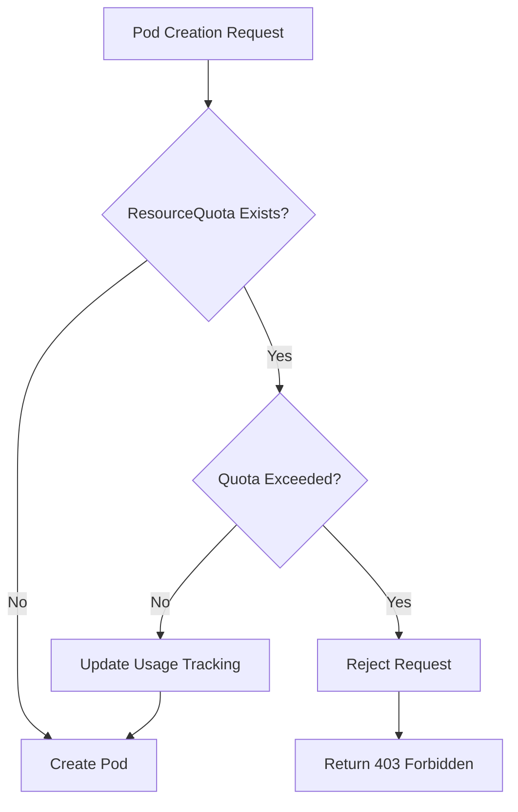

# How to Build Kubernetes Resource Quotas

Author: [nawazdhandala](https://www.github.com/nawazdhandala)

Tags: Kubernetes, Resource Management, Multi-tenancy, Quotas, DevOps

Description: Configure Kubernetes resource quotas for namespace-level resource limits, object counts, and priority class quotas for multi-tenant clusters.

---

Running a Kubernetes cluster with multiple teams or applications means you need guardrails. Without them, one runaway deployment can consume all your cluster resources and bring everything else to a halt. Resource quotas solve this problem by setting hard limits on what each namespace can consume.

This guide walks through building practical resource quotas from the ground up. We will cover compute quotas, object count limits, storage quotas, and priority-based quotas that work together to create a well-governed multi-tenant cluster.

## How Resource Quotas Work

Resource quotas operate at the namespace level. When you create a ResourceQuota object, Kubernetes tracks resource consumption for that namespace and blocks any requests that would exceed the quota.



The key thing to understand: quotas are enforced at admission time. If a pod request would push the namespace over its limit, Kubernetes rejects it immediately. Existing pods are not evicted when quotas change.

## Setting Up Compute Resource Quotas

Start with the fundamentals: CPU and memory limits. This quota restricts how much compute a namespace can request and use.

```yaml
# compute-quota.yaml
# This quota limits total CPU and memory across all pods in the namespace
apiVersion: v1
kind: ResourceQuota
metadata:
  name: compute-quota
  namespace: team-alpha
spec:
  hard:
    # Total CPU that can be requested by all pods combined
    requests.cpu: "10"
    # Total memory requests across all pods
    requests.memory: 20Gi
    # Maximum CPU limits sum (can be higher than requests for bursting)
    limits.cpu: "20"
    # Maximum memory limits sum
    limits.memory: 40Gi
```

Apply the quota and verify it is active:

```bash
# Apply the quota to your cluster
kubectl apply -f compute-quota.yaml

# Check current usage against the quota
kubectl describe resourcequota compute-quota -n team-alpha
```

The output shows both the hard limits and current usage, making it easy to see how close a namespace is to its ceiling.

## Requiring Resource Specifications

Here is a gotcha that trips people up: once you set compute quotas, every pod must specify resource requests and limits. Pods without them get rejected.

You have two options. First, you can mandate that developers always include resources in their specs. Second, you can create a LimitRange that provides defaults:

```yaml
# default-limits.yaml
# Automatically applies resource defaults to pods without explicit specs
apiVersion: v1
kind: LimitRange
metadata:
  name: default-limits
  namespace: team-alpha
spec:
  limits:
    - type: Container
      # Default requests if not specified
      defaultRequest:
        cpu: 100m
        memory: 128Mi
      # Default limits if not specified
      default:
        cpu: 500m
        memory: 512Mi
      # Minimum allowed values
      min:
        cpu: 50m
        memory: 64Mi
      # Maximum allowed values per container
      max:
        cpu: 2
        memory: 4Gi
```

This combination works well in practice: quotas cap the namespace total, while LimitRange ensures individual containers stay reasonable and provides sensible defaults.

## Object Count Quotas

Compute resources are not the only thing worth limiting. Object counts prevent namespace sprawl and protect the API server from excessive load.

```yaml
# object-count-quota.yaml
# Limits the number of various Kubernetes objects in the namespace
apiVersion: v1
kind: ResourceQuota
metadata:
  name: object-count-quota
  namespace: team-alpha
spec:
  hard:
    # Limit total pods to prevent scheduling overload
    pods: "50"
    # Restrict services to control load balancer costs
    services: "10"
    # LoadBalancer services are expensive, limit them separately
    services.loadbalancers: "2"
    # Control how many ConfigMaps can exist
    configmaps: "20"
    # Limit secrets for security hygiene
    secrets: "20"
    # Cap PersistentVolumeClaims to control storage sprawl
    persistentvolumeclaims: "10"
    # Restrict ReplicationControllers (legacy, but still used)
    replicationcontrollers: "10"
```

LoadBalancer service limits are particularly important if you are running on a cloud provider. Each one typically provisions a cloud load balancer with its own cost.

## Storage Quotas

Storage deserves its own quota category. You can limit total storage requested and even break it down by storage class:

```yaml
# storage-quota.yaml
# Controls storage consumption by storage class
apiVersion: v1
kind: ResourceQuota
metadata:
  name: storage-quota
  namespace: team-alpha
spec:
  hard:
    # Total storage across all PVCs
    requests.storage: 100Gi
    # Number of PVCs allowed
    persistentvolumeclaims: "10"
    # Limit fast SSD storage separately
    ssd-storage.storageclass.storage.k8s.io/requests.storage: 50Gi
    ssd-storage.storageclass.storage.k8s.io/persistentvolumeclaims: "5"
    # Standard HDD storage can be more generous
    standard.storageclass.storage.k8s.io/requests.storage: 200Gi
```

This lets you allocate expensive fast storage sparingly while being more generous with cheaper options.

## Priority Class Quotas

In clusters using pod priority for preemption, you want to prevent teams from marking everything as high priority. Scoped quotas solve this:

```yaml
# priority-quota.yaml
# Limits resources by priority class to prevent priority inflation
apiVersion: v1
kind: ResourceQuota
metadata:
  name: high-priority-quota
  namespace: team-alpha
spec:
  hard:
    # Only allow limited high-priority resources
    cpu: "2"
    memory: 4Gi
    pods: "5"
  # This quota only applies to pods with these priority classes
  scopeSelector:
    matchExpressions:
      - scopeName: PriorityClass
        operator: In
        values:
          - high-priority
          - critical
```

Now the team can only run a limited number of high-priority workloads, preserving cluster stability.

## Combining Multiple Quotas

A production namespace typically needs several quotas working together. Here is a complete setup:

```yaml
# complete-namespace-quotas.yaml
# Full quota configuration for a production team namespace
apiVersion: v1
kind: ResourceQuota
metadata:
  name: compute-quota
  namespace: production-team
spec:
  hard:
    requests.cpu: "20"
    requests.memory: 40Gi
    limits.cpu: "40"
    limits.memory: 80Gi
---
apiVersion: v1
kind: ResourceQuota
metadata:
  name: object-quota
  namespace: production-team
spec:
  hard:
    pods: "100"
    services: "20"
    services.loadbalancers: "3"
    configmaps: "50"
    secrets: "50"
    persistentvolumeclaims: "20"
---
apiVersion: v1
kind: ResourceQuota
metadata:
  name: best-effort-quota
  namespace: production-team
spec:
  hard:
    # Limit pods without resource specs (BestEffort QoS)
    pods: "10"
  scopes:
    - BestEffort
```

The BestEffort scoped quota is clever: it allows some pods without resource specs but limits them to a small number. This gives developers flexibility for debugging while keeping the namespace manageable.

## Monitoring Quota Usage

Visibility into quota consumption helps teams plan and avoid surprises. Use this script to check all quotas:

```bash
#!/bin/bash
# quota-report.sh
# Generate a report of quota usage across namespaces

echo "=== Resource Quota Report ==="
echo ""

# List all namespaces with quotas
for ns in $(kubectl get resourcequota -A -o jsonpath='{.items[*].metadata.namespace}' | tr ' ' '\n' | sort -u); do
    echo "Namespace: $ns"
    echo "---"
    kubectl get resourcequota -n "$ns" -o custom-columns=\
NAME:.metadata.name,\
CPU_REQ:.status.used.requests\\.cpu,\
CPU_LIM:.status.hard.requests\\.cpu,\
MEM_REQ:.status.used.requests\\.memory,\
MEM_LIM:.status.hard.requests\\.memory
    echo ""
done
```

For production monitoring, expose quota metrics to Prometheus using kube-state-metrics, which automatically tracks quota usage.

## Common Pitfalls

A few things to watch out for when implementing quotas:

**Forgetting LimitRange defaults.** Without defaults, pods without resource specs fail silently until someone tries to deploy them.

**Setting quotas too tight initially.** Start generous and tighten based on actual usage data. Overly restrictive quotas create friction with development teams.

**Not accounting for system overhead.** DaemonSets, monitoring agents, and sidecar injectors all consume resources. Leave headroom for these.

**Ignoring ephemeral storage.** Containers writing to their local filesystem use ephemeral storage. Add `requests.ephemeral-storage` and `limits.ephemeral-storage` to your quotas if this is a concern.

## Summary

Resource quotas give you the controls needed to run a multi-tenant Kubernetes cluster safely. Start with compute quotas to prevent resource exhaustion, add object count limits to control sprawl, and layer in storage and priority quotas as needed. Combine quotas with LimitRange defaults for a complete resource governance strategy.

The goal is not to restrict teams unnecessarily but to create predictable boundaries that let everyone share the cluster fairly. Get the balance right, and teams can move fast without worrying about impacting each other.
