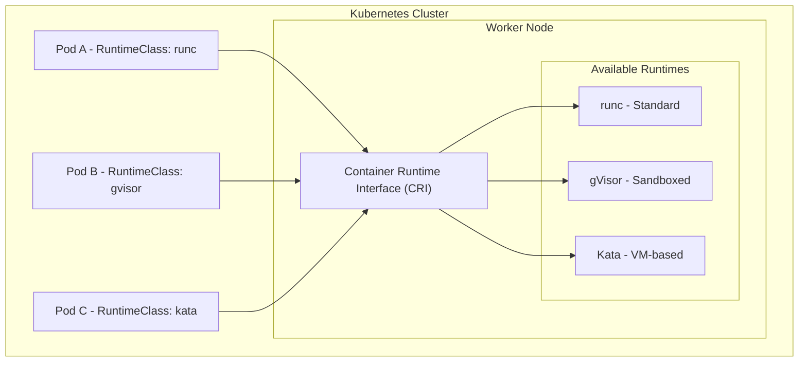
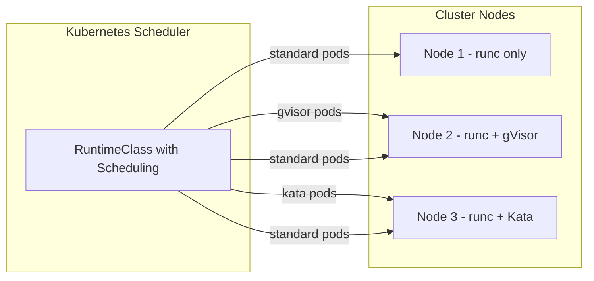
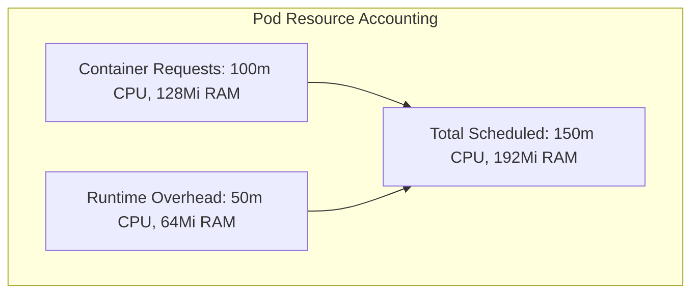
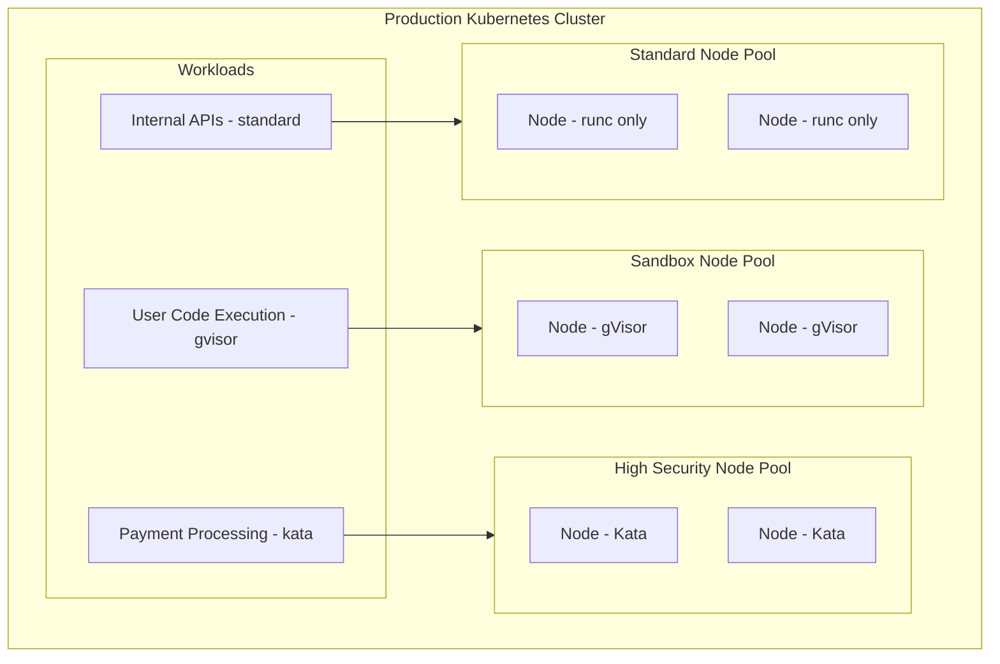

# How to Create Kubernetes RuntimeClass

Author: [nawazdhandala](https://github.com/nawazdhandala)

Tags: Kubernetes, RuntimeClass, Container Runtime, Security

Description: Learn to implement RuntimeClass for selecting container runtimes like gVisor, Kata Containers, and runc for different workload isolation needs.

---

Kubernetes defaults to a single container runtime for all workloads. But not all workloads have the same security requirements. RuntimeClass lets you run different containers with different runtimes - use gVisor for untrusted code, Kata Containers for strict isolation, and standard runc for trusted services.

## What is RuntimeClass?

RuntimeClass is a Kubernetes resource that lets you select which container runtime a pod uses. Think of it as choosing the sandbox environment for your containers.



### Why Use Different Runtimes?

| Runtime | Use Case | Isolation Level | Performance |
|---------|----------|-----------------|-------------|
| **runc** | Trusted workloads | Namespace isolation | Fastest |
| **gVisor** | Untrusted code, multi-tenant | User-space kernel | Moderate overhead |
| **Kata Containers** | Strict compliance, sensitive data | Hardware VM | Higher overhead |

## Prerequisites

Before creating RuntimeClasses, ensure your cluster has multiple runtimes configured at the node level.

### Check Current Runtime Configuration

```bash
# Check containerd configuration
cat /etc/containerd/config.toml | grep -A 5 "plugins.*runtime"

# Or for CRI-O
cat /etc/crio/crio.conf | grep -A 5 "runtime"
```

### Verify Available Handlers

```bash
# List containerd runtime handlers
crictl info | jq '.config.containerd.runtimes | keys'
```

## Creating a Basic RuntimeClass

A RuntimeClass maps a handler name to a CRI runtime.

### RuntimeClass for Standard runc

```yaml
apiVersion: node.k8s.io/v1
kind: RuntimeClass
metadata:
  name: standard
handler: runc
```

### RuntimeClass for gVisor

gVisor interposes a user-space kernel between containers and the host kernel, intercepting system calls.

```yaml
apiVersion: node.k8s.io/v1
kind: RuntimeClass
metadata:
  name: gvisor
handler: runsc
```

### RuntimeClass for Kata Containers

Kata runs each container in a lightweight VM with its own kernel.

```yaml
apiVersion: node.k8s.io/v1
kind: RuntimeClass
metadata:
  name: kata
handler: kata-qemu
```

### Apply RuntimeClasses

```bash
kubectl apply -f - <<EOF
apiVersion: node.k8s.io/v1
kind: RuntimeClass
metadata:
  name: standard
handler: runc
---
apiVersion: node.k8s.io/v1
kind: RuntimeClass
metadata:
  name: gvisor
handler: runsc
---
apiVersion: node.k8s.io/v1
kind: RuntimeClass
metadata:
  name: kata
handler: kata-qemu
EOF
```

### Verify RuntimeClasses

```bash
kubectl get runtimeclasses
```

Expected output:

```
NAME       HANDLER      AGE
standard   runc         10s
gvisor     runsc        10s
kata       kata-qemu    10s
```

## Using RuntimeClass in Pods

Reference the RuntimeClass by name in your pod spec.

### Pod with gVisor Runtime

```yaml
apiVersion: v1
kind: Pod
metadata:
  name: sandboxed-app
spec:
  runtimeClassName: gvisor
  containers:
    - name: app
      image: nginx:alpine
      ports:
        - containerPort: 80
```

### Deployment with Kata Runtime

```yaml
apiVersion: apps/v1
kind: Deployment
metadata:
  name: secure-api
spec:
  replicas: 3
  selector:
    matchLabels:
      app: secure-api
  template:
    metadata:
      labels:
        app: secure-api
    spec:
      runtimeClassName: kata
      containers:
        - name: api
          image: myregistry/secure-api:v1.2.0
          ports:
            - containerPort: 8080
          resources:
            requests:
              memory: "128Mi"
              cpu: "100m"
            limits:
              memory: "256Mi"
              cpu: "200m"
```

## Configuring Scheduling Constraints

Not all nodes have all runtimes installed. Use scheduling constraints to ensure pods land on compatible nodes.



### RuntimeClass with Node Selector

```yaml
apiVersion: node.k8s.io/v1
kind: RuntimeClass
metadata:
  name: gvisor
handler: runsc
scheduling:
  nodeSelector:
    runtime.kubernetes.io/gvisor: "true"
```

### RuntimeClass with Tolerations

For nodes tainted to run only specific workloads:

```yaml
apiVersion: node.k8s.io/v1
kind: RuntimeClass
metadata:
  name: kata
handler: kata-qemu
scheduling:
  nodeSelector:
    runtime.kubernetes.io/kata: "true"
  tolerations:
    - key: "sandboxed"
      operator: "Equal"
      value: "kata"
      effect: "NoSchedule"
```

### Label Nodes for Runtime Support

```bash
# Label nodes that have gVisor installed
kubectl label nodes worker-1 worker-2 runtime.kubernetes.io/gvisor=true

# Label nodes that have Kata installed
kubectl label nodes worker-3 worker-4 runtime.kubernetes.io/kata=true

# Taint dedicated sandbox nodes
kubectl taint nodes worker-3 worker-4 sandboxed=kata:NoSchedule
```

## Specifying Overhead

Different runtimes have different resource overhead. Kubernetes needs to know this for accurate scheduling and resource accounting.



### RuntimeClass with Overhead

```yaml
apiVersion: node.k8s.io/v1
kind: RuntimeClass
metadata:
  name: gvisor
handler: runsc
overhead:
  podFixed:
    cpu: "50m"
    memory: "64Mi"
scheduling:
  nodeSelector:
    runtime.kubernetes.io/gvisor: "true"
```

### Kata Containers Overhead

Kata has higher overhead due to VM startup:

```yaml
apiVersion: node.k8s.io/v1
kind: RuntimeClass
metadata:
  name: kata
handler: kata-qemu
overhead:
  podFixed:
    cpu: "250m"
    memory: "160Mi"
scheduling:
  nodeSelector:
    runtime.kubernetes.io/kata: "true"
```

### How Overhead Affects Scheduling

When you deploy a pod:

```yaml
apiVersion: v1
kind: Pod
metadata:
  name: overhead-example
spec:
  runtimeClassName: gvisor
  containers:
    - name: app
      image: nginx
      resources:
        requests:
          cpu: "100m"
          memory: "128Mi"
```

Kubernetes schedules this pod as if it needs:
- CPU: 100m (container) + 50m (overhead) = 150m
- Memory: 128Mi (container) + 64Mi (overhead) = 192Mi

Check the actual allocation:

```bash
kubectl get pod overhead-example -o jsonpath='{.status.containerStatuses[0].resources}'
```

## Complete RuntimeClass Examples

### Production RuntimeClass Set

```yaml
# Standard runtime for trusted workloads
apiVersion: node.k8s.io/v1
kind: RuntimeClass
metadata:
  name: standard
  labels:
    security-level: standard
handler: runc
---
# gVisor for untrusted or multi-tenant workloads
apiVersion: node.k8s.io/v1
kind: RuntimeClass
metadata:
  name: gvisor
  labels:
    security-level: sandboxed
handler: runsc
overhead:
  podFixed:
    cpu: "50m"
    memory: "64Mi"
scheduling:
  nodeSelector:
    runtime.kubernetes.io/gvisor: "true"
---
# Kata for high-security workloads
apiVersion: node.k8s.io/v1
kind: RuntimeClass
metadata:
  name: kata
  labels:
    security-level: isolated
handler: kata-qemu
overhead:
  podFixed:
    cpu: "250m"
    memory: "160Mi"
scheduling:
  nodeSelector:
    runtime.kubernetes.io/kata: "true"
  tolerations:
    - key: "dedicated"
      operator: "Equal"
      value: "high-security"
      effect: "NoSchedule"
---
# Kata with Firecracker for serverless workloads
apiVersion: node.k8s.io/v1
kind: RuntimeClass
metadata:
  name: kata-fc
  labels:
    security-level: isolated
handler: kata-fc
overhead:
  podFixed:
    cpu: "100m"
    memory: "128Mi"
scheduling:
  nodeSelector:
    runtime.kubernetes.io/kata-fc: "true"
```

## Configuring Container Runtimes

### containerd Configuration for Multiple Runtimes

Edit `/etc/containerd/config.toml`:

```toml
version = 2

[plugins."io.containerd.grpc.v1.cri".containerd]
  default_runtime_name = "runc"

[plugins."io.containerd.grpc.v1.cri".containerd.runtimes]
  [plugins."io.containerd.grpc.v1.cri".containerd.runtimes.runc]
    runtime_type = "io.containerd.runc.v2"
    [plugins."io.containerd.grpc.v1.cri".containerd.runtimes.runc.options]
      SystemdCgroup = true

  [plugins."io.containerd.grpc.v1.cri".containerd.runtimes.runsc]
    runtime_type = "io.containerd.runsc.v1"

  [plugins."io.containerd.grpc.v1.cri".containerd.runtimes.kata-qemu]
    runtime_type = "io.containerd.kata-qemu.v2"

  [plugins."io.containerd.grpc.v1.cri".containerd.runtimes.kata-fc]
    runtime_type = "io.containerd.kata-fc.v2"
```

Restart containerd after changes:

```bash
sudo systemctl restart containerd
```

### CRI-O Configuration for Multiple Runtimes

Edit `/etc/crio/crio.conf.d/10-runtimes.conf`:

```toml
[crio.runtime.runtimes.runc]
runtime_path = "/usr/bin/runc"
runtime_type = "oci"
runtime_root = "/run/runc"

[crio.runtime.runtimes.runsc]
runtime_path = "/usr/local/bin/runsc"
runtime_type = "oci"
runtime_root = "/run/runsc"

[crio.runtime.runtimes.kata-qemu]
runtime_path = "/usr/bin/kata-runtime"
runtime_type = "oci"
runtime_root = "/run/kata"
privileged_without_host_devices = true
```

Restart CRI-O:

```bash
sudo systemctl restart crio
```

## Enforcing RuntimeClass with Admission Controllers

Use admission webhooks or policies to enforce RuntimeClass usage.

### Pod Security Admission with RuntimeClass

```yaml
apiVersion: v1
kind: Namespace
metadata:
  name: untrusted-workloads
  labels:
    pod-security.kubernetes.io/enforce: restricted
    pod-security.kubernetes.io/enforce-version: latest
```

### Kyverno Policy for RuntimeClass Enforcement

```yaml
apiVersion: kyverno.io/v1
kind: ClusterPolicy
metadata:
  name: require-runtimeclass
spec:
  validationFailureAction: Enforce
  rules:
    - name: require-gvisor-for-untrusted
      match:
        any:
          - resources:
              kinds:
                - Pod
              namespaces:
                - untrusted-workloads
      validate:
        message: "Pods in untrusted-workloads namespace must use gvisor RuntimeClass"
        pattern:
          spec:
            runtimeClassName: "gvisor"
```

### OPA Gatekeeper Constraint

```yaml
apiVersion: templates.gatekeeper.sh/v1
kind: ConstraintTemplate
metadata:
  name: k8srequiredruntimeclass
spec:
  crd:
    spec:
      names:
        kind: K8sRequiredRuntimeClass
      validation:
        openAPIV3Schema:
          type: object
          properties:
            runtimeClasses:
              type: array
              items:
                type: string
  targets:
    - target: admission.k8s.gatekeeper.sh
      rego: |
        package k8srequiredruntimeclass

        violation[{"msg": msg}] {
          input.review.kind.kind == "Pod"
          not input.review.object.spec.runtimeClassName
          msg := "Pod must specify a runtimeClassName"
        }

        violation[{"msg": msg}] {
          input.review.kind.kind == "Pod"
          runtimeClass := input.review.object.spec.runtimeClassName
          not runtimeclass_allowed(runtimeClass)
          msg := sprintf("RuntimeClass %v is not in the allowed list", [runtimeClass])
        }

        runtimeclass_allowed(runtimeClass) {
          input.parameters.runtimeClasses[_] == runtimeClass
        }
---
apiVersion: constraints.gatekeeper.sh/v1beta1
kind: K8sRequiredRuntimeClass
metadata:
  name: require-approved-runtimeclass
spec:
  match:
    kinds:
      - apiGroups: [""]
        kinds: ["Pod"]
    namespaces:
      - production
  parameters:
    runtimeClasses:
      - standard
      - gvisor
      - kata
```

## Troubleshooting RuntimeClass

### Check RuntimeClass Configuration

```bash
# List all RuntimeClasses
kubectl get runtimeclasses -o wide

# Describe a specific RuntimeClass
kubectl describe runtimeclass gvisor
```

### Debug Pod Scheduling Failures

```bash
# Check pod events
kubectl describe pod <pod-name>

# Common errors:
# - "RuntimeClass not found" - RuntimeClass doesn't exist
# - "handler not found" - Runtime not configured on node
# - "node selector mismatch" - No nodes match scheduling constraints
```

### Verify Runtime Handler on Node

```bash
# SSH to node and check containerd
crictl info | jq '.config.containerd.runtimes'

# Check if runtime binary exists
ls -la /usr/local/bin/runsc
ls -la /usr/bin/kata-runtime
```

### Test Runtime Handler Directly

```bash
# Test gVisor
sudo runsc --version

# Test Kata
kata-runtime --version

# Run a test container with specific runtime
sudo crictl run --runtime=runsc pod-config.json container-config.json
```

## Real-World Architecture



### Multi-Tenant Platform Example

```yaml
# Namespace for customer workloads
apiVersion: v1
kind: Namespace
metadata:
  name: customer-workloads
  labels:
    tenant-type: external
---
# ResourceQuota accounting for overhead
apiVersion: v1
kind: ResourceQuota
metadata:
  name: customer-quota
  namespace: customer-workloads
spec:
  hard:
    requests.cpu: "10"
    requests.memory: "20Gi"
    limits.cpu: "20"
    limits.memory: "40Gi"
    pods: "50"
---
# LimitRange to set defaults
apiVersion: v1
kind: LimitRange
metadata:
  name: customer-limits
  namespace: customer-workloads
spec:
  limits:
    - type: Container
      default:
        cpu: "200m"
        memory: "256Mi"
      defaultRequest:
        cpu: "100m"
        memory: "128Mi"
```

## Best Practices

1. **Start with standard runtime** - Only use sandboxed runtimes where needed
2. **Account for overhead** - Always specify overhead in RuntimeClass for accurate scheduling
3. **Use node selectors** - Ensure pods land on nodes with the required runtime
4. **Enforce with policies** - Use admission controllers to prevent misconfiguration
5. **Test thoroughly** - Some applications behave differently in sandboxed runtimes
6. **Monitor performance** - Track the impact of different runtimes on latency and throughput
7. **Document decisions** - Record why each workload uses its specific RuntimeClass

## Summary

RuntimeClass gives you fine-grained control over container isolation in Kubernetes. Use it to:

- Run untrusted code in gVisor sandboxes
- Process sensitive data in Kata VMs
- Keep trusted workloads on fast runc
- Meet compliance requirements with appropriate isolation

The key is matching runtime overhead and isolation level to workload requirements. Not everything needs maximum isolation - but when it does, RuntimeClass makes it possible without running separate clusters.

---

Container runtimes are your last line of defense when container escapes happen. RuntimeClass ensures your sensitive workloads have the isolation they need, while keeping performance-critical services fast. Choose wisely based on your threat model.
