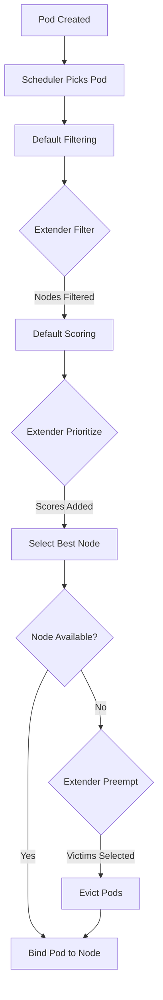
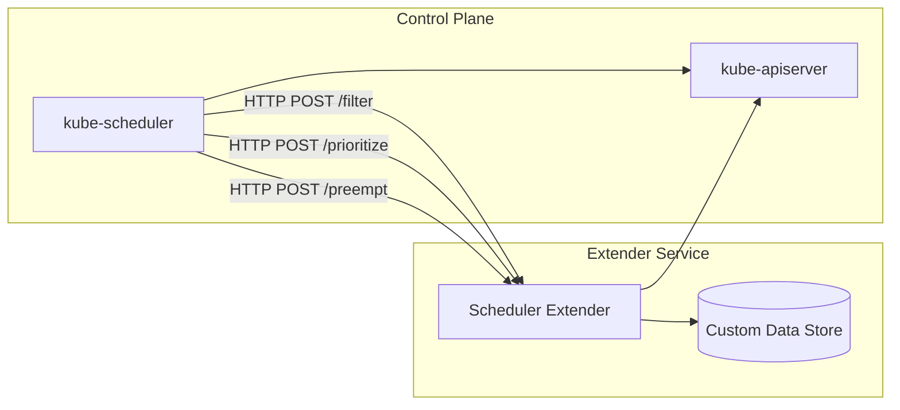
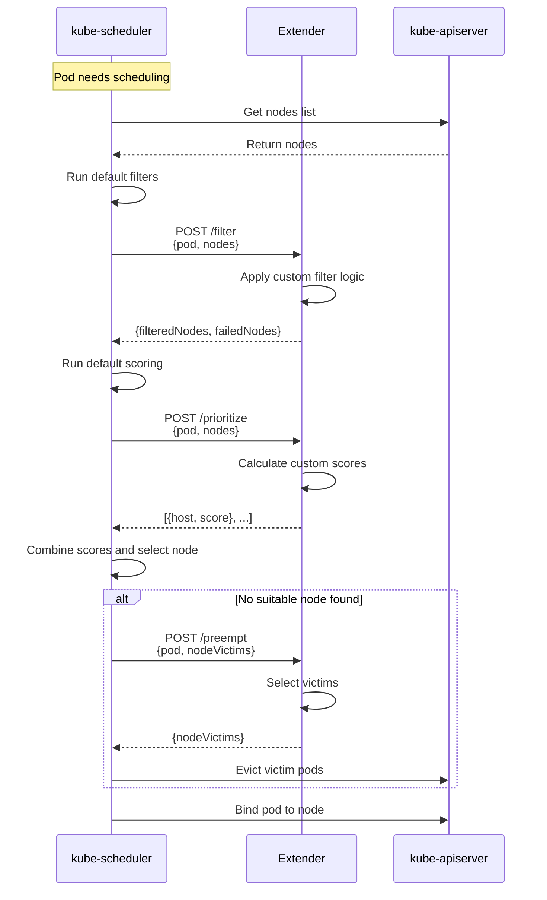

# How to Build Kubernetes Scheduler Extenders

Author: [nawazdhandala](https://github.com/nawazdhandala)

Tags: Kubernetes, Scheduler, Extenders, Custom Scheduling

Description: Learn to implement scheduler extenders for custom scheduling logic with filter, prioritize, and preempt functions for specialized workloads.

---

Kubernetes scheduler extenders provide a powerful mechanism to customize pod scheduling decisions without modifying the core scheduler code. This approach allows you to inject custom logic into the scheduling pipeline while maintaining compatibility with upstream Kubernetes releases.

## Understanding Scheduler Extenders

A scheduler extender is an HTTP(S) server that the Kubernetes scheduler calls during the scheduling cycle. The extender can influence scheduling decisions through three main functions:

- **Filter**: Remove nodes that should not run the pod
- **Prioritize**: Score remaining nodes to influence placement
- **Preempt**: Select victims for preemption when no nodes are available



## Architecture Overview

The scheduler extender runs as a separate service that communicates with the kube-scheduler via HTTP webhooks.



## Setting Up the Project

Create a new Go project for your scheduler extender:

```bash
mkdir scheduler-extender && cd scheduler-extender
go mod init github.com/yourorg/scheduler-extender
```

### Project Structure

```
scheduler-extender/
├── main.go
├── pkg/
│   ├── extender/
│   │   ├── filter.go
│   │   ├── prioritize.go
│   │   ├── preempt.go
│   │   └── types.go
│   └── handlers/
│       └── handlers.go
├── deploy/
│   ├── deployment.yaml
│   └── scheduler-config.yaml
└── go.mod
```

## Implementing the Extender Types

First, define the types that match the Kubernetes scheduler extender API:

```go
// pkg/extender/types.go
package extender

import (
    v1 "k8s.io/api/core/v1"
    "k8s.io/kube-scheduler/extender/v1"
)

// ExtenderArgs represents the arguments passed to the extender
type ExtenderArgs = extenderv1.ExtenderArgs

// ExtenderFilterResult represents the result of a filter call
type ExtenderFilterResult = extenderv1.ExtenderFilterResult

// ExtenderPreemptionResult represents preemption results
type ExtenderPreemptionResult = extenderv1.ExtenderPreemptionResult

// HostPriorityList contains priorities for hosts
type HostPriorityList = extenderv1.HostPriorityList

// HostPriority represents a single host priority
type HostPriority = extenderv1.HostPriority
```

## Implementing the Filter Function

The filter function removes nodes that should not run the pod based on custom criteria:

```go
// pkg/extender/filter.go
package extender

import (
    "fmt"
    "log"

    v1 "k8s.io/api/core/v1"
)

// Filter removes nodes that do not meet custom requirements
func Filter(args ExtenderArgs) (*ExtenderFilterResult, error) {
    pod := args.Pod
    nodes := args.Nodes.Items

    filteredNodes := []v1.Node{}
    failedNodes := make(map[string]string)

    // Check for custom scheduling annotation
    requiredZone, hasZoneReq := pod.Annotations["scheduler.example.com/zone"]
    requiredGPU, hasGPUReq := pod.Annotations["scheduler.example.com/gpu-type"]

    for _, node := range nodes {
        nodeName := node.Name
        nodeLabels := node.Labels

        // Custom zone filtering
        if hasZoneReq {
            nodeZone, ok := nodeLabels["topology.kubernetes.io/zone"]
            if !ok || nodeZone != requiredZone {
                failedNodes[nodeName] = fmt.Sprintf(
                    "node zone %s does not match required zone %s",
                    nodeZone, requiredZone,
                )
                continue
            }
        }

        // Custom GPU type filtering
        if hasGPUReq {
            nodeGPU, ok := nodeLabels["node.kubernetes.io/gpu-type"]
            if !ok || nodeGPU != requiredGPU {
                failedNodes[nodeName] = fmt.Sprintf(
                    "node GPU type %s does not match required type %s",
                    nodeGPU, requiredGPU,
                )
                continue
            }
        }

        // Node passes all custom filters
        filteredNodes = append(filteredNodes, node)
    }

    log.Printf("Filter: pod=%s, input_nodes=%d, filtered_nodes=%d",
        pod.Name, len(nodes), len(filteredNodes))

    return &ExtenderFilterResult{
        Nodes: &v1.NodeList{
            Items: filteredNodes,
        },
        FailedNodes: failedNodes,
    }, nil
}
```

## Implementing the Prioritize Function

The prioritize function scores nodes to influence where pods land:

```go
// pkg/extender/prioritize.go
package extender

import (
    "log"

    v1 "k8s.io/api/core/v1"
)

const (
    maxPriority = 10
    minPriority = 0
)

// Prioritize scores nodes based on custom criteria
func Prioritize(args ExtenderArgs) (*HostPriorityList, error) {
    pod := args.Pod
    nodes := args.Nodes.Items

    priorities := make(HostPriorityList, len(nodes))

    // Check for preferred placement annotations
    preferredRack := pod.Annotations["scheduler.example.com/preferred-rack"]
    preferSpot := pod.Annotations["scheduler.example.com/prefer-spot"] == "true"

    for i, node := range nodes {
        nodeName := node.Name
        score := int64(minPriority)

        // Score based on rack affinity
        if preferredRack != "" {
            nodeRack := node.Labels["topology.kubernetes.io/rack"]
            if nodeRack == preferredRack {
                score += 5
            }
        }

        // Score based on spot instance preference
        if preferSpot {
            isSpot := node.Labels["node.kubernetes.io/lifecycle"] == "spot"
            if isSpot {
                score += 3
            }
        }

        // Score based on existing pod colocation
        score += calculateColocationScore(pod, &node)

        // Ensure score is within bounds
        if score > maxPriority {
            score = maxPriority
        }

        priorities[i] = HostPriority{
            Host:  nodeName,
            Score: score,
        }
    }

    log.Printf("Prioritize: pod=%s, scored_nodes=%d", pod.Name, len(priorities))

    return &priorities, nil
}

// calculateColocationScore adds points for beneficial colocation
func calculateColocationScore(pod *v1.Pod, node *v1.Node) int64 {
    // Example: prefer nodes that already run pods from the same application
    appLabel := pod.Labels["app"]
    if appLabel == "" {
        return 0
    }

    // In production, you would query the API server for pods on this node
    // This is simplified for demonstration
    return 2
}
```

## Implementing the Preempt Function

The preempt function helps select which pods to evict when preemption is necessary:

```go
// pkg/extender/preempt.go
package extender

import (
    "log"
    "sort"

    v1 "k8s.io/api/core/v1"
    extenderv1 "k8s.io/kube-scheduler/extender/v1"
)

// Preempt selects victims for preemption based on custom criteria
func Preempt(args extenderv1.ExtenderPreemptionArgs) (*ExtenderPreemptionResult, error) {
    pod := args.Pod
    nodeNameToVictims := args.NodeNameToVictims

    result := &ExtenderPreemptionResult{
        NodeNameToMetaVictims: make(map[string]*extenderv1.MetaVictims),
    }

    for nodeName, victims := range nodeNameToVictims {
        if victims == nil || len(victims.Pods) == 0 {
            continue
        }

        // Sort victims by priority - prefer to evict lower priority pods
        sortedVictims := sortVictimsByPriority(victims.Pods)

        // Apply custom preemption policy
        selectedVictims := applyPreemptionPolicy(pod, sortedVictims)

        metaVictims := &extenderv1.MetaVictims{
            Pods: make([]*extenderv1.MetaPod, len(selectedVictims)),
        }

        for i, victim := range selectedVictims {
            metaVictims.Pods[i] = &extenderv1.MetaPod{
                UID: string(victim.UID),
            }
        }

        result.NodeNameToMetaVictims[nodeName] = metaVictims
    }

    log.Printf("Preempt: pod=%s, nodes_with_victims=%d",
        pod.Name, len(result.NodeNameToMetaVictims))

    return result, nil
}

// sortVictimsByPriority sorts pods by their priority class
func sortVictimsByPriority(pods []*v1.Pod) []*v1.Pod {
    sorted := make([]*v1.Pod, len(pods))
    copy(sorted, pods)

    sort.Slice(sorted, func(i, j int) bool {
        iPriority := getPodPriority(sorted[i])
        jPriority := getPodPriority(sorted[j])
        return iPriority < jPriority
    })

    return sorted
}

// getPodPriority returns the priority of a pod
func getPodPriority(pod *v1.Pod) int32 {
    if pod.Spec.Priority != nil {
        return *pod.Spec.Priority
    }
    return 0
}

// applyPreemptionPolicy applies custom preemption rules
func applyPreemptionPolicy(preemptor *v1.Pod, victims []*v1.Pod) []*v1.Pod {
    selected := []*v1.Pod{}

    for _, victim := range victims {
        // Never preempt system-critical pods
        if victim.Namespace == "kube-system" {
            continue
        }

        // Never preempt pods with protection annotation
        if victim.Annotations["scheduler.example.com/no-preempt"] == "true" {
            continue
        }

        // Avoid preempting pods from the same application
        if victim.Labels["app"] == preemptor.Labels["app"] {
            continue
        }

        selected = append(selected, victim)
    }

    return selected
}
```

## HTTP Handlers

Create the HTTP handlers that expose the extender endpoints:

```go
// pkg/handlers/handlers.go
package handlers

import (
    "encoding/json"
    "log"
    "net/http"

    "github.com/yourorg/scheduler-extender/pkg/extender"
    extenderv1 "k8s.io/kube-scheduler/extender/v1"
)

// FilterHandler handles filter requests
func FilterHandler(w http.ResponseWriter, r *http.Request) {
    var args extender.ExtenderArgs
    if err := json.NewDecoder(r.Body).Decode(&args); err != nil {
        http.Error(w, err.Error(), http.StatusBadRequest)
        log.Printf("Error decoding filter request: %v", err)
        return
    }

    result, err := extender.Filter(args)
    if err != nil {
        http.Error(w, err.Error(), http.StatusInternalServerError)
        log.Printf("Error in filter: %v", err)
        return
    }

    w.Header().Set("Content-Type", "application/json")
    if err := json.NewEncoder(w).Encode(result); err != nil {
        log.Printf("Error encoding filter response: %v", err)
    }
}

// PrioritizeHandler handles prioritize requests
func PrioritizeHandler(w http.ResponseWriter, r *http.Request) {
    var args extender.ExtenderArgs
    if err := json.NewDecoder(r.Body).Decode(&args); err != nil {
        http.Error(w, err.Error(), http.StatusBadRequest)
        log.Printf("Error decoding prioritize request: %v", err)
        return
    }

    result, err := extender.Prioritize(args)
    if err != nil {
        http.Error(w, err.Error(), http.StatusInternalServerError)
        log.Printf("Error in prioritize: %v", err)
        return
    }

    w.Header().Set("Content-Type", "application/json")
    if err := json.NewEncoder(w).Encode(result); err != nil {
        log.Printf("Error encoding prioritize response: %v", err)
    }
}

// PreemptHandler handles preemption requests
func PreemptHandler(w http.ResponseWriter, r *http.Request) {
    var args extenderv1.ExtenderPreemptionArgs
    if err := json.NewDecoder(r.Body).Decode(&args); err != nil {
        http.Error(w, err.Error(), http.StatusBadRequest)
        log.Printf("Error decoding preempt request: %v", err)
        return
    }

    result, err := extender.Preempt(args)
    if err != nil {
        http.Error(w, err.Error(), http.StatusInternalServerError)
        log.Printf("Error in preempt: %v", err)
        return
    }

    w.Header().Set("Content-Type", "application/json")
    if err := json.NewEncoder(w).Encode(result); err != nil {
        log.Printf("Error encoding preempt response: %v", err)
    }
}

// HealthHandler returns health status
func HealthHandler(w http.ResponseWriter, r *http.Request) {
    w.WriteHeader(http.StatusOK)
    w.Write([]byte("OK"))
}
```

## Main Application Entry Point

```go
// main.go
package main

import (
    "log"
    "net/http"
    "os"

    "github.com/yourorg/scheduler-extender/pkg/handlers"
)

func main() {
    port := os.Getenv("PORT")
    if port == "" {
        port = "8888"
    }

    mux := http.NewServeMux()

    // Register extender endpoints
    mux.HandleFunc("/filter", handlers.FilterHandler)
    mux.HandleFunc("/prioritize", handlers.PrioritizeHandler)
    mux.HandleFunc("/preempt", handlers.PreemptHandler)
    mux.HandleFunc("/healthz", handlers.HealthHandler)

    log.Printf("Starting scheduler extender on port %s", port)

    server := &http.Server{
        Addr:    ":" + port,
        Handler: mux,
    }

    if err := server.ListenAndServe(); err != nil {
        log.Fatalf("Failed to start server: %v", err)
    }
}
```

## Request and Response Flow

Here is how the scheduler interacts with the extender for each function:



## Kubernetes Deployment

### Extender Deployment

Deploy the extender as a Deployment in your cluster:

```yaml
# deploy/deployment.yaml
apiVersion: apps/v1
kind: Deployment
metadata:
  name: scheduler-extender
  namespace: kube-system
  labels:
    app: scheduler-extender
spec:
  replicas: 2
  selector:
    matchLabels:
      app: scheduler-extender
  template:
    metadata:
      labels:
        app: scheduler-extender
    spec:
      serviceAccountName: scheduler-extender
      containers:
      - name: extender
        image: yourorg/scheduler-extender:latest
        ports:
        - containerPort: 8888
          name: http
        resources:
          requests:
            cpu: 100m
            memory: 128Mi
          limits:
            cpu: 500m
            memory: 256Mi
        livenessProbe:
          httpGet:
            path: /healthz
            port: 8888
          initialDelaySeconds: 5
          periodSeconds: 10
        readinessProbe:
          httpGet:
            path: /healthz
            port: 8888
          initialDelaySeconds: 5
          periodSeconds: 5
      tolerations:
      - key: node-role.kubernetes.io/control-plane
        operator: Exists
        effect: NoSchedule
---
apiVersion: v1
kind: Service
metadata:
  name: scheduler-extender
  namespace: kube-system
spec:
  selector:
    app: scheduler-extender
  ports:
  - port: 8888
    targetPort: 8888
    name: http
---
apiVersion: v1
kind: ServiceAccount
metadata:
  name: scheduler-extender
  namespace: kube-system
---
apiVersion: rbac.authorization.k8s.io/v1
kind: ClusterRole
metadata:
  name: scheduler-extender
rules:
- apiGroups: [""]
  resources: ["nodes", "pods"]
  verbs: ["get", "list", "watch"]
- apiGroups: [""]
  resources: ["pods/status"]
  verbs: ["patch", "update"]
---
apiVersion: rbac.authorization.k8s.io/v1
kind: ClusterRoleBinding
metadata:
  name: scheduler-extender
roleRef:
  apiGroup: rbac.authorization.k8s.io
  kind: ClusterRole
  name: scheduler-extender
subjects:
- kind: ServiceAccount
  name: scheduler-extender
  namespace: kube-system
```

### Scheduler Configuration

Configure the kube-scheduler to use your extender:

```yaml
# deploy/scheduler-config.yaml
apiVersion: kubescheduler.config.k8s.io/v1
kind: KubeSchedulerConfiguration
clientConnection:
  kubeconfig: /etc/kubernetes/scheduler.conf
profiles:
- schedulerName: default-scheduler
  plugins:
    preFilter:
      enabled:
      - name: NodeResourcesFit
    filter:
      enabled:
      - name: NodeResourcesFit
      - name: NodeAffinity
    score:
      enabled:
      - name: NodeResourcesBalancedAllocation
        weight: 1
extenders:
- urlPrefix: "http://scheduler-extender.kube-system.svc.cluster.local:8888"
  filterVerb: "filter"
  prioritizeVerb: "prioritize"
  preemptVerb: "preempt"
  weight: 5
  enableHTTPS: false
  nodeCacheCapable: false
  managedResources:
  - name: "example.com/custom-resource"
    ignoredByScheduler: true
  ignorable: false
```

### Applying the Configuration

For managed Kubernetes clusters, you may need to deploy a secondary scheduler:

```yaml
# deploy/secondary-scheduler.yaml
apiVersion: apps/v1
kind: Deployment
metadata:
  name: custom-scheduler
  namespace: kube-system
  labels:
    app: custom-scheduler
spec:
  replicas: 1
  selector:
    matchLabels:
      app: custom-scheduler
  template:
    metadata:
      labels:
        app: custom-scheduler
    spec:
      serviceAccountName: custom-scheduler
      containers:
      - name: scheduler
        image: registry.k8s.io/kube-scheduler:v1.29.0
        command:
        - kube-scheduler
        - --config=/etc/kubernetes/scheduler-config.yaml
        - --leader-elect=true
        - --leader-elect-resource-name=custom-scheduler
        volumeMounts:
        - name: config
          mountPath: /etc/kubernetes/scheduler-config.yaml
          subPath: scheduler-config.yaml
      volumes:
      - name: config
        configMap:
          name: custom-scheduler-config
---
apiVersion: v1
kind: ConfigMap
metadata:
  name: custom-scheduler-config
  namespace: kube-system
data:
  scheduler-config.yaml: |
    apiVersion: kubescheduler.config.k8s.io/v1
    kind: KubeSchedulerConfiguration
    profiles:
    - schedulerName: custom-scheduler
    extenders:
    - urlPrefix: "http://scheduler-extender.kube-system.svc.cluster.local:8888"
      filterVerb: "filter"
      prioritizeVerb: "prioritize"
      preemptVerb: "preempt"
      weight: 5
      enableHTTPS: false
```

## Using the Custom Scheduler

To use your custom scheduler with a pod, specify the scheduler name:

```yaml
apiVersion: v1
kind: Pod
metadata:
  name: custom-scheduled-pod
  annotations:
    scheduler.example.com/zone: "us-west-2a"
    scheduler.example.com/gpu-type: "nvidia-a100"
    scheduler.example.com/preferred-rack: "rack-42"
spec:
  schedulerName: custom-scheduler
  containers:
  - name: app
    image: nginx:latest
    resources:
      requests:
        cpu: 100m
        memory: 128Mi
```

## Testing the Extender

Create a simple test to verify your extender works correctly:

```go
// pkg/extender/filter_test.go
package extender

import (
    "testing"

    v1 "k8s.io/api/core/v1"
    metav1 "k8s.io/apimachinery/pkg/apis/meta/v1"
)

func TestFilter(t *testing.T) {
    tests := []struct {
        name           string
        podAnnotations map[string]string
        nodes          []v1.Node
        expectedCount  int
    }{
        {
            name: "filter by zone",
            podAnnotations: map[string]string{
                "scheduler.example.com/zone": "us-west-2a",
            },
            nodes: []v1.Node{
                {
                    ObjectMeta: metav1.ObjectMeta{
                        Name: "node-1",
                        Labels: map[string]string{
                            "topology.kubernetes.io/zone": "us-west-2a",
                        },
                    },
                },
                {
                    ObjectMeta: metav1.ObjectMeta{
                        Name: "node-2",
                        Labels: map[string]string{
                            "topology.kubernetes.io/zone": "us-west-2b",
                        },
                    },
                },
            },
            expectedCount: 1,
        },
        {
            name:           "no filter annotations",
            podAnnotations: map[string]string{},
            nodes: []v1.Node{
                {ObjectMeta: metav1.ObjectMeta{Name: "node-1"}},
                {ObjectMeta: metav1.ObjectMeta{Name: "node-2"}},
            },
            expectedCount: 2,
        },
    }

    for _, tt := range tests {
        t.Run(tt.name, func(t *testing.T) {
            args := ExtenderArgs{
                Pod: &v1.Pod{
                    ObjectMeta: metav1.ObjectMeta{
                        Name:        "test-pod",
                        Annotations: tt.podAnnotations,
                    },
                },
                Nodes: &v1.NodeList{
                    Items: tt.nodes,
                },
            }

            result, err := Filter(args)
            if err != nil {
                t.Fatalf("Filter returned error: %v", err)
            }

            if len(result.Nodes.Items) != tt.expectedCount {
                t.Errorf("Expected %d nodes, got %d",
                    tt.expectedCount, len(result.Nodes.Items))
            }
        })
    }
}
```

## Best Practices

### Performance Considerations

1. **Keep filter functions fast** - The scheduler waits for extender responses synchronously
2. **Use caching** - Cache node information and custom data to reduce API calls
3. **Set appropriate timeouts** - Configure HTTP client timeouts to prevent hung requests

```go
// Example: HTTP client with timeout
client := &http.Client{
    Timeout: 5 * time.Second,
}
```

### Error Handling

1. **Return partial results** - If some nodes cannot be evaluated, filter them out rather than failing
2. **Log extensively** - Include pod name, node count, and timing in logs
3. **Graceful degradation** - If the extender fails, consider whether pods should still schedule

### Security

1. **Use HTTPS in production** - Enable TLS between scheduler and extender
2. **Network policies** - Restrict access to the extender service
3. **RBAC** - Minimize permissions granted to the extender service account

```yaml
# Enable HTTPS in extender configuration
extenders:
- urlPrefix: "https://scheduler-extender.kube-system.svc.cluster.local:8443"
  enableHTTPS: true
  tlsConfig:
    insecure: false
    certFile: /etc/ssl/certs/extender.crt
    keyFile: /etc/ssl/private/extender.key
```

## Monitoring and Observability

Add metrics to track extender performance:

```go
import (
    "github.com/prometheus/client_golang/prometheus"
    "github.com/prometheus/client_golang/prometheus/promhttp"
)

var (
    filterDuration = prometheus.NewHistogramVec(
        prometheus.HistogramOpts{
            Name:    "scheduler_extender_filter_duration_seconds",
            Help:    "Duration of filter operations",
            Buckets: prometheus.DefBuckets,
        },
        []string{"result"},
    )

    filterNodeCount = prometheus.NewGaugeVec(
        prometheus.GaugeOpts{
            Name: "scheduler_extender_filter_nodes",
            Help: "Number of nodes after filtering",
        },
        []string{"pod_namespace"},
    )
)

func init() {
    prometheus.MustRegister(filterDuration)
    prometheus.MustRegister(filterNodeCount)
}
```

## Conclusion

Kubernetes scheduler extenders provide a flexible way to implement custom scheduling logic without forking the scheduler. By implementing filter, prioritize, and preempt functions, you can control pod placement based on your organization's specific requirements - whether that is hardware affinity, cost optimization, compliance requirements, or custom resource management.

Key takeaways:

- Extenders communicate via HTTP webhooks, making them language-agnostic
- Filter functions remove unsuitable nodes from consideration
- Prioritize functions influence node selection through scoring
- Preempt functions control which pods get evicted during preemption
- Deploy extenders with high availability for production use
- Monitor extender performance to catch scheduling bottlenecks

For more complex scheduling requirements, consider the Scheduling Framework, which provides deeper integration points but requires building a custom scheduler binary.
