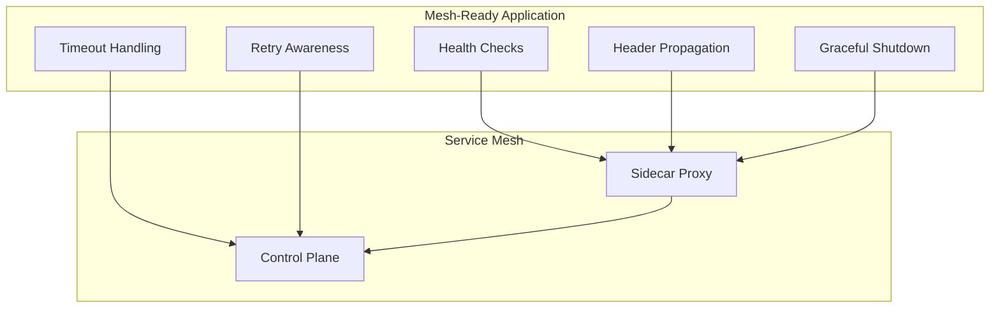
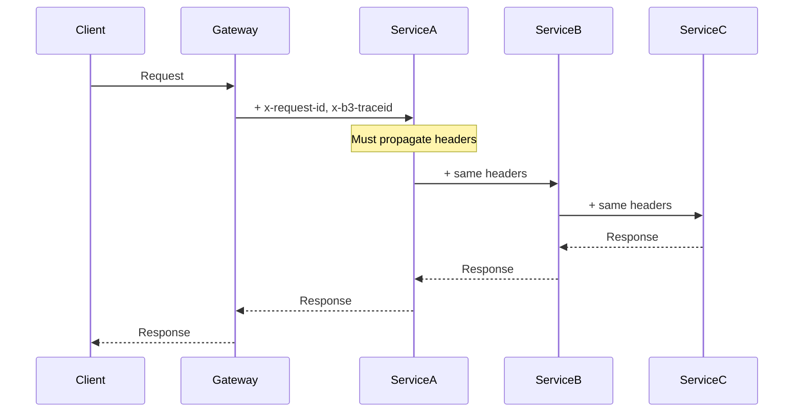
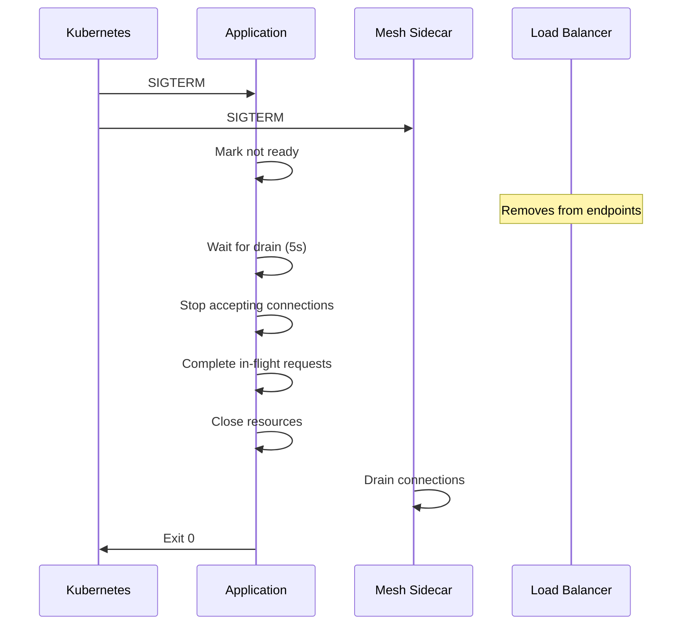
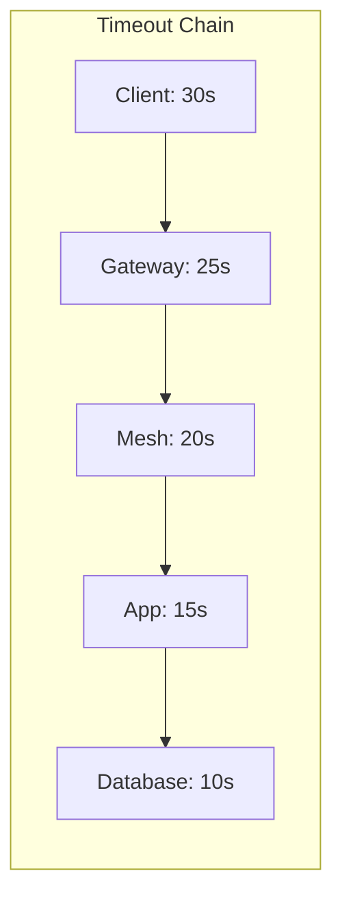

# How to Build Kubernetes Service Mesh Ready Apps

Author: [nawazdhandala](https://github.com/nawazdhandala)

Tags: Kubernetes, Service Mesh, Istio, Linkerd

Description: Learn to build service mesh ready applications with proper health checks, graceful shutdown, and header propagation for Istio and Linkerd compatibility.

---

Service meshes like Istio and Linkerd provide powerful features - traffic management, security, and observability - but your applications need to be built correctly to take full advantage. A mesh-ready application handles health probes properly, propagates tracing headers, respects timeouts, and shuts down gracefully. Building these capabilities from the start saves hours of debugging mysterious mesh behavior later.

## What Makes an Application Mesh-Ready?



A mesh-ready application:
- Exposes separate liveness and readiness probes
- Propagates tracing and routing headers
- Handles SIGTERM for graceful shutdown
- Configures appropriate timeouts
- Implements idempotent operations for retry safety

## Health Probes for Service Mesh

Service meshes rely on Kubernetes health probes to manage traffic routing. Misconfigured probes cause cascading failures or traffic blackholes.

### Liveness vs Readiness vs Startup Probes

| Probe | Purpose | Mesh Behavior on Failure |
|-------|---------|-------------------------|
| Liveness | Is the process alive? | Pod restarted |
| Readiness | Can it handle traffic? | Removed from endpoints |
| Startup | Has initialization completed? | Liveness/readiness delayed |

### Implementing Health Endpoints

```javascript
// health.js - Express health check endpoints for mesh compatibility
const express = require('express');
const router = express.Router();

let isReady = false;
let isLive = true;
let isTerminating = false;

// Dependencies to check
const dependencies = {
  database: { healthy: false, lastCheck: null },
  cache: { healthy: false, lastCheck: null },
};

// Liveness - is the process fundamentally working?
router.get('/healthz', (req, res) => {
  if (isLive && !isTerminating) {
    res.status(200).json({ status: 'alive' });
  } else {
    res.status(500).json({ status: 'dead', terminating: isTerminating });
  }
});

// Readiness - can we handle traffic?
router.get('/ready', (req, res) => {
  if (!isReady || isTerminating) {
    res.status(503).json({
      status: 'not ready',
      terminating: isTerminating,
      dependencies,
    });
    return;
  }

  // Check critical dependencies
  const unhealthy = Object.entries(dependencies)
    .filter(([_, dep]) => !dep.healthy)
    .map(([name]) => name);

  if (unhealthy.length > 0) {
    res.status(503).json({
      status: 'dependencies unhealthy',
      unhealthy,
    });
    return;
  }

  res.status(200).json({ status: 'ready', dependencies });
});

// Startup - has initialization completed?
router.get('/startup', (req, res) => {
  if (isReady) {
    res.status(200).json({ status: 'started' });
  } else {
    res.status(503).json({ status: 'starting' });
  }
});

// Functions to update health state
function setReady(ready) {
  isReady = ready;
}

function setTerminating() {
  isTerminating = true;
  isReady = false;
}

function updateDependency(name, healthy) {
  if (dependencies[name]) {
    dependencies[name].healthy = healthy;
    dependencies[name].lastCheck = new Date().toISOString();
  }
}

module.exports = { router, setReady, setTerminating, updateDependency };
```

### Kubernetes Deployment Configuration

```yaml
apiVersion: apps/v1
kind: Deployment
metadata:
  name: mesh-ready-app
spec:
  template:
    spec:
      terminationGracePeriodSeconds: 30
      containers:
        - name: app
          image: my-app:latest
          ports:
            - containerPort: 8080
              name: http
          startupProbe:
            httpGet:
              path: /startup
              port: 8080
            initialDelaySeconds: 5
            periodSeconds: 5
            failureThreshold: 30  # 150 seconds max startup time
          livenessProbe:
            httpGet:
              path: /healthz
              port: 8080
            periodSeconds: 10
            timeoutSeconds: 5
            failureThreshold: 3
          readinessProbe:
            httpGet:
              path: /ready
              port: 8080
            periodSeconds: 5
            timeoutSeconds: 3
            failureThreshold: 2
```

### Istio-Specific Probe Configuration

Istio can intercept probe traffic. For apps that need probes to bypass the sidecar:

```yaml
apiVersion: apps/v1
kind: Deployment
metadata:
  name: mesh-ready-app
  annotations:
    # Use dedicated probe port that bypasses Envoy
    sidecar.istio.io/rewriteAppHTTPProbers: "true"
spec:
  template:
    spec:
      containers:
        - name: app
          # Probes are automatically rewritten to go through Envoy
          livenessProbe:
            httpGet:
              path: /healthz
              port: 8080
```

## Header Propagation for Distributed Tracing

Service meshes generate trace context headers. Your application must propagate these headers to downstream services for end-to-end tracing.



### Headers to Propagate

**Istio/Envoy headers:**
- `x-request-id` - Request identifier
- `x-b3-traceid` - Zipkin trace ID
- `x-b3-spanid` - Zipkin span ID
- `x-b3-parentspanid` - Parent span ID
- `x-b3-sampled` - Sampling decision
- `x-b3-flags` - Debug flag
- `x-ot-span-context` - OpenTracing context

**W3C Trace Context (recommended):**
- `traceparent` - Trace context
- `tracestate` - Vendor-specific trace data

**Routing headers:**
- `x-envoy-retry-on` - Retry conditions
- `x-envoy-max-retries` - Max retry count

### Express Middleware for Header Propagation

```javascript
// header-propagation.js
const PROPAGATE_HEADERS = [
  // Istio/Envoy
  'x-request-id',
  'x-b3-traceid',
  'x-b3-spanid',
  'x-b3-parentspanid',
  'x-b3-sampled',
  'x-b3-flags',
  'x-ot-span-context',
  // W3C Trace Context
  'traceparent',
  'tracestate',
  // Custom routing
  'x-custom-header',
];

// Middleware to extract headers from incoming request
function extractTraceHeaders(req, res, next) {
  req.traceHeaders = {};

  for (const header of PROPAGATE_HEADERS) {
    const value = req.get(header);
    if (value) {
      req.traceHeaders[header] = value;
    }
  }

  next();
}

// Helper to create HTTP client with propagated headers
function createTracedFetch(traceHeaders) {
  return async function tracedFetch(url, options = {}) {
    const headers = {
      ...options.headers,
      ...traceHeaders,
    };

    return fetch(url, { ...options, headers });
  };
}

// Usage with axios
const axios = require('axios');

function createTracedAxios(traceHeaders) {
  const instance = axios.create();

  instance.interceptors.request.use((config) => {
    config.headers = {
      ...config.headers,
      ...traceHeaders,
    };
    return config;
  });

  return instance;
}

module.exports = {
  extractTraceHeaders,
  createTracedFetch,
  createTracedAxios,
  PROPAGATE_HEADERS,
};
```

### Using Header Propagation in Routes

```javascript
const express = require('express');
const { extractTraceHeaders, createTracedAxios } = require('./header-propagation');

const app = express();

// Apply middleware globally
app.use(extractTraceHeaders);

app.get('/api/orders/:id', async (req, res) => {
  // Create traced HTTP client with propagated headers
  const http = createTracedAxios(req.traceHeaders);

  try {
    // Headers are automatically propagated to downstream services
    const [user, inventory] = await Promise.all([
      http.get(`http://user-service/users/${req.params.userId}`),
      http.get(`http://inventory-service/stock/${req.params.productId}`),
    ]);

    res.json({
      order: req.params.id,
      user: user.data,
      inventory: inventory.data,
    });
  } catch (error) {
    res.status(500).json({ error: error.message });
  }
});
```

### Python Flask Header Propagation

```python
# header_propagation.py
from flask import request, g
import requests

PROPAGATE_HEADERS = [
    'x-request-id',
    'x-b3-traceid',
    'x-b3-spanid',
    'x-b3-parentspanid',
    'x-b3-sampled',
    'x-b3-flags',
    'x-ot-span-context',
    'traceparent',
    'tracestate',
]

def extract_trace_headers():
    """Extract trace headers from incoming request"""
    g.trace_headers = {}
    for header in PROPAGATE_HEADERS:
        value = request.headers.get(header)
        if value:
            g.trace_headers[header] = value

def traced_request(method, url, **kwargs):
    """Make HTTP request with propagated trace headers"""
    headers = kwargs.pop('headers', {})
    headers.update(getattr(g, 'trace_headers', {}))
    return requests.request(method, url, headers=headers, **kwargs)

# Flask app setup
from flask import Flask
app = Flask(__name__)

@app.before_request
def before_request():
    extract_trace_headers()

@app.route('/api/orders/<order_id>')
def get_order(order_id):
    # Headers automatically propagated
    user = traced_request('GET', f'http://user-service/users/{order_id}')
    return {'order': order_id, 'user': user.json()}
```

## Graceful Shutdown for Mesh Compatibility

When a pod terminates, the mesh sidecar needs time to drain connections. Poor shutdown handling causes dropped requests.



### Graceful Shutdown Implementation

```javascript
// graceful-shutdown.js
const { setTerminating } = require('./health');

class GracefulShutdown {
  constructor(server, options = {}) {
    this.server = server;
    this.drainDelay = options.drainDelay || 5000;  // Wait for LB to remove us
    this.shutdownTimeout = options.shutdownTimeout || 25000;
    this.isShuttingDown = false;
    this.connections = new Set();
    this.cleanupHandlers = [];

    // Track connections
    server.on('connection', (socket) => {
      this.connections.add(socket);
      socket.on('close', () => this.connections.delete(socket));
    });
  }

  registerCleanup(name, handler) {
    this.cleanupHandlers.push({ name, handler });
  }

  async shutdown(signal) {
    if (this.isShuttingDown) return;
    this.isShuttingDown = true;

    console.log(`[Shutdown] Received ${signal}`);

    // Step 1: Mark as not ready for mesh
    setTerminating();
    console.log('[Shutdown] Marked as not ready');

    // Step 2: Wait for mesh/LB to drain traffic
    console.log(`[Shutdown] Waiting ${this.drainDelay}ms for traffic drain`);
    await this.sleep(this.drainDelay);

    // Step 3: Stop accepting new connections
    await this.closeServer();
    console.log('[Shutdown] Server closed to new connections');

    // Step 4: Run cleanup handlers
    for (const { name, handler } of this.cleanupHandlers) {
      try {
        console.log(`[Shutdown] Cleaning up ${name}`);
        await Promise.race([
          handler(),
          this.sleep(5000).then(() => {
            throw new Error('Cleanup timeout');
          }),
        ]);
      } catch (err) {
        console.error(`[Shutdown] Error cleaning up ${name}:`, err.message);
      }
    }

    // Step 5: Force close remaining connections
    if (this.connections.size > 0) {
      console.log(`[Shutdown] Closing ${this.connections.size} remaining connections`);
      for (const socket of this.connections) {
        socket.destroy();
      }
    }

    console.log('[Shutdown] Complete');
    process.exit(0);
  }

  closeServer() {
    return new Promise((resolve) => {
      this.server.close(resolve);
    });
  }

  sleep(ms) {
    return new Promise((resolve) => setTimeout(resolve, ms));
  }

  listen() {
    process.on('SIGTERM', () => this.shutdown('SIGTERM'));
    process.on('SIGINT', () => this.shutdown('SIGINT'));
  }
}

module.exports = GracefulShutdown;
```

### PreStop Hook Configuration

Add a preStop hook to give the mesh sidecar time to update:

```yaml
apiVersion: apps/v1
kind: Deployment
spec:
  template:
    spec:
      terminationGracePeriodSeconds: 30
      containers:
        - name: app
          lifecycle:
            preStop:
              exec:
                # Give mesh time to update endpoints
                command: ["sleep", "5"]
```

## Timeout Configuration

Timeouts must be coordinated between your app, the mesh, and upstream services. Misconfigured timeouts cause premature request termination or hung connections.



**Rule: Each layer's timeout must be shorter than the layer above it.**

### Application Timeout Configuration

```javascript
// timeout-config.js
const config = {
  // HTTP server timeout
  server: {
    keepAliveTimeout: 65000,  // Must be > ALB idle timeout (60s)
    headersTimeout: 66000,     // Must be > keepAliveTimeout
    requestTimeout: 30000,     // Max time for entire request
  },

  // Outbound HTTP client timeouts
  http: {
    connect: 5000,     // Connection establishment
    response: 15000,   // Time to first byte
    deadline: 20000,   // Total request time
  },

  // Database timeouts
  database: {
    connectionTimeout: 5000,
    queryTimeout: 10000,
    idleTimeout: 30000,
  },

  // Redis timeouts
  redis: {
    connectTimeout: 5000,
    commandTimeout: 3000,
  },
};

module.exports = config;
```

### Istio VirtualService Timeout

```yaml
apiVersion: networking.istio.io/v1beta1
kind: VirtualService
metadata:
  name: my-service
spec:
  hosts:
    - my-service
  http:
    - route:
        - destination:
            host: my-service
            port:
              number: 8080
      timeout: 20s  # Must be < client timeout
      retries:
        attempts: 3
        perTryTimeout: 5s  # Each retry gets 5s
        retryOn: 5xx,reset,connect-failure,retriable-4xx
```

### Linkerd Service Profile Timeout

```yaml
apiVersion: linkerd.io/v1alpha2
kind: ServiceProfile
metadata:
  name: my-service.default.svc.cluster.local
  namespace: default
spec:
  routes:
    - name: GET /api/orders
      condition:
        method: GET
        pathRegex: /api/orders.*
      timeout: 20s
      isRetryable: true
```

## Retry Configuration and Idempotency

Service meshes can automatically retry failed requests. Your app must be designed to handle retries safely.

### Making Operations Idempotent

```javascript
// idempotency.js
const crypto = require('crypto');

class IdempotencyStore {
  constructor(redis) {
    this.redis = redis;
    this.ttl = 86400;  // 24 hours
  }

  generateKey(requestId, operation) {
    return `idempotency:${operation}:${requestId}`;
  }

  async checkOrSet(requestId, operation, handler) {
    const key = this.generateKey(requestId, operation);

    // Try to get existing result
    const existing = await this.redis.get(key);
    if (existing) {
      return { cached: true, result: JSON.parse(existing) };
    }

    // Execute operation
    const result = await handler();

    // Store result for future identical requests
    await this.redis.setex(key, this.ttl, JSON.stringify(result));

    return { cached: false, result };
  }
}

// Usage in Express route
const idempotency = new IdempotencyStore(redis);

app.post('/api/orders', async (req, res) => {
  // Use x-request-id from mesh for idempotency
  const requestId = req.get('x-request-id') || crypto.randomUUID();

  const { cached, result } = await idempotency.checkOrSet(
    requestId,
    'create-order',
    async () => {
      // This will only execute once per request ID
      const order = await createOrder(req.body);
      return { orderId: order.id, status: 'created' };
    }
  );

  if (cached) {
    res.set('x-idempotent-replay', 'true');
  }

  res.status(201).json(result);
});
```

### Istio Retry Configuration

```yaml
apiVersion: networking.istio.io/v1beta1
kind: VirtualService
metadata:
  name: order-service
spec:
  hosts:
    - order-service
  http:
    - match:
        - uri:
            prefix: /api/orders
          method:
            exact: GET  # Only retry safe methods by default
      route:
        - destination:
            host: order-service
      retries:
        attempts: 3
        perTryTimeout: 5s
        retryOn: 5xx,reset,connect-failure

    - match:
        - uri:
            prefix: /api/orders
          method:
            exact: POST
          headers:
            x-idempotency-key:
              regex: .+  # Only retry if idempotency key present
      route:
        - destination:
            host: order-service
      retries:
        attempts: 2
        perTryTimeout: 10s
        retryOn: 5xx,reset
```

## Mesh-Specific Annotations

### Istio Annotations

```yaml
apiVersion: apps/v1
kind: Deployment
metadata:
  name: my-app
spec:
  template:
    metadata:
      annotations:
        # Sidecar injection
        sidecar.istio.io/inject: "true"

        # Resource limits for sidecar
        sidecar.istio.io/proxyCPU: "100m"
        sidecar.istio.io/proxyMemory: "128Mi"
        sidecar.istio.io/proxyCPULimit: "500m"
        sidecar.istio.io/proxyMemoryLimit: "256Mi"

        # Traffic interception
        traffic.sidecar.istio.io/excludeOutboundPorts: "5432"  # Skip DB
        traffic.sidecar.istio.io/includeInboundPorts: "8080"

        # Logging
        sidecar.istio.io/componentLogLevel: "misc:error"

        # Probe rewriting
        sidecar.istio.io/rewriteAppHTTPProbers: "true"
    spec:
      containers:
        - name: app
```

### Linkerd Annotations

```yaml
apiVersion: apps/v1
kind: Deployment
metadata:
  name: my-app
spec:
  template:
    metadata:
      annotations:
        # Sidecar injection
        linkerd.io/inject: enabled

        # Resource configuration
        config.linkerd.io/proxy-cpu-request: "100m"
        config.linkerd.io/proxy-memory-request: "128Mi"
        config.linkerd.io/proxy-cpu-limit: "500m"
        config.linkerd.io/proxy-memory-limit: "256Mi"

        # Skip certain ports
        config.linkerd.io/skip-outbound-ports: "5432,6379"

        # Protocol detection
        config.linkerd.io/opaque-ports: "3306"  # MySQL

        # Access logging
        config.linkerd.io/access-log: "apache"
    spec:
      containers:
        - name: app
```

## Complete Mesh-Ready Application Example

Here is a complete Express application following all mesh-ready best practices:

```javascript
// app.js - Complete mesh-ready Node.js application
const express = require('express');
const { createClient } = require('redis');

// Configuration
const config = {
  port: process.env.PORT || 8080,
  drainDelay: parseInt(process.env.DRAIN_DELAY) || 5000,
  shutdownTimeout: parseInt(process.env.SHUTDOWN_TIMEOUT) || 25000,
};

// Headers to propagate for distributed tracing
const TRACE_HEADERS = [
  'x-request-id', 'x-b3-traceid', 'x-b3-spanid',
  'x-b3-parentspanid', 'x-b3-sampled', 'x-b3-flags',
  'x-ot-span-context', 'traceparent', 'tracestate',
];

// Application state
const state = {
  isReady: false,
  isTerminating: false,
  connections: new Set(),
  cleanupHandlers: [],
};

// Express app
const app = express();
app.use(express.json());

// Middleware: Extract trace headers
app.use((req, res, next) => {
  req.traceHeaders = {};
  for (const header of TRACE_HEADERS) {
    const value = req.get(header);
    if (value) req.traceHeaders[header] = value;
  }
  next();
});

// Middleware: Reject requests during shutdown
app.use((req, res, next) => {
  if (state.isTerminating) {
    return res.status(503).json({ error: 'Service shutting down' });
  }
  next();
});

// Health endpoints
app.get('/healthz', (req, res) => {
  res.status(state.isTerminating ? 500 : 200).json({
    status: state.isTerminating ? 'terminating' : 'alive',
  });
});

app.get('/ready', (req, res) => {
  const ready = state.isReady && !state.isTerminating;
  res.status(ready ? 200 : 503).json({
    status: ready ? 'ready' : 'not ready',
    terminating: state.isTerminating,
  });
});

app.get('/startup', (req, res) => {
  res.status(state.isReady ? 200 : 503).json({
    status: state.isReady ? 'started' : 'starting',
  });
});

// Business endpoints
app.get('/api/data', async (req, res) => {
  // Trace headers available in req.traceHeaders
  // Propagate them to any downstream HTTP calls

  res.json({ message: 'Hello from mesh-ready app' });
});

// Graceful shutdown handler
async function shutdown(signal) {
  if (state.isTerminating) return;
  state.isTerminating = true;
  state.isReady = false;

  console.log(`[Shutdown] Received ${signal}`);
  console.log(`[Shutdown] Waiting ${config.drainDelay}ms for drain`);
  await new Promise((r) => setTimeout(r, config.drainDelay));

  console.log('[Shutdown] Closing server');
  await new Promise((r) => server.close(r));

  for (const { name, handler } of state.cleanupHandlers) {
    try {
      console.log(`[Shutdown] Cleanup: ${name}`);
      await handler();
    } catch (err) {
      console.error(`[Shutdown] Error: ${name}:`, err.message);
    }
  }

  for (const socket of state.connections) {
    socket.destroy();
  }

  console.log('[Shutdown] Complete');
  process.exit(0);
}

// Start server
const server = app.listen(config.port, async () => {
  console.log(`Server listening on port ${config.port}`);

  // Initialize dependencies here
  // await connectDatabase();
  // await connectRedis();

  state.isReady = true;
  console.log('Application ready');
});

// Track connections for graceful shutdown
server.on('connection', (socket) => {
  state.connections.add(socket);
  socket.on('close', () => state.connections.delete(socket));
});

// Configure server timeouts
server.keepAliveTimeout = 65000;
server.headersTimeout = 66000;

// Register signal handlers
process.on('SIGTERM', () => shutdown('SIGTERM'));
process.on('SIGINT', () => shutdown('SIGINT'));
```

## Deployment Manifest

```yaml
apiVersion: apps/v1
kind: Deployment
metadata:
  name: mesh-ready-app
  labels:
    app: mesh-ready-app
spec:
  replicas: 3
  selector:
    matchLabels:
      app: mesh-ready-app
  template:
    metadata:
      labels:
        app: mesh-ready-app
      annotations:
        # Istio
        sidecar.istio.io/inject: "true"
        sidecar.istio.io/rewriteAppHTTPProbers: "true"
        # Linkerd
        linkerd.io/inject: enabled
    spec:
      terminationGracePeriodSeconds: 30
      containers:
        - name: app
          image: mesh-ready-app:latest
          ports:
            - containerPort: 8080
              name: http
          env:
            - name: PORT
              value: "8080"
            - name: DRAIN_DELAY
              value: "5000"
            - name: SHUTDOWN_TIMEOUT
              value: "25000"
          resources:
            requests:
              cpu: 100m
              memory: 128Mi
            limits:
              cpu: 500m
              memory: 256Mi
          startupProbe:
            httpGet:
              path: /startup
              port: 8080
            initialDelaySeconds: 5
            periodSeconds: 5
            failureThreshold: 30
          livenessProbe:
            httpGet:
              path: /healthz
              port: 8080
            periodSeconds: 10
            timeoutSeconds: 5
            failureThreshold: 3
          readinessProbe:
            httpGet:
              path: /ready
              port: 8080
            periodSeconds: 5
            timeoutSeconds: 3
            failureThreshold: 2
          lifecycle:
            preStop:
              exec:
                command: ["sleep", "5"]
---
apiVersion: v1
kind: Service
metadata:
  name: mesh-ready-app
spec:
  selector:
    app: mesh-ready-app
  ports:
    - port: 80
      targetPort: 8080
      name: http
```

## Mesh-Ready Checklist

Use this checklist before deploying to a service mesh:

- [ ] Separate liveness and readiness health endpoints
- [ ] Startup probe for slow-starting apps
- [ ] Readiness returns 503 during shutdown
- [ ] SIGTERM handler with drain delay
- [ ] terminationGracePeriodSeconds > shutdown timeout
- [ ] preStop hook for mesh sync
- [ ] Trace header propagation to downstream calls
- [ ] Server timeouts configured correctly
- [ ] Keep-alive timeout > load balancer idle timeout
- [ ] Idempotent POST/PUT operations
- [ ] Mesh-specific annotations added
- [ ] Resources specified for sidecar sizing

---

Building mesh-ready applications requires attention to health checks, header propagation, graceful shutdown, and timeout coordination. Get these right from the start and your services will integrate smoothly with Istio, Linkerd, or any service mesh you choose. The patterns here work across languages - the concepts remain the same whether you are writing JavaScript, Python, Go, or Java.
