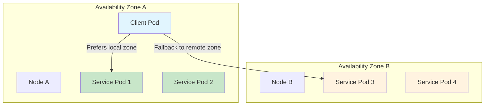
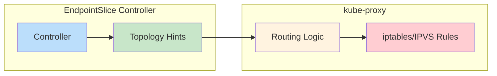
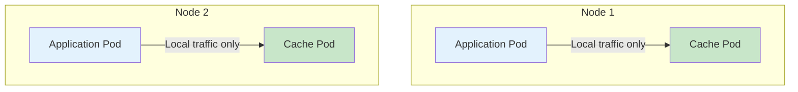
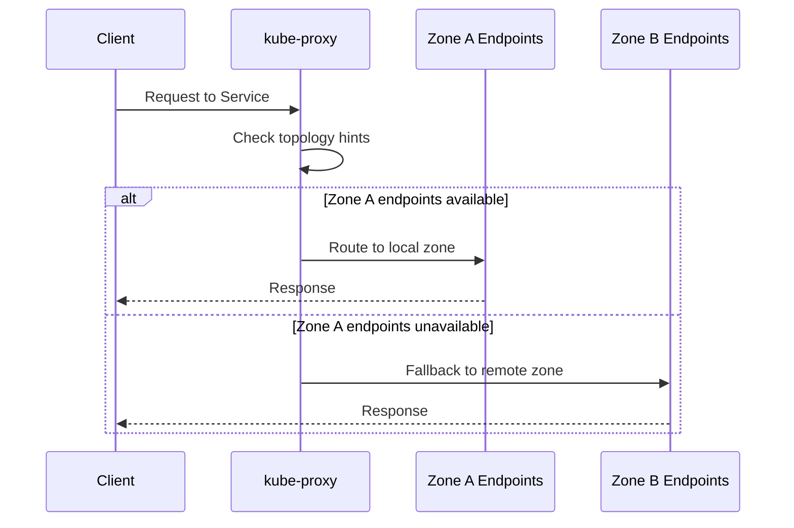
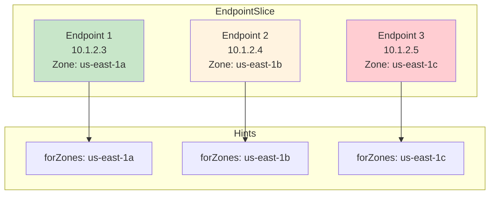

# How to Implement Kubernetes Service Topology

Author: [nawazdhandala](https://github.com/nawazdhandala)

Tags: Kubernetes, Service Topology, Traffic Routing, Topology Aware

Description: Learn to implement service topology for locality-aware routing with topology keys, zone preference, and traffic optimization.

---

## Introduction

Kubernetes Service Topology enables you to route traffic based on the topology of your cluster. Instead of distributing traffic randomly across all endpoints, you can prefer endpoints that are closer to the originating node - reducing latency, lowering cross-zone data transfer costs, and improving overall application performance.

In this guide, we will explore how to implement service topology for locality-aware traffic routing, covering topology keys, zone and node preferences, fallback behavior, and EndpointSlice topology.

## Understanding Service Topology

Service Topology allows a Service to route traffic based on the Node labels of the cluster. This feature uses topology keys to define a preference order for endpoint selection.



### Why Use Service Topology?

1. **Reduced Latency** - Traffic stays within the same zone or node when possible
2. **Cost Optimization** - Cross-zone traffic in cloud environments often incurs additional charges
3. **Improved Reliability** - Local endpoints reduce the number of network hops
4. **Better Resource Utilization** - Distribute load based on topology constraints

## Topology Keys

Topology keys are node labels that define the routing preference. The most commonly used keys are:

| Topology Key | Description |
|-------------|-------------|
| `kubernetes.io/hostname` | Routes to endpoints on the same node |
| `topology.kubernetes.io/zone` | Routes to endpoints in the same zone |
| `topology.kubernetes.io/region` | Routes to endpoints in the same region |
| `*` | Wildcard - serves traffic to any endpoint |

### Node Labels Example

Before implementing service topology, ensure your nodes have appropriate topology labels:

```yaml
apiVersion: v1
kind: Node
metadata:
  name: worker-node-1
  labels:
    kubernetes.io/hostname: worker-node-1
    topology.kubernetes.io/zone: us-east-1a
    topology.kubernetes.io/region: us-east-1
```

You can verify node labels with:

```bash
kubectl get nodes --show-labels
```

Or query specific topology labels:

```bash
kubectl get nodes -o custom-columns=\
'NAME:.metadata.name,ZONE:.metadata.labels.topology\.kubernetes\.io/zone,REGION:.metadata.labels.topology\.kubernetes\.io/region'
```

## Implementing Topology Aware Routing

### Method 1: Topology Aware Hints (Recommended)

Starting with Kubernetes 1.21, Topology Aware Hints provide a more flexible approach to topology-aware routing. This is the recommended method for modern clusters.



Enable topology aware hints on your Service:

```yaml
apiVersion: v1
kind: Service
metadata:
  name: my-service
  annotations:
    service.kubernetes.io/topology-mode: Auto
spec:
  selector:
    app: my-app
  ports:
    - protocol: TCP
      port: 80
      targetPort: 8080
```

The `topology-mode` annotation accepts the following values:

- `Auto` - Enable topology aware routing with automatic hint allocation
- `Disabled` - Disable topology aware hints (default behavior)

### Method 2: Legacy Service Topology (Deprecated)

Note: The `topologyKeys` field was deprecated in Kubernetes 1.21 and removed in 1.22. This section is included for reference with older clusters.

```yaml
apiVersion: v1
kind: Service
metadata:
  name: my-service
spec:
  selector:
    app: my-app
  ports:
    - protocol: TCP
      port: 80
      targetPort: 8080
  topologyKeys:
    - "kubernetes.io/hostname"
    - "topology.kubernetes.io/zone"
    - "topology.kubernetes.io/region"
    - "*"
```

## Zone and Node Preference Configuration

### Same-Node Preference

For applications that benefit from co-located traffic (such as caching layers), configure routing to prefer the same node:

```yaml
apiVersion: v1
kind: Service
metadata:
  name: local-cache
  annotations:
    service.kubernetes.io/topology-mode: Auto
spec:
  selector:
    app: redis-cache
  ports:
    - port: 6379
      targetPort: 6379
  internalTrafficPolicy: Local
```

The `internalTrafficPolicy: Local` setting ensures traffic only routes to endpoints on the same node. This is useful for:

- Node-local caches
- DaemonSet services
- Sidecar patterns



### Zone-Preferring Configuration

For zone-aware routing with fallback to other zones:

```yaml
apiVersion: v1
kind: Service
metadata:
  name: web-backend
  annotations:
    service.kubernetes.io/topology-mode: Auto
spec:
  selector:
    app: web-backend
  ports:
    - port: 80
      targetPort: 8080
```

With Topology Aware Hints enabled, the EndpointSlice controller automatically calculates hints based on:

1. The proportion of endpoints in each zone
2. The proportion of CPU capacity in each zone
3. The ratio between these proportions

## Understanding Fallback Behavior

Fallback behavior determines what happens when preferred endpoints are unavailable. With Topology Aware Hints, the system handles this automatically.



### Configuring Graceful Fallback

To ensure traffic can still be routed when local endpoints are unhealthy, use readiness probes and proper endpoint management:

```yaml
apiVersion: apps/v1
kind: Deployment
metadata:
  name: web-backend
spec:
  replicas: 6
  selector:
    matchLabels:
      app: web-backend
  template:
    metadata:
      labels:
        app: web-backend
    spec:
      topologySpreadConstraints:
        - maxSkew: 1
          topologyKey: topology.kubernetes.io/zone
          whenUnsatisfiable: DoNotSchedule
          labelSelector:
            matchLabels:
              app: web-backend
      containers:
        - name: web
          image: nginx:1.21
          ports:
            - containerPort: 8080
          readinessProbe:
            httpGet:
              path: /healthz
              port: 8080
            initialDelaySeconds: 5
            periodSeconds: 10
```

The `topologySpreadConstraints` ensure pods are evenly distributed across zones, which helps Topology Aware Hints work effectively.

## EndpointSlice Topology

EndpointSlices are the foundation of topology-aware routing. They contain topology information for each endpoint.

### Viewing EndpointSlice Topology

```bash
kubectl get endpointslices -l kubernetes.io/service-name=my-service -o yaml
```

Example EndpointSlice with topology hints:

```yaml
apiVersion: discovery.k8s.io/v1
kind: EndpointSlice
metadata:
  name: my-service-abc123
  labels:
    kubernetes.io/service-name: my-service
addressType: IPv4
endpoints:
  - addresses:
      - "10.1.2.3"
    conditions:
      ready: true
    hints:
      forZones:
        - name: "us-east-1a"
    nodeName: worker-node-1
    zone: us-east-1a
  - addresses:
      - "10.1.2.4"
    conditions:
      ready: true
    hints:
      forZones:
        - name: "us-east-1b"
    nodeName: worker-node-2
    zone: us-east-1b
ports:
  - port: 8080
    protocol: TCP
```



### EndpointSlice Conditions

Each endpoint in an EndpointSlice has conditions that affect routing:

```yaml
endpoints:
  - addresses:
      - "10.1.2.3"
    conditions:
      ready: true      # Endpoint is ready to receive traffic
      serving: true    # Endpoint is serving (may include terminating pods)
      terminating: false  # Endpoint is not terminating
```

## Complete Implementation Example

Here is a complete example implementing topology-aware routing for a multi-tier application:

### Backend Service with Topology Awareness

```yaml
---
apiVersion: apps/v1
kind: Deployment
metadata:
  name: api-backend
  namespace: production
spec:
  replicas: 9
  selector:
    matchLabels:
      app: api-backend
  template:
    metadata:
      labels:
        app: api-backend
    spec:
      topologySpreadConstraints:
        - maxSkew: 1
          topologyKey: topology.kubernetes.io/zone
          whenUnsatisfiable: ScheduleAnyway
          labelSelector:
            matchLabels:
              app: api-backend
      containers:
        - name: api
          image: myregistry/api:v1.2.3
          ports:
            - containerPort: 8080
          resources:
            requests:
              cpu: 100m
              memory: 128Mi
            limits:
              cpu: 500m
              memory: 512Mi
          readinessProbe:
            httpGet:
              path: /ready
              port: 8080
            initialDelaySeconds: 5
            periodSeconds: 5
          livenessProbe:
            httpGet:
              path: /health
              port: 8080
            initialDelaySeconds: 15
            periodSeconds: 20
---
apiVersion: v1
kind: Service
metadata:
  name: api-backend
  namespace: production
  annotations:
    service.kubernetes.io/topology-mode: Auto
spec:
  selector:
    app: api-backend
  ports:
    - name: http
      port: 80
      targetPort: 8080
      protocol: TCP
```

### Frontend with Zone-Aware Routing

```yaml
---
apiVersion: apps/v1
kind: Deployment
metadata:
  name: frontend
  namespace: production
spec:
  replicas: 6
  selector:
    matchLabels:
      app: frontend
  template:
    metadata:
      labels:
        app: frontend
    spec:
      topologySpreadConstraints:
        - maxSkew: 1
          topologyKey: topology.kubernetes.io/zone
          whenUnsatisfiable: DoNotSchedule
          labelSelector:
            matchLabels:
              app: frontend
      containers:
        - name: frontend
          image: myregistry/frontend:v2.0.0
          ports:
            - containerPort: 3000
          env:
            - name: BACKEND_URL
              value: "http://api-backend.production.svc.cluster.local"
---
apiVersion: v1
kind: Service
metadata:
  name: frontend
  namespace: production
  annotations:
    service.kubernetes.io/topology-mode: Auto
spec:
  selector:
    app: frontend
  ports:
    - name: http
      port: 80
      targetPort: 3000
```

## Monitoring and Troubleshooting

### Verifying Topology Hints

Check if topology hints are being applied:

```bash
kubectl get endpointslices -l kubernetes.io/service-name=api-backend \
  -o jsonpath='{range .items[*].endpoints[*]}{.addresses[0]} -> {.hints.forZones[*].name}{"\n"}{end}'
```

### Common Issues and Solutions

1. **Hints Not Being Generated**

   Check that your cluster has sufficient endpoint distribution:

   ```bash
   kubectl get pods -l app=api-backend -o wide
   ```

   Ensure pods are spread across multiple zones.

2. **Uneven Traffic Distribution**

   Verify CPU allocatable capacity is similar across zones:

   ```bash
   kubectl get nodes -o custom-columns=\
   'NAME:.metadata.name,ZONE:.metadata.labels.topology\.kubernetes\.io/zone,CPU:.status.allocatable.cpu'
   ```

3. **Traffic Not Staying Local**

   Check kube-proxy logs for topology hint processing:

   ```bash
   kubectl logs -n kube-system -l k8s-app=kube-proxy | grep -i topology
   ```

### Metrics to Monitor

Enable these Prometheus metrics to monitor topology-aware routing:

```yaml
# kube-proxy metrics
- kube_proxy_sync_proxy_rules_duration_seconds
- kube_proxy_sync_proxy_rules_endpoint_changes_total

# EndpointSlice metrics
- endpoint_slice_controller_syncs_total
- endpoint_slice_controller_changes
```

## Best Practices

1. **Even Pod Distribution** - Use `topologySpreadConstraints` to ensure pods are distributed across zones

2. **Adequate Replicas** - Run at least 2-3 replicas per zone for high availability

3. **Resource Balance** - Keep node resources balanced across zones for effective hint allocation

4. **Health Checks** - Implement proper readiness probes to ensure unhealthy endpoints are removed quickly

5. **Monitoring** - Track cross-zone traffic and latency to validate topology routing effectiveness

6. **Gradual Rollout** - Enable topology hints on non-critical services first to validate behavior

## Conclusion

Kubernetes Service Topology provides powerful capabilities for optimizing traffic routing based on cluster topology. By implementing Topology Aware Hints, you can reduce latency, minimize cross-zone costs, and improve application reliability.

Key takeaways:

- Use `service.kubernetes.io/topology-mode: Auto` annotation for modern clusters
- Combine with `topologySpreadConstraints` for optimal pod distribution
- Use `internalTrafficPolicy: Local` for node-local routing requirements
- Monitor EndpointSlices to verify hint allocation
- Ensure adequate replicas per zone for effective topology-aware routing

With these techniques, you can build more efficient and cost-effective Kubernetes deployments that intelligently route traffic based on your cluster's topology.

## References

- [Kubernetes Topology Aware Hints Documentation](https://kubernetes.io/docs/concepts/services-networking/topology-aware-hints/)
- [EndpointSlice API Reference](https://kubernetes.io/docs/reference/kubernetes-api/service-resources/endpoint-slice-v1/)
- [Service Internal Traffic Policy](https://kubernetes.io/docs/concepts/services-networking/service-traffic-policy/)
