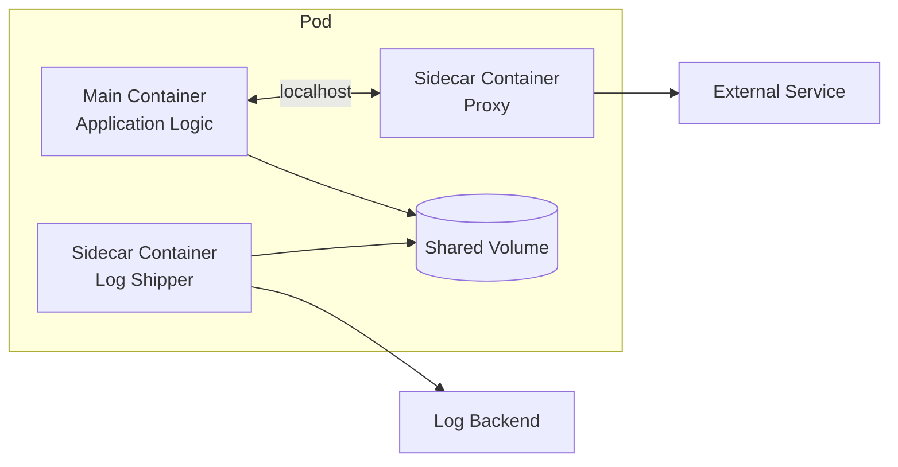
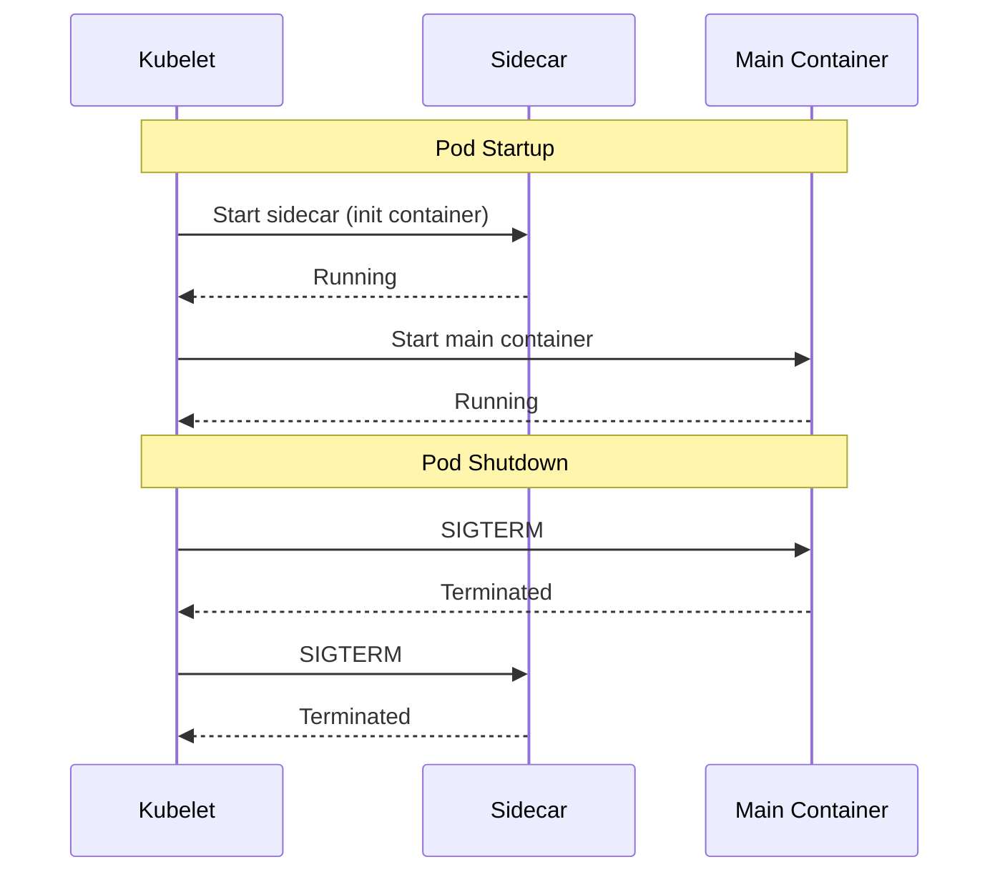

# How to Implement Kubernetes Sidecar Patterns

Author: [nawazdhandala](https://www.github.com/nawazdhandala)

Tags: Kubernetes, Sidecar, Patterns, Containers, DevOps

Description: Implement Kubernetes sidecar patterns for logging, monitoring, proxying, and configuration with shared volumes and networking.

---

The sidecar pattern is one of the most useful multi-container patterns in Kubernetes. It lets you extend your main application container with helper containers that handle cross-cutting concerns like logging, monitoring, or network proxying without touching your application code.

## What is the Sidecar Pattern?

A sidecar container runs alongside your main application container in the same Pod. They share the same network namespace (localhost) and can share volumes. The main container focuses on business logic while sidecars handle auxiliary tasks.



### When to Use Sidecars

| Use Case | Example |
|----------|---------|
| Log collection | Fluentd shipping logs to Elasticsearch |
| Monitoring agents | Prometheus exporters, StatsD |
| Network proxy | Envoy, Nginx reverse proxy |
| Configuration sync | Git-sync, Consul template |
| Security | OAuth proxy, TLS termination |

## Pattern 1: Log Aggregation Sidecar

This pattern collects logs from your application and ships them to a centralized logging system.

The main container writes logs to a shared volume, and the sidecar reads and forwards them.

```yaml
# log-aggregation-sidecar.yaml
# Pod with Fluent Bit sidecar for log shipping
apiVersion: v1
kind: Pod
metadata:
  name: app-with-logging
  labels:
    app: web
spec:
  containers:
    # Main application container
    - name: app
      image: nginx:latest
      ports:
        - containerPort: 80
      # Mount shared volume for logs
      volumeMounts:
        - name: logs
          mountPath: /var/log/nginx

    # Fluent Bit sidecar for log forwarding
    - name: log-shipper
      image: fluent/fluent-bit:latest
      # Configure Fluent Bit to read logs and send to Elasticsearch
      volumeMounts:
        - name: logs
          mountPath: /var/log/nginx
          readOnly: true
        - name: fluent-bit-config
          mountPath: /fluent-bit/etc
      resources:
        limits:
          memory: "128Mi"
          cpu: "100m"

  volumes:
    # Shared volume between containers
    - name: logs
      emptyDir: {}
    # Fluent Bit configuration
    - name: fluent-bit-config
      configMap:
        name: fluent-bit-config
---
# ConfigMap for Fluent Bit
apiVersion: v1
kind: ConfigMap
metadata:
  name: fluent-bit-config
data:
  fluent-bit.conf: |
    [SERVICE]
        Flush         5
        Daemon        Off
        Log_Level     info

    [INPUT]
        Name          tail
        Path          /var/log/nginx/*.log
        Tag           nginx.*
        Refresh_Interval 10

    [OUTPUT]
        Name          es
        Match         *
        Host          elasticsearch.logging.svc
        Port          9200
        Index         nginx-logs
```

## Pattern 2: Monitoring Sidecar

Add observability to your application by running a metrics exporter alongside it.

This example runs a Prometheus exporter that scrapes metrics from a Redis instance.

```yaml
# monitoring-sidecar.yaml
# Redis with Prometheus exporter sidecar
apiVersion: apps/v1
kind: Deployment
metadata:
  name: redis-with-exporter
spec:
  replicas: 1
  selector:
    matchLabels:
      app: redis
  template:
    metadata:
      labels:
        app: redis
      # Prometheus annotations for auto-discovery
      annotations:
        prometheus.io/scrape: "true"
        prometheus.io/port: "9121"
    spec:
      containers:
        # Main Redis container
        - name: redis
          image: redis:7
          ports:
            - containerPort: 6379
          resources:
            limits:
              memory: "256Mi"
              cpu: "200m"

        # Prometheus exporter sidecar
        # Connects to Redis on localhost and exposes metrics
        - name: redis-exporter
          image: oliver006/redis_exporter:latest
          ports:
            - containerPort: 9121
          env:
            # Connect to Redis on localhost (same Pod)
            - name: REDIS_ADDR
              value: "localhost:6379"
          resources:
            limits:
              memory: "64Mi"
              cpu: "50m"
```

## Pattern 3: Proxy Sidecar

Route traffic through a proxy for load balancing, TLS termination, or service mesh integration.

This pattern is the foundation for service meshes like Istio and Linkerd.

```yaml
# proxy-sidecar.yaml
# Application with Envoy proxy sidecar
apiVersion: v1
kind: Pod
metadata:
  name: app-with-proxy
spec:
  containers:
    # Main application - only accessible via proxy
    - name: app
      image: myapp:latest
      ports:
        - containerPort: 8080
          name: http
      # App listens on 8080, only proxy talks to it

    # Envoy proxy sidecar
    - name: envoy
      image: envoyproxy/envoy:v1.28-latest
      ports:
        - containerPort: 80
          name: http-proxy
        - containerPort: 9901
          name: admin
      volumeMounts:
        - name: envoy-config
          mountPath: /etc/envoy
      command:
        - envoy
        - -c
        - /etc/envoy/envoy.yaml

  volumes:
    - name: envoy-config
      configMap:
        name: envoy-config
---
# Envoy configuration
apiVersion: v1
kind: ConfigMap
metadata:
  name: envoy-config
data:
  envoy.yaml: |
    static_resources:
      listeners:
        - name: listener_0
          address:
            socket_address:
              address: 0.0.0.0
              port_value: 80
          filter_chains:
            - filters:
                - name: envoy.filters.network.http_connection_manager
                  typed_config:
                    "@type": type.googleapis.com/envoy.extensions.filters.network.http_connection_manager.v3.HttpConnectionManager
                    stat_prefix: ingress_http
                    route_config:
                      name: local_route
                      virtual_hosts:
                        - name: local_service
                          domains: ["*"]
                          routes:
                            - match:
                                prefix: "/"
                              route:
                                cluster: local_app
                    http_filters:
                      - name: envoy.filters.http.router
                        typed_config:
                          "@type": type.googleapis.com/envoy.extensions.filters.http.router.v3.Router
      clusters:
        - name: local_app
          type: STATIC
          lb_policy: ROUND_ROBIN
          load_assignment:
            cluster_name: local_app
            endpoints:
              - lb_endpoints:
                  - endpoint:
                      address:
                        socket_address:
                          address: 127.0.0.1
                          port_value: 8080
    admin:
      address:
        socket_address:
          address: 0.0.0.0
          port_value: 9901
```

## Pattern 4: Configuration Sync Sidecar

Keep configuration files in sync with an external source like a Git repository.

The sidecar pulls updates and makes them available to the main container.

```yaml
# config-sync-sidecar.yaml
# Application with git-sync sidecar for config updates
apiVersion: apps/v1
kind: Deployment
metadata:
  name: app-with-config-sync
spec:
  replicas: 2
  selector:
    matchLabels:
      app: config-app
  template:
    metadata:
      labels:
        app: config-app
    spec:
      containers:
        # Main application reads config from shared volume
        - name: app
          image: nginx:latest
          volumeMounts:
            - name: config
              mountPath: /usr/share/nginx/html
              readOnly: true

        # Git-sync sidecar pulls config from repo
        - name: git-sync
          image: registry.k8s.io/git-sync/git-sync:v4.2.1
          env:
            # Repository URL to sync
            - name: GITSYNC_REPO
              value: "https://github.com/myorg/app-config.git"
            # Branch to sync
            - name: GITSYNC_REF
              value: "main"
            # Directory to sync into
            - name: GITSYNC_ROOT
              value: "/git"
            # Symlink to latest commit
            - name: GITSYNC_LINK
              value: "current"
            # Sync interval in seconds
            - name: GITSYNC_PERIOD
              value: "60s"
          volumeMounts:
            - name: config
              mountPath: /git
          resources:
            limits:
              memory: "64Mi"
              cpu: "50m"
          securityContext:
            runAsUser: 65533
            runAsGroup: 65533

      volumes:
        - name: config
          emptyDir: {}
```

## Pattern 5: Security Sidecar

Add authentication or authorization without modifying your application.

This example uses OAuth2 Proxy to protect an application.

```yaml
# security-sidecar.yaml
# Application protected by OAuth2 proxy sidecar
apiVersion: apps/v1
kind: Deployment
metadata:
  name: protected-app
spec:
  replicas: 1
  selector:
    matchLabels:
      app: protected
  template:
    metadata:
      labels:
        app: protected
    spec:
      containers:
        # Backend application - not exposed directly
        - name: app
          image: myapp:latest
          ports:
            - containerPort: 8080

        # OAuth2 Proxy sidecar handles authentication
        - name: oauth-proxy
          image: quay.io/oauth2-proxy/oauth2-proxy:v7.5.1
          ports:
            - containerPort: 4180
          args:
            # Proxy requests to the app on localhost
            - --upstream=http://127.0.0.1:8080
            - --http-address=0.0.0.0:4180
            - --provider=google
            - --email-domain=mycompany.com
            - --cookie-secure=true
            - --cookie-secret=$(COOKIE_SECRET)
          env:
            - name: OAUTH2_PROXY_CLIENT_ID
              valueFrom:
                secretKeyRef:
                  name: oauth-credentials
                  key: client-id
            - name: OAUTH2_PROXY_CLIENT_SECRET
              valueFrom:
                secretKeyRef:
                  name: oauth-credentials
                  key: client-secret
            - name: COOKIE_SECRET
              valueFrom:
                secretKeyRef:
                  name: oauth-credentials
                  key: cookie-secret
          resources:
            limits:
              memory: "64Mi"
              cpu: "50m"
---
# Service exposes only the OAuth proxy port
apiVersion: v1
kind: Service
metadata:
  name: protected-app
spec:
  selector:
    app: protected
  ports:
    - port: 80
      targetPort: 4180
```

## Native Sidecar Containers in Kubernetes 1.28+

Kubernetes 1.28 introduced native sidecar support using the `restartPolicy: Always` field in init containers. This ensures sidecars start before and stop after the main container.

```yaml
# native-sidecar.yaml
# Using Kubernetes native sidecar containers (1.28+)
apiVersion: v1
kind: Pod
metadata:
  name: app-with-native-sidecar
spec:
  # Init containers with restartPolicy: Always become sidecars
  initContainers:
    - name: log-collector
      image: fluent/fluent-bit:latest
      # This makes it a sidecar - it runs for the Pod lifetime
      restartPolicy: Always
      volumeMounts:
        - name: logs
          mountPath: /var/log/app
      resources:
        limits:
          memory: "64Mi"
          cpu: "50m"

  containers:
    - name: app
      image: myapp:latest
      volumeMounts:
        - name: logs
          mountPath: /var/log/app

  volumes:
    - name: logs
      emptyDir: {}
```

### Benefits of Native Sidecars

Native sidecars provide better lifecycle management compared to regular containers.



## Best Practices

When implementing sidecars, keep these guidelines in mind.

**Resource allocation matters.** Set appropriate CPU and memory limits for sidecars. They should not starve your main application.

```yaml
# Always set resource limits for sidecars
resources:
  requests:
    memory: "32Mi"
    cpu: "25m"
  limits:
    memory: "64Mi"
    cpu: "50m"
```

**Use read-only mounts when possible.** If a sidecar only reads data, mount the volume as read-only.

**Keep sidecars lightweight.** Choose minimal base images and avoid bloated containers for auxiliary tasks.

**Handle graceful shutdown.** Sidecars should respond to SIGTERM and clean up properly. With native sidecars, the shutdown order is guaranteed.

**Monitor sidecar health.** Add readiness and liveness probes to sidecars just like main containers.

```yaml
# Add health checks to sidecars
livenessProbe:
  httpGet:
    path: /health
    port: 9090
  initialDelaySeconds: 5
  periodSeconds: 10
```

---

Sidecar patterns let you compose complex functionality from simple, focused containers. Whether you need log aggregation, metrics export, traffic proxying, or configuration management, sidecars keep your application container clean while adding the capabilities you need. With native sidecar support in newer Kubernetes versions, lifecycle management has become even more reliable.
