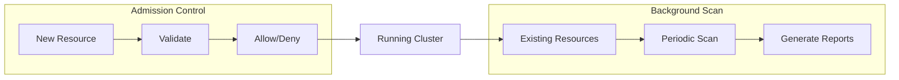
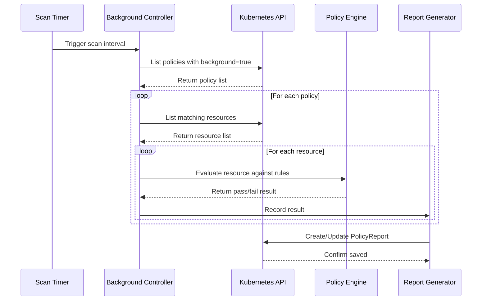

# How to Build Kyverno Background Scans

Author: [nawazdhandala](https://github.com/nawazdhandala)

Tags: Kyverno, Kubernetes, Compliance, Scanning

Description: Validate existing Kubernetes resources continuously with Kyverno background scans for ongoing compliance enforcement.

---

When you install Kyverno and apply policies, new resources get validated at admission time. But what about the thousands of resources already running in your cluster? Background scans solve this by continuously validating existing resources against your policies.

## Understanding Background Scans

Background scans run periodically to check existing resources against policies. Unlike admission control (which only validates at creation/update time), background scans catch resources that were created before a policy existed or that drifted out of compliance.



### Why Background Scans Matter

- **Policy Retroactivity**: Policies applied after resources were created still get evaluated
- **Configuration Drift Detection**: Catch resources that were manually modified outside GitOps
- **Continuous Compliance**: Generate ongoing compliance reports for auditors
- **Soft Enforcement**: Audit mode policies only work with background scanning enabled

## Basic Background Scan Configuration

Background scanning is controlled at the policy level with the `background` field.

### Enable Background Scanning on a Policy

```yaml
# require-labels-policy.yaml
# This policy validates that all Pods have required labels
# Background scanning checks existing Pods periodically
apiVersion: kyverno.io/v1
kind: ClusterPolicy
metadata:
  name: require-team-label
spec:
  # Enable background scanning for this policy
  background: true
  # Audit mode reports violations without blocking
  validationFailureAction: Audit
  rules:
    - name: check-team-label
      match:
        any:
          - resources:
              kinds:
                - Pod
      validate:
        message: "The label 'team' is required."
        pattern:
          metadata:
            labels:
              team: "?*"
```

### Disable Background Scanning

```yaml
# admission-only-policy.yaml
# This policy only validates at admission time
# Useful for policies that check transient state
apiVersion: kyverno.io/v1
kind: ClusterPolicy
metadata:
  name: check-image-digest
spec:
  # Disable background scanning
  background: false
  validationFailureAction: Enforce
  rules:
    - name: require-digest
      match:
        any:
          - resources:
              kinds:
                - Pod
      validate:
        message: "Images must use digests, not tags."
        pattern:
          spec:
            containers:
              - image: "*@sha256:*"
```

## Scan Interval Configuration

The background scan interval is configured globally in the Kyverno ConfigMap.

### Adjust Scan Interval

```yaml
# kyverno-configmap.yaml
# Controls how often background scans run
apiVersion: v1
kind: ConfigMap
metadata:
  name: kyverno
  namespace: kyverno
data:
  # Scan interval in hours (default is 1 hour)
  backgroundScanInterval: "1h"
  # For more frequent scans during testing
  # backgroundScanInterval: "15m"
```

Apply and restart Kyverno:

```bash
# Apply the updated ConfigMap
kubectl apply -f kyverno-configmap.yaml

# Restart Kyverno to pick up changes
kubectl rollout restart deployment kyverno -n kyverno
```

### Scan Interval Guidelines

| Cluster Size | Recommended Interval | Rationale |
|--------------|---------------------|-----------|
| Small (< 1000 resources) | 15m | Fast scans, quick feedback |
| Medium (1000-10000 resources) | 1h | Balance between load and freshness |
| Large (> 10000 resources) | 2h-4h | Reduce API server pressure |

## Resource Selection and Filtering

Control which resources get scanned with match and exclude rules.

### Scan Specific Namespaces Only

```yaml
# namespace-scoped-policy.yaml
# Only scan resources in specific namespaces
apiVersion: kyverno.io/v1
kind: ClusterPolicy
metadata:
  name: prod-security-baseline
spec:
  background: true
  validationFailureAction: Audit
  rules:
    - name: check-security-context
      match:
        any:
          - resources:
              kinds:
                - Pod
              namespaces:
                - production
                - staging
      validate:
        message: "Pods must run as non-root."
        pattern:
          spec:
            securityContext:
              runAsNonRoot: true
```

### Exclude System Namespaces

```yaml
# exclude-system-namespaces.yaml
# Skip kube-system and other system namespaces
apiVersion: kyverno.io/v1
kind: ClusterPolicy
metadata:
  name: require-resource-limits
spec:
  background: true
  validationFailureAction: Audit
  rules:
    - name: check-limits
      match:
        any:
          - resources:
              kinds:
                - Pod
      exclude:
        any:
          - resources:
              namespaces:
                - kube-system
                - kyverno
                - cert-manager
                - ingress-nginx
      validate:
        message: "Resource limits are required."
        pattern:
          spec:
            containers:
              - resources:
                  limits:
                    memory: "?*"
                    cpu: "?*"
```

### Filter by Labels

```yaml
# label-filtered-policy.yaml
# Only scan resources with specific labels
apiVersion: kyverno.io/v1
kind: ClusterPolicy
metadata:
  name: pci-compliance
spec:
  background: true
  validationFailureAction: Audit
  rules:
    - name: pci-encryption-check
      match:
        any:
          - resources:
              kinds:
                - Pod
              selector:
                matchLabels:
                  compliance-scope: pci
      validate:
        message: "PCI workloads must use encrypted volumes only."
        pattern:
          spec:
            volumes:
              - (emptyDir): null
```

## Background Scan Workflow

Here is how Kyverno processes background scans end to end:



## Report Generation from Background Scans

Background scans generate PolicyReport and ClusterPolicyReport resources.

### View Policy Reports

```bash
# List all policy reports in a namespace
kubectl get policyreport -n production

# Get detailed report
kubectl get policyreport -n production -o yaml

# List cluster-wide reports
kubectl get clusterpolicyreport
```

### PolicyReport Structure

```yaml
# Example PolicyReport generated by background scan
apiVersion: wgpolicyk8s.io/v1alpha2
kind: PolicyReport
metadata:
  name: polr-ns-production
  namespace: production
summary:
  pass: 45
  fail: 3
  warn: 0
  error: 0
  skip: 0
results:
  - message: "The label 'team' is required."
    policy: require-team-label
    rule: check-team-label
    result: fail
    severity: medium
    source: kyverno
    timestamp:
      nanos: 0
      seconds: 1706620800
    resources:
      - apiVersion: v1
        kind: Pod
        name: legacy-app-7d8f9b6c4-x2k9p
        namespace: production
        uid: a1b2c3d4-e5f6-7890-abcd-ef1234567890
```

### Query Reports with kubectl

```bash
# Find all failing resources
kubectl get policyreport -A -o json | \
  jq -r '.items[].results[] | select(.result=="fail") | "\(.resources[0].namespace)/\(.resources[0].name): \(.message)"'

# Count failures by policy
kubectl get policyreport -A -o json | \
  jq -r '.items[].results[] | select(.result=="fail") | .policy' | \
  sort | uniq -c | sort -rn

# Get summary across all namespaces
kubectl get policyreport -A -o json | \
  jq '[.items[].summary] | {pass: (map(.pass) | add), fail: (map(.fail) | add)}'
```

### Export Reports for Compliance

```bash
# Export all reports to JSON for auditors
kubectl get policyreport -A -o json > compliance-report-$(date +%Y%m%d).json

# Generate CSV summary
kubectl get policyreport -A -o json | jq -r '
  ["Namespace","Pass","Fail","Total"],
  (.items[] | [.metadata.namespace, .summary.pass, .summary.fail, (.summary.pass + .summary.fail)]) | @csv
' > compliance-summary.csv
```

## Integrating with External Systems

### Send Reports to Prometheus

```yaml
# kyverno-service-monitor.yaml
# Kyverno exposes metrics for policy report results
apiVersion: monitoring.coreos.com/v1
kind: ServiceMonitor
metadata:
  name: kyverno
  namespace: monitoring
spec:
  selector:
    matchLabels:
      app.kubernetes.io/name: kyverno
  endpoints:
    - port: metrics
      interval: 30s
      path: /metrics
```

Key metrics to monitor:

```bash
# Prometheus queries for background scan results
# Count of policy violations by namespace
kyverno_policy_results_total{rule_result="fail"}

# Background scan duration
kyverno_background_scan_duration_seconds

# Resources processed per scan
kyverno_background_scan_resources_processed_total
```

### Webhook Notifications

```yaml
# policy-with-webhook.yaml
# Trigger webhook on violations
apiVersion: kyverno.io/v1
kind: ClusterPolicy
metadata:
  name: critical-violation-alert
  annotations:
    # Notify external system on violation
    policies.kyverno.io/severity: high
spec:
  background: true
  validationFailureAction: Audit
  rules:
    - name: no-privileged-containers
      match:
        any:
          - resources:
              kinds:
                - Pod
      validate:
        message: "Privileged containers are not allowed."
        pattern:
          spec:
            containers:
              - securityContext:
                  privileged: "!true"
```

## Performance Tuning for Large Clusters

### Optimize Resource Requests

```yaml
# kyverno-deployment-tuned.yaml
# Increase resources for large clusters
apiVersion: apps/v1
kind: Deployment
metadata:
  name: kyverno
  namespace: kyverno
spec:
  template:
    spec:
      containers:
        - name: kyverno
          resources:
            requests:
              # Increase for clusters with many resources
              memory: "512Mi"
              cpu: "500m"
            limits:
              memory: "2Gi"
              cpu: "2000m"
          # Environment variables for tuning
          env:
            # Number of workers for background scanning
            - name: BACKGROUND_SCAN_WORKERS
              value: "4"
            # Batch size for processing resources
            - name: BACKGROUND_SCAN_BATCH_SIZE
              value: "100"
```

### Distribute Load Across Replicas

```yaml
# kyverno-ha-deployment.yaml
# Run multiple replicas with leader election for HA
apiVersion: apps/v1
kind: Deployment
metadata:
  name: kyverno
  namespace: kyverno
spec:
  # Multiple replicas for high availability
  replicas: 3
  template:
    spec:
      containers:
        - name: kyverno
          args:
            # Enable leader election for background controller
            - "--enableLeaderElection=true"
            # Only leader runs background scans
            - "--backgroundScan=true"
```

### Limit Concurrent Scans

```yaml
# kyverno-configmap-tuned.yaml
# Configure scan behavior for large clusters
apiVersion: v1
kind: ConfigMap
metadata:
  name: kyverno
  namespace: kyverno
data:
  # Longer interval for large clusters
  backgroundScanInterval: "4h"
  # Limit resources processed per interval
  backgroundScanResources: "5000"
  # Enable incremental scanning (only check changed resources)
  enableIncrementalScan: "true"
```

### Monitor Scan Performance

```bash
#!/bin/bash
# monitor-background-scans.sh
# Track background scan performance over time

echo "=== Kyverno Background Scan Status ==="

# Check if scans are running
kubectl logs -n kyverno deployment/kyverno --tail=100 | \
  grep -i "background scan" | tail -5

echo -e "\n=== Scan Duration Metrics ==="
# Get scan duration from metrics endpoint
kubectl port-forward -n kyverno svc/kyverno-svc 8000:443 &
PF_PID=$!
sleep 2

curl -sk https://localhost:8000/metrics 2>/dev/null | \
  grep kyverno_background_scan_duration

kill $PF_PID 2>/dev/null

echo -e "\n=== Resource Count by Kind ==="
# Count resources that will be scanned
for kind in pods deployments services configmaps secrets; do
  count=$(kubectl get $kind -A --no-headers 2>/dev/null | wc -l)
  echo "$kind: $count"
done
```

## Practical Examples

### Example 1: Drift Detection Policy

```yaml
# detect-manual-changes.yaml
# Detect resources modified outside GitOps
apiVersion: kyverno.io/v1
kind: ClusterPolicy
metadata:
  name: detect-gitops-drift
spec:
  background: true
  validationFailureAction: Audit
  rules:
    - name: check-managed-by-label
      match:
        any:
          - resources:
              kinds:
                - Deployment
                - Service
                - ConfigMap
              namespaces:
                - production
      exclude:
        any:
          - resources:
              namespaces:
                - kube-system
      validate:
        message: "Resource missing ArgoCD management label. Was it modified manually?"
        pattern:
          metadata:
            labels:
              argocd.argoproj.io/instance: "?*"
```

### Example 2: Security Baseline Audit

```yaml
# security-baseline-audit.yaml
# Comprehensive security baseline for all workloads
apiVersion: kyverno.io/v1
kind: ClusterPolicy
metadata:
  name: security-baseline-audit
spec:
  background: true
  validationFailureAction: Audit
  rules:
    # Rule 1: No privileged containers
    - name: no-privileged
      match:
        any:
          - resources:
              kinds:
                - Pod
      validate:
        message: "Privileged containers are not allowed."
        pattern:
          spec:
            containers:
              - securityContext:
                  privileged: "!true"
            initContainers:
              - securityContext:
                  privileged: "!true"

    # Rule 2: No host networking
    - name: no-host-network
      match:
        any:
          - resources:
              kinds:
                - Pod
      validate:
        message: "Host networking is not allowed."
        pattern:
          spec:
            hostNetwork: "!true"

    # Rule 3: No host PID
    - name: no-host-pid
      match:
        any:
          - resources:
              kinds:
                - Pod
      validate:
        message: "Host PID namespace is not allowed."
        pattern:
          spec:
            hostPID: "!true"

    # Rule 4: Read-only root filesystem
    - name: readonly-root
      match:
        any:
          - resources:
              kinds:
                - Pod
      validate:
        message: "Root filesystem should be read-only."
        pattern:
          spec:
            containers:
              - securityContext:
                  readOnlyRootFilesystem: true
```

### Example 3: Resource Quota Compliance

```yaml
# resource-quota-compliance.yaml
# Ensure all workloads have resource limits defined
apiVersion: kyverno.io/v1
kind: ClusterPolicy
metadata:
  name: resource-quota-compliance
spec:
  background: true
  validationFailureAction: Audit
  rules:
    - name: require-requests-limits
      match:
        any:
          - resources:
              kinds:
                - Pod
      exclude:
        any:
          - resources:
              namespaces:
                - kube-system
                - kyverno
      validate:
        message: "CPU and memory requests/limits are required."
        pattern:
          spec:
            containers:
              - resources:
                  requests:
                    memory: "?*"
                    cpu: "?*"
                  limits:
                    memory: "?*"
                    cpu: "?*"
```

## Troubleshooting Background Scans

### Scans Not Running

```bash
# Check Kyverno logs for background scan activity
kubectl logs -n kyverno deployment/kyverno | grep -i "background"

# Verify background scanning is enabled in ConfigMap
kubectl get configmap kyverno -n kyverno -o yaml | grep background

# Check if policies have background=true
kubectl get clusterpolicy -o json | \
  jq '.items[] | {name: .metadata.name, background: .spec.background}'
```

### Reports Not Generated

```bash
# Check if PolicyReport CRD exists
kubectl get crd | grep policyreport

# Verify report controller is running
kubectl get pods -n kyverno -l app.kubernetes.io/component=reports-controller

# Check for errors in report controller logs
kubectl logs -n kyverno -l app.kubernetes.io/component=reports-controller
```

### High API Server Load

```bash
# Increase scan interval
kubectl patch configmap kyverno -n kyverno \
  --type merge \
  -p '{"data":{"backgroundScanInterval":"4h"}}'

# Reduce concurrent workers
kubectl set env deployment/kyverno -n kyverno BACKGROUND_SCAN_WORKERS=2

# Restart Kyverno to apply changes
kubectl rollout restart deployment kyverno -n kyverno
```

## Best Practices Checklist

- [ ] Enable background scanning for audit-mode policies
- [ ] Set appropriate scan intervals based on cluster size
- [ ] Exclude system namespaces from scanning
- [ ] Monitor scan duration and API server load
- [ ] Export reports regularly for compliance records
- [ ] Use label selectors to target specific workloads
- [ ] Tune Kyverno resources for large clusters
- [ ] Set up alerting on policy violations via metrics
- [ ] Review PolicyReports as part of security reviews

---

Background scans transform Kyverno from a gatekeeper into a continuous compliance engine. By validating existing resources periodically, you catch configuration drift, enforce policies retroactively, and generate audit trails for compliance teams. Start with audit mode policies, tune your scan intervals, and build confidence before moving to enforcement.
