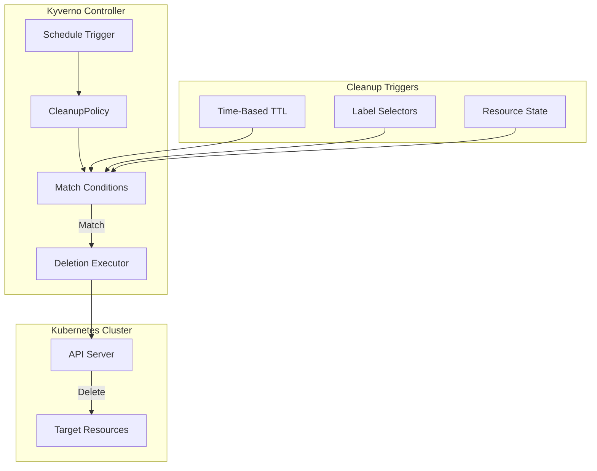
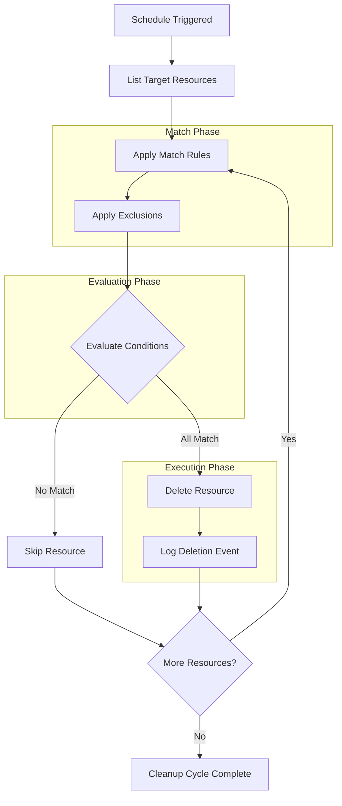

# How to Build Kyverno Cleanup Policies

Author: [nawazdhandala](https://github.com/nawazdhandala)

Tags: Kyverno, Kubernetes, Automation, Cleanup

Description: Automate Kubernetes resource lifecycle management with Kyverno cleanup policies for time-based and condition-based resource deletion.

---

Kubernetes clusters accumulate stale resources over time. Orphaned ConfigMaps, expired test deployments, and forgotten Jobs clutter namespaces and consume resources. Kyverno cleanup policies automate the removal of resources based on time or conditions.

## What Are Kyverno Cleanup Policies

Cleanup policies are Kyverno resources that automatically delete Kubernetes objects matching specific criteria. Unlike manual `kubectl delete` commands or custom scripts, cleanup policies run continuously and declaratively manage resource lifecycle.



## CleanupPolicy Resource Structure

Kyverno provides two cleanup policy types:

- **CleanupPolicy**: Namespace-scoped, manages resources in a single namespace
- **ClusterCleanupPolicy**: Cluster-scoped, manages resources across all namespaces

### Basic CleanupPolicy Structure

```yaml
# Basic structure of a Kyverno CleanupPolicy
apiVersion: kyverno.io/v2beta1
kind: CleanupPolicy
metadata:
  name: cleanup-expired-pods       # Policy name
  namespace: default               # Namespace where policy is applied
spec:
  match:
    any:
      - resources:
          kinds:
            - Pod                  # Resource types to target
          selector:
            matchLabels:
              app: test            # Label selector for filtering
  conditions:
    any:
      - key: "{{ time_since('','{{ @.metadata.creationTimestamp }}', '') }}"
        operator: GreaterThan
        value: "24h"               # Delete pods older than 24 hours
  schedule: "*/15 * * * *"         # Run every 15 minutes
```

### ClusterCleanupPolicy Structure

```yaml
# Cluster-wide cleanup policy
apiVersion: kyverno.io/v2beta1
kind: ClusterCleanupPolicy
metadata:
  name: cleanup-completed-jobs     # Cluster-scoped policy name
spec:
  match:
    any:
      - resources:
          kinds:
            - Job                  # Target Jobs across all namespaces
          namespaces:
            - "*"                  # Apply to all namespaces
  exclude:
    any:
      - resources:
          namespaces:
            - kube-system          # Exclude system namespaces
            - kyverno
  conditions:
    all:
      - key: "{{ @.status.succeeded }}"
        operator: Equals
        value: 1                   # Match completed Jobs
  schedule: "0 */6 * * *"          # Run every 6 hours
```

## Time-Based Cleanup

Time-based cleanup deletes resources after a specified duration. This is useful for temporary resources like test environments, debug pods, and ephemeral workloads.

### Delete Pods Older Than 24 Hours

```yaml
apiVersion: kyverno.io/v2beta1
kind: CleanupPolicy
metadata:
  name: cleanup-old-pods
  namespace: staging
spec:
  match:
    any:
      - resources:
          kinds:
            - Pod
          selector:
            matchLabels:
              environment: staging   # Only target staging pods
  conditions:
    any:
      # Use time_since function to calculate age
      - key: "{{ time_since('','{{ @.metadata.creationTimestamp }}', '') }}"
        operator: GreaterThan
        value: "24h"                 # 24-hour TTL
  schedule: "0 * * * *"              # Check every hour
```

### Delete Test Namespaces After 7 Days

```yaml
apiVersion: kyverno.io/v2beta1
kind: ClusterCleanupPolicy
metadata:
  name: cleanup-test-namespaces
spec:
  match:
    any:
      - resources:
          kinds:
            - Namespace
          selector:
            matchLabels:
              purpose: testing       # Only test namespaces
  conditions:
    any:
      - key: "{{ time_since('','{{ @.metadata.creationTimestamp }}', '') }}"
        operator: GreaterThan
        value: "168h"                # 7 days in hours
  schedule: "0 0 * * *"              # Run daily at midnight
```

### TTL-Based Cleanup with Annotations

```yaml
apiVersion: kyverno.io/v2beta1
kind: CleanupPolicy
metadata:
  name: cleanup-ttl-annotated
  namespace: development
spec:
  match:
    any:
      - resources:
          kinds:
            - Deployment
            - Service
            - ConfigMap
  conditions:
    all:
      # Check if TTL annotation exists
      - key: "{{ @.metadata.annotations.\"cleanup.kyverno.io/ttl\" || '' }}"
        operator: NotEquals
        value: ""
      # Check if resource has exceeded its TTL
      - key: "{{ time_since('','{{ @.metadata.creationTimestamp }}', '') }}"
        operator: GreaterThan
        value: "{{ @.metadata.annotations.\"cleanup.kyverno.io/ttl\" }}"
  schedule: "*/30 * * * *"           # Check every 30 minutes
```

Resources can then specify their own TTL:

```yaml
apiVersion: v1
kind: ConfigMap
metadata:
  name: temp-config
  annotations:
    cleanup.kyverno.io/ttl: "2h"     # Auto-delete after 2 hours
data:
  key: value
```

## Condition-Based Cleanup

Condition-based cleanup deletes resources based on their state or properties rather than age.

### Delete Failed Pods

```yaml
apiVersion: kyverno.io/v2beta1
kind: CleanupPolicy
metadata:
  name: cleanup-failed-pods
  namespace: production
spec:
  match:
    any:
      - resources:
          kinds:
            - Pod
  conditions:
    any:
      # Match pods in Failed phase
      - key: "{{ @.status.phase }}"
        operator: Equals
        value: "Failed"
      # Match pods in Succeeded phase (completed)
      - key: "{{ @.status.phase }}"
        operator: Equals
        value: "Succeeded"
  schedule: "*/10 * * * *"           # Check every 10 minutes
```

### Delete Completed Jobs with Conditions

```yaml
apiVersion: kyverno.io/v2beta1
kind: ClusterCleanupPolicy
metadata:
  name: cleanup-completed-jobs
spec:
  match:
    any:
      - resources:
          kinds:
            - Job
  exclude:
    any:
      - resources:
          namespaces:
            - kube-system
          selector:
            matchLabels:
              keep: "true"           # Exclude Jobs with keep label
  conditions:
    all:
      # Job must have completed successfully
      - key: "{{ @.status.succeeded }}"
        operator: GreaterThanOrEquals
        value: 1
      # Job must be older than 1 hour
      - key: "{{ time_since('','{{ @.status.completionTime }}', '') }}"
        operator: GreaterThan
        value: "1h"
  schedule: "0 * * * *"              # Run hourly
```

### Delete Evicted Pods

```yaml
apiVersion: kyverno.io/v2beta1
kind: ClusterCleanupPolicy
metadata:
  name: cleanup-evicted-pods
spec:
  match:
    any:
      - resources:
          kinds:
            - Pod
  conditions:
    all:
      # Match evicted pods
      - key: "{{ @.status.reason }}"
        operator: Equals
        value: "Evicted"
  schedule: "*/5 * * * *"            # Run every 5 minutes
```

### Delete Unused ConfigMaps

```yaml
apiVersion: kyverno.io/v2beta1
kind: CleanupPolicy
metadata:
  name: cleanup-orphaned-configmaps
  namespace: default
spec:
  match:
    any:
      - resources:
          kinds:
            - ConfigMap
          selector:
            matchLabels:
              auto-cleanup: "enabled"  # Only cleanup labeled ConfigMaps
  conditions:
    all:
      # ConfigMap must be older than 7 days
      - key: "{{ time_since('','{{ @.metadata.creationTimestamp }}', '') }}"
        operator: GreaterThan
        value: "168h"
      # ConfigMap must not have owner references
      - key: "{{ length(@.metadata.ownerReferences || `[]`) }}"
        operator: Equals
        value: 0
  schedule: "0 0 * * 0"              # Run weekly on Sunday
```

## Cleanup Workflow



## Scheduling Cleanup Operations

Kyverno cleanup policies use cron expressions for scheduling. Understanding cron syntax helps you set appropriate cleanup frequencies.

### Cron Expression Format

```
# Cron format: minute hour day-of-month month day-of-week
#              0-59   0-23 1-31         1-12  0-6 (0=Sunday)

# Examples:
# "*/5 * * * *"     - Every 5 minutes
# "0 * * * *"       - Every hour at minute 0
# "0 0 * * *"       - Daily at midnight
# "0 0 * * 0"       - Weekly on Sunday at midnight
# "0 0 1 * *"       - Monthly on the 1st at midnight
```

### Scheduling Best Practices

```yaml
apiVersion: kyverno.io/v2beta1
kind: ClusterCleanupPolicy
metadata:
  name: cleanup-with-optimal-schedule
spec:
  match:
    any:
      - resources:
          kinds:
            - Pod
  conditions:
    any:
      - key: "{{ @.status.phase }}"
        operator: Equals
        value: "Failed"
  # Schedule considerations:
  # - Frequent schedules (*/5) for critical cleanup
  # - Hourly (0 *) for general maintenance
  # - Daily (0 0) for non-urgent cleanup
  # - Off-peak hours (0 3) for resource-intensive cleanup
  schedule: "0 3 * * *"              # Run at 3 AM daily (off-peak)
```

### Staggered Cleanup Schedules

Avoid running all cleanup policies at the same time:

```yaml
# Policy 1: Run at minute 0
apiVersion: kyverno.io/v2beta1
kind: ClusterCleanupPolicy
metadata:
  name: cleanup-failed-pods
spec:
  schedule: "0 * * * *"              # Hourly at minute 0
  # ... rest of spec
---
# Policy 2: Run at minute 15
apiVersion: kyverno.io/v2beta1
kind: ClusterCleanupPolicy
metadata:
  name: cleanup-completed-jobs
spec:
  schedule: "15 * * * *"             # Hourly at minute 15
  # ... rest of spec
---
# Policy 3: Run at minute 30
apiVersion: kyverno.io/v2beta1
kind: ClusterCleanupPolicy
metadata:
  name: cleanup-evicted-pods
spec:
  schedule: "30 * * * *"             # Hourly at minute 30
  # ... rest of spec
```

## Dry-Run and Testing Cleanup Policies

Always test cleanup policies before applying them to production. Kyverno does not have a built-in dry-run mode for cleanup policies, but you can test safely using these approaches.

### Step 1: Test with Label Selectors

Create policies that only target test resources:

```yaml
apiVersion: kyverno.io/v2beta1
kind: CleanupPolicy
metadata:
  name: cleanup-test-only
  namespace: test-namespace
spec:
  match:
    any:
      - resources:
          kinds:
            - Pod
          selector:
            matchLabels:
              cleanup-test: "true"   # Only match explicitly labeled resources
  conditions:
    any:
      - key: "{{ time_since('','{{ @.metadata.creationTimestamp }}', '') }}"
        operator: GreaterThan
        value: "1m"                  # Short TTL for testing
  schedule: "* * * * *"              # Run every minute for testing
```

Create test resources:

```bash
# Create a test pod with the cleanup label
kubectl run test-pod \
  --image=nginx \
  --labels="cleanup-test=true" \
  -n test-namespace

# Wait and verify the pod gets deleted
kubectl get pods -n test-namespace -w
```

### Step 2: Use Kyverno CLI for Policy Testing

```bash
# Install Kyverno CLI
brew install kyverno

# Test policy against existing resources
kyverno apply cleanup-policy.yaml \
  --resource pod.yaml \
  --detailed-results
```

### Step 3: Preview Matching Resources

Before applying a cleanup policy, preview what would be deleted:

```bash
#!/bin/bash
# preview-cleanup.sh
# Preview resources that would be matched by a cleanup policy

NAMESPACE="default"
LABEL_SELECTOR="environment=staging"
MAX_AGE="24h"

echo "Resources that would be cleaned up:"
echo "==================================="

# Get pods older than MAX_AGE with matching labels
kubectl get pods -n $NAMESPACE \
  -l $LABEL_SELECTOR \
  -o jsonpath='{range .items[*]}{.metadata.name} created: {.metadata.creationTimestamp}{"\n"}{end}' | \
while read line; do
  POD_NAME=$(echo $line | awk '{print $1}')
  CREATED=$(echo $line | awk '{print $3}')

  # Calculate age (simplified - use proper date math in production)
  echo "Would delete: $POD_NAME (created: $CREATED)"
done
```

### Step 4: Monitor Policy Execution

```bash
# Watch Kyverno controller logs for cleanup actions
kubectl logs -n kyverno -l app=kyverno -f | grep -i cleanup

# Check cleanup policy status
kubectl get cleanuppolicy -A
kubectl describe cleanuppolicy cleanup-failed-pods -n default
```

### Step 5: Start with Exclude Rules

When deploying new policies, start with broad exclusions and narrow over time:

```yaml
apiVersion: kyverno.io/v2beta1
kind: ClusterCleanupPolicy
metadata:
  name: cleanup-old-pods-safe
spec:
  match:
    any:
      - resources:
          kinds:
            - Pod
  exclude:
    any:
      # Exclude all system namespaces
      - resources:
          namespaces:
            - kube-system
            - kube-public
            - kube-node-lease
            - kyverno
            - cert-manager
            - ingress-nginx
      # Exclude critical workloads
      - resources:
          selector:
            matchLabels:
              critical: "true"
      # Exclude pods with owner references (managed by controllers)
      - resources:
          selector:
            matchExpressions:
              - key: app.kubernetes.io/managed-by
                operator: Exists
  conditions:
    all:
      - key: "{{ time_since('','{{ @.metadata.creationTimestamp }}', '') }}"
        operator: GreaterThan
        value: "168h"                # 7 days
  schedule: "0 0 * * *"
```

## Practical Examples

### Complete Development Environment Cleanup

```yaml
# Cleanup policy for development namespaces
apiVersion: kyverno.io/v2beta1
kind: ClusterCleanupPolicy
metadata:
  name: dev-environment-cleanup
  annotations:
    description: "Cleans up stale resources in development namespaces"
spec:
  match:
    any:
      - resources:
          kinds:
            - Pod
            - Service
            - ConfigMap
            - Secret
            - PersistentVolumeClaim
          namespaces:
            - "dev-*"                # Match all dev namespaces
          selector:
            matchLabels:
              environment: development
  exclude:
    any:
      - resources:
          selector:
            matchLabels:
              permanent: "true"      # Keep resources marked as permanent
  conditions:
    all:
      # Resource must be older than 3 days
      - key: "{{ time_since('','{{ @.metadata.creationTimestamp }}', '') }}"
        operator: GreaterThan
        value: "72h"
      # Resource must not have recent activity annotation
      - key: "{{ @.metadata.annotations.\"last-activity\" || @.metadata.creationTimestamp }}"
        operator: LessThan
        value: "{{ time_now() }}"
  schedule: "0 6 * * *"              # Run daily at 6 AM
```

### CI/CD Pipeline Cleanup

```yaml
# Cleanup resources created by CI/CD pipelines
apiVersion: kyverno.io/v2beta1
kind: ClusterCleanupPolicy
metadata:
  name: cicd-cleanup
spec:
  match:
    any:
      - resources:
          kinds:
            - Pod
            - Job
          selector:
            matchLabels:
              created-by: "ci-pipeline"
  conditions:
    any:
      # Completed successfully and older than 2 hours
      - key: "{{ @.status.phase }}"
        operator: Equals
        value: "Succeeded"
      # Failed and older than 24 hours
      - key: "{{ @.status.phase }}"
        operator: Equals
        value: "Failed"
  schedule: "*/30 * * * *"           # Check every 30 minutes
---
# Cleanup CI namespaces
apiVersion: kyverno.io/v2beta1
kind: ClusterCleanupPolicy
metadata:
  name: cicd-namespace-cleanup
spec:
  match:
    any:
      - resources:
          kinds:
            - Namespace
          selector:
            matchLabels:
              created-by: "ci-pipeline"
  conditions:
    all:
      - key: "{{ time_since('','{{ @.metadata.creationTimestamp }}', '') }}"
        operator: GreaterThan
        value: "48h"                 # Delete CI namespaces after 48 hours
  schedule: "0 */4 * * *"            # Run every 4 hours
```

### Preview Environment Cleanup with Grace Period

```yaml
# Cleanup preview environments with configurable TTL
apiVersion: kyverno.io/v2beta1
kind: ClusterCleanupPolicy
metadata:
  name: preview-environment-cleanup
spec:
  match:
    any:
      - resources:
          kinds:
            - Namespace
          selector:
            matchLabels:
              type: "preview-environment"
  conditions:
    all:
      # Check custom TTL annotation or default to 7 days
      - key: "{{ time_since('','{{ @.metadata.creationTimestamp }}', '') }}"
        operator: GreaterThan
        value: "{{ @.metadata.annotations.\"preview.ttl\" || '168h' }}"
  schedule: "0 0 * * *"              # Daily cleanup
```

Usage with custom TTL:

```yaml
apiVersion: v1
kind: Namespace
metadata:
  name: preview-pr-123
  labels:
    type: preview-environment
  annotations:
    preview.ttl: "48h"               # This preview expires in 48 hours
```

### Debug Pod Cleanup

```yaml
# Automatically clean up debug pods
apiVersion: kyverno.io/v2beta1
kind: ClusterCleanupPolicy
metadata:
  name: debug-pod-cleanup
spec:
  match:
    any:
      - resources:
          kinds:
            - Pod
          selector:
            matchLabels:
              purpose: "debug"
      - resources:
          kinds:
            - Pod
          # Match pods created with kubectl debug
          names:
            - "*-debug-*"
  conditions:
    any:
      # Delete debug pods after 4 hours regardless of state
      - key: "{{ time_since('','{{ @.metadata.creationTimestamp }}', '') }}"
        operator: GreaterThan
        value: "4h"
  schedule: "*/15 * * * *"           # Check every 15 minutes
```

## Monitoring and Alerting

### Create Alerts for Cleanup Activity

```yaml
# PrometheusRule for cleanup monitoring
apiVersion: monitoring.coreos.com/v1
kind: PrometheusRule
metadata:
  name: kyverno-cleanup-alerts
  namespace: monitoring
spec:
  groups:
    - name: kyverno-cleanup
      rules:
        - alert: CleanupPolicyNotRunning
          expr: |
            time() - kyverno_cleanup_controller_cleanup_total_time > 86400
          for: 1h
          labels:
            severity: warning
          annotations:
            summary: Cleanup policy has not run in 24 hours
            description: "Cleanup policy {{ $labels.policy_name }} has not executed recently"

        - alert: HighCleanupDeletionRate
          expr: |
            rate(kyverno_cleanup_controller_deletedobjects_total[1h]) > 100
          for: 15m
          labels:
            severity: warning
          annotations:
            summary: High rate of resource deletions by cleanup policy
            description: "Cleanup is deleting more than 100 resources per hour"
```

### Log Cleanup Events

```bash
# Monitor cleanup events in real-time
kubectl get events -A --watch | grep -i cleanup

# Query Kyverno logs for deletion events
kubectl logs -n kyverno deployment/kyverno -f | \
  jq 'select(.msg | contains("deleted"))'
```

---

Kyverno cleanup policies transform manual resource maintenance into automated lifecycle management. Start with simple time-based policies, add condition-based rules for specific resource states, and always test in non-production environments first. The goal is a self-maintaining cluster where stale resources automatically disappear.
