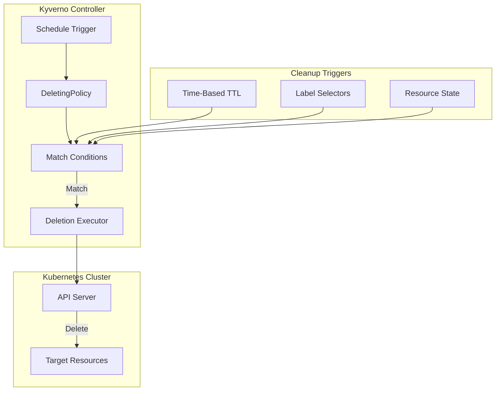
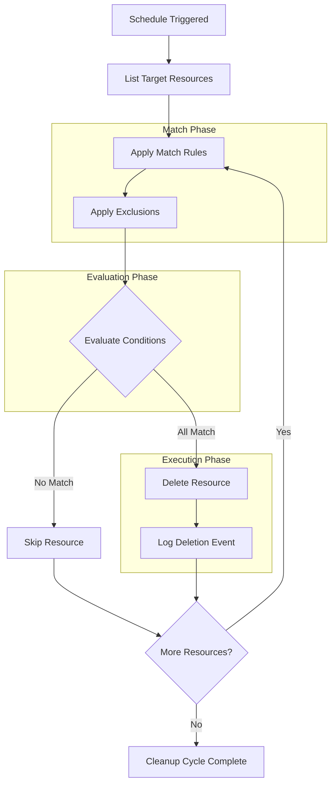

# How to Build Kyverno Cleanup Policies

Author: [nawazdhandala](https://github.com/nawazdhandala)

Tags: Kyverno, Kubernetes, Automation, Cleanup

Description: Automate Kubernetes resource lifecycle management with Kyverno cleanup policies for time-based and condition-based resource deletion.

---

Kubernetes clusters accumulate stale resources over time. Orphaned ConfigMaps, expired test deployments, and forgotten Jobs clutter namespaces and consume resources. Kyverno deleting policies automate the removal of resources based on time or conditions.

## What Are Kyverno Deleting Policies

Deleting policies are Kyverno resources that automatically delete Kubernetes objects matching specific criteria. Unlike manual `kubectl delete` commands or custom scripts, deleting policies run on a schedule and declaratively manage resource lifecycle. They replace the older `CleanupPolicy` and `ClusterCleanupPolicy` resources, which are deprecated in current Kyverno releases.


```mermaid
flowchart TB
    subgraph Kyverno Controller
        CP[DeletingPolicy]
        Schedule[Schedule Trigger]
        Conditions[Match Conditions]
        Executor[Deletion Executor]
    end

    subgraph Kubernetes Cluster
        Resources[Target Resources]
        API[API Server]
    end

    Schedule --> CP
    CP --> Conditions
    Conditions --> |Match| Executor
    Executor --> API
    API --> |Delete| Resources

    subgraph Cleanup Triggers
        Time[Time-Based TTL]
        Labels[Label Selectors]
        State[Resource State]
    end

    Time --> Conditions
    Labels --> Conditions
    State --> Conditions
```

## DeletingPolicy Resource Structure

Kyverno provides two deleting policy types:

- **NamespacedDeletingPolicy**: Namespace-scoped, manages resources in the policy namespace
- **DeletingPolicy**: Cluster-scoped, manages resources across namespaces

### Basic NamespacedDeletingPolicy Structure

```yaml
# Basic structure of a Kyverno NamespacedDeletingPolicy

apiVersion: policies.kyverno.io/v1
kind: NamespacedDeletingPolicy
metadata:
  name: cleanup-expired-pods       # Policy name
  namespace: default               # Namespace where policy is applied
spec:
  schedule: "*/15 * * * *"         # Run every 15 minutes
  matchConstraints:
    resourceRules:
      - apiGroups:
          - ""
        apiVersions:
          - v1
        resources:
          - pods                   # Resource types to target
        scope: Namespaced
    objectSelector:
      matchLabels:
        app: test                  # Label selector for filtering
  conditions:
    - name: older-than-24-hours
      expression: "time.now() - timestamp(object.metadata.creationTimestamp) > duration('24h')"
```

### DeletingPolicy Structure

```yaml
# Cluster-wide cleanup policy
apiVersion: policies.kyverno.io/v1
kind: DeletingPolicy
metadata:
  name: cleanup-completed-jobs     # Cluster-scoped policy name
spec:
  schedule: "0 */6 * * *"          # Run every 6 hours
  matchConstraints:
    resourceRules:
      - apiGroups:
          - batch
        apiVersions:
          - v1
        resources:
          - jobs                   # Target Jobs across all namespaces
        scope: Namespaced
    namespaceSelector:
      matchExpressions:
        - key: kubernetes.io/metadata.name
          operator: NotIn
          values:
            - kube-system          # Exclude system namespaces
            - kyverno
  conditions:
    - name: completed
      expression: "has(object.status.conditions) && object.status.conditions.exists(c, c.type == 'Complete' && c.status == 'True')"
```

## Time-Based Cleanup

Time-based cleanup deletes resources after a specified duration. This is useful for temporary resources like test environments, debug pods, and ephemeral workloads.

### Delete Pods Older Than 24 Hours

```yaml
apiVersion: policies.kyverno.io/v1
kind: NamespacedDeletingPolicy
metadata:
  name: cleanup-old-pods
  namespace: staging
spec:
  schedule: "0 * * * *"              # Check every hour
  matchConstraints:
    resourceRules:
      - apiGroups:
          - ""
        apiVersions:
          - v1
        resources:
          - pods
        scope: Namespaced
    objectSelector:
      matchLabels:
        environment: staging         # Only target staging pods
  conditions:
    # Use CEL time functions to calculate age
    - name: older-than-24-hours
      expression: "time.now() - timestamp(object.metadata.creationTimestamp) > duration('24h')"
```

### Delete Test Namespaces After 7 Days

```yaml
apiVersion: policies.kyverno.io/v1
kind: DeletingPolicy
metadata:
  name: cleanup-test-namespaces
spec:
  schedule: "0 0 * * *"              # Run daily at midnight
  matchConstraints:
    resourceRules:
      - apiGroups:
          - ""
        apiVersions:
          - v1
        resources:
          - namespaces
        scope: Cluster
    objectSelector:
      matchLabels:
        purpose: testing             # Only test namespaces
  conditions:
    - name: older-than-7-days
      expression: "time.now() - timestamp(object.metadata.creationTimestamp) > duration('168h')"
```

### TTL-Based Cleanup with Labels

```yaml
apiVersion: policies.kyverno.io/v1
kind: NamespacedDeletingPolicy
metadata:
  name: cleanup-ttl-labeled
  namespace: development
spec:
  schedule: "*/30 * * * *"           # Check every 30 minutes
  matchConstraints:
    resourceRules:
      - apiGroups:
          - apps
        apiVersions:
          - v1
        resources:
          - deployments
        scope: Namespaced
      - apiGroups:
          - ""
        apiVersions:
          - v1
        resources:
          - services
          - configmaps
        scope: Namespaced
    objectSelector:
      matchExpressions:
        - key: cleanup.kyverno.io/ttl
          operator: Exists
  conditions:
    - name: ttl-expired
      expression: "time.now() - timestamp(object.metadata.creationTimestamp) > duration(object.metadata.labels['cleanup.kyverno.io/ttl'])"
```

Resources can then specify their own TTL:

```yaml
apiVersion: v1
kind: ConfigMap
metadata:
  name: temp-config
  labels:
    cleanup.kyverno.io/ttl: "2h"     # Auto-delete after 2 hours
data:
  key: value
```

## Condition-Based Cleanup

Condition-based cleanup deletes resources based on their state or properties rather than age.

### Delete Failed Pods

```yaml
apiVersion: policies.kyverno.io/v1
kind: NamespacedDeletingPolicy
metadata:
  name: cleanup-failed-pods
  namespace: production
spec:
  schedule: "*/10 * * * *"           # Check every 10 minutes
  matchConstraints:
    resourceRules:
      - apiGroups:
          - ""
        apiVersions:
          - v1
        resources:
          - pods
        scope: Namespaced
  conditions:
    - name: terminal-phase
      expression: "object.status.phase in ['Failed', 'Succeeded']"
```

### Delete Completed Jobs with Conditions

```yaml
apiVersion: policies.kyverno.io/v1
kind: DeletingPolicy
metadata:
  name: cleanup-completed-jobs
spec:
  schedule: "0 * * * *"              # Run hourly
  matchConstraints:
    resourceRules:
      - apiGroups:
          - batch
        apiVersions:
          - v1
        resources:
          - jobs
        scope: Namespaced
    namespaceSelector:
      matchExpressions:
        - key: kubernetes.io/metadata.name
          operator: NotIn
          values:
            - kube-system
    objectSelector:
      matchExpressions:
        - key: keep
          operator: NotIn
          values:
            - "true"                 # Exclude Jobs with keep label
  conditions:
    # Job must have completed successfully and be older than 1 hour
    - name: completed
      expression: "has(object.status.completionTime)"
    - name: older-than-1-hour
      expression: "time.now() - timestamp(object.status.completionTime) > duration('1h')"
```

### Delete Evicted Pods

```yaml
apiVersion: policies.kyverno.io/v1
kind: DeletingPolicy
metadata:
  name: cleanup-evicted-pods
spec:
  schedule: "*/5 * * * *"            # Run every 5 minutes
  matchConstraints:
    resourceRules:
      - apiGroups:
          - ""
        apiVersions:
          - v1
        resources:
          - pods
        scope: Namespaced
  conditions:
    # Match evicted pods
    - name: evicted
      expression: "has(object.status.reason) && object.status.reason == 'Evicted'"
```

### Delete Unused ConfigMaps

```yaml
apiVersion: policies.kyverno.io/v1
kind: NamespacedDeletingPolicy
metadata:
  name: cleanup-orphaned-configmaps
  namespace: default
spec:
  schedule: "0 0 * * 0"              # Run weekly on Sunday
  matchConstraints:
    resourceRules:
      - apiGroups:
          - ""
        apiVersions:
          - v1
        resources:
          - configmaps
        scope: Namespaced
    objectSelector:
      matchLabels:
        auto-cleanup: "enabled"       # Only cleanup labeled ConfigMaps
  conditions:
    # ConfigMap must be older than 7 days
    - name: older-than-7-days
      expression: "time.now() - timestamp(object.metadata.creationTimestamp) > duration('168h')"
    # ConfigMap must not have owner references
    - name: no-owner-references
      expression: "!has(object.metadata.ownerReferences) || object.metadata.ownerReferences.size() == 0"
```

## Cleanup Workflow


```mermaid
flowchart TB
    Start[Schedule Triggered] --> List[List Target Resources]
    List --> Filter[Apply Match Rules]
    Filter --> Exclude[Apply Exclusions]
    Exclude --> Conditions{Evaluate Conditions}

    Conditions --> |All Match| Delete[Delete Resource]
    Conditions --> |No Match| Skip[Skip Resource]

    Delete --> Log[Log Deletion Event]
    Skip --> Next{More Resources?}
    Log --> Next

    Next --> |Yes| Filter
    Next --> |No| End[Cleanup Cycle Complete]

    subgraph Match Phase
        Filter
        Exclude
    end

    subgraph Evaluation Phase
        Conditions
    end

    subgraph Execution Phase
        Delete
        Log
    end
```

## Scheduling Cleanup Operations

Kyverno cleanup policies use cron expressions for scheduling. Understanding cron syntax helps you set appropriate cleanup frequencies.

### Cron Expression Format

```text
# Cron format: minute hour day-of-month month day-of-week
#              0-59   0-23 1-31         1-12  0-6 (0=Sunday)

# Examples:
# "*/5 * * * *"     - Every 5 minutes
# "0 * * * *"       - Every hour at minute 0
# "0 0 * * *"       - Daily at midnight
# "0 0 * * 0"       - Weekly on Sunday at midnight
# "0 0 1 * *"       - Monthly on the 1st at midnight
```

### Scheduling Best Practices

```yaml
apiVersion: policies.kyverno.io/v1
kind: DeletingPolicy
metadata:
  name: cleanup-with-optimal-schedule
spec:
  schedule: "0 3 * * *"              # Run at 3 AM daily (off-peak)
  matchConstraints:
    resourceRules:
      - apiGroups:
          - ""
        apiVersions:
          - v1
        resources:
          - pods
        scope: Namespaced
  conditions:
    - name: failed
      expression: "object.status.phase == 'Failed'"
```

### Staggered Cleanup Schedules

Avoid running all cleanup policies at the same time:

```yaml
# Policy 1: Run at minute 0
apiVersion: policies.kyverno.io/v1
kind: DeletingPolicy
metadata:
  name: cleanup-failed-pods
spec:
  schedule: "0 * * * *"              # Hourly at minute 0
  # ... rest of spec
---
# Policy 2: Run at minute 15
apiVersion: policies.kyverno.io/v1
kind: DeletingPolicy
metadata:
  name: cleanup-completed-jobs
spec:
  schedule: "15 * * * *"             # Hourly at minute 15
  # ... rest of spec
---
# Policy 3: Run at minute 30
apiVersion: policies.kyverno.io/v1
kind: DeletingPolicy
metadata:
  name: cleanup-evicted-pods
spec:
  schedule: "30 * * * *"             # Hourly at minute 30
  # ... rest of spec
```

## Dry-Run and Testing Cleanup Policies

Always test cleanup policies before applying them to production. Kyverno does not have a built-in dry-run mode for cleanup policies, but you can test safely using these approaches.

### Step 1: Test with Label Selectors

Create policies that only target test resources:

```yaml
apiVersion: policies.kyverno.io/v1
kind: NamespacedDeletingPolicy
metadata:
  name: cleanup-test-only
  namespace: test-namespace
spec:
  schedule: "* * * * *"              # Run every minute for testing
  matchConstraints:
    resourceRules:
      - apiGroups:
          - ""
        apiVersions:
          - v1
        resources:
          - pods
        scope: Namespaced
    objectSelector:
      matchLabels:
        cleanup-test: "true"         # Only match explicitly labeled resources
  conditions:
    - name: older-than-1-minute
      expression: "time.now() - timestamp(object.metadata.creationTimestamp) > duration('1m')"
```

Create test resources:

```bash
# Create a test pod with the cleanup label
kubectl run test-pod \
  --image=nginx \
  --labels="cleanup-test=true" \
  -n test-namespace

# Wait and verify the pod gets deleted
kubectl get pods -n test-namespace -w
```

### Step 2: Use Kyverno CLI for Policy Testing

```bash
# Install Kyverno CLI
brew install kyverno

# Test policy against existing resources
kyverno apply cleanup-policy.yaml \
  --resource pod.yaml \
  --detailed-results
```

### Step 3: Preview Matching Resources

Before applying a cleanup policy, preview what would be deleted:

```bash
#!/bin/bash
# preview-cleanup.sh
# Preview resources that would be matched by a cleanup policy

NAMESPACE="default"
LABEL_SELECTOR="environment=staging"
MAX_AGE="24h"

echo "Resources that would be cleaned up:"
echo "==================================="

# Get pods older than MAX_AGE with matching labels
kubectl get pods -n $NAMESPACE \
  -l $LABEL_SELECTOR \
  -o jsonpath='{range .items[*]}{.metadata.name} created: {.metadata.creationTimestamp}{"\n"}{end}' | \
while read line; do
  POD_NAME=$(echo $line | awk '{print $1}')
  CREATED=$(echo $line | awk '{print $3}')

  # Calculate age (simplified - use proper date math in production)
  echo "Would delete: $POD_NAME (created: $CREATED)"
done
```

### Step 4: Monitor Policy Execution

```bash
# Watch Kyverno cleanup controller logs for cleanup actions
kubectl logs -n kyverno -l app.kubernetes.io/component=cleanup-controller -f | grep -i cleanup

# Check deleting policy status
kubectl get deletingpolicy
kubectl get namespaceddeletingpolicy -A
kubectl describe namespaceddeletingpolicy cleanup-failed-pods -n default
```

### Step 5: Start with Exclude Rules

When deploying new policies, start with broad exclusions and narrow over time:

```yaml
apiVersion: policies.kyverno.io/v1
kind: DeletingPolicy
metadata:
  name: cleanup-old-pods-safe
spec:
  schedule: "0 0 * * *"
  matchConstraints:
    resourceRules:
      - apiGroups:
          - ""
        apiVersions:
          - v1
        resources:
          - pods
        scope: Namespaced
    namespaceSelector:
      matchExpressions:
        - key: kubernetes.io/metadata.name
          operator: NotIn
          values:
            - kube-system
            - kube-public
            - kube-node-lease
            - kyverno
            - cert-manager
            - ingress-nginx
    objectSelector:
      matchExpressions:
        - key: critical
          operator: NotIn
          values:
            - "true"
        - key: app.kubernetes.io/managed-by
          operator: DoesNotExist
  conditions:
    - name: older-than-7-days
      expression: "time.now() - timestamp(object.metadata.creationTimestamp) > duration('168h')"
    - name: unmanaged
      expression: "!has(object.metadata.ownerReferences) || object.metadata.ownerReferences.size() == 0"
```

## Practical Examples

### Complete Development Environment Cleanup

```yaml
# Cleanup policy for development namespaces
apiVersion: policies.kyverno.io/v1
kind: DeletingPolicy
metadata:
  name: dev-environment-cleanup
  annotations:
    description: "Cleans up stale resources in development namespaces"
spec:
  schedule: "0 6 * * *"              # Run daily at 6 AM
  matchConstraints:
    resourceRules:
      - apiGroups:
          - ""
        apiVersions:
          - v1
        resources:
          - pods
          - services
          - configmaps
          - secrets
          - persistentvolumeclaims
        scope: Namespaced
    objectSelector:
      matchLabels:
        environment: development
      matchExpressions:
        - key: permanent
          operator: NotIn
          values:
            - "true"                 # Keep resources marked as permanent
  conditions:
    # Resource must be older than 3 days
    - name: older-than-3-days
      expression: "time.now() - timestamp(object.metadata.creationTimestamp) > duration('72h')"
    # Match all dev namespaces
    - name: dev-namespace
      expression: "object.metadata.namespace.startsWith('dev-')"
    # Resource must not have recent activity annotation
    - name: inactive
      expression: "!has(object.metadata.annotations) || !('last-activity' in object.metadata.annotations) || timestamp(object.metadata.annotations['last-activity']) < time.now() - duration('72h')"
```

### CI/CD Pipeline Cleanup

```yaml
# Cleanup resources created by CI/CD pipelines
apiVersion: policies.kyverno.io/v1
kind: DeletingPolicy
metadata:
  name: cicd-cleanup
spec:
  schedule: "*/30 * * * *"           # Check every 30 minutes
  matchConstraints:
    resourceRules:
      - apiGroups:
          - ""
        apiVersions:
          - v1
        resources:
          - pods
        scope: Namespaced
      - apiGroups:
          - batch
        apiVersions:
          - v1
        resources:
          - jobs
        scope: Namespaced
    objectSelector:
      matchLabels:
        created-by: "ci-pipeline"
  conditions:
    - name: terminal-and-old-enough
      expression: "(object.kind == 'Pod' && object.status.phase == 'Succeeded' && time.now() - timestamp(object.metadata.creationTimestamp) > duration('2h')) || (object.kind == 'Pod' && object.status.phase == 'Failed' && time.now() - timestamp(object.metadata.creationTimestamp) > duration('24h')) || (object.kind == 'Job' && has(object.status.completionTime) && time.now() - timestamp(object.status.completionTime) > duration('2h'))"
---
# Cleanup CI namespaces
apiVersion: policies.kyverno.io/v1
kind: DeletingPolicy
metadata:
  name: cicd-namespace-cleanup
spec:
  schedule: "0 */4 * * *"            # Run every 4 hours
  matchConstraints:
    resourceRules:
      - apiGroups:
          - ""
        apiVersions:
          - v1
        resources:
          - namespaces
        scope: Cluster
    objectSelector:
      matchLabels:
        created-by: "ci-pipeline"
  conditions:
    - name: older-than-48-hours
      expression: "time.now() - timestamp(object.metadata.creationTimestamp) > duration('48h')"
```

### Preview Environment Cleanup with Grace Period

```yaml
# Cleanup preview environments with configurable TTL
apiVersion: policies.kyverno.io/v1
kind: DeletingPolicy
metadata:
  name: preview-environment-cleanup
spec:
  schedule: "0 0 * * *"              # Daily cleanup
  matchConstraints:
    resourceRules:
      - apiGroups:
          - ""
        apiVersions:
          - v1
        resources:
          - namespaces
        scope: Cluster
    objectSelector:
      matchLabels:
        type: "preview-environment"
  conditions:
    # Check custom TTL annotation or default to 7 days
    - name: ttl-expired
      expression: "time.now() - timestamp(object.metadata.creationTimestamp) > duration(has(object.metadata.annotations) && 'preview.ttl' in object.metadata.annotations ? object.metadata.annotations['preview.ttl'] : '168h')"
```

Usage with custom TTL:

```yaml
apiVersion: v1
kind: Namespace
metadata:
  name: preview-pr-123
  labels:
    type: preview-environment
  annotations:
    preview.ttl: "48h"               # This preview expires in 48 hours
```

### Debug Pod Cleanup

```yaml
# Automatically clean up debug pods
apiVersion: policies.kyverno.io/v1
kind: DeletingPolicy
metadata:
  name: debug-pod-cleanup
spec:
  schedule: "*/15 * * * *"           # Check every 15 minutes
  matchConstraints:
    resourceRules:
      - apiGroups:
          - ""
        apiVersions:
          - v1
        resources:
          - pods
        scope: Namespaced
  conditions:
    # Match labeled debug pods or pods created with kubectl debug
    - name: debug-pod
      expression: "(has(object.metadata.labels) && 'purpose' in object.metadata.labels && object.metadata.labels['purpose'] == 'debug') || object.metadata.name.contains('-debug-')"
    # Delete debug pods after 4 hours regardless of state
    - name: older-than-4-hours
      expression: "time.now() - timestamp(object.metadata.creationTimestamp) > duration('4h')"
```

## Monitoring and Alerting

### Create Alerts for Cleanup Activity

```yaml
# PrometheusRule for cleanup monitoring
apiVersion: monitoring.coreos.com/v1
kind: PrometheusRule
metadata:
  name: kyverno-cleanup-alerts
  namespace: monitoring
spec:
  groups:
    - name: kyverno-cleanup
      rules:
        - alert: DeletingPolicyErrors
          expr: |
            increase(kyverno_deleting_controller_errors_total[15m]) > 0
          for: 1h
          labels:
            severity: warning
          annotations:
            summary: Cleanup policy deletion errors detected
            description: "Cleanup policy {{ $labels.policy_name }} is reporting deletion errors"

        - alert: HighCleanupDeletionRate
          expr: |
            sum(rate(kyverno_deleting_controller_deletedobjects_total[1h])) > 100
          for: 15m
          labels:
            severity: warning
          annotations:
            summary: High rate of resource deletions by cleanup policy
            description: "Cleanup is deleting more than 100 resources per hour"
```

### Log Cleanup Events

```bash
# Monitor cleanup events in real-time
kubectl get events -A --watch | grep -i cleanup

# Query Kyverno cleanup controller logs for deletion events
kubectl logs -n kyverno -l app.kubernetes.io/component=cleanup-controller -f | \
  grep -i deleted
```

---

Kyverno deleting policies transform manual resource maintenance into automated lifecycle management. Start with simple time-based policies, add condition-based rules for specific resource states, and always test in non-production environments first. The goal is a self-maintaining cluster where stale resources automatically disappear.
