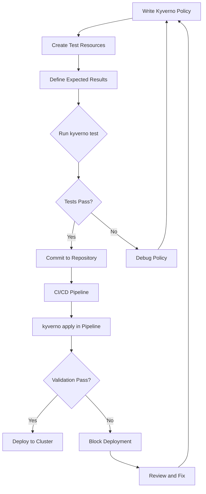
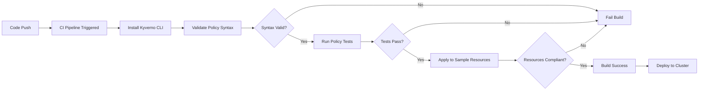

# How to Implement Kyverno CLI Usage

Author: [nawazdhandala](https://github.com/nawazdhandala)

Tags: Kyverno, Kubernetes, CLI, Testing

Description: Learn how to use the Kyverno CLI to test and validate Kubernetes policies before deploying them to your cluster.

---

## Introduction

Kyverno is a policy engine designed for Kubernetes that allows you to validate, mutate, and generate Kubernetes resources based on policies. The Kyverno CLI is a command-line tool that enables you to test policies locally without needing a running Kubernetes cluster. This makes it invaluable for policy development, debugging, and CI/CD integration.

## Installing the Kyverno CLI

### Using Homebrew (macOS/Linux)

```bash
# Install Kyverno CLI using Homebrew
brew install kyverno
```

### Using Go

```bash
# Install using Go (requires Go 1.21+)
go install github.com/kyverno/kyverno/cmd/cli/kubectl-kyverno@latest
```

### Using Krew (kubectl plugin manager)

```bash
# Install Kyverno as a kubectl plugin
kubectl krew install kyverno
```

### Download Pre-built Binaries

```bash
# Download the latest release for Linux
curl -LO https://github.com/kyverno/kyverno/releases/latest/download/kyverno-cli_linux_amd64.tar.gz

# Extract the binary
tar -xvf kyverno-cli_linux_amd64.tar.gz

# Move to a directory in your PATH
sudo mv kyverno /usr/local/bin/
```

### Verify Installation

```bash
# Check the installed version
kyverno version

# Or if installed as kubectl plugin
kubectl kyverno version
```

## Kyverno CLI Commands Overview

The Kyverno CLI provides several commands for policy management and testing:

| Command | Description |
|---------|-------------|
| `apply` | Apply policies to resources and check results |
| `test` | Run policy tests against test manifests |
| `validate` | Validate policy syntax and structure |
| `jp` | Evaluate JMESPath expressions |
| `version` | Display version information |

## CLI Workflow Diagram



## Policy Testing with the Apply Command

The `kyverno apply` command allows you to test policies against Kubernetes resources without a cluster.

### Basic Apply Usage

```bash
# Apply a policy to a resource file
kyverno apply policy.yaml --resource resource.yaml

# Apply multiple policies to multiple resources
kyverno apply policy1.yaml policy2.yaml --resource deployment.yaml --resource service.yaml

# Apply all policies in a directory
kyverno apply ./policies/ --resource ./resources/
```

### Example Policy: Require Labels

Create a policy file named `require-labels.yaml`:

```yaml
# require-labels.yaml
# This policy ensures all Pods have required labels
apiVersion: kyverno.io/v1
kind: ClusterPolicy
metadata:
  name: require-labels
spec:
  # validationFailureAction can be 'Enforce' or 'Audit'
  validationFailureAction: Enforce
  # Apply policy to Pod resources
  rules:
    - name: check-required-labels
      match:
        any:
          - resources:
              kinds:
                - Pod
      validate:
        message: "The labels 'app' and 'env' are required."
        pattern:
          metadata:
            labels:
              # These labels must be present
              app: "?*"
              env: "?*"
```

### Test Resource: Valid Pod

Create `valid-pod.yaml`:

```yaml
# valid-pod.yaml
# This Pod has all required labels and should pass validation
apiVersion: v1
kind: Pod
metadata:
  name: valid-pod
  labels:
    app: myapp
    env: production
spec:
  containers:
    - name: nginx
      image: nginx:1.25
```

### Test Resource: Invalid Pod

Create `invalid-pod.yaml`:

```yaml
# invalid-pod.yaml
# This Pod is missing the 'env' label and should fail validation
apiVersion: v1
kind: Pod
metadata:
  name: invalid-pod
  labels:
    app: myapp
    # Missing 'env' label
spec:
  containers:
    - name: nginx
      image: nginx:1.25
```

### Running the Apply Command

```bash
# Test valid pod (should pass)
kyverno apply require-labels.yaml --resource valid-pod.yaml

# Expected output:
# Applying 1 policy rule(s) to 1 resource(s)...
# pass: 1, fail: 0, warn: 0, error: 0, skip: 0

# Test invalid pod (should fail)
kyverno apply require-labels.yaml --resource invalid-pod.yaml

# Expected output:
# Applying 1 policy rule(s) to 1 resource(s)...
# pass: 0, fail: 1, warn: 0, error: 0, skip: 0
```

## Structured Policy Testing

The `kyverno test` command provides a structured way to define and run policy tests.

### Test Manifest Structure

Create a test manifest file named `kyverno-test.yaml`:

```yaml
# kyverno-test.yaml
# This file defines the test cases for our policies
name: require-labels-test
policies:
  # Reference to policy files
  - require-labels.yaml
resources:
  # Reference to resource files to test
  - valid-pod.yaml
  - invalid-pod.yaml
results:
  # Define expected results for each test case
  - policy: require-labels
    rule: check-required-labels
    resource: valid-pod
    kind: Pod
    # Expected result: pass
    result: pass
  - policy: require-labels
    rule: check-required-labels
    resource: invalid-pod
    kind: Pod
    # Expected result: fail
    result: fail
```

### Running Tests

```bash
# Run tests using the test manifest
kyverno test .

# Run tests with verbose output
kyverno test . --detailed-results

# Run tests from a specific directory
kyverno test ./tests/

# Expected output for successful tests:
# Test Results:
# require-labels-test
#   require-labels
#     check-required-labels
#       valid-pod: Pass
#       invalid-pod: Pass
# Test Summary: 2 tests passed
```

## Advanced Testing Scenarios

### Testing Mutation Policies

Create `add-default-labels.yaml`:

```yaml
# add-default-labels.yaml
# This policy adds default labels to Pods that are missing them
apiVersion: kyverno.io/v1
kind: ClusterPolicy
metadata:
  name: add-default-labels
spec:
  rules:
    - name: add-team-label
      match:
        any:
          - resources:
              kinds:
                - Pod
      mutate:
        # Add the 'team' label if not present
        patchStrategicMerge:
          metadata:
            labels:
              +(team): platform
```

Create test resource `pod-without-team.yaml`:

```yaml
# pod-without-team.yaml
# This Pod is missing the 'team' label
apiVersion: v1
kind: Pod
metadata:
  name: pod-without-team
  labels:
    app: myapp
spec:
  containers:
    - name: nginx
      image: nginx:1.25
```

Create expected patched resource `pod-with-team.yaml`:

```yaml
# pod-with-team.yaml
# This is the expected result after mutation
apiVersion: v1
kind: Pod
metadata:
  name: pod-without-team
  labels:
    app: myapp
    team: platform
spec:
  containers:
    - name: nginx
      image: nginx:1.25
```

Create mutation test manifest `mutation-test.yaml`:

```yaml
# mutation-test.yaml
# Test manifest for mutation policy
name: mutation-test
policies:
  - add-default-labels.yaml
resources:
  - pod-without-team.yaml
results:
  - policy: add-default-labels
    rule: add-team-label
    resource: pod-without-team
    kind: Pod
    # The patchedResource shows expected state after mutation
    patchedResource: pod-with-team.yaml
    result: pass
```

### Testing Generate Policies

Create `generate-configmap.yaml`:

```yaml
# generate-configmap.yaml
# This policy generates a ConfigMap when a Namespace is created
apiVersion: kyverno.io/v1
kind: ClusterPolicy
metadata:
  name: generate-configmap
spec:
  rules:
    - name: generate-default-config
      match:
        any:
          - resources:
              kinds:
                - Namespace
      generate:
        apiVersion: v1
        kind: ConfigMap
        name: default-config
        # Generate in the same namespace
        namespace: "{{request.object.metadata.name}}"
        data:
          data:
            log-level: "info"
            environment: "development"
```

### Testing with Variables

Create `test-with-variables.yaml`:

```yaml
# test-with-variables.yaml
# Test manifest using variable substitution
name: variable-test
policies:
  - generate-configmap.yaml
resources:
  - test-namespace.yaml
variables: values.yaml
results:
  - policy: generate-configmap
    rule: generate-default-config
    resource: test-namespace
    kind: Namespace
    result: pass
```

Create `values.yaml` for variables:

```yaml
# values.yaml
# Define variables for testing
policies:
  - name: generate-configmap
    rules:
      - name: generate-default-config
        values:
          request.object.metadata.name: test-namespace
```

## CI/CD Integration

### GitHub Actions Workflow

Create `.github/workflows/kyverno-test.yaml`:

```yaml
# .github/workflows/kyverno-test.yaml
# GitHub Actions workflow for Kyverno policy testing
name: Kyverno Policy Tests

on:
  push:
    branches:
      - main
    paths:
      - 'policies/**'
      - 'tests/**'
  pull_request:
    branches:
      - main
    paths:
      - 'policies/**'
      - 'tests/**'

jobs:
  test-policies:
    runs-on: ubuntu-latest
    steps:
      # Checkout the repository
      - name: Checkout code
        uses: actions/checkout@v4

      # Install Kyverno CLI
      - name: Install Kyverno CLI
        uses: kyverno/action-install-cli@v0.2.0

      # Validate policy syntax
      - name: Validate policies
        run: |
          kyverno validate ./policies/

      # Run policy tests
      - name: Run Kyverno tests
        run: |
          kyverno test ./tests/ --detailed-results

      # Apply policies to sample resources
      - name: Test policy application
        run: |
          kyverno apply ./policies/ --resource ./sample-resources/ --output json > results.json

          # Check for failures
          FAILURES=$(cat results.json | jq '.results[] | select(.result == "fail")' | wc -l)
          if [ "$FAILURES" -gt 0 ]; then
            echo "Policy validation failed!"
            cat results.json | jq '.results[] | select(.result == "fail")'
            exit 1
          fi
```

### GitLab CI Pipeline

Create `.gitlab-ci.yml`:

```yaml
# .gitlab-ci.yml
# GitLab CI pipeline for Kyverno policy testing
stages:
  - validate
  - test

variables:
  KYVERNO_VERSION: "1.12.0"

# Install Kyverno CLI
.install-kyverno: &install-kyverno
  before_script:
    - curl -LO "https://github.com/kyverno/kyverno/releases/download/v${KYVERNO_VERSION}/kyverno-cli_linux_amd64.tar.gz"
    - tar -xvf kyverno-cli_linux_amd64.tar.gz
    - mv kyverno /usr/local/bin/
    - kyverno version

# Validate policy syntax
validate-policies:
  stage: validate
  image: alpine:latest
  <<: *install-kyverno
  script:
    - kyverno validate ./policies/
  only:
    changes:
      - policies/**/*

# Run policy tests
test-policies:
  stage: test
  image: alpine:latest
  <<: *install-kyverno
  script:
    - kyverno test ./tests/ --detailed-results
  artifacts:
    reports:
      junit: test-results.xml
    when: always
  only:
    changes:
      - policies/**/*
      - tests/**/*
```

### Jenkins Pipeline

Create `Jenkinsfile`:

```groovy
// Jenkinsfile
// Jenkins pipeline for Kyverno policy testing
pipeline {
    agent any

    environment {
        KYVERNO_VERSION = '1.12.0'
    }

    stages {
        stage('Install Kyverno CLI') {
            steps {
                sh '''
                    curl -LO "https://github.com/kyverno/kyverno/releases/download/v${KYVERNO_VERSION}/kyverno-cli_linux_amd64.tar.gz"
                    tar -xvf kyverno-cli_linux_amd64.tar.gz
                    chmod +x kyverno
                '''
            }
        }

        stage('Validate Policies') {
            steps {
                sh './kyverno validate ./policies/'
            }
        }

        stage('Run Policy Tests') {
            steps {
                sh './kyverno test ./tests/ --detailed-results'
            }
        }

        stage('Apply Policies to Resources') {
            steps {
                script {
                    def result = sh(
                        script: './kyverno apply ./policies/ --resource ./sample-resources/',
                        returnStatus: true
                    )
                    if (result != 0) {
                        error('Policy validation failed!')
                    }
                }
            }
        }
    }

    post {
        always {
            cleanWs()
        }
    }
}
```

## CI/CD Pipeline Flow



## Best Practices

### 1. Organize Your Test Directory Structure

```
project/
├── policies/
│   ├── validation/
│   │   ├── require-labels.yaml
│   │   └── require-resources.yaml
│   └── mutation/
│       └── add-default-labels.yaml
├── tests/
│   ├── validation/
│   │   ├── kyverno-test.yaml
│   │   ├── valid-resources/
│   │   └── invalid-resources/
│   └── mutation/
│       ├── kyverno-test.yaml
│       └── resources/
└── sample-resources/
    ├── deployments/
    └── pods/
```

### 2. Use Descriptive Test Names

```yaml
# Use clear, descriptive names for test cases
results:
  - policy: require-labels
    rule: check-required-labels
    resource: pod-with-all-labels-should-pass
    result: pass
  - policy: require-labels
    rule: check-required-labels
    resource: pod-missing-env-label-should-fail
    result: fail
```

### 3. Test Edge Cases

```yaml
# Test edge cases like empty values
apiVersion: v1
kind: Pod
metadata:
  name: pod-with-empty-label
  labels:
    app: ""  # Empty label value
    env: production
spec:
  containers:
    - name: nginx
      image: nginx:1.25
```

### 4. Version Control Your Policies

```bash
# Use git tags for policy versions
git tag -a policies-v1.0.0 -m "Initial policy release"
git push origin policies-v1.0.0
```

## Troubleshooting Common Issues

### Policy Not Matching Resources

```bash
# Use verbose output to debug matching
kyverno apply policy.yaml --resource resource.yaml -v 4

# Check if the resource kind matches
kyverno apply policy.yaml --resource resource.yaml --detailed-results
```

### JMESPath Expression Debugging

```bash
# Test JMESPath expressions independently
kyverno jp query -i resource.yaml "metadata.labels"

# Test complex expressions
kyverno jp query -i resource.yaml "spec.containers[*].image"
```

### Mutation Not Applied

```bash
# View the mutated resource
kyverno apply mutation-policy.yaml --resource resource.yaml -o yaml

# Compare with expected output
diff <(kyverno apply mutation-policy.yaml --resource resource.yaml -o yaml) expected.yaml
```

## Conclusion

The Kyverno CLI is an essential tool for policy development and testing in Kubernetes environments. By integrating policy testing into your CI/CD pipeline, you can catch policy violations early in the development cycle and ensure consistent enforcement across your clusters. The ability to test policies locally without a running cluster accelerates development and reduces the feedback loop for policy authors.

Key takeaways:
- Use `kyverno apply` for quick policy testing against resources
- Use `kyverno test` for structured, repeatable test suites
- Integrate Kyverno CLI into your CI/CD pipeline for automated policy validation
- Organize your policies and tests in a clear directory structure
- Test both valid and invalid resources to ensure policies work as expected

## References

- [Kyverno Official Documentation](https://kyverno.io/docs/)
- [Kyverno CLI Reference](https://kyverno.io/docs/kyverno-cli/)
- [Kyverno GitHub Repository](https://github.com/kyverno/kyverno)
- [Kyverno Policy Library](https://kyverno.io/policies/)
