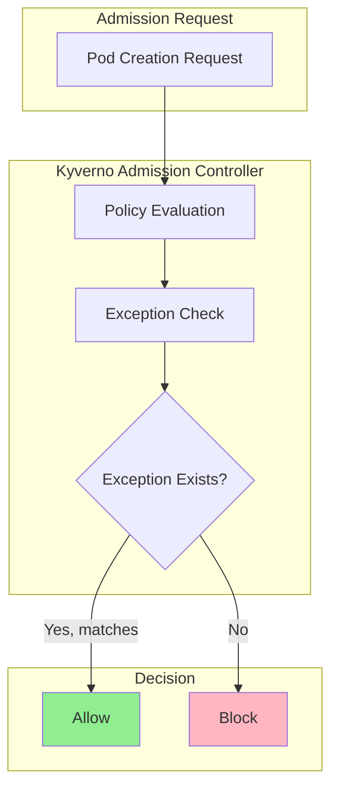
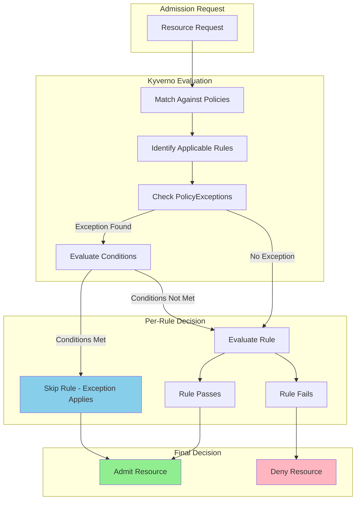

# How to Create Kyverno Policy Exceptions

Author: [nawazdhandala](https://github.com/nawazdhandala)

Tags: Kyverno, Kubernetes, Policy, Exceptions

Description: Learn how to use Kyverno PolicyException resources for targeted exemptions without weakening cluster-wide security policies.

---

Kyverno policies enforce security and compliance across your Kubernetes cluster. But sometimes you need exceptions. A legacy application might require root privileges. A debugging pod might need host network access. Instead of weakening your policies for everyone, PolicyException lets you create targeted exemptions for specific workloads.

## Understanding Policy Exceptions

PolicyException is a Kyverno resource that allows specific resources to bypass policy rules. It keeps your policies strict by default while enabling controlled deviations where necessary.



### When to Use Policy Exceptions

Use PolicyException for:
- Legacy applications that cannot be modified
- Debugging and troubleshooting scenarios
- Third-party tools with specific requirements
- Gradual policy rollouts

Do not use PolicyException for:
- Blanket exemptions across namespaces
- Permanent workarounds for fixable issues
- Bypassing security for convenience

## PolicyException Resource Structure

Here is the basic structure of a PolicyException:

```yaml
# PolicyException allows specific resources to bypass policy rules
# This creates a targeted exemption without modifying the original policy
apiVersion: kyverno.io/v2beta1
kind: PolicyException
metadata:
  name: allow-privileged-debugger
  namespace: kyverno  # PolicyExceptions typically live in the kyverno namespace
spec:
  # exceptions lists the policies and rules to exempt
  exceptions:
    - policyName: disallow-privileged-containers
      ruleNames:
        - require-non-privileged
        - restrict-privilege-escalation
  # match defines which resources get the exemption
  match:
    any:
      - resources:
          kinds:
            - Pod
          namespaces:
            - debugging
          names:
            - "debug-*"
```

### Key Fields Explained

| Field | Description | Required |
|-------|-------------|----------|
| `spec.exceptions` | List of policies and rules to exempt | Yes |
| `spec.exceptions[].policyName` | Name of the ClusterPolicy or Policy | Yes |
| `spec.exceptions[].ruleNames` | Specific rules within the policy | Yes |
| `spec.match` | Resources that receive the exemption | Yes |
| `spec.conditions` | Additional conditions for the exception | No |

## Exception Scoping

PolicyException supports granular scoping at multiple levels.

### Namespace Scoping

Limit exceptions to specific namespaces:

```yaml
apiVersion: kyverno.io/v2beta1
kind: PolicyException
metadata:
  name: legacy-app-exception
  namespace: kyverno
spec:
  exceptions:
    - policyName: require-resource-limits
      ruleNames:
        - validate-limits
  match:
    any:
      - resources:
          kinds:
            - Pod
            - Deployment
          # Only applies to the legacy namespace
          namespaces:
            - legacy-apps
            - legacy-services
```

### Resource Name Scoping

Target specific resources by name pattern:

```yaml
apiVersion: kyverno.io/v2beta1
kind: PolicyException
metadata:
  name: monitoring-exception
  namespace: kyverno
spec:
  exceptions:
    - policyName: disallow-host-network
      ruleNames:
        - validate-host-network
  match:
    any:
      - resources:
          kinds:
            - Pod
          namespaces:
            - monitoring
          # Wildcard matching for resource names
          names:
            - "prometheus-*"
            - "node-exporter-*"
```

### Label-Based Scoping

Use label selectors for dynamic matching:

```yaml
apiVersion: kyverno.io/v2beta1
kind: PolicyException
metadata:
  name: ci-runner-exception
  namespace: kyverno
spec:
  exceptions:
    - policyName: restrict-image-registries
      ruleNames:
        - validate-registries
  match:
    any:
      - resources:
          kinds:
            - Pod
          # Match pods with specific labels
          selector:
            matchLabels:
              app.kubernetes.io/component: ci-runner
              exception-approved: "true"
```

### Rule-Level Scoping

Exempt specific rules while keeping others enforced:

```yaml
apiVersion: kyverno.io/v2beta1
kind: PolicyException
metadata:
  name: partial-policy-exception
  namespace: kyverno
spec:
  exceptions:
    - policyName: pod-security-standard
      # Only exempt the privilege escalation rule
      # Other rules in the policy still apply
      ruleNames:
        - restrict-privilege-escalation
    - policyName: require-labels
      # Exempt multiple rules from a different policy
      ruleNames:
        - require-team-label
        - require-cost-center-label
  match:
    any:
      - resources:
          kinds:
            - Pod
          namespaces:
            - third-party-tools
```

## Exception Evaluation Flow

The following diagram shows how Kyverno evaluates exceptions during admission:



## Condition-Based Exceptions

Add conditions to make exceptions more specific. Conditions evaluate against the resource being admitted.

### Basic Condition Example

```yaml
apiVersion: kyverno.io/v2beta1
kind: PolicyException
metadata:
  name: conditional-exception
  namespace: kyverno
spec:
  exceptions:
    - policyName: disallow-latest-tag
      ruleNames:
        - validate-image-tag
  match:
    any:
      - resources:
          kinds:
            - Pod
          namespaces:
            - development
  # Conditions add extra criteria for the exception to apply
  conditions:
    any:
      # Only apply exception if the annotation is present
      - key: "{{ request.object.metadata.annotations.\"allow-latest-tag\" }}"
        operator: Equals
        value: "approved"
```

### Multiple Conditions

```yaml
apiVersion: kyverno.io/v2beta1
kind: PolicyException
metadata:
  name: time-limited-exception
  namespace: kyverno
spec:
  exceptions:
    - policyName: require-readonly-root
      ruleNames:
        - validate-readonly-root
  match:
    any:
      - resources:
          kinds:
            - Pod
          namespaces:
            - debugging
  conditions:
    # All conditions must be true (AND logic)
    all:
      # Must have the debugging label
      - key: "{{ request.object.metadata.labels.purpose }}"
        operator: Equals
        value: "debugging"
      # Must have TTL annotation
      - key: "{{ request.object.metadata.annotations.ttl }}"
        operator: NotEquals
        value: ""
      # Must be created by approved user
      - key: "{{ request.userInfo.username }}"
        operator: AnyIn
        value:
          - "admin@example.com"
          - "sre-team@example.com"
```

### Combining Any and All Conditions

```yaml
apiVersion: kyverno.io/v2beta1
kind: PolicyException
metadata:
  name: complex-conditions
  namespace: kyverno
spec:
  exceptions:
    - policyName: restrict-capabilities
      ruleNames:
        - drop-all-capabilities
  match:
    any:
      - resources:
          kinds:
            - Pod
  conditions:
    # Must satisfy ALL of these
    all:
      - key: "{{ request.object.metadata.namespace }}"
        operator: AnyIn
        value:
          - "system-tools"
          - "monitoring"
    # AND must satisfy ANY of these
    any:
      - key: "{{ request.object.metadata.labels.app }}"
        operator: Equals
        value: "network-scanner"
      - key: "{{ request.object.metadata.labels.app }}"
        operator: Equals
        value: "security-audit"
```

## Audit Trail for Exceptions

Tracking who created exceptions and why is critical for security compliance.

### Adding Metadata for Auditing

```yaml
apiVersion: kyverno.io/v2beta1
kind: PolicyException
metadata:
  name: database-migration-exception
  namespace: kyverno
  labels:
    # Track approval status
    approval-status: approved
    # Track the team responsible
    requesting-team: platform
    # Track review cycle
    review-date: "2026-02-01"
  annotations:
    # Document the reason for exception
    exception-reason: "Database migration tool requires elevated privileges for schema changes"
    # Track approval chain
    approved-by: "security-team@example.com"
    approval-ticket: "SEC-2026-0142"
    # Set expiration for temporary exceptions
    expiration-date: "2026-03-01"
    # Link to related documentation
    documentation: "https://wiki.example.com/db-migration-exception"
spec:
  exceptions:
    - policyName: disallow-privileged-containers
      ruleNames:
        - require-non-privileged
  match:
    any:
      - resources:
          kinds:
            - Job
          namespaces:
            - database
          names:
            - "migration-*"
```

### Automated Audit Reports

Create a script to generate exception reports:

```bash
#!/bin/bash
# audit-exceptions.sh
# Generate a report of all PolicyExceptions in the cluster

echo "=== Kyverno PolicyException Audit Report ==="
echo "Generated: $(date)"
echo ""

# List all exceptions with their metadata
kubectl get policyexceptions -A -o custom-columns=\
'NAMESPACE:.metadata.namespace,'\
'NAME:.metadata.name,'\
'POLICY:.spec.exceptions[*].policyName,'\
'APPROVED_BY:.metadata.annotations.approved-by,'\
'TICKET:.metadata.annotations.approval-ticket,'\
'EXPIRES:.metadata.annotations.expiration-date'

echo ""
echo "=== Exceptions Without Approval Ticket ==="
kubectl get policyexceptions -A -o json | \
  jq -r '.items[] | select(.metadata.annotations."approval-ticket" == null) |
  "\(.metadata.namespace)/\(.metadata.name)"'

echo ""
echo "=== Expired Exceptions ==="
TODAY=$(date +%Y-%m-%d)
kubectl get policyexceptions -A -o json | \
  jq -r --arg today "$TODAY" '.items[] |
  select(.metadata.annotations."expiration-date" != null) |
  select(.metadata.annotations."expiration-date" < $today) |
  "\(.metadata.namespace)/\(.metadata.name) expired on \(.metadata.annotations."expiration-date")"'
```

### Monitoring Exceptions with Prometheus

```yaml
# ServiceMonitor for Kyverno metrics
apiVersion: monitoring.coreos.com/v1
kind: ServiceMonitor
metadata:
  name: kyverno-metrics
  namespace: monitoring
spec:
  selector:
    matchLabels:
      app.kubernetes.io/name: kyverno
  endpoints:
    - port: metrics
      interval: 30s
---
# Alert for new exceptions
apiVersion: monitoring.coreos.com/v1
kind: PrometheusRule
metadata:
  name: kyverno-exception-alerts
  namespace: monitoring
spec:
  groups:
    - name: kyverno-exceptions
      rules:
        - alert: NewPolicyExceptionCreated
          # Kyverno emits metrics when exceptions are used
          expr: increase(kyverno_policy_results_total{rule_result="skip"}[1h]) > 0
          for: 5m
          labels:
            severity: info
          annotations:
            summary: "Policy exceptions are being actively used"
            description: "{{ $value }} resources skipped policy rules in the last hour"

        - alert: HighExceptionUsage
          expr: kyverno_policy_results_total{rule_result="skip"} > 100
          for: 10m
          labels:
            severity: warning
          annotations:
            summary: "High number of policy exceptions in use"
```

## Practical Examples

### Example 1: Debug Pod Exception

Allow engineers to run privileged debug pods temporarily:

```yaml
apiVersion: kyverno.io/v2beta1
kind: PolicyException
metadata:
  name: debug-pod-exception
  namespace: kyverno
  annotations:
    exception-reason: "Allow privileged debug pods for troubleshooting"
    approved-by: "platform-team@example.com"
spec:
  exceptions:
    - policyName: disallow-privileged-containers
      ruleNames:
        - require-non-privileged
        - restrict-privilege-escalation
    - policyName: disallow-host-namespaces
      ruleNames:
        - validate-host-network
        - validate-host-pid
  match:
    any:
      - resources:
          kinds:
            - Pod
          namespaces:
            - debugging
          names:
            - "debug-*"
  conditions:
    all:
      # Must have TTL label for automatic cleanup
      - key: "{{ request.object.metadata.labels.ttl }}"
        operator: NotEquals
        value: ""
      # Must be created by SRE team
      - key: "{{ request.userInfo.groups }}"
        operator: AnyIn
        value:
          - "sre-team"
          - "platform-team"
```

### Example 2: Third-Party Tool Exception

Exempt a vendor tool that requires specific capabilities:

```yaml
apiVersion: kyverno.io/v2beta1
kind: PolicyException
metadata:
  name: vault-agent-exception
  namespace: kyverno
  annotations:
    exception-reason: "HashiCorp Vault Agent requires IPC_LOCK capability for memory locking"
    approved-by: "security-team@example.com"
    approval-ticket: "SEC-2026-0089"
    documentation: "https://developer.hashicorp.com/vault/docs/platform/k8s"
spec:
  exceptions:
    - policyName: restrict-capabilities
      ruleNames:
        - require-drop-all
        - restrict-added-capabilities
  match:
    any:
      - resources:
          kinds:
            - Pod
          selector:
            matchLabels:
              app.kubernetes.io/name: vault-agent
  conditions:
    all:
      # Only allow the specific capability needed
      - key: "{{ request.object.spec.containers[].securityContext.capabilities.add[] }}"
        operator: AnyIn
        value:
          - "IPC_LOCK"
```

### Example 3: CI/CD Pipeline Exception

Allow CI runners to use images from any registry during builds:

```yaml
apiVersion: kyverno.io/v2beta1
kind: PolicyException
metadata:
  name: ci-runner-registry-exception
  namespace: kyverno
  annotations:
    exception-reason: "CI runners need to pull images from various registries during build"
    approved-by: "devops-team@example.com"
    review-date: "2026-04-01"
spec:
  exceptions:
    - policyName: restrict-image-registries
      ruleNames:
        - validate-registries
    - policyName: require-image-digest
      ruleNames:
        - require-digest
  match:
    any:
      - resources:
          kinds:
            - Pod
          namespaces:
            - ci-runners
          selector:
            matchLabels:
              app: gitlab-runner
  conditions:
    any:
      - key: "{{ request.object.metadata.annotations.ci-job-type }}"
        operator: Equals
        value: "build"
      - key: "{{ request.object.metadata.annotations.ci-job-type }}"
        operator: Equals
        value: "test"
```

### Example 4: Gradual Policy Rollout

Use exceptions during policy migration:

```yaml
apiVersion: kyverno.io/v2beta1
kind: PolicyException
metadata:
  name: migration-grace-period
  namespace: kyverno
  annotations:
    exception-reason: "Temporary exception during policy rollout - teams have until 2026-03-01 to comply"
    expiration-date: "2026-03-01"
    tracking-issue: "https://github.com/org/repo/issues/456"
spec:
  exceptions:
    - policyName: require-resource-requests
      ruleNames:
        - validate-cpu-request
        - validate-memory-request
  match:
    any:
      - resources:
          kinds:
            - Deployment
            - StatefulSet
          namespaces:
            - team-alpha
            - team-beta
            - team-gamma
  conditions:
    all:
      # Only apply to existing workloads
      - key: "{{ request.object.metadata.annotations.migration-exemption }}"
        operator: Equals
        value: "approved"
```

## Managing Exception Lifecycle

### Creating Exceptions with Approval Workflow

```yaml
# 1. Create exception request in Git
apiVersion: kyverno.io/v2beta1
kind: PolicyException
metadata:
  name: my-exception-request
  namespace: kyverno
  labels:
    approval-status: pending  # Start as pending
  annotations:
    requested-by: "developer@example.com"
    request-date: "2026-01-30"
    exception-reason: "Detailed reason for the exception"
spec:
  # ... exception spec
```

```bash
# 2. After security review, update status
kubectl label policyexception my-exception-request \
  -n kyverno \
  approval-status=approved \
  --overwrite

kubectl annotate policyexception my-exception-request \
  -n kyverno \
  approved-by="security-team@example.com" \
  approval-ticket="SEC-2026-0200"
```

### Cleaning Up Expired Exceptions

```bash
#!/bin/bash
# cleanup-expired-exceptions.sh
# Remove PolicyExceptions past their expiration date

TODAY=$(date +%Y-%m-%d)

# Find and delete expired exceptions
kubectl get policyexceptions -A -o json | \
  jq -r --arg today "$TODAY" '.items[] |
  select(.metadata.annotations."expiration-date" != null) |
  select(.metadata.annotations."expiration-date" < $today) |
  "\(.metadata.namespace) \(.metadata.name)"' | \
  while read ns name; do
    echo "Deleting expired exception: $ns/$name"
    kubectl delete policyexception "$name" -n "$ns"
  done
```

## Best Practices

### 1. Require Approval Metadata

Enforce documentation on all exceptions:

```yaml
# Policy to validate PolicyException resources themselves
apiVersion: kyverno.io/v1
kind: ClusterPolicy
metadata:
  name: require-exception-approval
spec:
  validationFailureAction: Enforce
  rules:
    - name: require-approval-annotations
      match:
        any:
          - resources:
              kinds:
                - PolicyException
      validate:
        message: "PolicyExceptions must have approval metadata"
        pattern:
          metadata:
            annotations:
              exception-reason: "?*"
              approved-by: "?*"
              approval-ticket: "?*"
```

### 2. Limit Exception Scope

Never create cluster-wide exceptions:

```yaml
# Good: Scoped to specific namespace and names
match:
  any:
    - resources:
        kinds:
          - Pod
        namespaces:
          - specific-namespace
        names:
          - "specific-pod-*"

# Bad: Too broad
match:
  any:
    - resources:
        kinds:
          - Pod
        # No namespace or name restrictions
```

### 3. Set Expiration Dates

All exceptions should be temporary:

```yaml
metadata:
  annotations:
    expiration-date: "2026-03-01"  # Review and renew if needed
    review-date: "2026-02-15"      # Reminder to review before expiration
```

### 4. Use Conditions for Extra Safety

Add conditions to limit exception applicability:

```yaml
conditions:
  all:
    # Limit to specific users
    - key: "{{ request.userInfo.username }}"
      operator: AnyIn
      value: ["approved-user@example.com"]
    # Require justification annotation
    - key: "{{ request.object.metadata.annotations.justification }}"
      operator: NotEquals
      value: ""
```

### 5. Monitor Exception Usage

Track when exceptions are actually used:

```bash
# Check Kyverno admission controller logs
kubectl logs -n kyverno -l app=kyverno -c kyverno | \
  grep "policy rule skipped" | \
  jq -r '.policy, .rule, .resource'
```

---

PolicyException gives you the flexibility to handle edge cases without compromising cluster-wide security. Use it sparingly, document thoroughly, and review regularly. Every exception should have an owner, a reason, and an expiration date. Your security posture depends on treating exceptions as temporary deviations rather than permanent workarounds.
