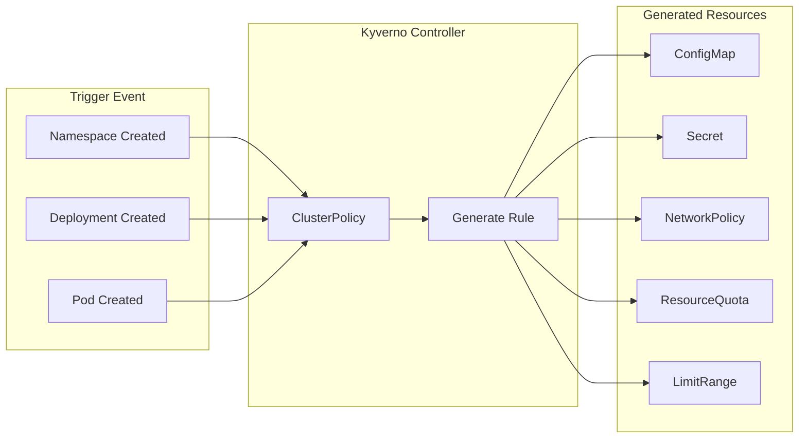
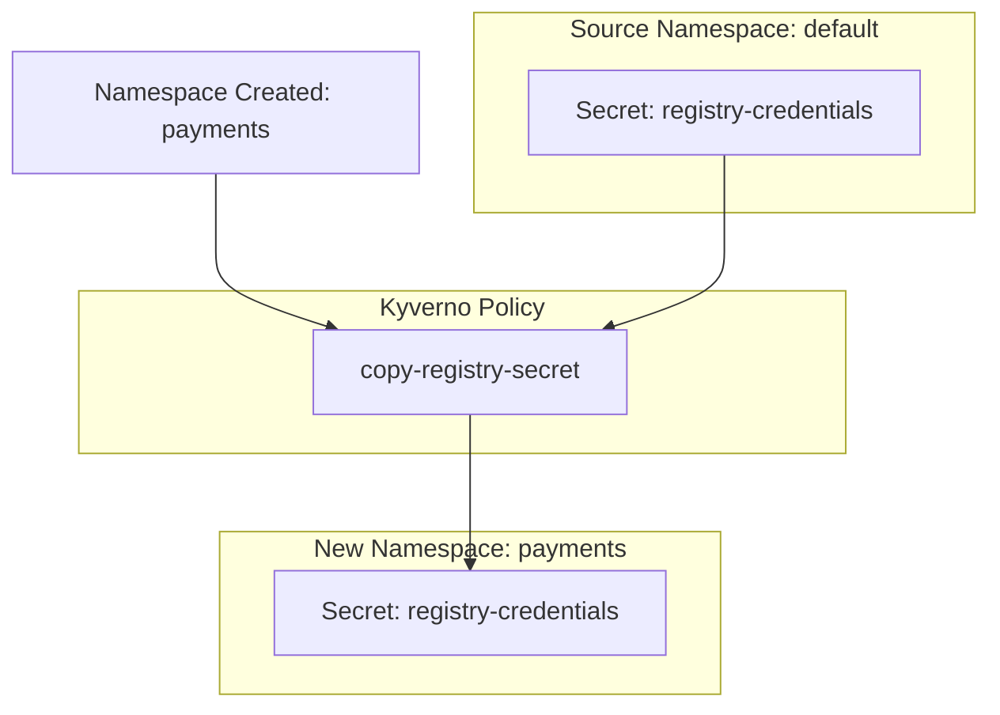
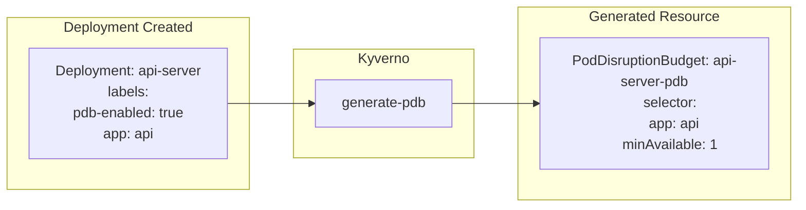

# How to Implement Kyverno Policy Generation

Author: [nawazdhandala](https://github.com/nawazdhandala)

Tags: Kyverno, Kubernetes, Policy, Generation

Description: Learn how to use Kyverno generate rules to automatically create ConfigMaps, Secrets, NetworkPolicies, and other resources when namespaces or workloads are deployed.

---

Manual resource creation is tedious and error-prone. When a new namespace gets created, you want default configurations, network policies, and secrets to appear automatically. Kyverno's generate rules make this possible by creating resources in response to other resources being created or updated.

## Understanding Kyverno Generate Rules

Kyverno is a policy engine for Kubernetes that validates, mutates, and generates resources. Generate rules create new resources when specific conditions are met.



### When to Use Generate Rules

Generate rules work well for:
- Default NetworkPolicies for new namespaces
- Standard ConfigMaps with organization-wide settings
- TLS secrets from cert-manager certificates
- ResourceQuotas and LimitRanges for tenant isolation
- RBAC RoleBindings for namespace owners

## Installing Kyverno

```bash
# Using Helm
helm repo add kyverno https://kyverno.github.io/kyverno/
helm repo update

helm install kyverno kyverno/kyverno \
  --namespace kyverno \
  --create-namespace \
  --set replicaCount=3

# Verify installation
kubectl get pods -n kyverno
```

## Generate Rule Basics

A generate rule has these components:

```yaml
apiVersion: kyverno.io/v1
kind: ClusterPolicy
metadata:
  name: example-generate
spec:
  rules:
    - name: generate-resource
      match:
        any:
          - resources:
              kinds:
                - Namespace  # Trigger resource
      generate:
        synchronize: true  # Keep generated resource in sync
        apiVersion: v1
        kind: ConfigMap
        name: default-config
        namespace: "{{request.object.metadata.name}}"
        data:
          data:
            key: value
```

### Synchronize Option

The `synchronize` field controls behavior:
- `true`: Generated resource stays in sync with the policy. Changes to the policy update all generated resources. Deleting the trigger deletes generated resources.
- `false` (default): Resource is generated once and managed independently.

## Generating ConfigMaps for New Namespaces

Create a standard ConfigMap with organization settings whenever a namespace is created.

```yaml
apiVersion: kyverno.io/v1
kind: ClusterPolicy
metadata:
  name: generate-default-configmap
spec:
  rules:
    - name: create-default-configmap
      match:
        any:
          - resources:
              kinds:
                - Namespace
      exclude:
        any:
          - resources:
              namespaces:
                - kube-system
                - kube-public
                - kube-node-lease
                - kyverno
      generate:
        synchronize: true
        apiVersion: v1
        kind: ConfigMap
        name: default-settings
        namespace: "{{request.object.metadata.name}}"
        data:
          metadata:
            labels:
              generated-by: kyverno
          data:
            LOG_LEVEL: "info"
            ENVIRONMENT: "production"
            METRICS_ENABLED: "true"
            TRACING_ENDPOINT: "http://otel-collector.observability:4317"
```

### Using Namespace Labels in Generated ConfigMaps

Pull values from the triggering namespace's labels:

```yaml
apiVersion: kyverno.io/v1
kind: ClusterPolicy
metadata:
  name: generate-env-configmap
spec:
  rules:
    - name: create-env-configmap
      match:
        any:
          - resources:
              kinds:
                - Namespace
              selector:
                matchLabels:
                  managed: "true"
      generate:
        synchronize: true
        apiVersion: v1
        kind: ConfigMap
        name: environment-config
        namespace: "{{request.object.metadata.name}}"
        data:
          data:
            TEAM: "{{request.object.metadata.labels.team}}"
            ENVIRONMENT: "{{request.object.metadata.labels.environment}}"
            COST_CENTER: "{{request.object.metadata.labels.cost-center}}"
```

Create a namespace with required labels:

```yaml
apiVersion: v1
kind: Namespace
metadata:
  name: payments-prod
  labels:
    managed: "true"
    team: payments
    environment: production
    cost-center: cc-1234
```

## Generating Secrets

### Copy Secrets to New Namespaces

Clone a secret from a source namespace to all new namespaces:

```yaml
apiVersion: kyverno.io/v1
kind: ClusterPolicy
metadata:
  name: copy-registry-secret
spec:
  rules:
    - name: copy-docker-credentials
      match:
        any:
          - resources:
              kinds:
                - Namespace
      exclude:
        any:
          - resources:
              namespaces:
                - kube-system
                - kube-public
      generate:
        synchronize: true
        apiVersion: v1
        kind: Secret
        name: registry-credentials
        namespace: "{{request.object.metadata.name}}"
        clone:
          namespace: default
          name: registry-credentials
```



### Generate TLS Secrets from Certificates

When a namespace has a specific label, generate a TLS secret by copying from a cert-manager managed namespace:

```yaml
apiVersion: kyverno.io/v1
kind: ClusterPolicy
metadata:
  name: copy-tls-secret
spec:
  rules:
    - name: copy-wildcard-tls
      match:
        any:
          - resources:
              kinds:
                - Namespace
              selector:
                matchLabels:
                  tls-enabled: "true"
      generate:
        synchronize: true
        apiVersion: v1
        kind: Secret
        name: wildcard-tls
        namespace: "{{request.object.metadata.name}}"
        clone:
          namespace: cert-manager
          name: wildcard-tls-secret
```

## Generating NetworkPolicies

Network isolation is critical for security. Generate default-deny policies for all new namespaces.

### Default Deny All Traffic

```yaml
apiVersion: kyverno.io/v1
kind: ClusterPolicy
metadata:
  name: generate-default-deny-network-policy
spec:
  rules:
    - name: default-deny-ingress
      match:
        any:
          - resources:
              kinds:
                - Namespace
      exclude:
        any:
          - resources:
              namespaces:
                - kube-system
                - kube-public
                - ingress-nginx
      generate:
        synchronize: true
        apiVersion: networking.k8s.io/v1
        kind: NetworkPolicy
        name: default-deny-ingress
        namespace: "{{request.object.metadata.name}}"
        data:
          spec:
            podSelector: {}
            policyTypes:
              - Ingress

    - name: default-deny-egress
      match:
        any:
          - resources:
              kinds:
                - Namespace
      exclude:
        any:
          - resources:
              namespaces:
                - kube-system
                - kube-public
                - ingress-nginx
      generate:
        synchronize: true
        apiVersion: networking.k8s.io/v1
        kind: NetworkPolicy
        name: default-deny-egress
        namespace: "{{request.object.metadata.name}}"
        data:
          spec:
            podSelector: {}
            policyTypes:
              - Egress
```

### Allow DNS Resolution

After default deny, pods cannot resolve DNS. Generate a policy to allow it:

```yaml
apiVersion: kyverno.io/v1
kind: ClusterPolicy
metadata:
  name: generate-allow-dns
spec:
  rules:
    - name: allow-dns-egress
      match:
        any:
          - resources:
              kinds:
                - Namespace
      exclude:
        any:
          - resources:
              namespaces:
                - kube-system
                - kube-public
      generate:
        synchronize: true
        apiVersion: networking.k8s.io/v1
        kind: NetworkPolicy
        name: allow-dns
        namespace: "{{request.object.metadata.name}}"
        data:
          spec:
            podSelector: {}
            policyTypes:
              - Egress
            egress:
              - to:
                  - namespaceSelector:
                      matchLabels:
                        kubernetes.io/metadata.name: kube-system
                ports:
                  - protocol: UDP
                    port: 53
                  - protocol: TCP
                    port: 53
```

### Complete Network Policy Set

Combine multiple network policies in a single ClusterPolicy:

```yaml
apiVersion: kyverno.io/v1
kind: ClusterPolicy
metadata:
  name: generate-network-policies
spec:
  rules:
    - name: default-deny-all
      match:
        any:
          - resources:
              kinds:
                - Namespace
              selector:
                matchLabels:
                  network-policies: "strict"
      generate:
        synchronize: true
        apiVersion: networking.k8s.io/v1
        kind: NetworkPolicy
        name: default-deny-all
        namespace: "{{request.object.metadata.name}}"
        data:
          spec:
            podSelector: {}
            policyTypes:
              - Ingress
              - Egress

    - name: allow-dns
      match:
        any:
          - resources:
              kinds:
                - Namespace
              selector:
                matchLabels:
                  network-policies: "strict"
      generate:
        synchronize: true
        apiVersion: networking.k8s.io/v1
        kind: NetworkPolicy
        name: allow-dns
        namespace: "{{request.object.metadata.name}}"
        data:
          spec:
            podSelector: {}
            policyTypes:
              - Egress
            egress:
              - to:
                  - namespaceSelector:
                      matchLabels:
                        kubernetes.io/metadata.name: kube-system
                ports:
                  - protocol: UDP
                    port: 53

    - name: allow-prometheus-scraping
      match:
        any:
          - resources:
              kinds:
                - Namespace
              selector:
                matchLabels:
                  network-policies: "strict"
      generate:
        synchronize: true
        apiVersion: networking.k8s.io/v1
        kind: NetworkPolicy
        name: allow-prometheus-scraping
        namespace: "{{request.object.metadata.name}}"
        data:
          spec:
            podSelector: {}
            policyTypes:
              - Ingress
            ingress:
              - from:
                  - namespaceSelector:
                      matchLabels:
                        kubernetes.io/metadata.name: monitoring
                ports:
                  - protocol: TCP
                    port: 9090
```

## Generating ResourceQuotas and LimitRanges

### ResourceQuota Based on Namespace Labels

```yaml
apiVersion: kyverno.io/v1
kind: ClusterPolicy
metadata:
  name: generate-resourcequota
spec:
  rules:
    - name: small-quota
      match:
        any:
          - resources:
              kinds:
                - Namespace
              selector:
                matchLabels:
                  quota-tier: small
      generate:
        synchronize: true
        apiVersion: v1
        kind: ResourceQuota
        name: compute-quota
        namespace: "{{request.object.metadata.name}}"
        data:
          spec:
            hard:
              requests.cpu: "2"
              requests.memory: 4Gi
              limits.cpu: "4"
              limits.memory: 8Gi
              pods: "10"

    - name: medium-quota
      match:
        any:
          - resources:
              kinds:
                - Namespace
              selector:
                matchLabels:
                  quota-tier: medium
      generate:
        synchronize: true
        apiVersion: v1
        kind: ResourceQuota
        name: compute-quota
        namespace: "{{request.object.metadata.name}}"
        data:
          spec:
            hard:
              requests.cpu: "8"
              requests.memory: 16Gi
              limits.cpu: "16"
              limits.memory: 32Gi
              pods: "50"

    - name: large-quota
      match:
        any:
          - resources:
              kinds:
                - Namespace
              selector:
                matchLabels:
                  quota-tier: large
      generate:
        synchronize: true
        apiVersion: v1
        kind: ResourceQuota
        name: compute-quota
        namespace: "{{request.object.metadata.name}}"
        data:
          spec:
            hard:
              requests.cpu: "32"
              requests.memory: 64Gi
              limits.cpu: "64"
              limits.memory: 128Gi
              pods: "200"
```

### Default LimitRange

```yaml
apiVersion: kyverno.io/v1
kind: ClusterPolicy
metadata:
  name: generate-limitrange
spec:
  rules:
    - name: create-limitrange
      match:
        any:
          - resources:
              kinds:
                - Namespace
      exclude:
        any:
          - resources:
              namespaces:
                - kube-system
                - kube-public
                - kyverno
      generate:
        synchronize: true
        apiVersion: v1
        kind: LimitRange
        name: default-limits
        namespace: "{{request.object.metadata.name}}"
        data:
          spec:
            limits:
              - default:
                  cpu: 500m
                  memory: 512Mi
                defaultRequest:
                  cpu: 100m
                  memory: 128Mi
                type: Container
```

## Generating RBAC Resources

### Namespace Admin RoleBinding

Create a RoleBinding for the team that owns the namespace:

```yaml
apiVersion: kyverno.io/v1
kind: ClusterPolicy
metadata:
  name: generate-namespace-admin
spec:
  rules:
    - name: create-admin-rolebinding
      match:
        any:
          - resources:
              kinds:
                - Namespace
              selector:
                matchExpressions:
                  - key: team
                    operator: Exists
      generate:
        synchronize: true
        apiVersion: rbac.authorization.k8s.io/v1
        kind: RoleBinding
        name: namespace-admin
        namespace: "{{request.object.metadata.name}}"
        data:
          metadata:
            labels:
              generated-by: kyverno
          roleRef:
            apiGroup: rbac.authorization.k8s.io
            kind: ClusterRole
            name: admin
          subjects:
            - apiGroup: rbac.authorization.k8s.io
              kind: Group
              name: "{{request.object.metadata.labels.team}}-admins"
```

## Generating Resources on Deployment Creation

Generate resources when workloads are created, not just namespaces.

### Create PodDisruptionBudget for Deployments

```yaml
apiVersion: kyverno.io/v1
kind: ClusterPolicy
metadata:
  name: generate-pdb
spec:
  rules:
    - name: create-pdb-for-deployment
      match:
        any:
          - resources:
              kinds:
                - Deployment
              selector:
                matchLabels:
                  pdb-enabled: "true"
      generate:
        synchronize: true
        apiVersion: policy/v1
        kind: PodDisruptionBudget
        name: "{{request.object.metadata.name}}-pdb"
        namespace: "{{request.object.metadata.namespace}}"
        data:
          spec:
            minAvailable: 1
            selector:
              matchLabels:
                app: "{{request.object.metadata.labels.app}}"
```



### Create ServiceMonitor for Prometheus

```yaml
apiVersion: kyverno.io/v1
kind: ClusterPolicy
metadata:
  name: generate-servicemonitor
spec:
  rules:
    - name: create-servicemonitor
      match:
        any:
          - resources:
              kinds:
                - Service
              selector:
                matchLabels:
                  prometheus-scrape: "true"
      generate:
        synchronize: true
        apiVersion: monitoring.coreos.com/v1
        kind: ServiceMonitor
        name: "{{request.object.metadata.name}}-monitor"
        namespace: "{{request.object.metadata.namespace}}"
        data:
          metadata:
            labels:
              generated-by: kyverno
          spec:
            selector:
              matchLabels:
                app: "{{request.object.metadata.labels.app}}"
            endpoints:
              - port: metrics
                interval: 30s
                path: /metrics
```

## Conditional Generation with Preconditions

Use preconditions to add logic to generation rules.

### Generate Only for Production Namespaces

```yaml
apiVersion: kyverno.io/v1
kind: ClusterPolicy
metadata:
  name: generate-production-resources
spec:
  rules:
    - name: production-network-policy
      match:
        any:
          - resources:
              kinds:
                - Namespace
      preconditions:
        all:
          - key: "{{request.object.metadata.labels.environment}}"
            operator: Equals
            value: production
      generate:
        synchronize: true
        apiVersion: networking.k8s.io/v1
        kind: NetworkPolicy
        name: production-deny-all
        namespace: "{{request.object.metadata.name}}"
        data:
          spec:
            podSelector: {}
            policyTypes:
              - Ingress
              - Egress
```

### Generate Based on Annotations

```yaml
apiVersion: kyverno.io/v1
kind: ClusterPolicy
metadata:
  name: generate-from-annotations
spec:
  rules:
    - name: generate-ingress-network-policy
      match:
        any:
          - resources:
              kinds:
                - Namespace
      preconditions:
        all:
          - key: "{{request.object.metadata.annotations.\"allow-ingress-from\"}}"
            operator: NotEquals
            value: ""
      generate:
        synchronize: true
        apiVersion: networking.k8s.io/v1
        kind: NetworkPolicy
        name: allow-ingress-from-namespace
        namespace: "{{request.object.metadata.name}}"
        data:
          spec:
            podSelector: {}
            policyTypes:
              - Ingress
            ingress:
              - from:
                  - namespaceSelector:
                      matchLabels:
                        kubernetes.io/metadata.name: "{{request.object.metadata.annotations.\"allow-ingress-from\"}}"
```

## Cloning Multiple Resources

Clone a list of resources from a source namespace:

```yaml
apiVersion: kyverno.io/v1
kind: ClusterPolicy
metadata:
  name: clone-baseline-resources
spec:
  rules:
    - name: clone-configmaps
      match:
        any:
          - resources:
              kinds:
                - Namespace
              selector:
                matchLabels:
                  clone-baseline: "true"
      generate:
        synchronize: true
        apiVersion: v1
        kind: ConfigMap
        name: baseline-config
        namespace: "{{request.object.metadata.name}}"
        clone:
          namespace: baseline
          name: baseline-config

    - name: clone-secrets
      match:
        any:
          - resources:
              kinds:
                - Namespace
              selector:
                matchLabels:
                  clone-baseline: "true"
      generate:
        synchronize: true
        apiVersion: v1
        kind: Secret
        name: baseline-secrets
        namespace: "{{request.object.metadata.name}}"
        clone:
          namespace: baseline
          name: baseline-secrets
```

## Troubleshooting Generate Rules

### Check Policy Status

```bash
# View policy status
kubectl get clusterpolicy generate-default-configmap -o yaml

# Check for policy violations
kubectl get policyreport -A

# View Kyverno logs
kubectl logs -n kyverno -l app.kubernetes.io/component=admission-controller -f
```

### Common Issues

**Generated resource not created:**
- Check if the match conditions are correct
- Verify the namespace is not in the exclude list
- Look at Kyverno admission controller logs

**Resource created but not synced:**
- Confirm `synchronize: true` is set
- Check if the source resource (for clone) exists
- Verify RBAC permissions for Kyverno

**Clone fails:**
- Source resource must exist before the trigger resource
- Kyverno needs read access to the source namespace

### Debug Policy

```bash
# Dry run a policy
kubectl apply --dry-run=server -f policy.yaml

# Test with kyverno CLI
kyverno apply policy.yaml --resource namespace.yaml

# Check generated resources
kubectl get configmap,secret,networkpolicy -n <namespace> -l generated-by=kyverno
```

## Best Practices

1. **Use synchronize carefully**: Enabling sync means the generated resource cannot be modified manually. It will be overwritten.

2. **Exclude system namespaces**: Always exclude kube-system, kube-public, and Kyverno's own namespace to prevent conflicts.

3. **Label generated resources**: Add a label like `generated-by: kyverno` to track which resources are managed by policies.

4. **Use preconditions**: Add logic to target specific namespaces or resource configurations rather than generating for everything.

5. **Test in staging first**: Generate rules can create many resources quickly. Test thoroughly before applying to production.

6. **Monitor policy reports**: Kyverno generates reports showing policy activity. Use them to audit what's being generated.

7. **Version your policies**: Store ClusterPolicies in git and deploy through CI/CD just like application code.

---

Kyverno generate rules eliminate manual toil and ensure consistency across your cluster. Start with simple ConfigMap generation, then add NetworkPolicies for security, and ResourceQuotas for governance. The key is building incrementally and testing each policy before expanding scope.
