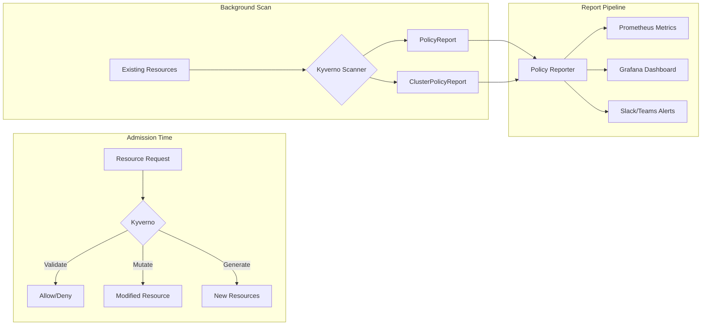
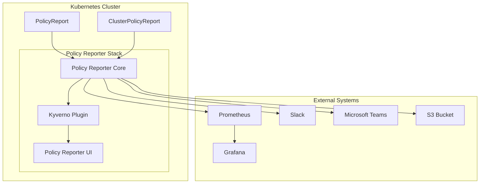
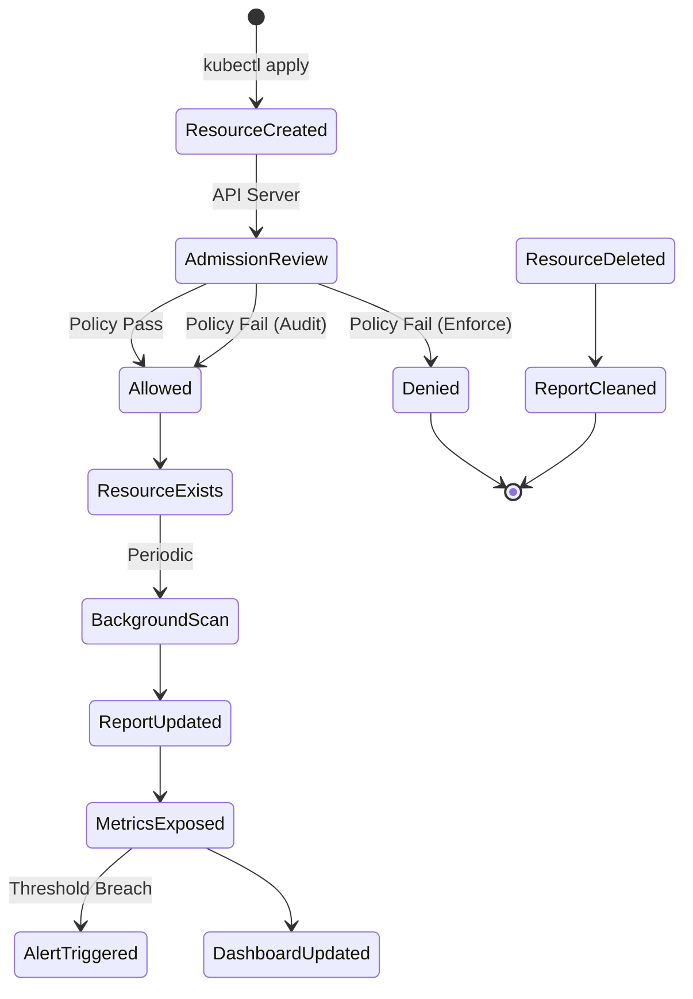

# How to Implement Kyverno Policy Reports

Author: [nawazdhandala](https://github.com/nawazdhandala)

Tags: Kyverno, Kubernetes, Compliance, Reporting

Description: Learn how to use Kyverno PolicyReports and ClusterPolicyReports to track compliance status across your Kubernetes clusters with metrics, alerting, and dashboards.

---

Kyverno validates, mutates, and generates Kubernetes resources based on policies. But policies are only half the story. You need visibility into what passed, what failed, and what was blocked. That is where Policy Reports come in.

## Understanding Policy Reports

Kyverno generates two types of reports following the Kubernetes Policy Working Group standard:

- **PolicyReport** - Namespaced resource showing results for a specific namespace
- **ClusterPolicyReport** - Cluster-scoped resource showing results for cluster-wide policies



## Enabling Policy Reports

Policy reports are enabled by default in Kyverno. Verify they are working:

```bash
# Check if PolicyReport CRDs exist
kubectl get crd | grep policyreport

# Expected output:
# clusterpolicyreports.wgpolicyk8s.io
# policyreports.wgpolicyk8s.io
```

## PolicyReport Resource Structure

A PolicyReport contains results for all policy evaluations in a namespace.

```yaml
apiVersion: wgpolicyk8s.io/v1alpha2
kind: PolicyReport
metadata:
  name: polr-ns-default
  namespace: default
# Summary counts for quick overview
summary:
  pass: 45
  fail: 3
  warn: 2
  error: 0
  skip: 1
# Individual policy results
results:
  - policy: require-labels
    rule: check-team-label
    # Result can be: pass, fail, warn, error, skip
    result: fail
    # Severity from policy definition
    severity: medium
    # Category for grouping
    category: Best Practices
    message: "validation error: The label 'team' is required."
    # Resource that was evaluated
    resources:
      - apiVersion: v1
        kind: Pod
        name: nginx-without-labels
        namespace: default
        uid: a1b2c3d4-e5f6-7890-abcd-ef1234567890
    # Timestamp of evaluation
    timestamp:
      nanos: 0
      seconds: 1706620800
```

## ClusterPolicyReport Structure

ClusterPolicyReports track cluster-scoped resources and ClusterPolicy results.

```yaml
apiVersion: wgpolicyk8s.io/v1alpha2
kind: ClusterPolicyReport
metadata:
  name: clusterpolicyreport
# Summary across entire cluster
summary:
  pass: 120
  fail: 8
  warn: 5
  error: 0
  skip: 2
results:
  - policy: disallow-privileged-containers
    rule: privileged-containers
    result: fail
    severity: high
    category: Pod Security
    message: "Privileged mode is disallowed."
    resources:
      - apiVersion: v1
        kind: Pod
        name: debug-pod
        namespace: kube-system
        uid: f1e2d3c4-b5a6-7890-fedc-ba0987654321
```

## Configuring Report Generation

### Background Scan Interval

Kyverno periodically scans existing resources. Configure the interval:

```yaml
# Kyverno ConfigMap
apiVersion: v1
kind: ConfigMap
metadata:
  name: kyverno
  namespace: kyverno
data:
  # Scan existing resources every hour (default: 1h)
  backgroundScanInterval: "1h"
  # Number of workers for background scanning
  backgroundScanWorkers: "2"
```

### Report History

Control how many reports to retain:

```yaml
# Helm values for Kyverno installation
config:
  # Keep last 10000 report entries
  reportChunkSize: 1000
  # Enable/disable report generation
  generateReports: true
```

## Scanning Existing Resources

When you create or update a policy, Kyverno automatically scans existing resources. Force an immediate scan:

```bash
# Trigger background scan by restarting Kyverno
kubectl rollout restart deployment kyverno -n kyverno

# Or annotate a policy to trigger rescan
kubectl annotate clusterpolicy require-labels \
  policies.kyverno.io/rescan=true --overwrite
```

### Viewing Reports

```bash
# List all PolicyReports
kubectl get policyreport -A

# Get report for specific namespace
kubectl get policyreport -n production -o yaml

# List ClusterPolicyReports
kubectl get clusterpolicyreport

# Get detailed report with results
kubectl get policyreport -n default polr-ns-default -o yaml
```

### Filtering Failed Results

```bash
# Find all failing policies using jsonpath
kubectl get policyreport -A -o jsonpath='{range .items[*]}{.metadata.namespace}{"\t"}{.summary.fail}{"\n"}{end}'

# Get details of failures
kubectl get policyreport -n production -o json | \
  jq '.results[] | select(.result=="fail")'
```

## Installing Policy Reporter

Policy Reporter provides a UI, metrics, and alerting for Kyverno reports.

```bash
# Add the Policy Reporter Helm repository
helm repo add policy-reporter https://kyverno.github.io/policy-reporter
helm repo update

# Install Policy Reporter with UI
helm install policy-reporter policy-reporter/policy-reporter \
  --namespace policy-reporter \
  --create-namespace \
  --set ui.enabled=true \
  --set kyvernoPlugin.enabled=true
```

### Policy Reporter Architecture



### Accessing the UI

```bash
# Port forward to access the UI locally
kubectl port-forward svc/policy-reporter-ui -n policy-reporter 8080:8080

# Open browser to http://localhost:8080
```

## Prometheus Metrics

Policy Reporter exposes Prometheus metrics for compliance tracking.

### Available Metrics

```promql
# Total policy results by status
policy_report_summary{
  namespace="production",
  status="fail"
}

# Individual policy results
policy_report_result{
  policy="require-labels",
  rule="check-team-label",
  kind="Pod",
  name="nginx",
  namespace="default",
  status="fail",
  severity="medium",
  category="Best Practices"
}

# Cluster policy results
cluster_policy_report_result{
  policy="disallow-privileged",
  rule="privileged-containers",
  kind="Pod",
  status="fail",
  severity="high"
}
```

### ServiceMonitor for Prometheus Operator

```yaml
apiVersion: monitoring.coreos.com/v1
kind: ServiceMonitor
metadata:
  name: policy-reporter
  namespace: policy-reporter
  labels:
    release: prometheus
spec:
  selector:
    matchLabels:
      app.kubernetes.io/name: policy-reporter
  endpoints:
    # Scrape metrics endpoint
    - port: http
      path: /metrics
      interval: 30s
```

### Prometheus Recording Rules

Pre-calculate common queries for dashboard performance:

```yaml
apiVersion: monitoring.coreos.com/v1
kind: PrometheusRule
metadata:
  name: policy-report-rules
  namespace: monitoring
spec:
  groups:
    - name: policy-reports
      interval: 1m
      rules:
        # Total failures per namespace
        - record: policy_report:failures:sum_by_namespace
          expr: |
            sum by (namespace) (
              policy_report_summary{status="fail"}
            )
        # Total failures per policy
        - record: policy_report:failures:sum_by_policy
          expr: |
            sum by (policy) (
              policy_report_result{status="fail"}
            )
        # Compliance percentage per namespace
        - record: policy_report:compliance_percentage:by_namespace
          expr: |
            100 * (
              sum by (namespace) (policy_report_summary{status="pass"})
              /
              (sum by (namespace) (policy_report_summary{status="pass"})
               + sum by (namespace) (policy_report_summary{status="fail"}))
            )
```

## Alerting Configuration

### PrometheusRule for Alerting

```yaml
apiVersion: monitoring.coreos.com/v1
kind: PrometheusRule
metadata:
  name: policy-report-alerts
  namespace: monitoring
spec:
  groups:
    - name: policy-compliance
      rules:
        # Alert on high severity policy failures
        - alert: HighSeverityPolicyViolation
          expr: |
            policy_report_result{status="fail", severity="high"} > 0
          for: 5m
          labels:
            severity: critical
          annotations:
            summary: "High severity policy violation detected"
            description: |
              Policy {{ $labels.policy }} rule {{ $labels.rule }}
              is failing for {{ $labels.kind }}/{{ $labels.name }}
              in namespace {{ $labels.namespace }}

        # Alert when compliance drops below threshold
        - alert: LowComplianceRate
          expr: |
            policy_report:compliance_percentage:by_namespace < 90
          for: 15m
          labels:
            severity: warning
          annotations:
            summary: "Compliance rate below 90%"
            description: |
              Namespace {{ $labels.namespace }} has compliance rate
              of {{ $value | printf "%.1f" }}%

        # Alert on any new failures
        - alert: NewPolicyFailure
          expr: |
            increase(policy_report_summary{status="fail"}[10m]) > 0
          labels:
            severity: warning
          annotations:
            summary: "New policy failures detected"
            description: |
              {{ $value }} new policy failures in namespace
              {{ $labels.namespace }}
```

### Policy Reporter Native Alerting

Configure Policy Reporter to send alerts directly:

```yaml
# Helm values for Policy Reporter
target:
  slack:
    webhook: "https://hooks.slack.com/services/xxx/yyy/zzz"
    # Only send fail and error results
    minimumPriority: "warning"
    # Skip passed results
    skipExistingOnStartup: true
    # Custom channel per namespace
    channels:
      - channel: "#security-alerts"
        filter:
          namespaces:
            include: ["production", "staging"]
          severities: ["high", "critical"]

  teams:
    webhook: "https://outlook.office.com/webhook/xxx"
    minimumPriority: "warning"

  # Store reports in S3 for audit trail
  s3:
    bucket: "policy-reports-audit"
    region: "us-east-1"
    prefix: "kyverno/"
    # Use IRSA for authentication
    secretAccessKey: ""
    accessKeyID: ""
```

## Grafana Dashboard

### Dashboard JSON

```json
{
  "title": "Kyverno Policy Compliance",
  "panels": [
    {
      "title": "Compliance Overview",
      "type": "gauge",
      "targets": [
        {
          "expr": "avg(policy_report:compliance_percentage:by_namespace)",
          "legendFormat": "Overall Compliance"
        }
      ],
      "fieldConfig": {
        "defaults": {
          "min": 0,
          "max": 100,
          "unit": "percent",
          "thresholds": {
            "steps": [
              {"value": 0, "color": "red"},
              {"value": 80, "color": "yellow"},
              {"value": 95, "color": "green"}
            ]
          }
        }
      }
    },
    {
      "title": "Failures by Namespace",
      "type": "timeseries",
      "targets": [
        {
          "expr": "sum by (namespace) (policy_report_summary{status=\"fail\"})",
          "legendFormat": "{{ namespace }}"
        }
      ]
    },
    {
      "title": "Top Failing Policies",
      "type": "table",
      "targets": [
        {
          "expr": "topk(10, sum by (policy) (policy_report_result{status=\"fail\"}))",
          "format": "table"
        }
      ]
    },
    {
      "title": "Failures by Severity",
      "type": "piechart",
      "targets": [
        {
          "expr": "sum by (severity) (policy_report_result{status=\"fail\"})",
          "legendFormat": "{{ severity }}"
        }
      ]
    }
  ]
}
```

## Sample Policies with Reporting

### Policy with Compliance Metadata

```yaml
apiVersion: kyverno.io/v1
kind: ClusterPolicy
metadata:
  name: require-resource-limits
  annotations:
    # These annotations appear in reports
    policies.kyverno.io/title: Require Resource Limits
    policies.kyverno.io/category: Best Practices
    policies.kyverno.io/severity: medium
    policies.kyverno.io/subject: Pod
    policies.kyverno.io/description: >-
      All containers must have CPU and memory limits defined
      to prevent resource exhaustion.
spec:
  # Generate reports for existing resources
  background: true
  validationFailureAction: Audit
  rules:
    - name: validate-limits
      match:
        any:
          - resources:
              kinds:
                - Pod
      validate:
        message: "CPU and memory limits are required for all containers."
        pattern:
          spec:
            containers:
              - resources:
                  limits:
                    memory: "?*"
                    cpu: "?*"
```

### Policy for Security Compliance

```yaml
apiVersion: kyverno.io/v1
kind: ClusterPolicy
metadata:
  name: disallow-latest-tag
  annotations:
    policies.kyverno.io/title: Disallow Latest Tag
    policies.kyverno.io/category: Security
    policies.kyverno.io/severity: high
    policies.kyverno.io/subject: Pod
spec:
  background: true
  validationFailureAction: Audit
  rules:
    - name: validate-image-tag
      match:
        any:
          - resources:
              kinds:
                - Pod
      validate:
        message: "Images must use a specific tag, not 'latest'."
        pattern:
          spec:
            containers:
              - image: "!*:latest"
```

## Automated Compliance Reports

### CronJob for Compliance Summary

```yaml
apiVersion: batch/v1
kind: CronJob
metadata:
  name: compliance-report
  namespace: policy-reporter
spec:
  # Run daily at midnight
  schedule: "0 0 * * *"
  jobTemplate:
    spec:
      template:
        spec:
          serviceAccountName: compliance-reporter
          containers:
            - name: reporter
              image: bitnami/kubectl:latest
              command:
                - /bin/sh
                - -c
                - |
                  # Generate compliance summary
                  echo "=== Daily Compliance Report ==="
                  echo "Date: $(date -u +%Y-%m-%d)"
                  echo ""

                  # Get summary per namespace
                  echo "Namespace Compliance:"
                  for ns in $(kubectl get ns -o name | cut -d/ -f2); do
                    report=$(kubectl get policyreport -n $ns -o json 2>/dev/null)
                    if [ -n "$report" ]; then
                      pass=$(echo $report | jq '[.items[].summary.pass // 0] | add')
                      fail=$(echo $report | jq '[.items[].summary.fail // 0] | add')
                      total=$((pass + fail))
                      if [ $total -gt 0 ]; then
                        pct=$((pass * 100 / total))
                        echo "  $ns: $pct% ($pass pass, $fail fail)"
                      fi
                    fi
                  done

                  echo ""
                  echo "=== High Severity Failures ==="
                  kubectl get policyreport -A -o json | \
                    jq -r '.items[].results[] |
                      select(.result=="fail" and .severity=="high") |
                      "\(.resources[0].namespace)/\(.resources[0].name): \(.policy)/\(.rule)"'
          restartPolicy: Never
```

### RBAC for Compliance Reporter

```yaml
apiVersion: v1
kind: ServiceAccount
metadata:
  name: compliance-reporter
  namespace: policy-reporter
---
apiVersion: rbac.authorization.k8s.io/v1
kind: ClusterRole
metadata:
  name: compliance-reporter
rules:
  - apiGroups: ["wgpolicyk8s.io"]
    resources: ["policyreports", "clusterpolicyreports"]
    verbs: ["get", "list"]
  - apiGroups: [""]
    resources: ["namespaces"]
    verbs: ["get", "list"]
---
apiVersion: rbac.authorization.k8s.io/v1
kind: ClusterRoleBinding
metadata:
  name: compliance-reporter
roleRef:
  apiGroup: rbac.authorization.k8s.io
  kind: ClusterRole
  name: compliance-reporter
subjects:
  - kind: ServiceAccount
    name: compliance-reporter
    namespace: policy-reporter
```

## Report Lifecycle



## Troubleshooting

### Reports Not Generating

```bash
# Check Kyverno controller logs
kubectl logs -n kyverno -l app.kubernetes.io/component=kyverno \
  --tail=100 | grep -i report

# Verify background scanning is enabled
kubectl get cm kyverno -n kyverno -o yaml | grep background

# Check if policy has background enabled
kubectl get clusterpolicy require-labels -o yaml | grep background
```

### Reports Missing Results

```bash
# Ensure policy matches resources
kubectl get pods -A --show-labels

# Test policy against specific resource
kubectl get pod nginx -o yaml | kyverno apply policy.yaml --resource -

# Check for policy exceptions
kubectl get policyexception -A
```

### Metrics Not Appearing

```bash
# Verify Policy Reporter is running
kubectl get pods -n policy-reporter

# Check metrics endpoint
kubectl port-forward svc/policy-reporter -n policy-reporter 8080:8080
curl http://localhost:8080/metrics | grep policy_report

# Verify ServiceMonitor is detected
kubectl get servicemonitor -n policy-reporter
```

## Best Practices

1. **Use Audit mode first** - Set `validationFailureAction: Audit` to generate reports without blocking resources. Switch to `Enforce` after reviewing reports.

2. **Add metadata to policies** - Use annotations for title, category, severity, and description. These appear in reports and make filtering easier.

3. **Set appropriate severities** - Reserve `high` and `critical` for security issues. Use `medium` for best practices and `low` for informational policies.

4. **Configure retention** - Policy reports can grow large. Configure cleanup policies or use external storage for audit trails.

5. **Monitor the monitors** - Alert on Policy Reporter health, not just policy failures. A silent reporter is worse than no reporter.

6. **Integrate with CI/CD** - Use `kyverno apply` in pipelines to catch violations before deployment.

---

Policy Reports transform Kyverno from a gatekeeper into a compliance platform. You get visibility into your cluster's security posture, historical trends, and automated alerting. Start with audit mode, build your dashboards, and gradually move critical policies to enforcement as your confidence grows.
